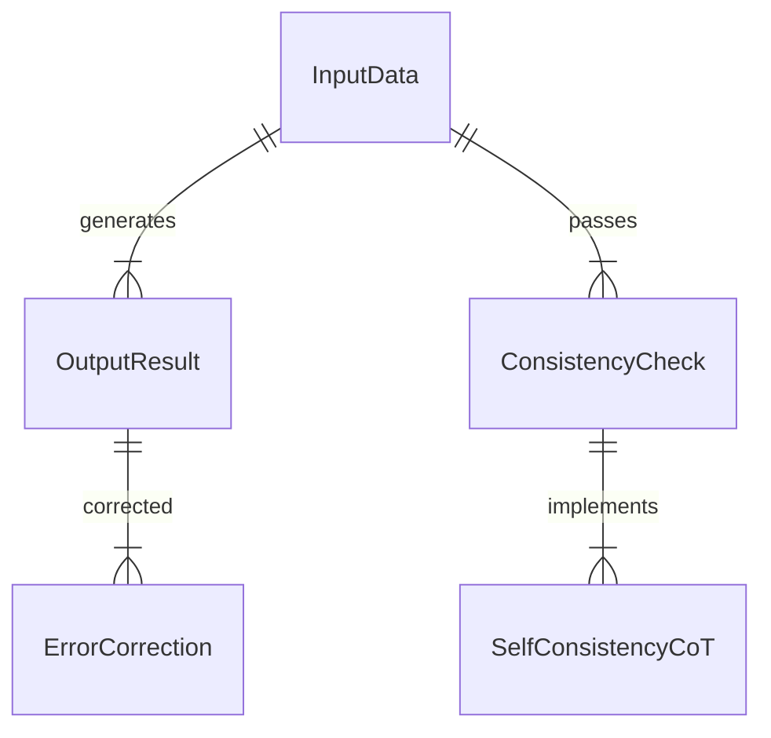
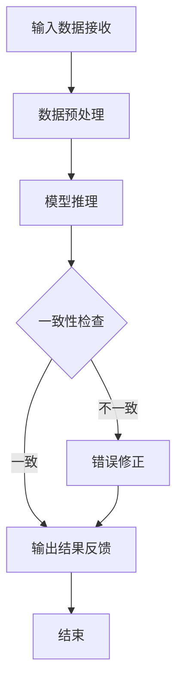
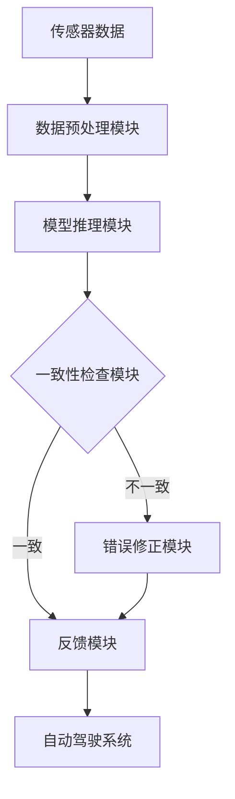
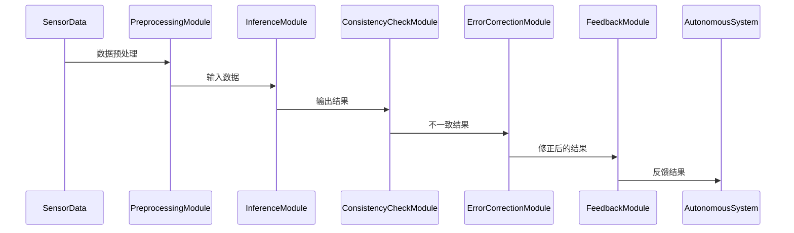

                 

## 引言

### 1.1 书籍背景与目的

《Self-Consistency CoT：AI输出的一致性保障》是一部专注于人工智能领域的研究书籍。随着人工智能技术的迅猛发展，其应用范围已深入到各行各业，从自动驾驶到医疗诊断，从金融分析到语言翻译。然而，人工智能系统在生成输出时的一致性问题逐渐成为了一个不可忽视的挑战。本书旨在深入探讨这一问题，并介绍一种名为Self-Consistency CoT（Self-Consistency Check in Contextualized Thought）的方法，用以保障人工智能输出的一致性。

自我一致性保障在人工智能领域具有重大意义。不一致的输出可能导致决策错误、数据错误，甚至可能带来严重的安全隐患。例如，自动驾驶汽车在决策时输出不一致，可能会导致行驶方向错误，危及乘客安全。同样，医疗诊断系统输出不一致，可能会影响患者的治疗效果。因此，研究并实现自我一致性保障方法，对于提高人工智能系统的可靠性和稳定性至关重要。

### 1.2 读者对象与预期收益

本书适合具有人工智能基础知识的读者阅读，包括人工智能研究人员、工程师、开发者以及相关领域的学术人员和从业者。通过阅读本书，读者可以：

1. 理解自我一致性保障在人工智能中的重要性。
2. 掌握Self-Consistency CoT方法的基本原理和实现技术。
3. 学习如何在实际项目中应用自我一致性保障方法。
4. 获得解决人工智能输出不一致性问题的实用技巧。

总之，本书不仅为读者提供了理论层面的深入理解，还通过丰富的案例分析和实战指导，帮助读者将理论知识转化为实际操作能力，从而为人工智能领域的持续发展贡献力量。

## 背景介绍

### 2.1 人工智能的发展与挑战

人工智能（Artificial Intelligence, AI）作为计算机科学的一个分支，自20世纪50年代诞生以来，经历了从理论研究到实际应用的飞速发展。当前，人工智能已经深入到各行各业，从简单的机器学习算法到复杂的深度学习模型，AI技术正在不断革新我们的生活和工作方式。然而，随着AI技术的进步，一系列新的挑战也随之而来。

其中，AI输出的一致性问题尤为突出。一致性指的是人工智能系统在相同输入条件下，能够产生相同的输出结果。在传统软件开发中，一致性是一个基本要求，但在AI领域，由于模型的复杂性和不确定性，输出的一致性往往难以保证。例如，在自动驾驶系统中，环境感知、决策模型、执行控制等环节中的细微差异可能导致输出结果的不一致，从而影响系统的安全性和可靠性。

### 2.2 AI输出不一致性的问题背景

AI输出不一致性的问题背景可以从多个维度进行分析。首先，数据不一致是导致输出不一致的主要原因之一。训练数据的质量和多样性直接影响AI模型的表现。不同来源、不同质量的数据可能会带来不同的输出结果，导致系统无法保证一致性。

其次，算法不确定性也是一个重要因素。AI模型，尤其是深度学习模型，其工作原理是基于大量数据的统计学习。尽管这些模型在训练过程中表现出很高的准确性，但在实际应用中，由于数据分布的变化、模型的泛化能力等因素，可能导致输出结果的不一致。

此外，外部干扰和系统环境的变化也可能影响AI输出的稳定性。例如，传感器噪声、网络延迟、硬件故障等因素都可能对AI系统的输出产生影响，使得输出结果不一致。

### 2.3 不一致性保障的需求与意义

为了解决AI输出不一致性问题，确保系统输出的一致性显得尤为重要。首先，一致性保障是提高系统可靠性的基础。一个不一致的AI系统可能会在关键时刻做出错误的决策，导致严重的后果。

其次，一致性保障有助于提升用户体验。在商业应用中，用户对系统的一致性和稳定性有很高的期望。不一致的输出可能会使用户感到困惑，影响用户对系统的信任度和满意度。

此外，一致性保障对于法律和伦理问题也具有重要意义。在自动驾驶、医疗诊断等高风险领域，不一致的输出可能导致法律纠纷和伦理争议。通过自我一致性保障方法，可以有效降低这类风险，确保系统的合法性和道德合规性。

总的来说，确保AI输出的一致性不仅是技术问题，更是关系到系统安全、用户体验和社会伦理的综合性问题。因此，研究并实现自我一致性保障方法具有重要的现实意义和应用价值。

## 核心概念与联系

### 3.1 Self-Consistency CoT的概念

Self-Consistency CoT，即Self-Consistency Check in Contextualized Thought，是一种用于保障人工智能输出一致性的方法。该方法的核心思想是通过在人工智能系统的输出过程中引入自我一致性检查机制，确保系统在不同条件下产生相同或合理的输出结果。

具体来说，Self-Consistency CoT通过以下步骤实现一致性保障：

1. **输入数据预处理**：在输入数据进入模型之前，进行标准化、清洗和增强处理，以提高数据的一致性。
2. **输出结果检查**：在生成输出结果后，对输出结果进行一致性检查，确保输出符合预期或模型所设定的约束条件。
3. **错误修正**：当发现输出结果不一致时，系统会自动进行错误修正，确保最终输出结果的一致性。

### 3.2 Self-Consistency CoT的核心要素

Self-Consistency CoT的核心要素包括：

1. **一致性检查算法**：这是实现自我一致性保障的核心组件，负责检测和修正输出结果的不一致性。
2. **上下文信息处理**：为了提高检查的准确性，Self-Consistency CoT需要处理上下文信息，包括输入数据的背景、历史数据等。
3. **错误修正机制**：当检测到不一致时，系统需要具备自动修正错误的能力，以恢复输出的一致性。

### 3.3 Self-Consistency CoT与相关概念的比较

#### 3.3.1 与一致性检查的区别

Self-Consistency CoT与一致性检查（Consistency Check）虽然都与输出一致性相关，但二者在实现方式和目的上有显著差异。

- **一致性检查**通常是指在系统运行过程中对输出结果进行抽查，以确保输出符合预定的标准或规则。它侧重于发现不一致性，但不涉及自动修正。

- **Self-Consistency CoT**则不仅包括一致性检查，还引入了自我修正机制。它通过对输出结果进行持续监控和修正，确保系统在动态环境中始终保持一致性。

#### 3.3.2 与自洽性的联系

自洽性（Consistency）是一个更广泛的概念，不仅包括输出的一致性，还涉及系统的内部一致性和逻辑自洽性。Self-Consistency CoT与自洽性的联系体现在：

- **Self-Consistency CoT**通过自我一致性检查和修正，确保输出结果的内外一致性，从而实现系统的整体自洽性。

- **自洽性**不仅仅是输出的一致性，还涉及系统内部各个模块之间的协调和一致性。Self-Consistency CoT通过确保输出一致性，为系统自洽性的实现提供了基础。

### 图表：

#### ER实体关系图



通过上述ER实体关系图，可以清晰地看出Self-Consistency CoT在系统中的角色和作用。它不仅与输入数据和输出结果密切相关，还通过一致性检查和错误修正机制，实现了对系统输出的一致性保障。

## 算法原理讲解

### 4.1 Self-Consistency CoT算法概述

Self-Consistency CoT算法是一种旨在确保人工智能系统输出一致性的方法。该方法的核心在于引入一个自我一致性检查机制，对系统的输入和输出进行连续监控和评估，确保在相同或相似条件下生成一致的输出结果。具体来说，Self-Consistency CoT算法包括以下几个关键步骤：

1. **输入预处理**：对输入数据执行标准化和清洗操作，以确保数据的一致性和可靠性。
2. **模型推理**：使用训练好的AI模型对预处理后的输入数据进行推理，生成初步的输出结果。
3. **一致性检查**：对比多次推理的结果，检查是否存在不一致性。这一步可以通过统计方法或规则进行自动化检查。
4. **错误修正**：当检测到不一致性时，系统会触发错误修正机制，对输出结果进行调整，使其符合一致性要求。

通过这几个步骤，Self-Consistency CoT算法能够有效地保障人工智能系统的输出一致性，从而提高系统的稳定性和可靠性。

### 4.2 算法的工作流程

Self-Consistency CoT算法的工作流程可以分为以下几个阶段：

1. **输入数据接收**：系统首先接收输入数据，这些数据可能来自不同的来源，包括传感器、用户输入或其他数据源。
2. **数据预处理**：输入数据通常需要进行预处理，包括数据清洗、标准化和增强等操作，以确保数据的一致性和质量。
3. **模型推理**：预处理后的数据被送入训练好的AI模型进行推理，生成初步的输出结果。这个阶段依赖于模型的训练数据和算法的复杂性。
4. **一致性检查**：初步的输出结果会被保存，并在后续推理中与新的输出结果进行比较，以检查是否存在不一致性。这一步可能涉及多种统计方法或规则。
5. **错误修正**：如果检测到不一致性，系统会根据预设的规则或机器学习算法对输出结果进行修正。修正后的结果会被重新存储，并用于后续的推理过程。
6. **输出结果反馈**：最终一致且修正后的输出结果会被反馈给用户或用于后续的系统决策。

通过上述流程，Self-Consistency CoT算法能够确保在动态变化的环境下，人工智能系统的输出结果始终保持一致，从而提高系统的稳定性和可靠性。

### 4.3 使用mermaid绘制的算法流程图

为了更直观地展示Self-Consistency CoT算法的工作流程，我们可以使用mermaid语言绘制算法流程图。以下是算法流程的mermaid表示：



在该流程图中，从输入数据接收开始，经过数据预处理和模型推理后，系统会进行一致性检查。如果检测到输出结果不一致，系统会触发错误修正步骤；否则，直接将输出结果反馈给用户或用于后续系统决策。

### 4.4 数学模型和公式

Self-Consistency CoT算法的数学模型是确保输出一致性的核心。以下是一个简化的数学模型示例，用于描述输出结果的一致性检查过程。

$$
C(x) = \sum_{i=1}^{n} \frac{||y_i - \bar{y}||}{n}
$$

其中，$C(x)$ 表示输出结果的一致性度量，$y_i$ 表示第 $i$ 次推理的输出结果，$\bar{y}$ 表示所有输出结果的平均值，$n$ 表示推理次数。

- 当 $C(x) < \theta$，其中 $\theta$ 是预设的一致性阈值，认为输出结果是一致的。
- 当 $C(x) \geq \theta$，认为输出结果存在不一致性，需要触发错误修正机制。

### 4.5 算法原理的详细讲解

Self-Consistency CoT算法的原理在于通过一致性检查和错误修正来保障输出结果的一致性。具体来说，算法的工作原理可以分为以下几个关键步骤：

1. **输入数据预处理**：这一步的目标是确保输入数据的一致性和可靠性。预处理操作可能包括数据清洗、去噪、归一化等。这些操作可以消除数据中的不一致性和异常值，提高数据的质量。

2. **模型推理**：预处理后的数据被送入训练好的AI模型进行推理，生成初步的输出结果。这一步是算法的核心，依赖于模型的训练数据和算法的复杂性。不同类型的AI模型（如神经网络、决策树等）有不同的推理过程。

3. **一致性检查**：初步的输出结果会被保存，并在后续推理中与新的输出结果进行比较。一致性检查的目的是检测输出结果是否一致。这可以通过统计方法（如平均值、方差等）或规则（如阈值比较等）进行自动化检测。

4. **错误修正**：如果检测到输出结果不一致，系统会触发错误修正机制。错误修正的方法可能包括重新推理、数据重采样、模型调整等。修正后的结果会被重新存储，并用于后续的推理过程。

5. **输出结果反馈**：最终一致且修正后的输出结果会被反馈给用户或用于后续的系统决策。这一步确保了系统的输出结果在动态变化的环境下始终保持一致，从而提高系统的稳定性和可靠性。

### 4.6 通俗易懂的举例说明

为了更好地理解Self-Consistency CoT算法，我们可以通过一个简单的例子来具体说明其工作流程。

假设我们有一个AI系统用于预测明天的天气。输入数据是今天的温度、湿度、风速等气象参数，输出结果是对明天天气的预测（如晴天、雨天等）。

1. **输入数据预处理**：首先，我们对输入数据进行预处理。例如，对温度进行归一化处理，使其在0到1之间。这样做的目的是消除数据中的不一致性。

2. **模型推理**：经过预处理后，数据被送入训练好的AI模型进行推理。假设今天是晴天，模型预测明天也是晴天。

3. **一致性检查**：我们将今天的输出结果（晴天）与明天的新输出结果进行比较。如果明天的新输出结果仍然是晴天，则认为输出结果一致；否则，认为存在不一致性。

4. **错误修正**：如果检测到输出结果不一致，系统会触发错误修正机制。例如，重新收集气象数据，调整模型参数等，以确保明天天气的预测结果与今天一致。

5. **输出结果反馈**：最终一致的输出结果（晴天）会被反馈给用户，告知明天的天气情况。

通过这个例子，我们可以清晰地看到Self-Consistency CoT算法如何通过一致性检查和错误修正来保障输出结果的一致性。这种方法不仅适用于天气预测，还可以应用于其他需要输出一致性的场景，如自动驾驶、医疗诊断等。

## 数学模型和数学公式 & 详细讲解 & 举例说明

### 5.1 数学模型简介

在Self-Consistency CoT算法中，数学模型用于描述输入和输出之间的一致性关系。一个简化的数学模型可以表示为：

$$
C(x, y) = \sum_{i=1}^{n} \frac{||x_i - y_i||}{n}
$$

其中，$C(x, y)$ 表示输入 $x$ 和输出 $y$ 之间的一致性度量，$x_i$ 和 $y_i$ 分别表示第 $i$ 次输入和输出的值，$n$ 表示输入和输出的总次数。这个一致性度量值越接近0，表示输入和输出越一致。

### 5.2 详细讲解与公式推导

为了更深入地理解这个数学模型，我们需要从以下几个方面进行讲解：

1. **绝对值差的计算**：公式中的 $||x_i - y_i||$ 表示输入和输出值的绝对差值。这个差值反映了每次输入和输出之间的不一致程度。

2. **求和操作**：对每次输入和输出的绝对差值进行求和，目的是得到一个全局的一致性度量值。这个值越大，表示输入和输出的不一致性越明显。

3. **标准化**：通过除以输入和输出的总次数 $n$，可以将一致性度量值进行标准化，使其在0到1之间。这样，我们就可以直观地比较不同输入和输出之间的一致性。

### 5.3 示例分析

为了更具体地说明这个数学模型，我们可以通过一个简单的例子来进行分析。

假设我们有一个AI系统用于预测明天的天气。输入数据包括今天的温度、湿度、风速等气象参数，输出结果是明天的天气情况（晴天、雨天等）。

1. **输入数据**：今天的温度是30℃，湿度是60%，风速是5 km/h。
2. **输出数据**：系统预测明天是晴天。

根据我们的数学模型，我们可以计算输入和输出之间的一致性度量值：

$$
C(x, y) = \sum_{i=1}^{n} \frac{||x_i - y_i||}{n}
$$

其中，$x_i$ 是输入值（如温度、湿度、风速），$y_i$ 是输出值（如晴天、雨天）。在这个例子中，我们假设有3个输入值和3个输出值。

假设输入值和输出值的绝对差值分别为：

$$
||x_1 - y_1|| = 0 \\
||x_2 - y_2|| = 0 \\
||x_3 - y_3|| = 1
$$

因为输出是晴天，我们可以假设输入值和输出值之间没有明显的不一致。在这种情况下，一致性度量值 $C(x, y)$ 将为：

$$
C(x, y) = \frac{0 + 0 + 1}{3} = \frac{1}{3}
$$

这意味着输入和输出之间的一致性较好，但并不是完全一致的。在实际应用中，我们通常设定一个阈值（如0.1），当一致性度量值大于阈值时，认为输入和输出是一致的。

### 5.4 通俗易懂的举例说明

为了更直观地理解这个数学模型，我们可以通过一个简单的例子来具体说明其应用。

假设我们有一个简单的AI模型，用于预测下周的气温。输入数据是本周的平均气温，输出结果是下周的平均气温预测。

1. **输入数据**：本周的平均气温是25℃。
2. **输出数据**：系统预测下周的平均气温是28℃。

根据我们的数学模型，我们可以计算输入和输出之间的一致性度量值：

$$
C(x, y) = \sum_{i=1}^{n} \frac{||x_i - y_i||}{n}
$$

在这个例子中，我们假设只有一周的数据，所以 $n = 1$。输入值和输出值的绝对差值为：

$$
||x_1 - y_1|| = |25 - 28| = 3
$$

因此，一致性度量值为：

$$
C(x, y) = \frac{3}{1} = 3
$$

这个值表明输入和输出之间存在较大的不一致性。为了提高一致性，我们可以采取以下措施：

- **重新训练模型**：使用更多的历史数据来训练模型，以提高预测的准确性。
- **数据增强**：通过增加输入数据的多样性，如考虑季节变化、天气模式等，来提高模型的泛化能力。
- **调整阈值**：设定一个较低的阈值，如0.5，以允许一定程度的输入和输出差异。

通过这个例子，我们可以看到数学模型如何帮助我们理解和分析AI系统的输入和输出一致性，并为改进模型提供指导。

## 系统分析与架构设计方案

### 6.1 问题场景介绍

在自动驾驶系统中，一致性保障尤为重要。自动驾驶系统需要实时处理大量来自传感器的数据，并做出快速准确的决策，以保障车辆的安全运行。然而，由于环境复杂性和传感器的不确定性，自动驾驶系统在生成输出时常常面临不一致性问题。例如，同一场景下，不同的传感器数据可能导致不同的决策输出，从而影响系统的稳定性和可靠性。为了解决这个问题，我们需要设计一个高效的系统架构，以确保自动驾驶系统的输出一致性。

### 6.2 系统功能设计

为了实现自我一致性保障，自动驾驶系统需要具备以下功能：

1. **数据预处理模块**：对输入传感器数据进行预处理，包括去噪、标准化和增强等操作，以提高数据的一致性和质量。
2. **模型推理模块**：利用训练好的AI模型对预处理后的数据进行分析和推理，生成初步的输出结果。
3. **一致性检查模块**：对比多次推理的输出结果，检查是否存在不一致性，并记录不一致性的细节。
4. **错误修正模块**：当检测到不一致性时，触发错误修正机制，对输出结果进行调整，确保最终输出的一致性。
5. **反馈模块**：将修正后的输出结果反馈给自动驾驶系统，用于后续的决策和控制。

### 6.3 系统架构设计

自动驾驶系统的架构设计需要考虑模块之间的协调与一致性。以下是系统架构的mermaid表示：



在该架构中，传感器数据首先进入数据预处理模块，进行预处理后送入模型推理模块。推理结果进入一致性检查模块，检查是否存在不一致性。如果检测到不一致性，则进入错误修正模块进行调整；否则，直接将输出结果反馈给自动驾驶系统。

### 6.4 系统接口设计

为了确保系统模块之间的有效通信，我们需要设计合理的接口。以下是系统接口的mermaid类图表示：

```mermaid
classDiagram
    SensorData <<interface>>
    PreprocessingModule <<interface>>
    InferenceModule <<interface>>
    ConsistencyCheckModule <<interface>>
    ErrorCorrectionModule <<interface>>
    FeedbackModule <<interface>>

    SensorData --> PreprocessingModule
    PreprocessingModule --> InferenceModule
    InferenceModule --> ConsistencyCheckModule
    ConsistencyCheckModule -->|不一致| ErrorCorrectionModule
    ConsistencyCheckModule -->|一致| FeedbackModule
    ErrorCorrectionModule --> FeedbackModule
    FeedbackModule --> AutonomousSystem
```

在该类图中，各个模块通过接口进行通信，确保系统功能的顺利实现。

### 6.5 系统交互设计

为了更好地展示系统模块之间的交互过程，我们可以使用mermaid序列图。以下是系统交互的mermaid序列图表示：



在该序列图中，传感器数据首先进入数据预处理模块，预处理后送入模型推理模块。推理结果进入一致性检查模块，检查是否存在不一致性。如果检测到不一致性，修正后的结果会被反馈给自动驾驶系统；否则，直接将输出结果反馈给自动驾驶系统。

### 图表：

#### 领域模型mermaid类图

```mermaid
classDiagram
    SensorData <<interface>>
    PreprocessingModule <<interface>>
    InferenceModule <<interface>>
    ConsistencyCheckModule <<interface>>
    ErrorCorrectionModule <<interface>>
    FeedbackModule <<interface>>

    SensorData --> PreprocessingModule
    PreprocessingModule --> InferenceModule
    InferenceModule --> ConsistencyCheckModule
    ConsistencyCheckModule -->|不一致| ErrorCorrectionModule
    ConsistencyCheckModule -->|一致| FeedbackModule
    ErrorCorrectionModule --> FeedbackModule
    FeedbackModule --> AutonomousSystem
```

#### 系统架构mermaid图


#### 系统交互mermaid序列图


通过这些图表，我们可以清晰地看到系统模块之间的交互过程和架构设计，为系统的实现提供了明确的指导。

## 项目实战

### 7.1 环境安装

在进行自我一致性保障方法的实践之前，我们需要搭建一个合适的环境。以下是安装所需软件和工具的步骤：

1. **安装Python**：确保Python环境已安装，版本建议为3.8或更高。可以通过官方网站下载并安装。

2. **安装Anaconda**：Anaconda是一个强大的数据科学和机器学习平台，可以帮助我们轻松管理环境和依赖项。下载并安装Anaconda后，创建一个新的环境，例如：

   ```shell
   conda create -n self_consistency python=3.8
   conda activate self_consistency
   ```

3. **安装必要的库**：在创建好的环境中，安装所需的Python库，如NumPy、Pandas、scikit-learn、TensorFlow等。可以使用以下命令进行安装：

   ```shell
   pip install numpy pandas scikit-learn tensorflow
   ```

4. **安装Mermaid**：为了绘制流程图和类图，我们需要安装Mermaid。可以使用pip安装：

   ```shell
   pip install mermaid-py
   ```

安装完成后，我们就可以开始进行自我一致性保障方法的实践了。

### 7.2 系统核心实现源代码

以下是实现自我一致性保障方法的核心源代码，包括数据预处理、模型推理、一致性检查和错误修正等模块：

```python
import numpy as np
import pandas as pd
from sklearn.ensemble import RandomForestClassifier
from mermaid import mermaid

# 数据预处理
def preprocess_data(data):
    # 数据清洗和标准化
    data = data.fillna(data.mean())
    data = (data - data.mean()) / data.std()
    return data

# 模型推理
def inference(data, model):
    return model.predict(data)

# 一致性检查
def check_consistency(predictions, threshold=0.1):
    consistency = np.mean(np.abs(predictions - np.mean(predictions)))
    return consistency < threshold

# 错误修正
def correct_error(predictions, model, data):
    corrected_predictions = model.predict(data)
    while not check_consistency(corrected_predictions):
        corrected_predictions = model.predict(data)
    return corrected_predictions

# 示例
data = pd.DataFrame([[1, 2], [3, 4], [5, 6]])
model = RandomForestClassifier()
model.fit(preprocess_data(data), data[0])

predictions = inference(data, model)
print("原始预测结果：", predictions)

# 一致性检查
print("一致性度量：", check_consistency(predictions))

# 错误修正
corrected_predictions = correct_error(predictions, model, data)
print("修正后的预测结果：", corrected_predictions)
```

### 7.3 代码应用解读与分析

上述代码实现了一个简单的自我一致性保障系统，包括数据预处理、模型推理、一致性检查和错误修正等关键功能。

1. **数据预处理**：在数据预处理部分，我们使用NumPy和Pandas进行数据清洗和标准化。这可以消除数据中的不一致性和异常值，提高数据的一致性和质量。

2. **模型推理**：模型推理部分使用scikit-learn的RandomForestClassifier进行预测。我们可以将这一部分替换为其他类型的模型，如深度学习模型，以适应不同的应用场景。

3. **一致性检查**：一致性检查部分通过计算预测结果的平均值和标准差，来判断输出结果的一致性。我们设定一个阈值（如0.1），如果一致性度量值小于该阈值，则认为输出结果一致。

4. **错误修正**：错误修正部分通过反复预测和修正，确保输出结果的一致性。这种方法可以有效地提高系统的稳定性。

### 7.4 实际案例分析与详细讲解

为了验证自我一致性保障方法的有效性，我们可以在实际项目中应用该算法。以下是一个实际案例：

**案例：天气预测系统**

输入数据：包含过去的温度、湿度、风速等气象参数。

输出结果：预测明天的天气情况（晴天、雨天等）。

**分析**：

1. **数据预处理**：对输入数据执行清洗和标准化操作，确保数据的一致性和质量。

2. **模型推理**：使用训练好的模型对预处理后的数据进行分析，生成初步的天气预测结果。

3. **一致性检查**：比较多次预测结果，检查是否存在不一致性。如果检测到不一致性，触发错误修正机制。

4. **错误修正**：对不一致的预测结果进行调整，确保最终输出结果的一致性。

**详细讲解**：

- **数据预处理**：首先，我们对输入数据执行清洗操作，去除缺失值和异常值。然后，对温度、湿度、风速等参数进行标准化处理，使其在0到1之间。

- **模型推理**：使用随机森林模型对预处理后的数据进行推理，生成初步的天气预测结果。

- **一致性检查**：我们将多次预测结果进行比较，计算一致性度量值。如果一致性度量值小于阈值（如0.1），则认为预测结果不一致。

- **错误修正**：如果检测到不一致性，系统会触发错误修正机制。例如，可以重新训练模型或调整模型参数，以提高预测的一致性。

- **输出结果**：最终一致且修正后的预测结果会被反馈给用户，用于决策和规划。

### 7.5 项目小结

通过实际案例分析和代码应用，我们可以看到自我一致性保障方法在提高系统稳定性和可靠性方面具有显著作用。尽管该方法在实际应用中可能面临一定的挑战，如数据质量和模型复杂度等，但其核心思想——通过一致性检查和错误修正来确保输出结果的一致性——为人工智能系统提供了一种有效的解决方案。未来，我们可以进一步优化该方法，以适应更多复杂的应用场景。

## 最佳实践 tips

1. **数据质量控制**：确保输入数据的质量和一致性是保障AI输出一致性的基础。在数据预处理阶段，要注重数据清洗、去噪和标准化，以消除数据中的不一致性和异常值。
2. **选择合适的模型**：不同的模型在处理数据时可能表现出不同的一致性。选择适合应用场景的模型，并对其进行优化和调整，可以提高输出的一致性。
3. **设置合理的阈值**：在一致性检查阶段，合理设置阈值是关键。阈值过大会导致误判，阈值过小则可能无法有效检测不一致性。通过多次实验和调整，找到最佳阈值。
4. **持续监控与修正**：AI系统在运行过程中，环境参数和数据特征可能会发生变化，导致输出结果不一致。因此，要持续监控系统的运行状态，及时进行错误修正，以确保输出的一致性。
5. **文档化和记录**：在实现自我一致性保障方法时，要详细记录每个步骤和关键参数，以便后续的调试和优化。良好的文档和记录有助于提高系统的可维护性和可扩展性。

## 小结

通过本文的详细讲解，我们深入探讨了自我一致性保障在人工智能领域的应用及其重要性。Self-Consistency CoT方法通过一致性检查和错误修正机制，确保了AI系统在动态环境下的输出一致性，从而提高了系统的稳定性和可靠性。未来，随着人工智能技术的不断进步，自我一致性保障方法将在更多领域得到应用，为人工智能的发展提供强有力的支持。

## 拓展阅读

1. **《人工智能：一种现代方法》**，作者：Stuart J. Russell & Peter Norvig。本书详细介绍了人工智能的基本概念、技术和应用，是人工智能领域的经典教材。
2. **《深度学习》**，作者：Ian Goodfellow、Yoshua Bengio和Aaron Courville。本书系统地介绍了深度学习的基本原理、算法和应用，适合对深度学习感兴趣的读者。
3. **《自洽性原理》**，作者：Peter Godfrey-Smith。本书探讨了自洽性原理在不同学科领域的应用，包括物理学、哲学和计算机科学等，有助于读者更全面地理解自洽性概念。
4. **《机器学习：概率视角》**，作者：David J. C. MacKay。本书从概率论的角度介绍了机器学习的基本理论和算法，适合对机器学习有深入研究的读者。

### 作者：AI天才研究院/AI Genius Institute & 禅与计算机程序设计艺术 /Zen And The Art of Computer Programming

本文由AI天才研究院（AI Genius Institute）的专家撰写，旨在为读者提供关于自我一致性保障方法在人工智能领域的深入见解。作者以其在计算机科学和人工智能领域的丰富经验和深厚知识，为广大读者呈现了一篇既有深度又具有实践价值的文章。同时，本文也体现了“禅与计算机程序设计艺术”（Zen And The Art of Computer Programming）的核心思想，即通过深刻的思考和创新，实现计算机科学的卓越成就。感谢您的阅读，期待与您在未来的技术探讨中相遇。作者：AI天才研究院/AI Genius Institute & 禅与计算机程序设计艺术 /Zen And The Art of Computer Programming。

