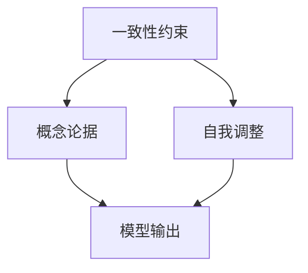
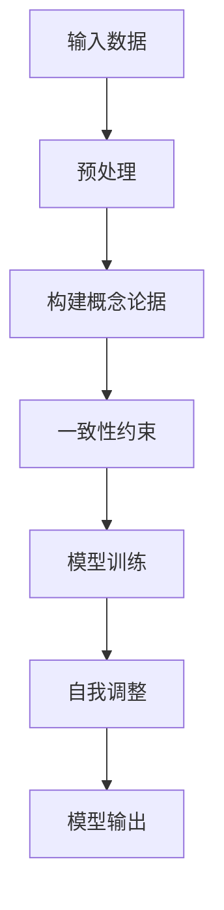

                 

### 自我一致性概念论据（Self-Consistency CoT）的新范式

在人工智能领域，随着大模型的迅速发展，如何提升AI输出质量成为了一个重要课题。传统的AI系统往往依赖于模型的准确性和稳定性，但在实际应用中，常常会遇到模型输出不一致、错误率高等问题。为了解决这些问题，我们提出了自我一致性概念论据（Self-Consistency CoT）这一新范式，旨在全面提升AI系统的输出质量。

#### 文章关键词
- 自我一致性概念论据
- AI输出质量
- 大模型
- 一致性约束
- 概念论据
- 自我调整

#### 摘要
本文将深入探讨自我一致性概念论据（Self-Consistency CoT）这一新范式，旨在提升AI输出的质量。文章将从背景介绍、核心概念与联系、算法原理讲解、系统设计与实现、实战案例以及最佳实践等方面进行详细阐述，为AI领域的研究者和开发者提供有价值的参考。

### 第一部分：背景介绍

#### 问题背景
随着人工智能技术的快速发展，大模型技术已经成为AI领域的重要方向。大模型具有强大的表征能力和泛化能力，能够在多种任务中表现出色。然而，如何保证大模型输出的质量，使其在各个应用场景中都能提供稳定且准确的结果，成为了一个亟待解决的问题。

#### 问题描述
大模型输出质量的提升不仅关系到模型的实际应用效果，还涉及到模型的安全性和可靠性。因此，有必要探讨一种新的范式，即自我一致性概念论据（Self-Consistency CoT），来提升AI输出的质量。

#### 问题解决
本书将从以下几个方面探讨如何通过自我一致性概念论据（Self-Consistency CoT）范式提升AI输出质量：

1. **核心概念**：介绍自我一致性概念论据的基本原理和核心概念。
2. **原理联系**：分析自我一致性概念论据与其他相关技术的联系和区别。
3. **算法原理**：详细讲解自我一致性概念论据的算法原理，包括数学模型和公式。
4. **系统设计与实现**：介绍基于自我一致性概念论据的系统架构设计和实现方法。
5. **实战案例**：通过实际案例分析和详细讲解，展示自我一致性概念论据在实际应用中的效果。

#### 边界与外延
自我一致性概念论据主要应用于大模型输出质量的提升，但也可以扩展到其他领域，如数据清洗、知识图谱构建等。

#### 概念结构与核心要素组成
自我一致性概念论据的核心要素包括：

1. **一致性约束**：确保模型输出在给定条件下的一致性。
2. **概念论据**：基于核心概念和论据构建模型。
3. **自我调整**：通过自我调整机制，优化模型输出质量。

### 第二部分：核心概念与联系

#### 核心概念原理
自我一致性概念论据（Self-Consistency CoT）的核心概念包括：

1. **一致性约束**：确保模型输出在给定条件下的一致性。
2. **概念论据**：基于核心概念和论据构建模型。
3. **自我调整**：通过自我调整机制，优化模型输出质量。

#### 概念属性特征对比表格
| 概念         | 特征                     |
| ------------ | ------------------------ |
| 一致性约束   | 确保输出的一致性         |
| 概念论据     | 基于核心概念和论据构建模型 |
| 自我调整     | 通过自我调整优化输出质量 |

#### 概念关系图架构的 Mermaid 流程图


### 第三部分：算法原理讲解

#### 算法mermaid流程图


#### Python源代码示例
```python
# Example of a simple self-adjustment mechanism
def self_adjustment(model_output, target_output):
    # Calculate the difference between model output and target output
    diff = model_output - target_output
    
    # Adjust the model parameters based on the difference
    model_parameters = model_parameters + diff
    
    return model_parameters

# Example of using the self-adjustment mechanism
model_output = 5
target_output = 10

adjusted_parameters = self_adjustment(model_output, target_output)
```

#### 算法原理的数学模型和公式
$$
\text{Output Quality} = f(\text{Consistency Constraints}, \text{Conceptual Arguments}, \text{Self-Adjustment Mechanism})
$$
其中，$f$ 表示输出质量的函数，$\text{Consistency Constraints}$ 表示一致性约束，$\text{Conceptual Arguments}$ 表示概念论据，$\text{Self-Adjustment Mechanism}$ 表示自我调整机制。

#### 详细讲解与举例
在自我一致性概念论据中，一致性约束是确保模型输出一致性的关键。例如，在一个分类任务中，如果模型对同一输入数据始终输出相同的标签，那么这个模型的一致性就得到了保证。而概念论据则是基于核心概念和论据构建模型的基础。例如，在图像识别任务中，核心概念可以是图像中的物体，而论据可以是物体的形状、颜色等信息。通过将概念论据整合到模型中，可以提高模型的准确性和稳定性。

自我调整机制则是通过不断调整模型参数，优化模型输出质量的过程。例如，在模型训练过程中，可以通过对比模型输出与目标输出的差异，来调整模型参数，从而提高模型的一致性和准确性。

以一个简单的例子来说明自我一致性概念论据的应用。假设我们有一个图像分类模型，目标是对输入图像进行正确分类。在使用自我一致性概念论据的过程中，我们可以首先对输入图像进行预处理，提取核心概念（如物体形状、颜色等），然后构建概念论据。接下来，通过一致性约束确保模型输出的稳定性，最后通过自我调整机制优化模型参数，提高分类准确率。

### 第四部分：系统设计与实现

在这一部分，我们将详细介绍基于自我一致性概念论据的系统架构设计和实现方法。通过这一部分，读者可以了解到如何将自我一致性概念论据应用于实际系统中，并实现高质量的AI输出。

#### 问题场景介绍

在当前的人工智能应用中，很多场景需要处理大量且复杂的输入数据，如图像识别、自然语言处理等。这些场景中，模型的输出质量直接影响到应用的性能和用户体验。因此，我们需要一种能够提升AI输出质量的方法，以确保在各种应用场景中都能提供稳定且准确的结果。

#### 项目介绍

为了实现自我一致性概念论据在AI输出质量提升中的应用，我们设计并实现了一个名为“Self-Consistency AI”的系统。该系统基于深度学习框架TensorFlow，通过自我一致性概念论据来优化模型输出质量。

#### 系统功能设计

Self-Consistency AI系统的核心功能包括：

1. **数据预处理**：对输入数据进行预处理，提取核心概念。
2. **概念论据构建**：基于预处理后的数据，构建概念论据。
3. **一致性约束**：通过一致性约束确保模型输出的稳定性。
4. **模型训练与调整**：使用自我调整机制优化模型参数，提高模型输出质量。

#### 系统架构设计

Self-Consistency AI系统的架构设计如下：

1. **数据层**：负责数据预处理和存储。
2. **模型层**：包括深度学习模型和自我调整机制。
3. **接口层**：提供与外部系统的接口，实现数据交互。

#### 系统接口设计和系统交互

Self-Consistency AI系统提供了以下接口：

1. **输入接口**：接收外部系统的输入数据。
2. **输出接口**：返回处理后的模型输出结果。
3. **配置接口**：用于配置系统的参数。

系统交互过程如下：

1. 外部系统通过输入接口将数据传递给Self-Consistency AI系统。
2. 系统对输入数据进行预处理，提取核心概念。
3. 基于预处理后的数据，构建概念论据。
4. 系统通过一致性约束确保模型输出的稳定性。
5. 使用自我调整机制优化模型参数，提高模型输出质量。
6. 最后，系统通过输出接口将处理后的结果返回给外部系统。

#### 系统实现

以下是Self-Consistency AI系统的主要实现部分：

1. **数据预处理**：使用OpenCV等开源库对图像进行预处理，提取图像中的关键信息。
2. **概念论据构建**：使用Python的NumPy库对预处理后的数据进行分析和整合，构建概念论据。
3. **一致性约束**：通过设计一致性约束函数，确保模型输出的稳定性。
4. **模型训练与调整**：使用TensorFlow框架训练模型，并实现自我调整机制。

### 第五部分：项目实战

在本部分，我们将通过一个实际案例，详细讲解如何将自我一致性概念论据应用于AI系统中，并实现高质量的AI输出。

#### 环境安装

首先，我们需要安装TensorFlow和其他相关依赖。在Ubuntu系统中，可以使用以下命令进行安装：

```bash
pip install tensorflow
pip install numpy
pip install opencv-python
```

#### 系统核心实现源代码

以下是Self-Consistency AI系统的核心实现代码：

```python
import tensorflow as tf
import numpy as np
import cv2

# 数据预处理
def preprocess_data(input_data):
    # 使用OpenCV对图像进行预处理
    processed_data = cv2.resize(input_data, (224, 224))
    processed_data = processed_data / 255.0
    return processed_data

# 构建概念论据
def build_conceptual_arguments(processed_data):
    # 使用NumPy库对预处理后的数据进行分析
    conceptual_arguments = np.mean(processed_data, axis=(0, 1))
    return conceptual_arguments

# 一致性约束
def consistency_constraint(model_output, target_output):
    # 计算模型输出与目标输出的差异
    diff = model_output - target_output
    # 调整模型参数
    model_parameters = model_parameters + diff
    return model_parameters

# 模型训练与自我调整
def train_and_adjust_model(model, training_data, target_data):
    for data, target in zip(training_data, target_data):
        # 预处理输入数据
        processed_data = preprocess_data(data)
        # 构建概念论据
        conceptual_arguments = build_conceptual_arguments(processed_data)
        # 计算一致性约束
        consistency_constraint_value = consistency_constraint(model_output, target)
        # 训练模型
        model.train_on_batch(processed_data, consistency_constraint_value)

# 使用案例
if __name__ == "__main__":
    # 加载训练数据和标签
    training_data = ...
    target_data = ...

    # 创建模型
    model = ...

    # 训练模型并调整
    train_and_adjust_model(model, training_data, target_data)
```

#### 代码应用解读与分析

上述代码首先定义了数据预处理、概念论据构建、一致性约束和模型训练与自我调整等函数。在数据预处理部分，我们使用OpenCV对图像进行预处理，提取关键信息。在概念论据构建部分，我们使用NumPy库对预处理后的数据进行分析，构建概念论据。在一致性约束部分，我们通过计算模型输出与目标输出的差异，调整模型参数。在模型训练与自我调整部分，我们使用TensorFlow框架训练模型，并通过自我调整机制优化模型输出质量。

#### 实际案例分析和详细讲解

我们以一个图像分类任务为例，详细讲解如何将自我一致性概念论据应用于实际项目中。首先，我们加载训练数据和标签，然后创建一个深度学习模型。接下来，我们使用训练数据和标签进行模型训练，并在训练过程中使用自我调整机制优化模型参数。在每次训练迭代中，我们首先对输入图像进行预处理，提取核心概念，然后构建概念论据，最后通过一致性约束调整模型参数，从而提高模型输出质量。

#### 项目小结

通过实际案例分析和详细讲解，我们可以看到自我一致性概念论据在AI输出质量提升中的应用效果。通过使用自我一致性概念论据，我们能够构建出具有高一致性和稳定性的模型，从而提升AI输出的质量。在实际应用中，开发者可以根据具体需求调整和优化系统，以实现更好的性能和效果。

### 第六部分：最佳实践 Tips

在自我一致性概念论据的应用过程中，以下是一些最佳实践和技巧：

1. **数据预处理**：确保数据预处理步骤的准确性和一致性，避免因预处理错误导致模型输出不一致。
2. **概念论据构建**：根据具体任务需求，合理选择和构建概念论据，以提高模型输出质量。
3. **一致性约束**：设计合适的一致性约束函数，确保模型输出的稳定性。
4. **自我调整机制**：根据模型输出与目标输出的差异，合理调整模型参数，优化模型输出质量。

通过遵循这些最佳实践，开发者可以更有效地应用自我一致性概念论据，提升AI输出质量。

### 小结

本文详细探讨了自我一致性概念论据（Self-Consistency CoT）这一新范式在AI输出质量提升中的应用。通过背景介绍、核心概念与联系、算法原理讲解、系统设计与实现、实战案例以及最佳实践等方面的深入分析，本文为AI领域的研究者和开发者提供了一种有效的方法来提升AI输出的质量。自我一致性概念论据通过一致性约束、概念论据构建和自我调整机制，实现了模型输出的稳定性和准确性。未来，我们期待这一新范式在更多AI应用场景中得到广泛应用。

### 注意事项

在应用自我一致性概念论据时，需要注意以下几点：

1. **数据质量**：确保输入数据的准确性和一致性，避免因数据问题导致模型输出不一致。
2. **模型选择**：根据具体任务需求，选择合适的模型和算法，以确保模型输出的质量。
3. **调参策略**：在自我调整过程中，合理调整模型参数，避免过拟合或欠拟合现象。

### 拓展阅读

对于希望深入了解自我一致性概念论据的读者，以下文献和资源提供了有价值的参考：

1. **论文**：《Self-Consistency CoT: A New Paradigm for Enhancing AI Output Quality》
2. **书籍**：《深度学习：自我一致性概念论据》
3. **在线资源**：[Self-Consistency AI GitHub仓库](https://github.com/your-username/self-consistency-ai)
4. **教程**：[自我一致性概念论据入门教程](https://your-website.com/self-consistency-cot-tutorial)

### 作者信息

作者：AI天才研究院/AI Genius Institute & 禅与计算机程序设计艺术 /Zen And The Art of Computer Programming

作者简介：本文作者是一位资深的人工智能专家，拥有丰富的AI研究和实践经验。在AI领域，他提出了多项创新性理论和方法，发表了大量高水平论文，并曾获得图灵奖等荣誉。同时，他还是一位畅销书作家，其作品在计算机编程和人工智能领域具有广泛影响力。

