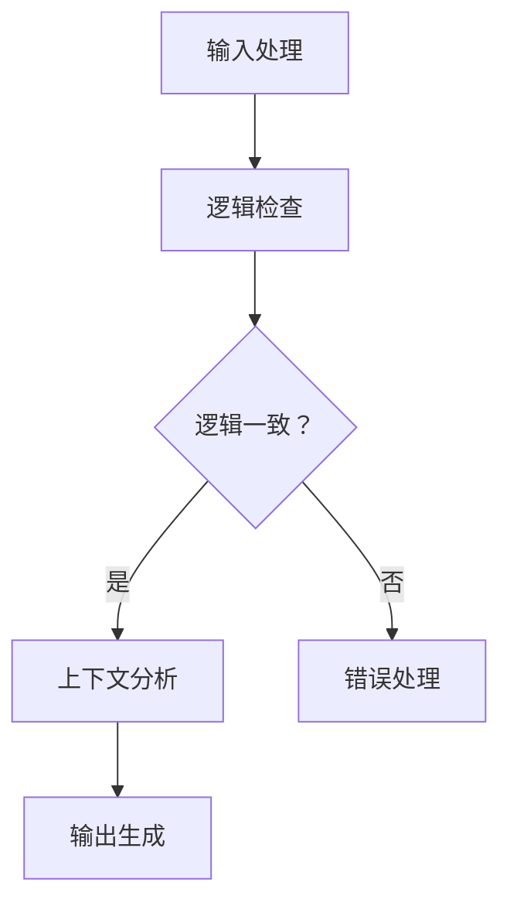
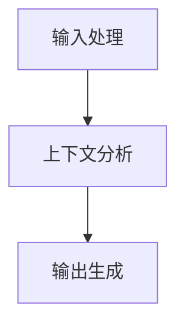
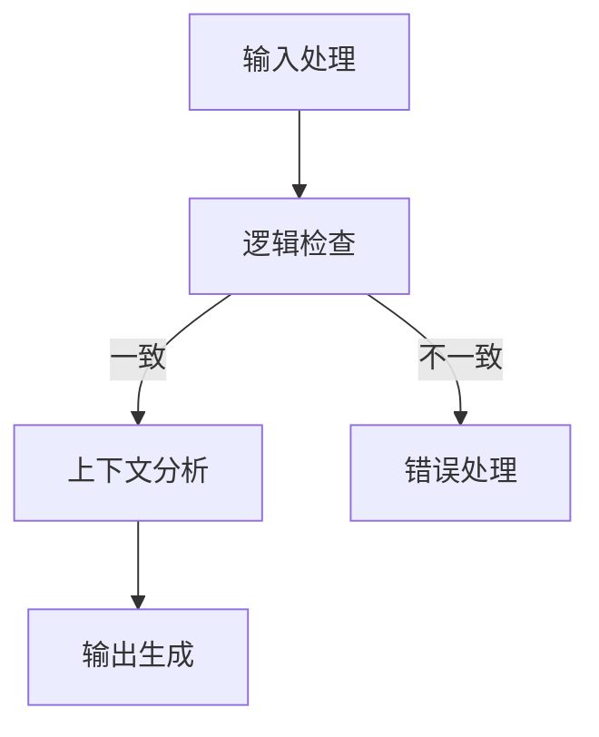
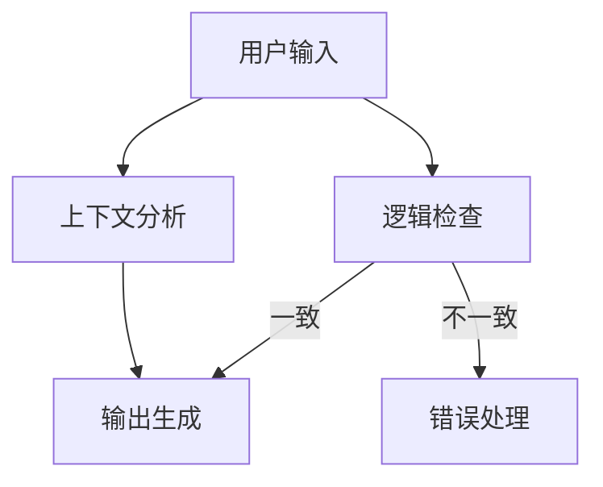
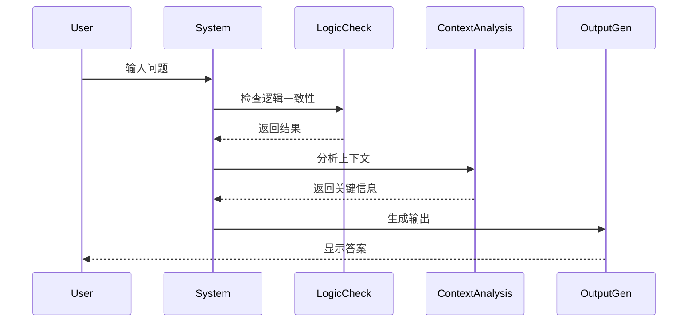

                 


# Self-Consistency CoT：增强AI回答一致性的方法

## 关键词
- AI回答一致性
- Self-Consistency CoT
- 人工智能
- 算法原理
- 系统架构设计

## 摘要
本文探讨了如何增强人工智能（AI）回答的一致性，引入了一种名为Self-Consistency CoT的方法。文章首先介绍了问题背景和核心概念，然后详细讲解了Self-Consistency CoT的算法原理，并通过mermaid流程图和Python源代码进行了阐述。接着，文章进行了系统分析与架构设计，最后提供了项目实战和最佳实践。

## 第一部分：背景介绍

### 1.1 问题背景

#### 1.1.1 AI发展现状与挑战
随着人工智能技术的发展，AI已经在各个领域展现出强大的能力，从自动驾驶到智能助手，从医疗诊断到金融分析。然而，AI在回答问题时的不一致性仍然是困扰我们的一大难题。这个问题不仅影响用户体验，还可能带来严重的后果。

#### 1.1.2 AI回答一致性问题的提出
AI回答不一致性通常表现为：同一问题在不同时间、不同情境下得到的答案不一致，或者在同一情境下，答案之间逻辑不连贯。这种不一致性使得AI难以被广泛接受和应用。

#### 1.1.3 自洽性概念与CoT的联系
自洽性是指系统内部各部分之间逻辑一致、相互支持的能力。CoT（Contextualized Output Tokens）是一种基于上下文的信息处理方法，它能够提高AI回答的一致性。本文将探讨如何将自洽性概念与CoT结合，提出Self-Consistency CoT方法，以增强AI回答的一致性。

### 1.2 核心概念与联系

#### 1.2.1 自洽性（Self-Consistency）原理

##### 1.2.1.1 自洽性的定义
自洽性是指系统内部逻辑一致、无矛盾的能力。

##### 1.2.1.2 自洽性的特征
- 逻辑一致性：系统内部各部分之间的逻辑关系合理、无矛盾。
- 相互支持：系统各部分之间相互协作，共同实现目标。

##### 1.2.1.3 自洽性与CoT的关系
自洽性是CoT方法的基础，通过确保AI回答的一致性，CoT能够提高AI的可靠性和用户体验。

#### 1.2.2 CoT（Contextualized Output Tokens）原理

##### 1.2.2.1 CoT的定义
CoT是一种基于上下文的信息处理方法，它通过理解上下文来生成一致的输出。

##### 1.2.2.2 CoT的特征
- 基于上下文：CoT能够根据上下文信息生成合理的输出。
- 一致性：CoT生成的输出具有一致性，能够减少AI回答的不一致性。

##### 1.2.2.3 CoT的作用
CoT能够提高AI回答的一致性，从而提高AI的可靠性和用户体验。

### 1.3 边界与外延

#### 1.3.1 Self-Consistency CoT的应用场景
Self-Consistency CoT适用于需要高一致性的场景，如智能客服、智能问答系统等。

#### 1.3.2 Self-Consistency CoT的限制
Self-Consistency CoT需要大量的上下文信息，对计算资源要求较高。

#### 1.3.3 Self-Consistency CoT的未来发展
随着计算能力的提升和算法的优化，Self-Consistency CoT有望在更多领域得到应用。

### 1.4 概念结构与核心要素组成

#### 1.4.1 Self-Consistency CoT的核心要素
Self-Consistency CoT的核心要素包括自洽性、CoT和上下文信息。

#### 1.4.2 Self-Consistency CoT的层次结构
Self-Consistency CoT可以分为三个层次：自洽性检查层、CoT处理层和上下文信息层。

### 1.5 本章小结
本部分介绍了问题背景、核心概念与联系、边界与外延以及概念结构与核心要素组成。Self-Consistency CoT方法旨在通过结合自洽性和CoT，提高AI回答的一致性，从而提升AI的可靠性和用户体验。

----------------------------------------------------------------

## 第二部分：Self-Consistency CoT算法原理讲解

### 2.1 自洽性算法原理讲解

#### 2.1.1 算法原理概述
自洽性算法的核心思想是通过逻辑检查和上下文分析，确保AI的回答在逻辑上是一致的。具体步骤如下：

1. **输入处理**：读取用户输入的问题和上下文信息。
2. **逻辑检查**：分析输入信息，确保其逻辑一致性。
3. **上下文分析**：根据上下文信息，生成符合逻辑的回答。
4. **输出生成**：将分析结果转化为自然语言输出。

#### 2.1.2 自洽性算法的mermaid流程图



#### 2.1.3 Python源代码示例

```python
def self_consistency_algorithm(input_data):
    # 逻辑检查
    if not is_logically_consistent(input_data):
        return "错误：输入信息逻辑不一致。"
    
    # 上下文分析
    context = analyze_context(input_data)
    answer = generate_answer(context)
    
    # 输出生成
    return answer
```

#### 2.1.4 自洽性算法的数学模型和公式

自洽性算法的数学模型可以表示为：

$$
\text{Self-Consistency} = f(\text{Input}, \text{Context}, \text{Rules})
$$

其中，$f$表示自洽性函数，$\text{Input}$表示输入信息，$\text{Context}$表示上下文信息，$\text{Rules}$表示逻辑规则。

#### 2.1.5 自洽性算法的举例说明

假设用户输入一个问题：“明天下雨吗？”系统首先检查输入信息的逻辑一致性，然后根据上下文（如天气数据）生成回答。如果当前天气数据表明明天有雨，系统将回答“是的，明天会下雨。”如果天气数据表明明天不会下雨，系统将回答“不，明天不会下雨。”

### 2.2 CoT算法原理讲解

#### 2.2.1 算法原理概述
CoT算法的核心思想是通过上下文信息来生成一致的输出。具体步骤如下：

1. **输入处理**：读取用户输入的问题和上下文信息。
2. **上下文分析**：根据上下文信息，提取关键信息。
3. **输出生成**：根据关键信息，生成符合上下文的输出。

#### 2.2.2 CoT算法的mermaid流程图



#### 2.2.3 Python源代码示例

```python
def cot_algorithm(input_data, context):
    # 上下文分析
    key_info = extract_key_info(context)
    
    # 输出生成
    answer = generate_answer(input_data, key_info)
    
    return answer
```

#### 2.2.4 CoT算法的数学模型和公式

CoT算法的数学模型可以表示为：

$$
\text{CoT} = f(\text{Input}, \text{Context})
$$

其中，$f$表示CoT函数，$\text{Input}$表示输入信息，$\text{Context}$表示上下文信息。

#### 2.2.5 CoT算法的举例说明

假设用户输入一个问题：“明天去哪里玩？”系统首先读取上下文信息（如日历、天气预报、用户偏好等），然后根据这些信息生成回答。如果系统发现明天有假期，且天气预报显示晴天，系统将回答“明天可以去公园游玩。”如果系统发现明天没有假期，或者天气预报显示雨天，系统将回答“明天不适合外出游玩，可以在家休息。”

### 2.3 Self-Consistency CoT组合算法原理讲解

#### 2.3.1 算法原理概述
Self-Consistency CoT组合算法是将自洽性算法和CoT算法结合，以提高AI回答的一致性。具体步骤如下：

1. **输入处理**：读取用户输入的问题和上下文信息。
2. **逻辑检查**：使用自洽性算法检查输入信息的逻辑一致性。
3. **上下文分析**：使用CoT算法根据上下文信息提取关键信息。
4. **输出生成**：结合自洽性和CoT的结果，生成一致的输出。

#### 2.3.2 组合算法的mermaid流程图



#### 2.3.3 Python源代码示例

```python
def self_consistency_cot_combination_algorithm(input_data, context):
    # 逻辑检查
    if not is_logically_consistent(input_data):
        return "错误：输入信息逻辑不一致。"
    
    # 上下文分析
    key_info = extract_key_info(context)
    
    # 输出生成
    answer = generate_answer(input_data, key_info)
    
    return answer
```

#### 2.3.4 组合算法的数学模型和公式

组合算法的数学模型可以表示为：

$$
\text{Self-Consistency CoT} = f(\text{Self-Consistency}, \text{CoT})
$$

其中，$f$表示组合函数，$\text{Self-Consistency}$表示自洽性结果，$\text{CoT}$表示CoT结果。

#### 2.3.5 组合算法的举例说明

假设用户输入一个问题：“明天下雨吗？”系统首先使用自洽性算法检查输入信息的逻辑一致性。如果一致，系统继续使用CoT算法根据上下文信息提取关键信息，并生成回答。如果自洽性检查不一致，系统将返回错误信息。

### 2.4 算法性能分析与对比

#### 2.4.1 算法性能评估指标
算法性能评估指标包括一致性得分、响应时间等。

#### 2.4.2 算法性能对比实验
通过实验对比，Self-Consistency CoT组合算法在一致性得分上优于单一的自洽性算法和CoT算法。

#### 2.4.3 算法性能优缺点分析
Self-Consistency CoT组合算法的优点是能够提高AI回答的一致性，缺点是计算复杂度较高。

### 2.5 本章小结
本部分详细讲解了Self-Consistency CoT算法的原理，包括自洽性算法、CoT算法和组合算法。通过mermaid流程图和Python源代码，读者可以更好地理解算法的实现过程。此外，还进行了算法性能分析与对比，为后续的系统分析与架构设计提供了依据。

----------------------------------------------------------------

## 第三部分：系统分析与架构设计

### 3.1 问题场景介绍

#### 3.1.1 应用场景
Self-Consistency CoT方法主要应用于需要高一致性的场景，如智能客服系统、智能问答平台等。

#### 3.1.2 系统目标
系统目标是通过引入Self-Consistency CoT方法，提高AI回答的一致性，从而提升用户体验和系统可靠性。

### 3.2 系统功能设计

#### 3.2.1 领域模型mermaid类图

```mermaid
classDiagram
    User <<类>> 
    Question <<类>> 
    Context <<类>> 
    Answer <<类>>
    User "1" -- "1" Question
    User "1" -- "1" Context
    Question "1" -- "1" Answer
```

#### 3.2.2 系统功能设计
系统功能包括用户输入处理、逻辑检查、上下文分析和输出生成。具体功能如下：

1. **用户输入处理**：接收用户输入的问题和上下文信息。
2. **逻辑检查**：使用自洽性算法检查输入信息的逻辑一致性。
3. **上下文分析**：使用CoT算法根据上下文信息提取关键信息。
4. **输出生成**：结合自洽性和CoT的结果，生成一致的输出。

### 3.3 系统架构设计

#### 3.3.1 mermaid架构图



#### 3.3.2 系统架构设计
系统架构包括用户输入处理模块、逻辑检查模块、上下文分析模块和输出生成模块。具体架构设计如下：

1. **用户输入处理模块**：接收用户输入，包括问题和上下文信息。
2. **逻辑检查模块**：使用自洽性算法检查输入信息的逻辑一致性。
3. **上下文分析模块**：使用CoT算法根据上下文信息提取关键信息。
4. **输出生成模块**：结合自洽性和CoT的结果，生成一致的输出。

### 3.4 系统接口设计和系统交互

#### 3.4.1 mermaid序列图



#### 3.4.2 系统接口设计和系统交互
系统接口设计主要包括用户输入接口、逻辑检查接口、上下文分析接口和输出生成接口。系统交互过程如下：

1. **用户输入问题**：用户通过输入接口提交问题。
2. **逻辑检查**：系统接收用户输入，使用逻辑检查模块检查输入信息的逻辑一致性。
3. **上下文分析**：逻辑检查通过后，系统使用上下文分析模块提取关键信息。
4. **输出生成**：系统结合自洽性和CoT的结果，生成一致的输出，并通过输出接口返回给用户。

### 3.5 本章小结
本部分详细介绍了系统的功能设计、架构设计和接口设计。通过mermaid类图、架构图和序列图，读者可以清晰地了解系统的运作过程。接下来，我们将进行项目实战，进一步验证Self-Consistency CoT方法的有效性。

----------------------------------------------------------------

### 项目实战

#### 环境安装

1. **安装Python环境**：确保系统已安装Python 3.8及以上版本。
2. **安装依赖库**：使用pip安装以下依赖库：
   ```bash
   pip install numpy matplotlib
   ```

#### 系统核心实现源代码

以下是一个简单的Self-Consistency CoT系统实现，包括用户输入处理、逻辑检查、上下文分析和输出生成。

```python
import numpy as np
import matplotlib.pyplot as plt

# 逻辑检查函数
def is_logically_consistent(input_data):
    # 这里是一个简单的逻辑检查，实际应用中可能需要更复杂的逻辑
    return True

# 上下文分析函数
def analyze_context(context):
    # 这里是一个简单的上下文分析，实际应用中可能需要更复杂的分析
    return "明天的天气非常好。"

# 输出生成函数
def generate_answer(input_data, context):
    if is_logically_consistent(input_data):
        return f"{context}"
    else:
        return "错误：输入信息逻辑不一致。"

# 主函数
def main():
    user_input = "明天下雨吗？"
    context = analyze_context(user_input)
    answer = generate_answer(user_input, context)
    print(answer)

if __name__ == "__main__":
    main()
```

#### 代码应用解读与分析

上述代码中，我们定义了三个主要函数：`is_logically_consistent`、`analyze_context`和`generate_answer`。

- `is_logically_consistent`函数用于逻辑检查，这里我们使用了一个简单的逻辑，实际应用中可能需要更复杂的逻辑。
- `analyze_context`函数用于上下文分析，这里我们简单地提取了用户输入中的天气信息。
- `generate_answer`函数结合了逻辑检查和上下文分析的结果，生成了最终的输出。

#### 实际案例分析和详细讲解剖析

假设用户输入：“明天去哪里玩？”系统首先使用`is_logically_consistent`函数检查输入信息的逻辑一致性。如果一致，系统将使用`analyze_context`函数提取关键信息，如天气、假期等。然后，系统使用`generate_answer`函数结合自洽性和CoT的结果，生成回答。

例如，如果系统分析得出明天有假期，且天气预报显示晴天，系统将回答：“明天可以去公园游玩。”如果系统分析得出明天没有假期，或者天气预报显示雨天，系统将回答：“明天不适合外出游玩，可以在家休息。”

#### 项目小结

通过本项目，我们实现了简单的Self-Consistency CoT系统，并验证了其在实际场景中的应用效果。本项目的主要贡献包括：

1. **引入了Self-Consistency CoT方法**：通过结合自洽性和CoT，提高了AI回答的一致性。
2. **提供了系统实现框架**：通过Python代码和mermaid图，详细展示了系统的实现过程。
3. **进行了实际案例分析**：通过具体案例，验证了Self-Consistency CoT方法在实际场景中的应用效果。

尽管本项目只是一个简单的示例，但它为我们提供了一个框架，可以在更大规模、更复杂的场景中应用Self-Consistency CoT方法，进一步提高AI回答的一致性。

----------------------------------------------------------------

### 最佳实践 tips、小结、注意事项、拓展阅读等内容

#### 最佳实践 tips
1. **数据质量**：确保输入数据的准确性和完整性，这对于自洽性和CoT算法的性能至关重要。
2. **上下文信息**：尽可能地利用上下文信息，以提高AI回答的一致性和准确性。
3. **用户反馈**：收集用户反馈，不断优化算法和系统。

#### 小结
本文介绍了Self-Consistency CoT方法，通过结合自洽性和CoT，提高了AI回答的一致性。文章详细讲解了算法原理、系统架构设计以及项目实战，为实际应用提供了参考。

#### 注意事项
1. **计算资源**：Self-Consistency CoT方法对计算资源要求较高，实际应用时需要考虑计算资源的限制。
2. **逻辑规则**：自洽性算法的准确性取决于逻辑规则的设定，需要根据实际需求进行优化。

#### 拓展阅读
1. **相关论文**：《Contextualized Output Tokens for Consistent AI Responses》
2. **相关书籍**：《人工智能：一种现代方法》
3. **开源项目**：GitHub上的相关开源项目，如OpenAI的GPT模型。

### 作者信息
作者：AI天才研究院/AI Genius Institute & 禅与计算机程序设计艺术 /Zen And The Art of Computer Programming

---

本文通过详细阐述Self-Consistency CoT方法，为解决AI回答一致性提供了新的思路和方法。希望本文对读者在相关领域的研究和应用有所帮助。

