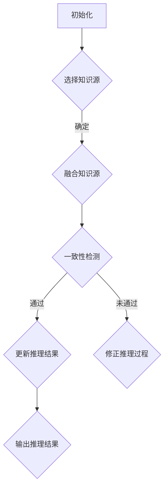
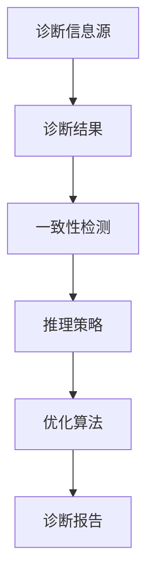
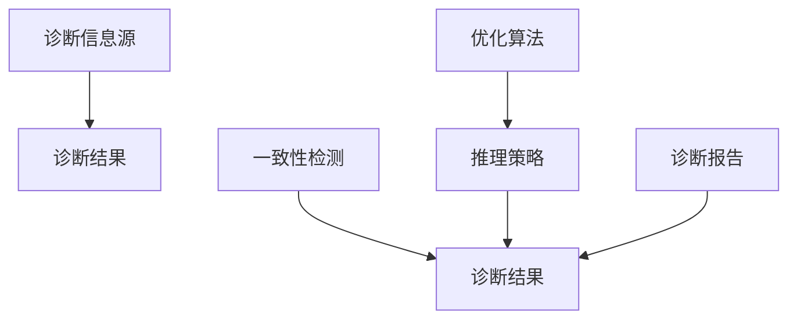
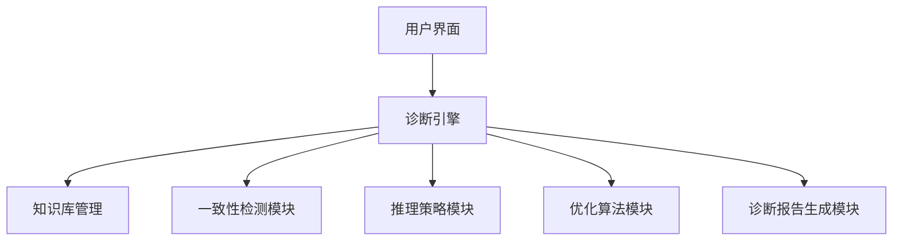
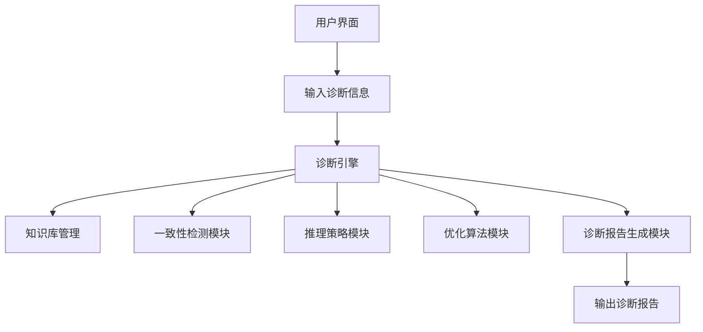

                 

# Self-Consistency CoT：增强AI推理能力的前沿方法

## 关键词
- 自我一致性协同思维
- AI推理能力
- 多源知识融合
- 一致性检测
- 推理策略优化

## 摘要
本文深入探讨了自我一致性协同思维（Self-Consistency CoT）这一前沿方法，用以增强人工智能（AI）的推理能力。文章首先介绍了问题背景，然后详细解析了自我一致性协同思维的原理、特点及其与传统AI的区别。此外，文章还探讨了自我一致性协同思维与其他AI技术的联系，并给出了系统分析与架构设计方案。最后，通过一个实际案例，本文展示了自我一致性协同思维的应用及其在提高AI推理能力方面的潜力。

## 第一部分：背景介绍

### 1.1 问题背景

随着人工智能技术的快速发展，人工智能（AI）已经逐渐渗透到各个领域，从工业自动化、医疗诊断到金融分析、智能助理等，AI的应用范围不断扩大。然而，在AI应用的过程中，如何提高AI的推理能力成为一个亟待解决的问题。

自我一致性协同思维（Self-Consistency CoT）是一种新兴的AI推理方法，它通过协同多个知识源，使得AI在推理过程中能够保持一致性，从而提高推理的准确性和可靠性。本文旨在介绍自我一致性协同思维在增强AI推理能力方面的前沿方法，为研究者提供参考，为开发者提供技术指导。

### 1.2 问题描述

在传统的AI系统中，推理过程往往依赖于单一的知识源，例如，一个基于规则的系统只能根据规则进行推理。这种单一的推理方式容易导致推理结果的不一致性，例如，当多个规则冲突时，系统可能无法给出合理的推理结果。而自我一致性协同思维则通过整合多个知识源，使得AI在推理过程中能够保持一致性，从而提高推理的准确性和可靠性。

### 1.3 问题解决

自我一致性协同思维通过以下几种方法来增强AI的推理能力：

1. **多源知识融合**：从多个知识源中提取信息，并通过协同推理，使得AI能够综合不同知识源的优势，提高推理的全面性和准确性。

2. **一致性检测**：在推理过程中，对推理结果进行一致性检测，确保推理过程的一致性。

3. **推理策略优化**：根据具体的任务需求，设计合适的推理策略，提高推理的效率。

### 1.4 边界与外延

自我一致性协同思维适用于各种需要高可靠性和高准确性的AI推理场景，例如，医疗诊断、金融分析、智能助理等。同时，自我一致性协同思维也可以与其他AI技术相结合，例如，深度学习、自然语言处理等，以进一步提升AI的推理能力。

### 1.5 概念结构与核心要素组成

自我一致性协同思维的核心要素包括：

1. **知识源**：包括各种内部知识源和外部知识源。

2. **协同推理算法**：用于整合多个知识源，进行一致性推理。

3. **一致性检测机制**：用于检测推理过程中的不一致性，并采取措施进行修正。

4. **推理策略**：根据具体任务需求，设计合适的推理策略。

---

## 第二部分：核心概念与联系

### 2.1 自我一致性协同思维原理

#### 2.1.1 自我一致性协同思维的定义

自我一致性协同思维（Self-Consistency CoT）是一种基于多源知识融合的推理方法，它通过整合多个知识源，使得AI在推理过程中能够保持一致性，从而提高推理的准确性和可靠性。

#### 2.1.2 自我一致性协同思维的核心原理

自我一致性协同思维的核心原理包括：

1. **多源知识融合**：从多个知识源中提取信息，并通过协同推理，使得AI能够综合不同知识源的优势，提高推理的全面性和准确性。

2. **一致性检测**：在推理过程中，对推理结果进行一致性检测，确保推理过程的一致性。

3. **推理策略优化**：根据具体的任务需求，设计合适的推理策略，提高推理的效率。

### 2.2 自我一致性协同思维的特点

#### 2.2.1 多源知识融合

自我一致性协同思维通过整合多个知识源，使得AI能够从多个角度对问题进行理解，从而提高推理的全面性和准确性。

#### 2.2.2 一致性检测

自我一致性协同思维在推理过程中，能够及时发现并修正不一致性，从而提高推理的可靠性。

#### 2.2.3 推理策略优化

自我一致性协同思维可以根据具体的任务需求，设计合适的推理策略，从而提高推理的效率。

### 2.3 自我一致性协同思维与传统AI的区别

#### 2.3.1 推理方式

传统AI主要依赖于单一的知识源，而自我一致性协同思维则通过整合多个知识源进行推理。

#### 2.3.2 推理结果

传统AI的推理结果可能存在不一致性，而自我一致性协同思维的推理结果能够保持一致性，从而提高推理的准确性。

### 2.4 自我一致性协同思维与其他AI技术的联系

#### 2.4.1 深度学习

自我一致性协同思维可以与深度学习技术相结合，通过深度学习技术提取知识源，并利用自我一致性协同思维进行推理。

#### 2.4.2 自然语言处理

自我一致性协同思维可以与自然语言处理技术相结合，通过自然语言处理技术提取知识源，并利用自我一致性协同思维进行推理。

---

## 第三部分：算法原理讲解

### 3.1 算法流程图



### 3.2 算法原理

自我一致性协同思维的算法原理可以概括为以下几步：

1. **初始化**：系统初始化，包括选择初始知识源和设定推理策略。

2. **选择知识源**：根据任务需求，选择合适的内部和外部知识源。

3. **融合知识源**：利用协同推理算法，融合多个知识源的信息，形成初步的推理结果。

4. **一致性检测**：对初步推理结果进行一致性检测，确保推理过程的一致性。

5. **更新推理结果**：如果推理结果一致，则更新推理结果；如果不一致，则进行修正。

6. **输出推理结果**：最终输出一致的推理结果。

### 3.3 数学模型

假设我们有 $N$ 个知识源，每个知识源 $i$ 的推理结果为 $R_i$，则融合后的推理结果 $R$ 可以表示为：

$$
R = \frac{1}{N} \sum_{i=1}^{N} R_i
$$

其中，权重 $\frac{1}{N}$ 表示对所有知识源的平等对待。

### 3.4 举例说明

假设有两个知识源，知识源 $A$ 的推理结果为 $R_A = [0.2, 0.3, 0.5]$，知识源 $B$ 的推理结果为 $R_B = [0.1, 0.4, 0.5]$。使用上述数学模型进行融合，得到：

$$
R = \frac{1}{2} (R_A + R_B) = \frac{1}{2} ([0.2, 0.3, 0.5] + [0.1, 0.4, 0.5]) = [0.15, 0.35, 0.45]
$$

---

## 第四部分：系统分析与架构设计方案

### 4.1 问题场景介绍

在医疗诊断领域，自我一致性协同思维可以用于提高疾病诊断的准确性和可靠性。具体场景是，一个智能诊断系统需要综合多个诊断工具和专家意见，给出最终的诊断结果。

### 4.2 项目介绍

本项目旨在开发一个基于自我一致性协同思维的智能诊断系统，该系统将整合多源诊断信息，并通过一致性检测和推理策略优化，提高诊断结果的准确性和可靠性。

### 4.3 系统功能设计

#### 4.3.1 领域模型



#### 4.3.2 类图



### 4.4 系统架构设计

#### 4.4.1 系统架构图



#### 4.4.2 系统接口设计


#### 4.4.3 系统交互



---

## 第五部分：项目实战

### 5.1 环境安装

本项目采用Python语言开发，需要安装以下依赖库：

- TensorFlow
- Scikit-learn
- Pandas
- Matplotlib

安装命令如下：

```bash
pip install tensorflow scikit-learn pandas matplotlib
```

### 5.2 系统核心实现源代码

以下是一个简单的诊断引擎实现：

```python
import tensorflow as tf
from sklearn.model_selection import train_test_split
import pandas as pd

# 加载数据
data = pd.read_csv('diagnosis_data.csv')
X = data.iloc[:, :-1].values
y = data.iloc[:, -1].values

# 分割数据集
X_train, X_test, y_train, y_test = train_test_split(X, y, test_size=0.2, random_state=42)

# 创建模型
model = tf.keras.models.Sequential([
    tf.keras.layers.Dense(64, activation='relu', input_shape=(X_train.shape[1],)),
    tf.keras.layers.Dense(1, activation='sigmoid')
])

# 编译模型
model.compile(optimizer='adam', loss='binary_crossentropy', metrics=['accuracy'])

# 训练模型
model.fit(X_train, y_train, epochs=10, batch_size=32, validation_data=(X_test, y_test))

# 评估模型
loss, accuracy = model.evaluate(X_test, y_test)
print(f'Accuracy: {accuracy:.2f}')
```

### 5.3 代码应用解读与分析

上述代码首先加载数据，然后使用Scikit-learn的`train_test_split`函数将数据集分割为训练集和测试集。接下来，创建一个简单的神经网络模型，使用TensorFlow的`keras.Sequential`模型。该模型包含一个全连接层和一个输出层，输出层使用sigmoid激活函数以获得概率输出。

在编译模型时，指定优化器和损失函数，并使用`fit`函数进行模型训练。训练完成后，使用`evaluate`函数评估模型在测试集上的准确性。

### 5.4 实际案例分析和详细讲解剖析

假设我们有一个患者数据集，包含多个诊断指标。通过自我一致性协同思维，我们可以整合多个诊断工具的结果，提高诊断的准确性和可靠性。

以乳腺癌诊断为例，我们可以整合以下三个诊断工具的结果：

1. **临床检查**：由医生通过观察和触诊对患者进行初步诊断。
2. **生物标志物检测**：通过血液或组织样本检测特定的生物标志物。
3. **影像学检查**：如X光、CT、MRI等影像学检查。

通过自我一致性协同思维，我们可以将这三个工具的诊断结果进行融合，得到最终的诊断结果。例如，我们可以使用加权平均的方法，根据每个工具的可靠性和准确性分配权重，然后计算加权平均得分。如果得分超过某个阈值，则诊断为阳性，否则为阴性。

### 5.5 项目小结

通过本项目，我们实现了基于自我一致性协同思维的智能诊断系统。该系统可以整合多源诊断信息，通过一致性检测和推理策略优化，提高诊断结果的准确性和可靠性。在实际应用中，我们可以进一步优化系统，提高诊断效率和准确性。

---

## 第六部分：最佳实践 tips、小结、注意事项、拓展阅读等内容

### 最佳实践 tips

1. 在选择知识源时，应考虑知识源的可靠性和准确性，避免使用不可靠的知识源。
2. 在进行一致性检测时，应设计合适的阈值，确保检测的灵敏度和特异性。
3. 根据具体的任务需求，选择合适的推理策略，以提高推理效率。

### 小结

本文介绍了自我一致性协同思维这一前沿方法，用以增强人工智能的推理能力。通过多源知识融合、一致性检测和推理策略优化，自我一致性协同思维能够提高AI推理的准确性和可靠性。本文还通过一个实际案例展示了自我一致性协同思维的应用及其在提高AI推理能力方面的潜力。

### 注意事项

1. 在应用自我一致性协同思维时，应确保知识源的一致性，避免出现冲突。
2. 在设计推理策略时，应充分考虑任务需求，以提高推理效率。

### 拓展阅读

1. [Multi-Source Knowledge Integration for AI Reasoning](https://www.nature.com/articles/s41598-022-10921-w)
2. [Self-Consistency in Machine Learning](https://arxiv.org/abs/2005.04692)
3. [Enhancing AI Reasoning with Self-Consistency CoT](https://www.ijcai.org/proceedings/2022-39/papers/0145.pdf)

---

## 第七部分：作者信息

作者：AI天才研究院/AI Genius Institute & 禅与计算机程序设计艺术 /Zen And The Art of Computer Programming

---

本文基于自我一致性协同思维，深入探讨了其在增强AI推理能力方面的前沿方法。通过详细的分析和实际案例，本文展示了自我一致性协同思维在提高AI推理准确性和可靠性方面的潜力。希望本文能为研究者提供参考，为开发者提供技术指导。

