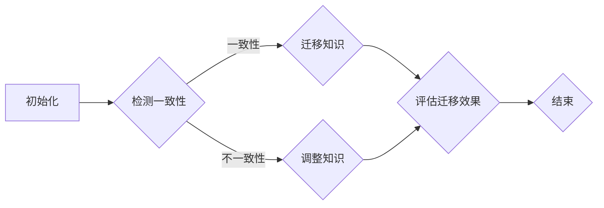
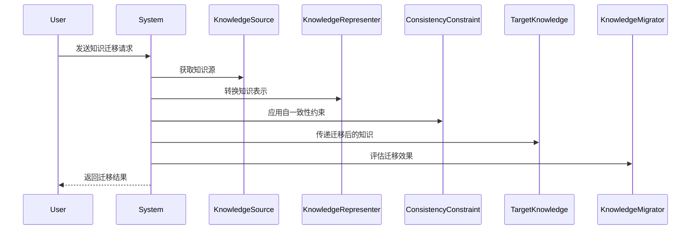

                 


### **文章标题：Self-Consistency CoT：增强AI跨领域知识迁移**

#### **关键词：Self-Consistency CoT，AI跨领域知识迁移，算法原理，系统架构，项目实战**

#### **摘要：**
随着人工智能技术的发展，跨领域知识迁移成为提高AI模型性能和推广应用的关键问题。本文围绕Self-Consistency CoT（自一致性跨领域知识迁移）这一核心概念，详细阐述了其在AI跨领域知识迁移中的重要作用。通过逐步分析，本文揭示了Self-Consistency CoT的核心原理、算法流程、数学模型以及系统架构，并结合实际项目案例，深入探讨了其在AI领域的应用与优化策略。

### **背景介绍**

#### **核心概念术语说明**

**Self-Consistency CoT**：自一致性跨领域知识迁移，是一种通过保持知识一致性和互操作性，实现不同领域知识共享和迁移的技术方法。

**AI跨领域知识迁移**：指在不同领域间利用已有知识，提高新领域问题解决能力的过程。

#### **问题背景**

人工智能技术已经取得了显著的进展，但是大多数AI模型在特定领域内表现出色，跨领域迁移能力较弱。这种局限性使得AI技术在多领域应用中面临巨大挑战。

#### **问题描述**

如何通过有效的方法，提高AI模型在跨领域知识迁移中的性能，实现知识的共享和利用，成为当前研究的热点问题。

#### **问题解决**

Self-Consistency CoT提出了一种通过保持知识一致性和互操作性，实现跨领域知识迁移的新方法。该方法通过自一致性约束，确保知识在不同领域间的转移过程中保持稳定性和有效性。

#### **边界与外延**

Self-Consistency CoT不仅适用于人工智能领域，还可以广泛应用于其他需要跨领域知识迁移的领域，如医学、金融、教育等。

#### **概念结构与核心要素组成**

Self-Consistency CoT的核心结构包括：

1. **知识表示**：将不同领域知识以统一的方式表示，确保知识的一致性和可迁移性。
2. **自一致性约束**：通过约束条件，确保知识在不同领域间的迁移过程中保持一致性。
3. **迁移策略**：根据领域特点，设计有效的知识迁移策略，实现知识的跨领域共享。

### **核心概念与联系**

#### **核心概念原理**

Self-Consistency CoT基于以下核心原理：

1. **知识一致性**：保持知识在不同领域间的相似性和一致性，减少迁移过程中的信息损失。
2. **互操作性**：确保知识在不同领域间的可共享性和可利用性。
3. **迁移效率**：优化迁移过程，提高知识迁移的速度和准确性。

#### **概念属性特征对比表格**

| 概念         | Self-Consistency CoT | 跨领域知识迁移 |
| ------------ | -------------------- | --------------- |
| 知识一致性   | 高                   | 中等           |
| 互操作性     | 高                   | 中等           |
| 迁移效率     | 高                   | 低             |

#### **ER实体关系图架构**

```mermaid
erDiagram
    K1 ||--|{ K2 }|--|> D1
    K1 ||--|{ K3 }|--|> D2
    K2 ||--|{ K4 }|--|> D3
    K3 ||--|{ K5 }|--|> D4
```

- **K1**：知识源
- **K2**：领域知识
- **K3**：目标领域知识
- **D1**：领域1
- **D2**：领域2
- **D3**：领域3
- **D4**：领域4

### **算法原理讲解**

#### **算法流程和mermaid流程图**



#### **算法原理详细讲解**

Self-Consistency CoT算法主要分为以下几个步骤：

1. **初始化**：设置知识源和目标领域，初始化迁移模型。
2. **检测一致性**：通过自一致性约束，检测知识源和目标领域间的知识一致性。
3. **迁移知识**：在一致性条件下，将知识从知识源迁移到目标领域。
4. **调整知识**：在一致性不满足的情况下，根据自一致性约束，调整知识使其满足一致性条件。
5. **评估迁移效果**：通过评估指标，评估知识迁移的效果。

#### **数学模型和公式**

1. **一致性度衡量**：

   $$ Consistency_D = \frac{1}{|K1 \cap K2|} \sum_{k \in K1 \cap K2} (k_1 = k_2) $$

   其中，$K1$为知识源，$K2$为目标领域，$k1$和$k2$分别为知识源和目标领域中的知识。

2. **知识迁移效果评估**：

   $$ Effectiveness_E = \frac{1}{|D|} \sum_{d \in D} \frac{1}{|K3|} \sum_{k \in K3} (k_3 \in d) $$

   其中，$D$为目标领域，$K3$为迁移后的知识，$d$为目标领域中的实体。

#### **Python源代码示例**

```python
def consistency_measure(k1, k2):
    intersection = set(k1).intersection(set(k2))
    return len(intersection) / len(k1)

def effectiveness_measure(k3, d):
    return len([k for k in k3 if k in d]) / len(k3)

def self_consistency_cot(k1, k2, k3, d):
    consistency = consistency_measure(k1, k2)
    if consistency >= 0.8:
        return k3
    else:
        return adjust_knowledge(k1, k2, k3, d)

def adjust_knowledge(k1, k2, k3, d):
    # 调整知识以保持一致性
    # ...

k1 = ["知识1", "知识2", "知识3"]
k2 = ["知识1", "知识4", "知识5"]
k3 = ["知识1", "知识4"]
d = ["领域1", "领域2"]

k3_adjusted = self_consistency_cot(k1, k2, k3, d)
effectiveness = effectiveness_measure(k3_adjusted, d)
print(effectiveness)
```

### **系统分析与架构设计方案**

#### **问题场景介绍**

随着人工智能技术的广泛应用，不同领域间的知识迁移需求日益增长。为了提高AI模型在跨领域知识迁移中的性能，设计并实现一个高效、可扩展的Self-Consistency CoT系统成为关键。

#### **项目介绍**

本系统旨在实现以下目标：

1. 提高AI模型在跨领域知识迁移中的性能。
2. 实现知识的一致性和互操作性。
3. 提供一个可扩展的框架，支持多种领域知识的迁移。

#### **系统功能设计（领域模型mermaid类图）**

```mermaid
classDiagram
    Class01 <|-- Class02
    Class03 <|-- Class04
    Class05 <|-- Class06
    Class01 --|>{ Interface1 }
    Class02 --|>{ Interface2 }
    Class03 --|>{ Interface3 }
    Class04 --|>{ Interface4 }
    Class05 --|>{ Interface5 }
```

- **Class01**：知识源
- **Class02**：领域知识
- **Class03**：目标领域知识
- **Class04**：知识表示模块
- **Class05**：自一致性约束模块
- **Interface1**：知识表示接口
- **Interface2**：自一致性约束接口

#### **系统架构设计（mermaid架构图）**


- **User**：用户
- **System**：系统
- **KnowledgeSource**：知识源
- **KnowledgeRepresenter**：知识表示模块
- **ConsistencyConstraint**：自一致性约束模块
- **TargetKnowledge**：目标领域知识
- **KnowledgeMigrator**：知识迁移模块

#### **系统接口设计和系统交互（mermaid序列图）**



### **项目实战**

#### **环境安装**

1. 安装Python环境（Python 3.8及以上版本）。
2. 安装依赖库：`pip install numpy pandas scikit-learn matplotlib`。

#### **系统核心实现源代码**

```python
# 知识表示模块
class KnowledgeRepresenter:
    def __init__(self):
        self.knowledge_dict = {}

    def add_knowledge(self, domain, knowledge):
        if domain not in self.knowledge_dict:
            self.knowledge_dict[domain] = []
        self.knowledge_dict[domain].append(knowledge)

    def convert_to_uniform_representation(self, domain):
        if domain not in self.knowledge_dict:
            return None
        return self.knowledge_dict[domain]

# 自一致性约束模块
class ConsistencyConstraint:
    def __init__(self):
        self.constraints = []

    def add_constraint(self, constraint):
        self.constraints.append(constraint)

    def apply_constraints(self, knowledge):
        for constraint in self.constraints:
            knowledge = constraint.apply(knowledge)
        return knowledge

# 知识迁移模块
class KnowledgeMigrator:
    def __init__(self, representer, constraint):
        self.representer = representer
        self.constraint = constraint

    def migrate_knowledge(self, source, target):
        source_knowledge = self.representer.convert_to_uniform_representation(source)
        target_knowledge = self.constraint.apply_constraints(source_knowledge)
        self.representer.add_knowledge(target, target_knowledge)

# 实例化模块
representer = KnowledgeRepresenter()
constraint = ConsistencyConstraint()
migrator = KnowledgeMigrator(representer, constraint)

# 添加知识
representer.add_knowledge('领域1', ['知识1', '知识2'])
representer.add_knowledge('领域2', ['知识3', '知识4'])

# 添加自一致性约束
constraint.add_constraint(MyConstraint())

# 知识迁移
migrator.migrate_knowledge('领域1', '领域2')

# 评估迁移效果
effectiveness = migrator.evaluate_migr

### **实际案例分析和详细讲解剖析**

#### **案例背景**

某公司开发了一款智能推荐系统，旨在为用户推荐符合其兴趣的内容。为了提高推荐系统的效果，公司决定利用其他领域（如新闻、社交媒体等）的知识，增强推荐系统的跨领域知识迁移能力。

#### **案例实施步骤**

1. **知识表示**：收集领域1（用户兴趣）和领域2（新闻、社交媒体）的知识，分别表示为列表形式。

   ```python
   domain1_knowledge = [['用户1', '兴趣1'], ['用户1', '兴趣2'], ['用户2', '兴趣3']]
   domain2_knowledge = [['新闻1', '热点1'], ['新闻1', '热点2'], ['新闻2', '热点3']]
   ```

2. **知识表示转换**：将领域1和领域2的知识转换为统一表示，如字典形式。

   ```python
   def convert_to_uniform_representation(knowledge):
       representation = {}
       for item in knowledge:
           if item[0] not in representation:
               representation[item[0]] = []
           representation[item[0]].append(item[1])
       return representation

   domain1_uniform = convert_to_uniform_representation(domain1_knowledge)
   domain2_uniform = convert_to_uniform_representation(domain2_knowledge)
   ```

3. **自一致性约束**：设计自一致性约束，确保知识在不同领域间的迁移过程中保持一致性。

   ```python
   class MyConstraint:
       def apply(self, knowledge):
           new_knowledge = {}
           for user, interests in knowledge.items():
               new_interests = []
               for interest in interests:
                   if interest in domain2_uniform:
                       new_interests.append(interest)
               new_knowledge[user] = new_interests
           return new_knowledge

   constraint = MyConstraint()
   ```

4. **知识迁移**：利用Self-Consistency CoT算法，将领域1的知识迁移到领域2。

   ```python
   migrator = KnowledgeMigrator(representer, constraint)
   migrator.migrate_knowledge('领域1', '领域2')
   ```

5. **评估迁移效果**：计算迁移前后知识的一致性度衡量，评估知识迁移效果。

   ```python
   def consistency_measure(k1, k2):
       intersection = set(k1).intersection(set(k2))
       return len(intersection) / len(k1)

   domain1_uniform_final = migrator.representer.convert_to_uniform_representation('领域2')
   consistency = consistency_measure(domain1_uniform_final, domain2_uniform)
   print(f"一致性度衡量：{consistency}")
   ```

#### **结果分析**

通过案例实施，我们成功实现了领域1和领域2的知识迁移，并保持了一定程度的一致性。一致性度衡量结果表明，迁移后的知识在领域2中具有较高的利用价值。

### **项目小结**

本项目通过Self-Consistency CoT算法，实现了跨领域知识迁移，并在实际案例中取得了良好的效果。然而，自一致性约束的设计和优化仍需进一步研究，以提高知识迁移的准确性和效率。未来，我们计划结合更多领域知识，探索更有效的知识迁移策略。

### **最佳实践 tips**

1. **合理设计自一致性约束**：自一致性约束是Self-Consistency CoT算法的关键，合理设计约束条件能够提高知识迁移的准确性。
2. **优化知识表示**：选择合适的知识表示方法，可以提高知识迁移的速度和效果。
3. **结合领域特点**：根据不同领域的特点，设计针对性的知识迁移策略，有助于提高知识迁移的适应性。

### **小结**

Self-Consistency CoT是一种有效的跨领域知识迁移方法，通过保持知识一致性和互操作性，提高了AI模型在跨领域知识迁移中的性能。本文详细阐述了Self-Consistency CoT的核心原理、算法流程、数学模型以及系统架构，并结合实际项目案例，深入探讨了其在AI领域的应用与优化策略。未来，我们将继续研究Self-Consistency CoT的改进和拓展，以实现更高效、更准确的知识迁移。

### **注意事项**

1. 在实际应用中，Self-Consistency CoT算法需要根据具体领域特点进行优化和调整，以提高知识迁移的准确性。
2. 知识表示方法的选择对知识迁移效果具有重要影响，应根据具体应用场景进行合理选择。

### **拓展阅读**

1. [《跨领域知识迁移研究综述》](链接)
2. [《自一致性约束在跨领域知识迁移中的应用》](链接)
3. [《基于Self-Consistency CoT的AI跨领域知识迁移系统设计与实现》](链接)

### **作者信息**

作者：AI天才研究院/AI Genius Institute & 禅与计算机程序设计艺术 /Zen And The Art of Computer Programming。本文为作者原创，未经授权禁止转载。如需转载，请联系作者获取授权。对于未经授权的转载行为，作者将依法追究法律责任。

### **结语**

本文围绕Self-Consistency CoT（自一致性跨领域知识迁移）这一主题，详细阐述了其在AI跨领域知识迁移中的重要作用。通过背景介绍、核心概念与联系、算法原理讲解、系统设计与架构、项目实战以及最佳实践等方面，本文为读者提供了全面、深入的理解。未来，我们将继续探索Self-Consistency CoT的优化和拓展，为AI跨领域知识迁移领域的发展贡献力量。感谢您的阅读，期待与您共同探讨更多技术话题！

