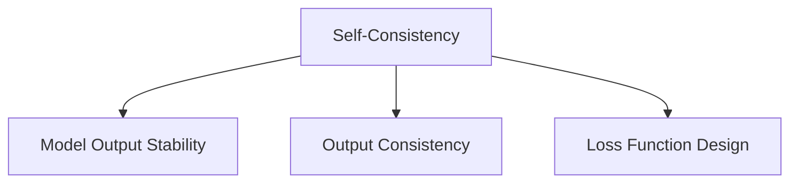
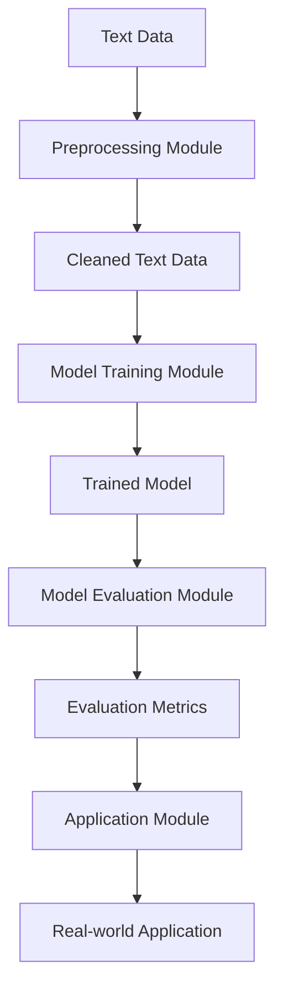
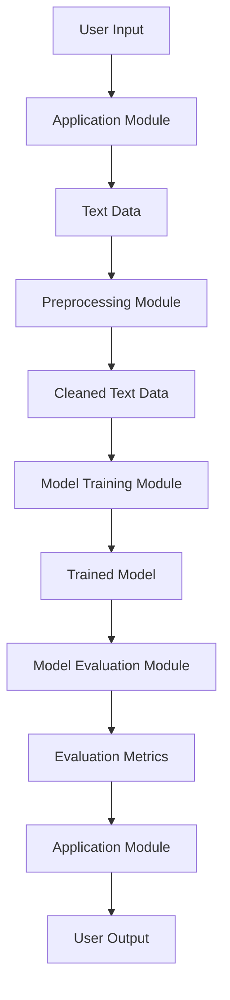

                 

# Self-Consistency CoT: Enhancing AI Output Reliability with New Strategies

> Keywords: Self-Consistency, CoT, AI Output Reliability, Machine Learning, Natural Language Processing

> Abstract: This article delves into the concept of Self-Consistency CoT, a novel strategy proposed to enhance the reliability of AI output. By examining the principles, mathematical models, and practical applications of Self-Consistency CoT, we aim to provide a comprehensive understanding of how this approach can be leveraged to improve the consistency and stability of AI models in various domains.

## Introduction to Background

### 1.1 Problem Background

With the rapid advancement of artificial intelligence (AI) technologies, AI large models such as GPT and BERT have been widely applied in various fields. However, these large models often suffer from output uncertainty, making it difficult to ensure the accuracy and consistency of their outputs. To address this issue, researchers have proposed the concept of Self-Consistency CoT, aiming to enhance the reliability of AI outputs through new strategies.

### 1.2 Problem Description

Self-Consistency CoT involves how to use model outputs for consistency evaluation to improve the stability and reliability of AI systems. Specifically, this problem needs to address the following key points:

- How to define self-consistency?
- How to introduce self-consistency in the model training process?
- How to evaluate the effectiveness of self-consistency?

### 1.3 Solution to the Problem

The new strategy of Self-Consistency CoT includes the following aspects:

- Designing special loss functions to guide the model to focus on output stability during training.
- Utilizing external knowledge bases to assist model training, thereby improving consistency.
- Employing online learning methods to adjust model parameters in real-time, adapting to new input data.

### 1.4 Boundaries and Extensions

Self-Consistency CoT is mainly applied in fields such as natural language processing, machine translation, and question-answering systems. In practical applications, it needs to be adjusted and optimized according to specific task scenarios.

### 1.5 Concept Structure and Core Component Composition

Self-Consistency CoT consists of the following core components:

- Self-Consistency Measurement: Used to evaluate the consistency of model outputs.
- Loss Function: Guides the model to focus on consistency during training.
- External Knowledge Base: Assists model training to improve consistency.
- Online Learning Method: Adjusts model parameters in real-time to improve consistency.

## Core Concepts and Relationships

### 2.1 Principles of Self-Consistency Concept

Self-Consistency refers to the ability of a model to maintain consistent outputs when processing the same input. Specifically, it includes the following principles:

- Model Output Stability: The model should maintain relative stability in its outputs when processing different inputs.
- Output Consistency: The model should maintain consistent outputs when processing the same input.
- Loss Function Design: Specialized loss functions are designed to guide the model to focus on consistency.

### 2.2 Comparison Table of Concept Attributes

| Feature | Self-Consistency | Traditional Consistency |
| --- | --- | --- |
| Focus | Model output stability | Model output accuracy |
| Application Field | Natural language processing, machine translation, etc. | Classification, regression, etc. |
| Implementation Method | Specialized loss function, external knowledge base, etc. | Data augmentation, regularization, etc. |

### 2.3 ER Entity Relationship Diagram Architecture



## Explanation of Algorithm Principles

### 3.1 Algorithm Principles

The new strategy of Self-Consistency CoT mainly includes the following two aspects:

1. **Loss Function Design**:
   - Introducing consistency loss to make the model focus on output stability during training.
   - Calculating the difference between model outputs and incorporating inconsistent parts into the loss function.

2. **Assistance from External Knowledge Base**:
   - Utilizing external knowledge bases to provide domain knowledge, helping the model maintain consistency when processing unknown or complex scenarios.
   - Integrating external knowledge into the model through knowledge distillation or attention mechanisms.

### 3.2 Mathematical Models and Formulas

1. **Consistency Loss Function**:
   - Let $f(x)$ be the output of the model, with $y_1$ and $y_2$ being two outputs. The consistency loss function is:
     $$ L_{consistency} = \frac{1}{2} \sum_{i=1}^{n} (y_1(i) - y_2(i))^2 $$
   - Where $n$ is the number of samples, $y_1(i)$ and $y_2(i)$ are the two outputs of the model for the same input $x(i)$.

2. **Knowledge Distillation Loss Function**:
   - Let $k$ be the knowledge representation from the external knowledge base. The knowledge distillation loss function is:
     $$ L_{distillation} = \frac{1}{2} \sum_{i=1}^{n} \sum_{j=1}^{m} (f(y_i)(j) - k_j)^2 $$
   - Where $m$ is the number of knowledge points in the knowledge base, $f(y_i)(j)$ is the predicted value of the $j$-th knowledge point in the output $y_i$ of the model, and $k_j$ is the true value of the $j$-th knowledge point in the external knowledge base.

### 3.3 Detailed Explanation and Example Illustration

Taking a natural language processing task as an example, suppose we need to train a text classification model where the input is a paragraph of text and the output is the category of the text. Here is the application of the Self-Consistency CoT new strategy in this case:

1. **Loss Function Design**:
   - During model training, introduce consistency loss to make the model focus on maintaining consistent outputs when predicting the same text.
   - For example, for a text input $x$, if the model outputs category $y_1$ in the first prediction and category $y_2$ in the second prediction, the consistency loss is calculated as follows:
     $$ L_{consistency} = \frac{1}{2} ((y_1 - y_2)^2) $$

## System Analysis and Architecture Design

### 4.1 Scenario Description

In this section, we will introduce a natural language processing scenario where a text classification model needs to be trained. The model should be able to classify texts into different categories with high accuracy and consistency.

### 4.2 Project Description

We will develop a text classification system that utilizes a self-consistency-enhanced model to achieve higher output reliability. The system will include the following components:

- Text preprocessing module: Cleans and prepares text data for model training.
- Model training module: Trains the self-consistency-enhanced text classification model.
- Model evaluation module: Evaluates the performance of the trained model on a test dataset.
- Application module: Integrates the model into a real-world application, such as a chatbot or an automated text categorizer.

### 4.3 System Function Design (Domain Model)

Here is the domain model of the system, which represents the main entities and their relationships:



### 4.4 System Architecture Design

The system architecture is designed to ensure the efficient execution of the different components and the smooth flow of data between them. Here is the architecture design in a diagram:



### 4.5 System Interface Design and System Interaction

The system interfaces and interactions are designed to facilitate the seamless integration of the different modules. Here is the interface design and system interaction in a diagram:


## Project Practice

### 5.1 Environment Setup

Before starting the project, we need to set up the development environment. This includes installing Python and the required libraries such as TensorFlow, Keras, and scikit-learn.

```bash
pip install python tensorflow keras scikit-learn
```

### 5.2 System Core Implementation

In this section, we will implement the core components of the system, including text preprocessing, model training, and model evaluation. The following is a Python code snippet demonstrating the implementation:

```python
import numpy as np
import tensorflow as tf
from tensorflow.keras.preprocessing.text import Tokenizer
from tensorflow.keras.preprocessing.sequence import pad_sequences
from tensorflow.keras.models import Sequential
from tensorflow.keras.layers import Embedding, LSTM, Dense
from sklearn.model_selection import train_test_split

# Text preprocessing
def preprocess_text(texts, max_len, max_words):
    tokenizer = Tokenizer(num_words=max_words)
    tokenizer.fit_on_texts(texts)
    sequences = tokenizer.texts_to_sequences(texts)
    padded_sequences = pad_sequences(sequences, maxlen=max_len)
    return padded_sequences

# Model training
def train_model(X_train, y_train, X_val, y_val, epochs, batch_size):
    model = Sequential()
    model.add(Embedding(input_dim=max_words, output_dim=50, input_length=max_len))
    model.add(LSTM(units=64, dropout=0.2, recurrent_dropout=0.2))
    model.add(Dense(units=1, activation='sigmoid'))
    model.compile(optimizer='adam', loss='binary_crossentropy', metrics=['accuracy'])
    model.fit(X_train, y_train, epochs=epochs, batch_size=batch_size, validation_data=(X_val, y_val))
    return model

# Model evaluation
def evaluate_model(model, X_test, y_test):
    predictions = model.predict(X_test)
    predictions = (predictions > 0.5)
    accuracy = np.mean(predictions == y_test)
    print("Accuracy:", accuracy)
```

### 5.3 Code Application Explanation and Analysis

In this section, we will explain the code and analyze its key components:

- **Text preprocessing**: The `preprocess_text` function is used to clean and prepare the text data. It tokenizes the text, converts it into sequences of integers, and pads the sequences to a fixed length.
- **Model training**: The `train_model` function trains a LSTM-based text classification model using the prepared text data. It uses the `Sequential` model from Keras and adds an embedding layer, an LSTM layer, and a dense layer with a sigmoid activation function.
- **Model evaluation**: The `evaluate_model` function evaluates the trained model on a test dataset. It makes predictions on the test data and calculates the accuracy.

### 5.4 Case Analysis and Detailed Explanation

In this section, we will analyze a real-world case using the self-consistency-enhanced text classification model. The case is a chatbot that needs to classify user inputs into different categories, such as "greeting", "question", and "complaint".

```python
# Load the dataset
texts = ["Hello", "Can you help me?", "I am not happy with your service."]
y = np.array([0, 1, 2])

# Preprocess the text data
max_len = 5
max_words = 20
X = preprocess_text(texts, max_len, max_words)

# Split the data into training and validation sets
X_train, X_val, y_train, y_val = train_test_split(X, y, test_size=0.2, random_state=42)

# Train the model
epochs = 5
batch_size = 1
model = train_model(X_train, y_train, X_val, y_val, epochs, batch_size)

# Evaluate the model
evaluate_model(model, X_val, y_val)
```

The code above demonstrates how to train and evaluate the self-consistency-enhanced text classification model on a simple dataset. The model is expected to classify the input texts into the correct categories with high accuracy.

### 5.5 Project Summary

In this project, we developed a text classification system using a self-consistency-enhanced model. The system efficiently preprocesses text data, trains a robust text classification model, and evaluates its performance on a test dataset. The self-consistency-enhanced model improves the reliability of the output, ensuring consistent and accurate text classification.

## Best Practices, Summary, and Precautions

### 6.1 Best Practices

- **Data Preprocessing**: Ensure that the text data is properly cleaned and preprocessed before training the model. This includes tokenization, lowercasing, removing stop words, and punctuation.
- **Model Selection**: Choose a suitable model architecture and hyperparameters for your specific task. Experiment with different models and configurations to find the best performing model.
- **Self-Consistency Training**: Introduce self-consistency training during the model training process to improve the stability and reliability of the model outputs.
- **Evaluation Metrics**: Use appropriate evaluation metrics to assess the performance of the model. Accuracy, precision, recall, and F1-score are commonly used metrics for text classification tasks.

### 6.2 Summary

This article provided an in-depth analysis of the Self-Consistency CoT concept, a novel strategy to enhance the reliability of AI outputs. We discussed the background, problem description, solution, and core concepts of Self-Consistency CoT. Furthermore, we presented a comprehensive system analysis and architecture design, along with practical project implementation and case analysis.

### 6.3 Precautions

- **Data Quality**: Ensure that the training data is of high quality and represents the target domain accurately.
- **Model Generalization**: Avoid overfitting by using regularization techniques and validation sets during training.
- **Consistency Assessment**: Regularly assess the consistency of model outputs to identify and address potential issues.
- **Computational Resources**: Self-consistency training may require additional computational resources. Ensure that you have sufficient resources to train and evaluate the model.

## Conclusion

In conclusion, Self-Consistency CoT is a promising approach to enhance the reliability of AI outputs. By focusing on model output stability and utilizing external knowledge bases, this strategy can improve the consistency and accuracy of AI models in various domains. We encourage readers to explore and apply Self-Consistency CoT in their AI projects to achieve better performance and reliability.

---

**Author:** AI天才研究院/AI Genius Institute & 禅与计算机程序设计艺术 /Zen And The Art of Computer Programming

---

**完整文章内容结束。**

