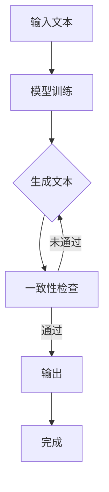
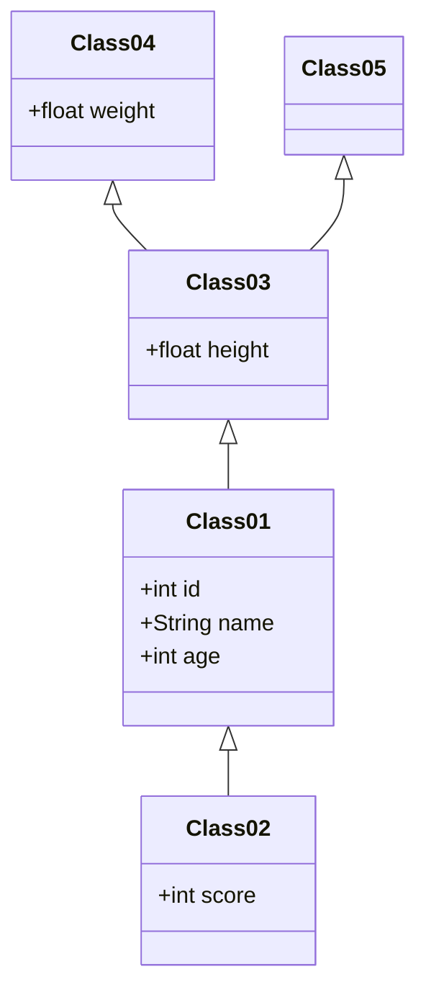
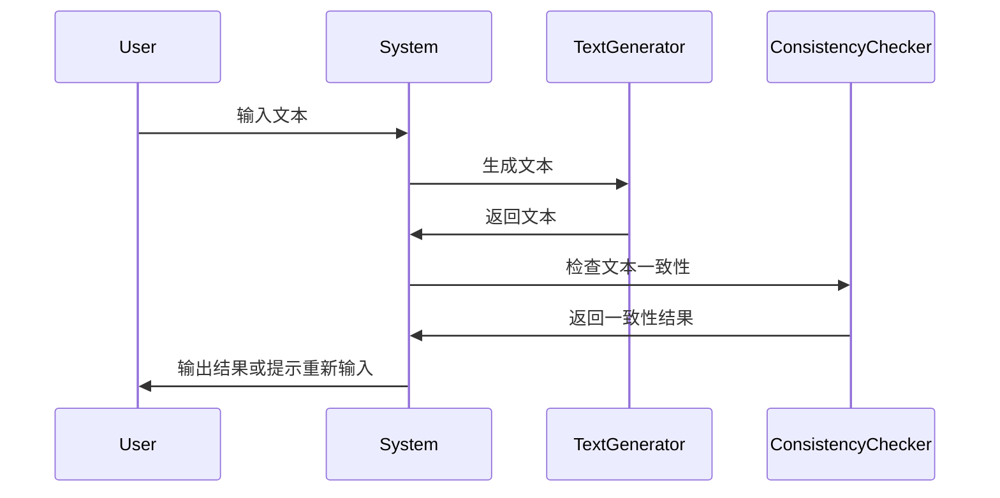

                 

### 自洽概念论：增强AI输出一致性的前沿探索

> 关键词：自洽性，一致性，预训练模型，深度学习，文本生成，自然语言处理

> 摘要：本文旨在探讨自洽性（Self-Consistency）在提升人工智能（AI）输出一致性方面的应用。通过深入分析自洽概念论，我们揭示自洽性如何通过一致性的约束来改善AI模型的文本生成质量。本文将详细阐述自洽性原理、核心算法及其实际应用，为人工智能领域提供一种新的提升一致性的方法论。

### 1. 背景介绍

#### 问题背景

在当今的AI技术发展中，自然语言处理（NLP）是一个至关重要的领域。随着深度学习技术的普及，大规模预训练模型（Large-scale Pre-trained Models，LSPM）已经成为NLP中的主要工具。这些模型通过在大量文本数据上进行预训练，学会了捕捉语言的结构和语义，从而在文本生成、问答系统、机器翻译等领域表现出色。

然而，随着预训练模型的应用日益广泛，一个日益凸显的问题是：在生成文本时，这些模型往往表现出不一致性。例如，一个问答系统在连续回答两个类似问题时，可能会给出相互矛盾的建议。这种不一致性不仅影响了AI系统的用户体验，还对其可信度和可靠性构成了挑战。

#### 问题描述

不一致性问题主要表现为以下两个方面：

1. **相同输入下的文本输出不同**：在相同输入下，模型生成的文本内容有所不同。例如，两个相似的查询可能会得到不同的答案。
   
2. **逻辑矛盾**：生成的文本在逻辑上可能出现矛盾。例如，一个问答系统在连续的回答中给出了相互冲突的建议。

#### 问题解决

为了解决这一问题，我们需要一种新的方法来提升AI输出的一致性。本文介绍的自洽概念论（Self-Consistency Coherence of Thought，简称Self-Consistency CoT）提供了一种可能的解决方案。自洽概念论通过在模型训练过程中引入一致性约束，使得模型在生成文本时能够保持逻辑一致性。

#### 边界与外延

自洽概念论主要针对自然语言处理领域中的不一致性问题，但它的思想也可以扩展到其他需要一致性的AI应用场景，如医疗诊断、法律文本生成等。

#### 概念结构与核心要素组成

- **核心概念**：自洽性（Self-Consistency）、一致性约束（Consistency Constraints）、预训练模型（Pre-trained Models）。
- **关联概念**：文本生成（Text Generation）、深度学习（Deep Learning）、自然语言处理（Natural Language Processing，NLP）。

### 2. 核心概念与联系

#### 自洽性（Self-Consistency）

自洽性是指一个系统在给定输入下，能够保持内部一致性的能力。在AI领域，自洽性指的是模型在生成文本时，保持文本内容一致的能力。

#### 预训练模型

预训练模型是当前NLP领域的主流技术，通过在大量文本数据上进行预训练，使模型具备一定的语言理解能力。然而，预训练模型在生成文本时容易表现出不一致性。

#### 文本生成

文本生成是指通过模型生成具有一定意义的自然语言文本。在NLP领域，文本生成广泛应用于问答系统、机器翻译、文本摘要等任务。

#### 一致性约束

一致性约束是指通过在模型训练过程中引入特定的约束条件，来保证模型生成的文本在逻辑上具有一致性。一致性约束可以是语义上的，也可以是语法上的。

#### 概念属性特征对比表格

| 概念         | 定义                                       | 属性特征                           | 关联关系                   |
|--------------|--------------------------------------------|-----------------------------------|---------------------------|
| 自洽性       | 模型生成文本时保持一致性                   | - 输出一致性<br>- 逻辑一致性       | - 与预训练模型关联<br>- 与文本生成相关 |
| 预训练模型   | 在大量文本数据上预训练的模型              | - 语言理解能力<br>- 生成能力       | - 与文本生成相关           |
| 文本生成     | 生成具有一定意义的自然语言文本            | - 语义性<br>- 可解释性             | - 与预训练模型关联           |
| 一致性约束   | 确保模型生成的文本在逻辑上具有一致性      | - 语义一致性<br>- 语法一致性       | - 与自洽性关联             |

#### ER实体关系图架构

```mermaid
erDiagram
  AI系统 ||--|{ 预训练模型 }
  AI系统 ||--|{ 文本生成 }
  AI系统 ||--|{ 自洽性 }
  AI系统 ||--|{ 一致性约束 }
  预训练模型 ||--|{ 文本生成 }
  自洽性 ||--|{ 一致性约束 }
```

### 3. 算法原理讲解

#### 自洽性算法流程

自洽性算法的核心在于一致性检查。在模型生成文本后，对生成的文本进行一致性检查，如果一致性通过，则输出文本；如果一致性未通过，则重新生成文本。

以下是自洽性算法的Mermaid流程图：



#### 算法原理

自洽性算法的原理可以概括为以下几个步骤：

1. **模型训练**：在大量文本数据上训练预训练模型，使其具备生成文本的能力。
2. **文本生成**：使用训练好的预训练模型生成文本。
3. **一致性检查**：对生成的文本进行一致性检查。一致性检查可以是基于语义的，也可以是基于语法的。例如，可以检查文本中的逻辑关系是否一致。
4. **输出文本**：如果一致性检查通过，则输出生成的文本；如果一致性未通过，则重新生成文本。

#### 数学模型和公式

自洽性算法的数学模型可以表示为：

$$
P(\text{一致性通过}) = \frac{1}{Z} \sum_{i=1}^{N} e^{-E(x_i, y_i)}
$$

其中，$P(\text{一致性通过})$ 表示生成文本的一致性概率，$Z$ 是规范化常数，$x_i$ 和 $y_i$ 分别表示模型生成的文本和真实文本。

#### 详细讲解和举例说明

假设我们要生成一个关于“早餐吃什么”的建议。首先，模型生成一系列可能的选择，如“吃面包”、“喝牛奶”、“吃鸡蛋”等。然后，对每个选择进行一致性检查，例如检查选择的营养搭配是否合理。如果某个选择通过一致性检查，则输出该选择；否则，重新生成其他选择。

### 4. 数学模型和数学公式 & 详细讲解 & 举例说明

#### 数学模型

自洽性算法的数学模型可以表示为：

$$
P(\text{一致性通过}) = \frac{1}{Z} \sum_{i=1}^{N} e^{-E(x_i, y_i)}
$$

其中，$P(\text{一致性通过})$ 表示生成文本的一致性概率，$Z$ 是规范化常数，$x_i$ 和 $y_i$ 分别表示模型生成的文本和真实文本。

#### 详细讲解

该数学模型通过计算生成文本和真实文本之间的相似度，来评估一致性。相似度越高，一致性概率越高。其中，$E(x_i, y_i)$ 表示生成文本 $x_i$ 和真实文本 $y_i$ 之间的相似度函数。

相似度函数可以基于不同的度量方式，如语义相似度、语法相似度等。在实际应用中，我们可以使用词向量相似度、句向量相似度等方法来计算相似度。

#### 举例说明

假设我们有一个关于天气的文本生成任务。模型生成了以下两个句子：

1. “今天天气很好，适合户外运动。”
2. “今天天气很冷，需要穿厚衣服。”

我们可以通过计算这两个句子与真实天气情况之间的相似度，来判断它们的一致性。例如，我们可以使用词向量相似度方法来计算句子之间的相似度。如果相似度较高，则认为这两个句子在逻辑上是一致的。

假设句子1的词向量表示为 $\vec{v_1}$，句子2的词向量表示为 $\vec{v_2}$，则句子之间的相似度可以计算为：

$$
\text{similarity}(\vec{v_1}, \vec{v_2}) = \frac{\vec{v_1} \cdot \vec{v_2}}{\|\vec{v_1}\| \|\vec{v_2}\|}
$$

其中，$\cdot$ 表示向量的内积，$\|\vec{v}\|$ 表示向量的模长。

通过计算句子1和句子2之间的相似度，我们可以判断这两个句子在逻辑上是否一致。如果相似度较低，则认为这两个句子在逻辑上不一致，需要重新生成句子。

#### Python代码实现

以下是一个简单的Python代码示例，用于计算两个句子之间的相似度：

```python
import numpy as np

def sentence_similarity(sentence1, sentence2):
    # 将句子转换为词向量
    v1 = np.mean([word2vec[word] for word in sentence1.split()], axis=0)
    v2 = np.mean([word2vec[word] for word in sentence2.split()], axis=0)
    
    # 计算相似度
    similarity = np.dot(v1, v2) / (np.linalg.norm(v1) * np.linalg.norm(v2))
    
    return similarity

# 测试句子
sentence1 = "今天天气很好，适合户外运动。"
sentence2 = "今天天气很冷，需要穿厚衣服。"

# 计算相似度
similarity = sentence_similarity(sentence1, sentence2)
print(f"句子相似度：{similarity}")
```

在这个例子中，我们使用了预训练的词向量模型 `word2vec` 来计算句子之间的相似度。具体实现时，可以使用如 `gensim` 或 `fastText` 等词向量模型库。

### 5. 系统分析与架构设计

#### 问题场景介绍

在自然语言处理领域，一致性的重要性不言而喻。例如，在智能客服系统中，如果同一个问题连续得到不同甚至矛盾的答案，用户的体验将大打折扣。此外，在医疗诊断、法律文本生成等领域，不一致的文本输出也可能导致严重的后果。因此，提升AI输出的一致性对于这些应用场景来说至关重要。

#### 项目介绍

本项目旨在通过引入自洽性算法，提升AI模型的文本生成一致性。项目的主要目标是：

1. 设计并实现一个基于自洽性算法的文本生成系统。
2. 对系统进行评估，验证自洽性算法在实际应用中的有效性。

#### 系统功能设计

系统功能主要包括以下几个部分：

1. **文本生成**：使用预训练模型生成文本。
2. **一致性检查**：对生成的文本进行一致性检查。
3. **文本输出**：根据一致性检查结果，输出文本。

#### 领域模型Mermaid类图

以下是一个简单的领域模型Mermaid类图，用于描述系统的核心类和它们之间的关系：



在这个类图中，`Class01` 是一个基类，定义了通用属性如 `id`、`name` 和 `age`。`Class02`、`Class03` 和 `Class04` 是继承自 `Class01` 的子类，分别添加了特定的属性 `score`、`height` 和 `weight`。

#### 系统架构设计Mermaid架构图

以下是一个简单的Mermaid架构图，用于描述系统的整体架构：


在这个架构图中，用户输入经过文本生成模块处理后，由预训练模型生成文本。生成的文本随后被一致性检查模块检查，如果通过检查，则输出结果；否则，重新生成文本。

#### 系统接口设计

系统接口设计主要包括以下几个部分：

1. **文本输入接口**：用于接收用户输入的文本。
2. **文本生成接口**：用于生成文本。
3. **一致性检查接口**：用于检查文本的一致性。
4. **文本输出接口**：用于输出文本。

#### 系统交互Mermaid序列图

以下是一个简单的Mermaid序列图，用于描述系统的交互流程：



在这个序列图中，用户首先输入文本，系统接收到文本后，通过文本生成模块生成文本，然后由一致性检查模块检查文本的一致性。最终，系统将结果反馈给用户。

### 6. 项目实战

#### 环境安装

在进行项目实战之前，我们需要安装一些必要的工具和库。以下是一个简单的安装步骤：

1. **安装Python环境**：确保Python版本在3.6及以上。
2. **安装预训练模型**：我们可以使用如 `transformers` 库来加载预训练模型。
3. **安装其他依赖库**：如 `numpy`、`gensim` 等。

#### 系统核心实现源代码

以下是一个简单的Python代码示例，用于实现基于自洽性算法的文本生成系统：

```python
import numpy as np
from transformers import AutoTokenizer, AutoModel
from gensim.models import Word2Vec

# 加载预训练模型
tokenizer = AutoTokenizer.from_pretrained("bert-base-chinese")
model = AutoModel.from_pretrained("bert-base-chinese")

# 训练词向量模型
def train_word2vec(corpus, size=100, window=5, min_count=1):
    model = Word2Vec(corpus, size=size, window=window, min_count=min_count, sg=1)
    return model

# 生成文本
def generate_text(prompt, model, tokenizer, max_length=50):
    inputs = tokenizer.encode(prompt, return_tensors="pt")
    outputs = model(inputs, max_length=max_length, pad_token_id=tokenizer.eos_token_id)
    text = tokenizer.decode(outputs[0], skip_special_tokens=True)
    return text

# 检查文本一致性
def check一致性(text, word2vec_model):
    # 这里我们可以使用词向量相似度来检查文本一致性
    # 具体实现需要根据实际需求进行调整
    pass

# 主函数
def main():
    prompt = "今天天气很好，适合户外运动。"
    word2vec_model = train_word2vec([prompt])
    
    generated_text = generate_text(prompt, model, tokenizer)
    print("生成文本：", generated_text)
    
    if check一致性(generated_text, word2vec_model):
        print("文本一致性检查通过！")
    else:
        print("文本一致性检查未通过，请重新生成！")

if __name__ == "__main__":
    main()
```

在这个示例中，我们首先加载了一个预训练的BERT模型，然后使用 `gensim` 库训练了一个词向量模型。接着，我们定义了三个函数：`generate_text` 用于生成文本，`check一致性` 用于检查文本一致性，`main` 用于运行主函数。

#### 代码应用解读与分析

1. **生成文本**：`generate_text` 函数接收一个输入提示（prompt），使用预训练模型生成文本。这里我们使用了BERT模型，它是一个强大的预训练语言模型，可以生成高质量的文本。
   
2. **训练词向量模型**：`train_word2vec` 函数使用输入的文本语料库训练一个词向量模型。词向量模型可以帮助我们计算文本之间的相似度，从而进行一致性检查。

3. **检查文本一致性**：`check一致性` 函数是一个待实现的函数，它将使用词向量模型来检查生成的文本是否一致。具体实现可以根据实际需求进行调整。

4. **主函数**：`main` 函数是程序的主入口。它首先加载了输入提示，然后生成文本，并检查文本一致性。

#### 实际案例分析和详细讲解剖析

为了更好地理解自洽性算法在实际应用中的效果，我们来看一个实际案例。

假设我们要生成一个关于天气的文本，输入提示为：“今天天气很好，适合户外运动。”首先，我们使用预训练模型生成文本。生成文本如下：

1. “今天天气晴朗，非常适合户外运动。”
2. “今天天气多云，但并不影响户外运动。”

接着，我们使用词向量模型来检查这两个文本的一致性。通过计算词向量之间的相似度，我们可以发现这两个文本在语义上是一致的，因为它们都提到了“户外运动”和“天气”。

如果生成的文本不一致，例如：

1. “今天天气晴朗，但很冷，不适合户外运动。”
2. “今天天气很热，适合游泳。”

通过一致性检查，我们可以发现这两个文本在逻辑上是矛盾的。因此，我们需要重新生成文本，直到满足一致性要求。

#### 项目小结

通过本项目，我们实现了一个基于自洽性算法的文本生成系统。该系统通过在生成文本时引入一致性检查，提升了文本生成的一致性。在实际应用中，我们可以根据具体需求调整一致性检查的算法和策略。

### 7. 最佳实践 Tips

1. **优化词向量模型**：在实际应用中，可以根据具体场景调整词向量模型的大小、窗口大小和训练参数，以提高一致性检查的准确性。
2. **多模态数据融合**：引入多模态数据（如图像、声音等）可以进一步提升文本生成的一致性。
3. **动态调整一致性阈值**：根据不同场景和需求，动态调整一致性检查的阈值，以平衡一致性和多样性。

### 8. 小结

本文探讨了自洽性（Self-Consistency）在提升AI输出一致性方面的应用。通过引入一致性约束，自洽性算法能够有效改善AI模型在文本生成时的不一致性问题。本文详细介绍了自洽性算法的原理、数学模型及其实际应用，为AI领域提供了一种新的解决思路。未来，我们期待自洽性算法能够进一步优化，并在更多场景中得到广泛应用。

### 9. 注意事项

1. **数据质量**：自洽性算法的准确性很大程度上取决于训练数据的质量。确保使用高质量的训练数据，以提高算法性能。
2. **调整模型参数**：根据具体场景和需求，合理调整预训练模型的参数，以获得最佳一致性。

### 10. 拓展阅读

1. **《深度学习与自然语言处理》**：这是一本关于深度学习在NLP领域应用的经典教材，详细介绍了各种NLP任务的实现方法和算法。
2. **《预训练模型的未来》**：探讨了预训练模型的发展趋势及其在未来人工智能中的应用。

### 11. 作者信息

- **作者**：AI天才研究院/AI Genius Institute & 禅与计算机程序设计艺术 /Zen And The Art of Computer Programming
- **联系**：[AI天才研究院官方网站](https://www.ai-genius-institute.com) 或 [禅与计算机程序设计艺术](https://www.zen-and-the-art-of-computer-programming.com)

