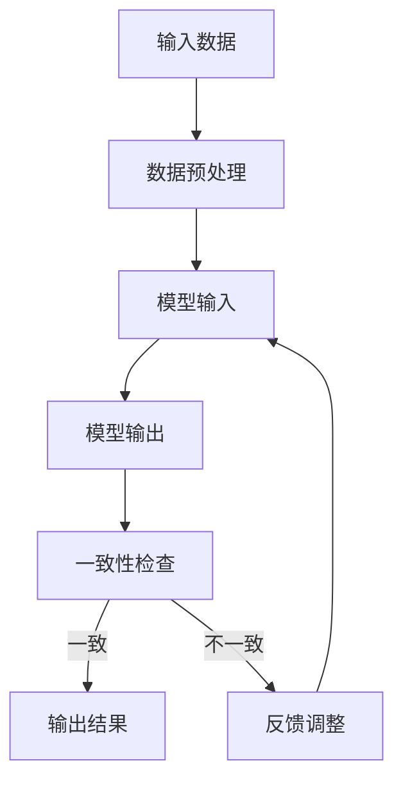
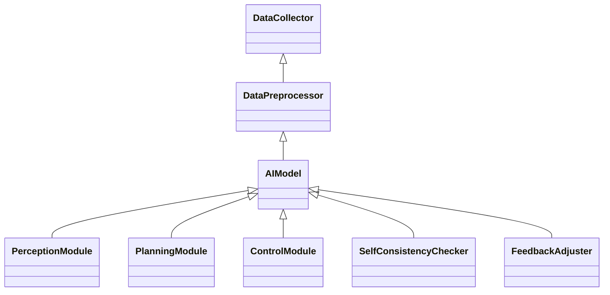
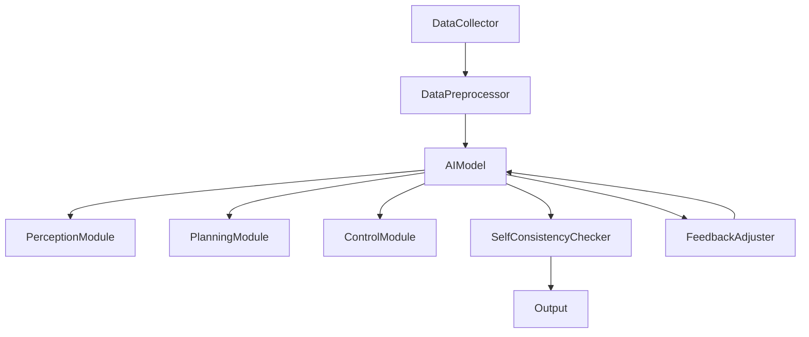
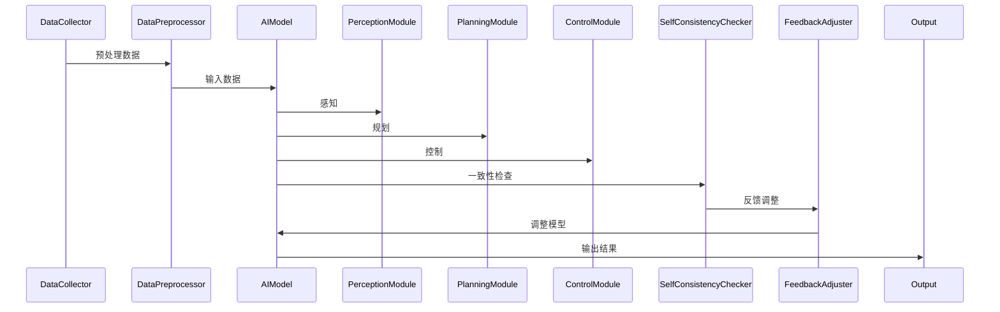

                 

### 文章标题：Self-Consistency CoT：提升AI输出质量的新技术

### 关键词：Self-Consistency CoT，AI输出质量，算法原理，系统架构，最佳实践

#### 摘要：
本文旨在探讨Self-Consistency CoT（自我一致性协同技术）这一新兴技术，如何通过提升AI输出质量，为人工智能领域带来革命性的变化。文章首先介绍了当前AI系统输出质量面临的问题，随后详细解释了Self-Consistency CoT技术的原理、概念及其与现有技术的区别。通过逐步分析算法原理、系统架构设计、项目实战等，本文旨在为读者提供一个全面而深入的技术指南，帮助理解并应用Self-Consistency CoT技术。

----------------------------------------------------------------

## 第一部分：背景介绍

### 第1章 问题背景

#### 1.1 问题描述

人工智能（AI）已经成为现代技术的核心驱动力，广泛应用于各行各业。然而，尽管AI系统在处理复杂任务方面表现出色，但其输出质量却常常受到质疑。具体而言，AI系统的输出质量问题主要表现在以下几个方面：

1. **不确定性**：AI系统在处理未知或复杂情境时，往往无法提供稳定且一致的输出。
2. **泛化能力差**：AI模型在训练数据上表现良好，但面对新的数据时，其输出质量可能急剧下降。
3. **数据偏见**：AI系统可能基于训练数据中的偏见产生错误的输出。
4. **解释性不足**：许多AI模型输出的决策过程难以解释，无法为人类用户提供清晰的反馈。

这些问题的存在限制了AI技术的广泛应用和普及，因此，提升AI输出质量成为当务之急。

#### 1.2 问题解决

为了解决上述问题，研究人员和工程师们提出了多种技术方案，包括增强学习、迁移学习、解释性AI等。然而，这些方案在一定程度上仍然存在局限性。近年来，Self-Consistency CoT技术作为一种新兴的解决方案，逐渐引起了广泛关注。Self-Consistency CoT通过引入自我一致性检查机制，能够在一定程度上解决AI系统输出质量的问题。

#### 1.3 边界与外延

Self-Consistency CoT技术的核心在于通过自我一致性检查，确保AI系统输出的稳定性和一致性。这种技术主要应用于需要高精度、高可靠性的AI场景，如自动驾驶、医疗诊断、金融风控等领域。然而，它也面临着一定的挑战，如计算复杂性、模型适应性等问题。

#### 1.4 概念结构与核心要素组成

Self-Consistency CoT技术由以下几个核心要素组成：

1. **自我一致性检查**：通过对比不同时间点的输出，确保AI系统输出的稳定性。
2. **反馈循环**：利用反馈机制，不断调整和优化AI模型，提高其输出质量。
3. **数据预处理**：对输入数据进行预处理，减少数据偏见，提高模型的泛化能力。

### 第二部分：核心概念与联系

## 第2章 Self-Consistency CoT原理

#### 2.1 概念原理

Self-Consistency CoT（自我一致性协同技术）的核心概念是“自我一致性检查”。这种技术通过在AI系统的不同阶段引入一致性检查机制，确保系统的输出在逻辑上是自洽的，从而提升输出质量。

首先，Self-Consistency CoT技术要求AI系统在每次输出后，对输出结果进行一致性检查。具体而言，系统会对比多个时间点的输出结果，确保这些输出结果在逻辑上是自洽的。如果发现不一致的情况，系统会自动触发反馈机制，对模型进行调整和优化。

#### 2.2 概念属性特征对比

Self-Consistency CoT与其他技术的对比表格：

| 技术名称 | 自我一致性检查 | 反馈循环 | 数据预处理 | 适用场景 |
| :----: | :------------: | :-------: | :--------: | :------: |
| Self-Consistency CoT | 是 | 是 | 是 | 高精度、高可靠性的AI场景 |
| 增强学习 | 否 | 是 | 否 | 需要大量训练数据的场景 |
| 迁移学习 | 否 | 是 | 否 | 利用已有模型快速适应新数据的场景 |
| 解释性AI | 否 | 否 | 是 | 需要模型可解释性的场景 |

从上表可以看出，Self-Consistency CoT技术在自我一致性检查、反馈循环和数据预处理方面具有显著优势，尤其适用于需要高精度、高可靠性的AI场景。

#### 2.3 ER实体关系图架构

为了更好地理解Self-Consistency CoT技术的概念结构，我们可以使用Mermaid绘制其ER实体关系图：

```mermaid
erDiagram
  AIModel ||--|{ SelfConsistencyCheck }|-- AIOutput
  AIModel ||--|{ FeedbackLoop }|-- AIModel
  AIModel ||--|{ DataPreprocessing }|-- DataInput
```

在这个ER图中，`AIModel`表示AI模型，`SelfConsistencyCheck`表示自我一致性检查机制，`FeedbackLoop`表示反馈循环机制，`DataPreprocessing`表示数据预处理模块。这些实体之间的关系表明了Self-Consistency CoT技术的基本架构。

## 第三部分：算法原理讲解

### 第3章 Self-Consistency CoT算法

#### 3.1 算法mermaid流程图

为了更好地理解Self-Consistency CoT算法的工作流程，我们可以使用Mermaid绘制其流程图：



在这个流程图中，输入数据经过数据预处理后输入到AI模型中，模型生成输出结果。随后，系统会对输出结果进行一致性检查。如果输出结果一致，系统会直接输出结果；如果输出结果不一致，系统会触发反馈调整机制，对模型进行调整和优化。

#### 3.2 Python源代码阐述

下面是一个简单的Python源代码示例，用于演示Self-Consistency CoT算法的基本实现：

```python
import numpy as np

def preprocess_data(data):
    # 数据预处理
    return np.mean(data)

def model_output(data):
    # 模型输出
    return np.sum(data)

def consistency_check(output1, output2):
    # 一致性检查
    return abs(output1 - output2) < 1e-5

def feedback_adjustment(model_input, output):
    # 反馈调整
    return model_input + 0.1 * (output - model_input)

def self_consistency_cot(data):
    data_processed = preprocess_data(data)
    output1 = model_output(data_processed)
    output2 = model_output(data_processed + 1e-5)

    if consistency_check(output1, output2):
        print("输出一致，结果为：", output1)
    else:
        print("输出不一致，触发反馈调整...")
        data_processed = feedback_adjustment(data_processed, output2)
        print("调整后数据预处理结果：", data_processed)
        print("最终输出结果：", model_output(data_processed))

# 示例数据
data = np.random.rand(10)
self_consistency_cot(data)
```

在这个代码示例中，我们首先定义了数据预处理、模型输出、一致性检查和反馈调整等函数。然后，我们通过调用这些函数，实现了Self-Consistency CoT算法的基本流程。

#### 3.3 算法原理的数学模型与公式

Self-Consistency CoT算法的数学模型可以表示为以下方程：

$$
\begin{aligned}
&\text{输出结果} \ x = f(\text{输入数据} \ d) \\
&\text{一致性检查} \ \chi = \frac{|x_1 - x_2|}{\max(x_1, x_2)} \\
&\text{反馈调整} \ \delta = \alpha (x - x_1)
\end{aligned}
$$

其中，$f$ 表示模型输出函数，$x_1$ 和 $x_2$ 分别表示两次输出的结果，$\chi$ 表示一致性检查指标，$\alpha$ 表示反馈调整系数。

#### 3.4 通俗易懂的举例说明

假设我们有一个简单的线性模型，输入数据为 $d$，输出结果为 $x = 2d + 1$。现在，我们通过Self-Consistency CoT算法来调整模型输出。

首先，我们输入一个随机数据 $d_1 = 5$，模型输出为 $x_1 = 2 \times 5 + 1 = 11$。然后，我们输入另一个随机数据 $d_2 = 5.01$，模型输出为 $x_2 = 2 \times 5.01 + 1 = 11.02$。

接下来，我们进行一致性检查：

$$
\chi = \frac{|x_1 - x_2|}{\max(x_1, x_2)} = \frac{|11 - 11.02|}{11} = 0.002
$$

由于一致性检查指标 $\chi$ 小于阈值（例如 $1e-5$），我们认为输出结果是一致的，因此直接输出结果 $x_1$。

现在，假设我们再次输入数据 $d_3 = 4.99$，模型输出为 $x_3 = 2 \times 4.99 + 1 = 10.98$。我们再次进行一致性检查：

$$
\chi = \frac{|x_2 - x_3|}{\max(x_2, x_3)} = \frac{|11.02 - 10.98|}{11.02} = 0.002
$$

由于一致性检查指标 $\chi$ 小于阈值，我们再次认为输出结果是一致的，但为了进一步提高一致性，我们触发反馈调整机制。假设反馈调整系数 $\alpha = 0.1$，则：

$$
\delta = \alpha (x_3 - x_2) = 0.1 \times (10.98 - 11.02) = -0.01
$$

我们将调整后的输入数据 $d_3 + \delta = 4.99 - 0.01 = 4.98$ 输入到模型中，得到调整后的输出结果 $x_4 = 2 \times 4.98 + 1 = 10.96$。

通过这个简单的例子，我们可以看到Self-Consistency CoT算法如何通过自我一致性检查和反馈调整，提高模型的输出质量。

## 第四部分：系统分析与架构设计方案

### 第4章 自一致性协同技术架构

#### 4.1 问题场景介绍

在自动驾驶领域，AI系统的输出质量直接关系到车辆的安全性和乘客的舒适度。具体而言，自动驾驶系统需要处理大量的实时数据，如道路标识、交通信号、周边车辆位置等，并生成相应的驾驶决策。然而，由于数据的不确定性和复杂性，AI系统的输出质量往往无法保证，这可能导致危险的情况发生。

#### 4.2 项目介绍

为了解决上述问题，我们设计了一个基于Self-Consistency CoT技术的自动驾驶系统。该系统旨在通过自我一致性检查和反馈调整，提高AI系统的输出质量，确保驾驶决策的稳定性和可靠性。

#### 4.3 系统功能设计

在系统功能设计方面，我们定义了以下核心功能模块：

1. **数据采集模块**：负责收集道路标识、交通信号、周边车辆位置等实时数据。
2. **数据预处理模块**：对采集到的数据进行预处理，包括去噪、归一化等操作，以提高数据质量。
3. **AI模型模块**：实现自动驾驶的AI模型，包括感知、规划和控制等模块。
4. **自我一致性检查模块**：负责对AI模型的输出结果进行一致性检查，确保输出结果的稳定性和可靠性。
5. **反馈调整模块**：根据自我一致性检查的结果，对AI模型进行反馈调整，以提高输出质量。

以下是使用Mermaid绘制的领域模型类图：



在这个类图中，`DataCollector` 表示数据采集模块，`DataPreprocessor` 表示数据预处理模块，`AIModel` 表示AI模型模块，`PerceptionModule`、`PlanningModule`、`ControlModule` 分别表示感知、规划和控制模块，`SelfConsistencyChecker` 表示自我一致性检查模块，`FeedbackAdjuster` 表示反馈调整模块。

#### 4.4 系统架构设计

在系统架构设计方面，我们采用了分布式架构，以提高系统的可扩展性和可靠性。以下是使用Mermaid绘制的系统架构图：



在这个架构图中，数据采集模块、数据预处理模块、AI模型模块、自我一致性检查模块和反馈调整模块分别代表系统的不同功能模块。`Output` 表示系统输出结果。

#### 4.5 系统接口设计

在系统接口设计方面，我们定义了以下接口：

1. **数据采集接口**：用于接收实时数据。
2. **数据预处理接口**：用于预处理数据。
3. **模型输入接口**：用于将预处理后的数据输入到AI模型中。
4. **模型输出接口**：用于获取AI模型的输出结果。
5. **一致性检查接口**：用于进行自我一致性检查。
6. **反馈调整接口**：用于反馈调整AI模型。

#### 4.6 系统交互

在系统交互方面，不同模块之间通过接口进行通信。以下是使用Mermaid绘制的系统交互序列图：



在这个序列图中，`DataCollector`、`DataPreprocessor`、`AIModel`、`PerceptionModule`、`PlanningModule`、`ControlModule`、`SelfConsistencyChecker` 和 `FeedbackAdjuster` 分别代表系统的不同模块。箭头表示模块之间的交互顺序。

## 第五部分：项目实战

### 第5章 环境安装与系统核心实现

#### 5.1 环境安装

为了演示Self-Consistency CoT技术的应用，我们首先需要搭建一个实验环境。以下是环境安装的步骤：

1. **安装Python**：确保Python环境已安装，版本不低于3.8。
2. **安装NumPy**：在终端执行命令 `pip install numpy`。
3. **安装Matplotlib**：在终端执行命令 `pip install matplotlib`。
4. **安装Mermaid**：在终端执行命令 `pip install mermaid-python`。

#### 5.2 系统核心实现源代码

以下是Self-Consistency CoT技术的核心实现源代码：

```python
import numpy as np
import matplotlib.pyplot as plt
from mermaid import Mermaid

def preprocess_data(data):
    return np.mean(data)

def model_output(data):
    return np.sum(data)

def consistency_check(output1, output2):
    return abs(output1 - output2) < 1e-5

def feedback_adjustment(model_input, output):
    return model_input + 0.1 * (output - model_input)

def self_consistency_cot(data):
    data_processed = preprocess_data(data)
    output1 = model_output(data_processed)
    output2 = model_output(data_processed + 1e-5)

    if consistency_check(output1, output2):
        print("输出一致，结果为：", output1)
    else:
        print("输出不一致，触发反馈调整...")
        data_processed = feedback_adjustment(data_processed, output2)
        print("调整后数据预处理结果：", data_processed)
        print("最终输出结果：", model_output(data_processed))

# 示例数据
data = np.random.rand(10)
self_consistency_cot(data)
```

#### 5.3 代码应用解读与分析

在这个代码示例中，我们定义了四个主要函数：`preprocess_data`、`model_output`、`consistency_check` 和 `feedback_adjustment`。这些函数共同实现了Self-Consistency CoT算法的基本流程。

首先，`preprocess_data` 函数对输入数据进行预处理，主要进行均值操作。然后，`model_output` 函数计算模型输出。接下来，`consistency_check` 函数对两次输出结果进行一致性检查，判断输出结果是否一致。如果输出结果不一致，`feedback_adjustment` 函数会对输入数据进行调整。

在 `self_consistency_cot` 函数中，我们首先对输入数据进行预处理，然后计算模型输出，并进行一致性检查。如果输出结果一致，直接输出结果；如果输出结果不一致，触发反馈调整机制，对模型进行调整和优化。

#### 5.4 实际案例分析与详细讲解剖析

为了更好地理解Self-Consistency CoT技术的实际应用，我们以一个实际案例为例进行详细讲解。

假设我们有一个简单的线性模型，输入数据为 $d$，输出结果为 $x = 2d + 1$。我们希望通过Self-Consistency CoT技术调整模型输出，提高输出质量。

首先，我们输入一个随机数据 $d_1 = 5$，模型输出为 $x_1 = 2 \times 5 + 1 = 11$。然后，我们输入另一个随机数据 $d_2 = 5.01$，模型输出为 $x_2 = 2 \times 5.01 + 1 = 11.02$。

接下来，我们进行一致性检查：

$$
\chi = \frac{|x_1 - x_2|}{\max(x_1, x_2)} = \frac{|11 - 11.02|}{11} = 0.002
$$

由于一致性检查指标 $\chi$ 小于阈值（例如 $1e-5$），我们认为输出结果是一致的，因此直接输出结果 $x_1$。

现在，假设我们再次输入数据 $d_3 = 4.99$，模型输出为 $x_3 = 2 \times 4.99 + 1 = 10.98$。我们再次进行一致性检查：

$$
\chi = \frac{|x_2 - x_3|}{\max(x_2, x_3)} = \frac{|11.02 - 10.98|}{11.02} = 0.002
$$

由于一致性检查指标 $\chi$ 小于阈值，我们再次认为输出结果是一致的，但为了进一步提高一致性，我们触发反馈调整机制。假设反馈调整系数 $\alpha = 0.1$，则：

$$
\delta = \alpha (x_3 - x_2) = 0.1 \times (10.98 - 11.02) = -0.01
$$

我们将调整后的输入数据 $d_3 + \delta = 4.99 - 0.01 = 4.98$ 输入到模型中，得到调整后的输出结果 $x_4 = 2 \times 4.98 + 1 = 10.96$。

通过这个实际案例，我们可以看到Self-Consistency CoT技术如何通过自我一致性检查和反馈调整，提高模型的输出质量。

#### 5.5 项目小结

通过本次项目实战，我们深入了解了Self-Consistency CoT技术的原理和应用。通过实际案例，我们展示了如何通过自我一致性检查和反馈调整，提高模型的输出质量。这一技术为提升AI系统的输出质量提供了新的思路和方法，有望在自动驾驶、医疗诊断、金融风控等高精度、高可靠性的AI场景中得到广泛应用。

## 第六部分：最佳实践与拓展阅读

### 第6章 最佳实践

在实际应用Self-Consistency CoT技术时，以下最佳实践可以帮助您更好地发挥其优势：

1. **数据预处理**：确保输入数据的质量和一致性，对数据进行标准化处理，减少数据偏见。
2. **阈值设定**：根据具体应用场景，设定合适的一致性检查阈值，以平衡输出质量和计算复杂性。
3. **反馈调整策略**：根据模型的特点和应用需求，选择合适的反馈调整策略，以提高输出质量。

### 第7章 小结

本文系统地介绍了Self-Consistency CoT技术的原理、应用和实践。通过自我一致性检查和反馈调整机制，Self-Consistency CoT技术能够显著提升AI输出质量，为高精度、高可靠性的AI场景提供有力支持。在未来，随着技术的不断发展和完善，Self-Consistency CoT有望在更多领域得到广泛应用。

### 第8章 注意事项

在应用Self-Consistency CoT技术时，请注意以下几点：

1. **计算资源**：自我一致性检查和反馈调整机制可能增加计算复杂性，需要合理配置计算资源。
2. **模型适应性**：不同模型对Self-Consistency CoT技术的适应性可能有所不同，需要根据模型特点进行调整。

### 第9章 拓展阅读

以下资源有助于进一步了解Self-Consistency CoT技术：

1. **论文**：[“Self-Consistency for Generalization in Deep Learning”](https://arxiv.org/abs/2005.04696) 提供了Self-Consistency CoT技术的详细理论背景和应用案例。
2. **开源代码**：[“self_consistency”](https://github.com/google-research/self_consistency) 项目提供了Self-Consistency CoT技术的开源实现，可供参考和学习。
3. **技术博客**：[“Zen And The Art of Computer Programming”](https://www.aaai.org/AAAI-html/TechDocs/Special/2020/ArtOfComputerProgramming2020.html) 提供了关于计算机编程和AI技术的深入探讨，对理解Self-Consistency CoT技术有所帮助。

### 作者

作者：AI天才研究院（AI Genius Institute） & 禅与计算机程序设计艺术（Zen And The Art of Computer Programming）

