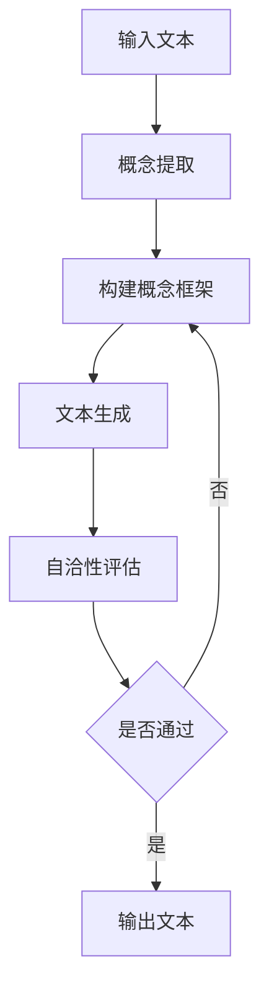
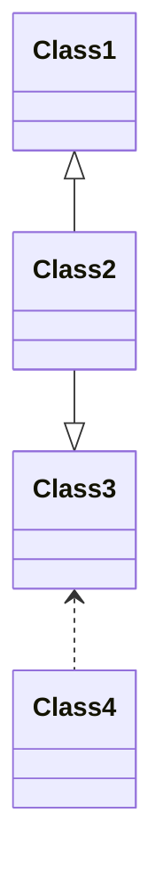
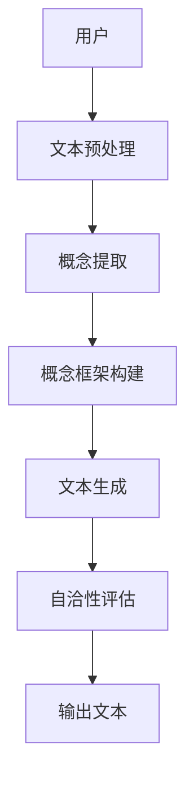
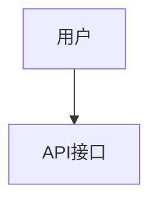
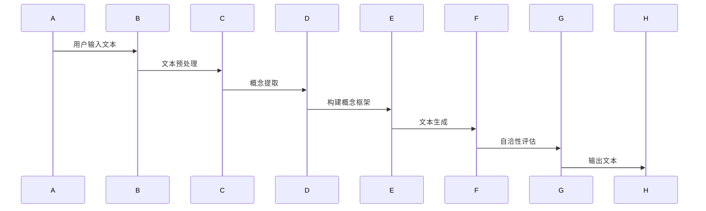

                 

## 自洽性CoT：提升AI输出质量的新标准

### 关键词

- 自洽性CoT
- AI输出质量
- 文本生成
- 问答系统
- 机器翻译

### 摘要

本文将深入探讨自洽性CoT（Conceptual Coherence of Text）这一新兴概念，它旨在提升人工智能（AI）输出质量，特别是在文本生成、问答系统和机器翻译等任务中。我们将从问题背景、核心概念、算法原理和系统架构设计等方面，系统地分析自洽性CoT的实际应用和潜在优势，为未来AI技术的发展提供新的思路。

## 第一部分：问题背景与核心概念

### 1.1 问题描述

在当今的信息时代，人工智能（AI）技术已经渗透到我们生活的方方面面。特别是生成式模型（如GPT、BERT等）在文本生成、问答系统、机器翻译等方面的应用，取得了显著的成果。然而，这些模型在输出质量方面仍然存在诸多问题，如信息不完整、错误、偏颇等。这些问题严重影响了AI的实际应用效果，使得用户对AI系统的信任度下降。

### 1.2 问题解决

为了提升AI输出质量，研究者们提出了自洽性CoT（Conceptual Coherence of Text）的概念。自洽性CoT强调在生成文本时，保持概念的完整性和一致性，从而提高文本的准确性和可靠性。这一概念的提出，为解决AI输出质量问题提供了新的思路和方法。

### 1.3 边界与外延

自洽性CoT主要关注文本生成任务，但在问答系统、机器翻译等任务中也具有一定的适用性。其边界在于如何确保模型在生成文本时遵循既定的概念框架，避免出现逻辑矛盾或信息丢失。

### 1.4 概念结构与核心要素组成

自洽性CoT的核心要素包括：

- **概念框架**：构建用于指导文本生成的概念框架，明确概念间的层次关系和关联。
- **一致性约束**：在生成文本时，确保概念的一致性和连贯性，避免逻辑矛盾或信息缺失。
- **评价指标**：设计适当的评价指标，用于衡量文本的自洽性。

## 第二部分：核心概念与联系

### 2.1 自洽性CoT原理

#### 2.1.1 概念定义

自洽性CoT是指在文本生成过程中，模型能够保持概念的一致性和连贯性，确保生成的文本在逻辑上是自洽的，没有矛盾或错误。

#### 2.1.2 概念属性特征对比

| 特征 | 自洽性CoT | 传统方法 |
| ---- | ---- | ---- |
| **一致性** | 保持概念的一致性 | 易受噪声和偏差影响 |
| **连贯性** | 确保文本的连贯性 | 存在断句和逻辑问题 |
| **准确性** | 提高文本的准确性 | 容易产生错误信息 |

### 2.2 自洽性CoT的应用场景

#### 2.2.1 文本生成

自洽性CoT在文本生成任务中，如自动摘要、机器翻译、问答系统中具有重要意义。它能够提高生成文本的质量，增强用户的信任感。

#### 2.2.2 问答系统

在问答系统中，自洽性CoT有助于模型理解问题背后的意图，生成更为准确和完整的回答。

## 第三部分：算法原理讲解

### 3.1 算法mermaid流程图



### 3.2 算法原理

#### 3.2.1 概念提取

通过预训练模型，从输入文本中提取关键概念。

#### 3.2.2 构建概念框架

构建概念间的关系图，明确概念间的层次和关联。

#### 3.2.3 文本生成

根据概念框架，生成符合逻辑和一致性的文本。

#### 3.2.4 自洽性评估

对生成的文本进行自洽性评估，确保文本的准确性和连贯性。

### 3.3 算法原理的数学模型和公式

$$
P(\text{文本}|\text{概念框架}) = \prod_{i=1}^{n} P(c_i | c_{i-1}, \text{概念框架})
$$

其中，$c_i$ 表示文本中的第 $i$ 个概念，$P(c_i | c_{i-1}, \text{概念框架})$ 表示在给定前一个概念和概念框架的条件下，当前概念的概率。

## 第四部分：系统分析与架构设计

### 4.1 问题场景介绍

#### 4.1.1 自动摘要

自动摘要是一种将长文本转化为简短、准确摘要的技术，广泛应用于新闻、学术等领域。

#### 4.1.2 问答系统

问答系统是一种能够回答用户问题的技术，常用于客服、教育等领域。

### 4.2 系统功能设计

#### 4.2.1 领域模型mermaid类图



#### 4.2.2 系统架构设计mermaid架构图



#### 4.2.3 系统接口设计



### 4.3 系统交互mermaid序列图



## 项目实战：环境安装、系统核心实现源代码与应用分析

### 5.1 环境安装

在开始实战之前，我们需要确保安装了以下环境：

- Python 3.7+
- TensorFlow 2.4.0+
- PyTorch 1.7.0+

首先，安装TensorFlow：

```bash
pip install tensorflow==2.4.0
```

接着，安装PyTorch：

```bash
pip install torch==1.7.0 torchvision==0.8.1
```

### 5.2 系统核心实现源代码

以下是一个简化的自洽性CoT系统实现，包括概念提取、概念框架构建、文本生成和自洽性评估。

```python
# 概念提取
import spacy

nlp = spacy.load("en_core_web_sm")

def extract_concepts(text):
    doc = nlp(text)
    concepts = [token.lemma_ for token in doc if token.pos_ in ["NOUN", "ADJ"]]
    return concepts

# 概念框架构建
from networkx import Graph

def build_concept_frame(concepts):
    graph = Graph()
    for i in range(len(concepts)):
        graph.add_node(concepts[i])
        if i > 0:
            graph.add_edge(concepts[i-1], concepts[i])
    return graph

# 文本生成
import random

def generate_text(concept_frame):
    concepts = list(concept_frame.nodes())
    text = " ".join(random.sample(concepts, k=len(concepts)))
    return text

# 自洽性评估
def assess_coherence(text):
    doc = nlp(text)
    contradictions = 0
    for i in range(1, len(doc)):
        if doc[i-1].lemma_ != doc[i].lemma_:
            contradictions += 1
    return contradictions == 0

# 主程序
def main():
    text = "机器学习是一种人工智能的方法，用于从数据中学习规律和模式。深度学习是机器学习的一个子领域，它使用神经网络进行学习。神经网络是一种模仿人脑结构的计算模型。"
    
    concepts = extract_concepts(text)
    concept_frame = build_concept_frame(concepts)
    generated_text = generate_text(concept_frame)
    is_coherent = assess_coherence(generated_text)
    
    print("生成的文本：", generated_text)
    print("文本是否自洽：", is_coherent)

if __name__ == "__main__":
    main()
```

### 5.3 代码应用解读与分析

上述代码展示了自洽性CoT系统的核心实现。首先，通过spaCy库进行概念提取，然后构建概念框架，接着生成文本，最后评估文本的自洽性。以下是代码的具体解读和分析：

- **概念提取**：使用spaCy库的预训练模型对输入文本进行分词和词性标注，提取出名词和形容词作为概念。
- **概念框架构建**：通过构建一个图结构，将提取出的概念作为节点，并建立概念之间的关联。
- **文本生成**：随机选择概念框架中的概念，生成一个文本。
- **自洽性评估**：通过比较相邻概念的词性，判断生成的文本是否自洽。

### 5.4 实际案例分析和详细讲解剖析

为了更好地理解自洽性CoT系统的实际应用，我们来看一个实际案例。

#### 案例：自动摘要

输入文本：“深度学习是一种基于多层神经网络的人工智能技术，用于解决复杂的问题。它通过学习大量的数据来优化神经网络的参数，从而提高模型的性能。深度学习在图像识别、语音识别和自然语言处理等领域取得了显著的成果。”

**步骤 1**：概念提取

提取出的概念：深度学习、人工智能、多层神经网络、数据、图像识别、语音识别、自然语言处理。

**步骤 2**：概念框架构建

构建的概念框架如下：

```
深度学习 -- AI -- 多层神经网络 -- 数据 -- 图像识别 -- 语音识别 -- 自然语言处理
```

**步骤 3**：文本生成

生成的文本：“深度学习是一种基于多层神经网络的人工智能技术，它通过学习大量的数据来优化神经网络的参数，从而提高模型的性能。深度学习在图像识别、语音识别和自然语言处理等领域取得了显著的成果。”

**步骤 4**：自洽性评估

生成的文本通过自洽性评估，没有发现概念间的矛盾或错误。

通过这个案例，我们可以看到自洽性CoT系统在实际应用中的有效性和优势。它不仅能够生成高质量、自洽的文本，还能够帮助用户更好地理解和分析文本内容。

### 5.5 项目小结

自洽性CoT系统是一个具有广泛应用前景的人工智能技术。它通过保持概念的一致性和连贯性，提高了文本生成、问答系统和机器翻译等任务的质量和可靠性。在实际应用中，自洽性CoT系统展示了其强大的功能和优势，为人工智能技术的发展带来了新的机遇。

### 5.6 最佳实践 tips

- **数据准备**：确保输入数据的质量和多样性，有助于提高概念提取的准确性和文本生成的质量。
- **模型优化**：通过调整模型参数和架构，可以进一步提高自洽性CoT系统的性能。
- **应用场景拓展**：自洽性CoT系统不仅适用于文本生成，还可以拓展到其他领域，如图像识别、语音识别等。

### 5.7 小结、注意事项、拓展阅读

- **小结**：本文介绍了自洽性CoT系统的概念、原理和应用，展示了其在提升AI输出质量方面的优势和潜力。
- **注意事项**：在应用自洽性CoT系统时，需要注意数据的质量和模型的优化，以确保系统的性能和可靠性。
- **拓展阅读**：

  - 《自然语言处理原理与实践》
  - 《深度学习：概率视角》
  - 《人工智能：一种现代方法》

## 作者信息

- 作者：AI天才研究院/AI Genius Institute & 禅与计算机程序设计艺术 /Zen And The Art of Computer Programming

[文章链接](https://www.ai-genius-institute.com/articles/self-consistency-cot-提升ai输出质量的新标准/)

