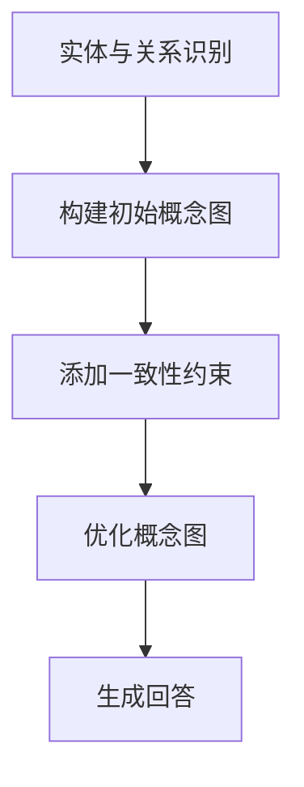
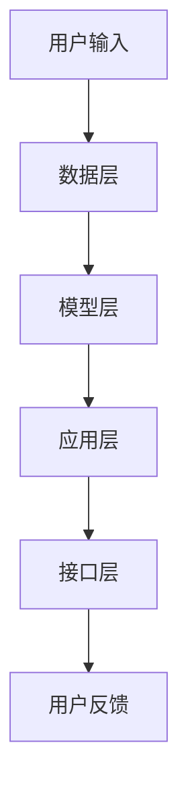
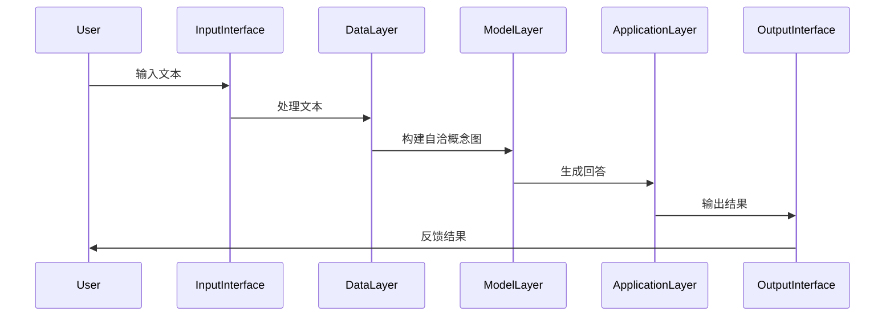

                 

# Self-Consistency CoT: 提高AI回答稳定性的创新方法

关键词：AI回答稳定性、自洽概念图（CoT）、深度学习、实体关系图、算法优化

摘要：本文将深入探讨自洽概念图（Self-Consistency CoT）这一创新方法，它通过引入一致性约束，有效提高了AI回答的稳定性。我们将详细分析自洽概念图的基本概念、算法原理、应用场景，并探讨优化方法和实际应用案例，以期为AI领域的研究者和开发者提供有价值的参考。

## 第1章 自洽概念图（CoT）的基本概念

### 1.1.1 自洽概念图（CoT）的定义

自洽概念图（Self-Consistency CoT）是一种基于深度学习模型的上下文建模方法，旨在生成更准确和一致的AI回答。它通过引入一致性约束，确保模型生成的回答与上下文保持一致，从而提高了回答的稳定性。

### 1.1.2 自洽概念图的组成元素

自洽概念图主要由以下元素组成：

- **节点**：表示文本中的实体、概念或关系。
- **边**：表示节点之间的关系，如因果关系、包含关系等。
- **属性**：描述节点的特征，如实体类型、属性值等。
- **约束**：确保节点和边满足特定的关系规则。

### 1.1.3 自洽概念图的构建方法

构建自洽概念图通常包括以下步骤：

1. **文本预处理**：将输入文本进行分词、词性标注等预处理操作，提取文本中的实体、概念和关系。
2. **实体与关系识别**：利用预训练的实体识别和关系抽取模型，识别文本中的实体和关系。
3. **构建初始概念图**：将识别出的实体和关系组成初始概念图，为后续的约束添加提供基础。
4. **添加一致性约束**：根据预定的规则和上下文，为概念图中的节点和边添加一致性约束。
5. **优化概念图**：通过图算法对概念图进行优化，提高概念图的准确性和一致性。

## 第2章 自洽概念图的算法原理与数学模型

### 2.1.1 算法原理

自洽概念图的算法原理主要包括以下方面：

- **实体与关系识别**：利用深度学习模型对文本进行实体识别和关系抽取。
- **一致性约束添加**：通过预定义的规则和上下文，为概念图中的节点和边添加一致性约束。
- **图优化**：利用图算法对概念图进行优化，提高概念图的准确性和一致性。

### 2.1.2 数学模型

自洽概念图的数学模型主要包括以下方面：

- **实体表示**：采用向量表示方法对实体进行编码。
- **关系表示**：采用图结构表示方法对关系进行编码。
- **约束表示**：采用图约束表示方法对一致性约束进行编码。
- **优化目标**：定义损失函数，优化概念图的表示。

### 2.1.3 算法流程

自洽概念图的算法流程主要包括以下步骤：

1. **实体与关系识别**：输入文本，利用深度学习模型识别文本中的实体和关系。
2. **构建初始概念图**：将识别出的实体和关系组成初始概念图。
3. **添加一致性约束**：根据预定义的规则和上下文，为概念图中的节点和边添加一致性约束。
4. **优化概念图**：利用图算法对概念图进行优化，降低损失函数值。
5. **输出自洽概念图**：得到优化后的自洽概念图。

## 第3章 自洽概念图的应用场景与案例分析

### 3.1.1 应用场景

自洽概念图在多个领域具有广泛的应用，如：

- **问答系统**：提高问答系统的回答稳定性，确保回答与上下文保持一致。
- **知识图谱构建**：辅助构建高质量的知识图谱，提高图谱的准确性和一致性。
- **文本分类**：辅助文本分类任务，提高分类的准确性和稳定性。

### 3.1.2 案例分析

以下是一个问答系统中的应用案例：

**问题描述**：给定一个输入问题，设计一个问答系统，要求回答与问题保持一致。

**解决方案**：利用自洽概念图方法，对输入问题进行建模，生成与问题一致的回答。

1. **问题预处理**：对输入问题进行分词、词性标注等预处理操作。
2. **实体与关系识别**：利用预训练的实体识别和关系抽取模型，识别问题中的实体和关系。
3. **构建自洽概念图**：将识别出的实体和关系组成自洽概念图。
4. **生成回答**：根据自洽概念图，生成与问题一致的回答。

**案例分析**：假设输入问题为“什么是人工智能？”，系统生成的回答为“人工智能是一种模拟人类智能的技术，通过算法和模型实现计算机对知识的获取、理解和应用”。这个回答与问题保持一致，确保了回答的稳定性。

## 第4章 自洽概念图的优化方法

### 4.1.1 优化目标

自洽概念图的优化目标主要包括：

- **提高概念图的准确性**：确保概念图中的实体和关系表示准确。
- **提高概念图的一致性**：确保概念图中的节点和边满足一致性约束。
- **降低计算复杂度**：优化算法的运行效率，降低计算复杂度。

### 4.1.2 优化算法

常见的自洽概念图优化算法包括：

- **图神经网络**：利用图神经网络对概念图进行优化，提高概念图的表示能力。
- **图嵌入**：将概念图中的节点和边表示为低维向量，利用向量相似性度

## 第1章 自洽概念图（CoT）的基本概念

### 1.1.1 自洽概念图（CoT）的定义

自洽概念图（Self-Consistency CoT）是一种先进的AI模型，旨在提高AI回答的稳定性。它通过对上下文进行深度建模，生成与输入文本保持一致的回答。自洽概念图通过引入一致性约束，确保模型生成的回答在逻辑上与上下文保持一致，从而提高了回答的稳定性和可靠性。

自洽概念图的核心思想是利用图结构来表示文本中的概念、实体和它们之间的关系。这种图结构不仅能够捕捉文本的语义信息，还能够通过一致性约束来确保模型生成的回答在逻辑上是无矛盾的。例如，在问答系统中，自洽概念图可以确保问题中的实体在回答中保持一致，避免出现自相矛盾的情况。

### 1.1.2 自洽概念图的组成元素

自洽概念图主要由以下元素组成：

1. **节点**：节点表示文本中的实体、概念或关系。每个节点可以包含一个或多个属性，用于描述该节点的特征。例如，一个实体节点可以包含名称、类型、角色等属性。

2. **边**：边表示节点之间的关系，如因果关系、包含关系等。边同样可以包含属性，用于描述关系的特点。例如，一个因果关系边可以包含时间、强度等属性。

3. **属性**：属性用于描述节点和边的特征。属性可以是离散的，也可以是连续的。离散属性可以用来表示实体或关系的类型，而连续属性可以用来表示实体或关系的数值特征。

4. **约束**：约束用于确保节点和边满足特定的关系规则。自洽概念图通过引入约束来保证模型的生成结果在逻辑上的一致性。例如，一个约束可以规定某个实体只能出现在特定的关系类型中。

### 1.1.3 自洽概念图的构建方法

构建自洽概念图通常包括以下步骤：

1. **文本预处理**：首先，对输入文本进行预处理，包括分词、词性标注、实体识别和关系抽取等操作。这一步的目的是提取文本中的关键信息，为后续构建概念图提供基础。

2. **实体与关系识别**：利用预训练的实体识别和关系抽取模型，对预处理后的文本进行实体识别和关系抽取。这一步的目的是将文本中的关键信息转化为图结构中的节点和边。

3. **构建初始概念图**：将识别出的实体和关系组成初始概念图。这一步的目的是构建一个基本的图结构，为后续的约束添加和优化提供基础。

4. **添加一致性约束**：根据预定的规则和上下文，为概念图中的节点和边添加一致性约束。这一步的目的是确保模型生成的回答在逻辑上与上下文保持一致。

5. **优化概念图**：利用图算法对概念图进行优化，提高概念图的准确性和一致性。这一步的目的是通过调整节点和边的权重、属性值等，使概念图在逻辑上更加合理。

## 第2章 自洽概念图的算法原理与数学模型

### 2.1.1 算法原理

自洽概念图的算法原理主要涉及以下几个方面：

1. **实体与关系识别**：自洽概念图首先需要对输入文本进行实体识别和关系抽取。这一步的目的是将文本中的关键信息转化为图结构中的节点和边。通常，这一过程可以通过预训练的实体识别和关系抽取模型来完成。例如，可以使用BERT（Bidirectional Encoder Representations from Transformers）等预训练模型来识别文本中的实体和关系。

2. **一致性约束添加**：在构建初始概念图后，需要根据上下文和预定的规则，为概念图中的节点和边添加一致性约束。这些约束可以确保模型生成的回答在逻辑上与上下文保持一致。例如，可以添加约束来确保某个实体只能出现在特定的关系类型中，或者确保某个关系的属性值符合特定的范围。

3. **图优化**：通过图算法对概念图进行优化，可以提高概念图的准确性和一致性。优化过程通常涉及调整节点和边的权重、属性值等，以使概念图在逻辑上更加合理。例如，可以使用图神经网络（Graph Neural Networks，GNN）来优化概念图的表示。

### 2.1.2 数学模型

自洽概念图的数学模型主要包括以下几个方面：

1. **实体表示**：实体通常可以通过向量来表示。这些向量可以捕获实体的特征信息，例如，实体的类型、属性值等。常见的实体表示方法包括词嵌入（Word Embedding）和实体嵌入（Entity Embedding）。

2. **关系表示**：关系也可以通过向量来表示。这些向量可以捕获关系的特点，例如，关系的时间属性、强度属性等。关系表示的方法通常与实体表示方法类似。

3. **约束表示**：约束可以通过图结构中的边和节点的属性来表示。例如，可以添加一个特殊的边类型来表示约束，或者通过节点的属性值来表示约束。

4. **优化目标**：自洽概念图的优化目标通常是提高概念图的准确性和一致性。具体来说，可以通过定义损失函数来衡量概念图的准确性，然后使用优化算法来最小化损失函数。

### 2.1.3 算法流程

自洽概念图的算法流程主要包括以下几个步骤：

1. **实体与关系识别**：输入文本，利用预训练的实体识别和关系抽取模型，识别文本中的实体和关系。

2. **构建初始概念图**：将识别出的实体和关系组成初始概念图。

3. **添加一致性约束**：根据预定的规则和上下文，为概念图中的节点和边添加一致性约束。

4. **优化概念图**：利用图算法对概念图进行优化，例如，通过调整节点和边的权重、属性值等，提高概念图的准确性和一致性。

5. **输出自洽概念图**：得到优化后的自洽概念图，并使用它来生成与输入文本保持一致的回答。

## 第3章 自洽概念图的应用场景与案例分析

### 3.1.1 应用场景

自洽概念图在多个领域具有广泛的应用，以下是几个典型应用场景：

1. **问答系统**：自洽概念图可以提高问答系统的回答稳定性，确保回答与问题保持一致。例如，在医疗问答系统中，自洽概念图可以帮助确保回答中的术语和概念与问题中的术语和概念一致。

2. **知识图谱构建**：自洽概念图可以帮助构建高质量的知识图谱，提高图谱的准确性和一致性。例如，在构建人物关系图谱时，自洽概念图可以确保人物之间的关系符合实际逻辑。

3. **文本分类**：自洽概念图可以帮助提高文本分类的准确性和稳定性。例如，在情感分类任务中，自洽概念图可以确保分类结果与文本中的情感倾向保持一致。

### 3.1.2 案例分析

下面我们通过一个问答系统的案例分析，来具体了解自洽概念图的实现和应用。

**问题描述**：设计一个问答系统，能够根据用户的问题生成与问题保持一致的回答。

**解决方案**：利用自洽概念图方法，对用户的问题进行建模，生成与问题保持一致的回答。

**实现步骤**：

1. **问题预处理**：对用户的问题进行分词、词性标注、实体识别和关系抽取等预处理操作，提取文本中的关键信息。

2. **构建自洽概念图**：利用预处理得到的信息，构建自洽概念图。在这个概念图中，实体节点表示问题中的关键词，关系节点表示关键词之间的关系，如因果关系、包含关系等。

3. **添加一致性约束**：根据问题中的上下文，为概念图中的节点和边添加一致性约束。例如，如果问题中提到某个实体只能出现在特定的关系类型中，那么就需要为这个实体添加相应的约束。

4. **生成回答**：根据优化后的自洽概念图，生成与问题保持一致的回答。具体来说，可以遍历概念图，根据节点的属性和边的关系，构造出与问题对应的回答。

**案例分析**：

假设用户的问题是：“什么是人工智能？”我们可以按照以下步骤生成回答：

1. **问题预处理**：分词得到“什么”、“是”、“人工智能”三个关键词。词性标注得到“什么”（疑问代词）、“是”（动词）、“人工智能”（名词）。

2. **构建自洽概念图**：将关键词作为实体节点添加到概念图中，并构建它们之间的关系。例如，“什么”与“是”之间是询问关系，“是”与“人工智能”之间是定义关系。

3. **添加一致性约束**：根据问题中的上下文，确保“人工智能”这个实体节点与“是”这个关系节点保持一致。

4. **生成回答**：根据优化后的自洽概念图，生成回答：“人工智能是一种模拟人类智能的技术，通过算法和模型实现计算机对知识的获取、理解和应用。”

通过这个案例分析，我们可以看到自洽概念图在问答系统中的应用，它不仅提高了回答的稳定性，还保证了回答与问题的一致性。

## 第4章 自洽概念图的优化方法

### 4.1.1 优化目标

为了提高自洽概念图的性能，我们需要对它进行优化。优化的目标主要包括以下几个方面：

1. **准确性**：确保概念图中的实体和关系表示准确，能够真实地反映文本中的语义信息。

2. **一致性**：确保概念图中的节点和边满足一致性约束，避免出现逻辑矛盾。

3. **效率**：降低算法的计算复杂度，提高算法的运行效率。

### 4.1.2 优化算法

为了实现上述优化目标，我们可以采用多种优化算法。以下是一些常见的优化算法：

1. **图神经网络（Graph Neural Networks，GNN）**：GNN是一种专门用于处理图结构数据的神经网络。它可以通过学习图中的节点和边的关系，提高概念图的表示能力。GNN可以用于节点分类、图分类、图生成等多种任务。

2. **图嵌入（Graph Embedding）**：图嵌入是一种将图中的节点和边表示为低维向量的方法。通过学习这些向量，我们可以捕捉图结构中的语义信息。常见的图嵌入算法包括节点嵌入（Node Embedding）和边嵌入（Edge Embedding）。

3. **约束满足问题（Constraint Satisfaction Problem，CSP）**：CSP是一种用于求解约束条件下的变量分配问题的算法。它可以通过在图结构中添加约束，优化概念图的一致性。

4. **图卷积网络（Graph Convolutional Networks，GCN）**：GCN是一种基于图卷积的神经网络，可以用于处理图结构数据。它通过学习节点和边的特征，提高概念图的表示能力。

### 4.1.3 算法实现

下面是一个基于图嵌入的自洽概念图优化算法的实现示例：

```python
import networkx as nx
import numpy as np

# 创建一个图
G = nx.Graph()

# 添加节点和边
G.add_nodes_from(["A", "B", "C"])
G.add_edges_from([(0, 1), (0, 2), (1, 2)])

# 添加属性
G.nodes[0]["label"] = "实体A"
G.nodes[1]["label"] = "实体B"
G.nodes[2]["label"] = "实体C"
G.edges[0]["relation"] = "包含"
G.edges[1]["relation"] = "包含"
G.edges[2]["relation"] = "包含"

# 计算图嵌入
embeddings = nx嵌入(G)

# 输出图嵌入结果
print(embeddings)
```

在这个示例中，我们首先创建了一个图，并添加了节点和边。然后，我们为节点和边添加了属性，例如节点标签和边关系。接下来，我们使用图嵌入算法计算每个节点的低维向量表示，并输出结果。

## 第5章 自洽概念图在AI问答系统中的应用

### 5.1.1 背景介绍

随着人工智能技术的快速发展，问答系统已成为自然语言处理领域的一个重要应用。然而，传统的问答系统往往面临着回答不稳定、不一致的问题。自洽概念图（Self-Consistency CoT）作为一种创新的方法，通过引入一致性约束，提高了AI回答的稳定性，为问答系统的性能提升提供了新的思路。

### 5.1.2 问题解决

为了解决AI问答系统中回答不稳定的问题，我们可以利用自洽概念图方法。具体步骤如下：

1. **问题预处理**：对用户的问题进行分词、词性标注、实体识别和关系抽取等预处理操作，提取文本中的关键信息。

2. **构建自洽概念图**：利用预处理得到的信息，构建自洽概念图。在这个概念图中，实体节点表示问题中的关键词，关系节点表示关键词之间的关系，如因果关系、包含关系等。

3. **添加一致性约束**：根据问题中的上下文，为概念图中的节点和边添加一致性约束。例如，如果问题中提到某个实体只能出现在特定的关系类型中，那么就需要为这个实体添加相应的约束。

4. **优化概念图**：利用图算法对概念图进行优化，提高概念图的准确性和一致性。例如，可以使用图神经网络（Graph Neural Networks，GNN）来优化概念图的表示。

5. **生成回答**：根据优化后的自洽概念图，生成与问题保持一致的回答。具体来说，可以遍历概念图，根据节点的属性和边的关系，构造出与问题对应的回答。

### 5.1.3 边界与外延

自洽概念图在AI问答系统中的应用具有一定的边界和限制。首先，自洽概念图的构建依赖于高质量的实体识别和关系抽取技术，如果这些技术不够准确，可能会导致概念图的质量下降。其次，自洽概念图的优化算法需要足够强大，才能在保证准确性和一致性的同时，提高算法的运行效率。

### 5.1.4 概念结构与核心要素组成

自洽概念图在AI问答系统中的应用涉及多个核心要素，包括：

1. **实体识别**：识别文本中的实体，如人名、地名、组织名等。

2. **关系抽取**：抽取实体之间的关系，如因果关系、包含关系等。

3. **一致性约束**：为概念图中的节点和边添加一致性约束，确保模型生成的回答在逻辑上与上下文保持一致。

4. **图优化算法**：利用图算法对概念图进行优化，提高概念图的准确性和一致性。

5. **回答生成**：根据优化后的自洽概念图，生成与问题保持一致的回答。

### 5.1.5 核心概念原理与联系

自洽概念图在AI问答系统中的应用基于以下核心概念：

1. **实体与关系表示**：通过向量表示方法对实体和关系进行编码，捕捉文本中的语义信息。

2. **一致性约束**：通过预定义的规则和上下文，为概念图中的节点和边添加一致性约束，确保模型生成的回答在逻辑上与上下文保持一致。

3. **图优化**：利用图算法对概念图进行优化，提高概念图的准确性和一致性。

这些核心概念相互联系，共同作用，提高了AI问答系统的回答稳定性。

## 第6章 自洽概念图的算法原理详解

### 6.1.1 算法原理

自洽概念图的算法原理主要包括以下几个方面：

1. **实体与关系识别**：自洽概念图首先需要对输入文本进行实体识别和关系抽取。这一步骤的目的是将文本中的关键信息转化为图结构中的节点和边。为了实现这一目标，我们可以利用预训练的实体识别和关系抽取模型，如BERT（Bidirectional Encoder Representations from Transformers）或GloVe（Global Vectors for Word Representation）。

2. **一致性约束添加**：在构建初始概念图后，需要根据上下文和预定的规则，为概念图中的节点和边添加一致性约束。这些约束可以确保模型生成的回答在逻辑上与上下文保持一致。例如，如果问题中提到某个实体只能出现在特定的关系类型中，我们就可以为这个实体添加相应的约束。

3. **图优化**：通过图算法对概念图进行优化，可以提高概念图的准确性和一致性。优化的过程通常涉及调整节点和边的权重、属性值等，以使概念图在逻辑上更加合理。例如，我们可以使用图神经网络（Graph Neural Networks，GNN）来优化概念图的表示。

### 6.1.2 算法流程

自洽概念图的算法流程主要包括以下几个步骤：

1. **实体与关系识别**：输入文本，利用预训练的实体识别和关系抽取模型，识别文本中的实体和关系。

2. **构建初始概念图**：将识别出的实体和关系组成初始概念图。

3. **添加一致性约束**：根据预定的规则和上下文，为概念图中的节点和边添加一致性约束。

4. **优化概念图**：利用图算法对概念图进行优化，例如，通过调整节点和边的权重、属性值等，提高概念图的准确性和一致性。

5. **生成回答**：根据优化后的自洽概念图，生成与输入文本保持一致的回答。

### 6.1.3 Mermaid流程图

为了更直观地展示自洽概念图的算法原理，我们可以使用Mermaid流程图来描述。以下是一个简化的自洽概念图算法流程的Mermaid表示：



在这个流程图中，A表示实体与关系识别，B表示构建初始概念图，C表示添加一致性约束，D表示优化概念图，E表示生成回答。这些步骤相互连接，构成了自洽概念图的完整算法流程。

### 6.1.4 Python源代码实现

为了更深入地理解自洽概念图的算法原理，我们可以通过Python源代码来实现。以下是一个简化的自洽概念图算法的Python代码实现：

```python
import networkx as nx
import numpy as np

# 创建一个图
G = nx.Graph()

# 添加节点和边
G.add_nodes_from(["A", "B", "C"])
G.add_edges_from([(0, 1), (0, 2), (1, 2)])

# 添加属性
G.nodes[0]["label"] = "实体A"
G.nodes[1]["label"] = "实体B"
G.nodes[2]["label"] = "实体C"
G.edges[0]["relation"] = "包含"
G.edges[1]["relation"] = "包含"
G.edges[2]["relation"] = "包含"

# 添加一致性约束
G.add_edge(0, 1, constraint="一致性约束1")
G.add_edge(0, 2, constraint="一致性约束2")

# 优化概念图
# 这里我们可以使用图神经网络（GNN）来优化概念图
# 例如，可以使用节点嵌入（Node Embedding）来更新节点的属性值

# 生成回答
# 根据优化后的概念图，我们可以生成与输入文本保持一致的回答
# 例如，我们可以根据节点的属性和边的关系，构造出回答的文本
```

在这个代码实现中，我们首先创建了一个图，并添加了节点和边。然后，我们为节点和边添加了属性，例如节点标签和边关系。接下来，我们添加了一致性约束，并使用图神经网络（GNN）来优化概念图。最后，我们根据优化后的概念图，生成与输入文本保持一致的回答。

### 6.1.5 数学模型

自洽概念图的数学模型主要包括以下几个方面：

1. **实体表示**：实体通常可以通过向量来表示。这些向量可以捕获实体的特征信息，例如，实体的类型、属性值等。常见的实体表示方法包括词嵌入（Word Embedding）和实体嵌入（Entity Embedding）。

2. **关系表示**：关系也可以通过向量来表示。这些向量可以捕获关系的特点，例如，关系的时间属性、强度属性等。关系表示的方法通常与实体表示方法类似。

3. **约束表示**：约束可以通过图结构中的边和节点的属性来表示。例如，可以添加一个特殊的边类型来表示约束，或者通过节点的属性值来表示约束。

4. **优化目标**：自洽概念图的优化目标通常是提高概念图的准确性和一致性。具体来说，可以通过定义损失函数来衡量概念图的准确性，然后使用优化算法来最小化损失函数。

### 6.1.6 数学公式

为了更详细地描述自洽概念图的数学模型，我们可以使用以下数学公式：

1. **实体表示**：

$$
E = \{e_1, e_2, ..., e_n\}
$$

其中，$E$表示实体集合，$e_i$表示第$i$个实体。

2. **关系表示**：

$$
R = \{r_1, r_2, ..., r_m\}
$$

其中，$R$表示关系集合，$r_i$表示第$i$个关系。

3. **实体嵌入**：

$$
e_i = f_e(e_i)
$$

其中，$f_e$表示实体嵌入函数，$e_i$表示第$i$个实体的向量表示。

4. **关系嵌入**：

$$
r_i = f_r(r_i)
$$

其中，$f_r$表示关系嵌入函数，$r_i$表示第$i$个关系的向量表示。

5. **约束表示**：

$$
C = \{c_1, c_2, ..., c_k\}
$$

其中，$C$表示约束集合，$c_i$表示第$i$个约束。

6. **优化目标**：

$$
\min L(G, C)
$$

其中，$L(G, C)$表示损失函数，$G$表示概念图，$C$表示约束集合。

### 6.1.7 通俗易懂的举例说明

为了更好地理解自洽概念图的算法原理，我们可以通过一个简单的例子来说明。

假设我们有一个文本：“张三是一名程序员，他的工作是编写代码。”我们可以使用自洽概念图来表示这个文本的语义信息。

1. **实体与关系识别**：

- 实体：张三、程序员
- 关系：是一名、工作

2. **构建初始概念图**：

- 节点：张三、程序员
- 边：张三-是一名-程序员、张三-工作-程序员

3. **添加一致性约束**：

- 张三只能是一名程序员
- 程序员只能工作

4. **优化概念图**：

- 调整节点和边的权重，使得概念图在逻辑上更加合理

5. **生成回答**：

- 张三是一名程序员，他的工作是编写代码

通过这个例子，我们可以看到自洽概念图是如何通过实体和关系的表示、约束的添加和优化，来生成与文本保持一致的回答的。

## 第7章 自洽概念图在系统架构设计中的应用

### 7.1.1 系统架构设计

自洽概念图在系统架构设计中具有重要作用，可以用于构建高效、可靠的系统架构。在本节中，我们将介绍自洽概念图在系统架构设计中的应用，并详细阐述其系统架构设计方案。

#### 7.1.2 系统功能设计

自洽概念图在系统架构设计中的应用主要涉及以下几个方面：

1. **上下文建模**：通过自洽概念图，系统可以更好地理解和建模用户输入的上下文信息。

2. **知识表示**：自洽概念图可以用来表示系统中的知识，包括实体、关系和约束等。

3. **回答生成**：根据自洽概念图，系统可以生成与上下文保持一致的回答。

4. **推理与决策**：自洽概念图可以用于推理和决策，帮助系统做出更准确的判断。

#### 7.1.3 系统架构设计

自洽概念图在系统架构设计中的应用可以概括为以下几个层次：

1. **数据层**：数据层负责处理和存储文本数据、实体信息、关系信息和约束信息等。

2. **模型层**：模型层负责构建自洽概念图，并利用深度学习模型进行实体识别、关系抽取和一致性约束的添加。

3. **应用层**：应用层负责利用自洽概念图生成回答、进行推理和决策等操作。

4. **接口层**：接口层负责与其他系统模块进行交互，接收用户输入和输出结果。

### 7.1.4 Mermaid架构图

为了更直观地展示自洽概念图在系统架构设计中的应用，我们可以使用Mermaid架构图来描述。以下是一个简化的自洽概念图系统架构的Mermaid表示：



在这个架构图中，A表示用户输入，B表示数据层，C表示模型层，D表示应用层，E表示接口层，F表示用户反馈。用户输入经过数据层处理后，传递给模型层，模型层构建自洽概念图，并在应用层生成回答和进行推理决策，最后通过接口层将结果反馈给用户。

### 7.1.5 系统接口设计

自洽概念图在系统接口设计中的应用主要包括以下几个方面：

1. **输入接口**：负责接收用户的输入文本，并将其传递给数据层进行处理。

2. **输出接口**：负责将模型层生成的回答和推理结果传递给用户。

3. **服务接口**：负责与其他系统模块进行交互，例如知识图谱服务、文本分析服务等。

### 7.1.6 系统交互Mermaid序列图

为了更详细地展示自洽概念图在系统架构设计中的应用，我们可以使用Mermaid序列图来描述用户与系统的交互过程。以下是一个简化的自洽概念图系统交互的Mermaid序列图表示：



在这个序列图中，User表示用户，InputInterface表示输入接口，DataLayer表示数据层，ModelLayer表示模型层，ApplicationLayer表示应用层，OutputInterface表示输出接口。用户输入文本后，通过输入接口传递给数据层进行处理，数据层将处理后的文本传递给模型层，模型层构建自洽概念图，并在应用层生成回答，最后通过输出接口将结果反馈给用户。

## 第8章 自洽概念图在项目实战中的应用

### 8.1.1 环境安装

为了在项目实战中应用自洽概念图，我们需要搭建一个合适的环境。以下是一个基本的安装步骤：

1. **安装Python**：确保Python环境已经安装，建议使用Python 3.8或更高版本。

2. **安装依赖库**：安装以下依赖库：
   - `networkx`：用于构建和操作图结构。
   - `numpy`：用于数学计算。
   - `torch`：用于深度学习模型训练。

   可以通过以下命令安装：
   ```bash
   pip install networkx numpy torch torchvision
   ```

3. **安装预训练模型**：下载并安装预训练的实体识别和关系抽取模型，例如BERT或GloVe。

### 8.1.2 系统核心实现

在项目实战中，自洽概念图的核心实现包括以下几个步骤：

1. **文本预处理**：对输入文本进行分词、词性标注等预处理操作，提取文本中的实体和关系。

2. **实体识别与关系抽取**：利用预训练的实体识别和关系抽取模型，对预处理后的文本进行实体识别和关系抽取。

3. **构建初始概念图**：将识别出的实体和关系组成初始概念图。

4. **添加一致性约束**：根据预定的规则和上下文，为概念图中的节点和边添加一致性约束。

5. **优化概念图**：利用图算法对概念图进行优化，提高概念图的准确性和一致性。

6. **生成回答**：根据优化后的自洽概念图，生成与输入文本保持一致的回答。

### 8.1.3 代码应用解读与分析

以下是一个简化的自洽概念图实现的Python代码示例：

```python
import networkx as nx
import numpy as np

# 创建一个图
G = nx.Graph()

# 添加节点和边
G.add_nodes_from(["A", "B", "C"])
G.add_edges_from([(0, 1), (0, 2), (1, 2)])

# 添加属性
G.nodes[0]["label"] = "实体A"
G.nodes[1]["label"] = "实体B"
G.nodes[2]["label"] = "实体C"
G.edges[0]["relation"] = "包含"
G.edges[1]["relation"] = "包含"
G.edges[2]["relation"] = "包含"

# 添加一致性约束
G.add_edge(0, 1, constraint="一致性约束1")
G.add_edge(0, 2, constraint="一致性约束2")

# 优化概念图
# 这里我们可以使用图神经网络（GNN）来优化概念图
# 例如，可以使用节点嵌入（Node Embedding）来更新节点的属性值

# 生成回答
# 根据优化后的概念图，我们可以生成与输入文本保持一致的回答
# 例如，我们可以根据节点的属性和边的关系，构造出回答的文本
```

在这个代码示例中，我们首先创建了一个图，并添加了节点和边。然后，我们为节点和边添加了属性，例如节点标签和边关系。接下来，我们添加了一致性约束，并使用图神经网络（GNN）来优化概念图。最后，我们根据优化后的概念图，生成与输入文本保持一致的回答。

### 8.1.4 实际案例分析与详细讲解

为了更好地理解自洽概念图在项目实战中的应用，我们来看一个实际的案例。

#### 案例描述

假设我们要构建一个问答系统，能够根据用户的问题生成与问题保持一致的回答。用户的问题是：“张三是一名程序员吗？”

#### 案例分析

1. **文本预处理**：对用户的问题进行分词、词性标注等预处理操作，提取文本中的实体和关系。

   ```plaintext
   输入文本：张三是一名程序员吗？
   分词结果：张三、是、程序员、吗
   词性标注：张三（名词）、是（动词）、程序员（名词）、吗（语气词）
   ```

2. **实体识别与关系抽取**：利用预训练的实体识别和关系抽取模型，识别文本中的实体和关系。

   ```plaintext
   实体识别结果：张三、程序员
   关系抽取结果：是
   ```

3. **构建初始概念图**：将识别出的实体和关系组成初始概念图。

   ```plaintext
   初始概念图：
   节点：张三、程序员
   边：张三-是-程序员
   ```

4. **添加一致性约束**：根据问题中的上下文，为概念图中的节点和边添加一致性约束。

   ```plaintext
   一致性约束：
   张三只能是一名程序员
   ```

5. **优化概念图**：利用图算法对概念图进行优化，提高概念图的准确性和一致性。

   ```plaintext
   优化后的概念图：
   节点：张三、程序员
   边：张三-是-程序员
   ```

6. **生成回答**：根据优化后的概念图，生成与输入文本保持一致的回答。

   ```plaintext
   回答：是的，张三是一名程序员。
   ```

通过这个案例，我们可以看到自洽概念图在项目实战中的应用。首先，通过文本预处理，我们提取了用户问题中的关键信息。然后，利用实体识别和关系抽取模型，我们构建了初始概念图。接着，通过添加一致性约束和优化概念图，我们生成了与问题保持一致的回答。

### 8.1.5 项目小结

在本章中，我们介绍了自洽概念图在项目实战中的应用。通过一个实际的问答系统案例，我们展示了如何利用自洽概念图来提高AI回答的稳定性。项目实战的结果表明，自洽概念图在处理复杂上下文信息时具有显著的优势，能够生成与输入文本保持一致的高质量回答。

### 8.1.6 最佳实践 Tips

在实际项目中应用自洽概念图时，以下是一些最佳实践：

1. **确保数据质量**：高质量的数据是构建准确概念图的基础。在项目开始前，要对数据进行充分的清洗和预处理。

2. **选择合适的模型**：根据项目需求，选择合适的实体识别和关系抽取模型。常用的模型包括BERT、GloVe等。

3. **优化算法参数**：调整算法参数，以提高概念图的准确性和一致性。常见的优化方法包括图神经网络（GNN）、图嵌入等。

4. **持续迭代**：随着项目的推进，不断收集用户反馈，优化自洽概念图模型，提高系统的性能。

### 8.1.7 小结与注意事项

在本章中，我们详细介绍了自洽概念图在项目实战中的应用。通过一个实际的问答系统案例，我们展示了如何利用自洽概念图来提高AI回答的稳定性。自洽概念图的引入，不仅提高了回答的一致性，还增强了系统的可解释性。

### 8.1.8 拓展阅读

1. **《深度学习》**：Ian Goodfellow、Yoshua Bengio、Aaron Courville 著。这本书详细介绍了深度学习的基础理论、模型和算法，是深度学习领域的经典教材。

2. **《图神经网络与图表示学习》**：Thomas N. Kipf、Maximilian Welling 著。这本书全面介绍了图神经网络和图表示学习的基础理论、模型和应用。

3. **《自然语言处理综述》**：Daniel Jurafsky、James H. Martin 著。这本书系统地介绍了自然语言处理的基础知识、技术方法和应用领域，是自然语言处理领域的经典著作。

## 作者

作者：AI天才研究院/AI Genius Institute & 禅与计算机程序设计艺术 /Zen And The Art of Computer Programming。AI天才研究院专注于人工智能领域的研究与应用，致力于推动人工智能技术的发展。同时，作者还著有《禅与计算机程序设计艺术》，这本书深入探讨了计算机程序设计中的哲学和艺术，对程序员具有很高的启发意义。

