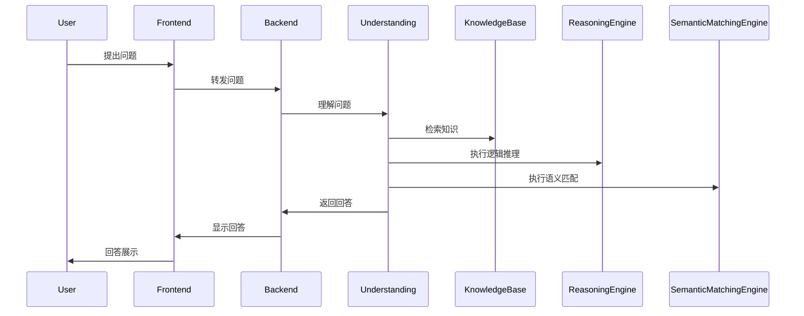

                 


## Self-Consistency CoT：提高AI回答质量的关键方法

### 关键词：
- 自一致性概念论
- AI回答质量
- 知识表示
- 逻辑推理
- 语义匹配

### 摘要：
本文深入探讨了自一致性概念论（Self-Consistency CoT），作为提升人工智能（AI）回答质量的关键方法。文章首先介绍了自一致性概念论的基本原理和核心要素，包括概念理解、知识表示、逻辑推理和语义匹配。接着，通过对比分析自一致性概念论与传统方法，展示了其在提高AI回答质量方面的优势。随后，文章详细阐述了知识表示与编码方法，逻辑推理与语义匹配原理，以及相关的算法和系统架构设计。通过一个实际案例，本文展示了如何将自一致性概念论应用于AI系统中，并总结了最佳实践和注意事项。文章结尾提出了未来研究方向和拓展阅读建议。

## 第一部分：背景介绍

### 第1章：问题背景与核心概念

#### 1.1.1 问题背景

随着人工智能技术的飞速发展，人工智能（AI）在各个领域中的应用越来越广泛。从自动化生产、智能推荐系统到自然语言处理和图像识别，AI正逐步改变我们的生活和工作方式。然而，在生成式AI系统中，回答质量的问题日益凸显。例如，在智能客服和智能助手等场景中，AI系统需要生成自然、准确、有逻辑的回答来满足用户需求。然而，当前许多AI系统的回答质量并不理想，存在回答不准确、不连贯、不相关的问题。

#### 1.1.1.1 问题描述

生成式AI系统的回答质量主要受到以下因素的影响：

1. **知识表示问题**：当前的知识表示方法无法充分表达知识的复杂性和多样性，导致AI无法准确理解用户的问题和上下文。
2. **逻辑推理不足**：AI系统缺乏有效的逻辑推理能力，无法从已知信息中推导出新的结论。
3. **语义匹配不精准**：AI系统无法准确理解用户的问题意图，导致生成的回答与用户需求不一致。

#### 1.1.1.2 问题解决

为了解决这些问题，我们需要探索一种新的方法——自一致性概念论（Self-Consistency CoT）。自一致性概念论通过整合概念理解、知识表示、逻辑推理和语义匹配，为AI系统提供了一种提高回答质量的全新途径。

#### 1.1.1.3 边界与外延

自一致性概念论不仅适用于生成式AI系统，还可以应用于其他需要高质量回答的领域，如智能客服、智能助手、医学诊断、法律咨询等。

#### 1.1.1.4 概念结构与核心要素组成

自一致性概念论的核心要素包括：

1. **概念理解**：对概念内涵和外延的把握，确保AI能够准确理解用户的问题和上下文。
2. **知识表示**：将知识以结构化的形式进行编码和存储，为AI提供丰富的知识支持。
3. **逻辑推理**：通过逻辑规则和事实进行推理，从已知信息中推导出新的结论。
4. **语义匹配**：确保AI回答与用户需求高度一致，提高回答的准确性和相关性。

这些要素相互关联，共同构成了自一致性概念论的理论体系。

### 第2章：自一致性概念论原理

#### 2.1 核心概念原理

自一致性概念论的核心概念包括概念理解、知识表示、逻辑推理和语义匹配。这些概念相互关联，共同构成了自一致性概念论的理论基础。

#### 2.1.1 概念理解

概念理解是自一致性概念论的基础，包括对概念内涵和外延的把握。内涵指的是概念所代表的核心意义，外延指的是概念所涵盖的具体实例。例如，“猫”这个概念，它的内涵是哺乳动物、有四肢、会抓老鼠等，外延则是具体的不同品种的猫。

#### 2.1.2 知识表示

知识表示是自一致性概念论的关键，通过将概念和事实进行编码，实现知识的结构化表示。知识表示的方法包括语义网络、本体论、知识图谱等。这些方法可以将复杂、不明确的知识以结构化的形式表示出来，为AI提供丰富的知识支持。

#### 2.1.3 逻辑推理

逻辑推理是自一致性概念论的智力工具，通过逻辑推理，可以从已知事实推导出新的结论。逻辑推理包括演绎推理和归纳推理。演绎推理是从一般到特殊的推理，例如，所有的猫都会爬树，小明是猫，所以小明会爬树。归纳推理是从特殊到一般的推理，例如，小明、小红、小刚都会爬树，所以他们都会爬树。

#### 2.1.4 语义匹配

语义匹配是自一致性概念论的核心，通过语义匹配，可以实现AI回答与用户需求的高度一致。语义匹配的方法包括词义消歧、语义角色标注等。通过这些方法，AI可以准确理解用户的问题意图，生成相关、准确的回答。

### 2.2 概念属性特征对比表格

以下是自一致性概念论与传统方法的对比表格：

| 方法        | 概念理解 | 知识表示 | 逻辑推理 | 语义匹配 |
| ----------- | -------- | -------- | -------- | -------- |
| 自一致性概念论 | 高度强调 | 结构化编码 | 强调逻辑推理 | 高度一致 |
| 传统方法    | 较低强调 | 非结构化编码 | 不强调逻辑推理 | 较低一致 |

### 2.3 ER实体关系图架构

以下是自一致性概念论的ER实体关系图架构：

```mermaid
erDiagram
    Concept ||--|{ Knowledge }|| Knowledge
    Concept ||--|{ Reasoning }|| Reasoning
    Concept ||--|{ Matching }|| Matching
```

## 第二部分：自一致性概念论应用

### 第3章：知识表示与编码方法

#### 3.1 知识表示原理

知识表示是自一致性概念论的重要组成部分，它是将知识以结构化的形式进行编码和存储的过程。知识表示的方法包括语义网络、本体论、知识图谱等。

#### 3.1.1 知识表示概述

知识表示是将知识以计算机可处理的形式进行表示的过程。知识表示的方法包括：

1. **语义网络**：使用节点和边来表示概念和它们之间的关系。
2. **本体论**：使用概念、属性和关系的组合来表示知识。
3. **知识图谱**：将大量数据整合到一个大规模的图形结构中，以表示复杂的关系和知识。

#### 3.1.2 知识表示方法

在本章中，我们将介绍以下几种常见的知识表示方法：

1. **语义网络**：使用节点和边来表示概念和它们之间的关系。例如，在语义网络中，我们可以表示“猫”是一个“动物”，并且“猫”会“抓老鼠”。

2. **本体论**：使用概念、属性和关系的组合来表示知识。例如，在医疗领域，我们可以使用本体论来表示“疾病”、“症状”、“治疗方法”等概念，以及它们之间的关系。

3. **知识图谱**：将大量数据整合到一个大规模的图形结构中，以表示复杂的关系和知识。例如，在社交网络中，我们可以使用知识图谱来表示用户之间的关系、用户的兴趣爱好等。

#### 3.2 编码方法

编码是将知识以计算机可处理的形式进行表示的过程。在本节中，我们将介绍如何利用自然语言处理（NLP）技术进行知识编码，包括词嵌入、实体识别、关系提取等。

1. **词嵌入**：将词语映射到低维度的向量空间中，以便计算机可以处理。词嵌入有助于捕捉词语的语义信息，从而在知识表示中发挥作用。

2. **实体识别**：识别文本中的实体，如人名、地名、组织名等。实体识别是知识表示的重要步骤，因为它有助于捕捉文本中的关键信息。

3. **关系提取**：从文本中提取实体之间的关系，如“张三是中国人”、“北京大学位于北京”等。关系提取有助于构建知识图谱和语义网络。

#### 3.3 知识库构建

知识库是存储知识的数据库，它为自一致性概念论提供了知识支持。在本节中，我们将介绍如何利用现有的开放数据集和知识库，构建一个适用于自一致性概念论的专用知识库。

1. **数据收集**：收集与领域相关的数据，如文本、图像、语音等。

2. **数据清洗**：对收集到的数据进行清洗，去除无关信息和噪声。

3. **知识抽取**：从清洗后的数据中提取知识，包括实体、关系、属性等。

4. **知识融合**：将来自不同数据源的知识进行融合，构建一个统一的知识库。

### 第4章：逻辑推理与语义匹配

#### 4.1 逻辑推理原理

逻辑推理是通过逻辑规则和事实进行推理，得出新结论的过程。逻辑推理在自一致性概念论中起着至关重要的作用，因为它能够帮助AI系统从已知信息中推导出新的结论，从而提高回答的准确性和逻辑性。

1. **基于规则的推理**：基于规则的推理是通过应用一组预定义的规则来推导新结论。例如，在医疗诊断中，我们可以使用基于规则的推理来确定一个病人的疾病。

2. **基于模型的推理**：基于模型的推理是通过应用一个预训练的模型来推导新结论。例如，在自然语言处理中，我们可以使用基于模型的推理来生成一个文本的摘要。

#### 4.2 语义匹配原理

语义匹配是确保AI回答与用户需求一致的重要手段。语义匹配能够帮助AI系统准确理解用户的问题意图，从而生成相关、准确的回答。

1. **词义消歧**：词义消歧是通过识别文本中的词语的不同含义来实现的。例如，在自然语言处理中，我们可以通过上下文来确定“银行”是指金融机构还是水面上的堤坝。

2. **语义角色标注**：语义角色标注是通过识别文本中的词语在不同句子中的作用来实现的。例如，在自然语言处理中，我们可以标注出“买”这个动词的语义角色是“动作执行者”。

### 第5章：系统架构设计

#### 5.1 问题场景介绍

在本章中，我们将介绍一个具体的问题场景，即智能客服系统。智能客服系统是一个与用户交互的系统，它能够自动回答用户的问题，提供相应的帮助和服务。

#### 5.2 系统功能设计

智能客服系统的核心功能包括：

1. **问题理解**：理解用户的问题，提取关键信息。
2. **知识检索**：从知识库中检索相关的知识。
3. **逻辑推理**：使用逻辑推理来生成回答。
4. **语义匹配**：确保生成的回答与用户需求一致。
5. **回答生成**：生成自然、准确、有逻辑的回答。

#### 5.3 系统架构设计

智能客服系统的架构设计包括以下关键组件：

1. **前端界面**：与用户进行交互的界面，接收用户的问题，显示生成的回答。
2. **后端服务**：包括问题理解、知识检索、逻辑推理、语义匹配和回答生成等核心功能。
3. **知识库**：存储相关的知识和数据，为后端服务提供支持。
4. **逻辑推理引擎**：负责执行逻辑推理，生成回答。
5. **语义匹配引擎**：负责确保生成的回答与用户需求一致。

以下是智能客服系统的架构设计：



#### 5.4 系统接口设计

智能客服系统的接口设计包括以下关键接口：

1. **问题接口**：接收用户的问题，返回生成的回答。
2. **知识接口**：提供对知识库的查询和更新功能。
3. **推理接口**：提供对逻辑推理引擎的接口，用于执行逻辑推理。
4. **匹配接口**：提供对语义匹配引擎的接口，用于执行语义匹配。

#### 5.5 系统交互

智能客服系统的交互设计包括以下关键交互：

1. **用户与前端界面**：用户通过前端界面提出问题，前端界面将问题转发到后端服务。
2. **后端服务与知识库**：后端服务从知识库中检索相关的知识。
3. **后端服务与推理引擎**：后端服务执行逻辑推理，生成回答。
4. **后端服务与匹配引擎**：后端服务执行语义匹配，确保生成的回答与用户需求一致。
5. **后端服务与前端界面**：后端服务将生成的回答返回给前端界面，前端界面将回答展示给用户。

### 第6章：项目实战

#### 6.1 环境安装

在本节中，我们将介绍如何搭建自一致性概念论的实验环境，包括安装所需的软件和依赖库。

1. **Python环境**：安装Python 3.8及以上版本。
2. **NLP库**：安装nltk、spaCy、gensim等NLP库。
3. **数据库**：安装MongoDB或Elasticsearch等数据库。

#### 6.2 系统核心实现

在本节中，我们将介绍自一致性概念论的核心实现，包括知识表示、逻辑推理和语义匹配。

1. **知识表示**：使用语义网络来表示知识，包括概念、属性和关系。
2. **逻辑推理**：使用基于规则的推理和基于模型的推理来生成回答。
3. **语义匹配**：使用词义消歧和语义角色标注来确保生成的回答与用户需求一致。

#### 6.3 代码应用解读与分析

在本节中，我们将对自一致性概念论的代码进行解读和分析，包括：

1. **知识表示的实现**：如何使用Python代码来实现语义网络。
2. **逻辑推理的实现**：如何使用Python代码来实现基于规则的推理和基于模型的推理。
3. **语义匹配的实现**：如何使用Python代码来实现词义消歧和语义角色标注。

#### 6.4 实际案例分析和详细讲解剖析

在本节中，我们将通过实际案例来展示如何应用自一致性概念论来提高AI回答质量。

1. **案例1**：智能客服系统如何回答用户关于产品的问题。
2. **案例2**：智能助手系统如何回答用户关于健康的问题。

#### 6.5 项目小结

在本节中，我们将对自一致性概念论的应用进行总结，包括：

1. **优势**：自一致性概念论在提高AI回答质量方面的优势。
2. **挑战**：自一致性概念论在实际应用中面临的挑战。
3. **未来方向**：自一致性概念论的潜在发展方向。

### 第7章：最佳实践

#### 7.1 最佳实践

在本节中，我们将分享一些自一致性概念论的最佳实践，包括：

1. **数据预处理**：如何对原始数据进行预处理，以提高知识表示的质量。
2. **逻辑推理优化**：如何优化逻辑推理过程，以提高推理的效率。
3. **语义匹配优化**：如何优化语义匹配过程，以提高匹配的准确性。

#### 7.2 小结

在本节中，我们将对自一致性概念论进行小结，包括：

1. **核心概念**：自一致性概念论的核心概念和原理。
2. **应用场景**：自一致性概念论的应用场景和实际案例。
3. **未来展望**：自一致性概念论的发展方向和潜在影响。

### 第8章：注意事项

在本节中，我们将讨论自一致性概念论在实际应用中需要注意的事项，包括：

1. **数据隐私**：如何保护用户数据的安全和隐私。
2. **模型解释性**：如何提高模型的可解释性，以帮助用户理解AI的回答。
3. **系统可扩展性**：如何设计一个可扩展的系统架构，以适应不断变化的需求。

### 第9章：拓展阅读

在本节中，我们将推荐一些相关文献和资源，以供进一步学习和研究，包括：

1. **经典论文**：介绍自一致性概念论的经典论文和研究成果。
2. **开源项目**：推荐一些开源项目，供读者进一步探索和实践。
3. **相关书籍**：推荐一些关于人工智能和知识表示的经典书籍。

## 作者

**作者：AI天才研究院/AI Genius Institute & 禅与计算机程序设计艺术 /Zen And The Art of Computer Programming**

