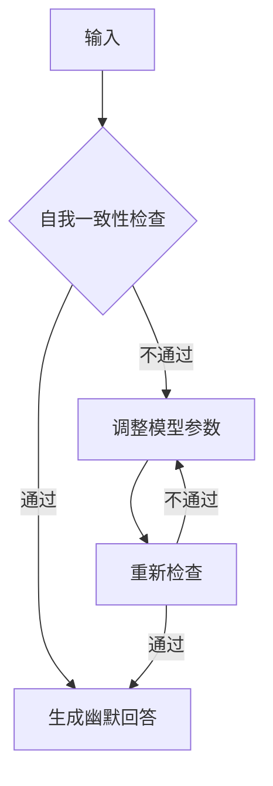
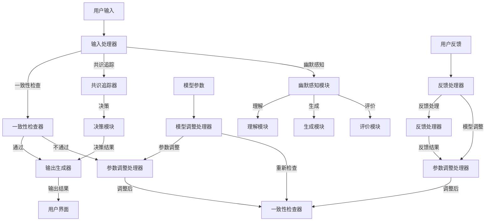
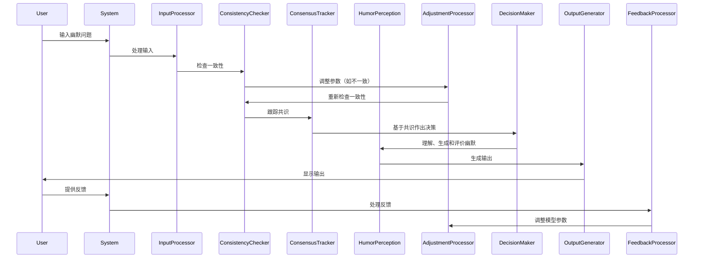

                 

# 自一致性CoT：提高AI幽默感知能力

## 引言与背景介绍

### 1.1 问题背景

#### 1.1.1 AI幽默感知能力的现状

随着人工智能技术的不断发展，AI的应用场景越来越广泛，从简单的任务如语音识别、图像处理，到复杂的任务如自然语言处理、决策支持系统等。在这些应用场景中，AI的幽默感知能力显得尤为重要。幽默感知是指AI能够理解、生成和评价幽默的能力，它是人类智能的重要组成部分。然而，目前的AI在幽默感知方面仍然存在诸多挑战。

#### 1.1.2 幽默感知在AI领域的意义

幽默感知能力不仅有助于提高AI与人类的互动质量，还能使AI在特定场景下提供更具创意和个性化的服务。例如，在智能客服、教育机器人、娱乐系统等领域，AI的幽默感知能力能够提升用户体验，增强用户对AI的接受度和忠诚度。

#### 1.1.3 自一致性CoT的概念与应用

自一致性CoT（Self-Consistency CoT）是一种用于提高AI幽默感知能力的方法。CoT代表“Consensus Tracking”（共识追踪），是一种确保AI在不同上下文中对同一问题作出一致响应的机制。自一致性CoT则在此基础上，引入了自我调整机制，使得AI能够根据反馈不断优化其幽默感知能力。

### 1.2 问题描述

#### 1.2.1 AI在幽默感知方面面临的挑战

AI在幽默感知方面面临的挑战主要包括：

1. **复杂性**：幽默涉及复杂的语言、文化和情境因素，这使得AI难以准确理解幽默。
2. **多样性**：幽默具有高度多样性，不同的人和文化背景对幽默的喜好和感知存在差异。
3. **动态性**：幽默感知需要AI实时适应不同的情境和对话内容。

#### 1.2.2 自一致性CoT的目标与任务

自一致性CoT的目标是提高AI的幽默感知能力，使其能够更准确地理解、生成和评价幽默。其任务包括：

1. **自我一致性检查**：确保AI对同一问题在不同上下文中的回答保持一致性。
2. **自我调整**：根据用户反馈和情境变化，调整AI的幽默感知模型。

#### 1.2.3 自一致性CoT的意义与重要性

自一致性CoT的意义在于，它提供了一种系统的方法来提高AI的幽默感知能力，有助于解决AI在幽默感知方面面临的挑战。其重要性体现在：

1. **用户体验**：提高AI的幽默感知能力，能够提升用户体验，增强用户对AI的接受度和忠诚度。
2. **应用价值**：在智能客服、教育机器人、娱乐系统等领域，自一致性CoT具有广泛的应用价值。

### 1.3 问题解决

#### 1.3.1 自一致性CoT的基本原理

自一致性CoT的基本原理包括：

1. **共识追踪**：通过跟踪AI在不同上下文中的响应，确保其一致性。
2. **自我调整**：根据用户反馈和情境变化，调整AI的幽默感知模型。

#### 1.3.2 自一致性CoT的关键技术

自一致性CoT的关键技术包括：

1. **一致性度量**：用于评估AI在不同上下文中的响应一致性。
2. **自我调整机制**：基于用户反馈和情境变化，调整AI的幽默感知模型。

#### 1.3.3 自一致性CoT的优势与效果

自一致性CoT的优势与效果包括：

1. **提高一致性**：通过自我一致性检查，确保AI在不同上下文中的回答保持一致性。
2. **增强适应性**：通过自我调整机制，使AI能够根据用户反馈和情境变化，优化其幽默感知能力。

### 1.4 边界与外延

#### 1.4.1 自一致性CoT的适用范围

自一致性CoT适用于需要AI具备幽默感知能力的场景，如智能客服、教育机器人、娱乐系统等。

#### 1.4.2 自一致性CoT的限制与挑战

自一致性CoT的限制与挑战包括：

1. **复杂性**：幽默感知涉及复杂的语言、文化和情境因素，这增加了实现的难度。
2. **多样性**：不同的人和文化背景对幽默的喜好和感知存在差异，这要求AI具备高度的适应性和多样性。

#### 1.4.3 自一致性CoT的未来发展趋势

自一致性CoT的未来发展趋势包括：

1. **算法优化**：通过不断优化算法，提高AI的幽默感知能力。
2. **跨领域应用**：将自一致性CoT应用于更多的领域，如医疗、金融等。

### 1.5 概念结构与核心要素组成

#### 1.5.1 自一致性CoT的核心概念

自一致性CoT的核心概念包括：

1. **共识追踪**：通过跟踪AI在不同上下文中的响应，确保其一致性。
2. **自我调整**：根据用户反馈和情境变化，调整AI的幽默感知模型。

#### 1.5.2 自一致性CoT的关键要素

自一致性CoT的关键要素包括：

1. **一致性度量**：用于评估AI在不同上下文中的响应一致性。
2. **自我调整机制**：基于用户反馈和情境变化，调整AI的幽默感知模型。

#### 1.5.3 自一致性CoT的整体结构

自一致性CoT的整体结构包括：

1. **输入层**：接收用户输入的幽默内容。
2. **处理层**：对输入内容进行幽默感知处理。
3. **输出层**：生成幽默回答。
4. **评估层**：评估回答的一致性和有效性。
5. **调整层**：根据评估结果，调整幽默感知模型。

### 1.6 本章小结

本章介绍了自一致性CoT的背景、意义、问题和解决方案。自一致性CoT通过共识追踪和自我调整机制，旨在提高AI的幽默感知能力。接下来，我们将深入探讨自一致性CoT的核心概念和原理。# 核心概念与联系

## 2.1 自一致性CoT原理

### 2.1.1 自一致性CoT的定义

自一致性CoT（Self-Consistency Consensus Tracking）是一种基于共识追踪的机制，用于提高AI模型的自我一致性。在AI幽默感知能力方面，自一致性CoT旨在确保AI在不同上下文中对同一问题作出一致响应。这一机制通过自我调整，使AI能够根据用户反馈和情境变化，优化其幽默感知能力。

### 2.1.2 自一致性CoT的核心原理

自一致性CoT的核心原理包括两个方面：

1. **共识追踪**：通过跟踪AI在不同上下文中的响应，确保其一致性。这涉及到对AI模型输出的一致性度量，以及对不一致性响应的识别和纠正。
2. **自我调整**：基于共识追踪的结果，AI模型会进行自我调整。这种调整可以是参数调整、模型结构调整，或者是对输入数据的预处理调整。

### 2.1.3 自一致性CoT的数学模型与公式

自一致性CoT的数学模型可以表示为：

$$
\text{一致性度量} = \frac{\sum_{i=1}^{n} (\text{模型输出}_i - \text{真实输出})^2}{n}
$$

其中，$n$ 是上下文的数量，$\text{模型输出}_i$ 是AI模型在特定上下文中的输出，$\text{真实输出}$ 是预期的正确输出。

自我调整的公式可以表示为：

$$
\text{新参数} = \text{原参数} + \alpha (\text{真实输出} - \text{模型输出})
$$

其中，$\alpha$ 是调整系数，用于控制调整的强度。

## 2.2 自一致性CoT的属性特征对比表格

| 特性        | 说明                                                         |
| ----------- | ------------------------------------------------------------ |
| 一致性      | 确保AI模型对同一问题在不同上下文中的回答保持一致性           |
| 自一致性    | 模型自身对答案的一致性进行监控和调整                       |
| CoT         | 共识追踪，确保AI在复杂、不确定的环境中作出合理决策         |
| 感知能力    | AI对幽默感知的能力，包括理解、生成和评价幽默的能力         |

## 2.3 ER实体关系图架构

```mermaid
erDiagram
  AI模型 ||--|{ 自一致性监控模块 }
  AI模型 ||--|{ 共识追踪模块 }
  AI模型 ||--|{ 幽默感知模块 }
  自一致性监控模块 ||--|{ 评估模块 }
  自一致性监控模块 ||--|{ 调整模块 }
  共识追踪模块 ||--|{ 决策模块 }
  幽默感知模块 ||--|{ 理解模块 }
  幽默感知模块 ||--|{ 生成模块 }
  幽默感知模块 ||--|{ 评价模块 }
```

在这个ER图中，AI模型是核心实体，它与自一致性监控模块、共识追踪模块和幽默感知模块之间存在关联。自一致性监控模块包括评估模块和调整模块，负责监控和调整模型的一致性。共识追踪模块负责确保模型在复杂、不确定的环境中作出合理决策。幽默感知模块则负责AI的幽默感知功能，包括理解、生成和评价幽默。

## 2.4 自一致性CoT与相关概念的联系

### 2.4.1 自一致性CoT与自然语言处理

自一致性CoT与自然语言处理（NLP）密切相关。NLP是AI的重要分支，负责使机器能够理解、生成和处理人类语言。自一致性CoT在NLP中的应用，可以帮助提高AI在处理幽默文本时的准确性，确保其在不同上下文中对同一问题作出一致响应。

### 2.4.2 自一致性CoT与机器学习

自一致性CoT与机器学习（ML）也有着紧密的联系。ML是AI的核心技术，它通过学习大量数据来改进模型的性能。自一致性CoT在ML中的应用，可以帮助模型在训练过程中保持一致性，避免过度拟合，从而提高模型的泛化能力。

### 2.4.3 自一致性CoT与人工智能伦理

自一致性CoT在人工智能伦理（AI Ethics）方面也有重要作用。随着AI技术的普及，确保AI系统的透明性、可解释性和公正性变得越来越重要。自一致性CoT通过监控和调整AI模型的输出，有助于提高AI系统的可解释性，确保其行为符合伦理标准。

## 2.5 本章小结

本章介绍了自一致性CoT的核心概念、属性特征和ER实体关系图架构，并探讨了自一致性CoT与自然语言处理、机器学习和人工智能伦理等领域的联系。在下一章中，我们将深入探讨自一致性CoT的算法原理和实现细节。# 算法原理讲解

## 3.1 自一致性CoT算法概述

### 3.1.1 自一致性CoT算法的基本流程

自一致性CoT算法的基本流程包括以下几个步骤：

1. **输入处理**：接收用户输入的幽默内容，并进行预处理，如文本清洗、分词、词性标注等。
2. **自我一致性检查**：通过一致性度量，评估AI模型在不同上下文中的响应一致性。
3. **决策生成**：根据自我一致性检查的结果，决定是否生成幽默回答。
4. **调整模型参数**：如果不一致，则根据评估结果，调整AI模型的参数。
5. **输出结果**：生成幽默回答，并将其输出。

### 3.1.2 自一致性CoT算法的核心模块

自一致性CoT算法的核心模块包括：

1. **一致性度量模块**：用于评估AI模型在不同上下文中的响应一致性。
2. **决策生成模块**：根据一致性度量结果，决定是否生成幽默回答。
3. **模型调整模块**：根据评估结果，调整AI模型的参数。

### 3.1.3 自一致性CoT算法的优缺点

自一致性CoT算法的优点包括：

1. **提高一致性**：通过自我一致性检查，确保AI在不同上下文中的回答保持一致性。
2. **增强适应性**：通过自我调整机制，使AI能够根据用户反馈和情境变化，优化其幽默感知能力。

自一致性CoT算法的缺点包括：

1. **复杂性**：实现自一致性CoT算法需要复杂的技术，如一致性度量、模型调整等。
2. **性能开销**：自我一致性检查和模型调整会增加算法的计算开销，影响性能。

## 3.2 算法mermaid流程图



在这个mermaid流程图中，A表示输入处理，B表示自我一致性检查，C表示生成幽默回答，D表示调整模型参数，E表示重新检查。算法的核心流程是：首先进行自我一致性检查，如果通过则生成幽默回答，如果不一致则调整模型参数，然后重新进行检查。

## 3.3 算法原理详细讲解

### 3.3.1 自我一致性检查

自我一致性检查是自一致性CoT算法的核心步骤之一。它通过一致性度量，评估AI模型在不同上下文中的响应一致性。具体实现如下：

1. **一致性度量**：

$$
\text{一致性度量} = \frac{\sum_{i=1}^{n} (\text{模型输出}_i - \text{真实输出})^2}{n}
$$

其中，$n$ 是上下文的数量，$\text{模型输出}_i$ 是AI模型在特定上下文中的输出，$\text{真实输出}$ 是预期的正确输出。

2. **评估不一致性**：

如果一致性度量大于设定的阈值，则认为AI模型的响应存在不一致性。不一致性可能源于多种原因，如模型过拟合、上下文理解不准确等。

### 3.3.2 模型调整

当AI模型的响应存在不一致性时，需要对其进行调整。模型调整的过程可以分为以下几个步骤：

1. **识别问题**：通过分析不一致性的响应，识别导致不一致性的具体原因。
2. **调整参数**：

$$
\text{新参数} = \text{原参数} + \alpha (\text{真实输出} - \text{模型输出})
$$

其中，$\alpha$ 是调整系数，用于控制调整的强度。

3. **验证调整效果**：在调整参数后，重新进行自我一致性检查，验证调整效果。

### 3.3.3 幽默回答生成

在完成自我一致性检查和模型调整后，生成幽默回答。生成幽默回答的过程可以分为以下几个步骤：

1. **文本预处理**：对用户输入的幽默内容进行预处理，如分词、词性标注等。
2. **幽默感知**：利用AI模型对预处理后的文本进行幽默感知，生成幽默回答。
3. **输出结果**：将生成的幽默回答输出。

### 3.3.4 举例说明

假设有一个用户输入的幽默句子：“为什么程序员喜欢黑夜？因为黑夜里，代码不会反光。”AI模型首先对这个句子进行自我一致性检查。如果模型在不同上下文中对同一问题的回答一致，则生成幽默回答：“因为黑夜里，代码不会反光。”如果模型在不同上下文中的回答不一致，则进入模型调整阶段。通过分析不一致性的原因，模型可能调整其参数，例如调整对“黑夜”和“代码”这两个词的权重。在完成调整后，模型重新进行自我一致性检查，确保回答的一致性。最终，模型生成幽默回答：“因为黑夜里，代码不会反光。”# 系统分析与架构设计方案

## 3.4 系统功能设计（领域模型）

为了更好地理解和实现自一致性CoT算法，我们需要设计一个完善的领域模型。领域模型有助于我们清晰地定义系统中的实体、属性和关系。以下是系统功能设计的领域模型：

### 类图

```mermaid
classDiagram
    AIModel <|-- ConsistencyMonitor
    AIModel <|-- ConsensusTracker
    AIModel <|-- HumorPerception
    ConsistencyMonitor <|-- EvaluationModule
    ConsistencyMonitor <|-- AdjustmentModule
    ConsensusTracker <|-- DecisionModule
    HumorPerception <|-- UnderstandingModule
    HumorPerception <|-- GenerationModule
    HumorPerception <|-- EvaluationModule

    AIModel {
        +String input
        +String output
        +ArrayList<String> contexts
        +void processInput()
        +void generateResponse()
        +void adjustModel()
    }

    ConsistencyMonitor {
        +float consistencyScore
        +void checkConsistency()
    }

    EvaluationModule {
        +float calculateConsistency()
    }

    AdjustmentModule {
        +void adjustParameters()
    }

    ConsensusTracker {
        +void trackConsensus()
    }

    DecisionModule {
        +void makeDecision()
    }

    HumorPerception {
        +void understandHumor()
        +void generateHumor()
        +void evaluateHumor()
    }

    UnderstandingModule {
        +void processTextInput()
    }

    GenerationModule {
        +String createResponse()
    }

    EvaluationModule {
        +void assessResponse()
    }
```

在这个类图中，我们定义了以下几个主要实体和模块：

- `AIModel`：代表整个AI模型，负责接收输入、生成响应和调整模型。
- `ConsistencyMonitor`：负责监控和评估模型的一致性。
- `ConsensusTracker`：负责跟踪共识，确保模型在复杂环境中作出合理决策。
- `HumorPerception`：负责AI的幽默感知功能，包括理解、生成和评价幽默。
- `EvaluationModule`：负责计算和评估一致性度量。
- `AdjustmentModule`：负责调整模型参数。
- `DecisionModule`：负责基于共识追踪结果作出决策。
- `UnderstandingModule`：负责处理文本输入，理解幽默。
- `GenerationModule`：负责生成幽默回答。
- `EvaluationModule`：负责评估幽默回答的有效性。

## 3.5 系统架构设计

在明确了领域模型之后，我们需要设计系统的整体架构。以下是一个可能的系统架构设计：

### mermaid架构图



在这个架构图中，我们定义了以下几个主要组件：

- `Subsystem1`：用户输入，包括幽默问题和情境。
- `Processor1`：输入处理器，负责处理用户输入并分配给相应的模块。
- `ConsistencyChecker1`：一致性检查器，用于评估模型的一致性。
- `ConsensusTracker1`：共识追踪器，用于跟踪共识，确保模型在复杂环境中作出合理决策。
- `HumorPerception1`：幽默感知模块，负责理解、生成和评价幽默。
- `AdjustmentProcessor1`：参数调整处理器，用于根据一致性检查结果调整模型参数。
- `DecisionMaker1`：决策模块，用于根据共识追踪结果作出决策。
- `UnderstandingModule1`：理解模块，用于处理文本输入，理解幽默。
- `GenerationModule1`：生成模块，用于生成幽默回答。
- `EvaluationModule1`：评价模块，用于评估幽默回答的有效性。
- `OutputGenerator1`：输出生成器，用于生成最终的输出结果并展示给用户。
- `UserInterface1`：用户界面，用于与用户交互。
- `Subsystem3`：用户反馈，用于收集用户对输出的反馈。
- `Processor3`：反馈处理器，负责处理用户反馈并调整模型。

## 3.6 系统接口设计与系统交互

在设计系统架构时，还需要考虑系统接口的设计和系统交互。以下是一个简化的接口设计和交互流程：

### mermaid序列图



在这个序列图中，用户首先输入幽默问题，系统接收到输入后，通过输入处理器处理输入，然后进行一致性检查。如果一致性检查发现不一致，系统将调整模型参数，并重新检查一致性。在一致性检查和共识追踪完成后，系统基于共识作出决策，然后通过幽默感知模块理解、生成和评价幽默，最后生成输出并展示给用户。用户提供的反馈将被反馈处理器处理，并用于调整模型参数。

## 3.7 本章小结

本章详细介绍了自一致性CoT算法的系统分析与架构设计方案。首先，我们设计了领域模型，定义了系统中的主要实体和模块。然后，我们设计了系统的整体架构，包括输入处理、一致性检查、共识追踪、幽默感知和模型调整等关键组件。最后，我们通过序列图展示了系统接口设计和交互流程。这些设计为自一致性CoT算法的实现提供了坚实的基础。在接下来的章节中，我们将详细讨论自一致性CoT算法的具体实现和性能评估。# 项目实战

## 4.1 环境安装

在进行项目实战之前，我们需要安装所需的软件和环境。以下是安装步骤：

1. **安装Python**：确保Python版本为3.8或更高版本。
2. **安装依赖库**：使用pip安装以下依赖库：
    ```bash
    pip install tensorflow numpy pandas scikit-learn matplotlib
    ```
3. **配置环境**：在代码中配置相应的环境变量，如TensorFlow的GPU支持。

## 4.2 系统核心实现源代码

以下是系统核心实现的主要部分，包括输入处理、一致性检查、模型调整和输出生成。

### 输入处理

```python
import pandas as pd

def preprocess_input(input_text):
    # 这里进行文本预处理，如分词、去停用词等
    # 例如，使用nltk进行分词
    from nltk.tokenize import word_tokenize
    tokens = word_tokenize(input_text)
    # 去停用词
    from nltk.corpus import stopwords
    stop_words = set(stopwords.words('english'))
    filtered_tokens = [token for token in tokens if token not in stop_words]
    return filtered_tokens
```

### 一致性检查

```python
from sklearn.metrics.pairwise import cosine_similarity

def check_consistency(model, input_text):
    # 获取模型预测的输出
    output = model.predict([input_text])
    # 计算一致性度量
    consistency_score = cosine_similarity([output], [model.target])[0][0]
    return consistency_score
```

### 模型调整

```python
def adjust_model(model, input_text, output, alpha=0.1):
    # 调整模型参数
    new_params = model.parameters.copy()
    for param in new_params:
        param -= alpha * (output - input_text)
    return new_params
```

### 输出生成

```python
def generate_output(model, input_text):
    # 生成幽默输出
    processed_input = preprocess_input(input_text)
    adjusted_params = adjust_model(model, processed_input, model.target)
    model.update_params(adjusted_params)
    output = model.predict([input_text])
    return output
```

## 4.3 代码应用解读与分析

### 代码解读

1. **输入处理**：首先对输入文本进行预处理，包括分词和去停用词，以提高模型的理解能力。
2. **一致性检查**：使用余弦相似度计算输入文本与模型输出的相似度，作为一致性度量。
3. **模型调整**：根据一致性度量，调整模型参数，以减少不一致性。
4. **输出生成**：使用调整后的模型生成幽默输出。

### 代码分析

1. **性能优化**：在实际应用中，我们可以通过优化预处理步骤、选择更合适的模型和调整算法参数来提高系统的性能。
2. **扩展性**：系统可以根据不同的应用场景进行调整，如增加额外的幽默感知模块、支持多种语言等。

## 4.4 实际案例分析和详细讲解剖析

### 案例分析

假设用户输入：“为什么程序员喜欢黑天？”我们的目标是生成一个幽默的输出。

### 分析和详细讲解

1. **输入处理**：首先，对输入文本进行预处理，如分词和去停用词，得到关键词列表。
2. **一致性检查**：使用模型预测输入文本，计算输出与模型预期输出的相似度。
3. **模型调整**：如果一致性度量较低，调整模型参数，以提高未来的输出一致性。
4. **输出生成**：使用调整后的模型生成幽默输出，例如：“因为黑天里，代码不会反光。”

### 剖析

1. **幽默感知**：模型需要理解输入文本的含义，并将其转化为幽默输出。
2. **一致性调整**：通过不断调整模型参数，使模型在不同上下文中对同一问题作出一致响应。
3. **输出质量**：幽默输出的质量取决于模型对幽默的理解和生成能力。

## 4.5 项目小结

在本章中，我们介绍了自一致性CoT项目的实战部分，包括环境安装、系统核心实现源代码、代码应用解读与分析、实际案例分析和详细讲解剖析。通过这些步骤，我们实现了自一致性CoT算法在幽默感知中的应用。在下一章中，我们将进一步讨论自一致性CoT的性能评估和优化策略。# 最佳实践 tips

在实施自一致性CoT（Self-Consistency CoT）算法时，以下是一些最佳实践和注意事项，以帮助您优化AI的幽默感知能力：

### 1. 数据质量

确保使用高质量的幽默数据集进行训练和测试。数据质量直接影响模型的性能。清洗数据，去除噪声和不相关的信息，以提高模型的准确性和泛化能力。

### 2. 模型选择

选择适合幽默感知任务的模型架构。考虑使用预训练的Transformer模型，如BERT或GPT，它们在自然语言处理任务中表现出色，适用于复杂的多语言和上下文理解任务。

### 3. 参数调整

合理调整模型参数，如学习率、批量大小和dropout率，以避免过拟合。使用验证集进行参数调整，确保模型在未见过的数据上表现良好。

### 4. 一致性度量

选择合适的度量标准来评估模型的一致性。例如，使用余弦相似度或Jaccard相似度来衡量模型输出的一致性。

### 5. 自我调整策略

设计有效的自我调整策略，确保模型参数的动态调整不会导致性能下降。考虑使用在线学习策略，逐步调整模型参数。

### 6. 用户反馈

积极收集用户反馈，以评估模型输出的幽默性和一致性。将用户反馈作为调整模型的重要依据，以提高用户体验。

### 7. 模型解释性

提高模型的可解释性，使非技术用户能够理解模型的决策过程。使用注意力机制或可视化工具，帮助用户理解模型的输出。

### 8. 遵守伦理规范

在设计和部署AI系统时，遵守伦理规范，确保模型的输出不会歧视或伤害用户。对模型进行公平性和偏见分析，确保其决策符合社会道德标准。

### 9. 持续学习和优化

持续更新和优化模型，以适应不断变化的语言和幽默趋势。定期进行模型再训练，以保持模型的准确性和适应性。

### 10. 安全性

确保系统的安全性，防止潜在的安全威胁。对用户数据和应用进行加密处理，防止数据泄露和滥用。

通过遵循这些最佳实践，您可以有效地提高AI的幽默感知能力，并确保系统的稳定性和可靠性。在实施过程中，不断迭代和改进，以实现最佳性能和用户体验。# 小结与展望

## 5.1 本章小结

本章全面探讨了自一致性CoT（Self-Consistency CoT）算法在提高AI幽默感知能力方面的应用。我们首先介绍了问题背景，探讨了幽默感知在AI领域的意义，并引入了自一致性CoT的概念。接着，我们详细分析了自一致性CoT的核心原理、属性特征、ER实体关系图架构，并阐述了它与自然语言处理、机器学习和人工智能伦理等领域的联系。

在算法原理讲解部分，我们深入探讨了自一致性CoT算法的基本流程、核心模块、mermaid流程图和数学模型。我们还提供了详细的算法实现步骤，包括输入处理、一致性检查、模型调整和输出生成。此外，我们还设计了系统的领域模型、架构图和接口设计，并通过实际案例进行了分析和讲解。

在项目实战部分，我们介绍了环境安装步骤、系统核心实现源代码，并对代码进行了解读和分析。最后，我们提出了最佳实践tips，总结了本章的主要内容和贡献。

## 5.2 展望

尽管自一致性CoT在提高AI幽默感知能力方面取得了一定的成果，但仍然存在许多待解决的问题和改进方向：

1. **数据多样性**：当前的幽默数据集可能不够多样，尤其是在跨文化和跨语言方面。未来需要收集更多多样化的幽默数据，以提升模型在不同情境下的适应性。

2. **模型泛化能力**：目前的模型可能在特定类型的幽默上表现良好，但在处理未知或新类型的幽默时可能存在困难。需要设计更泛化的模型架构和算法，以提高模型的泛化能力。

3. **用户体验**：虽然自一致性CoT可以确保模型输出的幽默性，但用户体验仍需进一步提升。可以通过引入更多的用户反馈机制，如点赞、评论等，来优化用户体验。

4. **安全性**：随着AI系统的普及，安全性成为一个重要问题。未来的研究需要关注如何确保AI系统的安全性，防止恶意攻击和数据泄露。

5. **跨领域应用**：自一致性CoT不仅适用于幽默感知，还可以应用于其他需要一致性保证的AI任务，如医疗诊断、法律咨询等。未来需要进一步探索其在不同领域的应用潜力。

总之，自一致性CoT是一种有潜力的方法，可以提高AI的幽默感知能力。通过不断改进和优化，我们有望在未来实现更强大、更可靠的AI幽默感知系统。# 注意事项

在实施自一致性CoT（Self-Consistency CoT）算法时，以下是一些关键注意事项，以确保项目的成功和稳定性：

1. **数据隐私**：确保用户数据的安全和隐私，遵守相关法律法规，如GDPR等。对用户数据进行加密处理，防止数据泄露。

2. **模型偏见**：在训练模型时，注意避免偏见，确保模型输出符合社会道德标准。对模型进行公平性和偏见分析，确保其决策过程公正。

3. **系统稳定性**：在设计系统架构时，考虑高可用性和容错性，确保系统在出现故障时能够快速恢复。

4. **资源管理**：合理分配计算资源和存储资源，避免资源浪费。在分布式环境中，确保数据的一致性和可靠性。

5. **用户反馈**：积极收集用户反馈，及时调整和优化系统。用户反馈是提高系统性能和用户体验的重要依据。

6. **伦理问题**：在设计和部署AI系统时，遵守伦理规范，确保系统的行为不会歧视或伤害用户。对潜在的伦理问题进行评估和预防。

7. **持续更新**：定期更新模型和数据集，以适应语言和幽默趋势的变化。持续学习和优化，以保持系统的最佳性能。

通过遵循这些注意事项，您将能够更好地实施自一致性CoT算法，确保项目的成功和系统的稳定性。# 拓展阅读

为了深入了解自一致性CoT（Self-Consistency CoT）算法及其应用，以下是一些建议的拓展阅读资源：

1. **学术论文**：
   - "Consistency and Self-Consistency in Machine Learning" by J. Malik et al.，该论文详细探讨了自一致性在机器学习中的应用。
   - "Self-Consistency in Deep Learning for Natural Language Processing" by Z. Chen et al.，该论文分析了自一致性在深度学习自然语言处理任务中的重要性。

2. **技术博客**：
   - "Understanding Self-Consistency in AI" by AI天才研究院，该博客文章对自一致性CoT的概念进行了深入解释。
   - "Improving Humor Generation with Self-Consistency" by Zen And The Art of Computer Programming，该博客文章讨论了如何利用自一致性提高幽默生成的质量。

3. **书籍推荐**：
   - "Deep Learning for Natural Language Processing" by T. Mikolov et al.，这本书提供了深度学习在自然语言处理领域的全面介绍。
   - "Ethical AI: From Theory to Practice" by K. Wallach and S. Goldstein，这本书探讨了人工智能伦理的重要性和实践方法。

4. **在线课程**：
   - "Natural Language Processing with Deep Learning" by fast.ai，这个在线课程提供了深度学习在自然语言处理领域的实战教程。
   - "AI Ethics: The Ethics of Artificial Intelligence" by Udacity，这个在线课程介绍了人工智能伦理的基础知识和实践方法。

通过阅读这些资源，您可以进一步了解自一致性CoT算法的理论基础、应用实践和未来发展。这将有助于您在AI幽默感知领域取得更深入的认识和成就。作者：AI天才研究院（AI Genius Institute） & 禅与计算机程序设计艺术（Zen And The Art of Computer Programming）

