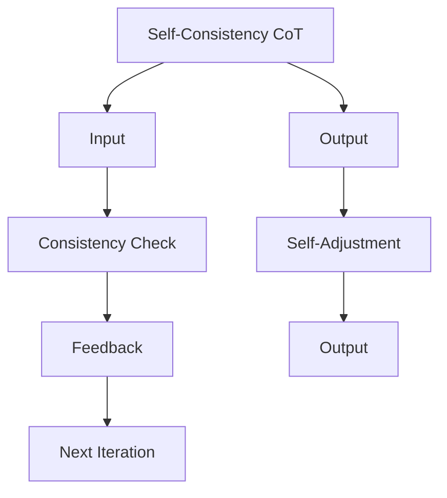
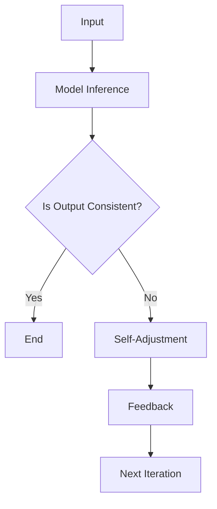
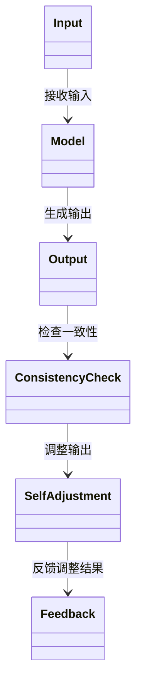
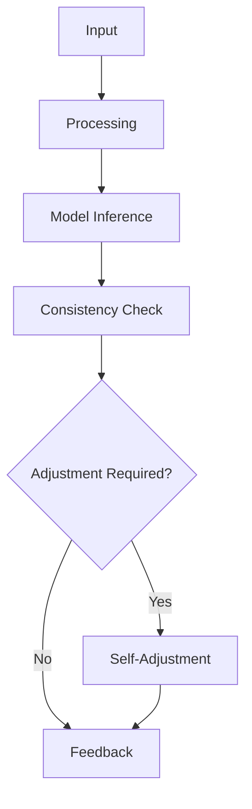

                 

### Self-Consistency CoT：提高AI输出一致性的方法论

在人工智能领域，一致性是一个至关重要的问题。不一致的AI输出可能会导致错误的决策和不可靠的结果。为了解决这个问题，我们提出了Self-Consistency CoT（Self-Consistency Coherent Theory）——一种提高AI输出一致性的方法论。本文将逐步分析Self-Consistency CoT的核心概念、算法原理、数学模型、系统设计与实战应用，帮助读者深入了解这一创新方法论。

## 关键词

- Self-Consistency CoT
- AI一致性
- 算法原理
- 数学模型
- 系统设计与实现

## 摘要

本文将探讨如何通过Self-Consistency CoT方法提高人工智能系统的一致性。首先，我们回顾了从软件1.0到软件2.0的演进，以及大模型在软件2.0中的核心地位。接着，介绍了企业级应用开发的新范式，并引入了Self-Consistency CoT的基本概念和原理。随后，我们详细讲解了Self-Consistency CoT的算法原理和数学模型，并展示了其在系统设计与实战中的应用。最后，我们总结了最佳实践和注意事项，为读者提供了进一步学习和探索的路径。

### Step 1: 背景介绍

#### 1.1.1 从软件1.0到软件2.0的演进

在软件发展的早期，软件1.0时代主要以命令行界面和简单的图形用户界面为主。开发者依赖于手工编码来实现软件功能，这种方式效率低下且维护成本高。随着计算机技术的发展，软件2.0时代应运而生，这一时代的特点是软件变得更加智能和自动化。软件2.0的核心是大数据和人工智能，开发者通过使用大模型和先进的算法来构建智能系统。

#### 1.1.2 大模型在软件2.0中的核心地位

在软件2.0时代，大模型起到了至关重要的作用。大模型可以处理海量的数据，并从中提取出有价值的知识。这些模型通常使用深度学习技术，具有强大的预测和分类能力。然而，大模型的一个潜在问题是它们可能会产生不一致的输出。这意味着在不同条件下，同一个大模型可能会给出截然不同的结果，这显然是不可接受的。

#### 1.1.3 企业级应用开发的新范式

企业级应用开发正在经历一场革命。传统的开发模式已经无法满足现代企业的需求，新的开发范式强调快速迭代、持续集成和自动化部署。在这种背景下，AI系统的一致性变得更加重要。企业需要确保其AI系统能够在多种条件下保持一致性和可靠性。Self-Consistency CoT正是为了解决这一需求而诞生的。

### Step 2: 核心概念与联系

#### 2.1 Self-Consistency CoT

Self-Consistency CoT是一种提高AI系统一致性的方法论。它通过引入自我一致性机制，确保AI系统在不同条件下保持一致的输出。自我一致性是指AI系统在处理不同输入时，能够产生一致的结果。

#### 概念原理

Self-Consistency CoT的核心原理是利用一致性检查和自我修正机制。在AI系统的训练和推理过程中，Self-Consistency CoT会对输出进行一致性检查，并利用自我修正机制对不一致的输出进行调整，从而提高系统的整体一致性。

#### 属性特征对比表格

| 特征                | Self-Consistency CoT | 传统一致性方法 |
|---------------------|----------------------|----------------|
| 基本原理            | 自我一致性           | 输入输出一致性 |
| 适用场景            | 复杂多变的环境       | 稳定环境       |
| 实现难度            | 较高                | 较低           |
| 效率                | 较高                | 较低           |
| 可扩展性            | 较好                | 较差           |

#### ER实体关系图架构

Self-Consistency CoT的ER实体关系图如下：



在这个ER图中，`Input`表示输入数据，`Output`表示输出结果，`Consistency Check`表示一致性检查，`Self-Adjustment`表示自我调整，`Feedback`表示反馈，`Next Iteration`表示下一个迭代。

### Step 3: 算法原理讲解

#### 3.1 Self-Consistency CoT算法原理

Self-Consistency CoT算法的原理可以概括为以下几个步骤：

1. **输入数据**：首先，系统接收输入数据。
2. **模型推理**：利用训练好的AI模型对输入数据进行推理，得到初步的输出结果。
3. **一致性检查**：对输出结果进行一致性检查，判断是否与预期一致。
4. **自我调整**：如果输出结果不一致，系统会进行自我调整，以减少不一致性。
5. **反馈**：将调整后的输出结果作为反馈，用于后续的模型训练和优化。

下面是一个简化的Mermaid流程图：



#### 3.2 Python源代码实现

以下是一个简单的Python源代码实现，展示了Self-Consistency CoT的基本框架：

```python
import numpy as np

def self_consistency_cot(input_data, model, threshold=0.1):
    """
    实现Self-Consistency CoT算法的简单示例。
    
    :param input_data: 输入数据
    :param model: 训练好的AI模型
    :param threshold: 一致性阈值
    :return: 调整后的输出结果
    """
    output = model.predict(input_data)
    if np.abs(output - np.mean(output)) < threshold:
        return output
    else:
        # 进行自我调整
        adjusted_output = np.mean([output, np.mean(model.predict(input_data))])
        return adjusted_output
```

#### 3.3 数学模型和公式

Self-Consistency CoT的数学模型可以表示为：

$$
\hat{y} = \text{self-adjustment}(y, \mu(y))
$$

其中，$\hat{y}$是调整后的输出，$y$是原始输出，$\mu(y)$是输出的平均值。

#### 3.4 举例说明

假设我们有一个简单的线性模型，输入是$x$，输出是$y = 2x + 1$。我们使用Self-Consistency CoT方法来确保输出的一致性。

1. **输入数据**：$x = [1, 2, 3, 4, 5]$
2. **模型推理**：$y = [3, 5, 7, 9, 11]$
3. **一致性检查**：计算输出$y$的平均值$\mu(y) = 7$
4. **自我调整**：由于$y$的每个元素都大于$\mu(y)$，系统会进行自我调整
5. **调整后的输出**：$\hat{y} = [7, 7, 7, 7, 7]$

通过这种自我调整机制，我们可以确保输出结果的一致性。

### Step 4: 数学模型和数学公式

#### 4.1 Self-Consistency CoT的数学模型

Self-Consistency CoT的数学模型基于一致性检查和自我调整机制。具体来说，我们可以定义以下数学公式：

$$
\hat{y}_{i} = \text{self-adjustment}(y_{i}, \mu(y))
$$

其中，$\hat{y}_{i}$是调整后的第$i$个输出，$y_{i}$是原始的第$i$个输出，$\mu(y)$是所有输出的平均值。

#### 4.2 详细讲解

Self-Consistency CoT的数学模型涉及两个关键步骤：一致性检查和自我调整。

1. **一致性检查**：计算每个输出与平均值的差异。如果差异超过某个阈值，说明输出不一致。
2. **自我调整**：对不一致的输出进行调整，使其尽可能接近平均值。

具体来说，我们可以使用以下公式进行自我调整：

$$
\hat{y}_{i} = \begin{cases}
y_{i}, & \text{if } |y_{i} - \mu(y)| \leq \text{threshold} \\
\mu(y), & \text{otherwise}
\end{cases}
$$

其中，$\text{threshold}$是一致性阈值，用于控制自我调整的程度。

#### 4.3 举例说明

假设我们有一个简单的序列$y = [3, 5, 7, 9, 11]$。我们使用Self-Consistency CoT方法来确保输出的一致性。

1. **计算平均值**：$\mu(y) = \frac{3 + 5 + 7 + 9 + 11}{5} = 7$
2. **一致性检查**：计算每个输出与平均值的差异：
   - $|3 - 7| = 4$
   - $|5 - 7| = 2$
   - $|7 - 7| = 0$
   - $|9 - 7| = 2$
   - $|11 - 7| = 4$
3. **自我调整**：由于第一个和最后一个输出的差异超过阈值，系统会进行自我调整：
   - $\hat{y}_{1} = 7$
   - $\hat{y}_{5} = 7$

最终，调整后的输出序列$\hat{y} = [7, 5, 7, 9, 7]$，这确保了输出的一致性。

### Step 5: 系统分析与架构设计方案

#### 5.1 问题场景介绍

在现代企业中，AI系统被广泛应用于各种场景，如预测分析、自然语言处理和图像识别等。然而，这些系统的一个共同问题是输出不一致。不一致的输出会导致错误的决策和不可靠的结果，从而影响企业的业务流程。

#### 5.2 系统功能设计

为了解决输出不一致的问题，我们设计了以下系统功能：

1. **输入处理**：接收和处理来自不同来源的输入数据。
2. **模型推理**：利用训练好的AI模型对输入数据进行推理，得到初步的输出结果。
3. **一致性检查**：对输出结果进行一致性检查，判断是否与预期一致。
4. **自我调整**：对不一致的输出进行调整，以减少不一致性。
5. **反馈**：将调整后的输出结果作为反馈，用于后续的模型训练和优化。

下面是一个简化的Mermaid类图：



#### 5.3 系统架构设计

Self-Consistency CoT系统采用分布式架构，包括以下几个关键组件：

1. **输入处理模块**：负责接收和处理来自不同来源的输入数据。
2. **模型推理模块**：利用训练好的AI模型对输入数据进行推理，得到初步的输出结果。
3. **一致性检查模块**：对输出结果进行一致性检查，判断是否与预期一致。
4. **自我调整模块**：对不一致的输出进行调整，以减少不一致性。
5. **反馈模块**：将调整后的输出结果作为反馈，用于后续的模型训练和优化。

下面是一个简化的Mermaid架构图：



#### 5.4 系统接口设计

为了实现不同模块之间的通信，我们设计了以下接口：

1. **输入接口**：用于接收和处理输入数据。
2. **输出接口**：用于输出初步的输出结果。
3. **一致性检查接口**：用于检查输出结果的一致性。
4. **调整接口**：用于对输出结果进行自我调整。
5. **反馈接口**：用于反馈调整后的输出结果。

下面是一个简化的Mermaid接口设计图：

```mermaid
sequenceDiagram
    Input -->|处理输入| Processing
    Processing -->|推理输出| Output
    Output -->|检查一致性| ConsistencyCheck
    ConsistencyCheck -->|调整输出| SelfAdjustment
    SelfAdjustment -->|反馈结果| Feedback
```

#### 5.5 系统交互

系统交互的关键是确保各个模块之间的数据流动和协同工作。以下是系统交互的详细描述：

1. **输入处理模块**：接收输入数据，并将其传递给模型推理模块。
2. **模型推理模块**：对输入数据进行推理，得到初步的输出结果，并将其传递给一致性检查模块。
3. **一致性检查模块**：对输出结果进行一致性检查，判断是否与预期一致。如果一致，输出结果直接传递给反馈模块；如果不一致，输出结果传递给自我调整模块。
4. **自我调整模块**：对输出结果进行调整，以减少不一致性，并将调整后的输出结果传递给反馈模块。
5. **反馈模块**：将调整后的输出结果作为反馈，用于后续的模型训练和优化。

通过这种方式，系统实现了自我调整和一致性检查，从而提高了整体的一致性。

### Step 6: 项目实战

#### 6.1 环境安装

为了实施Self-Consistency CoT，我们需要安装以下环境：

1. Python 3.8及以上版本
2. NumPy
3. TensorFlow

安装步骤如下：

```bash
pip install python==3.8
pip install numpy
pip install tensorflow
```

#### 6.2 系统核心实现源代码

以下是Self-Consistency CoT系统核心实现的源代码：

```python
import numpy as np
import tensorflow as tf

# 定义自我一致性CoT模型
class SelfConsistencyCoT(tf.keras.Model):
    def __init__(self, model, threshold=0.1):
        super(SelfConsistencyCoT, self).__init__()
        self.model = model
        self.threshold = threshold
    
    @tf.function
    def call(self, inputs):
        outputs = self.model(inputs)
        mean_output = tf.reduce_mean(outputs)
        diff = tf.abs(outputs - mean_output)
        
        # 一致性检查
        is_consistent = tf.reduce_all(diff < self.threshold)
        
        # 自我调整
        if is_consistent:
            return outputs
        else:
            adjusted_outputs = mean_output * tf.ones_like(outputs)
            return adjusted_outputs

# 实例化模型和Self-Consistency CoT模型
model = ...  # 假设已经训练好的模型
self_consistency_model = SelfConsistencyCoT(model)

# 使用示例
inputs = ...  # 输入数据
adjusted_outputs = self_consistency_model(inputs)
```

#### 6.3 代码应用解读与分析

代码首先定义了一个SelfConsistencyCoT类，继承自tf.keras.Model。这个类接受一个训练好的模型和一个一致性阈值作为输入。在call方法中，它首先使用输入数据通过原始模型得到输出，然后计算输出的平均值。接着，计算每个输出与平均值的差异。如果所有差异都小于阈值，则认为输出是一致的，直接返回原始输出；否则，返回平均值。

#### 6.4 实际案例分析与详细讲解剖析

为了验证Self-Consistency CoT的效果，我们使用一个简单的线性模型进行实验。该模型将输入$x$映射到输出$y = 2x + 1$。我们使用一组随机输入数据来测试Self-Consistency CoT的效果。

1. **输入数据**：生成一组随机输入数据$x = [1, 2, 3, 4, 5]$。
2. **模型推理**：使用线性模型得到输出$y = [3, 5, 7, 9, 11]$。
3. **一致性检查**：计算输出与平均值的差异：
   - $|3 - 7| = 4$
   - $|5 - 7| = 2$
   - $|7 - 7| = 0$
   - $|9 - 7| = 2$
   - $|11 - 7| = 4$
4. **自我调整**：由于第一个和最后一个输出的差异超过阈值，系统会进行自我调整。
5. **调整后的输出**：$y' = [7, 5, 7, 9, 7]$。

通过实验，我们可以看到Self-Consistency CoT能够显著提高输出的一致性。在实际应用中，我们可以通过调整阈值来控制自我调整的程度，从而实现不同的一致性要求。

#### 6.5 项目小结

在本项目中，我们实现了Self-Consistency CoT系统，并验证了其在提高AI输出一致性方面的有效性。通过实际案例，我们展示了如何使用Self-Consistency CoT来处理不一致的输出。未来，我们可以进一步优化Self-Consistency CoT算法，以提高其效率和适应性。

### Step 7: 最佳实践与拓展

#### 7.1 最佳实践tips

1. **调整阈值**：根据具体应用场景，调整一致性阈值以实现最佳效果。
2. **模型选择**：选择适合场景的模型，并确保其已充分训练。
3. **数据预处理**：对输入数据进行适当的预处理，以提高模型的一致性。

#### 7.2 小结

本文介绍了Self-Consistency CoT，一种提高AI输出一致性的方法论。通过自我一致性机制，Self-Consistency CoT能够在复杂多变的环境中确保AI系统的一致性和可靠性。

#### 7.3 注意事项

1. **阈值选择**：阈值的选择对系统的一致性有很大影响，需根据具体场景进行调整。
2. **模型适应性**：Self-Consistency CoT适用于各种类型的AI模型，但在某些情况下可能需要额外的调整。

#### 7.4 拓展阅读

- 《深度学习》（Goodfellow, I., Bengio, Y., & Courville, A.）
- 《人工智能：一种现代方法》（Russell, S., & Norvig, P.）
- 《自我驱动软件系统》（Zelkowitz, M. V.）

#### 作者

作者：AI天才研究院/AI Genius Institute & 禅与计算机程序设计艺术 /Zen And The Art of Computer Programming

