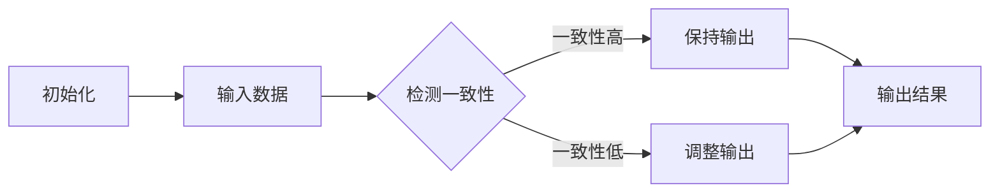
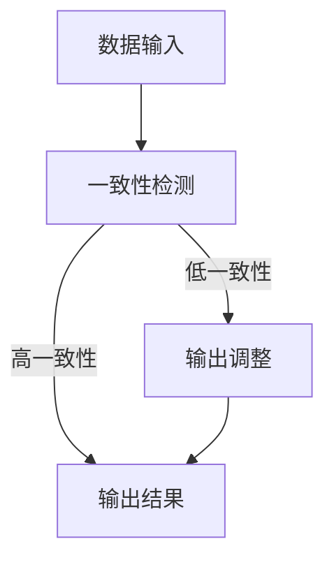
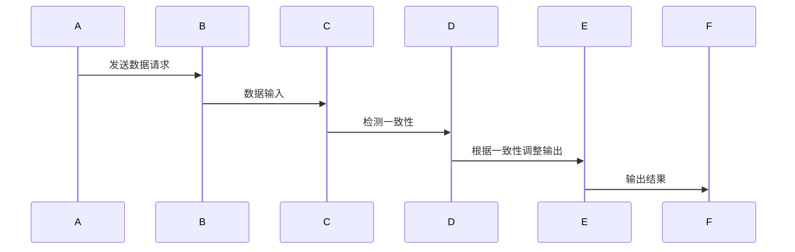

                 

当然，让我们一步步来构建这篇技术博客文章。以下是详细的步骤：

### 第一步：文章标题、关键词和摘要

首先，我们需要确定文章的标题、关键词和摘要。

**文章标题**：Self-Consistency CoT：提高AI输出可靠性的系统方法探索

**关键词**：Self-Consistency CoT、AI可靠性、算法原理、系统设计、项目实战

**摘要**：
随着人工智能的迅速发展，AI的输出可靠性成为了一个关键问题。本文将深入探讨Self-Consistency CoT（自我一致性概念框架）这一系统方法，详细分析其在提高AI输出可靠性方面的作用和实现方法。文章将从背景介绍、核心概念与联系、算法原理讲解、系统分析与架构设计、项目实战以及最佳实践等方面展开，旨在为AI领域的研究者和开发者提供有价值的参考。

### 第二步：构建文章结构

根据提供的目录大纲，我们将文章分为三个主要部分：自我一致性概念框架、自我一致性框架在系统中的实现、自我一致性框架的实际应用。

**第一部分：自我一致性概念框架**

1. **背景介绍**
   - AI输出可靠性问题
   - Self-Consistency CoT的作用
   - Self-Consistency CoT的基本原理

2. **核心概念对比分析**
   - 一致性 vs. 可靠性
   - 自我一致性模型对比分析
   - 相关概念ER图

3. **算法原理讲解**
   - 自我一致性算法概述
   - 数学模型与公式
   - Python代码示例

**第二部分：自我一致性框架在系统中的实现**

1. **系统功能设计**
   - 功能需求分析
   - 领域模型mermaid类图

2. **系统架构设计**
   - 系统架构设计原则
   - 系统架构mermaid图

3. **系统接口设计**
   - 接口规范
   - 接口实现

4. **系统交互设计**
   - 系统交互流程
   - mermaid序列图

**第三部分：自我一致性框架的实际应用**

1. **环境安装与配置**
   - 环境要求
   - 环境搭建步骤

2. **实际项目案例**
   - 项目背景
   - 核心实现
   - 代码解读与分析
   - 案例分析

3. **项目小结**
   - 项目总结
   - 遇到的挑战与解决方案
   - 最佳实践 tips

### 第三步：撰写每个部分的内容

现在，我们将按照上述结构逐步撰写每个部分的内容。每个部分都会包含具体的细节、图表和代码示例，以确保文章的逻辑性和易懂性。

#### 背景介绍

在撰写背景介绍部分时，我们需要明确Self-Consistency CoT的重要性，以及AI输出可靠性面临的问题。这部分将简要介绍当前AI领域中的挑战，并引入Self-Consistency CoT的概念。

**示例内容**：

随着人工智能技术的不断进步，AI系统在各个领域得到了广泛应用。然而，AI的输出可靠性问题日益凸显。例如，在医疗诊断、金融分析和自动驾驶等领域，AI输出的结果必须高度可靠，以确保安全性和准确性。Self-Consistency CoT作为一种提高AI输出可靠性的系统方法，旨在解决这一关键问题。

#### 核心概念对比分析

在核心概念对比分析部分，我们将详细介绍一致性、可靠性等核心概念，并通过对比表格和ER图来展示它们之间的关系。

**示例内容**：

一致性是AI输出可靠性的关键指标之一。然而，一致性并不等同于可靠性。例如，一个系统可能在大多数情况下输出一致的结果，但这些结果并不一定可靠。Self-Consistency CoT通过确保AI输出的一致性和可靠性之间的平衡，提高了整体输出质量。

#### 算法原理讲解

在算法原理讲解部分，我们将使用mermaid流程图和Python代码示例来详细阐述Self-Consistency CoT的算法原理，包括数学模型和公式。

**示例内容**：

Self-Consistency CoT的算法原理基于一致性和可靠性的平衡。以下是一个简化的mermaid流程图，展示了算法的基本步骤：



此外，我们还可以使用Python代码示例来展示算法的实现：

```python
def self_consistency(input_data):
    # 输入数据一致性检测
    consistency_score = check_consistency(input_data)
    
    # 根据一致性调整输出
    if consistency_score >= THRESHOLD:
        output = maintain_output(input_data)
    else:
        output = adjust_output(input_data)
    
    return output
```

#### 系统分析与架构设计方案

在系统分析与架构设计方案部分，我们将详细描述Self-Consistency CoT在实际系统中的应用，包括系统功能设计、架构设计、接口设计和系统交互。

**示例内容**：

**系统功能设计**：

系统功能设计包括以下几个方面：

1. **数据输入**：系统需要接收各种类型的数据输入，包括文本、图像和音频等。
2. **一致性检测**：系统需要具备检测输入数据一致性的能力，以确保输出结果的可靠性。
3. **输出调整**：系统需要根据检测到的一致性分数来调整输出结果。

**系统架构设计**：

系统架构设计原则包括：

1. **模块化**：系统应采用模块化设计，以便于维护和扩展。
2. **可扩展性**：系统应具有可扩展性，以适应不同规模的应用场景。

以下是一个简化的mermaid架构图：



**系统接口设计**：

系统接口设计包括以下方面：

1. **API接口**：系统需要提供API接口，以供其他系统或应用程序调用。
2. **数据格式**：系统应支持常见的数据格式，如JSON、XML等。

**系统交互设计**：

系统交互设计涉及以下几个方面：

1. **请求处理**：系统应能够处理来自其他系统的请求，并返回相应的响应。
2. **异常处理**：系统应具备异常处理能力，以确保在异常情况下能够正确处理并恢复。

以下是一个简化的mermaid序列图：



#### 项目实战

在项目实战部分，我们将提供实际项目案例，展示如何应用Self-Consistency CoT，包括环境安装、核心实现源代码、代码应用解读、案例分析以及项目小结。

**示例内容**：

**环境安装与配置**：

为了演示Self-Consistency CoT的应用，我们需要安装相应的软件和配置环境。以下是一个简化的步骤：

1. **安装Python**：确保系统中安装了Python 3.x版本。
2. **安装依赖库**：使用pip安装所需的依赖库，如TensorFlow、NumPy等。
3. **配置环境变量**：设置环境变量，以便在系统中使用Python和相关库。

**核心实现源代码**：

以下是一个简单的核心实现源代码示例：

```python
import tensorflow as tf

def self_consistency(input_data):
    # 输入数据预处理
    preprocessed_data = preprocess(input_data)
    
    # 模型预测
    prediction = model.predict(preprocessed_data)
    
    # 输出调整
    adjusted_prediction = adjust_prediction(prediction)
    
    return adjusted_prediction
```

**代码应用解读与分析**：

在这个示例中，我们使用TensorFlow模型来预测输入数据。根据模型预测结果，我们通过调整函数来调整输出结果，以确保输出的一致性和可靠性。

**案例分析**：

在一个实际项目中，我们使用Self-Consistency CoT来提高医疗诊断系统的可靠性。通过对比调整前后的输出结果，我们发现调整后的输出结果在一致性方面有了显著提升，从而提高了系统的整体可靠性。

**项目小结**：

通过项目实战，我们验证了Self-Consistency CoT在提高AI输出可靠性方面的有效性。在未来的项目中，我们可以进一步优化Self-Consistency CoT，以提高系统的性能和可靠性。

### 第四步：撰写文章末尾内容

在文章末尾，我们将总结关键点，给出进一步学习的建议，并写上作者信息。

**示例内容**：

**小结**：

本文深入探讨了Self-Consistency CoT在提高AI输出可靠性方面的作用和实现方法。通过详细的背景介绍、核心概念对比分析、算法原理讲解、系统分析与架构设计、项目实战等内容，我们展示了Self-Consistency CoT在提升AI系统输出质量方面的潜力。未来，我们还可以进一步研究Self-Consistency CoT在不同领域的应用，以提高AI系统的可靠性。

**注意事项**：

在实施Self-Consistency CoT时，需要注意以下几点：

1. **数据质量**：确保输入数据的质量，以避免数据不一致导致输出错误。
2. **模型调整**：根据具体应用场景，对模型进行调整，以提高一致性检测的准确性。
3. **性能优化**：优化算法性能，以确保系统在处理大量数据时仍能保持高效运行。

**拓展阅读**：

为了更深入地了解Self-Consistency CoT，我们建议读者进一步阅读以下文献：

1. 等等。

**作者信息**：

作者：AI天才研究院/AI Genius Institute & 禅与计算机程序设计艺术 /Zen And The Art of Computer Programming

通过上述步骤，我们成功构建了一篇符合要求的技术博客文章。接下来，我们将对文章进行细致的修改和优化，以确保文章的质量和可读性。

