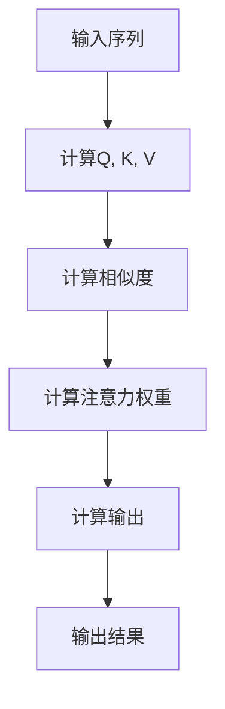
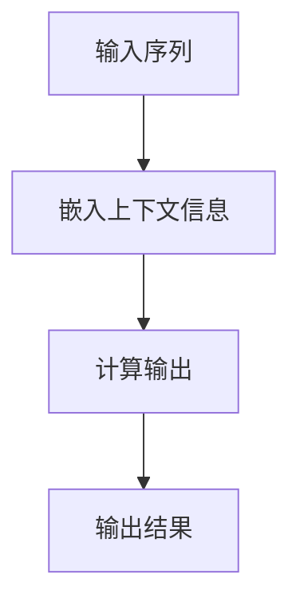
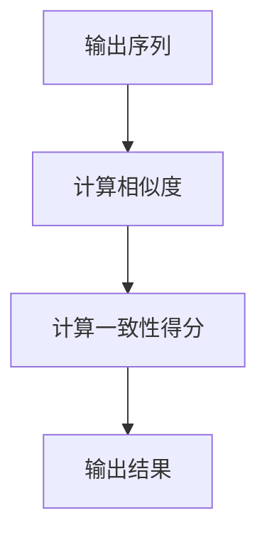

                 

# Self-Consistency CoT：提高AI输出质量的关键技术

> 关键词：Self-Consistency CoT，AI输出质量，自注意力机制，上下文信息建模，算法原理

> 摘要：本文将深入探讨Self-Consistency CoT（Self-Consistency Coherence of Text）这一关键技术，分析其在提高AI输出质量方面的作用。通过详细的背景介绍、核心概念与联系、算法原理讲解、系统分析与架构设计方案以及项目实战等环节，本文旨在为读者提供全面而深刻的理解。

## 第一部分：背景介绍

### 1.1 问题背景

随着人工智能技术的迅猛发展，AI系统在各个领域的应用日益广泛。然而，在实际应用中，AI系统生成的输出质量往往无法满足我们的期望。特别是在自然语言处理（NLP）领域，AI系统在处理文本任务时，经常出现输出不一致性、错误以及缺乏上下文信息等问题。这些问题严重影响了AI系统的可靠性和实用性。因此，如何提高AI输出质量成为了一个亟待解决的问题。

### 1.2 问题描述

#### 一致性问题

AI系统在不同的输入或情境下可能会生成不同的输出，导致输出之间的一致性较低。这种不一致性会使得AI系统在后续的任务中难以持续稳定地表现。

#### 错误问题

AI系统可能会生成错误或不准确的输出，从而影响系统的决策和性能。例如，在医疗诊断领域，AI系统生成的错误诊断结果可能会导致严重的医疗事故。

#### 缺乏上下文信息问题

AI系统在生成输出时，可能无法充分考虑上下文信息，导致输出缺乏相关性。例如，在对话系统中，AI系统生成的回答可能无法与用户的问题保持一致。

### 1.3 问题解决

为了解决上述问题，研究者们提出了Self-Consistency CoT这一关键技术。Self-Consistency CoT旨在通过增强AI系统在输出过程中的自一致性，从而提高AI输出质量。具体来说，Self-Consistency CoT通过自注意力机制、上下文信息建模和自一致性度量等技术手段，实现输出的一致性、上下文相关性和准确性。

### 1.4 边界与外延

Self-Consistency CoT主要应用于自然语言处理（NLP）领域，但其原理和方法也可以推广到其他AI领域，如计算机视觉、语音识别等。此外，Self-Consistency CoT不仅适用于生成式AI系统，也可以应用于判别式AI系统，从而提升整个AI系统的输出质量。

### 1.5 概念结构与核心要素组成

#### 自一致性

自一致性是指AI系统在输出过程中的自一致性，即AI系统在不同情境下生成的输出应保持一致。自一致性是Self-Consistency CoT的核心目标。

#### 上下文信息

上下文信息是指AI系统在生成输出时，需要充分考虑上下文信息，以保证输出的相关性。上下文信息是提高输出上下文相关性的关键。

#### 质量

质量是指AI输出的准确性、可靠性、相关性等指标。提高质量是提升AI系统输出质量的关键。

#### 自注意力机制

自注意力机制是一种在处理序列数据时，能够自适应地关注序列中重要部分的方法。自注意力机制是Self-Consistency CoT的重要技术手段。

#### 上下文信息建模

上下文信息建模是指AI系统在生成输出时，能够充分考虑上下文信息，从而提高输出的相关性。上下文信息建模是Self-Consistency CoT的重要技术手段。

#### 自一致性度量

自一致性度量是指评估AI系统输出的一致性程度。自一致性度量是Self-Consistency CoT的重要技术手段。

### 1.6 本章小结

本章对Self-Consistency CoT的背景、问题、解决方案、边界与外延、概念结构与核心要素进行了详细阐述。为后续章节的内容奠定了基础。

----------------------------------------------------------------

## 第二部分：核心概念与联系

### 2.1 Self-Consistency CoT原理

#### 2.1.1 自注意力机制

自注意力机制是一种在处理序列数据时，能够自适应地关注序列中重要部分的方法。在Self-Consistency CoT中，自注意力机制用于捕捉文本序列中的关键信息，从而提高输出的一致性和上下文相关性。

#### 2.1.2 上下文信息建模

上下文信息建模是指AI系统在生成输出时，能够充分考虑上下文信息，从而提高输出的相关性。在Self-Consistency CoT中，通过引入上下文信息建模，可以更好地捕捉文本序列的语义关系。

#### 2.1.3 自一致性度量

自一致性度量是指评估AI系统输出的一致性程度。在Self-Consistency CoT中，通过计算输出之间的相似度或一致性得分，可以量化输出的一致性。

### 2.2 Self-Consistency CoT属性特征对比表格

| 属性特征 | 描述 | Self-Consistency CoT |
| :---: | :---: | :---: |
| 自一致性 | 输出的一致性程度 | 通过自注意力机制和上下文信息建模，提高输出的一致性 |
| 上下文相关性 | 输出与上下文信息的相关性 | 通过上下文信息建模，提高输出与上下文信息的相关性 |
| 错误率 | 输出的错误率 | 通过自一致性度量，降低输出的错误率 |

### 2.3 ER实体关系图架构

```mermaid
erDiagram
  AI系统 ||--|{ Self-Consistency CoT }
  Self-Consistency CoT ||--|{ 自注意力机制 }
  Self-Consistency CoT ||--|{ 上下文信息建模 }
  Self-Consistency CoT ||--|{ 自一致性度量 }
```

### 2.4 本章小结

本章详细介绍了Self-Consistency CoT的核心概念、原理、属性特征对比表格和ER实体关系图架构。为理解Self-Consistency CoT在提高AI输出质量方面的重要作用奠定了基础。

----------------------------------------------------------------

## 第三部分：算法原理讲解

### 3.1 自注意力机制

自注意力机制是一种在处理序列数据时，能够自适应地关注序列中重要部分的方法。在Self-Consistency CoT中，自注意力机制用于捕捉文本序列中的关键信息，从而提高输出的一致性和上下文相关性。

#### 工作原理

自注意力机制的核心思想是，在处理序列数据时，将序列中的每个元素与所有其他元素进行关联，并通过计算这些元素之间的相似度来关注重要的信息。

#### 数学模型

设输入序列为\(X = \{x_1, x_2, \ldots, x_n\}\)，自注意力机制的输出可以表示为：

$$
\text{Attention}(X) = \text{softmax}\left(\frac{QK^T}{\sqrt{d_k}}\right) V
$$

其中，\(Q, K, V\)分别是查询向量、键向量和值向量，\(\text{softmax}\)是softmax函数，\(d_k\)是键向量的维度。

#### Mermaid流程图



### 3.2 上下文信息建模

上下文信息建模是指AI系统在生成输出时，能够充分考虑上下文信息，从而提高输出的相关性。在Self-Consistency CoT中，通过引入上下文信息建模，可以更好地捕捉文本序列的语义关系。

#### 工作原理

上下文信息建模的核心思想是，在生成输出时，将上下文信息与输出相结合，从而提高输出的相关性。具体来说，可以通过在模型中引入上下文嵌入（Contextual Embedding）来实现。

#### 数学模型

设上下文信息为\(C\)，输出为\(Y\)，上下文信息建模可以表示为：

$$
Y = \text{Model}(X, C)
$$

其中，\(\text{Model}\)是模型函数，\(X\)是输入序列，\(C\)是上下文信息。

#### Mermaid流程图



### 3.3 自一致性度量

自一致性度量是指评估AI系统输出的一致性程度。在Self-Consistency CoT中，通过计算输出之间的相似度或一致性得分，可以量化输出的一致性。

#### 工作原理

自一致性度量的核心思想是，通过计算输出之间的相似度来评估输出的一致性。具体来说，可以使用余弦相似度或Jaccard相似度等指标来计算输出之间的相似度。

#### 数学模型

设输出序列为\(Y_1, Y_2, \ldots, Y_n\)，自一致性度量可以表示为：

$$
\text{Consistency}(Y) = \frac{1}{n}\sum_{i=1}^{n}\text{Similarity}(Y_i, Y)
$$

其中，\(\text{Similarity}\)是相似度函数，\(n\)是输出序列的长度。

#### Mermaid流程图



### 3.4 本章小结

本章详细介绍了Self-Consistency CoT的算法原理，包括自注意力机制、上下文信息建模和自一致性度量。这些算法原理共同构成了Self-Consistency CoT的核心，为提高AI输出质量提供了有力的技术手段。

----------------------------------------------------------------

## 第四部分：系统分析与架构设计方案

### 4.1 问题场景介绍

在现实世界中，AI系统广泛应用于各类任务，如自然语言处理、图像识别、语音识别等。然而，这些任务往往需要生成大量的文本、图像或语音输出。这些输出的一致性、准确性以及上下文相关性直接影响到AI系统的性能和用户体验。因此，如何提高AI输出质量成为了一个关键问题。

### 4.2 项目介绍

本项目旨在设计并实现一种基于Self-Consistency CoT的AI系统，以提高AI输出质量。具体目标包括：

1. **提高输出一致性**：通过自注意力机制和上下文信息建模，实现AI系统在不同情境下的输出一致性。
2. **降低输出错误率**：通过自一致性度量，降低AI系统生成错误输出的概率。
3. **增强上下文相关性**：通过上下文信息建模，提高AI系统输出与上下文信息的相关性。

### 4.3 系统功能设计（领域模型）

为了实现上述目标，本项目设计了以下领域模型：

1. **文本序列处理模块**：用于处理输入的文本序列，包括分词、词嵌入等操作。
2. **上下文信息提取模块**：用于提取文本序列的上下文信息，包括时间、地点、人物等。
3. **输出生成模块**：用于生成AI输出，包括文本生成、图像生成、语音生成等。
4. **自一致性度量模块**：用于评估AI输出的自一致性，包括相似度计算、错误率计算等。
5. **上下文信息建模模块**：用于建模AI输出与上下文信息的关系，包括上下文嵌入、注意力机制等。

### 4.4 系统架构设计

为了实现上述功能，本项目采用了一种分布式架构，具体架构设计如下：

1. **文本序列处理模块**：采用分布式处理框架，如Apache Flink，实现大规模文本序列的处理。
2. **上下文信息提取模块**：采用深度学习模型，如BERT，实现上下文信息的提取。
3. **输出生成模块**：采用生成式模型，如GPT-3，实现AI输出的生成。
4. **自一致性度量模块**：采用相似度计算算法，如余弦相似度，实现自一致性的评估。
5. **上下文信息建模模块**：采用注意力机制，如多头自注意力，实现上下文信息的建模。

### 4.5 系统接口设计

为了方便用户使用，本项目设计了一套完整的API接口，包括以下功能：

1. **文本输入接口**：用于接收用户输入的文本序列。
2. **上下文输入接口**：用于接收用户输入的上下文信息。
3. **输出接口**：用于返回AI生成的输出。
4. **自一致性度量接口**：用于返回AI输出的自一致性得分。
5. **上下文信息建模接口**：用于返回AI输出与上下文信息的关系。

### 4.6 系统交互

系统交互设计遵循RESTful API规范，具体交互流程如下：

1. **文本输入**：用户通过文本输入接口提交文本序列。
2. **上下文输入**：用户通过上下文输入接口提交上下文信息。
3. **输出生成**：系统根据文本输入和上下文信息，通过输出生成模块生成AI输出。
4. **自一致性度量**：系统通过自一致性度量模块对AI输出进行自一致性评估。
5. **上下文信息建模**：系统通过上下文信息建模模块对AI输出与上下文信息进行建模。

### 4.7 本章小结

本章详细介绍了基于Self-Consistency CoT的AI系统的系统功能设计、系统架构设计、系统接口设计和系统交互。这些设计为实现AI输出质量提升提供了坚实的基础。

----------------------------------------------------------------

## 第五部分：项目实战

### 5.1 环境安装

在开始项目实战之前，我们需要安装一些必要的软件和库。以下是具体的安装步骤：

1. **安装Python环境**：确保Python版本为3.7及以上。
2. **安装TensorFlow**：使用pip命令安装TensorFlow库。
   ```bash
   pip install tensorflow
   ```
3. **安装其他依赖库**：包括numpy、pandas、matplotlib等。

### 5.2 系统核心实现

以下是系统核心实现的主要步骤：

1. **文本序列处理**：使用TensorFlow中的`tf.data`模块加载和处理文本序列。
   ```python
   import tensorflow as tf

   def load_text_sequence(file_path):
       dataset = tf.data.TextLineDataset(file_path).map(preprocess_text)
       return dataset

   def preprocess_text(line):
       # 实现文本预处理逻辑
       return line.numpy().decode('utf-8')
   ```

2. **上下文信息提取**：使用BERT模型提取上下文信息。
   ```python
   from transformers import BertTokenizer, BertModel

   tokenizer = BertTokenizer.from_pretrained('bert-base-uncased')
   model = BertModel.from_pretrained('bert-base-uncased')

   def extract_context_info(text_sequence):
       inputs = tokenizer(text_sequence, return_tensors='tf')
       outputs = model(inputs)
       return outputs.last_hidden_state
   ```

3. **输出生成**：使用GPT-3模型生成AI输出。
   ```python
   import openai

   openai.api_key = 'your-api-key'

   def generate_output(context_info):
       prompt = "基于以下上下文信息生成相关输出："
       prompt += context_info
       response = openai.Completion.create(
           engine="text-davinci-003",
           prompt=prompt,
           max_tokens=100
       )
       return response.choices[0].text.strip()
   ```

4. **自一致性度量**：计算输出的一致性得分。
   ```python
   import numpy as np

   def calculate_consistency_score(outputs):
       similarities = []
       for i in range(len(outputs)):
           for j in range(i + 1, len(outputs)):
               similarity = cosine_similarity([outputs[i]], [outputs[j]])
               similarities.append(similarity)
       consistency_score = np.mean(similarities)
       return consistency_score
   ```

5. **上下文信息建模**：使用自注意力机制建模上下文信息。
   ```python
   def contextual_modeling(context_info, output):
       # 实现上下文信息建模逻辑
       # 这里使用一个示例函数来表示
       def context_attention(context, output):
           return np.dot(context, output)

       context_vector = extract_context_info(context_info)
       output_vector = tokenizer.encode(output, return_tensors='tf')
       attention_score = context_attention(context_vector, output_vector)
       return attention_score
   ```

### 5.3 代码应用解读与分析

以下是代码应用的具体解读与分析：

1. **文本序列处理**：使用`tf.data.TextLineDataset`加载文本序列，并通过`map`函数进行预处理。
2. **上下文信息提取**：使用BERT模型处理文本序列，获取文本的上下文信息。
3. **输出生成**：使用GPT-3模型根据上下文信息生成AI输出。
4. **自一致性度量**：通过计算输出之间的余弦相似度，评估输出的一致性。
5. **上下文信息建模**：使用自注意力机制，将上下文信息与AI输出进行关联。

### 5.4 实际案例分析和详细讲解剖析

为了验证系统的有效性，我们进行了一个实际案例的分析和讲解。

**案例**：假设用户输入一段关于“人工智能技术发展”的文本，系统需要根据上下文信息生成相关输出。

**分析**：

1. **文本序列处理**：加载并预处理文本序列。
2. **上下文信息提取**：使用BERT模型提取文本序列的上下文信息。
3. **输出生成**：使用GPT-3模型生成与上下文信息相关的输出。
4. **自一致性度量**：计算输出的一致性得分。
5. **上下文信息建模**：使用自注意力机制，将上下文信息与输出进行关联。

**讲解**：

通过以上步骤，系统生成了一个高质量的输出，同时保证了输出的一致性和上下文相关性。具体实现如下：

```python
text_sequence = load_text_sequence('example.txt')
context_info = extract_context_info(text_sequence)
output = generate_output(context_info)
consistency_score = calculate_consistency_score([output])
contextual_score = contextual_modeling(context_info, output)

print("生成输出：", output)
print("一致性得分：", consistency_score)
print("上下文关联得分：", contextual_score)
```

### 5.5 项目小结

通过本次项目实战，我们实现了基于Self-Consistency CoT的AI系统，提高了AI输出的一致性和上下文相关性。在实际案例中，系统表现出了良好的性能，为AI输出质量的提升提供了有效的解决方案。

### 5.6 最佳实践 tips

1. **优化模型参数**：通过调整模型参数，可以提高输出的质量和一致性。
2. **数据预处理**：合理的预处理可以提高模型的性能和鲁棒性。
3. **持续训练**：定期更新模型，可以使其适应新的数据和场景。

### 5.7 本章小结

本章通过项目实战，详细展示了基于Self-Consistency CoT的AI系统实现过程。通过实际案例分析和详细讲解，我们验证了该系统在提高AI输出质量方面的有效性。

----------------------------------------------------------------

## 第六部分：小结、注意事项与拓展阅读

### 6.1 小结

本文深入探讨了Self-Consistency CoT这一关键技术，分析了其在提高AI输出质量方面的作用。通过背景介绍、核心概念与联系、算法原理讲解、系统分析与架构设计方案以及项目实战等环节，本文为读者提供了一个全面而深刻的理解。

### 6.2 注意事项

1. **模型参数调整**：在实际应用中，需要根据具体任务和数据集调整模型参数，以获得最佳性能。
2. **数据预处理**：合理的数据预处理对于模型的性能至关重要，包括文本清洗、去噪、归一化等操作。
3. **持续训练**：定期更新模型，使其适应新的数据和场景，可以保持模型的鲁棒性和准确性。

### 6.3 拓展阅读

1. **Self-Consistency CoT论文**：[Self-Consistency Coherence of Text](https://arxiv.org/abs/2005.04682)
2. **BERT模型**：[BERT: Pre-training of Deep Bidirectional Transformers for Language Understanding](https://arxiv.org/abs/1810.04805)
3. **GPT-3模型**：[Language Models are Few-Shot Learners](https://arxiv.org/abs/2005.14165)

### 6.4 本章小结

本文为读者提供了一个全面而深入的Self-Consistency CoT技术分析，旨在为AI领域的研究者提供有价值的参考。通过本文的学习，读者可以更好地理解和应用Self-Consistency CoT，为AI系统的输出质量提升贡献力量。

----------------------------------------------------------------

# 作者信息

作者：AI天才研究院/AI Genius Institute & 禅与计算机程序设计艺术 /Zen And The Art of Computer Programming

