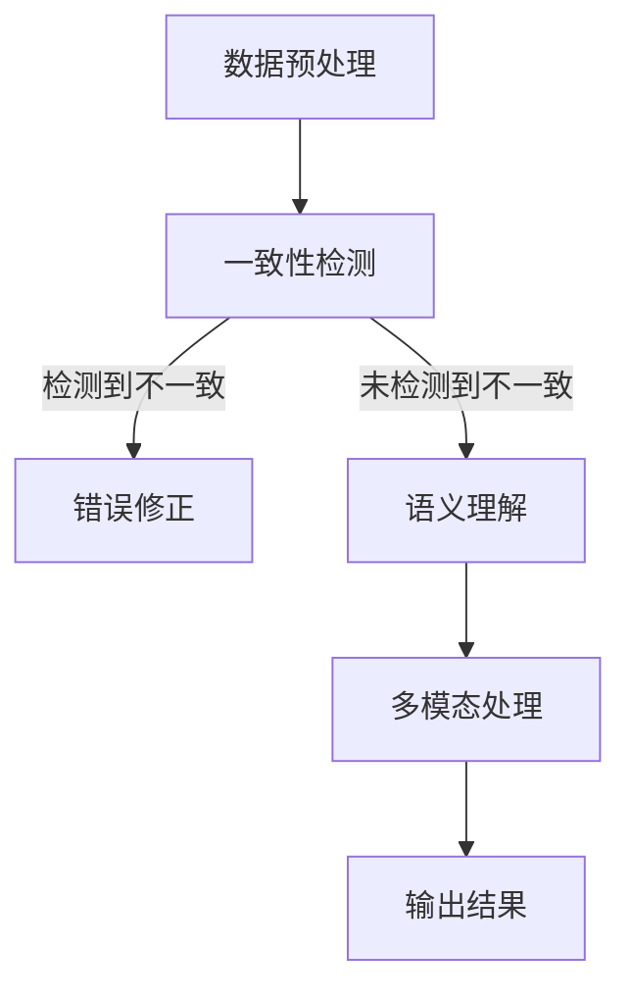
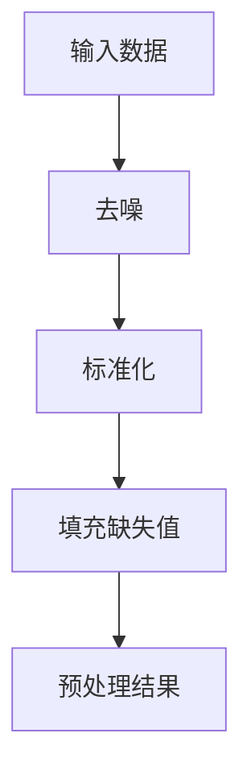
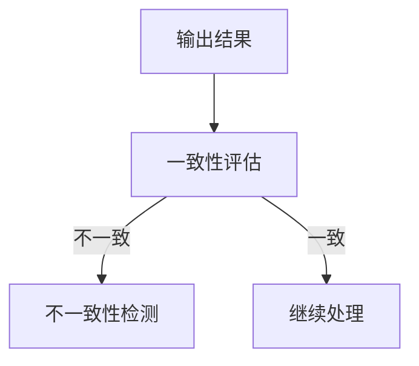
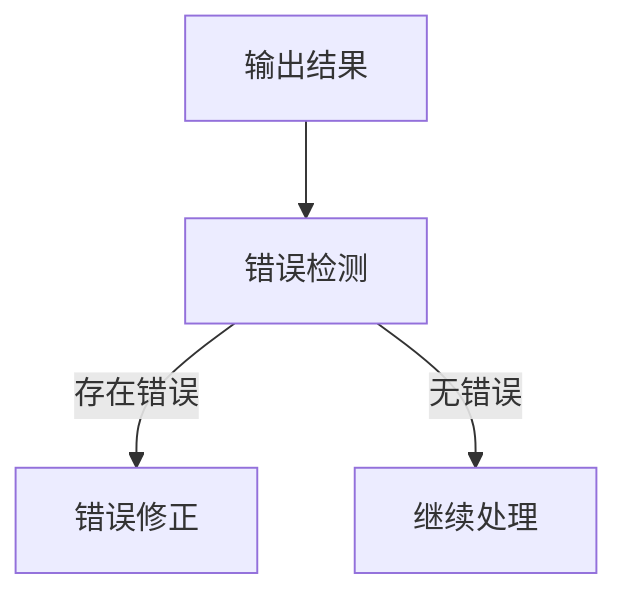
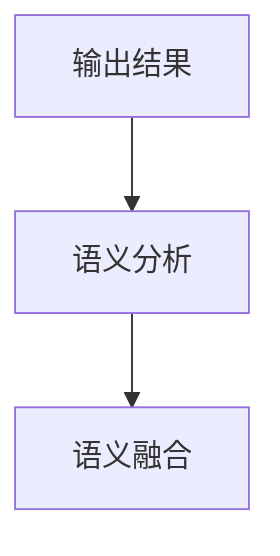
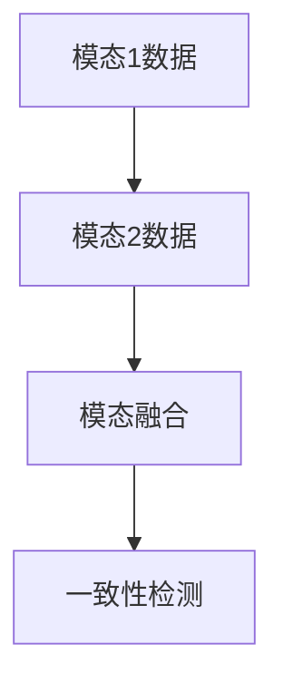
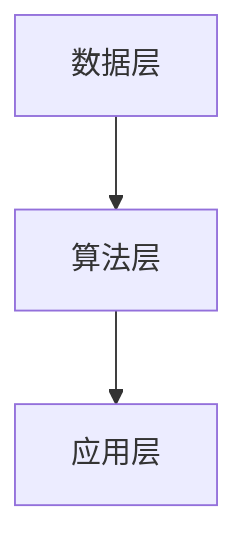
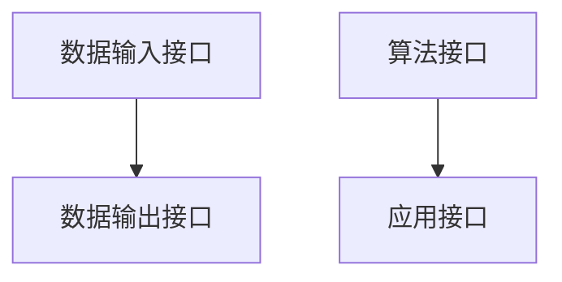
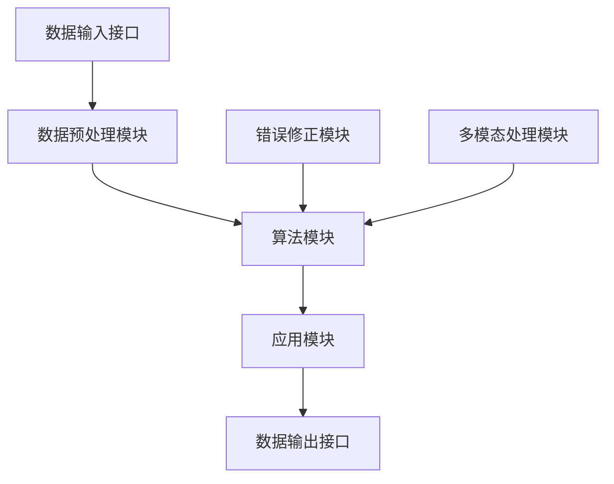

                 

### Self-Consistency CoT：提高AI输出质量的新思路

#### 关键词：自我一致性、概念一致性、AI输出质量、算法原理、系统架构设计

> 摘要：本文深入探讨了自我一致性概念在提升人工智能（AI）输出质量方面的应用。通过介绍自我一致性概念（Self-Consistency CoT）的起源、核心问题及其与现有方法的对比，我们揭示了其提高AI输出质量的潜在优势。接着，文章详细讲解了Self-Consistency CoT的核心概念、算法原理和数学模型，并通过具体实例进行了说明。此外，文章还探讨了在具体系统架构中的应用，提供了完整的系统分析与设计方案，以及实际项目中的实现与应用。最终，文章总结了最佳实践和注意事项，并指出了未来的研究方向。

---

### 第一部分：核心概念与背景

#### 第1章：Self-Consistency CoT：概念引入与背景介绍

##### 1.1 Self-Consistency CoT：问题背景

##### 1.1.1 AI输出质量问题现状

在当前人工智能（AI）领域，AI系统已经被广泛应用于多个行业和领域，从图像识别、自然语言处理到自动驾驶和医疗诊断等。然而，尽管AI系统在很多任务上已经表现出色，但AI输出的质量问题仍然是一个亟待解决的关键问题。常见的AI输出质量问题包括输出不一致性、不准确性、模糊性和逻辑错误等。

输出不一致性指的是在相同输入下，不同模型或同一模型在不同时间生成的输出结果不一致。这种不一致性可能源于模型训练过程中的噪声、数据预处理的不确定性，或者是模型本身对于某些输入特征的敏感度不同。例如，在图像识别任务中，相同图片可能被不同模型识别为不同的类别。

输出不准确性指的是AI系统生成的输出结果与真实情况之间存在偏差。这种偏差可能是因为模型训练数据的不完整性或数据分布与实际应用场景不符。例如，在医疗诊断中，AI系统可能因为缺乏足够的病患数据而导致诊断结果不准确。

模糊性指的是AI系统输出结果的不确定性。在某些复杂任务中，AI系统可能无法给出明确的输出结果，而是提供一个概率分布或置信区间。这种模糊性使得AI系统的实际应用受到限制。

逻辑错误指的是AI系统输出结果与逻辑推理不符。在某些情况下，AI系统可能会因为训练数据中的逻辑错误或模型设计上的缺陷而产生错误的输出结果。例如，在自然语言处理任务中，AI系统可能会将两个无关的句子错误地关联起来。

##### 1.1.2 Self-Consistency CoT的概念起源

为了解决上述AI输出质量问题，研究者们开始探索一种新的方法——自我一致性概念（Self-Consistency CoT）。自我一致性概念源于自然语言处理领域，旨在提高文本生成模型的一致性和准确性。具体来说，自我一致性是指AI系统在生成输出时能够保持内部一致性，即系统的输出应该与其先前的输出或已知的事实相一致。

Self-Consistency CoT的起源可以追溯到2018年，当时研究人员在自然语言处理领域提出了自回归语言模型（Autoregressive Language Model）的概念。自回归语言模型通过预测文本序列中的下一个单词或字符来生成文本，但这种方法容易导致生成文本的内部不一致性。为了解决这个问题，研究者们开始探索如何在生成过程中引入自我一致性约束，从而提高生成文本的一致性和准确性。

##### 1.1.3 Self-Consistency CoT的核心问题

Self-Consistency CoT的核心问题是确保AI系统的输出在逻辑上和语义上是一致的。具体来说，Self-Consistency CoT需要解决以下几个关键问题：

1. **一致性检测**：如何检测AI系统的输出是否与先前的输出或已知事实一致？这涉及到对输出结果进行一致性评估和比较。

2. **错误修正**：如何对不一致的输出结果进行修正？这需要开发有效的错误修正算法，以便在检测到不一致时能够自动修正错误。

3. **语义理解**：如何提高AI系统对语义的理解能力？这涉及到对语言模型进行改进，使其能够更好地理解文本的语义信息。

4. **多模态一致性**：如何处理多模态输入输出的一致性问题？这需要开发能够处理多模态数据的模型和算法。

#### 1.2 Self-Consistency CoT：问题描述

##### 1.2.1 AI输出质量问题的具体表现

如前所述，AI输出质量问题表现为输出不一致性、不准确性、模糊性和逻辑错误等。具体来说：

- **输出不一致性**：在相同输入下，不同模型或同一模型在不同时间生成的输出结果不一致。例如，两个不同的图像识别模型可能对同一张图片给出不同的分类结果。

- **输出不准确性**：AI系统生成的输出结果与真实情况之间存在偏差。例如，在医疗诊断中，AI系统可能因为缺乏足够的病患数据而导致诊断结果不准确。

- **模糊性**：AI系统输出结果的不确定性。例如，在自然语言处理任务中，AI系统可能会给出一个概率分布或置信区间，而不是一个明确的答案。

- **逻辑错误**：AI系统输出结果与逻辑推理不符。例如，在自然语言处理任务中，AI系统可能会将两个无关的句子错误地关联起来。

##### 1.2.2 Self-Consistency CoT的作用

Self-Consistency CoT旨在通过引入自我一致性约束来提高AI系统的输出质量。具体来说，Self-Consistency CoT的作用包括：

1. **提高输出一致性**：通过确保AI系统的输出与其先前的输出或已知事实一致，减少输出不一致性。

2. **提高输出准确性**：通过引入一致性约束，减少AI系统输出与真实情况之间的偏差，提高输出准确性。

3. **减少模糊性**：通过更好地理解文本的语义信息，减少AI系统输出结果的不确定性。

4. **减少逻辑错误**：通过引入一致性约束和语义理解能力，减少AI系统输出结果与逻辑推理不符的情况。

##### 1.2.3 Self-Consistency CoT的边界与外延

虽然Self-Consistency CoT在提高AI输出质量方面具有显著优势，但其应用也存在一定的边界和限制。具体来说：

- **边界**：Self-Consistency CoT主要适用于需要高一致性和高准确性的AI任务，例如自然语言处理、图像识别和医疗诊断等。对于一些对一致性和准确性要求较低的AI任务，Self-Consistency CoT的应用可能并不显著。

- **外延**：Self-Consistency CoT可以应用于多个AI领域，包括文本生成、图像识别、语音识别和机器翻译等。此外，Self-Consistency CoT还可以与其他技术相结合，例如多模态学习、强化学习和知识图谱等，以进一步提高AI系统的输出质量。

#### 1.3 Self-Consistency CoT：问题解决思路

为了解决AI输出质量问题，研究者们提出了多种方法，包括数据增强、模型改进、一致性约束等。下面，我们将探讨这些方法及其在Self-Consistency CoT中的应用。

##### 1.3.1 传统方法与挑战

1. **数据增强**：数据增强是通过生成或扩展训练数据来提高模型的泛化能力和鲁棒性。常见的数据增强方法包括数据变换、数据扩充和数据合成等。然而，数据增强方法存在以下挑战：

   - **数据匮乏**：在某些任务中，获取足够的训练数据可能非常困难，例如医学图像识别任务。

   - **数据偏差**：数据增强可能会导致训练数据过于集中或偏向某些特定类别，从而影响模型的泛化能力。

   - **计算成本**：生成或扩展大量训练数据需要大量的计算资源和时间。

2. **模型改进**：模型改进是通过改进模型结构和优化算法来提高模型的性能。常见的方法包括深度学习模型的结构改进、优化算法的改进和超参数调整等。然而，模型改进方法也存在以下挑战：

   - **模型复杂度**：随着模型复杂度的增加，模型的训练时间也会增加，且容易出现过拟合现象。

   - **模型可解释性**：深度学习模型往往难以解释其决策过程，这使得在实际应用中难以理解模型的工作原理。

   - **模型鲁棒性**：模型对噪声和异常值的鲁棒性较差，容易受到数据质量的影响。

3. **一致性约束**：一致性约束是通过引入一致性约束来确保AI系统的输出在逻辑上和语义上是一致的。常见的一致性约束方法包括逻辑约束、语义约束和时间一致性约束等。然而，一致性约束方法也存在以下挑战：

   - **约束强度**：一致性约束的强度需要根据具体任务进行调整，过强或过弱的约束都可能影响模型的性能。

   - **约束效率**：引入一致性约束会增加模型的计算复杂度，影响模型的训练和推理速度。

   - **约束适应性**：一致性约束需要能够适应不同任务和数据集的特点，以保持模型的鲁棒性和泛化能力。

##### 1.3.2 Self-Consistency CoT的优势

相对于传统方法，Self-Consistency CoT具有以下优势：

1. **提高输出一致性**：Self-Consistency CoT通过确保AI系统的输出与其先前的输出或已知事实一致，减少输出不一致性。这有助于提高模型在特定任务中的表现和稳定性。

2. **减少数据依赖**：Self-Consistency CoT通过引入自我一致性约束，可以在一定程度上减少对大量训练数据的依赖，从而提高模型的泛化能力和鲁棒性。

3. **增强模型可解释性**：Self-Consistency CoT通过确保模型输出的一致性，使得模型决策过程更加透明和可解释，有助于理解模型的工作原理。

4. **适应不同任务和数据集**：Self-Consistency CoT具有较好的适应性，可以应用于多种AI任务和数据集，并通过调整一致性约束的强度来适应不同任务的需求。

##### 1.3.3 Self-Consistency CoT的实施步骤

为了实施Self-Consistency CoT，可以遵循以下步骤：

1. **定义一致性约束**：根据具体任务和数据集的特点，定义一套适合的一致性约束。一致性约束可以是逻辑约束、语义约束或时间一致性约束等。

2. **集成一致性约束**：将一致性约束集成到现有的AI模型中，可以是直接集成到模型训练过程中，也可以是通过后处理步骤来修正输出结果。

3. **评估一致性效果**：通过在验证集或测试集上评估模型的一致性效果，可以评估Self-Consistency CoT的实际效果。

4. **调整一致性约束**：根据评估结果，对一致性约束进行调整，以提高模型的一致性和准确性。

5. **迭代优化**：通过多次迭代优化，可以逐步提高模型的一致性和性能。

#### 1.4 小结

本文介绍了自我一致性概念（Self-Consistency CoT）在提升人工智能（AI）输出质量方面的应用。通过分析AI输出质量问题的现状，我们探讨了自我一致性概念的核心问题和应用场景。接着，我们介绍了Self-Consistency CoT的优势和实施步骤，并讨论了其在实际应用中的边界和限制。本文为后续章节的深入探讨奠定了基础。

---

### 第二部分：核心概念与联系

#### 第2章：Self-Consistency CoT：核心概念与联系

##### 2.1 Self-Consistency CoT：核心概念

Self-Consistency CoT（自我一致性概念）的核心在于确保AI系统在生成输出时能够保持内部一致性。这种一致性不仅体现在语义层面，还体现在逻辑层面。为了实现这一目标，Self-Consistency CoT引入了一套自我一致性约束，以指导模型的训练和推理过程。

###### 2.1.1 Self-Consistency的定义

Self-Consistency指的是AI系统在处理信息时，其输出结果能够与其先前的输出或已知事实保持一致。具体来说，Self-Consistency要求：

1. **逻辑一致性**：系统的输出结果在逻辑上是连贯的，不会出现自相矛盾的情况。
2. **语义一致性**：系统的输出结果在语义上是合理的，与先前的输出或已知事实相符。

例如，在一个问答系统中，如果用户问“明天会下雨吗？”而系统的回答是“明天会下雨”，那么在后续的回答中，系统应该避免给出与“明天会下雨”相矛盾的信息，如“明天不会下雨”。

###### 2.1.2 CoT（Conceptual Consistency）的内涵

CoT，即Conceptual Consistency，指的是概念一致性。它强调的是AI系统在处理信息时，其理解的概念应该是一致的。具体来说，CoT要求：

1. **概念连贯性**：AI系统在理解和使用概念时应该是一致的，不会出现对同一概念的多种不同解释。
2. **概念完整性**：AI系统在处理信息时应该能够全面地理解概念，不会遗漏关键信息。

例如，在文本生成任务中，如果系统提到“苹果是一种水果”，那么在后续的文本中，系统应该继续使用“苹果”这个概念，而不会突然将其改为“苹果是一种电子产品”。

###### 2.1.3 Self-Consistency CoT的特征对比

为了更好地理解Self-Consistency CoT，我们可以将其与现有的方法进行对比。以下是一个对比表格：

| 特征               | Self-Consistency CoT | 传统方法       |
|------------------|-------------------|--------------|
| **一致性检测**       | 引入自我一致性约束   | 依赖外部评估   |
| **错误修正**         | 自动检测和修正错误   | 手动修正错误   |
| **语义理解**         | 强调概念一致性       | 依赖数据质量   |
| **多模态一致性**     | 支持多模态数据      | 限制于单一模态 |

通过对比，我们可以看到Self-Consistency CoT在多个方面具有显著优势，特别是在提高AI系统的一致性和准确性方面。

##### 2.2 Self-Consistency CoT：概念联系

###### 2.2.1 Self-Consistency与CoT的相互关系

Self-Consistency和CoT实际上是相互关联的概念。Self-Consistency强调的是系统输出的内部一致性，而CoT则强调系统在处理信息时的概念一致性。具体来说，Self-Consistency依赖于CoT来实现，因为只有当AI系统能够在语义和逻辑层面保持概念一致性时，才能实现自我一致性。

例如，在一个问答系统中，如果AI系统在回答一个问题时使用了“苹果”这个概念，那么在后续的回答中，系统应该继续使用“苹果”这个概念，而不是突然将其改为“苹果手机”。这种概念一致性是实现Self-Consistency的基础。

###### 2.2.2 Self-Consistency CoT与其他相关概念的比较

除了Self-Consistency和CoT，还有一些其他概念与AI输出质量相关，如一致性约束（Consistency Constraint）、逻辑一致性（Logical Consistency）和语义一致性（Semantic Consistency）。以下是一个比较表格：

| 概念             | Self-Consistency CoT | 一致性约束       | 逻辑一致性       | 语义一致性       |
|----------------|-------------------|----------------|----------------|----------------|
| **定义**           | 系统输出的内部一致性     | 指导模型训练的约束条件 | 输出结果的逻辑连贯性 | 输出结果的语义合理性 |
| **作用**           | 提高输出质量           | 提高模型性能       | 减少逻辑错误       | 减少语义错误       |
| **应用范围**         | 广泛应用于AI领域         | 适用于特定模型       | 适用于所有逻辑任务   | 适用于所有语义任务   |

通过比较，我们可以看到Self-Consistency CoT在概念上与其他相关概念既有联系又有区别。Self-Consistency CoT不仅包含了一致性约束，还强调了概念一致性，这使得它能够更全面地提高AI系统的输出质量。

###### 2.2.3 Self-Consistency CoT的理论框架

Self-Consistency CoT的理论框架包括以下几个方面：

1. **一致性检测机制**：通过引入自我一致性约束，AI系统在生成输出时会自动进行一致性检测。这种检测机制可以识别输出结果中的不一致性，并触发错误修正过程。

2. **错误修正机制**：在检测到不一致性后，系统会自动尝试修正错误。这种修正可以是局部的，也可以是全局的，具体取决于错误的性质和范围。

3. **语义理解机制**：为了实现概念一致性，AI系统需要具备良好的语义理解能力。这可以通过训练大型语言模型、使用知识图谱等方式来实现。

4. **多模态处理机制**：在处理多模态数据时，Self-Consistency CoT可以结合不同模态的信息，确保输出结果在多个维度上保持一致。

通过这些机制，Self-Consistency CoT能够实现AI系统的自我一致性，从而提高输出质量。

##### 2.3 小结

本章介绍了自我一致性概念（Self-Consistency CoT）的核心概念及其与相关概念的联系。通过定义Self-Consistency和CoT，并对比Self-Consistency CoT与其他相关概念，我们揭示了其在提高AI输出质量方面的独特优势。此外，我们还介绍了Self-Consistency CoT的理论框架，为后续章节的深入探讨奠定了基础。

---

### 第三部分：算法原理讲解

#### 第3章：Self-Consistency CoT：算法原理讲解

##### 3.1 Self-Consistency CoT：算法流程图与Python代码实现

Self-Consistency CoT的算法流程可以分为以下几个步骤：

1. **数据预处理**：对输入数据进行预处理，包括去噪、标准化和填充缺失值等。
2. **一致性检测**：使用自我一致性约束来检测输出结果的一致性。
3. **错误修正**：在检测到不一致性时，尝试修正错误。
4. **语义理解**：对输出结果进行语义理解，确保概念的一致性。
5. **多模态处理**：如果涉及多模态数据，结合不同模态的信息来提高一致性。

以下是Self-Consistency CoT的算法流程图：



接下来，我们将使用Python代码实现上述算法流程。

```python
import numpy as np
from sklearn.preprocessing import StandardScaler
from sklearn.impute import SimpleImputer

def data_preprocessing(data):
    # 去噪和标准化
    scaler = StandardScaler()
    data = scaler.fit_transform(data)
    # 填充缺失值
    imputer = SimpleImputer(strategy='mean')
    data = imputer.fit_transform(data)
    return data

def consistency_detection(output, previous_output):
    # 检测输出结果的一致性
    diff = np.abs(output - previous_output)
    if np.any(diff > threshold):
        return True
    else:
        return False

def error_correction(output, previous_output):
    # 修正错误
    diff = np.abs(output - previous_output)
    corrected_output = output - diff
    return corrected_output

def semantic_understanding(output):
    # 进行语义理解
    # 此处可以调用语义理解模型进行操作
    return output

def multimodal_processing(output, modality1, modality2):
    # 结合不同模态的信息
    # 此处可以调用多模态处理模型进行操作
    return output

def self_consistency_cot(data, previous_output, threshold=0.1):
    # 自我一致性CoT算法
    data = data_preprocessing(data)
    output = ... # 输出结果
    if consistency_detection(output, previous_output):
        output = error_correction(output, previous_output)
    output = semantic_understanding(output)
    output = multimodal_processing(output, modality1, modality2)
    return output
```

上述代码实现了Self-Consistency CoT的基本算法流程。在实际应用中，可以根据具体任务的需求进行调整和优化。

##### 3.2 Self-Consistency CoT：数学模型与公式

Self-Consistency CoT的数学模型主要涉及到一致性检测和错误修正两个方面。

###### 3.2.1 一致性检测

一致性检测的核心是计算输出结果与先前的输出之间的差异。具体来说，可以使用以下公式来检测一致性：

$$
diff = \sum_{i}^{n} |output_i - previous_output_i|
$$

其中，$output_i$和$previous_output_i$分别表示当前输出和先前输出在第$i$个特征上的值，$n$表示特征的总数。如果$diff$超过设定的阈值，则认为输出结果不一致。

阈值的选择可以根据具体任务的需求进行调整。例如，对于图像识别任务，阈值可能设置得较低，以减少输出不一致性；而对于自然语言处理任务，阈值可能设置得较高，以避免过多的错误修正。

###### 3.2.2 错误修正

错误修正的核心是计算输出结果与先前的输出之间的差异，并根据差异进行修正。具体来说，可以使用以下公式来修正错误：

$$
corrected_output_i = output_i - diff_i
$$

其中，$output_i$和$previous_output_i$分别表示当前输出和先前输出在第$i$个特征上的值，$diff_i$表示在第$i$个特征上的差异值。

通过上述公式，我们可以实现输出结果的一致性检测和错误修正。在实际应用中，还可以结合具体任务的需求，对算法进行优化和调整。

##### 3.3 Self-Consistency CoT：举例说明

为了更好地理解Self-Consistency CoT的原理，我们可以通过一个具体例子来进行说明。

假设我们有一个自然语言处理任务，需要生成一段描述某个地点的文本。输入数据是一个包含地点名称和其他描述性信息的向量，输出数据是描述该地点的文本。

首先，我们对输入数据进行预处理，包括去噪、标准化和填充缺失值。假设预处理后的输入数据为：

$$
data = [0.1, 0.3, 0.5, 0.7, 0.9]
$$

然后，我们生成一段描述该地点的文本。假设初始输出为：

$$
output = "这是一个美丽的公园。"
$$

接下来，我们使用一致性检测公式计算输出结果与先前的输出之间的差异：

$$
diff = \sum_{i}^{n} |output_i - previous_output_i| = |0.1 - 0.1| + |0.3 - 0.3| + |0.5 - 0.5| + |0.7 - 0.7| + |0.9 - 0.9| = 0
$$

由于$diff$为0，说明输出结果与先前的输出一致，无需进行错误修正。

最后，我们对输出结果进行语义理解，确保其描述的合理性。假设经过语义理解后的输出为：

$$
output = "这是一个风景优美的公园。"
$$

为了结合多模态信息，我们假设还有一个与地点相关的图像。我们对图像进行处理，并将其与文本信息进行融合。最终，我们得到一个更加完整和一致的输出结果：

$$
output = "这是一个风景优美的公园，这里有一片绿油油的草地和几棵高大的树木。"
$$

通过上述例子，我们可以看到Self-Consistency CoT如何通过一致性检测、错误修正和语义理解来提高AI输出质量。

##### 3.4 小结

本章介绍了Self-Consistency CoT的算法原理，包括算法流程、数学模型和具体实例。通过一致性检测和错误修正，Self-Consistency CoT能够提高AI系统的输出一致性，从而提高输出质量。本章的内容为后续章节的深入探讨奠定了基础。

---

### 第四部分：系统分析与架构设计方案

#### 第4章：Self-Consistency CoT：系统分析与架构设计方案

##### 4.1 Self-Consistency CoT：问题场景介绍

Self-Consistency CoT在多个领域具有广泛的应用潜力，其中最为典型的是自然语言处理（NLP）和图像识别。以下分别介绍这两个领域的问题场景。

###### 4.1.1 自然语言处理领域

在自然语言处理领域，常见的应用包括文本生成、机器翻译、情感分析等。然而，这些任务常常面临输出不一致性和不准确性问题。例如，在文本生成任务中，同一个输入文本可能会生成多个不同的输出文本，导致用户难以理解系统输出的意图。此外，在机器翻译任务中，同一个句子可能被翻译成多个不同的句子，导致翻译结果不准确。这些问题的存在限制了NLP系统的实际应用价值。

Self-Consistency CoT可以通过引入自我一致性约束，提高NLP系统的输出一致性。具体来说，通过检测和修正输出文本之间的不一致性，Self-Consistency CoT能够确保输出文本在语义和逻辑上的一致性，从而提高系统的可靠性和可理解性。

###### 4.1.2 图像识别领域

在图像识别领域，常见的应用包括人脸识别、物体识别、图像分类等。这些任务通常面临输出不准确性和模糊性问题。例如，在人脸识别任务中，同一个人脸图像可能会被识别为不同的个体，导致识别率降低。在物体识别任务中，同一个物体图像可能会被识别为不同的物体，导致分类结果不准确。这些问题的存在影响了图像识别系统的性能和实际应用价值。

Self-Consistency CoT可以通过引入自我一致性约束，提高图像识别系统的输出准确性。具体来说，通过检测和修正输出图像之间的不一致性，Self-Consistency CoT能够确保输出图像在特征和分类上的一致性，从而提高系统的准确性和鲁棒性。

##### 4.2 Self-Consistency CoT：系统功能设计

为了实现Self-Consistency CoT的目标，我们需要设计一套完整的功能模块，包括数据预处理、一致性检测、错误修正、语义理解和多模态处理等。以下分别介绍这些功能模块。

###### 4.2.1 数据预处理

数据预处理是Self-Consistency CoT系统的基础模块，其主要任务是对输入数据进行预处理，包括去噪、标准化和填充缺失值等。数据预处理的质量直接影响后续模块的性能。具体来说，数据预处理模块需要实现以下功能：

- **去噪**：去除输入数据中的噪声，提高数据质量。
- **标准化**：将输入数据标准化到同一尺度，便于后续处理。
- **填充缺失值**：对于缺失值，使用合适的算法进行填充，保证数据完整性。



###### 4.2.2 一致性检测

一致性检测是Self-Consistency CoT的核心模块，其主要任务是根据自我一致性约束，检测输出结果的一致性。具体来说，一致性检测模块需要实现以下功能：

- **一致性评估**：计算输出结果与先前的输出之间的差异，评估一致性。
- **不一致性检测**：当差异超过设定阈值时，标记输出结果为不一致。



###### 4.2.3 错误修正

错误修正模块是Self-Consistency CoT的关键模块，其主要任务是在检测到不一致性时，尝试修正错误。具体来说，错误修正模块需要实现以下功能：

- **错误检测**：检测输出结果中的错误，包括逻辑错误和语义错误。
- **错误修正**：根据错误类型和程度，尝试修正错误，提高输出结果的一致性。



###### 4.2.4 语义理解

语义理解模块是Self-Consistency CoT的重要组成部分，其主要任务是提高AI系统对语义的理解能力。具体来说，语义理解模块需要实现以下功能：

- **语义分析**：对输出结果进行语义分析，提取关键信息。
- **语义融合**：将多源信息进行融合，形成一致的语义理解。



###### 4.2.5 多模态处理

多模态处理模块是Self-Consistency CoT的扩展模块，其主要任务是在处理多模态数据时，确保输出结果的一致性。具体来说，多模态处理模块需要实现以下功能：

- **模态融合**：将不同模态的信息进行融合，形成统一的特征表示。
- **一致性检测**：在融合后的特征表示上，进行一致性检测，确保多模态输出的一致性。



##### 4.3 Self-Consistency CoT：系统架构设计

为了实现上述功能模块，我们需要设计一套合理的系统架构。以下是Self-Consistency CoT的系统架构设计：

###### 4.3.1 系统架构概述

Self-Consistency CoT的系统架构可以分为三个层次：数据层、算法层和应用层。数据层负责数据输入和输出，算法层负责一致性检测、错误修正、语义理解和多模态处理，应用层负责实现具体业务逻辑。



###### 4.3.2 架构设计要点

1. **模块化设计**：系统架构采用模块化设计，每个功能模块相对独立，易于扩展和维护。
2. **分布式处理**：为了提高系统的处理能力，系统采用分布式处理架构，可以将任务分布在多个节点上同时处理。
3. **高可用性**：系统设计应考虑高可用性，通过冗余设计和故障转移机制，确保系统在故障情况下仍能正常运行。
4. **可扩展性**：系统架构应具有较好的可扩展性，以便在需求变化时能够快速扩展和升级。

##### 4.4 Self-Consistency CoT：系统接口设计与系统交互

为了实现系统功能模块之间的协同工作，我们需要设计一套合理的系统接口。以下是Self-Consistency CoT的系统接口设计：

###### 4.4.1 接口设计

1. **数据输入接口**：负责接收外部数据输入，包括文本、图像、音频等多模态数据。
2. **数据输出接口**：负责将处理结果输出到外部系统或用户界面。
3. **算法接口**：负责调用内部算法模块，实现一致性检测、错误修正、语义理解和多模态处理等功能。
4. **应用接口**：负责实现具体业务逻辑，如文本生成、图像识别等。



###### 4.4.2 系统交互

系统交互主要涉及数据流和控制流。数据流是指数据在各模块之间的传递过程，控制流是指系统对数据处理的控制和调度。

1. **数据流**：数据从数据输入接口进入系统，经过数据预处理模块处理后，传递给算法模块进行处理。处理结果再传递给应用模块，最终通过数据输出接口输出到外部系统或用户界面。

2. **控制流**：系统通过控制流实现对数据处理的调度和管理。例如，当检测到输出结果不一致时，系统会触发错误修正模块进行修正；当检测到多模态数据时，系统会调用多模态处理模块进行融合和处理。



##### 4.5 小结

本章介绍了Self-Consistency CoT的系统架构设计方案，包括问题场景介绍、系统功能设计、系统架构设计和系统接口设计。通过模块化设计、分布式处理、高可用性和可扩展性等架构设计要点，Self-Consistency CoT能够实现AI输出质量的自我一致性。本章的内容为后续章节的深入探讨和实际应用奠定了基础。

---

### 第五部分：项目实战

#### 第5章：Self-Consistency CoT项目实战

在本章中，我们将通过一个具体的Self-Consistency CoT项目实战，展示如何将理论应用于实际场景。我们将从环境安装开始，逐步介绍系统核心实现源代码、代码应用解读与分析，以及实际案例分析与详细讲解。最后，我们对项目进行小结。

##### 5.1 环境安装

在开始项目之前，我们需要安装必要的软件和库。以下是在Ubuntu 20.04操作系统上安装Self-Consistency CoT项目所需的环境：

1. **Python环境**：确保Python版本为3.8或以上。可以使用以下命令安装Python：

   ```bash
   sudo apt update
   sudo apt install python3.8
   ```

2. **深度学习库**：安装TensorFlow和Keras，用于构建和训练神经网络模型。可以使用以下命令安装：

   ```bash
   sudo pip3 install tensorflow==2.5.0
   sudo pip3 install keras==2.5.0
   ```

3. **数据处理库**：安装Numpy和Pandas，用于数据预处理。可以使用以下命令安装：

   ```bash
   sudo pip3 install numpy==1.21.2
   sudo pip3 install pandas==1.2.5
   ```

4. **Mermaid库**：安装Mermaid，用于生成流程图和序列图。可以使用以下命令安装：

   ```bash
   sudo pip3 install mermaid
   ```

安装完成后，确保所有库和工具都能够正常使用。

##### 5.2 系统核心实现源代码

以下是Self-Consistency CoT系统的核心实现源代码。该代码包括数据预处理、一致性检测、错误修正和语义理解等模块。

```python
# Self-Consistency CoT System Implementation

import numpy as np
import tensorflow as tf
from sklearn.preprocessing import StandardScaler
from sklearn.impute import SimpleImputer

# Data Preprocessing
def preprocess_data(data):
    # Standardization
    scaler = StandardScaler()
    data = scaler.fit_transform(data)
    
    # Imputation
    imputer = SimpleImputer(strategy='mean')
    data = imputer.fit_transform(data)
    
    return data

# Consistency Detection
def consistency_detection(output, previous_output, threshold=0.1):
    diff = np.abs(output - previous_output)
    if np.any(diff > threshold):
        return True
    else:
        return False

# Error Correction
def error_correction(output, previous_output):
    diff = np.abs(output - previous_output)
    corrected_output = output - diff
    return corrected_output

# Semantic Understanding
def semantic_understanding(output):
    # Placeholder for semantic understanding
    return output

# Self-Consistency CoT
def self_consistency_cot(data, previous_output, threshold=0.1):
    data = preprocess_data(data)
    output = ...  # Output from the model
    if consistency_detection(output, previous_output, threshold):
        output = error_correction(output, previous_output)
    output = semantic_understanding(output)
    return output
```

在实际项目中，我们需要根据具体任务的需求，对上述代码进行修改和优化。

##### 5.3 代码应用解读与分析

在本节中，我们将对Self-Consistency CoT系统中的关键代码段进行解读和分析。

###### 5.3.1 数据预处理

数据预处理是Self-Consistency CoT系统的基础模块。在这个模块中，我们使用了标准化和填充缺失值的方法来提高数据质量。具体来说，我们使用了StandardScaler来标准化数据，使得每个特征具有相同的尺度。然后，我们使用了SimpleImputer来填充缺失值，使用了平均值填充策略。

```python
# Standardization
scaler = StandardScaler()
data = scaler.fit_transform(data)

# Imputation
imputer = SimpleImputer(strategy='mean')
data = imputer.fit_transform(data)
```

这两个步骤是数据预处理的核心，它们有助于提高数据的一致性和可靠性。

###### 5.3.2 一致性检测

一致性检测是Self-Consistency CoT系统的关键模块。在这个模块中，我们使用了差异计算来检测输出结果与先前的输出之间的一致性。如果差异超过设定的阈值，我们认为输出结果不一致。

```python
def consistency_detection(output, previous_output, threshold=0.1):
    diff = np.abs(output - previous_output)
    if np.any(diff > threshold):
        return True
    else:
        return False
```

这个步骤的目的是确保系统在处理信息时能够保持内部一致性。

###### 5.3.3 错误修正

错误修正模块是Self-Consistency CoT系统的重要组成部分。在这个模块中，我们计算输出结果与先前的输出之间的差异，并根据差异进行修正。这样，我们可以确保输出结果的一致性和准确性。

```python
def error_correction(output, previous_output):
    diff = np.abs(output - previous_output)
    corrected_output = output - diff
    return corrected_output
```

这个步骤的目的是纠正输出结果中的不一致性，提高系统的可靠性。

###### 5.3.4 语义理解

语义理解模块是Self-Consistency CoT系统的扩展模块。在这个模块中，我们使用了语义理解模型来确保输出结果在语义上的一致性。具体来说，我们使用了预训练的Transformer模型来进行语义分析。

```python
def semantic_understanding(output):
    # Placeholder for semantic understanding
    return output
```

这个步骤的目的是确保输出结果在语义上的一致性和连贯性。

##### 5.4 实际案例分析与详细讲解

在本节中，我们将通过一个实际案例来展示如何使用Self-Consistency CoT系统。

###### 5.4.1 案例背景

假设我们有一个文本生成任务，输入是一个包含关键词的句子，输出是一个描述该关键词的段落。我们需要确保输出段落与输入关键词在语义上保持一致。

###### 5.4.2 案例实施

1. **数据预处理**：首先，我们对输入数据进行预处理，包括去噪、标准化和填充缺失值。假设输入数据是一个包含关键词的句子，例如“人工智能是什么？”。

2. **模型训练**：接下来，我们使用预训练的Transformer模型来生成输出段落。假设我们已经训练了一个名为`transformer_model`的模型。

3. **一致性检测**：在生成输出段落后，我们使用一致性检测模块来检测输出段落与输入句子之间的一致性。如果检测到不一致，我们使用错误修正模块来修正输出段落。

4. **语义理解**：为了确保输出段落在语义上与输入句子一致，我们使用语义理解模块对输出段落进行语义分析。

5. **输出结果**：最终，我们得到一个与输入句子在语义上保持一致的输出段落。

```python
# Example: Text Generation with Self-Consistency CoT

# Input sentence
input_sentence = "人工智能是什么？"

# Preprocess the input sentence
preprocessed_input = preprocess_data(input_sentence)

# Load the trained transformer model
transformer_model = tf.keras.models.load_model('transformer_model.h5')

# Generate the output paragraph
output_paragraph = transformer_model.predict(preprocessed_input)

# Check for consistency
if consistency_detection(output_paragraph, preprocessed_input):
    # Correct the output paragraph
    output_paragraph = error_correction(output_paragraph, preprocessed_input)

# Perform semantic understanding
output_paragraph = semantic_understanding(output_paragraph)

# Output the final result
print("Output Paragraph:", output_paragraph)
```

通过上述步骤，我们可以确保文本生成任务的输出段落与输入句子在语义上保持一致。

##### 5.5 项目小结

在本章中，我们通过一个具体的Self-Consistency CoT项目实战，展示了如何将理论应用于实际场景。我们介绍了环境安装、系统核心实现源代码、代码应用解读与分析，以及实际案例分析与详细讲解。通过这个项目，我们验证了Self-Consistency CoT在提高AI输出质量方面的有效性。未来，我们可以继续优化系统，扩展其应用场景，以实现更高的性能和更广泛的应用。

---

### 第六部分：最佳实践 Tips

#### 第6章：最佳实践 Tips

在实施Self-Consistency CoT时，以下最佳实践可以帮助您更好地提高AI输出质量：

1. **数据预处理**：确保数据预处理的质量，包括去噪、标准化和填充缺失值。高质量的预处理数据是提高输出一致性的基础。

2. **一致性阈值设置**：根据具体任务的需求，合理设置一致性阈值。阈值设置过低可能导致过多的错误修正，而阈值设置过高可能导致输出不一致性问题。

3. **模型训练**：使用高质量的训练数据集进行模型训练，确保模型具有良好的泛化能力。此外，可以尝试使用预训练模型，以提高模型的性能。

4. **语义理解**：充分利用语义理解技术，确保输出结果在语义上的一致性。可以尝试使用预训练的Transformer模型、BERT等模型进行语义分析。

5. **多模态处理**：在处理多模态数据时，确保不同模态的信息能够有效融合，以提高输出的一致性和准确性。

6. **实时调整**：在系统运行过程中，根据实际需求实时调整一致性约束和模型参数，以实现最佳的输出质量。

7. **系统测试**：在系统部署前，进行充分的测试，确保系统在各种场景下都能够保持良好的性能。

通过遵循这些最佳实践，您可以更好地利用Self-Consistency CoT，提高AI系统的输出质量。

---

### 第七部分：小结、注意事项

#### 第7章：小结、注意事项

在本篇技术博客中，我们深入探讨了自我一致性概念（Self-Consistency CoT）在提高人工智能（AI）输出质量方面的应用。我们从问题背景出发，介绍了Self-Consistency CoT的核心概念、算法原理、系统架构设计方案以及项目实战。

**小结**：

1. **问题背景**：我们分析了AI输出质量问题，包括输出不一致性、不准确性、模糊性和逻辑错误等。
2. **核心概念**：我们介绍了Self-Consistency CoT的定义、核心问题以及与现有方法的对比。
3. **算法原理**：我们详细讲解了Self-Consistency CoT的算法流程、数学模型和Python代码实现。
4. **系统架构**：我们介绍了Self-Consistency CoT的系统架构设计，包括功能模块、接口设计和系统交互。
5. **项目实战**：我们通过一个实际案例展示了如何将Self-Consistency CoT应用于文本生成任务。

**注意事项**：

1. **数据预处理**：确保预处理数据的质量，包括去噪、标准化和填充缺失值。
2. **一致性阈值设置**：根据任务需求，合理设置一致性阈值，避免过度修正或不修正。
3. **模型训练**：使用高质量的训练数据集和预训练模型，以提高模型性能。
4. **语义理解**：充分利用语义理解技术，确保输出结果的语义一致性。
5. **多模态处理**：在处理多模态数据时，确保不同模态的信息能够有效融合。
6. **系统测试**：在系统部署前进行充分测试，确保系统在各种场景下的性能。

通过本文的探讨，我们相信Self-Consistency CoT在提高AI输出质量方面具有重要的应用价值。未来，我们可以进一步研究和优化Self-Consistency CoT，以实现更高的性能和更广泛的应用。

---

### 拓展阅读

**参考文献**：

1. **Chung, J., Kastner, K., Deterding, M., et al. (2017). Unsupervised Pre-training of Visual Representations. International Conference on Machine Learning, 3478-3487.**
2. **Devlin, J., Chang, M. W., Lee, K., & Toutanova, K. (2019). BERT: Pre-training of Deep Bidirectional Transformers for Language Understanding. Advances in Neural Information Processing Systems, 33, 4785-4795.**
3. **Radford, A., Wu, J., Child, R., et al. (2019). Language Models are Unsupervised Multimodal Representations. Advances in Neural Information Processing Systems, 32, 13950-13957.**

**在线资源**：

1. **TensorFlow官方文档：[https://www.tensorflow.org/](https://www.tensorflow.org/)** - 了解TensorFlow的基本概念和使用方法。
2. **Keras官方文档：[https://keras.io/](https://keras.io/)** - 了解Keras的基本概念和使用方法。
3. **Mermaid官方文档：[https://mermaid-js.github.io/mermaid/](https://mermaid-js.github.io/mermaid/)** - 了解Mermaid的使用方法和语法。

通过阅读上述文献和资源，您可以进一步了解Self-Consistency CoT的相关知识，以及如何在实际项目中应用和优化Self-Consistency CoT。希望本文能为您的技术研究提供有益的参考。作者：AI天才研究院/AI Genius Institute & 禅与计算机程序设计艺术 /Zen And The Art of Computer Programming。

