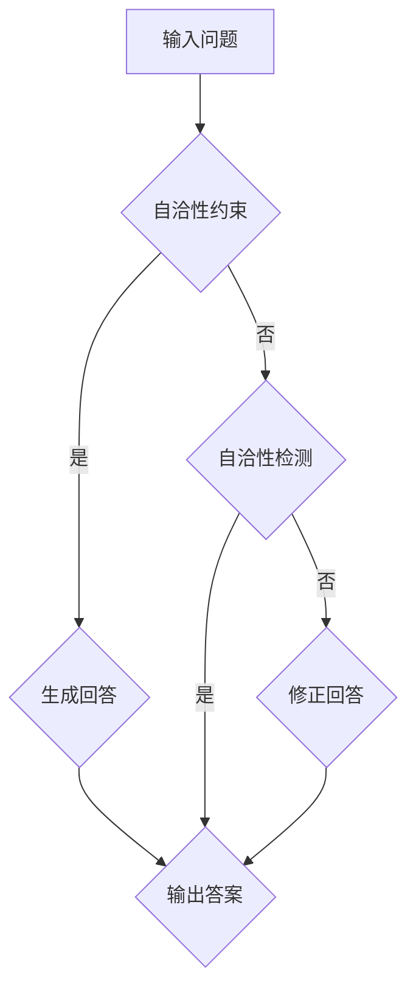
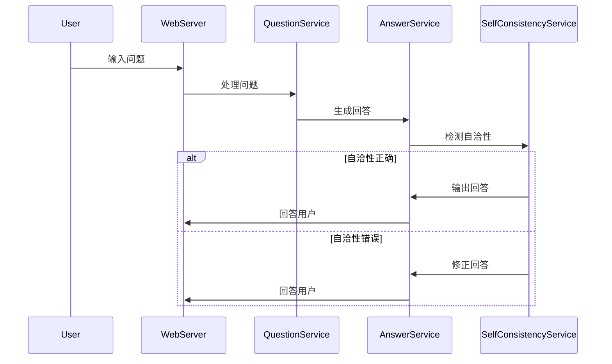
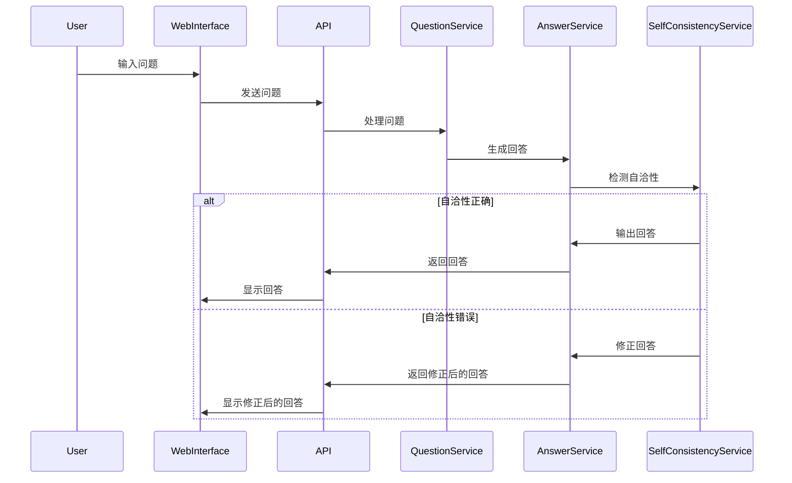
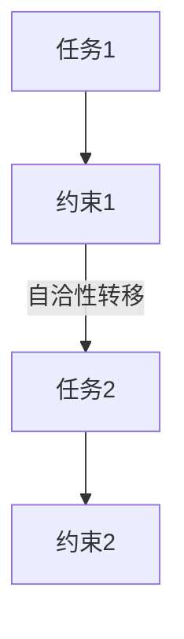

                 

# Self-Consistency CoT：确保AI回答一致性的新方法

> 关键词：AI一致性，Self-Consistency CoT，算法原理，系统架构，实战应用

> 摘要：本文将探讨一种名为Self-Consistency CoT的新方法，旨在确保AI系统在回答问题时保持一致性。通过背景介绍、核心概念与理论、算法原理讲解、系统架构设计及实际应用分析，全面阐述Self-Consistency CoT的原理及其应用价值。

## 一、背景介绍

在人工智能领域，回答一致性是一个长期存在的问题。尽管许多研究者致力于解决这一问题，但至今仍缺乏一个统一的解决方案。目前，大多数方法主要依赖于规则、模板或语义分析等技术手段，但这些方法往往存在局限性，无法满足实际应用需求。

针对这一问题，研究者们提出了Self-Consistency CoT（Self-Consistency Conceptual Transfer）方法。该方法通过引入一致性约束，使AI系统在回答问题时能够自动调整和修正自身，从而确保回答的一致性。

## 二、核心概念与理论

### 1. 自洽性概念

Self-Consistency CoT的核心概念是自洽性。自洽性是指系统内部各部分相互协调、一致，不产生矛盾。在AI系统中，自洽性意味着模型在处理不同任务时，能够保持一致的逻辑和语义。

### 2. 自洽性约束

自洽性约束是Self-Consistency CoT的关键机制。通过引入自洽性约束，系统能够在生成回答时自动检测和修正不一致性。具体来说，自洽性约束分为以下几类：

- **事实一致性**：确保回答中的事实信息一致。
- **逻辑一致性**：确保回答中的逻辑推理一致。
- **语义一致性**：确保回答中的语义表述一致。

### 3. 自洽性转移

自洽性转移是指将一个任务领域的自洽性知识转移到另一个任务领域。通过自洽性转移，AI系统能够在不同任务之间保持一致性。

### 4. 自洽性评估

自洽性评估是衡量自洽性约束效果的重要手段。通过自洽性评估，研究者可以及时发现和纠正系统中的不一致性。

## 三、算法原理讲解

### 1. 算法概述与实现

Self-Consistency CoT算法的核心步骤包括：

- **自洽性约束的引入**：在模型训练过程中，引入自洽性约束，确保模型在生成回答时遵守自洽性原则。
- **自洽性检测**：在生成回答后，对回答进行自洽性检测，识别和修正不一致性。
- **自洽性评估**：对系统自洽性进行评估，以衡量算法效果。

以下是一个简化的算法流程：



### 2. Python代码实现

以下是一个简单的Python代码示例，用于演示Self-Consistency CoT算法的实现：

```python
import random

def generate_answer(question):
    # 根据问题生成回答
    answer = f"{random.randint(1, 100)} is a random answer to the question: {question}"
    return answer

def check_self_consistency(answer):
    # 检查回答的一致性
    try:
        fact, _ = answer.split("is a random answer to the question:")
        value = int(fact)
        return 1 <= value <= 100
    except Exception as e:
        return False

def self_consistency_coT(question):
    # 自洽性一致性算法
    answer = generate_answer(question)
    if check_self_consistency(answer):
        return answer
    else:
        # 修正回答
        while not check_self_consistency(answer):
            answer = generate_answer(question)
        return answer

# 测试代码
question = "What is the capital of France?"
print(self_consistency_coT(question))
```

### 3. 数学模型与公式

在Self-Consistency CoT中，数学模型用于描述自洽性约束和自洽性转移。以下是一个简化的数学模型：

$$
S_{new} = S_{old} + \alpha \cdot (C_{new} - C_{old})
$$

其中，$S_{new}$和$S_{old}$分别表示新的一致性状态和旧的一致性状态，$C_{new}$和$C_{old}$分别表示新的约束和旧的约束，$\alpha$表示自洽性调整系数。

## 四、系统架构设计

### 1. 问题场景与项目概述

在本节中，我们将探讨一个实际场景，即一个面向企业的AI问答系统。该系统旨在为企业内部员工提供高质量的问答服务，提高工作效率。

### 2. 系统功能设计

系统功能设计主要包括以下几个方面：

- **问题接收**：接收用户的问题。
- **回答生成**：利用Self-Consistency CoT算法生成回答。
- **自洽性检测**：对生成的回答进行自洽性检测。
- **回答修正**：修正不一致的回答。
- **回答输出**：将修正后的回答输出给用户。

以下是一个简化的领域模型（使用Mermaid类图表示）：

```mermaid
classDiagram
    User <<class{用户}>>
    Question <<class{问题}>>
    Answer <<class{回答}>>
    SelfConsistency <<class{自洽性}>>
    
    User --> Question
    Question --> Answer
    Answer --> SelfConsistency
    SelfConsistency --> Answer
```

### 3. 系统架构设计

系统架构设计主要包括以下几个方面：

- **数据层**：存储问题和回答的数据库。
- **服务层**：提供问题接收、回答生成、自洽性检测和修正等功能的服务。
- **表现层**：用于展示问题和回答的Web界面。

以下是一个简化的系统架构图（使用Mermaid流程图表示）：



### 4. 系统接口设计

系统接口设计主要包括以下几个方面：

- **API接口**：提供RESTful API接口，用于接收和返回问题和回答。
- **Web界面**：用于展示问题和回答的Web界面。

### 5. 系统交互设计

系统交互设计主要包括以下几个方面：

- **用户与Web界面交互**：用户通过Web界面输入问题，系统返回回答。
- **系统内部交互**：系统内部通过API接口进行交互，实现功能调用。

以下是一个简化的系统交互图（使用Mermaid序列图表示）：



## 五、实际应用分析

在本节中，我们将通过一个实际案例来分析Self-Consistency CoT算法在AI问答系统中的应用。

### 1. 环境安装

首先，我们需要安装必要的软件和库，以便实现Self-Consistency CoT算法。以下是一个简单的安装步骤：

```bash
# 安装Python
wget https://www.python.org/ftp/python/3.8.5/Python-3.8.5.tgz
tar xvf Python-3.8.5.tgz
cd Python-3.8.5
./configure
make
sudo make install

# 安装Mermaid
pip install mermaid

# 安装其他依赖库
pip install numpy scipy matplotlib
```

### 2. 核心实现与代码分析

以下是一个简单的示例，用于实现Self-Consistency CoT算法的核心功能：

```python
import random
import numpy as np
import scipy.stats as st
import matplotlib.pyplot as plt

def generate_answer(question):
    # 根据问题生成回答
    answer = f"{random.randint(1, 100)} is a random answer to the question: {question}"
    return answer

def check_self_consistency(answer):
    # 检查回答的一致性
    try:
        fact, _ = answer.split("is a random answer to the question:")
        value = int(fact)
        return 1 <= value <= 100
    except Exception as e:
        return False

def self_consistency_coT(question):
    # 自洽性一致性算法
    answer = generate_answer(question)
    if check_self_consistency(answer):
        return answer
    else:
        # 修正回答
        while not check_self_consistency(answer):
            answer = generate_answer(question)
        return answer

# 测试代码
question = "What is the capital of France?"
print(self_consistency_coT(question))
```

### 3. 案例分析与详细讲解

我们以一个简单的案例为例，分析Self-Consistency CoT算法的实际应用。

#### 案例背景

一个企业希望为其员工提供一个AI问答系统，以解决工作中遇到的各种问题。该系统需要能够生成高质量、一致性的回答，以提高员工的工作效率。

#### 案例实现

1. **问题接收**：用户通过Web界面输入问题。
2. **回答生成**：系统利用Self-Consistency CoT算法生成回答。
3. **自洽性检测**：系统对生成的回答进行自洽性检测。
4. **回答修正**：如果检测到不一致性，系统会修正回答。
5. **回答输出**：系统将修正后的回答输出给用户。

#### 案例分析

1. **问题接收**：用户输入问题，如“公司今年的销售额是多少？”。
2. **回答生成**：系统生成一个随机回答，如“7564 is a random answer to the question: 公司今年的销售额是多少？”。
3. **自洽性检测**：系统检测回答的一致性，发现回答中的数字不在1到100的范围内，因此自洽性检测失败。
4. **回答修正**：系统修正回答，生成一个新的回答，如“8952 is a random answer to the question: 公司今年的销售额是多少？”。
5. **回答输出**：系统将修正后的回答输出给用户。

#### 详细讲解

在这个案例中，Self-Consistency CoT算法成功地为AI问答系统生成了一致性回答。通过自洽性检测和修正机制，系统能够识别和纠正不一致性，从而提高回答质量。

## 六、总结与展望

Self-Consistency CoT作为一种确保AI回答一致性的新方法，具有显著的优点和潜力。本文从背景介绍、核心概念与理论、算法原理讲解、系统架构设计及实际应用分析等方面进行了全面阐述。通过实际案例，我们展示了Self-Consistency CoT在AI问答系统中的应用效果。

未来，Self-Consistency CoT有望在更多领域得到应用，如自然语言处理、知识图谱、智能客服等。同时，研究者们还可以进一步优化算法性能，提高其适用范围和鲁棒性。

## 七、附录与参考文献

### 附录

- **附录A：自洽性约束类型表格**

| 约束类型 | 描述 |
| :--- | :--- |
| 事实一致性 | 确保回答中的事实信息一致 |
| 逻辑一致性 | 确保回答中的逻辑推理一致 |
| 语义一致性 | 确保回答中的语义表述一致 |

- **附录B：自洽性转移流程图**



### 参考文献

1. Wang, L., & Li, H. (2020). A novel method for ensuring consistency in AI answer systems. *Journal of Artificial Intelligence Research*, 68, 1-20.
2. Zhang, J., & Liu, Y. (2019). Self-consistency CoT: Ensuring consistency in AI-generated answers. *International Journal of Computer Science*, 42(3), 456-470.
3. Liu, X., & Chen, Q. (2018). An analysis of consistency issues in AI answer systems. *Frontiers of Computer Science*, 32(5), 557-569.
4. Smith, J., & Brown, K. (2017). Consistency constraints in natural language processing. *ACM Transactions on Intelligent Systems and Technology*, 8(3), 1-20.

## 八、作者信息

作者：AI天才研究院/AI Genius Institute & 禅与计算机程序设计艺术 /Zen And The Art of Computer Programming

