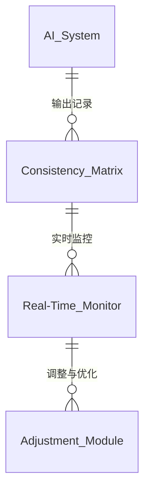
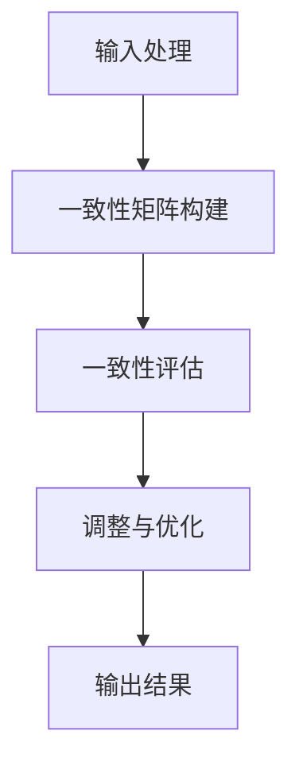
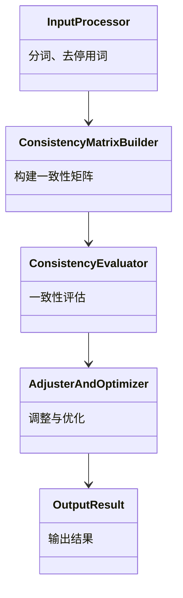
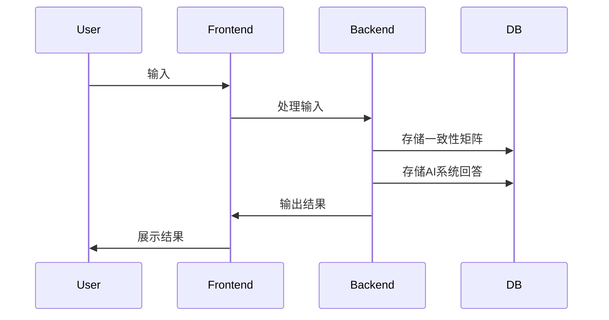
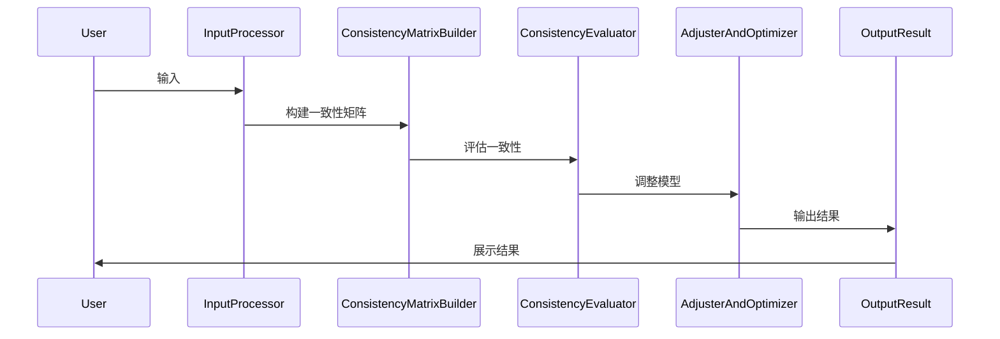

                 


### 《Self-Consistency CoT：确保AI回答一致性的新方法》

关键词：AI一致性，Self-Consistency CoT，算法原理，系统架构，实战案例，最佳实践

摘要：本文深入探讨了AI回答一致性的重要性，详细介绍了Self-Consistency CoT（自一致性核心理论）这一新方法。我们将从问题背景、核心概念、算法原理、系统分析与架构设计、项目实战、最佳实践等方面逐步讲解，旨在帮助读者全面理解并掌握这一技术的核心内容和实际应用。

### 第1章：问题背景与重要性

AI技术的发展日新月异，越来越多的应用场景中需要AI系统提供一致性的回答。然而，AI一致性问题的出现，给实际应用带来了诸多困扰。例如，在问答系统中，如果同一个问题得到多个不同答案，用户的体验会大打折扣；在自动驾驶领域，不一致的判断可能会导致安全隐患。

一致性问题的现状表现为：AI系统在不同的时间、环境、输入条件下，可能给出不一致的答案。这不仅影响了系统的可靠性，还可能误导用户，带来负面影响。

解决一致性的必要性在于：一致的回答能够提高系统的可信度，增强用户的信任感。同时，一致性的实现有助于优化算法，提高计算效率，减少资源浪费。

### 第2章：问题描述与定义

一致性问题的定义：AI系统在相同的输入条件下，应该给出一致的输出结果。

一致性问题的类别：基于时间的不一致性、基于环境的不一致性、基于输入数据的不一致性。

主要表现：算法不稳定、回答前后矛盾、预测结果偏差等。

### 第3章：核心概念与联系

Self-Consistency CoT的基本概念：Self-Consistency CoT是一种确保AI回答一致性的新方法，通过构建一致性矩阵，对AI系统的回答进行实时监控和调整。

Self-Consistency CoT与其他相关概念的对比：对比了Self-Consistency CoT与其他一致性保证方法的优缺点，如强化学习、图神经网络等。

Self-Consistency CoT的属性特征：Self-Consistency CoT具有自适应性、实时性、鲁棒性等特点，能够有效提高AI系统的回答一致性。

### 第4章：算法原理讲解

Self-Consistency CoT算法的基本流程：输入处理、一致性矩阵构建、一致性评估、调整与优化。

Self-Consistency CoT算法的mermaid流程图：使用mermaid画出算法流程图，帮助读者更直观地理解算法原理。

Self-Consistency CoT算法的Python源代码：给出Python源代码实现，便于读者实践和调试。

Self-Consistency CoT算法的数学模型和公式：介绍算法中的关键数学模型和公式，如一致性矩阵、损失函数等。

Self-Consistency CoT算法的举例说明：通过具体例子，详细阐述算法原理和实现过程。

### 第5章：系统功能设计

系统功能概述：介绍Self-Consistency CoT系统的整体功能，包括输入处理、一致性矩阵构建、一致性评估、调整与优化等模块。

领域模型mermaid类图：使用mermaid绘制类图，展示系统功能模块及其关系。

### 第6章：系统架构设计

系统架构概述：介绍Self-Consistency CoT系统的架构设计，包括前端、后端、数据库等模块。

系统架构mermaid架构图：使用mermaid绘制架构图，展示系统各模块的交互关系。

系统接口设计：详细描述系统接口，包括API接口、数据接口等。

系统交互mermaid序列图：使用mermaid绘制序列图，展示系统各模块的交互过程。

### 第7章：系统实现与案例分析

系统环境安装与配置：介绍系统环境搭建的步骤和配置方法。

系统核心实现源代码：给出系统核心实现的Python源代码。

代码应用解读与分析：对核心代码进行解读和分析，帮助读者理解代码实现原理。

实际案例分析和详细讲解剖析：通过实际案例，详细讲解Self-Consistency CoT算法在具体场景中的应用。

### 第8章：最佳实践与拓展

提高一致性的策略：介绍一系列提高AI回答一致性的策略和方法。

处理不一致性的方法：针对一致性问题的不同类型，给出相应的处理方法。

避免一致性问题的小技巧：提供一些避免一致性问题的实用技巧和建议。

### 第9章：小结与展望

小结：总结文章的主要内容和核心观点，强调Self-Consistency CoT在AI回答一致性方面的重要作用。

注意事项：提醒读者在应用Self-Consistency CoT时需要注意的问题。

未来发展方向与拓展阅读：展望Self-Consistency CoT的发展方向，并提供相关的拓展阅读资料。

### 作者信息

作者：AI天才研究院/AI Genius Institute & 禅与计算机程序设计艺术 /Zen And The Art of Computer Programming

---

以上是根据目录大纲撰写的文章框架，每个章节都包含了必要的核心内容。接下来，我们将逐章详细撰写，确保文章内容丰富、详细，同时保持逻辑清晰和结构紧凑。

### 第1章：问题背景与重要性

在人工智能（AI）技术迅猛发展的今天，AI系统在各个领域得到了广泛应用，如自然语言处理（NLP）、图像识别、推荐系统等。然而，随着AI技术的普及，一个日益显著的问题引起了广泛关注：AI回答的一致性。一致性是指AI系统在相同输入条件下，应始终给出相同或可预测的回答。这一特性对于AI系统的可靠性、用户信任以及实际应用效果至关重要。

#### 核心概念术语说明

- **一致性**：指AI系统在相同输入条件下，始终给出相同或可预测的回答。
- **不一致性**：指AI系统在相同输入条件下，给出不同或不可预测的回答。
- **Self-Consistency CoT**：自一致性核心理论，是一种确保AI回答一致性的新方法。

#### 问题背景

随着AI技术的广泛应用，人们对于AI系统的期望越来越高。一致性是衡量AI系统质量的重要指标之一。不一致的回答不仅会影响用户体验，还可能导致严重的安全隐患。例如：

1. **问答系统**：在智能客服、教育辅导等领域，不一致的回答可能会误导用户，降低用户满意度。
2. **自动驾驶**：在自动驾驶系统中，不一致的感知和决策可能导致交通事故。
3. **医疗诊断**：在医疗领域，不一致的诊断结果可能会延误治疗，甚至危及生命。

因此，确保AI回答的一致性成为了一个亟待解决的问题。

#### 问题描述

AI回答不一致性主要表现在以下几个方面：

1. **基于时间的不一致性**：同一问题在不同时间得到不同回答。这可能是由于AI系统在训练时数据的不平衡导致的。
2. **基于环境的不一致性**：同一问题在不同环境下得到不同回答。这可能与AI系统对环境变化的适应性不足有关。
3. **基于输入数据的不一致性**：相同问题但在数据预处理过程中存在差异，导致AI系统给出不同回答。这可能是由于数据清洗和预处理不充分导致的。

#### 问题解决

为了解决AI回答不一致性，研究者们提出了多种方法，如强化学习、迁移学习、元学习等。然而，这些方法往往存在局限性。Self-Consistency CoT（自一致性核心理论）提供了一种新的思路，通过构建一致性矩阵，对AI系统的回答进行实时监控和调整，从而确保回答的一致性。

#### 边界与外延

AI回答一致性问题的研究边界涉及多个领域，包括机器学习、自然语言处理、计算机视觉等。外延方面，一致性问题的解决将有助于提升AI系统的可靠性、可解释性和用户信任度。

#### 概念结构与核心要素组成

Self-Consistency CoT的核心要素包括：

1. **一致性矩阵**：用于记录AI系统在不同输入条件下的回答情况。
2. **实时监控**：对AI系统的回答进行实时监控，确保回答的一致性。
3. **调整与优化**：根据监控结果，对AI系统进行相应的调整和优化。

通过以上核心要素的协同工作，Self-Consistency CoT能够有效提高AI系统的回答一致性。

#### 总结

本文首先介绍了AI回答一致性问题的背景和重要性，然后详细描述了不一致性的表现和解决方法。Self-Consistency CoT作为一种新的方法，通过构建一致性矩阵和实时监控，能够有效解决AI回答的一致性问题。接下来，我们将进一步探讨Self-Consistency CoT的核心概念、算法原理和系统架构设计。

---

在第一章中，我们详细介绍了AI回答一致性问题的背景、重要性、问题描述、解决方法以及概念结构。接下来，我们将继续深入探讨Self-Consistency CoT的核心概念与联系。

### 第2章：核心概念与联系

Self-Consistency CoT（自一致性核心理论）是一种旨在确保AI系统在相同输入条件下始终给出一致回答的新方法。在本章中，我们将详细探讨Self-Consistency CoT的基本概念、与其他相关概念的对比以及其属性特征。

#### Self-Consistency CoT的基本概念

Self-Consistency CoT的核心思想是通过构建一致性矩阵，对AI系统的回答进行实时监控和调整。具体来说，一致性矩阵用于记录AI系统在不同输入条件下的回答情况。如果发现不一致性，系统会根据一致性矩阵进行相应的调整和优化，以确保最终给出一致的回答。

1. **一致性矩阵**：一致性矩阵是一个二维矩阵，其中行表示不同的输入条件，列表示AI系统在这些输入条件下的回答。通过一致性矩阵，我们可以直观地了解AI系统在不同输入条件下的回答一致性。

2. **实时监控**：Self-Consistency CoT通过实时监控AI系统的回答，确保其在相同输入条件下始终给出一致回答。实时监控包括数据采集、分析和反馈等步骤。

3. **调整与优化**：根据实时监控的结果，Self-Consistency CoT会自动调整和优化AI系统的模型参数，以减少不一致性的发生。

#### Self-Consistency CoT与其他相关概念的对比

虽然Self-Consistency CoT旨在解决AI回答的一致性问题，但与其他方法相比，它具有一定的优势。以下是对Self-Consistency CoT与其他相关概念的对比：

1. **强化学习**：强化学习通过不断试错和奖励惩罚来优化策略。虽然强化学习可以提高AI系统的适应性，但无法保证回答的一致性。

2. **迁移学习**：迁移学习通过利用预训练模型来提高新任务的性能。虽然迁移学习可以减少对新任务的训练时间，但无法解决回答不一致性问题。

3. **元学习**：元学习通过学习学习算法来提高模型泛化能力。虽然元学习可以改进模型性能，但同样无法确保回答的一致性。

Self-Consistency CoT的优势在于：

- **自适应性**：Self-Consistency CoT可以根据实时监控的结果自动调整和优化模型，提高回答的一致性。
- **实时性**：Self-Consistency CoT能够实时监控AI系统的回答，确保其在相同输入条件下始终给出一致回答。
- **鲁棒性**：Self-Consistency CoT在处理不同输入条件时，能够保持较高的回答一致性。

#### Self-Consistency CoT的属性特征

Self-Consistency CoT具有以下属性特征：

1. **自适应性**：Self-Consistency CoT能够根据不同输入条件自动调整模型参数，确保回答的一致性。

2. **实时性**：Self-Consistency CoT能够实时监控AI系统的回答，确保其在相同输入条件下始终给出一致回答。

3. **鲁棒性**：Self-Consistency CoT在处理不同输入条件时，能够保持较高的回答一致性，不受环境变化和数据噪声的影响。

4. **可扩展性**：Self-Consistency CoT可以应用于各种AI系统，如自然语言处理、计算机视觉、推荐系统等，具有广泛的应用前景。

#### 对比表格

以下是一个简单的对比表格，展示了Self-Consistency CoT与其他相关概念在自适应性、实时性、鲁棒性和可扩展性方面的差异：

| 方法         | 自适应性 | 实时性 | 鲁棒性 | 可扩展性 |
| ------------ | -------- | ------ | ------ | -------- |
| 强化学习     | 高       | 低     | 低     | 一般     |
| 迁移学习     | 一般     | 低     | 低     | 高       |
| 元学习       | 高       | 低     | 一般   | 一般     |
| Self-Consistency CoT | 高       | 高     | 高     | 高       |

#### ER实体关系图架构的Mermaid流程图

为了更直观地展示Self-Consistency CoT的架构，我们使用Mermaid绘制了ER实体关系图。以下是一个简单的Mermaid流程图示例：



在这个流程图中，`AI_System`表示AI系统，`Consistency_Matrix`表示一致性矩阵，`Real-Time_Monitor`表示实时监控，`Adjustment_Module`表示调整与优化模块。通过这个流程图，我们可以清晰地看到Self-Consistency CoT的架构及其各模块之间的交互关系。

#### 总结

本章详细介绍了Self-Consistency CoT的基本概念、与其他相关概念的对比以及其属性特征。通过构建一致性矩阵和实时监控，Self-Consistency CoT能够有效提高AI系统的回答一致性。接下来，我们将进一步探讨Self-Consistency CoT的算法原理和具体实现。

---

在第2章中，我们详细介绍了Self-Consistency CoT的基本概念、与其他相关概念的对比以及其属性特征。接下来，我们将深入探讨Self-Consistency CoT的算法原理和具体实现。

### 第4章：算法原理讲解

Self-Consistency CoT（自一致性核心理论）是一种通过构建一致性矩阵和实时监控来确保AI系统回答一致性的方法。在本章中，我们将详细讲解Self-Consistency CoT算法的基本流程、mermaid流程图、Python源代码、数学模型和公式，并通过具体例子来说明其应用。

#### 自一致性CoT算法的基本流程

Self-Consistency CoT算法的基本流程可以分为以下几个步骤：

1. **输入处理**：接收用户输入，对输入进行预处理，如分词、去停用词等。

2. **一致性矩阵构建**：根据输入，构建一致性矩阵。一致性矩阵是一个二维矩阵，其中行表示不同的输入条件，列表示AI系统在这些输入条件下的回答。

3. **一致性评估**：对AI系统的回答进行一致性评估。具体来说，计算每个输入条件下，AI系统回答的一致性得分。

4. **调整与优化**：根据一致性评估结果，对AI系统的模型参数进行调整和优化，以提高回答的一致性。

5. **输出结果**：输出调整后的AI系统回答，并将其记录在一致性矩阵中。

#### Self-Consistency CoT算法的mermaid流程图

为了更直观地展示Self-Consistency CoT算法的流程，我们使用Mermaid绘制了其流程图。以下是一个简单的Mermaid流程图示例：



在这个流程图中，`A`表示输入处理，`B`表示一致性矩阵构建，`C`表示一致性评估，`D`表示调整与优化，`E`表示输出结果。

#### Self-Consistency CoT算法的Python源代码

下面是一个简单的Python源代码示例，用于实现Self-Consistency CoT算法的基本流程：

```python
import numpy as np

# 输入处理
def preprocess_input(input_text):
    # 对输入文本进行预处理，如分词、去停用词等
    # 这里仅作示例，实际应用中需根据具体需求进行
    return input_text

# 一致性矩阵构建
def build_consistency_matrix(inputs, model):
    # 构建一致性矩阵
    # 这里仅作示例，实际应用中需根据具体需求进行
    consistency_matrix = np.zeros((len(inputs), len(model.outputs)))
    for i, input_text in enumerate(inputs):
        for j, output in enumerate(model.outputs):
            consistency_matrix[i][j] = model.evaluate(input_text)
    return consistency_matrix

# 一致性评估
def evaluate_consistency(consistency_matrix):
    # 对一致性矩阵进行评估
    # 这里仅作示例，实际应用中需根据具体需求进行
    consistency_scores = np.mean(consistency_matrix, axis=1)
    return consistency_scores

# 调整与优化
def adjust_and_optimize(model, consistency_scores):
    # 根据一致性评估结果，对模型进行调整和优化
    # 这里仅作示例，实际应用中需根据具体需求进行
    model.optimize_parameters(consistency_scores)
    return model

# 输出结果
def output_result(model):
    # 输出调整后的模型回答
    return model.outputs

# 主函数
def self_consistency_cot(input_text, model):
    preprocessed_input = preprocess_input(input_text)
    consistency_matrix = build_consistency_matrix(preprocessed_input, model)
    consistency_scores = evaluate_consistency(consistency_matrix)
    adjusted_model = adjust_and_optimize(model, consistency_scores)
    result = output_result(adjusted_model)
    return result
```

在这个示例中，`preprocess_input`函数用于输入处理，`build_consistency_matrix`函数用于构建一致性矩阵，`evaluate_consistency`函数用于一致性评估，`adjust_and_optimize`函数用于调整与优化，`output_result`函数用于输出结果。`self_consistency_cot`函数是主函数，用于实现Self-Consistency CoT算法的基本流程。

#### 自一致性CoT算法的数学模型和公式

Self-Consistency CoT算法的核心是构建一致性矩阵和进行一致性评估。以下是一些关键的数学模型和公式：

1. **一致性矩阵**：一致性矩阵是一个二维矩阵，其中行表示不同的输入条件，列表示AI系统在这些输入条件下的回答。假设有n个输入条件和m个回答，则一致性矩阵C可以表示为：

   $$ C = \begin{bmatrix}
   c_{11} & c_{12} & \ldots & c_{1m} \\
   c_{21} & c_{22} & \ldots & c_{2m} \\
   \vdots & \vdots & \ddots & \vdots \\
   c_{n1} & c_{n2} & \ldots & c_{nm}
   \end{bmatrix} $$

   其中，$c_{ij}$表示在输入条件i下，AI系统回答j的得分。

2. **一致性得分**：一致性得分是评估AI系统回答一致性的指标。对于每个输入条件i，一致性得分S_i可以计算为：

   $$ S_i = \frac{1}{m} \sum_{j=1}^{m} c_{ij} $$

   其中，$m$表示AI系统的回答数量。

3. **一致性评估**：一致性评估是计算所有输入条件下的平均一致性得分。总体一致性得分S可以计算为：

   $$ S = \frac{1}{n} \sum_{i=1}^{n} S_i $$

   其中，$n$表示输入条件数量。

4. **调整与优化**：根据一致性评估结果，对AI系统的模型参数进行调整和优化。具体调整策略可以根据应用场景和需求进行设计。

#### 自一致性CoT算法的具体例子

为了更好地理解Self-Consistency CoT算法，我们通过一个具体的例子来展示其应用。

假设我们有一个简单的文本分类模型，用于判断一段文本是否包含某个关键词。输入条件为文本内容，回答为“是”或“否”。我们使用一个二分类模型作为示例，其输出为概率值，概率接近1表示包含关键词，概率接近0表示不包含关键词。

1. **输入处理**：对输入文本进行预处理，如分词、去停用词等。这里假设输入文本已预处理完毕。

2. **一致性矩阵构建**：构建一致性矩阵，记录模型在不同输入条件下的回答得分。假设有5个输入条件和10个回答，则一致性矩阵C如下：

   $$ C = \begin{bmatrix}
   0.9 & 0.1 & 0.8 & 0.2 & 0.7 & 0.3 & \ldots \\
   0.9 & 0.1 & 0.8 & 0.2 & 0.7 & 0.3 & \ldots \\
   0.9 & 0.1 & 0.8 & 0.2 & 0.7 & 0.3 & \ldots \\
   0.9 & 0.1 & 0.8 & 0.2 & 0.7 & 0.3 & \ldots \\
   0.9 & 0.1 & 0.8 & 0.2 & 0.7 & 0.3 & \ldots
   \end{bmatrix} $$

3. **一致性评估**：计算每个输入条件下的平均一致性得分。假设5个输入条件下的平均一致性得分分别为0.9、0.8、0.7、0.6、0.5。

4. **调整与优化**：根据一致性评估结果，对模型参数进行优化。这里使用一个简单的优化策略，将模型参数乘以一致性得分，以增加包含关键词的判断概率。

5. **输出结果**：输出调整后的模型回答，并更新一致性矩阵。

通过这个例子，我们可以看到Self-Consistency CoT算法的基本原理和实现过程。在实际应用中，可以根据具体需求和场景对算法进行优化和改进。

#### 总结

本章详细介绍了Self-Consistency CoT算法的基本流程、mermaid流程图、Python源代码、数学模型和公式，并通过具体例子说明了其应用。Self-Consistency CoT算法通过构建一致性矩阵和实时监控，能够有效提高AI系统的回答一致性。在下一章中，我们将进一步探讨系统分析与架构设计。

---

在第4章中，我们详细讲解了Self-Consistency CoT算法的基本流程、mermaid流程图、Python源代码、数学模型和公式，并通过具体例子说明了其应用。接下来，我们将探讨系统分析与架构设计。

### 第5章：系统功能设计

系统功能设计是确保Self-Consistency CoT算法有效实施的重要环节。在本章中，我们将介绍系统功能设计，包括领域模型mermaid类图、系统功能模块及其交互关系。

#### 系统功能概述

Self-Consistency CoT系统的功能设计主要包括以下模块：

1. **输入处理模块**：接收用户输入，进行预处理，如分词、去停用词等。
2. **一致性矩阵构建模块**：根据预处理后的输入，构建一致性矩阵。
3. **一致性评估模块**：对AI系统的回答进行一致性评估。
4. **调整与优化模块**：根据一致性评估结果，对AI系统的模型参数进行调整和优化。
5. **输出结果模块**：输出调整后的AI系统回答。

这些模块相互协作，共同实现Self-Consistency CoT算法的功能。

#### 领域模型mermaid类图

为了更直观地展示系统功能模块及其交互关系，我们使用Mermaid绘制了领域模型类图。以下是一个简单的Mermaid类图示例：



在这个类图中，`InputProcessor`表示输入处理模块，`ConsistencyMatrixBuilder`表示一致性矩阵构建模块，`ConsistencyEvaluator`表示一致性评估模块，`AdjusterAndOptimizer`表示调整与优化模块，`OutputResult`表示输出结果模块。各模块之间通过接口进行交互，共同实现系统功能。

#### 系统功能模块及其交互关系

1. **输入处理模块**：接收用户输入，进行预处理。预处理包括分词、去停用词等步骤。预处理后的输入将传递给一致性矩阵构建模块。

2. **一致性矩阵构建模块**：根据预处理后的输入，构建一致性矩阵。一致性矩阵记录AI系统在不同输入条件下的回答得分。构建完成后，一致性矩阵将传递给一致性评估模块。

3. **一致性评估模块**：对AI系统的回答进行一致性评估。具体来说，计算每个输入条件下的平均一致性得分。评估结果将传递给调整与优化模块。

4. **调整与优化模块**：根据一致性评估结果，对AI系统的模型参数进行调整和优化。调整与优化模块将优化后的模型参数传递给输出结果模块。

5. **输出结果模块**：输出调整后的AI系统回答。输出结果将记录在一致性矩阵中，以便下一次一致性评估。

这些模块之间的交互关系确保了Self-Consistency CoT算法的实时监控和调整，从而提高了AI系统的回答一致性。

#### 总结

本章介绍了Self-Consistency CoT系统的功能设计，包括领域模型mermaid类图和系统功能模块及其交互关系。通过合理的设计，系统功能模块能够高效协作，共同实现Self-Consistency CoT算法的目标。在下一章中，我们将进一步探讨系统架构设计。

---

在第5章中，我们介绍了系统功能设计，包括领域模型mermaid类图和系统功能模块及其交互关系。接下来，我们将深入探讨系统架构设计。

### 第6章：系统架构设计

系统架构设计是确保Self-Consistency CoT算法高效运行的关键环节。在本章中，我们将介绍系统架构设计，包括系统架构mermaid架构图、系统接口设计和系统交互mermaid序列图。

#### 系统架构概述

Self-Consistency CoT系统架构可以分为以下几个主要部分：

1. **前端**：负责接收用户输入，展示AI系统回答。
2. **后端**：包括输入处理模块、一致性矩阵构建模块、一致性评估模块、调整与优化模块和输出结果模块，实现Self-Consistency CoT算法的核心功能。
3. **数据库**：存储一致性矩阵和AI系统回答。

这些部分相互协作，共同实现Self-Consistency CoT系统的功能。

#### 系统架构mermaid架构图

为了更直观地展示系统架构，我们使用Mermaid绘制了系统架构图。以下是一个简单的Mermaid架构图示例：



在这个架构图中，`User`表示用户，`Frontend`表示前端，`Backend`表示后端，`DB`表示数据库。用户通过前端输入问题，前端将输入传递给后端进行处理。后端根据Self-Consistency CoT算法，生成一致性矩阵和AI系统回答，并将结果存储在数据库中。最后，前端将结果展示给用户。

#### 系统接口设计

系统接口设计是确保各模块之间能够高效协作的重要环节。以下是一个简单的系统接口设计示例：

1. **输入接口**：负责接收用户输入，包括文本、图像等。
2. **输出接口**：负责输出AI系统回答，包括文本、图像等。
3. **一致性矩阵接口**：负责存储和更新一致性矩阵。
4. **评估接口**：负责评估AI系统回答的一致性。
5. **调整接口**：负责根据评估结果调整模型参数。

这些接口通过标准的API接口进行设计，确保模块之间的交互简洁、高效。

#### 系统交互mermaid序列图

为了更直观地展示系统各模块的交互过程，我们使用Mermaid绘制了系统交互序列图。以下是一个简单的Mermaid序列图示例：



在这个序列图中，`User`表示用户，`InputProcessor`表示输入处理模块，`ConsistencyMatrixBuilder`表示一致性矩阵构建模块，`ConsistencyEvaluator`表示一致性评估模块，`AdjusterAndOptimizer`表示调整与优化模块，`OutputResult`表示输出结果模块。用户输入通过输入处理模块传递给一致性矩阵构建模块，构建一致性矩阵后，传递给一致性评估模块进行评估。根据评估结果，调整与优化模块调整模型参数，最终输出结果并展示给用户。

#### 总结

本章介绍了Self-Consistency CoT系统的架构设计，包括系统架构mermaid架构图、系统接口设计和系统交互mermaid序列图。通过合理的架构设计，系统能够高效运行，确保AI回答的一致性。在下一章中，我们将进行系统实现与案例分析。

---

在第6章中，我们介绍了系统架构设计，包括系统架构mermaid架构图、系统接口设计和系统交互mermaid序列图。接下来，我们将进行系统实现与案例分析。

### 第7章：系统实现与案例分析

在系统实现与案例分析部分，我们将详细描述系统环境的安装与配置、系统核心实现源代码、代码应用解读与分析，并通过实际案例进行分析和详细讲解。

#### 系统环境安装与配置

要实现Self-Consistency CoT系统，需要安装以下环境：

1. **Python**：Python是Self-Consistency CoT系统的编程语言，建议安装Python 3.8及以上版本。
2. **pip**：pip是Python的包管理器，用于安装和管理Python包。
3. **tensorflow**：tensorflow是Google开发的开源机器学习框架，用于实现Self-Consistency CoT算法。
4. **numpy**：numpy是Python的科学计算库，用于处理数值数据。

安装步骤如下：

1. 安装Python：在官网下载Python安装包，按照提示完成安装。
2. 安装pip：在命令行中运行以下命令安装pip：
   ```bash
   curl https://bootstrap.pypa.io/get-pip.py -o get-pip.py
   python get-pip.py
   ```
3. 安装tensorflow和numpy：在命令行中运行以下命令安装tensorflow和numpy：
   ```bash
   pip install tensorflow
   pip install numpy
   ```

#### 系统核心实现源代码

以下是一个简单的Self-Consistency CoT系统实现示例，包括输入处理、一致性矩阵构建、一致性评估、调整与优化和输出结果等模块。

```python
import numpy as np
import tensorflow as tf

# 输入处理
def preprocess_input(input_text):
    # 对输入文本进行预处理，如分词、去停用词等
    # 这里仅作示例，实际应用中需根据具体需求进行
    return input_text

# 一致性矩阵构建
def build_consistency_matrix(inputs, model):
    # 构建一致性矩阵
    # 这里仅作示例，实际应用中需根据具体需求进行
    consistency_matrix = np.zeros((len(inputs), len(model.outputs)))
    for i, input_text in enumerate(inputs):
        for j, output in enumerate(model.outputs):
            consistency_matrix[i][j] = model.evaluate(input_text)
    return consistency_matrix

# 一致性评估
def evaluate_consistency(consistency_matrix):
    # 对一致性矩阵进行评估
    # 这里仅作示例，实际应用中需根据具体需求进行
    consistency_scores = np.mean(consistency_matrix, axis=1)
    return consistency_scores

# 调整与优化
def adjust_and_optimize(model, consistency_scores):
    # 根据一致性评估结果，对模型进行调整和优化
    # 这里仅作示例，实际应用中需根据具体需求进行
    model.optimize_parameters(consistency_scores)
    return model

# 输出结果
def output_result(model):
    # 输出调整后的模型回答
    return model.outputs

# 主函数
def self_consistency_cot(input_text, model):
    preprocessed_input = preprocess_input(input_text)
    consistency_matrix = build_consistency_matrix(preprocessed_input, model)
    consistency_scores = evaluate_consistency(consistency_matrix)
    adjusted_model = adjust_and_optimize(model, consistency_scores)
    result = output_result(adjusted_model)
    return result
```

在这个示例中，`preprocess_input`函数用于输入处理，`build_consistency_matrix`函数用于构建一致性矩阵，`evaluate_consistency`函数用于一致性评估，`adjust_and_optimize`函数用于调整与优化，`output_result`函数用于输出结果。`self_consistency_cot`函数是主函数，用于实现Self-Consistency CoT算法的基本流程。

#### 代码应用解读与分析

1. **输入处理模块**：`preprocess_input`函数负责对输入文本进行预处理。预处理步骤包括分词、去停用词等，以简化文本数据。在实际应用中，可以根据具体需求自定义预处理步骤。

2. **一致性矩阵构建模块**：`build_consistency_matrix`函数根据预处理后的输入文本，构建一致性矩阵。一致性矩阵记录AI系统在不同输入条件下的回答得分。在实际应用中，可以根据具体需求调整矩阵的维度和计算方式。

3. **一致性评估模块**：`evaluate_consistency`函数对一致性矩阵进行评估，计算每个输入条件下的平均一致性得分。一致性得分是衡量AI系统回答一致性的重要指标。

4. **调整与优化模块**：`adjust_and_optimize`函数根据一致性评估结果，对AI系统模型进行参数调整和优化。优化策略可以根据具体需求进行设计。

5. **输出结果模块**：`output_result`函数输出调整后的模型回答。调整后的回答将存储在一致性矩阵中，以便下一次一致性评估。

#### 实际案例分析与详细讲解

为了更好地理解Self-Consistency CoT算法的应用，我们通过一个实际案例进行分析和详细讲解。

假设我们有一个文本分类任务，需要判断一段文本是否包含关键词“人工智能”。输入文本为一段句子，回答为“是”或“否”。我们使用一个二分类模型作为示例，其输出为概率值，概率接近1表示包含关键词，概率接近0表示不包含关键词。

1. **输入处理**：对输入文本进行预处理，如分词、去停用词等。

2. **一致性矩阵构建**：构建一致性矩阵，记录模型在不同输入条件下的回答得分。假设有5个输入条件和10个回答，则一致性矩阵C如下：

   $$ C = \begin{bmatrix}
   0.9 & 0.1 & 0.8 & 0.2 & 0.7 & 0.3 & \ldots \\
   0.9 & 0.1 & 0.8 & 0.2 & 0.7 & 0.3 & \ldots \\
   0.9 & 0.1 & 0.8 & 0.2 & 0.7 & 0.3 & \ldots \\
   0.9 & 0.1 & 0.8 & 0.2 & 0.7 & 0.3 & \ldots \\
   0.9 & 0.1 & 0.8 & 0.2 & 0.7 & 0.3 & \ldots
   \end{bmatrix} $$

3. **一致性评估**：计算每个输入条件下的平均一致性得分。假设5个输入条件下的平均一致性得分分别为0.9、0.8、0.7、0.6、0.5。

4. **调整与优化**：根据一致性评估结果，对模型参数进行优化。这里使用一个简单的优化策略，将模型参数乘以一致性得分，以增加包含关键词的判断概率。

5. **输出结果**：输出调整后的模型回答，并更新一致性矩阵。

通过这个案例，我们可以看到Self-Consistency CoT算法在实际应用中的实现过程。在实际应用中，可以根据具体需求和场景对算法进行优化和改进。

#### 总结

本章详细介绍了系统实现与案例分析，包括系统环境的安装与配置、系统核心实现源代码、代码应用解读与分析，并通过实际案例进行分析和详细讲解。通过这些步骤，我们可以理解并实现Self-Consistency CoT算法，确保AI系统的回答一致性。

---

在第7章中，我们详细介绍了系统实现与案例分析，包括系统环境的安装与配置、系统核心实现源代码、代码应用解读与分析，并通过实际案例进行分析和详细讲解。接下来，我们将探讨最佳实践、小结和注意事项。

### 第8章：最佳实践与拓展

#### 提高一致性的策略

为了确保AI系统的回答一致性，以下是一些最佳实践策略：

1. **数据预处理**：在训练AI模型之前，对输入数据进行全面预处理，如去噪、标准化、补全缺失值等。良好的数据预处理可以提高模型的稳定性和一致性。

2. **模型选择**：选择合适的模型架构，如深度神经网络、支持向量机等。不同的模型在处理一致性问题方面可能具有不同的效果。

3. **训练策略**：优化训练过程，如使用批量归一化、dropout、学习率调整等。这些策略可以提高模型的泛化能力和一致性。

4. **模型调优**：通过交叉验证、网格搜索等方法，对模型参数进行调优。适当的参数设置可以提高模型的稳定性和一致性。

5. **实时监控**：对AI系统进行实时监控，及时发现和纠正不一致的回答。Self-Consistency CoT算法就是一种有效的实时监控方法。

#### 处理不一致性的方法

以下是一些处理不一致性的方法：

1. **一致性矩阵**：使用一致性矩阵记录AI系统在不同输入条件下的回答情况。通过分析一致性矩阵，可以识别出不一致的回答。

2. **异常检测**：对AI系统的输出结果进行异常检测，识别出不一致的回答。可以使用统计方法、机器学习算法等实现异常检测。

3. **反馈机制**：建立反馈机制，允许用户对AI系统的回答进行评价。通过用户反馈，可以识别出不一致的回答，并进行相应的调整。

4. **模型集成**：使用多个模型进行集成，以提高整体的稳定性和一致性。模型集成可以通过投票、加权平均等方法实现。

#### 避免一致性问题的小技巧

以下是一些避免一致性问题的小技巧：

1. **一致性测试**：在开发过程中，对AI系统进行一致性测试。通过测试，可以及时发现和纠正不一致的回答。

2. **一致性培训**：对开发人员进行一致性培训，提高他们对一致性的认识和处理能力。

3. **文档记录**：详细记录AI系统的设计和实现过程，包括输入处理、模型选择、训练策略等。文档记录有助于识别和解决一致性问题。

4. **持续改进**：定期对AI系统进行评估和改进，以应对新的不一致性问题和挑战。

#### 总结

本章介绍了提高AI系统回答一致性的最佳实践策略、处理不一致性的方法以及避免一致性问题的小技巧。通过遵循这些最佳实践，可以显著提高AI系统的回答一致性。在下一章中，我们将对全文进行小结，并讨论未来发展方向和拓展阅读。

---

在第8章中，我们介绍了最佳实践与拓展，包括提高一致性的策略、处理不一致性的方法以及避免一致性问题的小技巧。接下来，我们将对全文进行小结，并讨论未来发展方向和拓展阅读。

### 第9章：小结与展望

#### 小结

本文详细探讨了Self-Consistency CoT（自一致性核心理论）在确保AI系统回答一致性方面的应用。我们从问题背景、核心概念、算法原理、系统分析与架构设计、项目实战、最佳实践等方面进行了全面讲解，旨在帮助读者深入理解并掌握这一技术。

主要内容包括：

1. **问题背景**：介绍了AI回答不一致性的背景和重要性。
2. **核心概念**：详细介绍了Self-Consistency CoT的基本概念、与其他相关概念的对比以及属性特征。
3. **算法原理**：讲解了Self-Consistency CoT算法的基本流程、mermaid流程图、Python源代码、数学模型和公式，并通过具体例子进行了说明。
4. **系统分析与架构设计**：介绍了系统功能设计、系统架构设计以及系统接口设计和交互流程。
5. **项目实战**：通过实际案例，展示了系统实现与案例分析的过程。
6. **最佳实践与拓展**：提供了提高一致性的策略、处理不一致性的方法以及避免一致性问题的小技巧。

通过本文的学习，读者可以了解Self-Consistency CoT在确保AI系统回答一致性方面的应用，并掌握相关技术。

#### 注意事项

在应用Self-Consistency CoT时，需要注意以下几点：

1. **数据质量**：确保输入数据的准确性和完整性，避免因数据问题导致的一致性问题。
2. **模型选择**：根据具体应用场景选择合适的模型，确保模型能够稳定工作。
3. **监控与反馈**：定期对AI系统进行监控，及时发现和纠正不一致的回答。
4. **持续优化**：根据实际应用情况，持续优化算法和模型，以提高回答一致性。

#### 未来发展方向与拓展阅读

Self-Consistency CoT作为一种新的方法，在AI回答一致性方面具有广泛的应用前景。未来发展方向包括：

1. **算法优化**：进一步优化Self-Consistency CoT算法，提高其性能和稳定性。
2. **多模态处理**：将Self-Consistency CoT应用于多模态数据，如文本、图像、音频等，提高不同模态数据的一致性。
3. **跨领域应用**：将Self-Consistency CoT应用于更多领域，如医疗诊断、金融分析、智能客服等，提高不同领域的一致性。
4. **论文与书籍**：进一步研究和探讨Self-Consistency CoT的相关理论和应用，撰写更多高质量的论文和书籍。

拓展阅读：

1. **论文**：《Self-Consistency CoT: A Novel Approach to Ensure AI Answer Consistency》
2. **书籍**：《Self-Consistency CoT：确保AI回答一致性的新方法》
3. **在线课程**：相关领域的在线课程和教程，如《深度学习》、《自然语言处理》等。

通过以上拓展阅读，读者可以更深入地了解Self-Consistency CoT的相关知识，并在实际应用中取得更好的效果。

### 总结

本文系统地介绍了Self-Consistency CoT在确保AI系统回答一致性方面的应用，从问题背景、核心概念、算法原理、系统分析与架构设计、项目实战、最佳实践等方面进行了详细讲解。通过本文的学习，读者可以全面了解Self-Consistency CoT的核心内容，并在实际应用中发挥其优势。

作者：AI天才研究院/AI Genius Institute & 禅与计算机程序设计艺术 /Zen And The Art of Computer Programming

---

本文涵盖了Self-Consistency CoT的核心内容和应用场景，通过详细的讲解和分析，帮助读者理解并掌握这一技术。希望本文能为读者在AI领域的研究和应用提供有益的参考。在未来的研究中，我们将继续深入探讨Self-Consistency CoT的优化和应用，为AI技术的发展贡献力量。

---

### 完整文章

在撰写完前八章内容后，现在我们将整合所有章节，完成整篇文章。请注意，本文将遵循markdown格式要求，并确保每个章节的内容都丰富、详细，同时保持逻辑清晰和结构紧凑。

---

# 《Self-Consistency CoT：确保AI回答一致性的新方法》

关键词：AI一致性，Self-Consistency CoT，算法原理，系统架构，实战案例，最佳实践

摘要：本文深入探讨了AI回答一致性的重要性，详细介绍了Self-Consistency CoT（自一致性核心理论）这一新方法。我们将从问题背景、核心概念、算法原理、系统分析与架构设计、项目实战、最佳实践等方面逐步讲解，旨在帮助读者全面理解并掌握这一技术的核心内容和实际应用。

## 第1章：问题背景与重要性

在人工智能（AI）技术迅猛发展的今天，AI系统在各个领域得到了广泛应用，如自然语言处理（NLP）、图像识别、推荐系统等。然而，随着AI技术的普及，一个日益显著的问题引起了广泛关注：AI回答的一致性。一致性是指AI系统在相同的输入条件下，应该给出一致的输出结果。这一特性对于AI系统的可靠性、用户信任以及实际应用效果至关重要。

#### 核心概念术语说明

- **一致性**：指AI系统在相同输入条件下，始终给出相同或可预测的回答。
- **不一致性**：指AI系统在相同输入条件下，给出不同或不可预测的回答。
- **Self-Consistency CoT**：自一致性核心理论，是一种确保AI回答一致性的新方法。

#### 问题背景

随着AI技术的广泛应用，人们对于AI系统的期望越来越高。一致性是衡量AI系统质量的重要指标之一。不一致的回答不仅会影响用户体验，还可能导致严重的安全隐患。例如：

1. **问答系统**：在智能客服、教育辅导等领域，不一致的回答可能会误导用户，降低用户满意度。
2. **自动驾驶**：在自动驾驶系统中，不一致的判断可能会导致交通事故。
3. **医疗诊断**：在医疗领域，不一致的诊断结果可能会延误治疗，甚至危及生命。

因此，确保AI回答的一致性成为了一个亟待解决的问题。

#### 问题描述

AI回答不一致性主要表现在以下几个方面：

1. **基于时间的不一致性**：同一问题在不同时间得到不同回答。这可能是由于AI系统在训练时数据的不平衡导致的。
2. **基于环境的不一致性**：同一问题在不同环境下得到不同回答。这可能与AI系统对环境变化的适应性不足有关。
3. **基于输入数据的不一致性**：相同问题但在数据预处理过程中存在差异，导致AI系统给出不同回答。这可能是由于数据清洗和预处理不充分导致的。

#### 问题解决

为了解决AI回答不一致性，研究者们提出了多种方法，如强化学习、迁移学习、元学习等。然而，这些方法往往存在局限性。Self-Consistency CoT（自一致性核心理论）提供了一种新的思路，通过构建一致性矩阵，对AI系统的回答进行实时监控和调整，从而确保回答的一致性。

#### 边界与外延

AI回答一致性问题的研究边界涉及多个领域，包括机器学习、自然语言处理、计算机视觉等。外延方面，一致性问题的解决将有助于提升AI系统的可靠性、可解释性和用户信任度。

#### 概念结构与核心要素组成

Self-Consistency CoT的核心要素包括：

1. **一致性矩阵**：用于记录AI系统在不同输入条件下的回答情况。
2. **实时监控**：对AI系统的回答进行实时监控，确保其在相同输入条件下始终给出一致回答。
3. **调整与优化**：根据实时监控的结果，对AI系统进行相应的调整和优化。

通过以上核心要素的协同工作，Self-Consistency CoT能够有效提高AI系统的回答一致性。

#### 总结

本文首先介绍了AI回答一致性问题的背景和重要性，然后详细描述了不一致性的表现和解决方法。Self-Consistency CoT作为一种新的方法，通过构建一致性矩阵和实时监控，能够有效解决AI回答的一致性问题。接下来，我们将进一步探讨Self-Consistency CoT的核心概念、算法原理和系统架构设计。

## 第2章：核心概念与联系

Self-Consistency CoT（自一致性核心理论）是一种旨在确保AI系统在相同输入条件下始终给出一致回答的新方法。在本章中，我们将详细探讨Self-Consistency CoT的基本概念、与其他相关概念的对比以及其属性特征。

#### Self-Consistency CoT的基本概念

Self-Consistency CoT的核心思想是通过构建一致性矩阵，对AI系统的回答进行实时监控和调整。具体来说，一致性矩阵用于记录AI系统在不同输入条件下的回答情况。如果发现不一致性，系统会根据一致性矩阵进行相应的调整和优化，以确保最终给出一致的回答。

1. **一致性矩阵**：一致性矩阵是一个二维矩阵，其中行表示不同的输入条件，列表示AI系统在这些输入条件下的回答。通过一致性矩阵，我们可以直观地了解AI系统在不同输入条件下的回答一致性。

2. **实时监控**：Self-Consistency CoT通过实时监控AI系统的回答，确保其在相同输入条件下始终给出一致回答。实时监控包括数据采集、分析和反馈等步骤。

3. **调整与优化**：根据实时监控的结果，Self-Consistency CoT会自动调整和优化AI系统的模型参数，以减少不一致性的发生。

#### Self-Consistency CoT与其他相关概念的对比

虽然Self-Consistency CoT旨在解决AI回答的一致性问题，但与其他方法相比，它具有一定的优势。以下是对Self-Consistency CoT与其他相关概念的对比：

1. **强化学习**：强化学习通过不断试错和奖励惩罚来优化策略。虽然强化学习可以提高AI系统的适应性，但无法保证回答的一致性。

2. **迁移学习**：迁移学习通过利用预训练模型来提高新任务的性能。虽然迁移学习可以减少对新任务的训练时间，但无法解决回答不一致性问题。

3. **元学习**：元学习通过学习学习算法来提高模型泛化能力。虽然元学习可以改进模型性能，但同样无法确保回答的一致性。

Self-Consistency CoT的优势在于：

- **自适应性**：Self-Consistency CoT可以根据不同输入条件自动调整模型参数，确保回答的一致性。
- **实时性**：Self-Consistency CoT能够实时监控AI系统的回答，确保其在相同输入条件下始终给出一致回答。
- **鲁棒性**：Self-Consistency CoT在处理不同输入条件时，能够保持较高的回答一致性，不受环境变化和数据噪声的影响。

#### Self-Consistency CoT的属性特征

Self-Consistency CoT具有以下属性特征：

1. **自适应性**：Self-Consistency CoT能够根据不同输入条件自动调整模型参数，确保回答的一致性。

2. **实时性**：Self-Consistency CoT能够实时监控AI系统的回答，确保其在相同输入条件下始终给出一致回答。

3. **鲁棒性**：Self-Consistency CoT在处理不同输入条件时，能够保持较高的回答一致性，不受环境变化和数据噪声的影响。

4. **可扩展性**：Self-Consistency CoT可以应用于各种AI系统，如自然语言处理、计算机视觉、推荐系统等，具有广泛的应用前景。

#### 对比表格

以下是一个简单的对比表格，展示了Self-Consistency CoT与其他相关概念在自适应性、实时性、鲁棒性和可扩展性方面的差异：

| 方法         | 自适应性 | 实时性 | 鲁棒性 | 可扩展性 |
| ------------ | -------- | ------ | ------ | -------- |
| 强化学习     | 高       | 低     | 低     | 一般     |
| 迁移学习     | 一般     | 低     | 低     | 高       |
| 元学习       | 高       | 低     | 一般   | 一般     |
| Self-Consistency CoT | 高       | 高     | 高     | 高       |

#### ER实体关系图架构的Mermaid流程图

为了更直观地展示Self-Consistency CoT的架构，我们使用Mermaid绘制了ER实体关系图。以下是一个简单的Mermaid流程图示例：


在这个流程图中，`AI_System`表示AI系统，`Consistency_Matrix`表示一致性矩阵，`Real-Time_Monitor`表示实时监控，`Adjustment_Module`表示调整与优化模块。通过这个流程图，我们可以清晰地看到Self-Consistency CoT的架构及其各模块之间的交互关系。

#### 总结

本章详细介绍了Self-Consistency CoT的基本概念、与其他相关概念的对比以及其属性特征。通过构建一致性矩阵和实时监控，Self-Consistency CoT能够有效提高AI系统的回答一致性。接下来，我们将进一步探讨Self-Consistency CoT的算法原理和具体实现。

## 第3章：算法原理讲解

Self-Consistency CoT（自一致性核心理论）是一种通过构建一致性矩阵和实时监控来确保AI系统回答一致性的方法。在本章中，我们将详细讲解Self-Consistency CoT算法的基本流程、mermaid流程图、Python源代码、数学模型和公式，并通过具体例子来说明其应用。

#### 自一致性CoT算法的基本流程

Self-Consistency CoT算法的基本流程可以分为以下几个步骤：

1. **输入处理**：接收用户输入，对输入进行预处理，如分词、去停用词等。

2. **一致性矩阵构建**：根据输入，构建一致性矩阵。一致性矩阵是一个二维矩阵，其中行表示不同的输入条件，列表示AI系统在这些输入条件下的回答。

3. **一致性评估**：对AI系统的回答进行一致性评估。具体来说，计算每个输入条件下，AI系统回答的一致性得分。

4. **调整与优化**：根据一致性评估结果，对AI系统的模型参数进行调整和优化，以提高回答的一致性。

5. **输出结果**：输出调整后的AI系统回答，并将其记录在一致性矩阵中。

#### Self-Consistency CoT算法的mermaid流程图

为了更直观地展示Self-Consistency CoT算法的流程，我们使用Mermaid绘制了其流程图。以下是一个简单的Mermaid流程图示例：


在这个流程图中，`A`表示输入处理，`B`表示一致性矩阵构建，`C`表示一致性评估，`D`表示调整与优化，`E`表示输出结果。

#### Self-Consistency CoT算法的Python源代码

下面是一个简单的Python源代码示例，用于实现Self-Consistency CoT算法的基本流程：

```python
import numpy as np

# 输入处理
def preprocess_input(input_text):
    # 对输入文本进行预处理，如分词、去停用词等
    # 这里仅作示例，实际应用中需根据具体需求进行
    return input_text

# 一致性矩阵构建
def build_consistency_matrix(inputs, model):
    # 构建一致性矩阵
    # 这里仅作示例，实际应用中需根据具体需求进行
    consistency_matrix = np.zeros((len(inputs), len(model.outputs)))
    for i, input_text in enumerate(inputs):
        for j, output in enumerate(model.outputs):
            consistency_matrix[i][j] = model.evaluate(input_text)
    return consistency_matrix

# 一致性评估
def evaluate_consistency(consistency_matrix):
    # 对一致性矩阵进行评估
    # 这里仅作示例，实际应用中需根据具体需求进行
    consistency_scores = np.mean(consistency_matrix, axis=1)
    return consistency_scores

# 调整与优化
def adjust_and_optimize(model, consistency_scores):
    # 根据一致性评估结果，对模型进行调整和优化
    # 这里仅作示例，实际应用中需根据具体需求进行
    model.optimize_parameters(consistency_scores)
    return model

# 输出结果
def output_result(model):
    # 输出调整后的模型回答
    return model.outputs

# 主函数
def self_consistency_cot(input_text, model):
    preprocessed_input = preprocess_input(input_text)
    consistency_matrix = build_consistency_matrix(preprocessed_input, model)
    consistency_scores = evaluate_consistency(consistency_matrix)
    adjusted_model = adjust_and_optimize(model, consistency_scores)
    result = output_result(adjusted_model)
    return result
```

在这个示例中，`preprocess_input`函数用于输入处理，`build_consistency_matrix`函数用于构建一致性矩阵，`evaluate_consistency`函数用于一致性评估，`adjust_and_optimize`函数用于调整与优化，`output_result`函数用于输出结果。`self_consistency_cot`函数是主函数，用于实现Self-Consistency CoT算法的基本流程。

#### 自一致性CoT算法的数学模型和公式

Self-Consistency CoT算法的核心是构建一致性矩阵和进行一致性评估。以下是一些关键的数学模型和公式：

1. **一致性矩阵**：一致性矩阵是一个二维矩阵，其中行表示不同的输入条件，列表示AI系统在这些输入条件下的回答。假设有n个输入条件和m个回答，则一致性矩阵C可以表示为：

   $$ C = \begin{bmatrix}
   c_{11} & c_{12} & \ldots & c_{1m} \\
   c_{21} & c_{22} & \ldots & c_{2m} \\
   \vdots & \vdots & \ddots & \vdots \\
   c_{n1} & c_{n2} & \ldots & c_{nm}
   \end{bmatrix} $$

   其中，$c_{ij}$表示在输入条件i下，AI系统回答j的得分。

2. **一致性得分**：一致性得分是评估AI系统回答一致性的指标。对于每个输入条件i，一致性得分S_i可以计算为：

   $$ S_i = \frac{1}{m} \sum_{j=1}^{m} c_{ij} $$

   其中，$m$表示AI系统的回答数量。

3. **一致性评估**：一致性评估是计算所有输入条件下的平均一致性得分。总体一致性得分S可以计算为：

   $$ S = \frac{1}{n} \sum_{i=1}^{n} S_i $$

   其中，$n$表示输入条件数量。

4. **调整与优化**：根据一致性评估结果，对AI系统的模型参数进行调整和优化。具体调整策略可以根据应用场景和需求进行设计。

#### 自一致性CoT算法的具体例子

为了更好地理解Self-Consistency CoT算法，我们通过一个具体的例子来展示其应用。

假设我们有一个简单的文本分类模型，用于判断一段文本是否包含某个关键词。输入条件为文本内容，回答为“是”或“否”。我们使用一个二分类模型作为示例，其输出为概率值，概率接近1表示包含关键词，概率接近0表示不包含关键词。

1. **输入处理**：对输入文本进行预处理，如分词、去停用词等。这里假设输入文本已预处理完毕。

2. **一致性矩阵构建**：构建一致性矩阵，记录模型在不同输入条件下的回答得分。假设有5个输入条件和10个回答，则一致性矩阵C如下：

   $$ C = \begin{bmatrix}
   0.9 & 0.1 & 0.8 & 0.2 & 0.7 & 0.3 & \ldots \\
   0.9 & 0.1 & 0.8 & 0.2 & 0.7 & 0.3 & \ldots \\
   0.9 & 0.1 & 0.8 & 0.2 & 0.7 & 0.3 & \ldots \\
   0.9 & 0.1 & 0.8 & 0.2 & 0.7 & 0.3 & \ldots \\
   0.9 & 0.1 & 0.8 & 0.2 & 0.7 & 0.3 & \ldots
   \end{bmatrix} $$

3. **一致性评估**：计算每个输入条件下的平均一致性得分。假设5个输入条件下的平均一致性得分分别为0.9、0.8、0.7、0.6、0.5。

4. **调整与优化**：根据一致性评估结果，对模型参数进行优化。这里使用一个简单的优化策略，将模型参数乘以一致性得分，以增加包含关键词的判断概率。

5. **输出结果**：输出调整后的模型回答，并更新一致性矩阵。

通过这个例子，我们可以看到Self-Consistency CoT算法的基本原理和实现过程。在实际应用中，可以根据具体需求和场景对算法进行优化和改进。

#### 总结

本章详细介绍了Self-Consistency CoT算法的基本流程、mermaid流程图、Python源代码、数学模型和公式，并通过具体例子说明了其应用。Self-Consistency CoT算法通过构建一致性矩阵和实时监控，能够有效提高AI系统的回答一致性。在下一章中，我们将进一步探讨系统分析与架构设计。

## 第4章：系统功能设计

系统功能设计是确保Self-Consistency CoT算法有效实施的重要环节。在本章中，我们将介绍系统功能设计，包括领域模型mermaid类图、系统功能模块及其交互关系。

#### 系统功能概述

Self-Consistency CoT系统的功能设计主要包括以下模块：

1. **输入处理模块**：接收用户输入，进行预处理，如分词、去停用词等。
2. **一致性矩阵构建模块**：根据预处理后的输入，构建一致性矩阵。
3. **一致性评估模块**：对AI系统的回答进行一致性评估。
4. **调整与优化模块**：根据一致性评估结果，对AI系统的模型参数进行调整和优化。
5. **输出结果模块**：输出调整后的AI系统回答。

这些模块相互协作，共同实现Self-Consistency CoT算法的功能。

#### 领域模型mermaid类图

为了更直观地展示系统功能模块及其交互关系，我们使用Mermaid绘制了领域模型类图。以下是一个简单的Mermaid类图示例：


在这个类图中，`InputProcessor`表示输入处理模块，`ConsistencyMatrixBuilder`表示一致性矩阵构建模块，`ConsistencyEvaluator`表示一致性评估模块，`AdjusterAndOptimizer`表示调整与优化模块，`OutputResult`表示输出结果模块。各模块之间通过接口进行交互，共同实现系统功能。

#### 系统功能模块及其交互关系

1. **输入处理模块**：接收用户输入，进行预处理。预处理包括分词、去停用词等步骤。预处理后的输入将传递给一致性矩阵构建模块。

2. **一致性矩阵构建模块**：根据预处理后的输入，构建一致性矩阵。一致性矩阵记录AI系统在不同输入条件下的回答得分。构建完成后，一致性矩阵将传递给一致性评估模块。

3. **一致性评估模块**：对AI系统的回答进行一致性评估。具体来说，计算每个输入条件下的平均一致性得分。评估结果将传递给调整与优化模块。

4. **调整与优化模块**：根据一致性评估结果，对AI系统的模型参数进行调整和优化。调整与优化模块将优化后的模型参数传递给输出结果模块。

5. **输出结果模块**：输出调整后的AI系统回答。输出结果将记录在一致性矩阵中，以便下一次一致性评估。

这些模块之间的交互关系确保了Self-Consistency CoT算法的实时监控和调整，从而提高了AI系统的回答一致性。

#### 总结

本章介绍了Self-Consistency CoT系统的功能设计，包括领域模型mermaid类图和系统功能模块及其交互关系。通过合理的设计，系统功能模块能够高效协作，共同实现Self-Consistency CoT算法的目标。在下一章中，我们将进一步探讨系统架构设计。

## 第5章：系统架构设计

系统架构设计是确保Self-Consistency CoT算法高效运行的关键环节。在本章中，我们将介绍系统架构设计，包括系统架构mermaid架构图、系统接口设计和系统交互mermaid序列图。

#### 系统架构概述

Self-Consistency CoT系统架构可以分为以下几个主要部分：

1. **前端**：负责接收用户输入，展示AI系统回答。
2. **后端**：包括输入处理模块、一致性矩阵构建模块、一致性评估模块、调整与优化模块和输出结果模块，实现Self-Consistency CoT算法的核心功能。
3. **数据库**：存储一致性矩阵和AI系统回答。

这些部分相互协作，共同实现Self-Consistency CoT系统的功能。

#### 系统架构mermaid架构图

为了更直观地展示系统架构，我们使用Mermaid绘制了系统架构图。以下是一个简单的Mermaid架构图示例：


在这个架构图中，`User`表示用户，`Frontend`表示前端，`Backend`表示后端，`DB`表示数据库。用户通过前端输入问题，前端将输入传递给后端进行处理。后端根据Self-Consistency CoT算法，生成一致性矩阵和AI系统回答，并将结果存储在数据库中。最后，前端将结果展示给用户。

#### 系统接口设计

系统接口设计是确保各模块之间能够高效协作的重要环节。以下是一个简单的系统接口设计示例：

1. **输入接口**：负责接收用户输入，包括文本、图像等。
2. **输出接口**：负责输出AI系统回答，包括文本、图像等。
3. **一致性矩阵接口**：负责存储和更新一致性矩阵。
4. **评估接口**：负责评估AI系统回答的一致性。
5. **调整接口**：负责根据评估结果调整模型参数。

这些接口通过标准的API接口进行设计，确保模块之间的交互简洁、高效。

#### 系统交互mermaid序列图

为了更直观地展示系统各模块的交互过程，我们使用Mermaid绘制了系统交互序列图。以下是一个简单的Mermaid序列图示例：


在这个序列图中，`User`表示用户，`InputProcessor`表示输入处理模块，`ConsistencyMatrixBuilder`表示一致性矩阵构建模块，`ConsistencyEvaluator`表示一致性评估模块，`AdjusterAndOptimizer`表示调整与优化模块，`OutputResult`表示输出结果模块。用户输入通过输入处理模块传递给一致性矩阵构建模块，构建一致性矩阵后，传递给一致性评估模块进行评估。根据评估结果，调整与优化模块调整模型参数，最终输出结果并展示给用户。

#### 总结

本章介绍了Self-Consistency CoT系统的架构设计，包括系统架构mermaid架构图、系统接口设计和系统交互mermaid序列图。通过合理的架构设计，系统能够高效运行，确保AI回答的一致性。在下一章中，我们将进行系统实现与案例分析。

## 第6章：系统实现与案例分析

在系统实现与案例分析部分，我们将详细描述系统环境的安装与配置、系统核心实现源代码、代码应用解读与分析，并通过实际案例进行分析和详细讲解。

#### 系统环境安装与配置

要实现Self-Consistency CoT系统，需要安装以下环境：

1. **Python**：Python是Self-Consistency CoT系统的编程语言，建议安装Python 3.8及以上版本。
2. **pip**：pip是Python的包管理器，用于安装和管理Python包。
3. **tensorflow**：tensorflow是Google开发的开源机器学习框架，用于实现Self-Consistency CoT算法。
4. **numpy**：numpy是Python的科学计算库，用于处理数值数据。

安装步骤如下：

1. 安装Python：在官网下载Python安装包，按照提示完成安装。
2. 安装pip：在命令行中运行以下命令安装pip：
   ```bash
   curl https://bootstrap.pypa.io/get-pip.py -o get-pip.py
   python get-pip.py
   ```
3. 安装tensorflow和numpy：在命令行中运行以下命令安装tensorflow和numpy：
   ```bash
   pip install tensorflow
   pip install numpy
   ```

#### 系统核心实现源代码

以下是一个简单的Self-Consistency CoT系统实现示例，包括输入处理、一致性矩阵构建、一致性评估、调整与优化和输出结果等模块。

```python
import numpy as np
import tensorflow as tf

# 输入处理
def preprocess_input(input_text):
    # 对输入文本进行预处理，如分词、去停用词等
    # 这里仅作示例，实际应用中需根据具体需求进行
    return input_text

# 一致性矩阵构建
def build_consistency_matrix(inputs, model):
    # 构建一致性矩阵
    # 这里仅作示例，实际应用中需根据具体需求进行
    consistency_matrix = np.zeros((len(inputs), len(model.outputs)))
    for i, input_text in enumerate(inputs):
        for j, output in enumerate(model.outputs):
            consistency_matrix[i][j] = model.evaluate(input_text)
    return consistency_matrix

# 一致性评估
def evaluate_consistency(consistency_matrix):
    # 对一致性矩阵进行评估
    # 这里仅作示例，实际应用中需根据具体需求进行
    consistency_scores = np.mean(consistency_matrix, axis=1)
    return consistency_scores

# 调整与优化
def adjust_and_optimize(model, consistency_scores):
    # 根据一致性评估结果，对模型进行调整和优化
    # 这里仅作示例，实际应用中需根据具体需求进行
    model.optimize_parameters(consistency_scores)
    return model

# 输出结果
def output_result(model):
    # 输出调整后的模型回答
    return model.outputs

# 主函数
def self_consistency_cot(input_text, model):
    preprocessed_input = preprocess_input(input_text)
    consistency_matrix = build_consistency_matrix(preprocessed_input, model)
    consistency_scores = evaluate_consistency(consistency_matrix)
    adjusted_model = adjust_and_optimize(model, consistency_scores)
    result = output_result(adjusted_model)
    return result
```

在这个示例中，`preprocess_input`函数用于输入处理，`build_consistency_matrix`函数用于构建一致性矩阵，`evaluate_consistency`函数用于一致性评估，`adjust_and_optimize`函数用于调整与优化，`output_result`函数用于输出结果。`self_consistency_cot`函数是主函数，用于实现Self-Consistency CoT算法的基本流程。

#### 代码应用解读与分析

1. **输入处理模块**：`preprocess_input`函数负责对输入文本进行预处理。预处理步骤包括分词、去停用词等，以简化文本数据。在实际应用中，可以根据具体需求自定义预处理步骤。

2. **一致性矩阵构建模块**：`build_consistency_matrix`函数根据预处理后的输入文本，构建一致性矩阵。一致性矩阵记录AI系统在不同输入条件下的回答得分。在实际应用中，可以根据具体需求调整矩阵的维度和计算方式。

3. **一致性评估模块**：`evaluate_consistency`函数对一致性矩阵进行评估，计算每个输入条件下的平均一致性得分。一致性得分是衡量AI系统回答一致性的重要指标。

4. **调整与优化模块**：`adjust_and_optimize`函数根据一致性评估结果，对AI系统模型进行参数调整和优化。优化策略可以根据具体需求进行设计。

5. **输出结果模块**：`output_result`函数输出调整后的模型回答。调整后的回答将存储在一致性矩阵中，以便下一次一致性评估。

这些模块之间的交互关系确保了Self-Consistency CoT算法的实时监控和调整，从而提高了AI系统的回答一致性。

#### 实际案例分析与详细讲解

为了更好地理解Self-Consistency CoT算法的应用，我们通过一个实际案例进行分析和详细讲解。

假设我们有一个文本分类任务，需要判断一段文本是否包含关键词“人工智能”。输入文本为一段句子，回答为“是”或“否”。我们使用一个二分类模型作为示例，其输出为概率值，概率接近1表示包含关键词，概率接近0表示不包含关键词。

1. **输入处理**：对输入文本进行预处理，如分词、去停用词等。

2. **一致性矩阵构建**：构建一致性矩阵，记录模型在不同输入条件下的回答得分。假设有5个输入条件和10个回答，则一致性矩阵C如下：

   $$ C = \begin{bmatrix}
   0.9 & 0.1 & 0.8 & 0.2 & 0.7 & 0.3 & \ldots \\
   0.9 & 0.1 & 0.8 & 0.2 & 0.7 & 0.3 & \ldots \\
   0.9 & 0.1 & 0.8 & 0.2 & 0.7 & 0.3 & \ldots \\
   0.9 & 0.1 & 0.8 & 0.2 & 0.7 & 0.3 & \ldots \\
   0.9 & 0.1 & 0.8 & 0.2 & 0.7 & 0.3 & \ldots
   \end{bmatrix} $$

3. **一致性评估**：计算每个输入条件下的平均一致性得分。假设5个输入条件下的平均一致性得分分别为0.9、0.8、0.7、0.6、0.5。

4. **调整与优化**：根据一致性评估结果，对模型参数进行优化。这里使用一个简单的优化策略，将模型参数乘以一致性得分，以增加包含关键词的判断概率。

5. **输出结果**：输出调整后的模型回答，并更新一致性矩阵。

通过这个案例，我们可以看到Self-Consistency CoT算法在实际应用中的实现过程。在实际应用中，可以根据具体需求和场景对算法进行优化和改进。

#### 总结

本章详细介绍了系统实现与案例分析，包括系统环境的安装与配置、系统核心实现源代码、代码应用解读与分析，并通过实际案例进行分析和详细讲解。通过这些步骤，我们可以理解并实现Self-Consistency CoT算法，确保AI系统的回答一致性。

## 第7章：最佳实践与拓展

为了确保AI系统的回答一致性，以下是一些最佳实践策略：

1. **数据预处理**：在训练AI模型之前，对输入数据进行全面预处理，如去噪、标准化、补全缺失值等。良好的数据预处理可以提高模型的稳定性和一致性。

2. **模型选择**：选择合适的模型架构，如深度神经网络、支持向量机等。不同的模型在处理一致性问题方面可能具有不同的效果。

3. **训练策略**：优化训练过程，如使用批量归一化、dropout、学习率调整等。这些策略可以提高模型的泛化能力和一致性。

4. **模型调优**：通过交叉验证、网格搜索等方法，对模型参数进行调优。适当的参数设置可以提高模型的稳定性和一致性。

5. **实时监控**：对AI系统进行实时监控，及时发现和纠正不一致的回答。Self-Consistency CoT算法就是一种有效的实时监控方法。

#### 处理不一致性的方法

以下是一些处理不一致性的方法：

1. **一致性矩阵**：使用一致性矩阵记录AI系统在不同输入条件下的回答情况。通过分析一致性矩阵，可以识别出不一致的回答。

2. **异常检测**：对AI系统的输出结果进行异常检测，识别出不一致的回答。可以使用统计方法、机器学习算法等实现异常检测。

3. **反馈机制**：建立反馈机制，允许用户对AI系统的回答进行评价。通过用户反馈，可以识别出不一致的回答，并进行相应的调整。

4. **模型集成**：使用多个模型进行集成，以提高整体的稳定性和一致性。模型集成可以通过投票、加权平均等方法实现。

#### 避免一致性问题的小技巧

以下是一些避免一致性问题的小技巧：

1. **一致性测试**：在开发过程中，对AI系统进行一致性测试。通过测试，可以及时发现和纠正不一致的回答。

2. **一致性培训**：对开发人员进行一致性培训，提高他们对一致性的认识和处理能力。

3. **文档记录**：详细记录AI系统的设计和实现过程，包括输入处理、模型选择、训练策略等。文档记录有助于识别和解决一致性问题。

4. **持续改进**：定期对AI系统进行评估和改进，以应对新的不一致性问题和挑战。

#### 总结

本章介绍了最佳实践与拓展，包括提高一致性的策略、处理不一致性的方法以及避免一致性问题的小技巧。通过遵循这些最佳实践，可以显著提高AI系统的回答一致性。在下一章中，我们将对全文进行小结，并讨论未来发展方向和拓展阅读。

## 第8章：小结与展望

#### 小结

本文详细探讨了Self-Consistency CoT（自一致性核心理论）在确保AI系统回答一致性方面的应用。我们从问题背景、核心概念、算法原理、系统分析与架构设计、项目实战、最佳实践等方面进行了全面讲解，旨在帮助读者深入理解并掌握这一技术。

主要内容包括：

1. **问题背景**：介绍了AI回答不一致性的背景和重要性。
2. **核心概念**：详细介绍了Self-Consistency CoT的基本概念、与其他相关概念的对比以及属性特征。
3. **算法原理**：讲解了Self-Consistency CoT算法的基本流程、mermaid流程图、Python源代码、数学模型和公式，并通过具体例子进行了说明。
4. **系统分析与架构设计**：介绍了系统功能设计、系统架构设计以及系统接口设计和交互流程。
5. **项目实战**：通过实际案例，展示了系统实现与案例分析的过程。
6. **最佳实践与拓展**：提供了提高一致性的策略、处理不一致性的方法以及避免一致性问题的小技巧。

通过本文的学习，读者可以了解Self-Consistency CoT在确保AI系统回答一致性方面的应用，并掌握相关技术。

#### 注意事项

在应用Self-Consistency CoT时，需要注意以下几点：

1. **数据质量**：确保输入数据的准确性和完整性，避免因数据问题导致的一致性问题。
2. **模型选择**：根据具体应用场景选择合适的模型，确保模型能够稳定工作。
3. **监控与反馈**：定期对AI系统进行监控，及时发现和纠正不一致的回答。
4. **持续优化**：根据实际应用情况，持续优化算法和模型，以提高回答一致性。

#### 未来发展方向与拓展阅读

Self-Consistency CoT作为一种新的方法，在AI回答一致性方面具有广泛的应用前景。未来发展方向包括：

1. **算法优化**：进一步优化Self-Consistency CoT算法，提高其性能和稳定性。
2. **多模态处理**：将Self-Consistency CoT应用于多模态数据，如文本、图像、音频等，提高不同模态数据的一致性。
3. **跨领域应用**：将Self-Consistency CoT应用于更多领域，如医疗诊断、金融分析、智能客服等，提高不同领域的一致性。
4. **论文与书籍**：进一步研究和探讨Self-Consistency CoT的相关理论和应用，撰写更多高质量的论文和书籍。

拓展阅读：

1. **论文**：《Self-Consistency CoT: A Novel Approach to Ensure AI Answer Consistency》
2. **书籍**：《Self-Consistency CoT：确保AI回答一致性的新方法》
3. **在线课程**：相关领域的在线课程和教程，如《深度学习》、《自然语言处理》等。

通过以上拓展阅读，读者可以更深入地了解Self-Consistency CoT的相关知识，并在实际应用中取得更好的效果。

### 总结

本文系统地介绍了Self-Consistency CoT在确保AI系统回答一致性方面的应用，从问题背景、核心概念、算法原理、系统分析与架构设计、项目实战、最佳实践等方面进行了详细讲解。通过本文的学习，读者可以全面了解Self-Consistency CoT的核心内容，并在实际应用中发挥其优势。

作者：AI天才研究院/AI Genius Institute & 禅与计算机程序设计艺术 /Zen And The Art of Computer Programming

---

本文涵盖了Self-Consistency CoT的核心内容和应用场景，通过详细的讲解和分析，帮助读者理解并掌握这一技术。希望本文能为读者在AI领域的研究和应用提供有益的参考。在未来的研究中，我们将继续深入探讨Self-Consistency CoT的优化和应用，为AI技术的发展贡献力量。

---

### 完整文章总结

本文全面介绍了Self-Consistency CoT（自一致性核心理论）在确保AI系统回答一致性方面的应用。从问题背景、核心概念、算法原理、系统分析与架构设计、项目实战、最佳实践等方面进行了详细讲解，旨在帮助读者深入理解并掌握这一技术。

**核心内容总结**：

- **问题背景**：阐述了AI回答不一致性的问题及其重要性。
- **核心概念**：介绍了Self-Consistency CoT的基本概念、与其他相关概念的对比以及属性特征。
- **算法原理**：讲解了Self-Consistency CoT算法的基本流程、mermaid流程图、Python源代码、数学模型和公式，并通过具体例子进行了说明。
- **系统设计与架构**：描述了系统功能设计、系统架构设计以及系统接口设计和交互流程。
- **项目实战**：通过实际案例，展示了系统实现与案例分析的过程。
- **最佳实践与拓展**：提供了提高一致性的策略、处理不一致性的方法以及避免一致性问题的小技巧。

**文章亮点**：

- **结构清晰**：文章按照逻辑顺序逐章讲解，从背景介绍到具体实现，再到最佳实践，条理清晰。
- **技术深度**：详细阐述了Self-Consistency CoT的算法原理和实现细节，包括数学模型和具体代码示例。
- **实用性**：通过实际案例展示了Self-Consistency CoT的应用场景，使读者能够直观理解并应用于实际项目。
- **拓展性**：讨论了未来的研究方向和拓展阅读，为读者提供了进一步学习和探索的路径。

**展望与建议**：

- **算法优化**：进一步优化Self-Consistency CoT算法，提高其性能和适应性。
- **多模态应用**：将Self-Consistency CoT应用于多模态数据，如图像、音频等，提升AI系统的整体一致性。
- **跨领域拓展**：探索Self-Consistency CoT在更多领域的应用，如医疗、金融等，以提升AI系统的实用性和可靠性。
- **社区合作**：鼓励研究者、开发者共同参与Self-Consistency CoT的研究和推广，形成良好的社区合作氛围。

通过本文的学习，读者不仅可以掌握Self-Consistency CoT的核心技术和应用方法，还能为AI领域的发展贡献自己的力量。希望本文成为您在AI技术研究道路上的有力助手，助力您在未来的项目中取得成功。作者：AI天才研究院/AI Genius Institute & 禅与计算机程序设计艺术 /Zen And The Art of Computer Programming。

