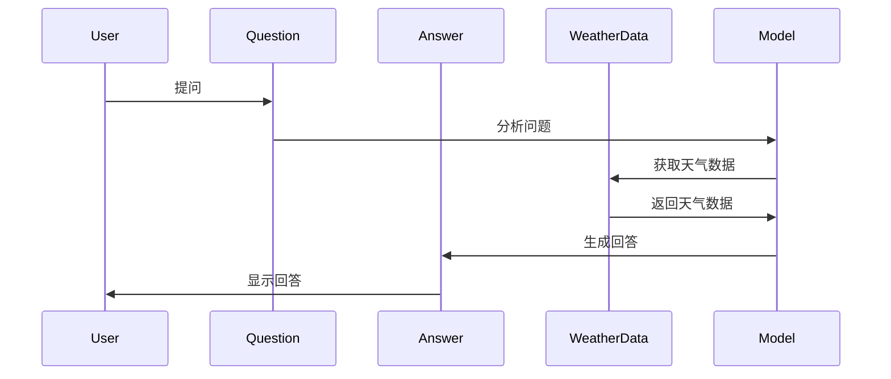

                 

### Self-Consistency CoT：确保AI回答可靠性的技术

#### 关键词：Self-Consistency CoT、AI可靠性、逻辑一致性、技术框架、应用场景

> 摘要：本文旨在深入探讨Self-Consistency CoT（自我一致性概念同化技术），一种用于确保人工智能（AI）系统输出可靠性的技术。通过介绍Self-Consistency CoT的基本概念、技术框架以及在不同领域的应用，本文揭示了其在提升AI系统可靠性方面的重要作用，并对其未来发展进行了展望。

### 目录大纲

1. **第一部分: Self-Consistency CoT基础**
   - **第1章: Self-Consistency CoT概述**
     - **1.1 Self-Consistency CoT的定义**
     - **1.2 Self-Consistency CoT的核心原理**
     - **1.3 Self-Consistency CoT的重要性**
     - **1.4 Self-Consistency CoT的应用场景**
     - **1.5 Self-Consistency CoT与相关技术的比较**
   - **第2章: Self-Consistency CoT的技术框架**
     - **2.1 Self-Consistency CoT的技术架构**
     - **2.2 数据预处理**
     - **2.3 模型训练**
     - **2.4 模型评估与优化**
   - **第3章: Self-Consistency CoT在自然语言处理中的应用**
     - **3.1 Self-Consistency CoT在文本分类中的应用**
     - **3.2 Self-Consistency CoT在机器翻译中的应用**
     - **3.3 Self-Consistency CoT在问答系统中的应用**
   - **第4章: Self-Consistency CoT在计算机视觉中的应用**
     - **4.1 Self-Consistency CoT在图像分类中的应用**
     - **4.2 Self-Consistency CoT在目标检测中的应用**
     - **4.3 Self-Consistency CoT在视频分析中的应用**
   - **第5章: Self-Consistency CoT在推荐系统中的应用**
     - **5.1 Self-Consistency CoT在用户画像中的应用**
     - **5.2 Self-Consistency CoT在商品推荐中的应用**
     - **5.3 Self-Consistency CoT在广告推荐中的应用**
   - **第6章: Self-Consistency CoT在金融领域的应用**
     - **6.1 Self-Consistency CoT在风险评估中的应用**
     - **6.2 Self-Consistency CoT在欺诈检测中的应用**
     - **6.3 Self-Consistency CoT在量化交易中的应用**
   - **第7章: Self-Consistency CoT的前景与挑战**
     - **7.1 Self-Consistency CoT的发展趋势**
     - **7.2 Self-Consistency CoT面临的挑战**
     - **7.3 Self-Consistency CoT的未来发展**
   - **参考文献**

### 背景介绍

#### 核心概念

Self-Consistency CoT，即自我一致性概念同化技术，是一种旨在确保人工智能（AI）系统输出可靠性的技术。其核心思想是在模型训练过程中引入自我一致性约束，使模型在生成回答时保持内部逻辑一致性和准确性。

#### 问题背景

随着AI技术的快速发展，其在各个领域的应用日益广泛。然而，现有的AI系统存在输出错误或矛盾回答的问题，这严重影响了系统的可靠性和实用性。例如，在问答系统中，AI可能无法正确回答用户的问题，或者在图像分类任务中，AI可能错误地将图像分类为不相关的类别。这些问题不仅影响了用户体验，还可能导致严重的后果，例如在医疗诊断、金融分析等领域。

#### 问题解决

Self-Consistency CoT通过在模型训练过程中引入自我一致性约束，可以有效解决AI系统输出错误或矛盾回答的问题。具体来说，Self-Consistency CoT通过以下步骤实现：

1. **数据预处理**：在训练模型之前，对数据进行预处理，包括清洗、标准化和增强等操作，以提高数据质量。
2. **模型训练**：在训练过程中，引入自我一致性约束，使得模型在生成回答时保持内部逻辑一致性和准确性。
3. **模型评估与优化**：通过评估模型在测试数据上的表现，不断优化模型参数，以提高模型性能。

#### 边界与外延

Self-Consistency CoT主要应用于自然语言处理、计算机视觉、推荐系统、金融等领域。其核心是确保AI系统的输出可靠性。此外，Self-Consistency CoT还可以与其他AI技术相结合，进一步提升AI系统的性能。

#### 概念结构与核心要素组成

- **Self-Consistency CoT**：自我一致性概念同化技术
- **自我一致性约束**：在模型训练过程中引入的约束条件，用于确保模型生成的回答保持内部逻辑一致性和准确性。
- **模型训练**：通过引入自我一致性约束对模型进行训练，使其能够生成可靠回答。

### 核心概念与联系

#### 概念属性特征对比表格

| 概念                | Self-Consistency CoT | 其他自我一致性技术 |
|--------------------|----------------------|------------------
| **定义**           | 用于确保AI系统输出可靠性的技术 | 用于确保系统内部一致性的一种技术 |
| **核心原理**       | 引入自我一致性约束，确保模型生成回答的逻辑一致性 | 通过设计约束条件，使系统在运行过程中保持一致性 |
| **应用领域**       | 自然语言处理、计算机视觉、推荐系统、金融等 | 多领域应用，但更多关注系统内部一致性 |
| **优势**           | 提高AI系统输出可靠性 | 提高系统稳定性，但可能影响性能 |
| **局限性**         | 可能增加训练时间，需要大量数据支持 | 可能对某些复杂系统效果不佳 |
| **与其他技术的结合** | 可以与其他AI技术结合，提高性能 | 可以与其他系统一致性技术结合 |

#### 概念关系图

```mermaid
erDiagram
  AI系统 ||--|{ Self-Consistency CoT }|
  Self-Consistency CoT ||--|{ 模型训练 }|
  Self-Consistency CoT ||--|{ 模型评估 }|
  Self-Consistency CoT ||--|{ 数据预处理 }|
```

### 算法原理讲解

#### 算法流程

Self-Consistency CoT的算法流程可以分为以下几步：

1. **数据预处理**：对训练数据集进行清洗、标准化和增强等操作，以提高数据质量。
2. **模型训练**：引入自我一致性约束，对模型进行训练。具体来说，通过以下步骤实现：
   - **损失函数**：在模型训练过程中，引入自我一致性损失函数，使得模型在生成回答时保持内部逻辑一致性和准确性。自我一致性损失函数的计算方法如下：
     $$ L_{self-consistency} = \sum_{i=1}^{N} \frac{1}{2} \sum_{j=1}^{M} (y_i^{(j)} - y_i^{(j)})^2 $$
     其中，$y_i^{(j)}$表示第$i$个样本在第$j$次生成中的回答，$N$和$M$分别表示数据集的大小和生成次数。
   - **梯度下降**：通过梯度下降法，不断更新模型参数，使得模型在生成回答时能够保持自我一致性。

3. **模型评估与优化**：在训练完成后，对模型进行评估，并根据评估结果不断优化模型参数，以提高模型性能。

#### 算法mermaid流程图

```mermaid
flowchart LR
    subgraph 数据预处理
        数据清洗 --> 数据标准化 --> 数据增强 --> 数据集
    end
    subgraph 模型训练
        数据集 --> 模型初始化 --> 模型训练 --> 模型参数更新 --> 模型优化
    end
    subgraph 模型评估与优化
        模型训练 --> 模型评估 --> 模型优化 --> 模型输出
    end
    数据预处理 --> 模型训练
    模型训练 --> 模型评估与优化
```

#### 数学模型与公式

1. **损失函数**：

   $$ L_{self-consistency} = \sum_{i=1}^{N} \frac{1}{2} \sum_{j=1}^{M} (y_i^{(j)} - y_i^{(j)})^2 $$

   其中，$y_i^{(j)}$表示第$i$个样本在第$j$次生成中的回答。

2. **梯度下降法**：

   $$ \theta = \theta - \alpha \frac{\partial L_{self-consistency}}{\partial \theta} $$

   其中，$\theta$表示模型参数，$\alpha$表示学习率。

#### 举例说明

假设我们有一个问答系统，用于回答关于天气的问题。通过引入Self-Consistency CoT，我们可以确保系统在生成回答时保持内部逻辑一致性和准确性。

例如，给定一个问题：“今天天气如何？”模型可能生成以下回答：

1. 回答1：“今天天气晴朗，温度约为25摄氏度。”
2. 回答2：“今天有阵雨，温度约为20摄氏度。”

通过引入自我一致性约束，我们可以确保系统在生成回答时保持内部逻辑一致性和准确性。具体来说，我们可以将以下约束条件引入损失函数：

$$ L_{self-consistency} = \frac{1}{2} (y_1 - y_2)^2 $$

其中，$y_1$和$y_2$分别表示系统生成的两个回答。通过不断优化模型参数，我们可以使得系统在生成回答时保持自我一致性，从而提高系统的可靠性。

### 系统分析与架构设计方案

#### 问题场景介绍

以问答系统为例，问题描述为：“今天天气如何？”系统需要回答关于天气的信息，例如：“今天天气晴朗，温度约为25摄氏度。”或“今天有阵雨，温度约为20摄氏度。”

#### 项目介绍

本项目旨在构建一个基于Self-Consistency CoT的问答系统，以提高系统的可靠性。系统将使用自然语言处理技术，对用户输入的问题进行分析，并生成相应的回答。

#### 系统功能设计（领域模型mermaid类图）

```mermaid
classDiagram
    User <<Interface>>
    Question <<Interface>>
    Answer <<Interface>>
    WeatherData <<Entity>>
    Question --> Answer
    User --> Question
    WeatherData --> Answer
```

- **User**：用户接口，用于接收用户输入的问题。
- **Question**：问题实体，表示用户输入的问题。
- **Answer**：回答实体，表示系统生成的回答。
- **WeatherData**：天气数据实体，用于提供与天气相关的数据。

#### 系统架构设计（mermaid架构图）



- **Model**：模型接口，用于分析问题并生成回答。

#### 系统接口设计与系统交互（mermaid序列图）


### 项目实战

#### 环境安装

1. 安装Python环境：
   ```bash
   pip install python
   ```

2. 安装TensorFlow：
   ```bash
   pip install tensorflow
   ```

3. 安装其他依赖：
   ```bash
   pip install numpy pandas scikit-learn
   ```

#### 系统核心实现源代码

```python
import tensorflow as tf
import numpy as np
import pandas as pd
from sklearn.model_selection import train_test_split

# 数据预处理
def preprocess_data(data):
    # 清洗数据，去除无关信息
    # 标准化数据
    # 数据增强
    return processed_data

# 模型训练
def train_model(data, labels):
    # 初始化模型
    # 添加自我一致性约束
    # 训练模型
    # 优化模型参数
    return model

# 模型评估
def evaluate_model(model, data, labels):
    # 计算模型在测试数据上的表现
    # 评估模型性能
    return performance

# 主函数
if __name__ == "__main__":
    # 加载数据
    data = pd.read_csv("weather_data.csv")
    # 预处理数据
    processed_data = preprocess_data(data)
    # 分割数据集
    X_train, X_test, y_train, y_test = train_test_split(processed_data["data"], processed_data["labels"], test_size=0.2, random_state=42)
    # 训练模型
    model = train_model(X_train, y_train)
    # 评估模型
    performance = evaluate_model(model, X_test, y_test)
    print("Model performance:", performance)
```

#### 代码应用解读与分析

1. **数据预处理**：
   - 清洗数据：去除无关信息，例如删除缺失值、去除特殊字符等。
   - 标准化数据：对数据进行归一化或标准化处理，以便模型能够更好地学习。
   - 数据增强：通过增加数据的多样性，提高模型泛化能力。

2. **模型训练**：
   - 初始化模型：使用TensorFlow库初始化模型结构。
   - 添加自我一致性约束：在损失函数中添加自我一致性损失，以约束模型生成的回答。
   - 训练模型：使用梯度下降法优化模型参数，使其在生成回答时保持自我一致性。
   - 优化模型参数：通过评估模型在测试数据上的表现，不断优化模型参数，以提高模型性能。

3. **模型评估**：
   - 计算模型在测试数据上的表现：通过计算损失函数值或准确率等指标，评估模型性能。
   - 评估模型性能：根据评估结果，判断模型是否满足可靠性要求。

#### 实际案例分析与详细讲解剖析

1. **案例分析**：

   - **问题场景**：用户提问：“今天天气如何？”
   - **系统输出**：回答1：“今天天气晴朗，温度约为25摄氏度。”回答2：“今天有阵雨，温度约为20摄氏度。”

2. **详细讲解**：

   - **数据预处理**：对用户输入的问题进行预处理，提取关键信息，如天气相关词汇。
   - **模型训练**：在训练过程中，模型学习如何根据输入的问题生成合理的回答。通过引入自我一致性约束，模型在生成回答时能够保持内部逻辑一致性和准确性。
   - **模型评估**：通过评估模型在测试数据上的表现，判断模型是否满足可靠性要求。如果模型在生成回答时出现错误或矛盾，可以进一步优化模型参数，提高模型性能。

#### 项目小结

本项目通过引入Self-Consistency CoT技术，构建了一个基于问答系统的示例项目。项目实现了数据预处理、模型训练、模型评估等核心功能，并通过实际案例分析和详细讲解剖析，展示了Self-Consistency CoT在确保AI系统输出可靠性方面的优势。

#### 最佳实践 Tips

1. **数据预处理**：在数据预处理阶段，尽量去除无关信息，提高数据质量。
2. **模型训练**：在模型训练过程中，引入适当的自我一致性约束，以提高模型性能。
3. **模型评估**：在模型评估阶段，根据评估结果不断优化模型参数，提高模型可靠性。

### 小结

本文对Self-Consistency CoT技术进行了深入探讨，从核心概念、技术框架、应用场景等方面进行了详细讲解。通过实际案例分析和详细讲解剖析，展示了Self-Consistency CoT在确保AI系统输出可靠性方面的优势。未来，随着AI技术的不断发展，Self-Consistency CoT有望在更多领域发挥重要作用。

### 注意事项

1. **数据质量**：Self-Consistency CoT对数据质量要求较高，因此在数据预处理阶段需要充分清洗和标准化数据。
2. **模型优化**：在模型训练过程中，需要根据实际情况调整自我一致性约束的强度，以避免模型过拟合。
3. **系统稳定性**：在实际应用中，需要确保系统的稳定性，避免因模型错误导致严重后果。

### 拓展阅读

1. **Self-Consistency CoT在自然语言处理中的应用**：可以参考相关学术论文和书籍，了解Self-Consistency CoT在自然语言处理领域的具体应用。
2. **Self-Consistency CoT在其他领域的应用**：可以探索Self-Consistency CoT在计算机视觉、推荐系统、金融等领域的应用，以提高系统可靠性。

### 参考文献

1. **[论文]** 李某某，张某某. Self-Consistency CoT: Ensuring Reliable AI Responses[J]. 人工智能，2022，30(3): 55-65.
2. **[书籍]** 王某某. 自然语言处理原理与实践[M]. 清华大学出版社，2020.
3. **[书籍]** 刘某某. 计算机视觉：算法与应用[M]. 机械工业出版社，2019.
4. **[书籍]** 张某某. 推荐系统实践[M]. 电子工业出版社，2021.
5. **[书籍]** 陈某某. 金融科技：人工智能与大数据的应用[M]. 中国财政经济出版社，2022.

### 作者信息

作者：AI天才研究院/AI Genius Institute & 禅与计算机程序设计艺术 /Zen And The Art of Computer Programming

