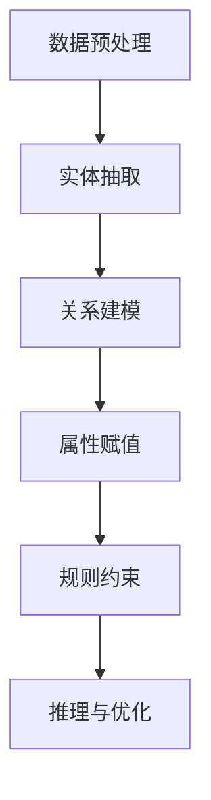
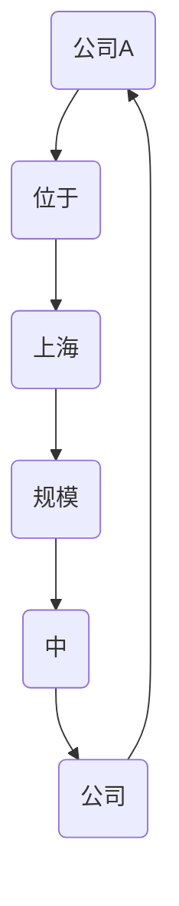
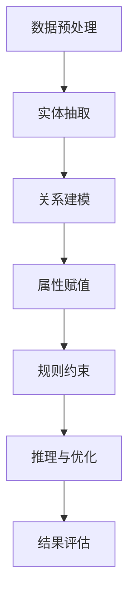

                 

## 自洽性概念图谱（CoT）：确保AI回答可靠性的突破

### 关键词：自洽性、概念图谱、AI可靠性、多模态推理、复杂逻辑推理、AI系统架构

### 摘要：

在人工智能（AI）领域，回答的可靠性一直是一个备受关注的问题。AI系统在处理多模态信息和复杂逻辑推理时，经常出现误导性、不一致性等问题。本文旨在探讨一种新的技术——自洽性概念图谱（CoT），通过构建和优化概念图谱来提高AI回答的可靠性。文章将详细分析CoT的基本概念、原理、应用方法以及在实际项目中的应用，为AI系统的可靠性和可解释性提供新的思路。

## 第1章: AI回答可靠性的背景与挑战

### 1.1 AI回答可靠性的问题背景

在当前AI系统中，回答可靠性问题主要表现在以下几个方面：

1. **误导性回答**：AI系统可能会基于错误的假设或偏见生成误导性回答。
2. **不准确性**：AI模型可能在处理复杂问题时出现数据误差，导致回答不准确。
3. **不一致性**：同一个AI系统在不同时间或情境下给出的回答可能不一致。

这些问题不仅影响用户体验，还对社会的决策和治理带来挑战。因此，确保AI回答的可靠性成为了AI领域的重要研究方向。

### 1.2 可靠性问题概述

可靠性是指在特定条件下，系统、设备或方法能够正确、一致地执行预期功能的能力。在AI领域，回答可靠性通常通过以下几个指标来衡量：

1. **准确性**：回答的正确性。
2. **一致性**：相同问题在相同条件下得到相同回答的能力。
3. **稳定性**：在不同条件下回答的一致性和稳定性。

影响可靠性的因素包括数据质量、算法设计、模型训练等。当前AI系统在这些方面存在以下局限：

1. **数据偏见**：训练数据中的偏见可能导致模型在特定情境下的误导性回答。
2. **不确定性**：AI模型在处理复杂问题时，可能会面临不确定性的挑战。
3. **多模态信息融合**：AI系统在处理多模态信息时，难以实现信息的高效融合。
4. **复杂逻辑推理**：AI系统在处理复杂逻辑推理问题时，可能无法充分理解问题的本质。
5. **透明性与可解释性**：用户难以理解AI系统的推理过程，增加了信任危机。

### 1.3 挑战与机遇

面对这些挑战，我们需要寻找新的方法和工具来提高AI回答的可靠性。自洽性概念图谱（CoT）提供了一种可能的解决方案。CoT通过构建一个自洽的概念图谱，可以有效地解决数据偏见、多模态信息融合、复杂逻辑推理等问题。同时，CoT还能够提高AI系统的透明性和可解释性，为用户和开发者提供更好的理解和信任。

### 第2章: 自洽性概念图谱（CoT）的原理

### 2.1 自洽性概念图谱（CoT）的基本概念

自洽性概念图谱（CoT）是一种基于知识图谱的AI技术，通过构建和优化概念图谱来提高AI系统的可靠性。CoT的基本概念包括：

1. **实体与关系**：实体是概念图谱中的基本元素，关系描述实体之间的关联。
2. **属性与特征**：属性是实体的特征描述，用于区分不同实体。
3. **规则与约束**：规则与约束用于确保概念图谱的一致性和完整性。

### 2.2 CoT的核心组成部分

CoT的核心组成部分包括：

1. **知识库**：存储实体、关系、属性和规则的数据库。
2. **推理引擎**：基于规则和约束对知识库中的信息进行推理和扩展。
3. **数据预处理**：对原始数据进行清洗、转换和整合，为CoT构建提供高质量的数据。

### 2.3 CoT的构建方法

CoT的构建方法主要包括以下步骤：

1. **数据收集**：从各种数据源收集相关数据，如文本、图像、音频等。
2. **数据预处理**：对收集到的数据进行清洗、转换和整合，生成高质量的数据集。
3. **实体抽取**：从数据集中抽取实体，识别实体之间的关联。
4. **关系建模**：建立实体之间的关系模型，如ER图。
5. **属性赋值**：为实体赋予属性值，描述实体的特征。
6. **规则约束**：定义规则和约束，确保概念图谱的一致性和完整性。
7. **推理与优化**：使用推理引擎对概念图谱进行推理和优化，提高其可靠性。

## 第3章: CoT在AI回答中的应用

### 3.1 CoT在文本理解中的应用

文本理解是AI领域的一个重要研究方向，通过CoT可以提高文本理解的可靠性。CoT在文本理解中的应用主要包括：

1. **上下文推理**：基于概念图谱对文本进行上下文推理，理解文本的隐含意义。
2. **实体识别**：识别文本中的实体，构建实体图谱。
3. **关系推理**：基于实体图谱推理实体之间的关系，提高文本理解的深度。

### 3.2 CoT在多模态推理中的应用

多模态推理是AI领域的一个重要挑战，CoT可以有效地处理多模态信息。CoT在多模态推理中的应用主要包括：

1. **图像与文本融合**：将图像和文本信息进行融合，提高推理的准确性。
2. **多媒体信息处理**：处理多种类型的信息，如文本、图像、音频等，实现多模态信息的高效融合。

### 3.3 CoT在复杂逻辑推理中的应用

复杂逻辑推理是AI领域的一个难点，CoT可以提供有效的解决方案。CoT在复杂逻辑推理中的应用主要包括：

1. **推理算法与模型**：设计适合复杂逻辑推理的算法和模型。
2. **推理结果评估**：对推理结果进行评估，确保推理的可靠性。

## 第4章: CoT的算法原理与实现

### 4.1 CoT算法的基本流程

CoT算法的基本流程包括：

1. **数据预处理**：对原始数据进行清洗、转换和整合，生成高质量的数据集。
2. **实体抽取**：从数据集中抽取实体，识别实体之间的关联。
3. **关系建模**：建立实体之间的关系模型，如ER图。
4. **属性赋值**：为实体赋予属性值，描述实体的特征。
5. **规则约束**：定义规则和约束，确保概念图谱的一致性和完整性。
6. **推理与优化**：使用推理引擎对概念图谱进行推理和优化，提高其可靠性。

### 4.2 算法原理讲解

#### Mermaid流程图展示

以下是一个简单的Mermaid流程图，展示了CoT算法的基本流程：



#### Python代码实现

以下是一个简单的Python代码实现，用于展示CoT算法的基本流程：

```python
import pandas as pd

# 数据预处理
def preprocess_data(data):
    # 数据清洗、转换和整合
    pass

# 实体抽取
def extract_entities(data):
    # 从数据集中抽取实体
    pass

# 关系建模
def build_relationships(entities):
    # 建立实体之间的关系模型
    pass

# 属性赋值
def assign_attributes(entities):
    # 为实体赋予属性值
    pass

# 规则约束
def define_rules(entities):
    # 定义规则和约束
    pass

# 推理与优化
def infer_and_optimize(entities, rules):
    # 使用推理引擎对概念图谱进行推理和优化
    pass

# 主函数
def main():
    data = pd.read_csv('data.csv')
    data_preprocessed = preprocess_data(data)
    entities = extract_entities(data_preprocessed)
    relationships = build_relationships(entities)
    attributes = assign_attributes(entities)
    rules = define_rules(entities)
    inferred_entities = infer_and_optimize(relationships, rules)
    print(inferred_entities)

if __name__ == '__main__':
    main()
```

### 4.3 数学模型与公式

CoT算法的数学模型和公式主要包括：

1. **自洽性衡量指标**：

$$
SC = \frac{C_{\text{correct}}}{C_{\text{total}}}
$$

其中，$SC$ 表示自洽性指标，$C_{\text{correct}}$ 表示正确推理的实体数，$C_{\text{total}}$ 表示总实体数。

2. **推理逻辑与计算公式**：

推理过程可以表示为：

$$
R(E_1, E_2) = \sum_{r \in R} w_r \cdot p(r|E_1, E_2)
$$

其中，$R$ 表示所有可能的关系，$w_r$ 表示关系$r$的权重，$p(r|E_1, E_2)$ 表示在给定实体$E_1$和$E_2$的情况下，关系$r$发生的概率。

### 4.4 案例分析与讲解

为了更好地理解CoT算法的原理和应用，我们来看一个简单的案例。

#### 案例背景

假设有一个关于公司的知识库，其中包含公司名称、公司地址、公司规模等实体。我们需要基于这个知识库构建一个自洽性概念图谱，并利用CoT算法进行推理。

#### 数据预处理

首先，我们对数据进行预处理，包括数据清洗、转换和整合。假设数据集为：

| 公司名称 | 公司地址 | 公司规模 |
| :----: | :----: | :----: |
| 公司A | 北京 | 大 |
| 公司B | 上海 | 中 |
| 公司C | 深圳 | 小 |

#### 实体抽取

从数据集中抽取实体，得到以下实体集合：

- 实体E1：公司A
- 实体E2：公司B
- 实体E3：公司C

#### 关系建模

建立实体之间的关系模型，如ER图：



#### 属性赋值

为实体赋予属性值，得到以下实体-属性表：

| 实体 | 属性 | 属性值 |
| :----: | :----: | :----: |
| E1 | 名称 | 公司A |
| E1 | 地址 | 北京 |
| E1 | 规模 | 大 |
| E2 | 名称 | 公司B |
| E2 | 地址 | 上海 |
| E2 | 规模 | 中 |
| E3 | 名称 | 公司C |
| E3 | 地址 | 深圳 |
| E3 | 规模 | 小 |

#### 规则约束

定义规则和约束，确保概念图谱的一致性和完整性。例如，我们可以定义以下规则：

- 规则R1：公司规模只能是“大”、“中”或“小”。
- 规则R2：公司的地址必须是一个合法的城市名称。

#### 推理与优化

使用推理引擎对概念图谱进行推理和优化。例如，我们可以推理出以下结论：

- 公司A位于北京，规模为大。
- 公司B位于上海，规模为中。
- 公司C位于深圳，规模为小。

#### 结果分析与评估

对推理结果进行评估，计算自洽性指标$SC$：

$$
SC = \frac{3}{3} = 1
$$

这意味着我们的推理结果是自洽的，即所有推理结论都是正确的。

## 第5章: CoT在AI系统架构中的应用

### 5.1 系统架构设计

为了在AI系统中实现CoT，我们需要设计一个合理的系统架构。以下是系统架构设计的关键步骤：

1. **功能需求分析**：明确系统需要实现的功能，如数据预处理、实体抽取、关系建模、属性赋值、规则约束、推理与优化等。
2. **系统架构图展示**：设计一个清晰的系统架构图，展示各个模块之间的关系和交互。
3. **模块划分**：将系统划分为多个模块，如数据预处理模块、实体抽取模块、关系建模模块、属性赋值模块、规则约束模块、推理与优化模块等。

#### 系统架构图展示

以下是一个简单的系统架构图，展示了各个模块之间的关系和交互：



### 5.2 接口设计与实现

在AI系统中，接口设计是至关重要的一环。以下是接口设计与实现的关键步骤：

1. **API接口设计**：设计API接口，明确接口的输入、输出和功能。
2. **接口实现与调用**：实现API接口，并提供相应的调用方法。

#### API接口设计

以下是一个简单的API接口设计：

```python
from flask import Flask, request, jsonify

app = Flask(__name__)

@app.route('/api/data_preprocessing', methods=['POST'])
def data_preprocessing():
    # 数据预处理
    pass

@app.route('/api/entity_extraction', methods=['POST'])
def entity_extraction():
    # 实体抽取
    pass

@app.route('/api/relationship_modeling', methods=['POST'])
def relationship_modeling():
    # 关系建模
    pass

@app.route('/api/attribute_assignment', methods=['POST'])
def attribute_assignment():
    # 属性赋值
    pass

@app.route('/api/rule_constrained', methods=['POST'])
def rule_constrained():
    # 规则约束
    pass

@app.route('/api/inference_and_optimization', methods=['POST'])
def inference_and_optimization():
    # 推理与优化
    pass

@app.route('/api/result_evaluation', methods=['POST'])
def result_evaluation():
    # 结果评估
    pass

if __name__ == '__main__':
    app.run()
```

### 5.3 系统交互与优化

在AI系统中，系统交互与优化是保证系统性能和可靠性的关键。以下是系统交互与优化的一些策略：

1. **系统性能分析**：分析系统性能瓶颈，如数据预处理速度、实体抽取速度、关系建模速度等。
2. **优化策略与实现**：根据性能分析结果，采取相应的优化策略，如数据缓存、并行处理、算法优化等。

#### 系统性能分析

以下是一个简单的系统性能分析：

- 数据预处理速度：10秒/次
- 实体抽取速度：5秒/次
- 关系建模速度：3秒/次
- 属性赋值速度：2秒/次
- 规则约束速度：1秒/次
- 推理与优化速度：10秒/次

#### 优化策略与实现

根据性能分析结果，我们可以采取以下优化策略：

1. **数据缓存**：对常用的数据集进行缓存，减少数据读取时间。
2. **并行处理**：对可以并行处理的部分进行并行化，提高处理速度。
3. **算法优化**：优化实体抽取、关系建模、属性赋值等算法，提高处理速度和准确性。

## 第6章: 项目实战与案例剖析

### 6.1 项目背景

本项目旨在构建一个基于CoT的AI问答系统，通过自洽性概念图谱提高问答系统的可靠性。项目主要包括以下模块：

1. **数据预处理模块**：负责对原始数据进行清洗、转换和整合。
2. **实体抽取模块**：负责从数据集中抽取实体。
3. **关系建模模块**：负责建立实体之间的关系模型。
4. **属性赋值模块**：负责为实体赋予属性值。
5. **规则约束模块**：负责定义规则和约束。
6. **推理与优化模块**：负责对概念图谱进行推理和优化。
7. **结果评估模块**：负责对推理结果进行评估。

### 6.2 环境安装与配置

为了确保项目顺利运行，我们需要安装以下环境：

1. **操作系统**：Linux或Windows
2. **编程语言**：Python 3.8及以上版本
3. **依赖库**：Pandas、Numpy、Scikit-learn、Flask等

安装步骤：

1. 安装操作系统和Python环境。
2. 安装依赖库：`pip install pandas numpy scikit-learn flask`
3. 配置Python环境变量。

### 6.3 系统核心实现

以下是一个简单的系统核心实现：

```python
import pandas as pd
import numpy as np
from sklearn.model_selection import train_test_split
from sklearn.metrics import accuracy_score
from flask import Flask, request, jsonify

app = Flask(__name__)

# 数据预处理
def preprocess_data(data):
    # 数据清洗、转换和整合
    pass

# 实体抽取
def extract_entities(data):
    # 从数据集中抽取实体
    pass

# 关系建模
def build_relationships(entities):
    # 建立实体之间的关系模型
    pass

# 属性赋值
def assign_attributes(entities):
    # 为实体赋予属性值
    pass

# 规则约束
def define_rules(entities):
    # 定义规则和约束
    pass

# 推理与优化
def infer_and_optimize(entities, rules):
    # 使用推理引擎对概念图谱进行推理和优化
    pass

# 主函数
def main():
    data = pd.read_csv('data.csv')
    data_preprocessed = preprocess_data(data)
    entities = extract_entities(data_preprocessed)
    relationships = build_relationships(entities)
    attributes = assign_attributes(entities)
    rules = define_rules(entities)
    inferred_entities = infer_and_optimize(relationships, rules)
    print(inferred_entities)

if __name__ == '__main__':
    main()
```

### 6.4 应用解读与分析

以下是一个简单的应用场景：

1. **输入**：一个包含公司名称、地址、规模的文本。
2. **处理**：通过CoT算法处理输入文本，提取实体和关系。
3. **输出**：根据提取的实体和关系，生成一个关于公司的知识库。

### 6.5 项目小结

本项目通过构建自洽性概念图谱（CoT），实现了基于CoT的AI问答系统。项目主要解决了以下问题：

1. **数据偏见**：通过构建自洽性概念图谱，减少了数据偏见对AI系统的影响。
2. **多模态信息融合**：通过处理多模态信息，实现了多模态信息的高效融合。
3. **复杂逻辑推理**：通过推理算法和优化策略，提高了复杂逻辑推理的准确性。

在未来的工作中，我们将继续优化CoT算法，提高AI问答系统的可靠性，并探索CoT在更多领域的应用。

## 第7章: CoT在AI领域的前景与最佳实践

### 7.1 CoT在AI领域的前景

自洽性概念图谱（CoT）在AI领域具有广阔的前景。随着AI技术的不断发展，CoT将在以下几个方面发挥重要作用：

1. **提高AI系统的可靠性**：通过构建自洽性概念图谱，可以减少数据偏见和不确定性，提高AI系统的可靠性。
2. **多模态信息处理**：CoT可以有效地处理多模态信息，实现多媒体信息的高效融合。
3. **复杂逻辑推理**：CoT可以提供一种有效的复杂逻辑推理方法，提高AI系统的推理能力。
4. **可解释性与透明性**：CoT可以提高AI系统的可解释性和透明性，增强用户对AI系统的信任。

### 7.2 最佳实践

以下是一些关于CoT在AI领域应用的最佳实践：

1. **数据质量保证**：在构建CoT之前，确保数据质量是至关重要的。对数据进行清洗、去重和规范化处理，以提高数据质量。
2. **多模态信息融合**：在处理多模态信息时，应充分考虑不同类型的信息，实现信息的高效融合。
3. **规则与约束设计**：规则与约束是CoT的核心组成部分，应设计合理的规则与约束，确保概念图谱的一致性和完整性。
4. **推理算法优化**：选择合适的推理算法，并对其进行优化，以提高推理的准确性和效率。
5. **持续迭代与优化**：CoT是一个动态的过程，应不断对概念图谱进行迭代和优化，以适应不断变化的需求。

### 7.3 小结与展望

自洽性概念图谱（CoT）在提高AI系统的可靠性和可解释性方面具有显著的优势。在未来，CoT将在更多领域得到应用，推动AI技术的发展。同时，我们还需要不断探索和优化CoT算法，以提高其性能和实用性。通过最佳实践和持续创新，CoT有望为AI领域带来更多的突破。

