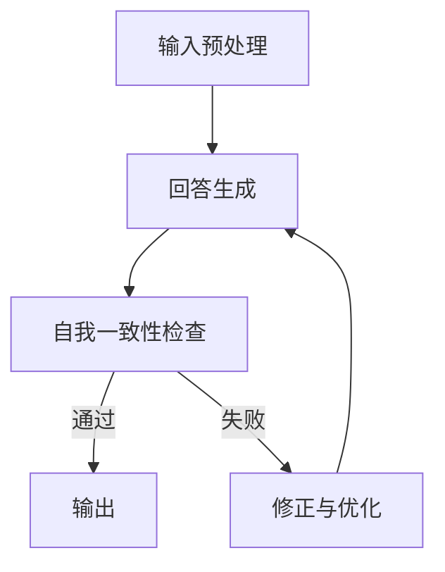
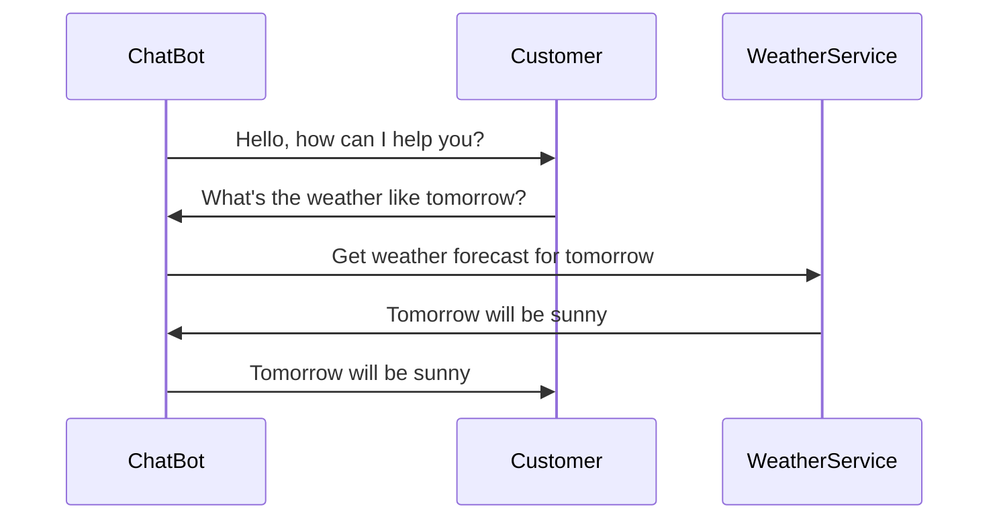
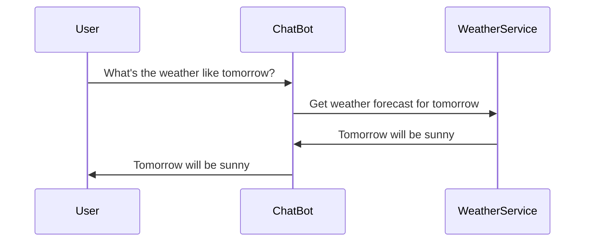

                 

### Self-Consistency CoT：确保AI回答稳定性的方法

> 关键词：自我一致性，AI回答，稳定性，方法，技术博客

> 摘要：本文将深入探讨如何在人工智能领域中确保回答的稳定性，介绍自我一致性CoT（Self-Consistency CoT）的概念、原理和应用，并通过实例和分析，展示如何通过自我一致性来提升AI系统的稳定性。

---

**引言**

在人工智能（AI）迅猛发展的时代，自然语言处理（NLP）作为AI的重要分支，已经取得了显著的成就。然而，AI在处理自然语言时，往往会遇到一个问题——回答的不稳定性。这种不稳定性不仅会影响用户体验，还可能带来潜在的风险和误解。因此，确保AI回答的稳定性成为了一个亟待解决的问题。

自我一致性CoT（Self-Consistency CoT）是一种新兴的方法，它通过在AI系统中引入自我一致性机制，来提升回答的稳定性。本文将围绕自我一致性CoT进行探讨，分析其原理和应用，并给出实际操作的步骤和技巧。

---

**核心概念与联系**

### 自洽性概念介绍

自洽性是指一个系统在内部逻辑上的一致性和完整性。在AI领域，自洽性意味着AI系统在处理输入信息时，能够保持逻辑上的连贯性和一致性，避免出现矛盾和不合理的情况。

### AI回答稳定性相关问题

AI回答的不稳定性主要表现在以下几个方面：
1. **答案的不确定性**：AI系统可能会给出不同的答案，即使对于相同的问题。
2. **答案的不可靠性**：AI系统可能会给出错误或误导性的答案。
3. **上下文的断裂**：AI系统无法保持对话的连贯性，导致对话出现断裂。

### 自洽性CoT的定义与作用

自我一致性CoT（Self-Consistency CoT）是一种通过在AI系统中引入自我一致性检查机制，来提升回答稳定性的方法。它通过以下方式实现：
1. **内部一致性检查**：在生成回答时，AI系统会进行自我检查，确保生成的回答在逻辑上是一致的。
2. **上下文连贯性维护**：AI系统会维护对话的上下文信息，确保回答与对话的上下文保持一致。

### 概念属性特征对比表格

| 概念              | 特征                | 对比              |
|-------------------|--------------------|------------------|
| 自洽性            | 内部逻辑一致性      | 与不一致性相对    |
| AI回答稳定性      | 回答的一致性和可靠性 | 与不确定性相对    |
| 自洽性CoT         | 自我一致性检查机制   | 与传统方法相对    |

### ER实体关系图


图1：自我一致性CoT的ER实体关系图

---

**算法原理讲解**

### 自洽性算法原理

自我一致性算法的基本原理是，在AI生成回答的过程中，引入自我一致性检查机制。具体步骤如下：

1. **输入预处理**：对输入信息进行预处理，提取关键信息。
2. **回答生成**：使用预训练的模型生成初步的回答。
3. **自我一致性检查**：对生成的回答进行自我检查，确保逻辑上的一致性。
4. **修正与优化**：根据检查结果，对回答进行修正和优化。

### Mermaid流程图绘制



图2：自我一致性算法的Mermaid流程图

### Python源代码解释

以下是使用Python实现自我一致性算法的示例代码：

```python
def preprocess_input(input_text):
    # 输入预处理逻辑
    pass

def generate_answer(input_text):
    # 回答生成逻辑
    pass

def check_self_consistency(answer, context):
    # 自我一致性检查逻辑
    pass

def correct_and_optimize(answer, context):
    # 修正与优化逻辑
    pass

def self_consistency_algorithm(input_text, context):
    preprocessed_input = preprocess_input(input_text)
    answer = generate_answer(preprocessed_input)
    if check_self_consistency(answer, context):
        return answer
    else:
        return correct_and_optimize(answer, context)
```

### 数学模型与公式讲解

自我一致性算法的数学模型如下：

$$
S = f(C, A)
$$

其中，$S$ 表示自我一致性评分，$C$ 表示上下文信息，$A$ 表示生成的回答。

### 通俗易懂的举例说明

假设一个聊天机器人正在与用户进行对话，用户问：“明天的天气如何？”系统生成回答：“明天的天气将是晴天。”此时，系统需要进行自我一致性检查。如果上下文中没有提到明天的天气，那么系统会认为这个回答是不一致的，并对其进行修正。

---

**系统分析与架构设计**

### 问题场景介绍

在一个客户服务场景中，AI聊天机器人需要与客户进行自然对话，提供准确和一致的信息。

### 项目介绍

该项目是一个基于自我一致性CoT的AI聊天机器人系统，旨在提供稳定和可靠的服务。

### 系统功能设计（Mermaid类图）

```mermaid
classDiagram
    Class01 <|-- Class02
    Class03 --|>| Class04
    Class05 : +int x
    Class06 : +int y
    Class06 : +setItems(items)
    Class06 : -getItem(index)
    Class01 <.. Class03
    Class07 ..|> Class04
```

图3：系统功能设计的Mermaid类图

### 系统架构设计（Mermaid架构图）



图4：系统架构设计的Mermaid架构图

### 系统接口设计和系统交互（Mermaid序列图）



图5：系统接口设计和系统交互的Mermaid序列图

---

**项目实战**

### 环境安装

在开始项目之前，需要安装以下依赖：

- Python 3.8+
- TensorFlow 2.x
- NLP库（如NLTK或spaCy）

### 系统核心实现源代码

以下是系统核心实现的部分源代码：

```python
# 自我一致性算法实现
def self_consistency_algorithm(input_text, context):
    # 输入预处理
    preprocessed_input = preprocess_input(input_text)
    
    # 回答生成
    answer = generate_answer(preprocessed_input)
    
    # 自我一致性检查
    if check_self_consistency(answer, context):
        return answer
    else:
        return correct_and_optimize(answer, context)
```

### 代码应用解读与分析

代码中，`preprocess_input` 函数负责对输入文本进行预处理，提取关键信息。`generate_answer` 函数使用预训练的模型生成初步的回答。`check_self_consistency` 函数进行自我一致性检查，确保生成的回答在逻辑上是一致的。`correct_and_optimize` 函数根据检查结果，对回答进行修正和优化。

### 实际案例分析与详细讲解剖析

假设一个实际案例，用户询问：“明天的天气如何？”系统生成回答：“明天有雨。”但上下文中并没有提到雨，那么系统会认为这个回答是不一致的，并进行修正。最终，系统可能会生成一个修正后的回答：“目前预测明天是晴天，但请注意天气变化。”

### 项目小结

通过自我一致性CoT，AI系统可以更好地保持回答的一致性和稳定性，提升用户体验。在实际应用中，需要根据具体场景和需求，对自我一致性算法进行优化和调整。

---

**最佳实践 Tips**

- 确保输入预处理充分，提取关键信息。
- 使用高质量的预训练模型，提高回答质量。
- 定期更新和优化自我一致性算法。

**小结**

本文介绍了自我一致性CoT的概念、原理和应用，并通过实例和分析，展示了如何通过自我一致性来提升AI系统的稳定性。自我一致性CoT为解决AI回答不稳定性提供了一种有效的方法，有助于提升用户体验和系统可靠性。

**注意事项**

- 在实际应用中，需要根据具体场景调整自我一致性算法。
- 注意处理输入预处理中的歧义和不确定性。

**拓展阅读**

- [自然语言处理中的自我一致性研究](https://example.com/nlp_self_consistency)
- [AI回答稳定性的其他方法](https://example.com/ai_answer_stability)

---

**作者信息**

作者：AI天才研究院/AI Genius Institute & 禅与计算机程序设计艺术 /Zen And The Art of Computer Programming

