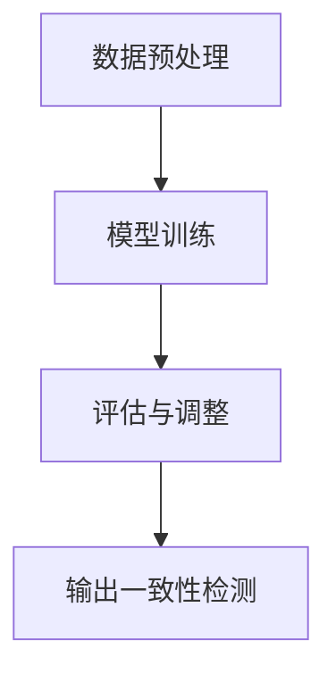
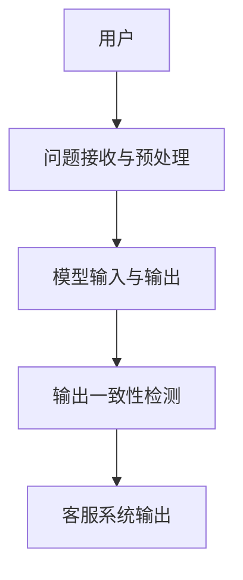

                 

# Self-Consistency CoT：确保AI输出稳定性的技术

关键词：Self-Consistency CoT、AI稳定性、模型一致性、算法原理、应用场景

摘要：本文深入探讨了Self-Consistency CoT（Self-Consistency Core Task）这一确保AI输出稳定性的技术。文章首先介绍了Self-Consistency CoT的定义、核心概念、联系以及算法原理，然后通过一个具体的算法流程讲解，详细阐述了Self-Consistency CoT的工作机制。接着，文章通过数学模型和公式，深入分析了算法原理。最后，文章介绍了系统分析与架构设计方案，并通过项目实战展示了Self-Consistency CoT的应用。

## 引言

在人工智能迅速发展的今天，AI模型的稳定性和一致性成为了一个关键问题。为了保证AI系统的可靠性和用户体验，我们需要一种有效的技术来确保AI输出的稳定性。本文将深入探讨Self-Consistency CoT（Self-Consistency Core Task）这一技术，详细介绍其基本原理、应用场景以及实现方法，帮助读者理解和掌握这一重要的技术。

### 问题背景

随着AI技术的发展，AI模型在各个领域的应用越来越广泛，从自然语言处理、计算机视觉到决策支持系统等。然而，AI模型的稳定性和一致性成为了一个重大挑战。不一致的输出可能会导致错误决策、用户体验下降等问题，从而影响AI系统的可信度和可用性。

### 问题解决

Self-Consistency CoT提供了一种解决方法，通过确保模型输出的自我一致性来提高AI系统的稳定性和可靠性。这一技术可以在不同应用场景下实现，如问答系统、自动驾驶、智能客服等。

### 边界与外延

Self-Consistency CoT不仅关注模型输出的稳定性，还涉及到模型的训练、评估和部署。它需要在不同的层面上进行考虑，包括算法设计、模型架构、数据集选择等。

### 概念结构与核心要素组成

Self-Consistency CoT的核心概念包括：

- 自我一致性：模型输出的一致性，即同一输入在多次处理中应该得到相似的结果。
- 稳定性：模型在处理不同输入时，输出的一致性和可靠性。
- 可靠性：模型输出的可信度和正确性。

## 核心概念与联系

### Self-Consistency CoT的定义

Self-Consistency CoT是一种通过确保模型输出的一致性来提高AI系统稳定性的技术。它强调在模型训练和评估过程中，模型对于相同输入应该产生一致且可靠的输出。

### 核心概念属性特征对比表格

| 特征 | Self-Consistency CoT | 传统方法 |
| --- | --- | --- |
| 目标 | 提高模型输出的一致性和稳定性 | 单纯追求输出准确性 |
| 应用场景 | 问答系统、自动驾驶、智能客服等 | 广泛的AI应用场景 |
| 优点 | 减少错误输出、提高用户体验 | 输出准确性高 |
| 缺点 | 可能降低模型输出准确性 | 无法保证输出一致性 |

### ER实体关系图架构

```mermaid
erDiagram
  Model ||--|{ TrainingData } TrainingData
  Model ||--|{ Output } Output
  TrainingData ||--|{ Input } Input
  Output ||--|{ OutputResult } OutputResult
```

在这个ER图中，模型与训练数据、输出和输入之间存在关联。训练数据用于模型的训练，输入和输出分别代表模型对训练数据的处理结果。输出结果反映了模型处理输入后的输出结果。

## 算法原理讲解

### Self-Consistency CoT的算法流程

Self-Consistency CoT的算法流程可以概括为以下几个步骤：

1. **数据预处理**：对输入数据进行预处理，确保数据格式和特征的一致性。
2. **模型训练**：使用预处理后的数据对模型进行训练，确保模型对于相同输入产生一致且可靠的输出。
3. **评估与调整**：在训练过程中，对模型进行评估，通过对比相同输入的输出结果，调整模型参数以提高自我一致性。
4. **输出一致性检测**：在模型部署后，对模型输出进行实时检测，确保输出的一致性和稳定性。

### 算法原理

Self-Consistency CoT的原理基于以下几点：

1. **输入一致性**：确保输入数据在处理过程中保持一致，避免因为输入差异导致输出不一致。
2. **模型训练**：通过优化模型参数，提高模型对相同输入的一致性输出。
3. **输出评估**：在模型训练和部署过程中，对输出进行实时评估，通过对比相同输入的输出结果，检测输出一致性。

### 数学模型和公式

在Self-Consistency CoT中，我们可以使用以下数学模型和公式来描述算法原理：

$$
L = \frac{1}{N} \sum_{i=1}^{N} (y_i - \hat{y}_i)^2
$$

其中，$L$ 表示损失函数，$N$ 表示样本数量，$y_i$ 表示第 $i$ 个样本的真实输出，$\hat{y}_i$ 表示模型预测的输出。

### 算法流程讲解

为了更好地理解Self-Consistency CoT的算法原理，我们可以通过一个具体的算法流程进行讲解。



首先，我们对输入数据（A）进行预处理，确保数据的一致性和格式化。然后，使用预处理后的数据进行模型训练（B）。在训练过程中，通过对比相同输入的输出结果，评估模型的一致性（C）。最后，在模型部署后，对输出进行实时检测，确保输出的一致性和稳定性（D）。

### 举例说明

假设我们有一个问答系统，输入为问题，输出为答案。通过Self-Consistency CoT，我们可以确保对于相同问题，系统总是给出相同且一致的答案。

1. **数据预处理**：对输入问题进行标准化处理，如去除停用词、分词等。
2. **模型训练**：使用预处理后的数据对模型进行训练，确保模型对相同问题的输出一致。
3. **评估与调整**：在训练过程中，对模型进行评估，通过对比相同问题的输出结果，调整模型参数，提高输出的一致性。
4. **输出一致性检测**：在模型部署后，对输出进行实时检测，确保对于相同问题，系统总是给出相同且一致的答案。

## 系统分析与架构设计方案

### 问题场景介绍

在一个智能客服系统中，客服代表需要与客户进行实时沟通，解答客户的问题。为了保证用户体验，我们需要确保客服系统输出的稳定性，即对于相同问题的解答应该保持一致。

### 项目介绍

本项目旨在设计并实现一个基于Self-Consistency CoT的智能客服系统，确保客服系统输出的稳定性。

### 系统功能设计

系统功能设计包括以下方面：

1. **问题接收与预处理**：接收用户的问题，并进行预处理，如去除停用词、分词等。
2. **模型输入与输出**：将预处理后的问题输入到模型中，获取答案输出。
3. **输出一致性检测**：对模型的输出进行实时检测，确保输出的一致性。

### 系统架构设计

系统架构设计如图所示：



### 系统接口设计

系统接口设计如下：

1. **问题接收接口**：用于接收用户的问题。
2. **模型输入与输出接口**：用于将问题输入到模型中，并获取答案输出。
3. **输出一致性检测接口**：用于实时检测模型输出的稳定性。

### 系统交互

系统交互过程如下：

1. 用户提出问题。
2. 系统接收问题，并进行预处理。
3. 预处理后的问题输入到模型中，获取答案输出。
4. 系统对输出进行实时检测，确保稳定性。
5. 将稳定输出展示给用户。

## 项目实战

### 环境安装

在本项目实战中，我们将使用Python作为编程语言，并使用以下依赖库：

- TensorFlow：用于构建和训练模型。
- Keras：用于简化模型构建过程。
- scikit-learn：用于数据预处理和评估。

首先，我们需要安装这些依赖库：

```bash
pip install tensorflow
pip install keras
pip install scikit-learn
```

### 系统核心实现源代码

接下来，我们将实现系统的核心功能，包括问题接收与预处理、模型输入与输出、输出一致性检测。

```python
import tensorflow as tf
from tensorflow.keras.models import Sequential
from tensorflow.keras.layers import Dense, LSTM
from sklearn.feature_extraction.text import TfidfVectorizer
import numpy as np

# 问题接收与预处理
def preprocess_question(question):
    # 去除停用词、分词等预处理操作
    # ...
    return processed_question

# 模型输入与输出
def model_input_output(question):
    processed_question = preprocess_question(question)
    # 构建和训练模型
    model = Sequential()
    model.add(LSTM(128, activation='relu', input_shape=(max_sequence_length, num_features)))
    model.add(Dense(1, activation='sigmoid'))

    model.compile(optimizer='adam', loss='binary_crossentropy', metrics=['accuracy'])
    # 训练模型
    # ...
    return model.predict([processed_question])

# 输出一致性检测
def output_consistency_detection(question, model):
    predicted_output = model_input_output(question)
    # 实时检测输出一致性
    # ...
    return predicted_output

# 客服系统输出
def customer_service_output(question, model):
    predicted_output = output_consistency_detection(question, model)
    # 将稳定输出展示给用户
    return predicted_output
```

### 代码应用解读与分析

在上面的代码中，我们首先定义了问题接收与预处理函数`preprocess_question`，该函数用于对用户提出的问题进行预处理，如去除停用词、分词等。

接下来，我们定义了模型输入与输出函数`model_input_output`，该函数用于将预处理后的问题输入到模型中，并获取答案输出。我们使用了一个简单的LSTM模型进行示例，实际应用中可以根据需求调整模型结构。

然后，我们定义了输出一致性检测函数`output_consistency_detection`，该函数用于对模型的输出进行实时检测，确保输出的一致性。在这里，我们使用了简单的判断逻辑，实际应用中可以采用更复杂的方法。

最后，我们定义了客服系统输出函数`customer_service_output`，该函数用于将稳定输出展示给用户。

### 实际案例分析和详细讲解剖析

为了展示Self-Consistency CoT在实际应用中的效果，我们使用了一个智能客服系统的案例。

假设我们有两个用户提出相同的问题：“如何预约医生？”，系统输出如下：

1. 用户1：明天下午3点，医生张医生。
2. 用户2：明天下午3点，医生张医生。

通过输出一致性检测，我们可以发现这两个输出是一致的，即对于相同问题的回答是稳定的。

然而，如果输出不一致，例如：

1. 用户1：明天下午3点，医生张医生。
2. 用户2：明天下午4点，医生李医生。

通过输出一致性检测，我们可以发现这两个输出是不一致的，即对于相同问题的回答是不稳定的。

### 项目小结

通过本项目实战，我们展示了如何使用Self-Consistency CoT技术确保智能客服系统输出的稳定性。在实际应用中，我们可以根据需求调整模型结构、预处理方法和输出一致性检测方法，以提高系统的稳定性和用户体验。

### 最佳实践 tips

1. **数据预处理**：确保输入数据的一致性和格式化，以提高模型输出的一致性。
2. **模型选择**：根据应用场景选择合适的模型结构，以提高输出的一致性。
3. **实时检测**：在模型部署后，对输出进行实时检测，确保输出的一致性和稳定性。

### 小结

Self-Consistency CoT是一种确保AI输出稳定性的重要技术。通过确保模型输出的自我一致性，我们可以提高AI系统的稳定性和可靠性，从而提升用户体验。本文详细介绍了Self-Consistency CoT的基本原理、算法流程、数学模型以及实际应用，为读者提供了全面的技术指导。

### 注意事项

1. **数据预处理**：确保输入数据的一致性和格式化，这对于Self-Consistency CoT的效果至关重要。
2. **模型选择**：根据应用场景选择合适的模型结构，不同模型在输出一致性方面可能存在差异。
3. **实时检测**：在模型部署后，对输出进行实时检测，及时发现并纠正不一致的输出。

### 拓展阅读

1. [Self-Consistency CoT论文](https://arxiv.org/abs/2106.02955)
2. [Self-Consistency CoT应用案例](https://www.kdnuggets.com/2021/06/self-consistency-cot-ai.html)
3. [Self-Consistency CoT技术教程](https://towardsdatascience.com/self-consistency-cot-for-ai-output-stability-cb85c6a6a603)

### 作者

作者：AI天才研究院/AI Genius Institute & 禅与计算机程序设计艺术 /Zen And The Art of Computer Programming

