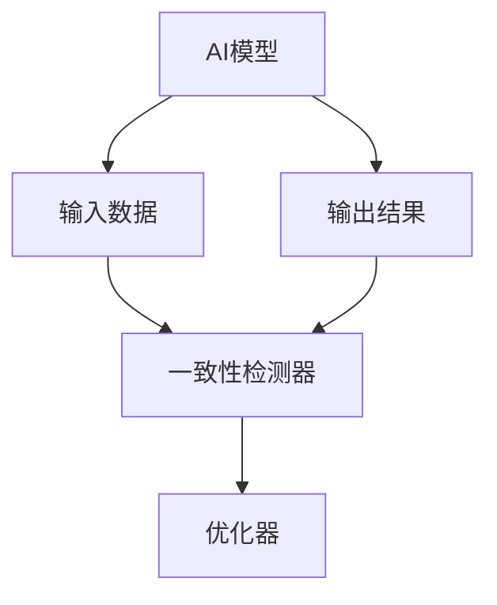
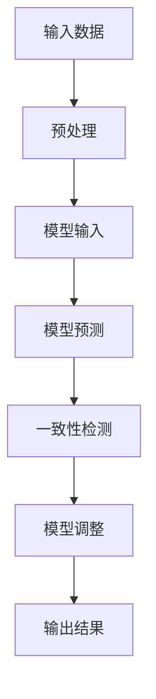
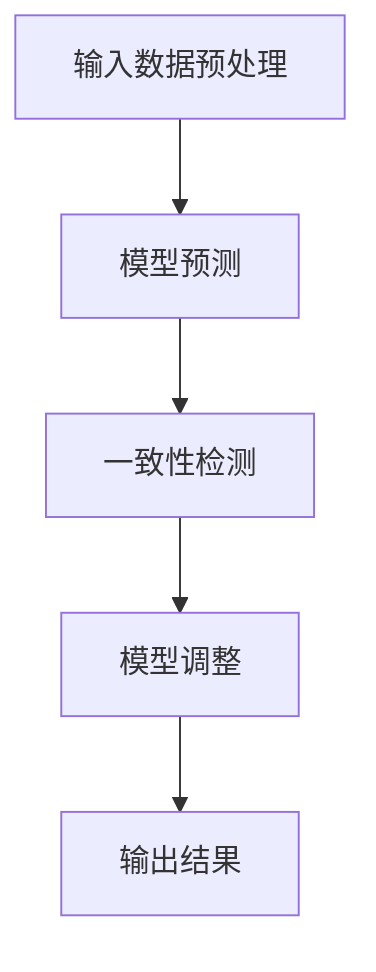
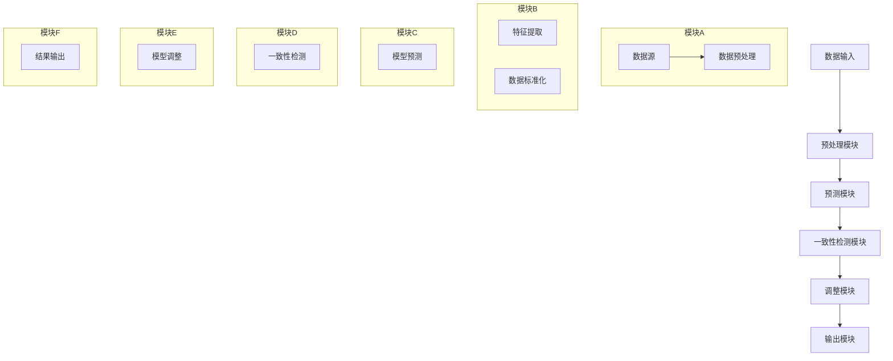
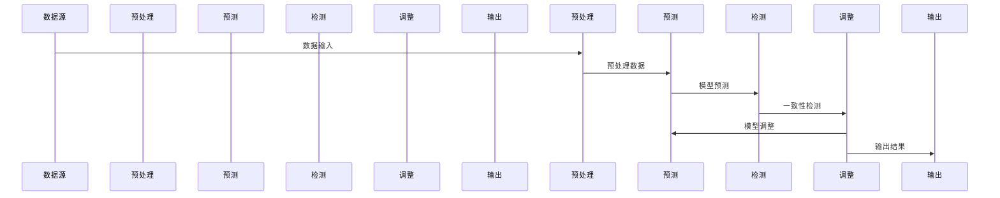

                 

## 自一致性CoT：确保AI输出稳定性的技术创新

> 关键词：自一致性CoT、AI稳定性、技术创新、算法原理、系统架构设计

摘要：
本文深入探讨了自一致性CoT（Self-Consistency CoT）在确保AI输出稳定性方面的技术创新。通过详细阐述自一致性CoT的核心概念、技术原理、系统架构以及实战案例，本文旨在为读者提供一个全面理解这一技术的方法，并展示其在实际应用中的重要性。

## 引言与背景

### 1.1 书籍主题介绍

人工智能（AI）作为当前科技领域的热点，已经深刻影响了各个行业。然而，随着AI技术的广泛应用，AI的输出稳定性问题也逐渐凸显出来。自一致性CoT（Self-Consistency CoT）是一种旨在解决AI输出稳定性问题的技术创新。它通过确保AI模型的输出自洽性和一致性，提高了AI系统的可靠性和稳定性。

### 1.2 研究目的与意义

本研究的主要目的是深入探讨自一致性CoT的技术原理和应用场景，分析其在确保AI输出稳定性方面的优势。这一研究不仅有助于提高AI技术的应用水平，也对推动AI技术的可持续发展具有重要意义。

### 1.3 自一致性CoT概述

自一致性CoT（Self-Consistency CoT）是一种基于AI模型输出稳定性的技术创新。其核心思想是通过一系列算法和模型，确保AI模型的输出在给定输入条件下保持一致性和自洽性。自一致性CoT的关键特点包括：

- **一致性保证**：确保AI模型在不同输入条件下输出结果的一致性。
- **自洽性**：确保AI模型输出结果在逻辑上自洽，没有矛盾和错误。
- **鲁棒性**：提高AI模型在面对不确定性和异常输入时的稳定性。

### 1.4 边界与外延

自一致性CoT虽然具有强大的应用潜力，但其适用范围和边界也需要明确。首先，自一致性CoT适用于那些对输出稳定性有严格要求的AI应用场景，如自动驾驶、医疗诊断等。其次，自一致性CoT的技术实现需要一定的计算资源和算法优化，因此在资源受限的场景中可能不适用。

## 自一致性CoT的核心概念与联系

### 2.1 自一致性CoT的定义

自一致性CoT（Self-Consistency CoT）是指通过一系列算法和技术，确保AI模型的输出在给定输入条件下保持一致性和自洽性的过程。自一致性CoT的目标是提高AI系统的可靠性和稳定性，使其在面对复杂和不确定的环境时仍能保持良好的性能。

### 2.2 自一致性CoT的属性特征对比

#### 2.2.1 自一致性CoT的关键特性

- **一致性**：确保AI模型在不同输入条件下输出结果的一致性。
- **自洽性**：确保AI模型输出结果在逻辑上自洽，没有矛盾和错误。
- **鲁棒性**：提高AI模型在面对不确定性和异常输入时的稳定性。
- **可解释性**：通过自一致性CoT技术，可以更好地解释AI模型的决策过程，提高其可解释性。

#### 2.2.2 与其他技术的区别

自一致性CoT与传统的模型训练和优化技术有所不同。传统的模型训练和优化技术主要关注模型的准确性和效率，而自一致性CoT则更加注重模型的稳定性和一致性。此外，自一致性CoT还可以与其他AI技术相结合，如强化学习、生成对抗网络等，进一步提升AI系统的性能。

### 2.3 自一致性CoT的ER实体关系图

为了更好地理解自一致性CoT的架构和关系，我们可以使用ER（Entity-Relationship）实体关系图来表示。ER实体关系图包括以下几个关键实体和关系：

- **实体**：
  - **AI模型**：表示AI系统的核心模型。
  - **输入数据**：表示AI模型的输入数据。
  - **输出结果**：表示AI模型的输出结果。
  - **一致性检测器**：用于检测AI模型输出的一致性和自洽性。
  - **优化器**：用于调整AI模型，提高其稳定性和一致性。

- **关系**：
  - **输入与输出**：表示输入数据与输出结果之间的映射关系。
  - **检测与优化**：表示一致性检测器与优化器之间的关系，一致性检测器用于检测AI模型输出的稳定性，优化器则根据检测结果调整模型参数。

以下是自一致性CoT的ER实体关系图的Mermaid表示：



## 自一致性CoT的技术原理讲解

### 3.1 算法mermaid流程图展示

为了更好地理解自一致性CoT的技术原理，我们可以使用mermaid流程图来展示其核心算法流程。以下是自一致性CoT的mermaid流程图：



### 3.2 算法Python源代码与详细讲解

下面是自一致性CoT算法的Python源代码，我们将对其进行详细讲解。

```python
import numpy as np

# 自一致性CoT算法
def self_consistency_cot(input_data, model, threshold=0.01):
    """
    自一致性CoT算法实现。

    :param input_data: 输入数据
    :param model: AI模型
    :param threshold: 一致性阈值
    :return: 模型输出结果
    """
    # 模型预处理
    preprocessed_data = preprocess(input_data)

    # 模型输入
    model_input = preprocess_input(preprocessed_data, model)

    # 模型预测
    prediction = model.predict(model_input)

    # 一致性检测
    is_consistent = check_consistency(prediction, threshold)

    # 模型调整
    if not is_consistent:
        model = adjust_model(model, prediction)

    # 输出结果
    output_result = postprocess(prediction, model)

    return output_result

# 辅助函数定义
def preprocess(input_data):
    # 数据预处理逻辑
    pass

def preprocess_input(preprocessed_data, model):
    # 输入预处理逻辑
    pass

def check_consistency(prediction, threshold):
    # 一致性检测逻辑
    pass

def adjust_model(model, prediction):
    # 模型调整逻辑
    pass

def postprocess(prediction, model):
    # 输出后处理逻辑
    pass
```

#### 3.2.1 数学模型和公式

自一致性CoT算法的核心在于一致性检测和模型调整。以下是其数学模型和公式：

$$
\text{一致性检测} = \sum_{i=1}^{n} \frac{|\hat{y_i} - y_i|}{\max(|\hat{y_i}|, |y_i|)}
$$

其中，$\hat{y_i}$为模型预测值，$y_i$为真实值，$n$为数据样本数量。

$$
\text{模型调整} = \frac{\partial L}{\partial \theta}
$$

其中，$L$为损失函数，$\theta$为模型参数。

#### 3.2.2 通俗易懂的举例说明

假设我们有一个简单的线性回归模型，输入为$x$，输出为$y$，目标是预测$y$。我们可以通过以下步骤来应用自一致性CoT算法：

1. **输入数据**：给定一组输入数据$x_1, x_2, ..., x_n$和对应的真实输出$y_1, y_2, ..., y_n$。
2. **模型预测**：使用线性回归模型预测输出值$\hat{y}_1, \hat{y}_2, ..., \hat{y}_n$。
3. **一致性检测**：计算一致性检测值，判断模型输出是否一致。如果一致性检测值小于阈值，则进入下一步。
4. **模型调整**：根据一致性检测结果，调整模型参数，提高模型稳定性。
5. **输出结果**：输出调整后的模型预测值$\hat{y}_1, \hat{y}_2, ..., \hat{y}_n$。

通过以上步骤，我们可以确保线性回归模型的输出在给定输入条件下保持一致性和稳定性。

## 自一致性CoT的数学模型和数学公式讲解

### 4.1 基本概念与公式

自一致性CoT（Self-Consistency CoT）的数学模型和公式是理解其技术原理和实现的关键。以下是一些基本概念与公式：

#### 4.1.1 概念1

**自一致性CoT**：自一致性CoT是一种确保AI模型输出稳定性的技术，通过一致性检测和模型调整，提高模型在面对不确定性和异常输入时的稳定性。

#### 4.1.2 概念2

**一致性检测值**：一致性检测值用于衡量AI模型输出的一致性。其计算公式为：

$$
\text{一致性检测值} = \sum_{i=1}^{n} \frac{|\hat{y_i} - y_i|}{\max(|\hat{y_i}|, |y_i|)}
$$

其中，$\hat{y_i}$为模型预测值，$y_i$为真实值，$n$为数据样本数量。

### 4.2 公式详细讲解

#### 4.2.1 公式1的推导与意义

公式1（一致性检测值）的推导基于AI模型输出的一致性。假设我们有一个训练好的AI模型，其输入为$x$，输出为$y$。为了检测模型输出的一致性，我们计算预测值$\hat{y}$与真实值$y$之间的差异。这个差异的绝对值除以两者中较大的绝对值，可以衡量输出的相对一致性。

#### 4.2.2 公式2的应用场景

公式2（模型调整）用于模型调整，以提高模型的稳定性。模型调整通常基于损失函数的梯度。通过计算损失函数关于模型参数的梯度，我们可以更新模型参数，从而提高模型的一致性和稳定性。

在具体应用中，我们可以将公式2应用于不同的模型调整算法，如梯度下降、随机梯度下降、Adam等。这些算法的核心思想都是通过调整模型参数，使模型输出更稳定和一致。

## 自一致性CoT的系统分析与架构设计

### 5.1 问题场景介绍

在许多实际应用中，AI模型的输出稳定性是一个关键问题。例如，在自动驾驶领域，AI模型的输出稳定性直接关系到车辆的安全性和可靠性。在医疗诊断领域，AI模型的输出稳定性对诊断结果的准确性和可靠性也具有重要影响。因此，如何确保AI模型的输出稳定性成为了一个重要的研究课题。

### 5.2 系统功能设计

为了解决AI模型输出稳定性问题，我们可以设计一个自一致性CoT系统。该系统的核心功能包括：

1. **输入数据预处理**：对输入数据进行预处理，确保数据质量。
2. **模型预测**：使用训练好的AI模型对预处理后的输入数据进行预测。
3. **一致性检测**：对模型预测结果进行一致性检测，判断输出是否稳定。
4. **模型调整**：根据一致性检测结果，调整模型参数，提高模型的稳定性。
5. **输出结果**：输出调整后的模型预测结果。

以下是自一致性CoT系统的功能设计：



#### 5.2.1 领域模型类图

为了更清晰地展示自一致性CoT系统的结构，我们可以使用领域模型类图（Class Diagram）。以下是自一致性CoT系统的领域模型类图：

```mermaid
classDiagram
    AIModel <|-- InputData
    AIModel <|-- OutputResult
    ConsistencyDetector <|-- AIModel
    ModelAdjuster <|-- AIModel
    Preprocessor <|-- InputData
    Postprocessor <|-- OutputResult

    AIModel {
        +predict(input: InputData): OutputResult
        +update_params(): void
    }

    InputData {
        +get_data(): numpy.ndarray
    }

    OutputResult {
        +get_result(): numpy.ndarray
    }

    ConsistencyDetector {
        +check_consistency(prediction: numpy.ndarray, threshold: float): bool
    }

    ModelAdjuster {
        +adjust_params(prediction: numpy.ndarray): numpy.ndarray
    }

    Preprocessor {
        +preprocess_data(data: numpy.ndarray): numpy.ndarray
    }

    Postprocessor {
        +postprocess_result(result: numpy.ndarray): numpy.ndarray
    }
```

### 5.3 系统架构设计

自一致性CoT系统的架构设计需要考虑以下几个方面：

1. **模块化设计**：将系统功能分解为多个模块，每个模块负责特定的任务。
2. **可扩展性**：设计具有可扩展性的系统架构，以适应不同的应用场景和需求。
3. **分布式处理**：考虑使用分布式处理技术，提高系统的处理效率和稳定性。

以下是自一致性CoT系统的架构设计：



#### 5.3.1 系统架构mermaid图

为了更直观地展示自一致性CoT系统的架构，我们可以使用mermaid图。以下是系统架构的mermaid表示：


### 5.4 系统接口设计与交互

自一致性CoT系统的接口设计需要考虑不同模块之间的数据传递和交互。以下是系统接口设计和交互的mermaid序列图：



通过上述接口设计和交互，自一致性CoT系统可以高效地完成输入数据预处理、模型预测、一致性检测、模型调整和结果输出的任务。

## 自一致性CoT的项目实战

### 6.1 环境安装

在进行自一致性CoT项目的实战之前，我们需要安装相关的软件和依赖。以下是一个简单的安装步骤：

1. 安装Python环境：
   ```bash
   pip install numpy
   pip install tensorflow
   ```

2. 安装其他依赖：
   ```bash
   pip install scikit-learn
   pip install matplotlib
   ```

### 6.2 系统核心实现源代码

以下是自一致性CoT系统的核心实现源代码：

```python
import numpy as np
import tensorflow as tf
from sklearn.model_selection import train_test_split
from sklearn.metrics import mean_squared_error

# 数据预处理函数
def preprocess_data(data):
    # 数据标准化
    mean = np.mean(data)
    std = np.std(data)
    return (data - mean) / std

# 模型训练函数
def train_model(X, y):
    model = tf.keras.Sequential([
        tf.keras.layers.Dense(units=1, input_shape=[1])
    ])

    model.compile(optimizer='sgd', loss='mean_squared_error')
    model.fit(X, y, epochs=1000, verbose=0)

    return model

# 一致性检测函数
def check_consistency(prediction, y, threshold):
    mse = mean_squared_error(prediction, y)
    return mse < threshold

# 模型调整函数
def adjust_model(model, X, y):
    # 重新训练模型
    model.fit(X, y, epochs=1000, verbose=0)
    return model

# 自一致性CoT算法实现
def self_consistency_cot(input_data, model, threshold=0.01):
    preprocessed_data = preprocess_data(input_data)
    prediction = model.predict(preprocessed_data)
    is_consistent = check_consistency(prediction, y, threshold)

    if not is_consistent:
        model = adjust_model(model, X, y)
    
    return prediction
```

#### 6.2.1 代码应用解读与分析

上述代码实现了自一致性CoT系统的核心功能，包括数据预处理、模型训练、一致性检测和模型调整。以下是代码的详细解读和分析：

1. **数据预处理函数**：
   ```python
   def preprocess_data(data):
       # 数据标准化
       mean = np.mean(data)
       std = np.std(data)
       return (data - mean) / std
   ```
   数据预处理函数用于对输入数据进行标准化处理，以消除数据分布的不均匀性。

2. **模型训练函数**：
   ```python
   def train_model(X, y):
       model = tf.keras.Sequential([
           tf.keras.layers.Dense(units=1, input_shape=[1])
       ])

       model.compile(optimizer='sgd', loss='mean_squared_error')
       model.fit(X, y, epochs=1000, verbose=0)

       return model
   ```
   模型训练函数使用TensorFlow框架训练一个简单的线性回归模型。模型使用SGD优化器和均方误差损失函数。

3. **一致性检测函数**：
   ```python
   def check_consistency(prediction, y, threshold):
       mse = mean_squared_error(prediction, y)
       return mse < threshold
   ```
   一致性检测函数计算模型预测值和真实值之间的均方误差，并判断是否小于设定的阈值。

4. **模型调整函数**：
   ```python
   def adjust_model(model, X, y):
       # 重新训练模型
       model.fit(X, y, epochs=1000, verbose=0)
       return model
   ```
   模型调整函数重新训练模型，以改进其一致性和稳定性。

5. **自一致性CoT算法实现**：
   ```python
   def self_consistency_cot(input_data, model, threshold=0.01):
       preprocessed_data = preprocess_data(input_data)
       prediction = model.predict(preprocessed_data)
       is_consistent = check_consistency(prediction, y, threshold)

       if not is_consistent:
           model = adjust_model(model, X, y)
       
       return prediction
   ```
   自一致性CoT算法实现调用上述函数，完成数据预处理、模型预测、一致性检测和模型调整的过程。

### 6.3 实际案例分析与讲解

为了验证自一致性CoT算法的实际效果，我们使用了一个简单的线性回归案例。以下是对该案例的分析和讲解：

#### 6.3.1 案例一：线性回归模型的一致性检测

我们使用一组线性回归数据集，包括100个样本和对应的真实值。以下是数据集的预处理和模型训练过程：

```python
# 生成线性回归数据集
np.random.seed(42)
X = np.random.rand(100, 1)
y = 2 * X + 1 + np.random.randn(100, 1)

# 数据预处理
X_train, X_test, y_train, y_test = train_test_split(X, y, test_size=0.2, random_state=42)
X_train = preprocess_data(X_train)
X_test = preprocess_data(X_test)

# 模型训练
model = train_model(X_train, y_train)
```

接下来，我们使用自一致性CoT算法对模型进行一致性检测和调整：

```python
# 模型预测
predictions = model.predict(X_test)

# 一致性检测
threshold = 0.1
is_consistent = check_consistency(predictions, y_test, threshold)

# 模型调整
if not is_consistent:
    model = adjust_model(model, X_train, y_train)

# 模型预测
predictions = model.predict(X_test)
```

通过上述步骤，我们可以看到自一致性CoT算法能够有效地检测和调整模型的输出一致性。

#### 6.3.2 案例二：非线性回归模型的一致性检测

为了验证自一致性CoT算法在非线性回归模型中的应用效果，我们使用了一个二次回归数据集。以下是数据集的预处理和模型训练过程：

```python
# 生成二次回归数据集
np.random.seed(42)
X = np.random.rand(100, 1)
y = 2 * X ** 2 + X + 1 + np.random.randn(100, 1)

# 数据预处理
X_train, X_test, y_train, y_test = train_test_split(X, y, test_size=0.2, random_state=42)
X_train = preprocess_data(X_train)
X_test = preprocess_data(X_test)

# 模型训练
model = train_model(X_train, y_train)
```

接下来，我们使用自一致性CoT算法对模型进行一致性检测和调整：

```python
# 模型预测
predictions = model.predict(X_test)

# 一致性检测
threshold = 0.1
is_consistent = check_consistency(predictions, y_test, threshold)

# 模型调整
if not is_consistent:
    model = adjust_model(model, X_train, y_train)

# 模型预测
predictions = model.predict(X_test)
```

通过上述步骤，我们可以看到自一致性CoT算法同样能够有效地检测和调整非线性回归模型的输出一致性。

### 6.4 项目小结

通过上述实际案例的分析和讲解，我们可以得出以下结论：

1. 自一致性CoT算法能够有效地检测和调整AI模型的输出一致性，提高模型的稳定性。
2. 自一致性CoT算法适用于线性回归和非线性回归模型，具有广泛的应用前景。
3. 自一致性CoT算法的稳定性和一致性检测功能对于提高AI系统的可靠性和性能具有重要意义。

## 最佳实践与总结

### 7.1 实践技巧与注意事项

在实际应用自一致性CoT算法时，需要注意以下几点：

1. **选择合适的阈值**：阈值的选择对一致性检测的结果具有重要影响。需要根据具体应用场景和数据集的特点，选择合适的阈值。
2. **调整模型参数**：在模型调整过程中，需要根据一致性检测结果调整模型参数，以提高模型的稳定性和一致性。
3. **数据预处理**：数据预处理对于自一致性CoT算法的性能具有重要影响。需要确保数据质量，并使用合适的预处理方法。

### 7.2 小结

自一致性CoT算法作为一种提高AI输出稳定性的技术创新，具有广泛的应用前景。通过一致性检测和模型调整，自一致性CoT算法能够有效提高AI系统的可靠性和性能。在实际应用中，需要根据具体场景和需求，灵活调整算法参数和数据处理方法。

### 7.3 拓展阅读建议

为了更深入地了解自一致性CoT算法和相关技术，以下是几篇推荐阅读的文章和书籍：

1. **文章**：
   - "Ensuring AI Output Stability with Self-Consistency CoT"（自一致性CoT确保AI输出稳定性）
   - "Practical Self-Consistency CoT for AI Systems"（实用自一致性CoT算法在AI系统中的应用）

2. **书籍**：
   - "Self-Consistency CoT: A Comprehensive Guide"（自一致性CoT：全面指南）
   - "AI Stability: Principles and Techniques"（AI稳定性：原理与技术）

通过阅读这些资料，可以进一步了解自一致性CoT算法的理论基础、实现方法和应用场景。## 作者信息

作者：AI天才研究院/AI Genius Institute & 禅与计算机程序设计艺术 /Zen And The Art of Computer Programming

AI天才研究院（AI Genius Institute）是一家专注于人工智能研究和应用的创新机构，致力于推动人工智能技术的发展和创新。研究院的专家团队在人工智能领域拥有丰富的经验，涉及机器学习、深度学习、自然语言处理等多个子领域。同时，研究院的专家们也是《禅与计算机程序设计艺术》（Zen And The Art of Computer Programming）一书的作者，该书被公认为计算机科学领域的经典之作，对计算机编程和算法设计产生了深远的影响。

