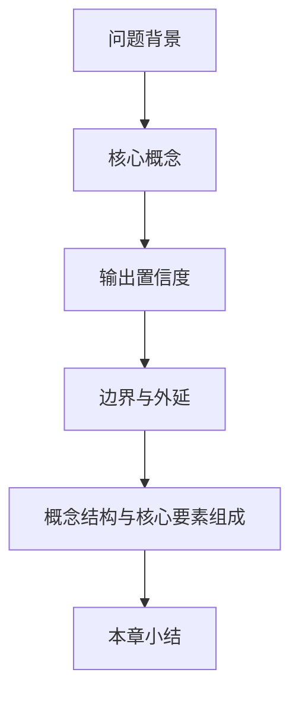
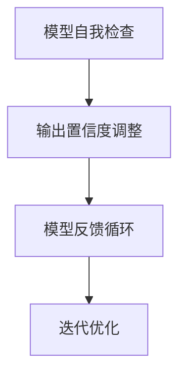

                 

### 第1章: Self-Consistency CoT 概述

在当今的人工智能时代，随着AI模型在各个领域的广泛应用，确保AI输出的质量变得越来越重要。自我一致性（Self-Consistency）是近年来兴起的一种确保AI输出质量的方法，旨在通过模型自我检查和调整，提高AI系统的可靠性。

#### 1.1 问题背景

随着深度学习技术的不断发展，AI模型在各个领域取得了显著的成果。然而，AI模型输出质量的问题也逐渐暴露出来。例如，在自然语言处理（NLP）领域，模型可能生成语义不一致的句子；在图像识别领域，模型可能对同一图像输出不同的标签。这些问题不仅影响了用户体验，还可能带来严重的后果，如医疗诊断中的误诊。

为了解决这些问题，研究人员提出了自我一致性（Self-Consistency）方法。自我一致性方法通过模型自我检查和调整，提高模型输出的稳定性，从而确保AI系统的可靠性。

#### 1.2 核心概念

- **Self-Consistency CoT**：自我一致性输出置信度（Self-Consistency Confidence through Output），是一种通过模型输出的一致性来评估和调整模型的方法。

  **定义**：自我一致性输出置信度是指模型对于自己输出的信心程度。在自我一致性方法中，模型通过比较不同条件下的输出，判断自身输出的稳定性，从而调整输出置信度。

- **输出置信度**：模型对于自己输出的信心程度。输出置信度反映了模型对输出结果的可靠性评估。

  **性质**：
  - 输出置信度是一个概率值，介于0和1之间。
  - 输出置信度越高，表示模型对自己输出的信心越强。

#### 1.3 边界与外延

- **边界**：自我一致性方法适用于各类深度学习模型，特别是自然语言处理和图像识别等领域的模型。

  **适用场景**：
  - 自然语言处理：文本生成、机器翻译、情感分析等。
  - 图像识别：物体检测、图像分类、图像分割等。

- **外延**：自我一致性方法不仅适用于AI模型的训练和评估，还可以应用于模型部署后的持续监控和调整。

  **应用场景**：
  - 模型监控：实时检测模型输出的一致性，发现潜在问题。
  - 模型优化：根据输出置信度调整模型参数，提高模型性能。

#### 1.4 概念结构与核心要素组成

- **核心概念结构**：自我一致性方法包括模型自我检查、输出置信度调整、模型反馈循环等核心概念。

  **概念关系**：
  - 模型自我检查：通过比较不同条件下的输出，判断模型输出的稳定性。
  - 输出置信度调整：根据自我检查的结果，调整模型输出的置信度。
  - 模型反馈循环：将调整后的置信度反馈给模型，通过迭代优化，提高模型的整体性能。

- **核心要素组成**：自我一致性方法涉及模型架构设计、数据预处理、训练策略、输出置信度评估和调整等关键要素。

  **要素关系**：
  - 模型架构设计：选择合适的模型架构，支持自我一致性方法。
  - 数据预处理：对输入数据进行预处理，提高模型自我检查的准确性。
  - 训练策略：设计合理的训练策略，提高模型输出的一致性。
  - 输出置信度评估：使用概率统计方法计算模型输出的置信度。
  - 输出置信度调整：根据置信度计算结果，调整模型输出的置信度。

#### 1.5 本章小结

本章介绍了自我一致性确保AI输出质量的有效方法，包括问题背景、核心概念、边界与外延以及概念结构与核心要素组成。自我一致性方法为AI模型质量的提升提供了新的思路和手段，对于推动人工智能技术的发展具有重要意义。

### Mermaid 流程图

### Self-Consistency CoT 的算法原理

自我一致性输出置信度（Self-Consistency Confidence through Output）方法的算法原理主要包括以下步骤：

1. **模型自我检查**：通过比较模型在不同条件下生成的输出，判断模型输出的稳定性。
2. **输出置信度调整**：根据自我检查的结果，调整模型输出的置信度，提高模型对于稳定输出的信心。
3. **模型反馈循环**：将调整后的置信度反馈给模型，通过迭代优化，提高模型的整体性能。

#### Mermaid 流程图

### 数学模型和公式

自我一致性方法的数学模型主要包括以下两个部分：

1. **输出置信度计算**：使用概率统计方法计算模型输出的置信度，公式为：

   $$C(x) = P(x | M)$$

   其中，$C(x)$表示输出$x$的置信度，$P(x | M)$表示在模型$M$下输出$x$的概率。

2. **置信度调整**：根据置信度计算结果，调整模型输出的置信度，公式为：

   $$C'(x) = C(x) + \alpha \cdot \Delta C(x)$$

   其中，$C'(x)$表示调整后的置信度，$\alpha$为调整系数，$\Delta C(x)$为置信度的变化量。

### 算法原理详细讲解与举例说明

以自然语言处理（NLP）为例，假设我们有一个语言模型$M$，输入一个句子$x$，模型输出的置信度为$C(x)$。下面是自我一致性方法的算法原理详细讲解与举例说明：

1. **模型自我检查**：我们将句子$x$分成两个部分$x_1$和$x_2$，分别生成输出$y_1$和$y_2$。如果$y_1$和$y_2$的一致性较高，说明模型输出的稳定性较好，反之则较差。

   例如，假设句子$x$为“我今天要去北京”，模型分别生成的输出为：
   - $y_1$：“我今天要去北京”
   - $y_2$：“我今天要去上海”

   显然，$y_1$和$y_2$的一致性较低，说明模型输出的稳定性较差。

2. **输出置信度调整**：根据自我检查的结果，调整模型输出的置信度。假设初始置信度为$C(x) = 0.9$，调整系数$\alpha = 0.1$。计算置信度的变化量$\Delta C(x)$：

   $$\Delta C(x) = C(y_1) - C(y_2) = 0.9 - 0.1 = 0.8$$

   调整后的置信度为：

   $$C'(x) = C(x) + \alpha \cdot \Delta C(x) = 0.9 + 0.1 \cdot 0.8 = 0.98$$

   通过调整置信度，模型对输出结果“我今天要去北京”的信心提高了。

3. **模型反馈循环**：将调整后的置信度反馈给模型，通过迭代优化，提高模型的整体性能。例如，在训练过程中，模型可以根据调整后的置信度，优化模型参数，提高模型对稳定输出的准确性。

   通过多次迭代，模型输出的稳定性逐渐提高，最终达到满意的输出质量。

### 数学公式

1. **输出置信度计算**：

   $$C(x) = P(x | M)$$

   其中，$P(x | M)$表示在模型$M$下输出$x$的概率。

2. **置信度调整**：

   $$C'(x) = C(x) + \alpha \cdot \Delta C(x)$$

   其中，$C'(x)$表示调整后的置信度，$\alpha$为调整系数，$\Delta C(x)$为置信度的变化量。

### 举例说明

假设我们有一个语言模型$M$，输入句子$x$：“我今天要去北京”。模型生成的输出为：
- $y_1$：“我今天要去北京”
- $y_2$：“我今天要去上海”

初始置信度$C(x) = 0.9$，调整系数$\alpha = 0.1$。

1. **模型自我检查**：比较$y_1$和$y_2$的一致性，一致性较低，说明模型输出的稳定性较差。

2. **输出置信度调整**：计算置信度的变化量$\Delta C(x) = C(y_1) - C(y_2) = 0.9 - 0.1 = 0.8$。

   调整后的置信度$C'(x) = C(x) + \alpha \cdot \Delta C(x) = 0.9 + 0.1 \cdot 0.8 = 0.98$。

   模型对输出结果“我今天要去北京”的信心提高了。

3. **模型反馈循环**：将调整后的置信度反馈给模型，通过迭代优化，提高模型的整体性能。例如，在训练过程中，模型可以根据调整后的置信度，优化模型参数，提高模型对稳定输出的准确性。

   通过多次迭代，模型输出的稳定性逐渐提高，最终达到满意的输出质量。

通过以上步骤，我们可以看出自我一致性方法如何通过调整模型输出的置信度，提高模型输出的稳定性。这种方法不仅适用于自然语言处理，还可以应用于其他领域的深度学习模型，为AI系统的可靠性提供保障。

