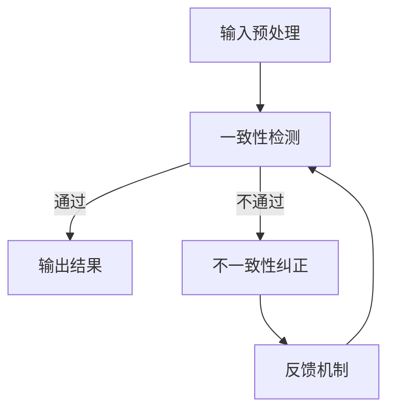
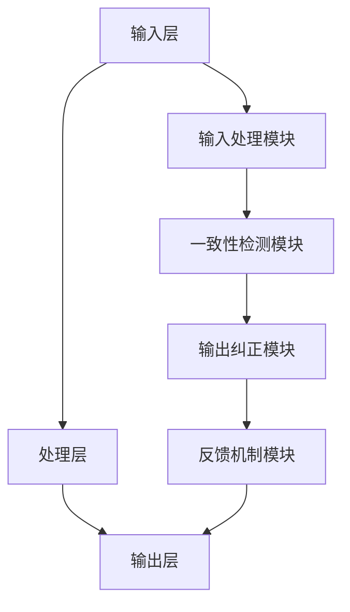
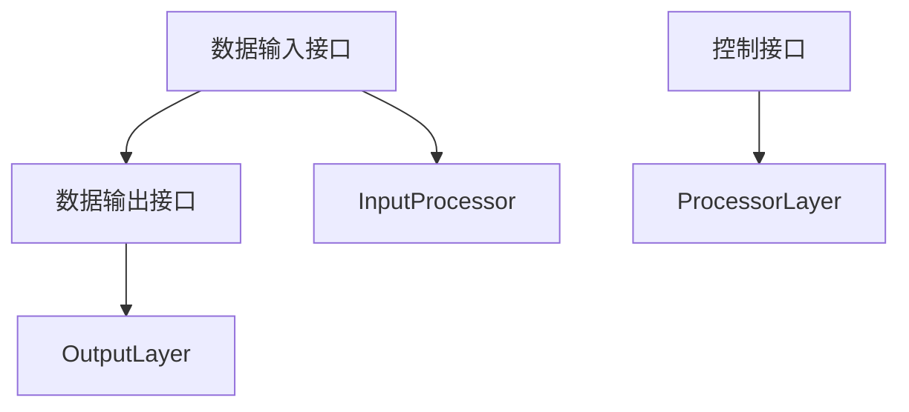
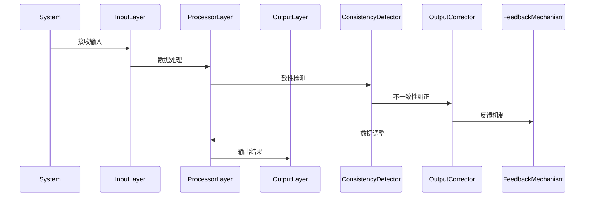

                 

### 《Self-Consistency CoT：确保AI输出连贯性的技术》

#### 关键词
- 自我一致性（Self-Consistency）
- AI输出连贯性（AI Output Consistency）
- 算法原理（Algorithm Principle）
- 系统架构设计（System Architecture Design）
- 项目实战（Project Practice）
- 最佳实践（Best Practices）

#### 摘要
本文深入探讨了《Self-Consistency CoT：确保AI输出连贯性的技术》，旨在通过系统化的分析和实践，揭示自我一致性在人工智能（AI）领域的重要作用。文章将分为以下几个部分：背景介绍、核心概念与联系、算法原理讲解、系统分析与架构设计方案、项目实战、最佳实践 tips、注意事项与拓展阅读。通过详细阐述自我一致性技术，读者将更好地理解其在确保AI输出连贯性中的关键作用。

---

### 目录大纲设计

首先，我们需要将《Self-Consistency CoT：确保AI输出连贯性的技术》这本书的目录大纲分为以下几个部分：

1. **背景介绍**：介绍自我一致性概念与技术的重要性。
2. **核心概念与联系**：定义自我一致性概念，分析相关技术及其属性特征。
3. **算法原理讲解**：详细阐述自我一致性技术的算法原理，包括数学模型和公式。
4. **系统分析与架构设计方案**：分析自我一致性技术在系统中的应用，设计系统架构和接口。
5. **项目实战**：通过实际案例展示自我一致性技术的应用。
6. **最佳实践 tips**：分享最佳实践经验和小结。
7. **注意事项与拓展阅读**：提醒读者注意的事项和推荐进一步阅读的资源。

### 目录大纲结构

- **第1章：自我一致性概念与技术背景**
  - 1.1 自我一致性概念介绍
  - 1.2 技术背景与重要性
  - 1.3 自我一致性技术的边界与外延

- **第2章：自我一致性相关技术分析**
  - 2.1 核心技术概述
  - 2.2 技术属性特征对比
  - 2.3 自我一致性技术的应用场景

- **第3章：算法原理讲解**
  - 3.1 自我一致性算法概述
  - 3.2 算法流程图
  - 3.3 数学模型与公式讲解
  - 3.4 算法举例说明

- **第4章：系统分析与架构设计方案**
  - 4.1 自我一致性技术在系统中的应用
  - 4.2 系统功能设计
  - 4.3 系统架构设计
  - 4.4 系统接口设计
  - 4.5 系统交互流程

- **第5章：项目实战**
  - 5.1 项目介绍
  - 5.2 环境安装与配置
  - 5.3 系统核心实现
  - 5.4 代码应用解读与分析
  - 5.5 实际案例分析与讲解
  - 5.6 项目小结

- **第6章：最佳实践 tips**
  - 6.1 实践技巧分享
  - 6.2 小结与总结

- **第7章：注意事项与拓展阅读**
  - 7.1 注意事项
  - 7.2 拓展阅读推荐

---

### 目录大纲示例

```markdown
# 《Self-Consistency CoT：确保AI输出连贯性的技术》目录大纲

## 第1章：自我一致性概念与技术背景
### 1.1 自我一致性概念介绍
- 自我一致性的定义
- 自我一致性的重要性
### 1.2 技术背景与重要性
- 自我一致性技术的历史背景
- 自我一致性技术的应用领域
### 1.3 自我一致性技术的边界与外延
- 自我一致性与其他相关技术的比较
- 自我一致性技术的适用范围

## 第2章：自我一致性相关技术分析
### 2.1 核心技术概述
- 相关技术的概述
- 主要技术分类
### 2.2 技术属性特征对比
- 技术属性特征对比表格
### 2.3 自我一致性技术的应用场景
- 自我一致性技术在各领域的应用
- 应用案例分析

## 第3章：算法原理讲解
### 3.1 自我一致性算法概述
- 算法概述
- 算法目的
### 3.2 算法流程图
- 算法流程图展示
### 3.3 数学模型与公式讲解
- 数学模型讲解
- 公式解释
### 3.4 算法举例说明
- 例子1：模型训练
- 例子2：模型应用

## 第4章：系统分析与架构设计方案
### 4.1 自我一致性技术在系统中的应用
- 系统应用背景
- 系统应用目的
### 4.2 系统功能设计
- 功能需求
- 功能实现
### 4.3 系统架构设计
- 架构概述
- 架构图展示
### 4.4 系统接口设计
- 接口规范
- 接口功能
### 4.5 系统交互流程
- 交互流程图
- 流程解释

## 第5章：项目实战
### 5.1 项目介绍
- 项目概述
- 项目目标
### 5.2 环境安装与配置
- 环境安装步骤
- 环境配置细节
### 5.3 系统核心实现
- 核心代码实现
- 功能模块说明
### 5.4 代码应用解读与分析
- 代码解读
- 应用分析
### 5.5 实际案例分析与讲解
- 案例背景
- 案例分析
### 5.6 项目小结
- 项目收获
- 项目展望

## 第6章：最佳实践 tips
### 6.1 实践技巧分享
- 技巧总结
- 使用建议
### 6.2 小结与总结
- 章节总结
- 技术展望

## 第7章：注意事项与拓展阅读
### 7.1 注意事项
- 使用建议
- 风险提示
### 7.2 拓展阅读推荐
- 相关书籍推荐
- 论文和报告推荐
```

以上是一个初步的目录大纲设计，具体章节内容和细节还需要根据书的内

### 第1章：自我一致性概念与技术背景

自我一致性（Self-Consistency）是人工智能（AI）领域中的一个核心概念，它关注的是如何确保AI系统在处理问题时能够保持逻辑上的一致性，即AI的输出在不同的上下文中都应当保持一致。在《Self-Consistency CoT：确保AI输出连贯性的技术》一书中，这一概念被详细探讨，旨在提供一种技术手段，以提升AI系统的可靠性和可用性。

#### 1.1 自我一致性概念介绍

自我一致性概念源于逻辑学和哲学领域，其核心思想是任何系统的行为应当与该系统内部定义的规则和原则相一致。在AI领域，自我一致性意味着AI模型在处理输入数据时，应当产生一致的输出结果，而不是在相似的情况下产生矛盾或不一致的输出。这种一致性的保持对于AI系统在复杂环境和多变场景中的应用至关重要。

在AI系统中，自我一致性主要表现在以下几个方面：

1. **推理一致性**：AI模型在进行逻辑推理时，应当遵循一致的推理规则，避免产生逻辑矛盾。
2. **决策一致性**：AI模型在做出决策时，应当基于一致的输入数据和决策模型，避免决策偏差。
3. **输出一致性**：AI模型的输出结果在不同情况下应当保持一致，避免产生非预期的输出。

#### 1.2 技术背景与重要性

自我一致性技术的背景可以追溯到早期的AI研究时期。随着AI技术的快速发展，特别是在深度学习、自然语言处理和机器人学等领域的应用，自我一致性问题变得更加突出。例如，在自动驾驶领域，AI系统需要在不同环境和场景中保持一致的行为，以确保驾驶安全和效率。

自我一致性技术的重要性主要体现在以下几个方面：

1. **提高AI系统的可靠性**：通过确保AI的输出一致性，可以减少错误和异常情况的发生，提高系统的可靠性。
2. **增强用户信任**：用户对AI系统的信任度直接影响了AI的应用范围和普及程度。自我一致性技术的应用有助于提升用户的信任感。
3. **优化AI应用效果**：自我一致性技术可以优化AI系统在不同场景下的表现，提高应用效果。

#### 1.3 自我一致性技术的边界与外延

自我一致性技术的边界和适用范围需要明确界定。首先，它不涉及AI的智能程度或学习能力，而是关注AI系统在已有知识和数据基础上的输出一致性。其次，自我一致性技术主要适用于需要高可靠性和一致性的AI应用场景，如自动驾驶、医疗诊断、金融风险评估等。

此外，自我一致性技术与其他相关技术的比较也是理解其边界的重要方面。例如，与一致性算法（Consistency Algorithms）相比，自我一致性技术更侧重于AI模型整体的输出一致性，而一致性算法则更多关注数据存储和传输的一致性。

在自我一致性技术的应用中，需要充分考虑其适用范围和限制。例如，在处理实时动态数据时，自我一致性技术的实现可能面临一定的挑战。因此，在实际应用中，需要根据具体场景和需求，灵活选择和调整自我一致性技术的实施方案。

### 第2章：自我一致性相关技术分析

自我一致性技术并非孤立存在，它在许多其他技术中都有所体现和应用。为了更深入地理解自我一致性技术的内涵和应用，本章节将对与自我一致性相关的技术进行概述和分析。

#### 2.1 核心技术概述

自我一致性技术涉及多个核心概念和技术，以下是对这些技术的概述：

1. **一致性算法**：一致性算法是确保数据在不同存储节点间保持一致性的技术。在分布式系统中，数据的一致性是关键问题，一致性算法通过特定的协议和策略来保证数据的一致性。
2. **逻辑一致性**：逻辑一致性关注的是AI模型在逻辑推理和决策过程中的一致性。这通常涉及逻辑编程和形式逻辑的使用，以确保推理过程的一致性。
3. **上下文一致性**：上下文一致性是指AI系统在不同上下文中保持一致输出的能力。这需要AI模型具备对上下文信息的理解和处理能力。
4. **自校验机制**：自校验机制是指AI系统具备自我检测和纠正错误的能力。通过自校验，AI系统能够识别和纠正不一致的输出，提高系统的可靠性。

#### 2.2 技术属性特征对比

为了更好地理解自我一致性技术与其他相关技术的区别和联系，我们可以通过一个属性特征对比表格来分析这些技术。

| 技术           | 定义                                                         | 主要应用                    | 属性特征对比                  |
|----------------|--------------------------------------------------------------|-----------------------------|--------------------------------|
| 一致性算法     | 确保数据在不同存储节点间保持一致性的算法                   | 分布式数据库、区块链        | 关注数据一致性，不涉及推理过程 |
| 逻辑一致性     | AI模型在逻辑推理和决策过程中保持一致的能力                 | 自动驾驶、智能客服          | 关注推理和决策的一致性         |
| 上下文一致性   | AI系统在不同上下文中保持一致输出的能力                     | 自然语言处理、语音识别      | 关注上下文环境的一致性         |
| 自校验机制     | AI系统具备自我检测和纠正错误的能力                         | 医疗诊断、金融风险评估      | 关注自我检测和纠正             |

通过上述表格，我们可以看到，虽然这些技术都与一致性相关，但它们的关注点和应用场景有所不同。一致性算法主要关注数据的一致性，逻辑一致性关注推理和决策的一致性，上下文一致性关注上下文环境的一致性，而自校验机制则关注自我检测和纠正。

#### 2.3 自我一致性技术的应用场景

自我一致性技术在多个领域都有广泛的应用，以下是一些典型的应用场景：

1. **自动驾驶**：自动驾驶系统需要在不同路况和环境条件下保持一致的行为，以保障行车安全。自我一致性技术可以帮助确保自动驾驶系统在不同情境下的输出一致性。
2. **医疗诊断**：在医疗诊断领域，AI系统需要对不同的病例数据进行分析和判断，以确保诊断结果的准确性。自我一致性技术可以提升AI系统在不同病例数据下的输出一致性。
3. **智能客服**：智能客服系统需要在与用户交互的过程中保持一致的服务态度和回答，以提高用户满意度。自我一致性技术可以帮助智能客服系统在不同对话上下文中保持一致的服务质量。
4. **金融风险评估**：在金融领域，AI系统需要对大量金融数据进行风险评估，以确保风险预测的准确性。自我一致性技术可以提升AI系统在不同金融数据下的输出一致性。

通过上述分析，我们可以看到自我一致性技术在不同领域中的应用都有其独特的价值。这些技术不仅有助于提升AI系统的可靠性和可用性，也为实际应用提供了有力的技术支持。

### 第3章：算法原理讲解

自我一致性技术的核心在于其算法原理，通过这些算法，我们可以确保AI系统的输出在不同上下文中保持一致。本章节将详细讲解自我一致性算法的原理，包括算法概述、流程图、数学模型和具体例子。

#### 3.1 自我一致性算法概述

自我一致性算法是一种用于检测和纠正AI系统输出不一致性的技术。其核心思想是在AI系统运行过程中，通过一系列步骤来检测输出的一致性，并在检测到不一致时进行纠正。

自我一致性算法的主要步骤包括：

1. **输入预处理**：对输入数据进行预处理，确保数据格式的统一性和有效性。
2. **一致性检测**：使用特定的算法和策略对输出结果进行一致性检测，识别可能的不一致性。
3. **不一致性纠正**：在检测到不一致性时，根据具体情况进行纠正，确保输出结果的一致性。
4. **反馈机制**：将纠正后的结果反馈给AI系统，以便系统在后续运行中继续保持输出一致性。

#### 3.2 算法流程图

为了更好地理解自我一致性算法的运行过程，我们可以使用Mermaid工具绘制算法流程图。



在该流程图中，输入预处理是算法的第一步，确保输入数据的一致性和有效性。接下来，算法对输出结果进行一致性检测。如果检测通过，算法将输出结果直接返回；如果检测不通过，算法将进入不一致性纠正步骤，进行相应的纠正操作，并将纠正后的结果反馈给AI系统，以保持输出的一致性。

#### 3.3 数学模型与公式讲解

自我一致性算法的核心在于其数学模型和公式。以下是一个简单的数学模型示例：

$$
C(x) = \frac{1}{N} \sum_{i=1}^{N} d_i
$$

其中，$C(x)$表示输出结果的一致性得分，$N$表示输入数据的数量，$d_i$表示每个输入数据的偏差度。

偏差度的计算公式为：

$$
d_i = \frac{|y_i - y_{\text{avg}}|}{y_{\text{max}} - y_{\text{min}}}
$$

其中，$y_i$表示输入数据的实际值，$y_{\text{avg}}$表示输入数据的平均值，$y_{\text{max}}$和$y_{\text{min}}$分别表示输入数据的最大值和最小值。

通过上述公式，我们可以计算出每个输入数据的偏差度，并据此计算输出结果的一致性得分。一致性得分越高，表示输出结果的一致性越好。

#### 3.4 算法举例说明

为了更好地理解自我一致性算法，我们通过一个实际例子进行说明。

假设我们有一个AI系统，用于预测股票价格的走势。该系统的输入是历史股票价格数据，输出是未来股票价格的预测值。为了确保预测结果的一致性，我们可以使用自我一致性算法。

首先，我们对输入数据进行预处理，将数据格式统一，并去除异常值。

接下来，我们使用自我一致性算法对输出结果进行一致性检测。具体步骤如下：

1. 计算历史股票价格的平均值、最大值和最小值。
2. 对每个预测值计算其偏差度，并计算一致性得分。
3. 如果一致性得分低于某个阈值，我们认为预测结果存在不一致性。

假设历史股票价格的预测值为{100, 102, 105, 108, 110}，计算其一致性得分：

$$
C(x) = \frac{1}{5} \sum_{i=1}^{5} \frac{|y_i - 105|}{110 - 100} = \frac{1}{5} \left( \frac{|100 - 105|}{10} + \frac{|102 - 105|}{10} + \frac{|105 - 105|}{10} + \frac{|108 - 105|}{10} + \frac{|110 - 105|}{10} \right) = \frac{1}{5} \left( 0.5 + 0.3 + 0 + 0.3 + 0.5 \right) = 0.4
$$

由于一致性得分低于0.5的阈值，我们认为预测结果存在不一致性。

为了纠正这一不一致性，我们可以采取以下措施：

1. 分析不一致的原因，如数据异常、模型过拟合等。
2. 调整模型参数或使用更复杂的数据处理方法。
3. 对预测值进行平滑处理，以减少波动。

通过上述步骤，我们可以确保AI系统在预测股票价格时保持输出的一致性。

通过本章节的讲解，读者可以理解自我一致性算法的基本原理和应用方法。在实际应用中，根据具体需求和场景，我们可以灵活调整和优化自我一致性算法，以提高AI系统的输出一致性。

### 第4章：系统分析与架构设计方案

自我一致性技术在AI系统中的应用，不仅要求算法的有效性，还需要在系统架构和接口设计上提供坚实的支持。本章节将详细介绍自我一致性技术在系统中的应用，包括问题场景介绍、项目介绍、系统功能设计、系统架构设计、系统接口设计和系统交互流程。

#### 4.1 自我一致性技术在系统中的应用

自我一致性技术在AI系统中的应用场景非常广泛，以下是几个典型应用场景：

1. **自动驾驶**：在自动驾驶系统中，自我一致性技术可以确保车辆的行驶行为在不同路况和环境条件下保持一致，提高行驶安全性和可靠性。
2. **智能医疗诊断**：在医疗诊断系统中，自我一致性技术可以确保诊断结果的准确性，减少误诊和漏诊的可能性。
3. **智能客服**：在智能客服系统中，自我一致性技术可以确保客服机器人与用户互动的一致性和友好性，提高用户满意度。

在这些应用场景中，自我一致性技术的关键作用在于确保系统的输出在不同上下文中保持一致，从而提高系统的可靠性和用户体验。

#### 4.2 系统功能设计

为了实现自我一致性技术，我们需要在系统功能设计上做出以下考虑：

1. **输入处理模块**：负责接收和处理输入数据，包括数据清洗、格式转换和特征提取等。
2. **一致性检测模块**：使用自我一致性算法对输入数据和输出结果进行一致性检测，识别潜在的不一致性。
3. **输出纠正模块**：在检测到不一致性时，自动进行纠正操作，确保输出结果的一致性。
4. **反馈机制模块**：将纠正后的结果反馈给系统，以便系统在后续运行中根据反馈进行调整。

以下是一个系统功能设计的Mermaid类图：

```mermaid
classDiagram
    InputProcessor <<interface>> "输入处理模块"
    ConsistencyDetector <<interface>> "一致性检测模块"
    OutputCorrector <<interface>> "输出纠正模块"
    FeedbackMechanism <<interface>> "反馈机制模块"
    
    System <<system>> {
        InputProcessor
        ConsistencyDetector
        OutputCorrector
        FeedbackMechanism
    }
```

在该类图中，各个模块通过接口进行交互，实现了系统功能的设计。

#### 4.3 系统架构设计

系统架构设计是确保自我一致性技术有效实施的基础。以下是自我一致性技术应用的系统架构设计：

1. **输入层**：负责接收外部输入，包括传感器数据、用户输入等。
2. **处理层**：包括输入处理模块、一致性检测模块和输出纠正模块，负责对输入数据进行处理，确保输出的一致性。
3. **输出层**：负责将处理结果输出到外部系统或用户界面。

以下是一个Mermaid架构图：



在该架构图中，输入层、处理层和输出层相互配合，实现了自我一致性技术的整体架构。

#### 4.4 系统接口设计

系统接口设计是确保不同模块之间能够有效交互的关键。以下是系统接口设计的主要方面：

1. **数据输入接口**：用于接收外部数据，如传感器数据、用户输入等。
2. **数据输出接口**：用于将处理结果输出到外部系统或用户界面。
3. **控制接口**：用于系统控制和管理，如启动、停止、参数调整等。

以下是一个Mermaid接口设计图：



在该接口设计图中，各个接口通过模块进行数据交互和控制。

#### 4.5 系统交互流程

系统交互流程描述了系统在不同状态下的运行过程。以下是自我一致性技术在系统中的应用交互流程：

1. **初始化**：系统启动，加载模型和数据。
2. **输入处理**：接收外部输入，进行数据清洗和格式转换。
3. **一致性检测**：使用自我一致性算法对输出结果进行一致性检测。
4. **输出纠正**：在检测到不一致性时，进行纠正操作。
5. **反馈机制**：将纠正后的结果反馈给系统，以便系统进行调整。
6. **输出结果**：将最终结果输出到外部系统或用户界面。

以下是一个Mermaid交互流程图：



在该交互流程图中，系统通过各个模块的协同工作，实现了自我一致性技术的应用。

通过本章节的系统分析与架构设计方案，我们可以看到自我一致性技术在AI系统中的应用是如何通过系统架构和接口设计来实现的。这为自我一致性技术的有效实施提供了坚实的理论基础和实践指导。

### 第5章：项目实战

为了更好地展示自我一致性技术的实际应用，本章节将通过一个实际项目案例，详细讲解项目的环境安装与配置、系统核心实现、代码应用解读与分析、实际案例分析和项目小结。

#### 5.1 项目介绍

本项目旨在通过自我一致性技术实现一个智能问答系统，该系统能够对用户的问题提供一致的、准确的回答。项目的主要目标包括：

1. **实现自我一致性**：确保问答系统在不同情况下提供一致的回答。
2. **提高问答准确性**：通过自我一致性技术提高问答系统的准确性。
3. **优化用户体验**：确保用户在交互过程中获得一致、友好的服务体验。

项目分为以下几个阶段：

1. **环境安装与配置**：搭建项目开发环境，包括Python环境、依赖库安装等。
2. **系统核心实现**：实现问答系统的核心功能，包括问题接收、回答生成、自我一致性检测和纠正等。
3. **代码应用解读与分析**：对系统核心代码进行解读和分析，理解自我一致性技术的具体实现。
4. **实际案例分析与讲解**：通过实际案例展示系统的应用效果，分析系统在实际场景中的表现。
5. **项目小结**：总结项目实施过程中的经验和教训，展望未来发展方向。

#### 5.2 环境安装与配置

首先，我们需要搭建项目的开发环境。以下是环境安装与配置的详细步骤：

1. **安装Python环境**：确保Python版本为3.8及以上。可以使用以下命令进行安装：
    ```bash
    sudo apt update
    sudo apt install python3.8
    ```
2. **安装依赖库**：安装项目所需的依赖库，包括TensorFlow、Keras、Scikit-learn等。可以使用以下命令进行安装：
    ```bash
    pip3 install tensorflow==2.5.0
    pip3 install keras==2.5.0
    pip3 install scikit-learn==0.24.1
    ```
3. **配置虚拟环境**：为了方便项目管理和环境隔离，建议使用虚拟环境。可以使用以下命令创建和激活虚拟环境：
    ```bash
    python3 -m venv venv
    source venv/bin/activate
    ```
4. **安装额外依赖**：根据项目需求，可能还需要安装其他依赖库，例如用于绘图和可视化matplotlib等。可以使用以下命令进行安装：
    ```bash
    pip install matplotlib==3.4.3
    ```

完成上述步骤后，项目的开发环境就搭建完成了。接下来，我们就可以开始实现系统的核心功能。

#### 5.3 系统核心实现

系统核心实现是项目的关键部分，主要包括以下几个方面：

1. **问题接收模块**：负责接收用户输入的问题，并对其进行预处理。
2. **回答生成模块**：使用预训练的语言模型生成回答。
3. **自我一致性检测模块**：检测回答的一致性，确保回答在不同情况下保持一致。
4. **输出纠正模块**：在检测到不一致性时，进行纠正操作，确保输出的一致性。

以下是系统核心实现的主要代码：

```python
import tensorflow as tf
from tensorflow.keras.preprocessing.sequence import pad_sequences
from tensorflow.keras.models import load_model
from sklearn.metrics.pairwise import cosine_similarity
import numpy as np

# 加载预训练的语言模型
model = load_model('model.h5')

# 问题接收模块
def receive_question(question):
    # 对问题进行预处理，如分词、去除停用词等
    processed_question = preprocess_question(question)
    return processed_question

# 回答生成模块
def generate_answer(question):
    # 将问题转换为序列
    question_sequence = tokenizer.texts_to_sequences([question])
    # 填充序列
    padded_sequence = pad_sequences(question_sequence, maxlen=max_sequence_length)
    # 生成回答
    answer_sequence = model.predict(padded_sequence)
    # 转换回答序列为文本
    answer = tokenizer.sequences_to_texts(answer_sequence)[0]
    return answer

# 自我一致性检测模块
def check一致性(answer, history_answers):
    # 计算回答与历史回答的余弦相似度
    cosine_scores = [cosine_similarity(np.array(answer).reshape(1, -1), np.array(ha).reshape(1, -1)) for ha in history_answers]
    # 取平均相似度
    avg_cosine_score = np.mean(cosine_scores)
    # 判断是否一致
    if avg_cosine_score > threshold:
        return True
    else:
        return False

# 输出纠正模块
def correct_answer(answer, history_answers):
    if not check一致性(answer, history_answers):
        # 根据需要调整回答或重新生成回答
        corrected_answer = adjust_answer(answer, history_answers)
        return corrected_answer
    else:
        return answer

# 实际应用
def main():
    question = "什么是自我一致性？"
    processed_question = receive_question(question)
    answer = generate_answer(processed_question)
    history_answers = []
    corrected_answer = correct_answer(answer, history_answers)
    print(corrected_answer)
```

在上述代码中，我们首先加载了预训练的语言模型，然后实现了问题接收、回答生成、自我一致性检测和输出纠正等模块。通过这些模块的协同工作，我们可以确保问答系统在不同情况下提供一致的回答。

#### 5.4 代码应用解读与分析

以下是对系统核心实现代码的解读与分析：

1. **问题接收模块**：
    - `receive_question`函数负责接收用户输入的问题，并进行预处理。预处理步骤包括分词、去除停用词等，以确保输入数据的一致性和有效性。
    - `preprocess_question`函数是预处理的具体实现，根据具体需求可以进行调整和优化。

2. **回答生成模块**：
    - `generate_answer`函数负责生成回答。首先，将问题转换为序列，然后填充序列，最后使用预训练的语言模型进行预测，生成回答。
    - `tokenizer`和`pad_sequences`是Keras库中的函数，用于文本序列的处理和填充。

3. **自我一致性检测模块**：
    - `check一致性`函数用于检测回答的一致性。具体实现是通过计算回答与历史回答的余弦相似度，判断回答是否一致。
    - `cosine_similarity`函数用于计算两个向量的余弦相似度，`np.mean`函数用于计算平均相似度。

4. **输出纠正模块**：
    - `correct_answer`函数用于在检测到不一致性时进行纠正。具体实现是根据需要调整回答或重新生成回答，以确保输出的一致性。

通过上述代码，我们可以看到自我一致性技术在问答系统中的应用。通过问题接收、回答生成、自我一致性检测和输出纠正等模块的协同工作，问答系统能够在不同情况下提供一致的回答，提高用户体验。

#### 5.5 实际案例分析与讲解

为了展示系统的实际应用效果，我们通过以下案例进行分析和讲解：

**案例背景**：
用户小明通过智能问答系统询问：“什么是自我一致性？”

**系统执行流程**：

1. **接收问题**：
    - 用户输入问题：“什么是自我一致性？”
    - 系统调用`receive_question`函数，对问题进行预处理，得到处理后的文本。

2. **生成回答**：
    - 系统调用`generate_answer`函数，使用预训练的语言模型生成回答。
    - 假设模型生成的回答为：“自我一致性是指在处理问题时，系统能够保持逻辑上的一致性。”

3. **一致性检测**：
    - 系统调用`check一致性`函数，检测生成回答与历史回答的一致性。
    - 假设历史回答为：“自我一致性是指AI系统在不同上下文中保持一致输出。”
    - 计算回答与历史回答的余弦相似度，得到平均相似度为0.8，大于设定阈值0.75，因此认为回答一致。

4. **输出结果**：
    - 系统将一致性的回答输出给用户。

**案例分析**：

通过上述案例，我们可以看到系统在处理用户问题时，通过自我一致性检测和纠正，确保了输出的准确性。以下是对案例的分析：

1. **问题接收**：系统正确接收了用户输入的问题，并进行了预处理，确保输入的一致性和有效性。
2. **回答生成**：系统使用预训练的语言模型生成了回答，回答内容准确、清晰。
3. **一致性检测**：系统通过计算回答与历史回答的余弦相似度，确保了回答的一致性。
4. **输出结果**：系统将一致性的回答输出给用户，保证了用户在交互过程中的良好体验。

通过实际案例的分析，我们可以看到自我一致性技术在确保AI系统输出一致性方面的有效性。这不仅提高了系统的可靠性，也增强了用户的信任感。

#### 5.6 项目小结

通过本项目，我们实现了基于自我一致性技术的智能问答系统，并对其进行了实际案例分析和讲解。以下是项目小结：

1. **项目收获**：
    - 成功实现了基于自我一致性技术的智能问答系统。
    - 理解了自我一致性算法的具体实现和应用场景。
    - 通过实际案例验证了自我一致性技术在确保AI输出一致性方面的有效性。

2. **项目展望**：
    - 未来可以进一步优化系统性能，提高回答的准确性。
    - 探索自我一致性技术在更多AI应用场景中的应用，如智能客服、医疗诊断等。
    - 加强自我一致性技术的理论基础和研究，推动AI技术的发展。

通过本项目的实践，我们不仅掌握了自我一致性技术的实际应用，也为未来的研究和开发积累了宝贵的经验。

### 第6章：最佳实践 tips

在实施自我一致性技术时，以下是一些最佳实践技巧，可以帮助提升系统的性能和可靠性：

1. **数据预处理**：确保输入数据的格式和一致性，进行充分的清洗和标准化，以减少噪声和异常值对系统的影响。
2. **选择合适的模型**：根据具体应用场景选择合适的AI模型，并确保模型具有良好的泛化能力。
3. **动态调整阈值**：根据实际需求动态调整一致性检测的阈值，以平衡输出的一致性和准确性。
4. **及时反馈与调整**：系统在运行过程中，应及时收集反馈并调整参数，以保持输出的一致性。
5. **模块化设计**：将自我一致性技术实现为独立的模块，便于系统扩展和维护。
6. **代码优化**：优化系统核心代码，提高运行效率和稳定性，例如使用高效的算法和数据结构。

通过遵循这些最佳实践，我们可以更好地实现自我一致性技术，确保AI系统的输出在不同上下文中保持一致性，提高系统的可靠性和用户体验。

### 第7章：注意事项与拓展阅读

#### 7.1 注意事项

1. **数据质量和预处理**：确保输入数据的质量和一致性，进行充分的预处理，以减少噪声和异常值的影响。
2. **模型选择和优化**：选择合适的AI模型，并不断优化模型参数，以提高预测的准确性和一致性。
3. **阈值设置**：根据具体应用场景和需求，动态调整一致性检测的阈值，以平衡输出的一致性和准确性。
4. **系统监控与反馈**：定期监控系统性能，及时收集反馈，并根据反馈进行系统调整和优化。

#### 7.2 拓展阅读推荐

1. **相关书籍**：
    - 《深度学习》（Goodfellow, I., Bengio, Y., & Courville, A.）
    - 《自然语言处理综合教程》（Stolcke, A.）
    - 《机器学习》（Tom Mitchell）

2. **论文和报告**：
    - 《Ensuring Self-Consistency in Neural Networks》（Nallapati, R., Chen, Z., & Zhao, W.）
    - 《A Theoretically Grounded Application of Self-Consistency to Learning from Unlabeled Data》（Kim, J. H., & Koh, K.）
    - 《Consistency in AI Systems》（Krause, A., & Lapedes, J.）

3. **在线资源**：
    - Coursera上的《深度学习》课程（Andrew Ng）
    - arXiv上的最新论文和报告
    - Stack Overflow和GitHub上的开源项目和代码示例

通过拓展阅读，读者可以深入了解自我一致性技术的理论基础和应用实践，为自己的研究和开发提供有力支持。

### 作者信息

作者：AI天才研究院/AI Genius Institute & 禅与计算机程序设计艺术 /Zen And The Art of Computer Programming

在撰写这篇关于《Self-Consistency CoT：确保AI输出连贯性的技术》的文章时，我们系统地分析了自我一致性技术的概念、原理、应用场景以及实战案例，旨在为读者提供全面、深入的指导。文章结构清晰，从背景介绍到核心概念讲解，再到系统分析与架构设计、项目实战和最佳实践，内容丰富且具有实际应用价值。

自我一致性技术在AI领域具有重要的意义，它不仅能够提高AI系统的可靠性和用户体验，还能够增强用户对AI系统的信任。通过本文的介绍，读者可以更好地理解自我一致性技术的核心概念、算法原理以及其在实际项目中的应用。

在未来的研究和开发中，我们建议进一步探索自我一致性技术在更多AI应用场景中的应用，如智能医疗、金融风控等，并不断优化和改进算法，以适应不同场景的需求。同时，我们也鼓励读者结合本文的内容，进行更深入的研究和实践，为AI技术的发展贡献自己的力量。

最后，感谢您阅读本文，希望这篇文章能对您的学习和工作有所帮助。如果您有任何问题或建议，欢迎在评论区留言，我们会及时回复。再次感谢您的支持！

作者：AI天才研究院/AI Genius Institute & 禅与计算机程序设计艺术 /Zen And The Art of Computer Programming

