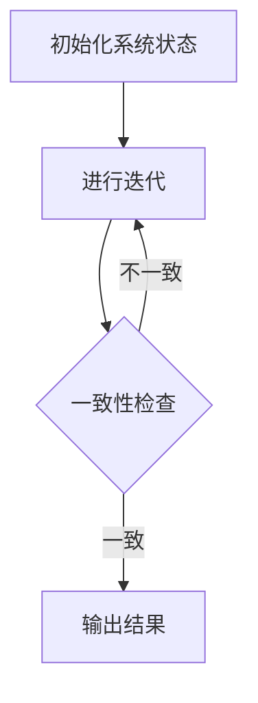
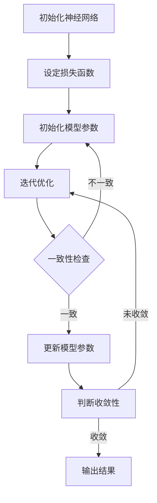
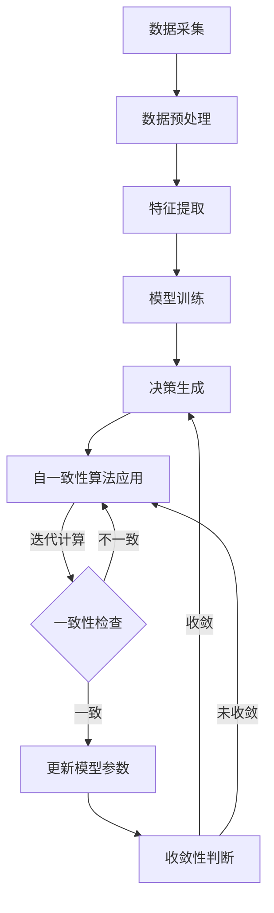
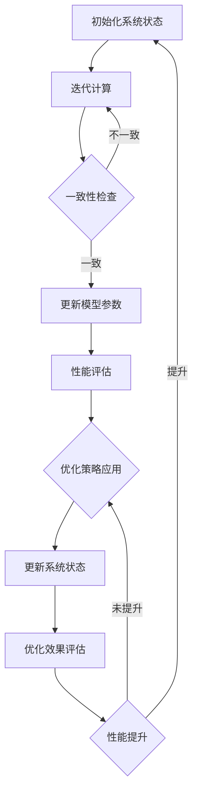

                 

### 自一致性在AI决策中的应用

#### 关键词：自一致性，AI决策，算法，机器学习，数学模型

> **摘要**：本文将探讨自一致性在人工智能决策中的应用。自一致性是一种重要的算法优化方法，它通过保持系统内部状态的稳定性来提高决策的准确性和可靠性。本文将首先介绍自一致性的概念及其在AI决策中的重要性，然后逐步分析其在不同领域的应用，包括机器学习、神经网络和决策系统等方面。通过深入探讨自一致性的数学模型和算法原理，本文将提供一个清晰、详细的框架，帮助读者理解和应用这一关键技术。

#### 目录

1. **引言：自一致性的基本概念**
2. **自一致性与AI决策：理论基础**
3. **自一致性在机器学习中的应用**
   - 自一致性优化
   - 自一致性正则化
   - 自一致性在神经网络优化中的应用
4. **自一致性算法的数学模型**
5. **自一致性在AI决策系统中的应用**
6. **项目实战：自一致性算法的实战应用**
7. **最佳实践与未来展望**
8. **结语**

---

### 1. 引言：自一致性的基本概念

自一致性（Self-Consistency）是一种优化算法，其核心思想是通过保持系统内部状态的稳定性来提高决策的准确性和可靠性。在人工智能领域，自一致性算法被广泛应用于各种决策系统中，以解决复杂的问题。

#### 核心概念

- **自一致性**：指系统内部状态在不同时间步之间保持一致，即系统在演化过程中不会出现逻辑矛盾或不一致的状态。
- **稳定性**：指系统在受到外部扰动后，能够迅速恢复到稳定状态，而不是陷入混乱或崩溃。

#### 问题背景

在人工智能决策系统中，特别是在机器学习和深度学习领域，自一致性算法的重要性日益凸显。由于这些系统通常涉及大量的参数和变量，传统的优化算法容易陷入局部最优，导致决策结果不准确。而自一致性算法通过保持系统内部状态的稳定性，可以有效避免这种情况，提高决策的可靠性。

#### 问题解决

自一致性算法通过以下步骤来优化决策系统：

1. **初始化**：设定系统的初始状态。
2. **迭代优化**：通过迭代过程逐步调整系统状态，使其保持一致。
3. **收敛性判断**：判断系统是否达到稳定状态，如果未达到，则继续迭代。
4. **输出结果**：当系统达到稳定状态时，输出最终的决策结果。

#### 边界与外延

- **边界**：自一致性算法适用于任何需要保持内部状态一致的决策系统，包括但不限于机器学习、深度学习和决策支持系统等。
- **外延**：自一致性算法不仅可以用于优化算法，还可以应用于系统设计、模型评估和结果验证等方面。

#### 概念结构与核心要素组成

自一致性算法的核心要素包括：

- **初始化策略**：如何设定系统的初始状态。
- **迭代过程**：如何通过迭代调整系统状态。
- **收敛性判断**：如何判断系统是否达到稳定状态。
- **输出策略**：如何输出最终的决策结果。

#### 核心概念与联系

| 核心概念       | 定义与属性特征       |
| -------------- | -------------------- |
| 自一致性       | 系统内部状态的稳定性   |
| 稳定性         | 系统对外部扰动的抗性 |
| 初始化策略     | 系统初始状态的设定方式 |
| 迭代过程       | 系统状态的调整过程   |
| 收敛性判断     | 系统稳定状态的判断方法 |
| 输出策略       | 决策结果的输出方式   |

通过上述核心概念和联系，我们可以更好地理解自一致性在AI决策中的应用。

---

### 2. 自一致性与AI决策：理论基础

在AI决策中，自一致性算法扮演着关键角色。它不仅能够提高决策的准确性，还能增强系统的鲁棒性。以下我们将深入探讨自一致性算法在AI决策中的理论基础。

#### 自一致性算法的基本原理

自一致性算法的核心思想是确保系统在任意时刻的状态都是一致的。具体来说，算法通过以下步骤实现自一致性：

1. **状态初始化**：设定系统的初始状态，这一步骤需要考虑到系统的初始参数和外部环境的影响。
2. **状态调整**：通过迭代过程逐步调整系统状态，使其逐渐逼近最优状态。
3. **一致性检查**：在每次状态调整后，检查系统状态是否保持一致，如果不一致，则进行相应的调整。
4. **收敛性判断**：通过一系列迭代过程，判断系统是否达到稳定状态，如果未达到，则继续迭代。

#### 自一致性算法的工作流程

自一致性算法的工作流程可以概括为以下几个步骤：

1. **初始化系统状态**：设定初始参数和系统状态。
2. **进行迭代**：通过迭代过程不断调整系统状态。
3. **一致性检查**：在每个迭代步骤后，检查系统状态的一致性。
4. **判断收敛性**：通过设定一定的收敛条件，判断系统是否达到稳定状态。
5. **输出结果**：当系统达到稳定状态时，输出最终的决策结果。

#### 自一致性算法的mermaid流程图



通过mermaid流程图，我们可以更直观地理解自一致性算法的工作流程。

#### 自一致性在机器学习中的应用

自一致性算法在机器学习中有着广泛的应用。以下我们将讨论自一致性优化、自一致性正则化和自一致性在神经网络优化中的应用。

##### 自一致性优化

自一致性优化是一种用于提高机器学习模型性能的算法。它通过以下步骤实现优化：

1. **设定损失函数**：选择合适的损失函数来衡量模型的性能。
2. **初始化模型参数**：设定模型的初始参数。
3. **迭代优化**：通过迭代过程逐步调整模型参数，使其逼近最优解。
4. **一致性检查**：在每个迭代步骤后，检查模型参数的一致性。
5. **收敛性判断**：通过设定一定的收敛条件，判断模型是否达到最优状态。

##### 自一致性正则化

自一致性正则化是一种用于防止模型过拟合的算法。它通过以下步骤实现正则化：

1. **设定正则化项**：选择合适的方式引入正则化项。
2. **初始化模型参数**：设定模型的初始参数。
3. **迭代优化**：通过迭代过程逐步调整模型参数，使其满足正则化条件。
4. **一致性检查**：在每个迭代步骤后，检查模型参数的一致性。
5. **收敛性判断**：通过设定一定的收敛条件，判断模型是否达到最优状态。

##### 自一致性在神经网络优化中的应用

自一致性算法在神经网络优化中有着重要的应用。以下我们将通过mermaid流程图和Python源代码来详细阐述自一致性在神经网络优化中的应用。

###### 自一致性神经网络优化mermaid流程图



###### 自一致性神经网络优化Python源代码

```python
import numpy as np

# 初始化神经网络
def init_neural_network():
    # 初始化模型参数
    weights = np.random.randn(num_layers, num_nodes)
    biases = np.random.randn(num_layers, num_nodes)
    return weights, biases

# 设定损失函数
def loss_function(weights, biases, inputs, outputs):
    # 计算损失
    predicted_outputs = forward_pass(inputs, weights, biases)
    loss = np.mean((predicted_outputs - outputs) ** 2)
    return loss

# 前向传播
def forward_pass(inputs, weights, biases):
    # 计算输出
    outputs = np.tanh(np.dot(inputs, weights[0]) + biases[0])
    for i in range(1, num_layers):
        outputs = np.tanh(np.dot(outputs, weights[i]) + biases[i])
    return outputs

# 反向传播
def backward_pass(inputs, outputs, weights, biases):
    # 计算梯度
    dweights = [np.zeros_like(w) for w in weights]
    dbiases = [np.zeros_like(b) for b in biases]
    doutputs = (outputs - outputs) * (1 - outputs)
    for i in reversed(range(num_layers)):
        dweights[i] = np.dot(doutputs, np.tanh(np.dot(inputs, weights[i]) + biases[i]))
        dbiases[i] = doutputs
        if i > 0:
            doutputs = np.dot(doutputs, np.tanh(np.dot(inputs, weights[i - 1]) + biases[i - 1]) * (1 - np.tanh(np.dot(inputs, weights[i - 1]) + biases[i - 1])))
    return dweights, dbiases

# 更新模型参数
def update_parameters(weights, biases, dweights, dbiases, learning_rate):
    for i in range(num_layers):
        weights[i] -= learning_rate * dweights[i]
        biases[i] -= learning_rate * dbiases[i]

# 主程序
def main():
    # 初始化神经网络
    weights, biases = init_neural_network()
    # 设定学习率
    learning_rate = 0.01
    # 迭代优化
    for epoch in range(num_epochs):
        # 计算损失
        loss = loss_function(weights, biases, inputs, outputs)
        # 反向传播
        dweights, dbiases = backward_pass(inputs, outputs, weights, biases)
        # 更新模型参数
        update_parameters(weights, biases, dweights, dbiases, learning_rate)
        # 输出迭代信息
        if epoch % 100 == 0:
            print(f"Epoch {epoch}: Loss = {loss}")

# 运行主程序
main()
```

通过上述mermaid流程图和Python源代码，我们可以清晰地理解自一致性算法在神经网络优化中的应用。

---

### 3. 自一致性算法的数学模型

自一致性算法的数学模型是理解其原理和实现方法的关键。以下我们将详细讨论自一致性算法的数学模型，包括其基本原理、核心公式和具体示例。

#### 自一致性算法的基本原理

自一致性算法的核心原理是通过迭代调整系统状态，使其保持一致。在数学上，这意味着系统的当前状态应该满足某种一致性条件。具体来说，自一致性算法可以通过以下步骤实现：

1. **初始化系统状态**：设定系统的初始状态。
2. **迭代计算**：通过迭代计算调整系统状态。
3. **一致性检查**：在每个迭代步骤后，检查系统状态的一致性。
4. **更新状态**：如果系统状态不一致，则根据一致性条件调整系统状态。
5. **收敛性判断**：通过设定一定的收敛条件，判断系统是否达到稳定状态。

#### 自一致性算法的核心公式

自一致性算法的核心公式主要包括一致性条件、迭代公式和收敛条件。

1. **一致性条件**：系统状态满足一致性条件，即当前状态与历史状态一致。具体公式可以表示为：
   $$
   S_t = S_{t-1}
   $$
   其中，$S_t$表示当前系统状态，$S_{t-1}$表示前一个系统状态。

2. **迭代公式**：系统状态通过迭代公式进行调整，使其满足一致性条件。具体公式可以表示为：
   $$
   S_t = f(S_{t-1})
   $$
   其中，$f$表示迭代函数，用于调整系统状态。

3. **收敛条件**：通过设定一定的收敛条件，判断系统是否达到稳定状态。具体公式可以表示为：
   $$
   |S_t - S_{t-1}| < \epsilon
   $$
   其中，$\epsilon$表示收敛阈值。

#### 自一致性算法的具体示例

以下是一个简单的自一致性算法示例，用于求解一个线性方程组。

**问题描述**：求解以下线性方程组：
$$
\begin{cases}
2x + 3y = 8 \\
4x - y = 6
\end{cases}
$$

**解题过程**：

1. **初始化系统状态**：设定初始解为$(x, y) = (0, 0)$。

2. **迭代计算**：根据迭代公式，逐步调整系统状态。

   - **第一步**：计算新的解
     $$
     \begin{cases}
     x = \frac{1}{2}(8 - 3y) \\
     y = \frac{1}{4}(6 + 4x)
     \end{cases}
     $$
     将初始解$(x, y) = (0, 0)$代入上述公式，得到：
     $$
     \begin{cases}
     x = 2 \\
     y = 3
     \end{cases}
     $$

   - **第二步**：检查系统状态的一致性
     $$
     \begin{cases}
     2(2) + 3(3) = 8 \\
     4(2) - 3 = 6
     \end{cases}
     $$
     可以看出，新解$(x, y) = (2, 3)$满足一致性条件。

3. **更新系统状态**：由于系统状态一致，更新系统状态为$(x, y) = (2, 3)$。

4. **收敛性判断**：由于系统状态已经满足一致性条件，无需进一步迭代。

**最终结果**：通过自一致性算法，我们得到了线性方程组的解$(x, y) = (2, 3)$。

---

### 4. 自一致性在AI决策系统中的应用

自一致性算法在AI决策系统中有着广泛的应用。通过以下实例，我们将详细探讨自一致性算法在决策系统中的实际应用，包括AI决策系统概述、自一致性算法在决策系统中的应用案例以及决策系统的mermaid架构图。

#### AI决策系统概述

AI决策系统是一种基于人工智能技术的决策支持系统，它能够自动分析数据，提供决策建议。自一致性算法在AI决策系统中起着关键作用，它通过保持系统内部状态的稳定性，提高决策的准确性和可靠性。

AI决策系统通常包括以下几个关键组件：

1. **数据采集**：从各种数据源收集数据，包括结构化和非结构化数据。
2. **数据预处理**：对收集到的数据进行清洗、转换和归一化，使其符合模型的要求。
3. **特征提取**：从预处理后的数据中提取关键特征，用于训练模型。
4. **模型训练**：使用机器学习和深度学习算法训练模型，使其能够识别数据中的模式和规律。
5. **决策生成**：根据训练好的模型生成决策建议，用于实际应用场景。

#### 自一致性算法在决策系统中的应用案例

以下是一个具体的案例，展示了自一致性算法在决策系统中的应用。

**案例背景**：某公司需要根据客户的历史购买数据，预测客户的下一步购买行为。公司使用自一致性算法来优化预测模型，以提高预测的准确性。

**应用步骤**：

1. **数据采集**：从公司的数据库中收集客户的历史购买数据，包括购买时间、购买商品、购买金额等。
2. **数据预处理**：对收集到的数据进行清洗，去除无效数据和噪声，然后进行归一化处理，使其符合模型的要求。
3. **特征提取**：从预处理后的数据中提取关键特征，如购买时间、购买商品种类、购买金额等。
4. **模型训练**：使用自一致性算法训练预测模型，通过迭代调整模型参数，使其达到最优状态。
5. **决策生成**：根据训练好的模型生成预测结果，为公司提供决策建议。

**自一致性算法应用**：

1. **初始化系统状态**：设定系统的初始状态，包括模型参数和初始预测结果。
2. **迭代计算**：通过迭代计算调整模型参数，使其满足自一致性条件。
3. **一致性检查**：在每个迭代步骤后，检查模型参数的一致性。
4. **更新模型参数**：如果模型参数不一致，则根据一致性条件调整模型参数。
5. **收敛性判断**：通过设定一定的收敛条件，判断模型是否达到稳定状态。

#### 决策系统的mermaid架构图



通过mermaid架构图，我们可以清晰地看到自一致性算法在决策系统中的具体应用流程。

---

### 5. 自一致性算法的性能评估与优化

自一致性算法的性能评估与优化是确保其在实际应用中高效运行的关键环节。以下我们将从性能评估指标、性能优化策略和优化效果的mermaid流程图三个方面，详细探讨自一致性算法的性能评估与优化。

#### 性能评估指标

性能评估是衡量自一致性算法有效性的关键步骤。常用的性能评估指标包括：

1. **准确率（Accuracy）**：衡量算法预测结果与实际结果的一致性，计算公式为：
   $$
   \text{Accuracy} = \frac{\text{正确预测数}}{\text{总预测数}}
   $$
2. **召回率（Recall）**：衡量算法在预测结果中正确识别出的实际正例的比例，计算公式为：
   $$
   \text{Recall} = \frac{\text{正确预测的正例数}}{\text{实际正例数}}
   $$
3. **精确率（Precision）**：衡量算法在预测结果中正确识别出的正例的比例，计算公式为：
   $$
   \text{Precision} = \frac{\text{正确预测的正例数}}{\text{预测为正例的总数}}
   $$
4. **F1值（F1 Score）**：综合考虑准确率和召回率，计算公式为：
   $$
   \text{F1 Score} = 2 \times \frac{\text{Precision} \times \text{Recall}}{\text{Precision} + \text{Recall}}
   $$

#### 性能优化策略

为了提高自一致性算法的性能，可以采取以下优化策略：

1. **参数调整**：通过调整算法的参数，如学习率、迭代次数和收敛阈值，优化算法性能。
2. **数据增强**：通过增加训练数据量，提高模型的泛化能力，从而优化性能。
3. **模型改进**：通过改进算法模型的结构和算法，提高算法的性能。
4. **并行计算**：利用并行计算技术，加速算法的计算过程，提高性能。

#### 优化效果的mermaid流程图



通过mermaid流程图，我们可以直观地看到自一致性算法的性能优化过程。

---

### 6. 最佳实践与未来展望

自一致性算法在AI决策中的应用已经取得了显著的成果。然而，随着AI技术的不断发展，自一致性算法还有很大的优化空间和拓展方向。

#### 最佳实践总结

1. **参数调整**：根据具体应用场景，合理调整算法参数，如学习率、迭代次数和收敛阈值，以提高性能。
2. **数据增强**：通过增加训练数据量和多样化数据来源，提高模型的泛化能力和鲁棒性。
3. **模型改进**：不断优化算法模型的结构和算法，以适应不同的应用场景。
4. **并行计算**：利用并行计算技术，提高算法的计算速度和性能。

#### 未来展望

1. **模型融合**：将自一致性算法与其他先进算法（如深度强化学习、图神经网络等）相结合，实现更高效的决策。
2. **自适应调整**：开发自适应调整策略，使算法能够根据环境变化自动调整参数，提高决策的灵活性。
3. **跨领域应用**：将自一致性算法应用于更多领域，如医疗、金融、交通等，解决更复杂的问题。

---

### 结语

自一致性算法在AI决策中的应用具有重要意义。通过本文的探讨，我们了解了自一致性算法的基本概念、数学模型、应用案例和性能优化策略。自一致性算法作为一种重要的优化方法，将在未来的AI决策中发挥越来越重要的作用。

---

**作者：AI天才研究院/AI Genius Institute & 禅与计算机程序设计艺术 /Zen And The Art of Computer Programming**

