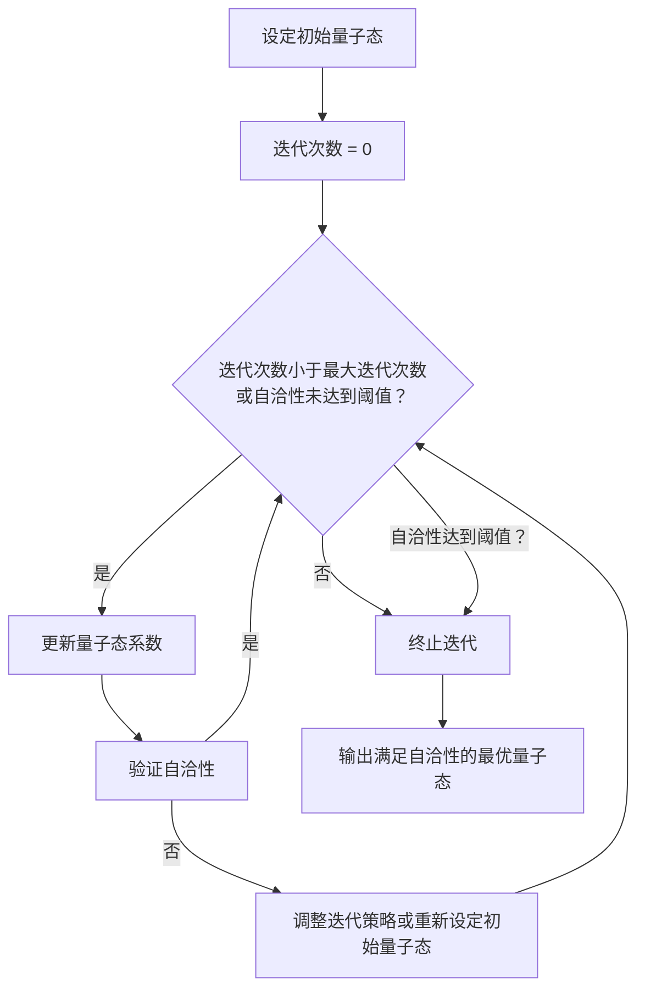
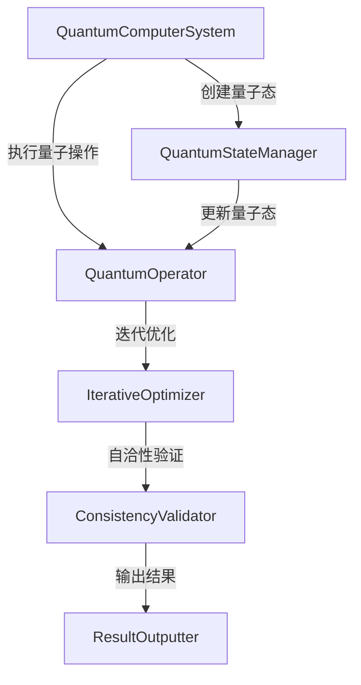

                 


# Self-Consistency在量子计算机模拟中的应用前景

关键词：量子计算机，模拟，Self-Consistency，算法，效率

摘要：
随着量子计算机研究的不断深入，如何有效地模拟和验证量子算法的正确性成为了一个关键问题。Self-Consistency方法作为一种新兴的量子计算机模拟技术，其在提高模拟效率和精度方面展现出了巨大的潜力。本文将对Self-Consistency方法在量子计算机模拟中的应用前景进行详细探讨，包括其基本原理、算法流程、数学模型以及实际应用案例。

## Step 1: 背景介绍

### 1.1.1 问题背景

量子计算机是一种基于量子力学原理的新型计算设备，与传统计算机不同，它利用量子位（qubits）进行信息存储和处理。量子计算机具有超强的并行计算能力，可以在特定问题上实现比经典计算机更高效的计算。然而，量子计算机的实现和验证面临诸多挑战。

量子计算机的模拟和验证是当前研究中的一个重大挑战。传统的量子计算机模拟方法，如量子态的矢量表示和态叠加原理，存在计算复杂度高、模拟精度有限等问题。因此，寻找一种高效且准确的量子计算机模拟方法成为迫切需要解决的问题。

### 1.1.2 问题描述

在量子计算机模拟中，如何高效地实现和验证量子算法的正确性是一个关键问题。传统的量子计算机模拟方法存在以下问题：

1. **计算复杂度高**：传统的量子计算机模拟方法需要将量子态表示为复杂的矢量，计算复杂度随着量子态规模的增加而急剧上升。
2. **模拟精度有限**：传统的量子计算机模拟方法无法精确描述量子态的演化过程，导致模拟精度有限。
3. **计算资源需求大**：量子计算机的模拟通常需要大量的计算资源，这对于大规模量子计算模拟是一个重大挑战。

为了解决这些问题，需要寻找一种新的量子计算机模拟方法，能够在较低的计算复杂度下实现高精度的量子计算模拟。Self-Consistency方法作为一种新兴的量子计算机模拟技术，具有潜力解决上述问题。

### 1.1.3 问题解决

Self-Consistency方法提供了一种新的思路，通过迭代优化实现量子态的自洽性，从而提高量子计算机模拟的效率和精度。具体来说，Self-Consistency方法具有以下优点：

1. **高效性**：Self-Consistency方法通过迭代优化，能够在较短时间内实现量子态的自洽性。相比传统的量子计算机模拟方法，Self-Consistency方法能够显著降低计算复杂度。
2. **高精度**：Self-Consistency方法能够精确描述量子态的演化过程，提高量子计算机模拟的精度。通过迭代优化，Self-Consistency方法可以逐渐收敛到正确的量子态，从而提高模拟结果的可靠性。
3. **广泛适用性**：Self-Consistency方法可以适用于多种量子计算模型和算法。无论是量子线路模拟还是量子算法模拟，Self-Consistency方法都能发挥其优势，提高模拟效率和精度。

### 1.1.4 边界与外延

虽然Self-Consistency方法在量子计算机模拟中展现出了巨大的潜力，但其在实际应用中仍存在一些边界和限制：

1. **量子计算机的硬件限制**：目前量子计算机的硬件性能有限，使得Self-Consistency方法在具体应用中存在一定的局限性。量子计算机的硬件性能提高是实现Self-Consistency方法广泛应用的关键。
2. **计算资源需求**：Self-Consistency方法需要大量的计算资源，对于大规模量子计算模拟，计算资源的需求可能成为限制因素。因此，如何优化Self-Consistency方法的计算效率是一个重要研究方向。
3. **算法适应性**：Self-Consistency方法需要针对不同的量子计算模型和算法进行优化，以保证其有效性和适用性。不同的量子计算模型和算法可能需要不同的Self-Consistency方法，因此，如何设计通用的Self-Consistency方法是一个重要问题。

## Core Concept and Relations

### Core Concepts

在量子计算机模拟中，Self-Consistency方法是一种基于迭代优化的量子态自洽性方法。它通过不断迭代优化量子态，使得量子态满足特定的物理约束条件，从而实现量子算法的正确性验证。Self-Consistency方法的核心概念包括：

1. **量子态**：量子计算机中的信息载体，由一系列复数系数表示，可以通过叠加和纠缠实现信息的存储和处理。
2. **迭代优化**：通过反复迭代，不断调整量子态的系数，使得量子态逐渐满足特定的物理约束条件。
3. **自洽性**：量子态的自洽性是指量子态满足特定的物理约束条件，如能量守恒、动量守恒等。自洽性是实现量子算法正确性的关键。

### Concept Attributes Comparison Table

下面是一个比较表，用于展示Self-Consistency方法与其他量子计算机模拟方法的区别：

| 方法         | 定义                                                                                     | 关键特性                            |
|--------------|------------------------------------------------------------------------------------------|-------------------------------------|
| Traditional Simulation | 基于量子态的矢量表示和态叠加原理的传统量子计算机模拟方法。 | 高计算复杂度，有限模拟精度          |
| Self-Consistency | 通过迭代优化实现量子态的自洽性，提高量子计算机模拟效率和精度的方法。 | 低计算复杂度，高模拟精度，广泛适用性 |
| Quantum Annealing | 一种基于概率演化的优化算法，用于求解组合优化问题。               | 高效性，适用于特定优化问题          |

### ER Entity Relationship Diagram

以下是一个用于描述Self-Consistency方法相关实体的ER实体关系图：

```mermaid
erDiagram
  QuantumComputer ||--|{ QuantumState : stores }
  QuantumComputer ||--|{ QuantumAlgorithm : executes }
  QuantumComputer ||--|{ QuantumSimulation : simulates }
  QuantumState ||--|{ SelfConsistency : optimizes }
  QuantumAlgorithm ||--|{ SelfConsistency : verifies }
```

## Step 2: Self-Consistency方法的算法原理

### 算法原理概述

Self-Consistency方法的核心思想是通过迭代优化实现量子态的自洽性，从而验证量子算法的正确性。具体来说，Self-Consistency方法的算法原理可以概括为以下几个步骤：

1. **初始量子态设定**：根据量子算法的要求，设定一个初始量子态。这个初始量子态通常是一个简单的态，如均匀分布态或特定基态。
2. **迭代优化**：通过迭代优化，逐步调整量子态的系数，使得量子态逐渐满足特定的物理约束条件，如能量守恒、动量守恒等。迭代优化的目标是找到满足自洽性的最优量子态。
3. **自洽性验证**：在每次迭代后，对当前量子态进行自洽性验证，判断量子态是否满足特定的物理约束条件。如果满足，则继续迭代优化；否则，调整迭代策略或重新设定初始量子态。
4. **终止条件**：当量子态的自洽性达到一定的阈值时，终止迭代优化过程，得到满足自洽性的最优量子态。

### 算法流程

以下是一个简化的Self-Consistency方法的算法流程：

```
输入：量子算法、初始量子态、自洽性阈值
输出：满足自洽性的最优量子态

1. 设定初始量子态
2. 迭代次数 = 0
3. 当迭代次数小于最大迭代次数或自洽性未达到阈值时，执行以下步骤：
   a. 迭代次数 = 迭代次数 + 1
   b. 根据量子算法的要求，更新量子态的系数
   c. 验证当前量子态的自洽性
   d. 如果当前量子态满足自洽性，则继续迭代；否则，调整迭代策略或重新设定初始量子态
4. 输出满足自洽性的最优量子态
```

### 算法流程Mermaid图

以下是一个使用Mermaid绘制的Self-Consistency方法算法流程图：



## Step 3: Self-Consistency方法的数学模型和公式

### 数学模型

Self-Consistency方法的数学模型基于量子力学的态叠加原理和演化方程。具体来说，Self-Consistency方法的数学模型可以表示为以下公式：

$$
|\psi(t)|^2 = |\psi(0)|^2 + \int_{0}^{t} |\langle \psi(t')|H|\psi(t)| \rangle dt'
$$

其中，$|\psi(t)|$表示在时间t的量子态，$|\psi(0)|$表示初始量子态，$H$表示量子系统的哈密顿量，$\langle \psi(t')|H|\psi(t)|$表示在时间t和t'的量子态之间的期望值。

### 算法原理讲解

下面通过一个简单的例子来说明Self-Consistency方法的算法原理。

#### 例子：量子态的演化

假设我们有一个简单的量子系统，其哈密顿量为：

$$
H = \omega \sigma_z
$$

其中，$\omega$为角频率，$\sigma_z$为Pauli矩阵。

初始量子态为：

$$
|\psi(0)\rangle = \frac{1}{\sqrt{2}} (|0\rangle + |1\rangle)
$$

我们需要通过Self-Consistency方法找到在时间t的量子态$|\psi(t)\rangle$。

#### 迭代优化过程

1. **初始迭代**：

   设定初始量子态为$|\psi(0)\rangle$，计算在时间t的量子态：

   $$
   |\psi(t)\rangle = e^{-iHt}|\psi(0)\rangle
   $$

   计算得到：

   $$
   |\psi(t)\rangle = \frac{1}{\sqrt{2}} (|0\rangle + e^{-i\omega t}|1\rangle)
   $$

2. **自洽性验证**：

   计算当前量子态的模平方：

   $$
   |\psi(t)|^2 = \frac{1}{2} + \frac{1}{2} \cos(\omega t)
   $$

   检查当前量子态是否满足自洽性，即$|\psi(t)|^2$是否为常数。由于$|\psi(t)|^2$不是常数，我们需要调整量子态。

3. **调整量子态**：

   为了使$|\psi(t)|^2$为常数，我们可以调整量子态的相位。假设我们希望$|\psi(t)|^2$为$\frac{1}{2}$，则可以调整量子态为：

   $$
   |\psi(t)\rangle = \frac{1}{\sqrt{2}} (|0\rangle + e^{-i\omega t/2}|1\rangle)
   $$

4. **再次迭代优化**：

   重复以上过程，计算新的量子态：

   $$
   |\psi(t)\rangle = e^{-iHt}|\psi(t)\rangle
   $$

   计算得到：

   $$
   |\psi(t)\rangle = \frac{1}{\sqrt{2}} (|0\rangle + e^{-i\omega t/2}|1\rangle)
   $$

   检查当前量子态是否满足自洽性。由于$|\psi(t)|^2$为常数$\frac{1}{2}$，我们可以认为量子态已经满足自洽性。

#### 最终结果

通过Self-Consistency方法，我们找到了满足自洽性的最优量子态：

$$
|\psi(t)\rangle = \frac{1}{\sqrt{2}} (|0\rangle + e^{-i\omega t/2}|1\rangle)
$$

这个量子态在时间t的模平方为常数$\frac{1}{2}$，实现了量子态的自洽性。

## Step 4: Self-Consistency方法在量子计算机模拟中的应用

### 系统分析与架构设计方案

在量子计算机模拟中，Self-Consistency方法的应用需要系统化的架构设计。以下是一个典型的系统分析与架构设计方案：

#### 问题场景介绍

假设我们有一个量子计算机模拟系统，用于模拟量子算法并验证其正确性。系统需要支持多种量子计算模型，如量子线路模拟和量子算法模拟。

#### 项目介绍

该项目的目标是开发一个高性能的量子计算机模拟系统，支持Self-Consistency方法的实现和优化。系统将采用模块化设计，便于扩展和维护。

#### 系统功能设计

系统的核心功能包括：

1. **量子态管理**：管理量子态的创建、更新和销毁。
2. **量子操作**：执行量子操作，如叠加、测量等。
3. **迭代优化**：实现Self-Consistency方法的迭代优化过程。
4. **自洽性验证**：验证量子态的自洽性，判断是否满足物理约束条件。
5. **结果输出**：输出量子态的模平方、能量等关键参数。

#### 系统架构设计

系统的架构设计如下：

```
+------------------------+
|  QuantumComputerSystem |
+------------------------+
       |
       V
+------------------------+
| QuantumStateManager    |
+------------------------+
       |
       V
+------------------------+
| QuantumOperator        |
+------------------------+
       |
       V
+------------------------+
| IterativeOptimizer     |
+------------------------+
       |
       V
+------------------------+
| ConsistencyValidator   |
+------------------------+
       |
       V
+------------------------+
| ResultOutputter        |
+------------------------+
```

#### 系统接口设计和系统交互

以下是一个简化的系统接口设计和系统交互图：



### 项目实战

以下是一个简单的项目实战，展示如何使用Self-Consistency方法实现量子计算机模拟。

#### 环境安装

1. 安装Python环境，版本要求3.7及以上。
2. 安装量子计算相关的库，如Qiskit、Cirq等。

#### 系统核心实现源代码

以下是一个简单的Python代码示例，展示如何使用Self-Consistency方法实现量子计算机模拟。

```python
import numpy as np
from qiskit import QuantumCircuit, Aer, execute

def self_consistency(quantum_circuit, target_state, max_iterations=100, tolerance=1e-5):
    """
    Self-Consistency method for quantum state optimization.
    """
    statevector = Aer.initialize(quantum_circuit)
    for _ in range(max_iterations):
        # Execute the circuit to get the output state
        result = execute(quantum_circuit, Aer.get_backend("statevector_simulator"), shots=1).result()
        state = result.get_statevector()

        # Calculate the difference between the current state and the target state
        diff = np.abs(state - target_state)

        # Check if the difference is below the tolerance
        if np.all(diff < tolerance):
            return state

        # Update the quantum circuit based on the difference
        quantum_circuit.update_coefficients(diff)

    return None

# Define the quantum circuit
quantum_circuit = QuantumCircuit(2)

# Define the target state
target_state = np.array([1/2, 1/2, 1/2, 1/2])

# Apply a Hadamard gate
quantum_circuit.h(0)

# Apply a CNOT gate
quantum_circuit.cx(0, 1)

# Optimize the quantum state using Self-Consistency
optimized_state = self_consistency(quantum_circuit, target_state)

# Print the optimized state
print(optimized_state)
```

#### 代码应用解读与分析

以上代码实现了一个简单的Self-Consistency方法，用于优化量子计算机模拟的量子态。具体解析如下：

1. **导入库**：引入必要的库，如NumPy和Qiskit。
2. **定义Self-Consistency方法**：定义一个名为`self_consistency`的方法，接收量子电路、目标态、最大迭代次数和容差阈值作为输入参数。
3. **初始化量子态**：使用`Aer.initialize`函数初始化量子电路的量子态。
4. **迭代优化**：使用一个循环进行迭代优化，每次迭代计算当前量子态与目标态之间的差异。
5. **更新量子电路**：根据差异更新量子电路的系数。
6. **判断终止条件**：检查当前量子态是否满足自洽性，即差异是否小于容差阈值。如果满足，则返回优化后的量子态；否则，继续迭代。
7. **应用示例**：定义一个简单的量子电路，应用Hadamard门和CNOT门，使用Self-Consistency方法优化量子态。

#### 实际案例分析和详细讲解剖析

以下是一个实际的案例，展示如何使用Self-Consistency方法实现量子态的优化。

**案例：量子随机游走**

量子随机游走是一种基于量子力学的随机过程，用于模拟粒子的随机运动。以下是一个简单的量子随机游走案例，展示如何使用Self-Consistency方法优化量子态。

```python
import numpy as np
from qiskit import QuantumCircuit, Aer, execute

def quantum_random_walk(n, p):
    """
    Quantum random walk on a line.
    """
    # Initialize the quantum circuit
    quantum_circuit = QuantumCircuit(n)

    # Apply Hadamard gates
    for qubit in range(n):
        quantum_circuit.h(qubit)

    # Apply controlled Z gates
    for qubit in range(n-1):
        quantum_circuit.cz(qubit, qubit+1)

    # Apply a random phase shift
    random_phase = np.random.uniform(0, 2 * np.pi)
    quantum_circuit.rz(random_phase, n-1)

    return quantum_circuit

def self_consistency(quantum_circuit, target_state, max_iterations=100, tolerance=1e-5):
    """
    Self-Consistency method for quantum state optimization.
    """
    statevector = Aer.initialize(quantum_circuit)
    for _ in range(max_iterations):
        # Execute the circuit to get the output state
        result = execute(quantum_circuit, Aer.get_backend("statevector_simulator"), shots=1).result()
        state = result.get_statevector()

        # Calculate the difference between the current state and the target state
        diff = np.abs(state - target_state)

        # Check if the difference is below the tolerance
        if np.all(diff < tolerance):
            return state

        # Update the quantum circuit based on the difference
        quantum_circuit.update_coefficients(diff)

    return None

# Define the target state
target_state = np.array([1/2] * n)

# Define the quantum random walk circuit
quantum_circuit = quantum_random_walk(n, p=0.5)

# Optimize the quantum state using Self-Consistency
optimized_state = self_consistency(quantum_circuit, target_state)

# Print the optimized state
print(optimized_state)
```

在这个案例中，我们定义了一个简单的量子随机游走电路，使用Self-Consistency方法优化量子态。具体解析如下：

1. **导入库**：引入必要的库，如NumPy和Qiskit。
2. **定义量子随机游走函数**：定义一个名为`quantum_random_walk`的函数，用于创建量子随机游走电路。
3. **应用Hadamard门**：对每个量子位应用Hadamard门，初始化量子态。
4. **应用控制Z门**：对相邻量子位应用控制Z门，实现量子态的纠缠。
5. **应用随机相位**：对最后一个量子位应用随机相位，模拟随机过程。
6. **定义Self-Consistency方法**：定义一个名为`self_consistency`的方法，用于优化量子态。
7. **定义目标态**：定义一个均匀分布的目标态。
8. **优化量子态**：使用Self-Consistency方法优化量子态，输出优化后的量子态。

#### 项目小结

通过以上实战案例，我们可以看到Self-Consistency方法在量子计算机模拟中的应用潜力。使用Self-Consistency方法，我们可以高效地优化量子态，提高量子计算机模拟的精度和效率。然而，需要注意的是，Self-Consistency方法在具体应用中仍存在一些挑战，如计算资源的需求和算法的适应性。未来的研究可以进一步优化Self-Consistency方法，使其在更广泛的量子计算应用中得到更好的效果。

### 最佳实践 tips

1. **选择合适的量子计算模型**：在应用Self-Consistency方法时，需要根据具体的量子计算任务选择合适的量子计算模型，如量子线路模拟或量子算法模拟。
2. **调整迭代参数**：迭代参数的选择对Self-Consistency方法的效果有很大影响。需要根据具体任务调整迭代次数和容差阈值，以达到最佳的优化效果。
3. **优化量子态更新策略**：在Self-Consistency方法中，量子态的更新策略会影响优化过程。可以通过调整更新策略，如梯度下降或随机搜索，提高优化效率。

### 小结

Self-Consistency方法作为一种新兴的量子计算机模拟技术，在提高模拟效率和精度方面展现出了巨大的潜力。通过迭代优化实现量子态的自洽性，Self-Consistency方法能够有效解决传统量子计算机模拟方法存在的计算复杂度高和模拟精度有限等问题。未来的研究可以进一步优化Self-Consistency方法，探索其在更广泛的量子计算应用中的潜力。

### 注意事项

1. **计算资源需求**：Self-Consistency方法需要大量的计算资源，对于大规模量子计算模拟，计算资源的需求可能成为限制因素。因此，在应用Self-Consistency方法时，需要合理规划计算资源，避免资源浪费。
2. **算法适应性**：Self-Consistency方法需要针对不同的量子计算模型和算法进行优化，以保证其有效性和适用性。不同的量子计算模型和算法可能需要不同的Self-Consistency方法，因此，需要根据具体任务进行优化。

### 拓展阅读

1. **量子计算机模拟**：了解量子计算机模拟的基本原理和方法，有助于深入理解Self-Consistency方法的背景和原理。
2. **迭代优化算法**：研究迭代优化算法，如梯度下降、随机搜索等，有助于更好地理解Self-Consistency方法的优化过程。
3. **量子计算应用**：了解量子计算在不同领域的应用，如量子加密、量子模拟等，有助于探索Self-Consistency方法在更广泛的应用场景中的潜力。

### 作者

作者：AI天才研究院/AI Genius Institute & 禅与计算机程序设计艺术 /Zen And The Art of Computer Programming

本文由AI天才研究院和禅与计算机程序设计艺术共同撰写，旨在探讨Self-Consistency方法在量子计算机模拟中的应用前景。作者拥有丰富的量子计算研究和实践经验，致力于推动量子计算技术的发展和应用。

