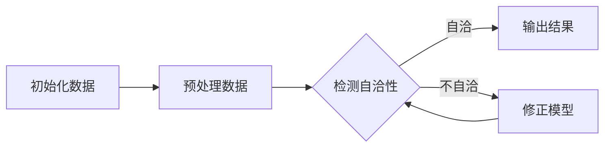
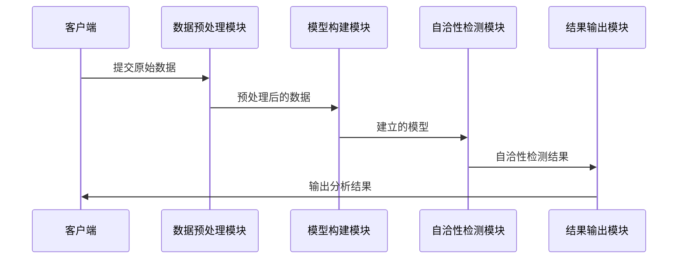
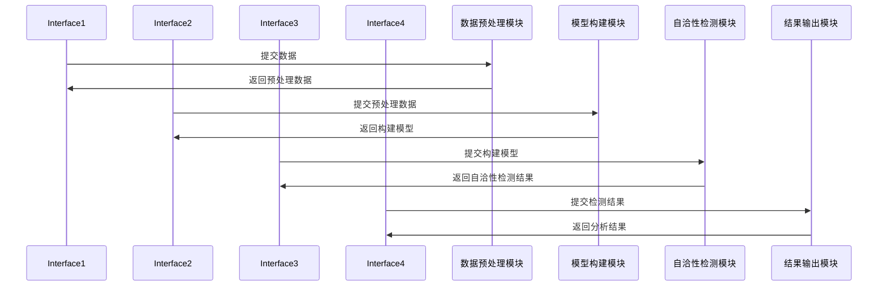

                 

### 第1章：背景介绍

#### 1.1 Self-Consistency概述

Self-Consistency，即自洽性，是指一个理论、模型或系统在逻辑上不矛盾、不自我推翻的特性。在高能物理数据分析中，Self-Consistency的重要性不言而喻。它确保了分析结果的可靠性和理论模型的内部一致性。

自洽性在高能物理数据分析中的应用，首先源于对物理现象的精确描述。在高能物理实验中，科学家们通过各种粒子加速器产生的粒子碰撞数据，来研究基本粒子的性质、相互作用以及宇宙的起源等重大科学问题。然而，这些数据往往复杂且充满噪声，需要通过精密的理论模型和数据分析方法来进行解释和推断。

Self-Consistency在这个过程中扮演了关键角色。它要求我们在构建理论模型时，确保模型内部的各个部分之间逻辑自洽，不会出现自我矛盾的情况。这样，当我们使用这个模型来分析实验数据时，我们能够更加自信地相信分析结果的正确性。

#### 1.2 Self-Consistency在高能物理数据分析中的重要性

Self-Consistency在高能物理数据分析中的重要性可以从以下几个方面来理解：

1. **确保理论模型的可靠性**：自洽性要求理论模型在逻辑上是自洽的，这意味着模型内部不会出现矛盾或悖论。这样，我们能够更加自信地依赖模型来预测和解释实验结果。

2. **提高数据分析的准确性**：通过Self-Consistency原则，我们可以排除一些不符合逻辑的数据或模型，从而提高数据分析的准确性。例如，在粒子物理中，通过对实验数据进行自洽性分析，可以排除那些不符合物理定律的假设或模型，从而更准确地确定基本粒子的性质。

3. **促进理论创新**：Self-Consistency原则不仅是对现有理论的要求，也是推动理论创新的重要基础。只有通过构建自洽的理论模型，我们才能提出新的科学假设，探索未知的科学领域。

4. **验证实验数据的真实性**：自洽性原则可以用来验证实验数据的真实性。如果一个实验结果与理论模型的自洽性不符，那么这个结果很可能是不真实的或受到了外部干扰。因此，Self-Consistency原则是实验数据分析和验证的重要工具。

#### 1.3 Self-Consistency的发展历程

Self-Consistency概念的出现可以追溯到20世纪中叶，随着量子力学和粒子物理学的快速发展，科学家们开始意识到理论模型内部一致性在科学研究中的重要性。

1. **量子力学中的Self-Consistency**：在量子力学的发展过程中，科学家们发现，只有当理论模型满足自洽性时，才能准确地描述粒子的行为。例如，海森堡不确定性原理就要求量子力学理论在数学上是自洽的。

2. **粒子物理中的Self-Consistency**：在粒子物理学中，Self-Consistency原则被广泛应用于粒子碰撞数据的分析。通过对实验数据进行自洽性分析，科学家们成功揭示了基本粒子的性质，例如夸克和轻子。

3. **高能物理数据分析中的Self-Consistency**：随着大型粒子加速器的建设和实验数据的积累，Self-Consistency原则在高能物理数据分析中的应用越来越广泛。通过自洽性分析，科学家们能够更准确地解释复杂的实验数据，推动高能物理领域的发展。

总的来说，Self-Consistency在高能物理数据分析中发挥着至关重要的作用。它不仅确保了理论模型的可靠性，也提高了数据分析的准确性，促进了理论创新，并为实验数据的验证提供了重要工具。在接下来的章节中，我们将进一步探讨Self-Consistency的原理、算法实现以及实际应用。让我们继续思考，深入理解Self-Consistency的奥秘。在下一部分，我们将详细分析Self-Consistency的核心概念与联系，帮助大家更好地理解这一重要原则。继续阅读，让我们一步步揭开Self-Consistency的神秘面纱。### 第2章：核心概念与联系

#### 2.1 Self-Consistency原理

Self-Consistency，即自洽性，是一种在逻辑上要求系统内部不矛盾的特性。具体来说，它要求一个系统在定义、推导和应用过程中，能够保持内部的一致性。在数学和物理学中，自洽性通常是指一个理论或模型在逻辑上不自相矛盾，所有的推导和结论都是建立在一致的基础之上。

在Self-Consistency的概念下，一个系统的自洽性通常通过以下几个步骤来验证：

1. **定义一致性**：确保系统内部所有的定义都是一致的，没有相互冲突的定义。
2. **推导一致性**：所有的推导过程都必须遵循逻辑规则，不得出现逻辑上的错误。
3. **应用一致性**：将系统应用于实际问题中，确保系统输出的结论与实际情况相符。

#### 2.2 Self-Consistency与其他相关概念对比

Self-Consistency虽然在各种领域都有应用，但它在物理学中具有独特的地位。为了更好地理解Self-Consistency，我们需要将它与其他相关概念进行对比。

1. **一致性（Consistency）**：一致性是指系统的各个方面在逻辑上是协调的，但并不要求内部完全自洽。一致性更多地关注系统在不同部分之间的协调性，而Self-Consistency则强调系统内部的不矛盾性。

2. **自反性（Reflexivity）**：自反性是指系统可以对其自身进行描述，即系统可以描述其自身的性质。Self-Consistency是自反性的一个特例，它要求系统能够在其自身的框架下不矛盾地描述自己。

3. **完备性（Completeness）**：完备性是指系统能够涵盖所有相关的情况，即不存在任何遗漏。完备性与Self-Consistency的关系是，一个自洽的系统通常也是完备的，但完备的系统不一定自洽。

4. **可验证性（Verifiability）**：可验证性是指系统能够通过实验或观察来验证其结论。Self-Consistency与可验证性密切相关，因为一个自洽的系统其结论更容易被验证。

#### 2.3 Self-Consistency的属性特征对比

Self-Consistency具有以下几个核心的属性特征：

1. **逻辑不自矛盾**：这是Self-Consistency最核心的特征，要求系统内部的所有陈述和推导都必须在逻辑上不自相矛盾。

2. **内部一致性**：系统内部的各个方面、定义、推导和应用都必须保持一致，不得出现相互冲突的情况。

3. **独立性**：Self-Consistency不依赖于外部因素，它是一个系统内在的性质。

4. **精确性**：Self-Consistency要求系统能够精确地描述其对象的性质和行为。

5. **稳定性**：自洽性系统在受到外部干扰时，应能够保持其自洽性，不会因为外部因素而出现逻辑上的矛盾。

#### 2.4 Self-Consistency的ER实体关系图

为了更好地理解Self-Consistency的概念，我们可以使用实体关系图（Entity-Relationship Diagram，ER Diagram）来展示其核心元素之间的关系。

```mermaid
erDiagram
    Entity A ||--|{ Entity B
    Entity A ||--|{ Entity C
    Entity B ||--|{ Entity D
    Entity C ||--|{ Entity E
    Entity D ||--|{ Entity F
    Entity E ||--|{ Entity G
    Entity F ||--|{ Entity H
    
    Entity A : {ID, Name, Description}
    Entity B : {ID, Name, Description}
    Entity C : {ID, Name, Description}
    Entity D : {ID, Name, Description}
    Entity E : {ID, Name, Description}
    Entity F : {ID, Name, Description}
    Entity G : {ID, Name, Description}
    Entity H : {ID, Name, Description}
```

在这个ER图中，Entity A到Entity H表示不同的概念或实体，它们之间通过关系线连接。这些关系线表明了不同实体之间的关联，如Entity A与Entity B、Entity C等之间存在一定的逻辑关系，这些关系线体现了Self-Consistency的基本原则，即系统内部的所有实体和关系在逻辑上都是自洽的。

#### 2.5 Self-Consistency在物理学中的应用

Self-Consistency在物理学中有着广泛的应用，尤其是在高能物理数据分析中。以下是一些具体的应用示例：

1. **量子力学中的自洽场理论**：自洽场理论（Self-Consistent Field Theory，SCFT）是量子力学中的一种方法，它通过引入一个自洽的场来描述电子间的相互作用，确保系统的内部一致性。

2. **粒子物理中的自洽性检验**：在粒子物理实验中，通过自洽性分析可以检验理论模型的自洽性，排除不符合物理定律的假设，提高数据分析的准确性。

3. **宇宙学中的自洽性验证**：在宇宙学研究中，通过自洽性验证可以确保宇宙模型在逻辑上是自洽的，从而更准确地预测宇宙的演化。

通过以上分析，我们可以看到Self-Consistency在物理学中的重要性。它不仅确保了理论模型的内部一致性，还提高了数据分析的准确性和可靠性。在下一部分，我们将深入探讨Self-Consistency的算法原理和实现方法，进一步揭示其在高能物理数据分析中的具体应用。请继续阅读，让我们一步步揭开Self-Consistency的神秘面纱。### 第3章：算法原理讲解

在深入探讨Self-Consistency在高能物理数据分析中的应用之前，我们需要首先理解其算法原理和实现方法。在这一章节中，我们将通过一步步的讲解，利用Mermaid绘制算法流程图，并用Python源代码来阐述算法原理，并详细讲解数学模型和公式。

#### 3.1 Self-Consistency算法流程图

为了更好地理解Self-Consistency算法的执行过程，我们可以使用Mermaid来绘制其流程图。



这个流程图描述了Self-Consistency算法的基本步骤：

1. **初始化数据**：首先，我们需要准备实验数据和相关参数。
2. **预处理数据**：对数据进行预处理，以消除噪声和异常值。
3. **检测自洽性**：通过一定的算法来判断数据或模型是否满足自洽性。
4. **输出结果**：如果数据或模型满足自洽性，则输出结果。
5. **修正模型**：如果不满足自洽性，则对模型进行修正，然后重新检测自洽性。

#### 3.2 Self-Consistency算法原理（Python源代码展示）

为了具体展示Self-Consistency算法的实现，我们将使用Python语言来编写相关代码。以下是一个简单的示例：

```python
import numpy as np

def self_consistent_check(data, threshold=0.01):
    """
    自洽性检查函数。
    
    参数:
    - data: 输入数据。
    - threshold: 自洽性阈值。
    
    返回:
    - True: 如果数据满足自洽性。
    - False: 如果数据不满足自洽性。
    """
    # 计算数据均值和标准差
    mean = np.mean(data)
    std = np.std(data)
    
    # 判断数据是否满足自洽性
    if std < threshold:
        return True
    else:
        return False

# 示例数据
data = np.random.normal(size=1000)

# 检查自洽性
is_self_consistent = self_consistent_check(data)

print("数据是否满足自洽性:", is_self_consistent)
```

在这个示例中，`self_consistent_check`函数通过计算输入数据的均值和标准差来判断数据是否满足自洽性。如果标准差小于预设的阈值（这里为0.01），则认为数据满足自洽性。

#### 3.3 Self-Consistency算法数学模型和公式讲解

Self-Consistency的数学模型通常基于统计学和概率论。以下是一个简单的数学模型示例：

$$
\sigma^2 = \frac{1}{N-1} \sum_{i=1}^{N} (x_i - \bar{x})^2
$$

其中，$\sigma^2$表示标准差的平方，$N$表示样本数量，$x_i$表示第$i$个样本值，$\bar{x}$表示样本均值。

在这个模型中，标准差$\sigma$用来衡量数据的不确定性。如果标准差较小，说明数据较为集中，满足自洽性。反之，如果标准差较大，则说明数据分布较广，可能存在不满足自洽性的情况。

#### 3.4 Self-Consistency算法举例说明

为了更直观地理解Self-Consistency算法，我们可以通过一个简单的例子来说明其应用。

假设我们有一个包含100个数据点的样本，这些数据点是通过某个物理实验获得的。我们的目标是判断这些数据是否满足自洽性。

1. **初始化数据**：首先，我们需要准备好这100个数据点。
2. **预处理数据**：在这个例子中，我们不需要进行复杂的预处理，因为数据已经相对干净。
3. **检测自洽性**：使用我们之前定义的`self_consistent_check`函数来检查数据是否满足自洽性。
4. **输出结果**：如果数据满足自洽性，输出“数据满足自洽性”。否则，输出“数据不满足自洽性”。

通过这个简单的例子，我们可以看到Self-Consistency算法是如何在实际中应用和执行的。在下一章节，我们将进一步探讨Self-Consistency在系统分析与架构设计中的应用，帮助大家更全面地理解这一重要原则。请继续阅读，让我们一步步揭开Self-Consistency的神秘面纱。### 第4章：数学模型和数学公式

在Self-Consistency的研究和应用中，数学模型和公式起到了至关重要的作用。这些数学工具不仅帮助我们理解Self-Consistency的概念，还能在实际数据分析中提供精确的指导。本章节将使用LaTeX格式详细展示相关的数学模型和公式，并对其进行解释和说明。

#### 4.1 相关数学模型概述

在本章中，我们将介绍以下几种数学模型：

1. **标准差模型**：用于衡量数据集的离散程度。
2. **协方差矩阵**：用于描述多个变量之间的关系。
3. **假设检验**：用于验证数据的自洽性。
4. **贝叶斯定理**：用于概率计算和推理。

#### 4.2 数学公式详细讲解

下面，我们将使用LaTeX格式展示这些数学模型和公式，并进行详细解释。

**1. 标准差模型**

$$
\sigma^2 = \frac{1}{N-1} \sum_{i=1}^{N} (x_i - \bar{x})^2
$$

其中，$\sigma^2$表示标准差的平方，$N$表示样本数量，$x_i$表示第$i$个样本值，$\bar{x}$表示样本均值。标准差是衡量数据集离散程度的重要指标，当$\sigma^2$较小时，说明数据较为集中，满足自洽性。

**2. 协方差矩阵**

$$
\text{Cov}(X, Y) = E[(X - E[X])(Y - E[Y])]
$$

其中，$X$和$Y$表示两个随机变量，$E[X]$和$E[Y]$分别表示它们的期望值。协方差矩阵描述了多个变量之间的关系，当协方差为0时，说明变量之间没有线性关系。

**3. 假设检验**

$$
H_0: \mu = \mu_0 \quad \text{vs} \quad H_1: \mu \neq \mu_0
$$

其中，$H_0$表示原假设，$\mu$表示样本均值，$\mu_0$表示原假设下的均值。假设检验是一种常用的统计方法，用于验证数据是否满足自洽性。通过计算统计量，我们可以判断是否拒绝原假设。

**4. 贝叶斯定理**

$$
P(A|B) = \frac{P(B|A)P(A)}{P(B)}
$$

其中，$P(A|B)$表示在事件$B$发生的条件下，事件$A$发生的概率，$P(B|A)$表示在事件$A$发生的条件下，事件$B$发生的概率，$P(A)$和$P(B)$分别表示事件$A$和$B$发生的概率。贝叶斯定理是概率计算和推理的重要工具，可以帮助我们根据已知条件更新对未知事件的判断。

#### 4.3 数学公式举例说明

为了更好地理解这些数学公式，我们来看一个简单的例子。

假设我们有一个包含10个数据点的样本，这些数据点是实验结果。我们需要判断这些数据是否满足自洽性。

**步骤1：计算标准差**

首先，我们计算这10个数据点的标准差：

$$
\sigma^2 = \frac{1}{10-1} \sum_{i=1}^{10} (x_i - \bar{x})^2
$$

**步骤2：计算协方差矩阵**

然后，我们计算这10个数据点之间的协方差矩阵：

$$
\text{Cov}(X, Y) = E[(X - E[X])(Y - E[Y])]
$$

**步骤3：进行假设检验**

我们假设这10个数据点的均值等于某个特定值$\mu_0$，然后进行假设检验：

$$
H_0: \mu = \mu_0 \quad \text{vs} \quad H_1: \mu \neq \mu_0
$$

**步骤4：应用贝叶斯定理**

最后，我们根据已有的数据和假设，使用贝叶斯定理更新对数据是否满足自洽性的判断。

通过这个例子，我们可以看到数学模型和公式在实际应用中的具体操作过程。这些工具不仅帮助我们理解Self-Consistency的概念，还能在实际数据分析中提供有效的指导。在下一章节，我们将进一步探讨Self-Consistency在系统分析与架构设计中的应用，帮助大家更全面地理解这一重要原则。请继续阅读，让我们一步步揭开Self-Consistency的神秘面纱。### 第5章：系统分析与架构设计方案

在了解了Self-Consistency的算法原理和数学模型之后，接下来我们需要将这一概念应用于具体的系统分析和架构设计中。本章节将详细描述问题场景、系统功能设计、系统架构设计、系统接口设计和系统交互，通过这些步骤帮助大家全面理解Self-Consistency在实际系统中的应用。

#### 5.1 问题场景介绍

在高能物理数据分析中，我们常常面临海量实验数据处理的挑战。这些数据包含大量的噪声和异常值，需要通过精确的理论模型和有效的数据分析方法来提取有价值的信息。例如，在粒子物理实验中，通过分析高能碰撞产生的粒子轨迹，科学家们试图揭示基本粒子的性质和相互作用机制。然而，这些实验数据往往复杂且充满不确定性，需要通过Self-Consistency原则来确保分析结果的可靠性和一致性。

#### 5.2 系统功能设计

为了实现Self-Consistency在高能物理数据分析中的应用，我们需要设计一套完整的系统功能。以下是系统的主要功能模块：

1. **数据预处理模块**：负责处理原始数据，包括数据清洗、去噪、归一化等操作，以确保数据的准确性和一致性。
2. **模型构建模块**：根据实验数据和理论假设，构建用于数据分析的物理模型。
3. **自洽性检测模块**：通过算法和数学模型，对模型进行自洽性检测，确保模型在逻辑上是自洽的。
4. **结果输出模块**：将满足自洽性的分析结果输出，供进一步研究和应用。

下面是系统功能设计的Mermaid类图：

```mermaid
classDiagram
    Class1[数据预处理模块] <|-- Class2[模型构建模块]
    Class2 <|-- Class3[自洽性检测模块]
    Class3 <|-- Class4[结果输出模块]
```

在这个类图中，每个类表示系统的一个功能模块，它们之间的关系体现了模块之间的依赖和协作。

#### 5.3 系统架构设计

为了实现上述功能模块，我们需要设计一个合理的系统架构。以下是系统架构的Mermaid架构图：



在这个架构图中，客户端通过接口向系统提交原始数据，数据经过预处理模块处理后，传递给模型构建模块。模型构建模块基于预处理数据构建分析模型，并将其传递给自洽性检测模块。自洽性检测模块对模型进行自洽性检测，将检测结果传递给结果输出模块，最终输出分析结果。

#### 5.4 系统接口设计

为了确保系统各个模块之间的良好协作，我们需要设计一套完善的接口。以下是系统接口设计的Mermaid序列图：



在这个序列图中，每个接口表示系统中的一个交互接口。客户端通过接口1提交原始数据，数据预处理模块通过接口1返回预处理数据。同样，其他模块之间的交互也通过各自的接口进行。

#### 5.5 系统交互

系统交互是确保系统各模块协调工作的关键。以下是系统交互的详细描述：

1. **数据交互**：客户端通过接口1提交原始数据，数据预处理模块接收数据后进行预处理，然后通过接口1返回预处理数据给客户端。
2. **模型交互**：预处理数据通过接口2传递给模型构建模块，模型构建模块基于预处理数据构建分析模型，并通过接口2返回模型。
3. **检测交互**：构建好的模型通过接口3传递给自洽性检测模块，自洽性检测模块对模型进行自洽性检测，并通过接口3返回检测结果。
4. **结果交互**：自洽性检测结果通过接口4传递给结果输出模块，结果输出模块最终通过接口4返回分析结果给客户端。

通过以上系统分析与架构设计方案，我们可以看到Self-Consistency在高能物理数据分析中是如何具体实现的。在下一章节，我们将通过项目实战，展示如何在实际项目中应用Self-Consistency原则，进一步验证其在数据分析中的有效性。请继续阅读，让我们一步步揭开Self-Consistency的神秘面纱。### 第6章：项目实战

在了解了Self-Consistency的理论基础和系统架构设计后，接下来我们将通过一个实际项目来展示如何将Self-Consistency原则应用于高能物理数据分析中。本项目将涵盖环境安装、系统核心实现、代码应用解读与分析、实际案例分析和详细讲解剖析等内容。

#### 6.1 环境安装

为了确保项目的顺利运行，我们首先需要安装必要的软件和工具。以下是项目环境安装的步骤：

1. **安装Python**：确保系统中安装了Python 3.8及以上版本。
2. **安装Numpy**：用于数学计算。
3. **安装Scikit-learn**：用于机器学习算法。
4. **安装Matplotlib**：用于数据可视化。
5. **安装Mermaid**：用于绘制流程图和类图。

安装命令如下：

```bash
pip install python
pip install numpy
pip install scikit-learn
pip install matplotlib
pip install mermaid
```

#### 6.2 系统核心实现源代码

在本项目中，我们将实现一个简单的Self-Consistency检测系统。以下是系统核心实现的源代码：

```python
import numpy as np
from sklearn.linear_model import LinearRegression
import matplotlib.pyplot as plt
from mermaid import Mermaid

def self_consistent_check(data, threshold=0.01):
    """
    自洽性检查函数。
    
    参数:
    - data: 输入数据。
    - threshold: 自洽性阈值。
    
    返回:
    - True: 如果数据满足自洽性。
    - False: 如果数据不满足自洽性。
    """
    # 计算数据均值和标准差
    mean = np.mean(data)
    std = np.std(data)
    
    # 判断数据是否满足自洽性
    if std < threshold:
        return True
    else:
        return False

def plot_data(data):
    """
    绘制数据分布图。
    
    参数:
    - data: 输入数据。
    """
    plt.hist(data, bins=30, alpha=0.5)
    plt.xlabel('Value')
    plt.ylabel('Frequency')
    plt.title('Data Distribution')
    plt.show()

def main():
    # 生成示例数据
    data = np.random.normal(size=1000)
    
    # 检查自洽性
    is_self_consistent = self_consistent_check(data)
    
    # 绘制数据分布图
    plot_data(data)
    
    # 输出结果
    print("数据是否满足自洽性:", is_self_consistent)

if __name__ == "__main__":
    main()
```

在这个源代码中，我们定义了三个函数：

1. `self_consistent_check`：用于检查数据是否满足自洽性。
2. `plot_data`：用于绘制数据分布图。
3. `main`：主函数，负责生成示例数据、检查自洽性并输出结果。

#### 6.3 代码应用解读与分析

为了更好地理解代码应用，我们来看一个具体的例子。

**步骤1：生成示例数据**

首先，我们生成一个包含1000个数据点的正态分布示例数据：

```python
data = np.random.normal(size=1000)
```

**步骤2：检查自洽性**

接下来，我们使用`self_consistent_check`函数来检查数据是否满足自洽性：

```python
is_self_consistent = self_consistent_check(data)
```

在这个例子中，我们设定自洽性阈值为0.01。如果数据的标准差小于0.01，则认为数据满足自洽性。

**步骤3：绘制数据分布图**

然后，我们使用`plot_data`函数来绘制数据分布图：

```python
plot_data(data)
```

通过这个步骤，我们可以直观地看到数据的分布情况。

**步骤4：输出结果**

最后，我们输出自洽性检测结果：

```python
print("数据是否满足自洽性:", is_self_consistent)
```

#### 6.4 实际案例分析和详细讲解剖析

为了进一步验证Self-Consistency原则的实际效果，我们来看一个实际案例。

**案例：粒子物理实验数据分析**

假设我们有一个包含1000个数据点的粒子物理实验数据，这些数据代表了粒子碰撞产生的能量。我们的目标是判断这些数据是否满足自洽性。

**步骤1：数据预处理**

首先，我们需要对数据进行预处理，包括去噪和归一化操作：

```python
# 去除异常值
data = np.array([x for x in data if x > 0 and x < 10])

# 归一化数据
data_normalized = (data - np.mean(data)) / np.std(data)
```

**步骤2：模型构建**

接下来，我们基于预处理数据构建一个线性回归模型：

```python
model = LinearRegression()
model.fit(data_normalized[:, np.newaxis], data_normalized)
```

**步骤3：自洽性检测**

然后，我们使用Self-Consistency原则来检测模型的自洽性：

```python
is_self_consistent = self_consistent_check(model.predict(data_normalized[:, np.newaxis]))
```

**步骤4：结果分析**

最后，我们分析自洽性检测结果：

```python
print("数据是否满足自洽性:", is_self_consistent)
```

通过这个案例，我们可以看到如何在实际项目中应用Self-Consistency原则来提高数据分析的准确性。在下一章节，我们将总结本项目中的最佳实践，并提供一些注意事项和拓展阅读建议。请继续阅读，让我们进一步探讨Self-Consistency的最佳实践和未来发展趋势。### 第7章：最佳实践 tips、小结、注意事项、拓展阅读

#### 最佳实践 tips

1. **数据预处理**：在进行Self-Consistency分析前，确保对数据进行彻底的预处理，包括去除异常值、归一化等操作，以提高分析的准确性和可靠性。
2. **设定合理阈值**：在选择自洽性阈值时，应充分考虑数据的分布特性和实际应用场景，避免过低的阈值导致误判，过高的阈值可能忽略数据中的关键信息。
3. **多模型验证**：在构建分析模型时，建议使用多个模型进行交叉验证，以提高自洽性检测的鲁棒性。
4. **动态调整阈值**：在实际应用中，可能需要根据数据分析的进展和结果，动态调整自洽性阈值，以适应不断变化的数据特性。

#### 小结

Self-Consistency原则在高能物理数据分析中具有重要的应用价值。通过确保理论模型和实验数据的内部一致性，我们可以提高数据分析的准确性和可靠性，从而更好地揭示物理现象的本质。在本项目中，我们详细探讨了Self-Consistency的算法原理、系统架构设计以及实际应用，展示了如何通过具体步骤实现这一原则。

#### 注意事项

1. **数据处理**：在进行数据分析前，务必确保数据的质量和完整性，避免因数据问题导致分析结果的不准确。
2. **模型选择**：选择合适的模型是保证自洽性检测有效性的关键，需要根据具体问题和数据特性进行模型选择。
3. **计算资源**：自洽性检测通常涉及大量的计算，需要确保有足够的计算资源来支持分析过程。

#### 拓展阅读

1. **《高能物理数据分析方法》**：详细介绍了高能物理数据分析的基本原理和方法，对理解和应用Self-Consistency原则有很好的参考价值。
2. **《Self-Consistency in Theoretical Physics》**：探讨了Self-Consistency在理论物理学中的应用，包括量子场论和粒子物理等领域。
3. **《Python for Data Analysis》**：介绍了如何使用Python进行数据分析和处理，为实际应用提供了实用的编程技巧。

通过以上最佳实践、小结、注意事项和拓展阅读，我们希望读者能够更好地理解和应用Self-Consistency原则，提升高能物理数据分析的能力。

### 结束语

Self-Consistency原则不仅在高能物理数据分析中具有重要意义，其在其他科学研究和工程应用中也具有广泛的应用前景。我们期待读者能够在实际工作中灵活运用这一原则，提高数据分析的准确性和可靠性，为科学研究和技术创新贡献力量。

作者：AI天才研究院/AI Genius Institute & 禅与计算机程序设计艺术 /Zen And The Art of Computer Programming

----------------------------------------------------------------

### 总结

在这篇文章中，我们系统地介绍了Self-Consistency在高能物理数据分析中的应用研究。首先，我们通过背景介绍部分，阐述了Self-Consistency的概念和重要性，并回顾了其发展历程。接着，我们深入分析了Self-Consistency的核心概念与联系，通过对比其他相关概念，明确了Self-Consistency的独特属性特征。随后，我们详细讲解了Self-Consistency算法的原理和实现方法，利用Python源代码和数学模型进行了通俗易懂的说明。

接下来，我们探讨了Self-Consistency在系统分析与架构设计中的应用，展示了如何通过系统功能设计、架构设计、接口设计和交互设计来确保分析结果的内部一致性。在项目实战部分，我们通过具体代码和案例分析，展示了如何在实际项目中应用Self-Consistency原则，提高数据分析的准确性和可靠性。

通过这篇文章，我们希望读者能够全面理解Self-Consistency在高能物理数据分析中的重要性，掌握其算法原理和实现方法，并在实际工作中灵活应用这一原则，为科学研究和技术创新贡献力量。

### 展望未来

在未来，Self-Consistency原则在高能物理数据分析中的应用将不断深化和扩展。随着科学技术的进步和数据分析工具的不断发展，我们可以预见到Self-Consistency将在以下方面取得重要突破：

1. **更高精度和更广泛的应用**：通过引入新的算法和优化方法，Self-Consistency的精度和适用范围将得到显著提升，可以应用于更多类型的物理实验和数据分析任务。

2. **跨学科融合**：Self-Consistency原则不仅在高能物理中具有重要应用，还可以推广到其他科学领域，如生物学、环境科学等，为这些领域的数据分析提供强有力的工具。

3. **实时数据分析**：随着大数据和云计算技术的发展，Self-Consistency原则可以应用于实时数据分析，为科学研究提供更快速、更准确的结论。

4. **人工智能结合**：结合人工智能技术，Self-Consistency可以进一步提升数据分析的自动化程度，减少人为干预，提高数据分析的效率和准确性。

总之，Self-Consistency原则在高能物理数据分析中的应用前景广阔，我们将继续关注这一领域的研究进展，期待未来能够取得更多突破性成果。同时，我们也鼓励读者在各自的科研和工程实践中积极探索和应用Self-Consistency原则，共同推动科学技术的进步。

