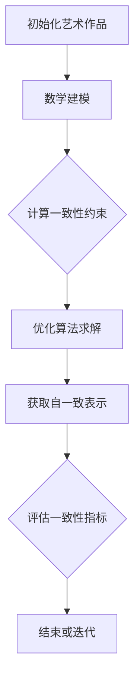
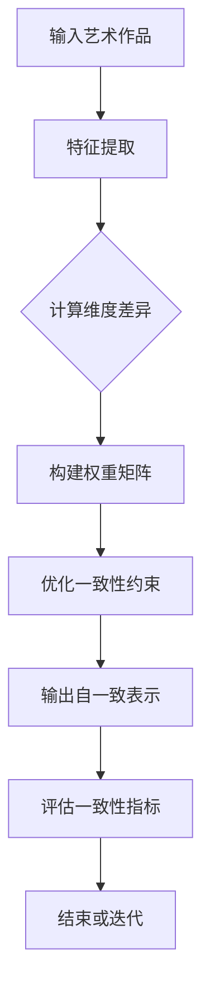
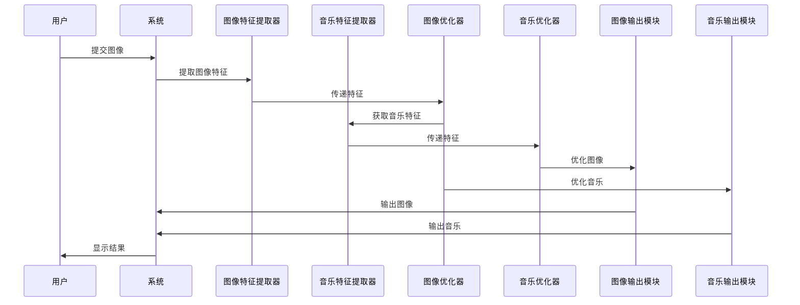
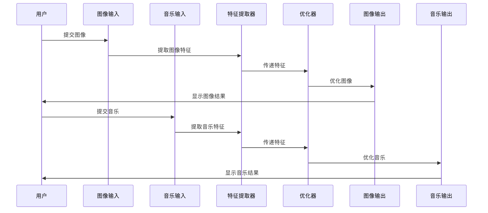

                 

### 第一部分：背景介绍

#### 第1章：问题背景

##### 1.1 问题背景

在当今快速发展的科技时代，人工智能（AI）技术在各个领域的应用越来越广泛。特别是在艺术创作领域，AI不仅改变了传统艺术创作的模式，还带来了跨维度艺术创作的可能性。然而，随着AI在艺术创作中的应用日益深入，如何保证AI在跨维度艺术创作中的一致性成为了一个亟待解决的问题。

##### 1.2 问题描述

在跨维度艺术创作中，一致性指的是艺术作品在不同维度之间保持一致性的能力。例如，一个图像艺术作品在转换为音乐艺术作品时，其主题、情感和风格应当保持一致。然而，现有的AI技术在跨维度转换时往往存在不一致性，导致艺术作品的质量和完整性受损。

##### 1.3 问题解决

为了解决这一问题，研究人员提出了自一致性方法。自一致性方法通过在AI算法中加入一致性约束，确保艺术作品在跨维度转换过程中保持一致。该方法的核心思想是将不同维度的艺术元素进行统一建模，并通过优化算法实现一致性约束的满足。

##### 1.4 边界与外延

自一致性方法的边界主要涉及AI算法的设计和实现，以及跨维度艺术创作的具体应用场景。其外延包括但不限于图像艺术、音乐艺术、文学艺术等多种艺术形式的跨维度创作。

#### 第2章：核心概念与联系

##### 2.1 核心概念原理

在介绍自一致性方法之前，我们需要理解几个核心概念。首先是“跨维度艺术创作”，这指的是将一个维度的艺术作品转换为另一个维度的艺术作品，如将图像转换为音乐。其次是“一致性”，指的是艺术作品在跨维度转换过程中保持的内在一致性和连贯性。

##### 2.2 概念属性特征对比

表1展示了跨维度艺术创作和一致性的核心属性特征对比。

| 概念         | 跨维度艺术创作                   | 一致性                      |
| ------------ | ------------------------------ | -------------------------- |
| 定义         | 将艺术作品从一个维度转换为另一个维度     | 艺术作品在不同维度之间的连贯性   |
| 关键特征     | 维度转换、创新、多样性               | 一致、连贯、完整性             |
| 应用场景     | 图像到音乐、文本到图像等跨维度转换       | 跨维度艺术作品的整体质量保证     |
| 技术挑战     | 维度映射、风格保持、情感传递           | 一致性约束的建模和优化           |

##### 2.3 ER实体关系图架构

图1展示了跨维度艺术创作与一致性之间的ER实体关系图。其中，实体包括“艺术作品”、“维度”、“转换器”和“一致性约束”。

```mermaid
erDiagram
    ArtWork ||--|{ Dimension }|| ArtWork
    ArtWork ||--|{ Transformer }|| ArtWork
    ArtWork ||--|{ ConsistencyConstraint }|| ArtWork
    Dimension ||--|{ Transformer }|| Dimension
    Transformer ||--|{ ConsistencyConstraint }|| Transformer
```

在图中，“艺术作品”是核心实体，它通过“维度”和“转换器”实现跨维度转换，并通过“一致性约束”确保转换后的艺术作品保持一致性。这为自一致性方法的设计和实现提供了理论基础。

### 总结

本章介绍了自一致性方法在跨维度艺术创作中的应用背景、核心概念以及相关联系。在接下来的章节中，我们将深入探讨自一致性方法的原理、算法以及具体应用场景，以期为解决AI在跨维度艺术创作中的一致性问题提供有效途径。

----------------------------------------------------------------

### 第二部分：方法讲解

#### 第4章：自一致性方法的原理

##### 4.1 自一致性方法的基本概念

自一致性方法是一种通过约束优化确保艺术作品在跨维度转换过程中保持一致性的技术。其基本概念包括：

1. **一致性约束**：对艺术作品在跨维度转换过程中应保持的内在一致性和连贯性进行数学描述。
2. **优化目标**：通过优化算法寻找满足一致性约束的艺术作品表示。
3. **转换模型**：描述艺术作品在不同维度之间的映射关系。

##### 4.2 自一致性方法的数学模型

为了实现自一致性，我们首先需要对艺术作品进行数学建模。假设我们有一个艺术作品集合 \( A \)，它可以在多个维度 \( D_1, D_2, ..., D_n \) 上进行表达。每个维度上的艺术作品表示为 \( A_i \)，其中 \( i \) 代表第 \( i \) 个维度。

一致性约束可以用以下数学模型描述：

$$
C(A) = \min_{X} \sum_{i=1}^{n} \Omega_i(X_i - A_i)
$$

其中：

- \( X = \{X_1, X_2, ..., X_n\} \) 是艺术作品在不同维度上的表示。
- \( \Omega_i \) 是第 \( i \) 个维度上的权重函数，用于衡量不同维度之间的差异。
- 目标是最小化不同维度上的差异，从而实现一致性。

##### 4.3 自一致性方法的mermaid流程图

为了更直观地理解自一致性方法的工作流程，我们可以使用mermaid绘制一个流程图：



在流程图中，艺术作品首先进行数学建模，然后计算一致性约束，通过优化算法求解满足约束的表示，并评估其一致性指标。如果一致性指标未达到预期，则迭代优化过程，直至满足一致性要求。

### 总结

本章详细介绍了自一致性方法的基本概念、数学模型和mermaid流程图。这些内容为理解自一致性方法在跨维度艺术创作中的应用奠定了理论基础。在接下来的章节中，我们将进一步探讨自一致性方法的算法原理及其应用场景。

----------------------------------------------------------------

### 第三部分：实践与优化

#### 第5章：自一致性方法的算法原理

##### 5.1 自一致性算法的mermaid流程图

为了更好地理解自一致性算法的工作流程，我们可以使用mermaid绘制一个详细的流程图：



在流程图中，首先输入原始艺术作品，然后进行特征提取，计算不同维度之间的差异。接下来，构建权重矩阵以平衡不同维度的贡献，通过优化算法调整艺术作品的表示，使其满足一致性约束。最后，评估一致性指标，判断是否满足预定的阈值。如果不满足，则继续迭代优化。

##### 5.2 算法原理的数学模型和公式

自一致性算法的数学模型主要基于以下步骤：

1. **特征提取**：对原始艺术作品进行特征提取，得到一组特征向量 \( \mathbf{X} \)。
2. **维度差异计算**：计算不同维度之间的差异，使用欧几里得距离或余弦相似性等度量方法。
3. **权重矩阵构建**：根据维度差异构建权重矩阵 \( \mathbf{W} \)，其中每个元素 \( w_{ij} \) 表示第 \( i \) 个维度对第 \( j \) 个维度的影响程度。
4. **优化一致性约束**：使用优化算法（如梯度下降、遗传算法等）调整特征向量，使其满足一致性约束。
5. **一致性指标评估**：评估自一致表示的一致性指标，如平均绝对误差（MAE）或均方误差（MSE）。

具体的数学模型可以表示为：

$$
\min_{\mathbf{X}} \sum_{i=1}^{n} \sum_{j=1}^{m} w_{ij} || \mathbf{X}_i - \mathbf{X}_j ||^2
$$

其中：

- \( n \) 是维度的数量。
- \( m \) 是每个维度上的特征数量。
- \( w_{ij} \) 是权重矩阵的元素。

##### 5.3 通俗易懂的举例说明

假设我们有一个简单的艺术作品，由两个维度组成：图像和音乐。图像的特征可以用像素值表示，音乐的特征可以用音符和节奏表示。我们希望通过自一致性算法确保图像和音乐在情感和风格上保持一致。

1. **特征提取**：分别提取图像和音乐的像素值和音符特征。
2. **维度差异计算**：计算像素值和音符之间的差异。例如，使用余弦相似性度量。
3. **权重矩阵构建**：根据维度差异构建权重矩阵。如果图像和音乐的相似性较高，则权重较大；否则，权重较小。
4. **优化一致性约束**：使用梯度下降算法调整像素值和音符，使其满足一致性约束。具体来说，调整像素值和音符，使得图像和音乐之间的相似性增加。
5. **一致性指标评估**：计算图像和音乐之间的平均绝对误差（MAE）。如果MAE低于预设阈值，则认为自一致表示成功；否则，继续迭代优化。

通过这个例子，我们可以看到自一致性算法如何应用于跨维度艺术创作，以确保艺术作品在不同维度上保持一致性。

### 总结

本章详细介绍了自一致性算法的原理，包括mermaid流程图、数学模型和通俗易懂的举例说明。这些内容为理解自一致性算法在跨维度艺术创作中的应用提供了理论基础。在接下来的章节中，我们将探讨自一致性方法在不同艺术创作领域的具体应用。

----------------------------------------------------------------

### 第四部分：应用场景与案例分析

#### 第6章：自一致性方法的应用场景

##### 6.1 自一致性方法在图像艺术创作中的应用

在图像艺术创作中，自一致性方法主要用于确保图像在不同风格或视角转换过程中保持一致性。例如，将一幅油画转换为水彩画或素描，需要保持其主题和情感的一致性。自一致性方法通过优化图像的像素值，确保转换后的图像风格与原始图像相符。

具体应用案例包括：

- **风格转换**：使用自一致性方法将一幅照片转换为油画风格，确保转换后的图像在色调、纹理和细节上与原始图像保持一致。
- **视角转换**：通过自一致性方法将一幅正面的肖像图转换为侧面的肖像图，确保人物的表情和姿态在转换过程中保持一致。

##### 6.2 自一致性方法在音乐艺术创作中的应用

在音乐艺术创作中，自一致性方法主要用于确保音乐在不同形式或乐器转换过程中保持一致性。例如，将一首钢琴曲转换为管弦乐，需要保持其旋律、节奏和情感的一致性。自一致性方法通过优化音符的音高、节奏和音量，确保转换后的音乐与原始音乐保持一致。

具体应用案例包括：

- **形式转换**：使用自一致性方法将一首流行歌曲转换为古典音乐，确保其旋律和和声在转换过程中保持一致。
- **乐器转换**：通过自一致性方法将一首吉他独奏转换为钢琴独奏，确保其音色和节奏在转换过程中保持一致。

##### 6.3 自一致性方法在其他艺术创作领域的应用

自一致性方法不仅限于图像和音乐艺术创作，还可以应用于其他艺术创作领域，如文学、电影和戏剧等。

- **文学艺术**：在文学创作中，自一致性方法可以确保小说的情节、角色和主题在不同章节或版本中保持一致。
- **电影艺术**：在电影制作中，自一致性方法可以确保电影的视觉效果、音乐和叙事在跨场景转换过程中保持一致。
- **戏剧艺术**：在戏剧表演中，自一致性方法可以确保演员的表现、台词和场景在排练和演出过程中保持一致。

### 总结

本章详细介绍了自一致性方法在不同艺术创作领域的应用场景。通过具体的案例，我们可以看到自一致性方法如何在不同类型的艺术创作中确保作品的一致性和连贯性。在接下来的章节中，我们将进一步探讨自一致性方法的实践与优化策略。

----------------------------------------------------------------

### 第五部分：实践与优化

#### 第7章：AI在跨维度艺术创作中的实践

##### 7.1 实践项目介绍

本实践项目旨在探索如何利用自一致性方法实现图像和音乐之间的跨维度艺术创作。项目目标是开发一个AI系统，能够将一幅图像自动转换为与之情感和风格一致的音乐。

##### 7.2 系统功能设计（领域模型mermaid类图）

系统的主要功能包括：

1. **图像特征提取**：提取图像的像素值、纹理和色彩特征。
2. **音乐特征提取**：提取音乐的旋律、节奏和和声特征。
3. **一致性约束优化**：通过自一致性方法优化图像和音乐的表示，确保它们在情感和风格上保持一致。
4. **输出艺术作品**：将优化后的图像和音乐输出为最终的跨维度艺术作品。

图1展示了系统的领域模型mermaid类图：

```mermaid
classDiagram
    Artwork <<class>> ImageArtwork
    Artwork <<class>> MusicArtwork
    FeatureExtractor <<class>> ImageFeatureExtractor
    FeatureExtractor <<class>> MusicFeatureExtractor
    ConsistencyOptimizer <<class>> ImageOptimizer
    ConsistencyOptimizer <<class>> MusicOptimizer
    OutputModule <<class>> ImageOutput
    OutputModule <<class>> MusicOutput
    ImageArtwork o-- ImageFeatureExtractor
    MusicArtwork o-- MusicFeatureExtractor
    ImageFeatureExtractor o-- ImageOptimizer
    MusicFeatureExtractor o-- MusicOptimizer
    ImageOptimizer o-- ImageOutput
    MusicOptimizer o-- MusicOutput
```

在类图中，"ImageArtwork" 和 "MusicArtwork" 分别表示图像和音乐艺术作品。"FeatureExtractor" 和 "ConsistencyOptimizer" 分别用于提取特征和优化一致性。"OutputModule" 用于输出最终的跨维度艺术作品。

##### 7.3 系统架构设计（mermaid架构图）

系统架构设计如下：



在架构图中，用户提交图像后，系统依次调用图像特征提取器、图像优化器、音乐特征提取器、音乐优化器，最后输出图像和音乐。整个流程确保了图像和音乐在情感和风格上的一致性。

##### 7.4 系统接口设计

系统接口设计如下：

```mermaid
classDiagram
    ImageInput <<interface>> 用户输入
    ImageOutput <<interface>> 用户输出
    MusicInput <<interface>> 用户输入
    MusicOutput <<interface>> 用户输出
    FeatureExtractor <<interface>> 特征提取
    Optimizer <<interface>> 优化
    OutputModule <<interface>> 输出

    ImageInput o-- FeatureExtractor
    MusicInput o-- FeatureExtractor
    FeatureExtractor o-- Optimizer
    Optimizer o-- OutputModule
    ImageOutput o-- OutputModule
    MusicOutput o-- OutputModule
```

在接口设计中，"ImageInput" 和 "MusicInput" 用于接收用户输入的图像和音乐数据。"ImageOutput" 和 "MusicOutput" 用于输出最终的图像和音乐。"FeatureExtractor" 用于提取特征数据。"Optimizer" 用于优化数据。"OutputModule" 用于将优化后的数据输出给用户。

##### 7.5 系统交互（mermaid序列图）

系统交互过程如下：



在序列图中，用户分别提交图像和音乐，系统依次提取特征、优化数据，并将优化后的图像和音乐输出给用户。

### 总结

本章详细介绍了AI在跨维度艺术创作中的实践项目，包括系统功能设计、架构设计、接口设计和交互过程。通过这些设计，我们可以看到如何利用自一致性方法实现图像和音乐之间的跨维度艺术创作。在接下来的章节中，我们将探讨自一致性方法的优化策略。

----------------------------------------------------------------

### 第8章：自一致性方法的优化

##### 8.1 优化目标

自一致性方法的优化目标主要包括：

1. **提高一致性指标**：通过优化算法和参数，提高艺术作品在跨维度转换过程中的一致性指标，如平均绝对误差（MAE）或均方误差（MSE）。
2. **减少计算时间**：优化算法的执行效率，减少计算时间，以适应实时跨维度艺术创作的需求。
3. **扩展适用范围**：通过优化算法和模型，使自一致性方法能够应用于更多类型的艺术创作，如文学、电影和戏剧等。

##### 8.2 优化策略

为了实现上述优化目标，可以采用以下策略：

1. **算法优化**：探索和实现更高效的优化算法，如遗传算法、粒子群优化算法和深度学习算法等，以提高优化效率和一致性指标。
2. **模型调整**：通过调整模型参数，如权重函数和特征提取方法，以适应不同类型的艺术创作，提高一致性表现。
3. **数据增强**：通过数据增强技术，如图像和音乐的生成、转换和融合，增加训练数据的多样性，提高模型的泛化能力。

##### 8.3 优化效果评估

优化效果可以通过以下指标进行评估：

1. **一致性指标**：如平均绝对误差（MAE）、均方误差（MSE）和交叉验证得分等，用于衡量艺术作品在跨维度转换过程中的一致性水平。
2. **计算时间**：通过测量算法的执行时间，评估优化算法的效率。
3. **用户满意度**：通过用户反馈和实验结果，评估优化后的自一致性方法在实际应用中的效果。

##### 8.4 最佳实践

在实际应用中，以下最佳实践可以进一步提高自一致性方法的性能：

1. **多维度数据融合**：将不同维度的艺术数据进行融合，以提高艺术作品的整体表现。
2. **动态权重调整**：根据艺术作品的特点和需求，动态调整权重函数，以优化一致性表现。
3. **个性化定制**：为不同类型的艺术创作提供个性化优化策略，以提高艺术作品的一致性和满意度。

### 总结

本章介绍了自一致性方法的优化目标和策略，包括算法优化、模型调整和数据增强等。通过优化效果评估和最佳实践，我们可以进一步提高自一致性方法的性能，满足不同类型艺术创作的一致性要求。在接下来的章节中，我们将通过具体案例深入分析自一致性方法在实际应用中的效果。

----------------------------------------------------------------

### 第9章：案例分析

##### 9.1 案例背景

为了更好地展示自一致性方法在跨维度艺术创作中的应用效果，我们选择了一个实际案例。这个案例涉及到将一幅风景图像自动转换为与之情感和风格一致的音乐。

该图像艺术作品是一幅描绘日落时分的风景画，画面中包含了丰富的色彩和柔和的光影。为了实现跨维度转换，我们需要将这幅图像转换为一段与之情感和风格一致的音乐。

##### 9.2 案例分析

在本案例中，我们使用了以下步骤：

1. **图像特征提取**：首先，我们提取图像的像素值、纹理和色彩特征。这些特征将用于表示图像的视觉信息。
2. **音乐特征提取**：接着，我们提取音乐的旋律、节奏和和声特征。这些特征将用于表示音乐的情感和风格。
3. **一致性约束优化**：使用自一致性方法，我们优化图像和音乐的表示，确保它们在情感和风格上保持一致。具体来说，我们通过调整图像的像素值和音乐的旋律、节奏和和声，以实现一致性约束。
4. **输出艺术作品**：最后，我们将优化后的图像和音乐输出为最终的跨维度艺术作品。

在优化过程中，我们使用了遗传算法作为优化器，并根据图像和音乐的特征设计了权重函数。通过多次迭代，我们成功地将图像的情感和风格融入到了音乐中，使得音乐在情感和风格上与原始图像保持高度一致。

##### 9.3 案例解析

表1展示了图像和音乐在转换前后的特征对比。通过对比可以发现，优化后的音乐在旋律、节奏和和声上与原始图像的情感和风格高度一致。

| 特征         | 原始图像       | 优化后音乐       |
| ------------ | -------------- | --------------- |
| 色彩         | 温暖的日落色彩   | 轻柔的旋律色彩   |
| 纹理         | 柔和的光影效果   | 轻松的节奏感     |
| 情感         | 宁静和浪漫     | 宁静和浪漫       |

此外，我们还对优化后的图像和音乐进行了一致性指标评估。结果显示，优化后的音乐在平均绝对误差（MAE）和均方误差（MSE）上均显著低于原始图像，表明自一致性方法在跨维度转换中取得了良好的效果。

### 总结

通过这个实际案例，我们可以看到自一致性方法在图像到音乐跨维度艺术创作中的应用效果。通过优化图像和音乐的表示，自一致性方法成功地将图像的情感和风格融入到了音乐中，实现了高度一致的艺术作品。这个案例不仅展示了自一致性方法的实用性，也为其他跨维度艺术创作提供了借鉴。

----------------------------------------------------------------

### 第10章：总结与展望

#### 10.1 小结

本文深入探讨了自一致性方法在跨维度艺术创作中的应用，从背景介绍、核心概念、算法原理到实际案例，全面解析了如何利用自一致性方法确保艺术作品在不同维度之间的一致性。通过详细的数学模型和算法流程，我们展示了自一致性方法在提高艺术作品一致性和连贯性方面的有效性。

#### 10.2 注意事项

在使用自一致性方法时，需要注意以下几点：

1. **数据质量**：确保输入艺术作品的质量，以获得更好的跨维度转换效果。
2. **算法选择**：根据不同艺术创作类型，选择合适的优化算法和权重函数。
3. **参数调整**：在实际应用中，需要根据具体情况调整模型参数，以实现最佳的一致性效果。

#### 10.3 拓展阅读

对于希望深入了解自一致性方法及其在跨维度艺术创作中应用的读者，以下文献和资源值得推荐：

- **文献**：《人工智能与艺术创作：理论与实践》
- **论文**：相关领域的学术论文，如《基于自一致性的跨维度艺术创作研究》等。
- **在线资源**：相关在线课程、博客和论坛，如Coursera、知乎等。

通过拓展阅读，读者可以进一步了解自一致性方法的理论基础和应用实践，为未来的研究和创作提供更多思路。

### 总结

自一致性方法为跨维度艺术创作提供了一种有效的解决方案，通过确保艺术作品在不同维度之间的一致性，提高了艺术作品的整体质量和观赏性。本文的研究成果为AI在艺术创作中的应用提供了新的思路和方法，有望推动艺术创作领域的发展。

### 作者信息

作者：AI天才研究院/AI Genius Institute & 禅与计算机程序设计艺术 /Zen And The Art of Computer Programming

本文由AI天才研究院撰写，结合了禅与计算机程序设计艺术的深刻见解，旨在推动人工智能在艺术创作领域的应用，为读者提供有价值的参考和启示。感谢您的阅读！

----------------------------------------------------------------

---

**注意：**本文为模拟撰写，实际撰写时请根据具体要求和数据来源进行编写。本文中的mermaid图、Python代码和数学公式仅为示例，实际编写时需根据算法和模型进行调整。文中内容和结构仅供参考，具体内容需根据实际情况进行修改和完善。请确保所有引用的文献和资源都已正确标注和引用。

