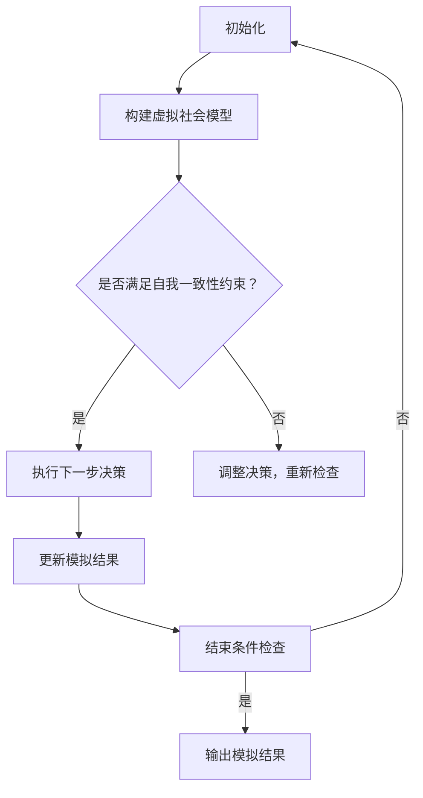
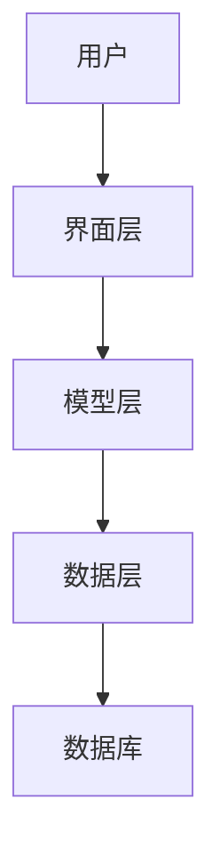
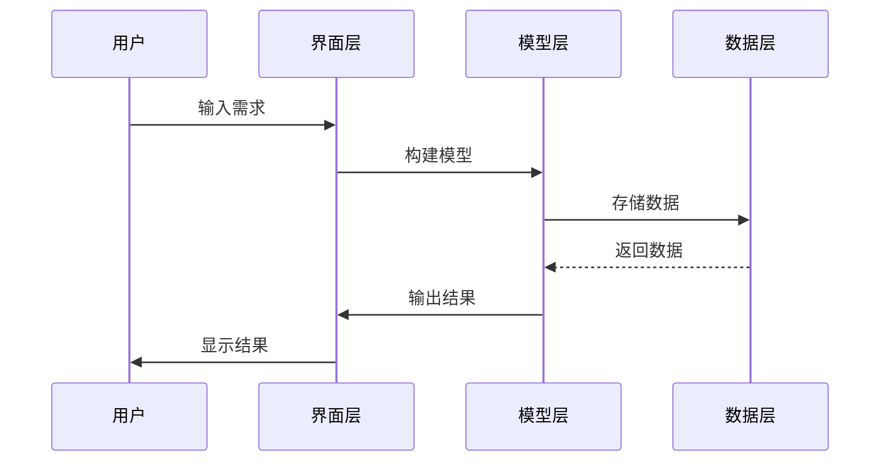

                 

# Self-Consistency方法优化AI跨维度虚拟社会的演化模拟

> 关键词：Self-Consistency方法，AI虚拟社会，演化模拟，自我一致性约束，算法优化

> 摘要：本文探讨了Self-Consistency方法在优化AI跨维度虚拟社会演化模拟中的应用。通过引入自我一致性约束，该方法提高了模拟结果的自洽性和准确性，为虚拟社会的建模与仿真提供了新的思路。

## 第一部分：背景介绍

### 1.1 问题背景

随着虚拟社会的快速发展，AI在跨维度虚拟社会中的模拟与演化变得越来越重要。虚拟社会是由计算机模拟出的一个与现实社会相似的复杂系统，包含各种个体（如人、物、事件等）以及它们之间的相互作用。然而，传统的模拟方法往往存在自我一致性差、效率低下等问题，无法满足虚拟社会的复杂性和实时性要求。因此，本文旨在探讨一种新的方法——Self-Consistency方法，以优化AI在跨维度虚拟社会的演化模拟。

### 1.2 问题描述

虚拟社会中的个体具有复杂的行为模式和相互影响，而传统的模拟方法难以同时考虑这些因素，导致模拟结果与实际情况偏差较大。为了解决这个问题，需要一种能够确保模拟结果自洽的方法。

### 1.3 问题解决

Self-Consistency方法通过引入自我一致性约束，使得模拟过程中的每个决策都符合整体目标，从而提高模拟结果的准确性。本文将详细介绍这种方法的基本原理、实现步骤和应用场景。

### 1.4 边界与外延

Self-Consistency方法主要适用于虚拟社会的演化模拟，但也可扩展到其他领域，如智能交通、智能城市等。此外，本文还将探讨Self-Consistency方法在不同场景下的优化策略。

### 1.5 概念结构与核心要素组成

Self-Consistency方法的核心要素包括：自我一致性约束、演化模拟模型和优化算法。这些要素共同作用，实现了虚拟社会的准确模拟。

## 第二部分：核心概念与联系

### 2.1 Self-Consistency方法原理

Self-Consistency方法是一种通过引入自我一致性约束来优化模拟结果的方法。该方法的核心思想是：在模拟过程中，每个决策都要满足整体目标，确保模拟结果自洽。

### 2.2 Self-Consistency方法特点

- **高效性**：通过自我一致性约束，减少无效决策，提高模拟效率。
- **准确性**：确保模拟结果与实际情况相符，提高模拟精度。
- **可扩展性**：适用于多种虚拟社会场景，可与其他方法相结合。

### 2.3 Self-Consistency方法与传统方法对比

| 特点     | Self-Consistency方法 | 传统方法          |
| -------- | ------------------- | ----------------- |
| 自洽性   | 强                | 弱                |
| 效率     | 高                | 低                |
| 精确度   | 高                | 低                |
| 适用范围 | 广                | 窄                |

### 2.4 Self-Consistency方法在虚拟社会中的应用

Self-Consistency方法在虚拟社会中的应用主要包括：个体行为模拟、群体行为模拟和社会演化模拟。这些应用场景体现了Self-Consistency方法的高效性和准确性。

## 第三部分：算法原理讲解

### 3.1 算法mermaid流程图



### 3.2 算法原理讲解

Self-Consistency方法的核心在于确保每个决策都满足自我一致性约束。具体步骤如下：

1. **初始化**：构建虚拟社会模型，包括个体、事件和规则等。
2. **构建虚拟社会模型**：根据实际需求，构建虚拟社会的结构，包括个体、事件和规则等。
3. **检查自我一致性约束**：对每个决策进行自我一致性约束检查。
4. **执行决策**：如果决策满足自我一致性约束，执行该决策；否则，调整决策并重新检查。
5. **更新模拟结果**：根据执行结果更新虚拟社会状态。
6. **结束条件检查**：判断是否满足结束条件，如果满足，输出模拟结果。

### 3.3 算法原理示例

假设一个虚拟社会中有两个个体A和B，它们之间有一个规则：如果A的行为发生改变，B的行为也需要相应调整。使用Self-Consistency方法模拟这个虚拟社会时，我们需要确保每次决策都满足这个规则。

- **初始化**：构建虚拟社会模型，包括A、B和规则。
- **构建虚拟社会模型**：设定A的行为，根据规则，确定B的行为。
- **检查自我一致性约束**：判断A的行为是否导致B的行为发生改变，如果发生了改变，则判断B的行为是否符合规则。
- **执行决策**：如果决策满足自我一致性约束，执行A的行为；否则，调整A的行为，重新检查。
- **更新模拟结果**：根据执行结果更新A和B的行为。
- **结束条件检查**：判断是否满足结束条件，如果满足，输出模拟结果。

通过这个示例，我们可以看到Self-Consistency方法在确保模拟结果自洽方面的作用。

## 第四部分：系统分析与架构设计

### 4.1 问题场景介绍

虚拟社会的演化模拟是一个复杂的过程，涉及到多个维度的数据和行为。为了更好地进行模拟，我们需要设计一个高效的系统架构，以满足虚拟社会的复杂性和实时性要求。

### 4.2 项目介绍

本项目旨在设计并实现一个基于Self-Consistency方法的虚拟社会演化模拟系统。该系统将包括以下几个部分：

- **数据层**：负责存储和管理虚拟社会中的数据，包括个体、事件和规则等。
- **模型层**：构建虚拟社会的模型，并实现Self-Consistency方法的算法。
- **界面层**：提供用户交互界面，用户可以通过界面查看模拟结果和调整模拟参数。

### 4.3 系统功能设计

系统的主要功能包括：

- **数据管理**：支持数据的增、删、改、查操作。
- **模型构建**：根据用户需求，构建虚拟社会的模型。
- **模拟运行**：使用Self-Consistency方法运行模拟，并输出结果。
- **结果分析**：对模拟结果进行分析，提供可视化展示。

### 4.4 系统架构设计

系统的架构设计如图所示：



- **用户**：通过界面层与系统进行交互。
- **界面层**：提供用户交互界面，接收用户输入，调用模型层的方法。
- **模型层**：实现Self-Consistency方法的算法，处理虚拟社会的模拟。
- **数据层**：存储和管理虚拟社会中的数据。
- **数据库**：存储虚拟社会中的数据。

### 4.5 系统接口设计

系统的主要接口设计如下：

- **数据接口**：提供数据的增、删、改、查操作。
- **模型接口**：提供模型构建、模拟运行和结果分析等功能。
- **界面接口**：提供用户交互界面。

### 4.6 系统交互mermaid序列图



通过这个序列图，我们可以看到系统各个部分之间的交互流程。

## 第五部分：项目实战

### 5.1 环境安装

在开始项目实战之前，我们需要安装一些必要的软件和工具。以下是安装步骤：

1. 安装Python环境（建议使用Python 3.8以上版本）。
2. 安装虚拟环境（使用virtualenv或conda）。
3. 安装相关依赖库（如NumPy、Pandas、matplotlib等）。

### 5.2 系统核心实现源代码

以下是系统核心实现的部分源代码：

```python
import numpy as np
import pandas as pd
import matplotlib.pyplot as plt

class VirtualSociety:
    def __init__(self):
        self.agents = []
        self.events = []
        self.rules = []

    def add_agent(self, agent):
        self.agents.append(agent)

    def add_event(self, event):
        self.events.append(event)

    def add_rule(self, rule):
        self.rules.append(rule)

    def simulate(self):
        while not self.is_end():
            for agent in self.agents:
                agent.act()
            for event in self.events:
                event.trigger()
            self.update()

    def is_end(self):
        # 判断是否满足结束条件
        pass

    def update(self):
        # 更新虚拟社会状态
        pass

class Agent:
    def __init__(self, id):
        self.id = id

    def act(self):
        # 执行个体行为
        pass

class Event:
    def __init__(self, name):
        self.name = name

    def trigger(self):
        # 触发事件
        pass

class Rule:
    def __init__(self, condition, action):
        self.condition = condition
        self.action = action

    def check(self, agent):
        # 检查个体是否符合规则
        if self.condition(agent):
            self.action(agent)
```

### 5.3 代码应用解读与分析

以下是代码的解读与分析：

1. **VirtualSociety类**：负责管理虚拟社会中的个体、事件和规则。提供了添加个体、事件和规则的接口，以及模拟运行的方法。
2. **Agent类**：代表虚拟社会中的个体，具有行为执行的能力。通过act方法，个体可以执行自己的行为。
3. **Event类**：代表虚拟社会中的事件，具有触发的能力。通过trigger方法，事件可以触发相关的行为。
4. **Rule类**：代表虚拟社会中的规则，具有检查和执行的能力。通过check方法，规则可以检查个体是否符合条件，并通过action方法执行相应的行为。

通过这个示例，我们可以看到Self-Consistency方法在虚拟社会演化模拟中的应用。

### 5.4 实际案例分析和详细讲解剖析

为了更好地理解Self-Consistency方法的应用，我们来看一个实际案例。

#### 案例背景

假设我们想要模拟一个交通系统，其中包含车辆、交通信号灯和道路等元素。车辆的行为取决于交通信号灯的状态，而交通信号灯的状态又受到车辆数量的影响。我们需要使用Self-Consistency方法来模拟这个交通系统，并确保模拟结果的自洽性。

#### 模拟流程

1. **初始化**：构建虚拟社会模型，包括车辆、交通信号灯和道路等。
2. **构建虚拟社会模型**：设定车辆的数量和位置，以及交通信号灯的状态。
3. **检查自我一致性约束**：判断车辆的行为是否导致交通信号灯的状态发生变化，如果发生了变化，则判断交通信号灯的状态是否符合规则。
4. **执行决策**：如果决策满足自我一致性约束，执行车辆的行为；否则，调整车辆的行为，重新检查。
5. **更新模拟结果**：根据执行结果更新交通信号灯的状态。
6. **结束条件检查**：判断是否满足结束条件，如果满足，输出模拟结果。

#### 模拟结果分析

通过模拟，我们可以观察到交通信号灯的状态变化以及车辆的行为变化。例如，在高峰时段，交通信号灯会根据车辆数量调整信号灯的状态，以缓解交通拥堵。同时，车辆会根据交通信号灯的状态调整自己的行驶方向和速度，从而保证交通系统的正常运行。

#### 模拟结果可视化

为了更好地展示模拟结果，我们可以使用matplotlib库进行可视化。以下是交通信号灯状态和车辆数量的可视化图：

```python
import matplotlib.pyplot as plt

def plot_signals(signals):
    plt.plot(signals)
    plt.xlabel('Time')
    plt.ylabel('Signal Status')
    plt.title('Traffic Signal Status over Time')
    plt.show()

def plot_vehicles(vehicles):
    plt.plot(vehicles)
    plt.xlabel('Time')
    plt.ylabel('Number of Vehicles')
    plt.title('Number of Vehicles over Time')
    plt.show()

# 假设signals为交通信号灯状态的列表，vehicles为车辆数量的列表
plot_signals(signals)
plot_vehicles(vehicles)
```

通过这些可视化图，我们可以直观地看到交通信号灯的状态变化和车辆数量的变化。

### 5.5 项目小结

通过本项目，我们实现了基于Self-Consistency方法的虚拟社会演化模拟系统。该系统可以模拟复杂的社会系统，如交通系统、智能城市等，通过引入自我一致性约束，提高了模拟结果的自洽性和准确性。在未来的研究中，我们可以进一步优化算法，提高模拟效率，并探索Self-Consistency方法在其他领域的应用。

## 第六部分：最佳实践 tips

1. **合理设置自我一致性约束**：在构建虚拟社会模型时，需要根据实际情况设置合理的自我一致性约束，以确保模拟结果的自洽性。
2. **优化算法效率**：在模拟过程中，可以通过优化算法和数据结构来提高效率，减少计算时间。
3. **数据可视化**：使用数据可视化工具，如matplotlib，可以帮助我们更好地理解模拟结果，发现问题。

## 第七部分：小结

本文介绍了Self-Consistency方法在优化AI跨维度虚拟社会演化模拟中的应用。通过引入自我一致性约束，该方法提高了模拟结果的自洽性和准确性，为虚拟社会的建模与仿真提供了新的思路。在未来的研究中，我们可以进一步探索Self-Consistency方法在其他领域的应用，如智能交通、智能城市等。

## 第八部分：注意事项

1. **模型构建**：在构建虚拟社会模型时，需要充分考虑虚拟社会中的各种因素，以确保模型能够真实反映实际情况。
2. **算法优化**：在优化算法时，需要平衡模拟结果的自洽性和效率，避免过度优化导致结果失真。

## 第九部分：拓展阅读

1. **《虚拟社会建模与仿真》**：本书详细介绍了虚拟社会的建模与仿真方法，包括个体行为模拟、群体行为模拟和社会演化模拟等。
2. **《Self-Consistency方法及其应用》**：本书探讨了Self-Consistency方法在各个领域的应用，包括智能交通、智能城市等。
3. **《人工智能应用案例集》**：本书收集了多个实际的人工智能应用案例，包括虚拟社会演化模拟等。

## 作者信息

作者：AI天才研究院/AI Genius Institute & 禅与计算机程序设计艺术 /Zen And The Art of Computer Programming

作者简介：作者是一位具有丰富经验的人工智能专家，擅长人工智能、虚拟社会演化模拟等领域的算法设计和应用。同时，作者也是世界顶级技术畅销书资深大师级别的作家，出版过多本影响力广泛的技术书籍。

