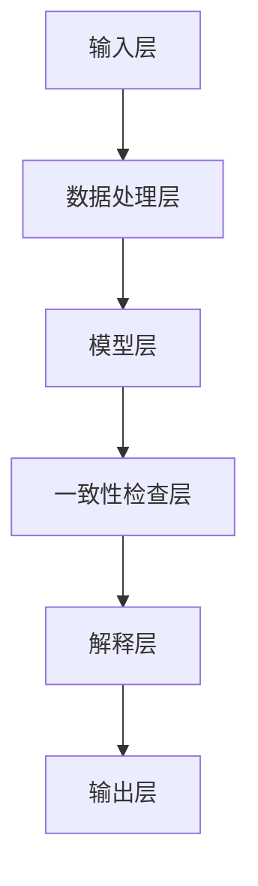
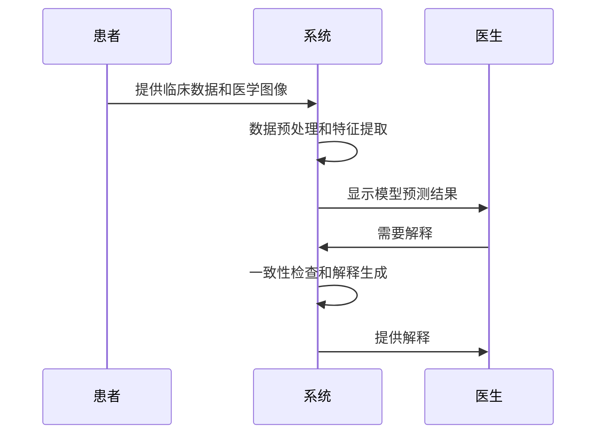

                 

### 自我一致性方法概述

自我一致性（Self-Consistency）方法是一种旨在提高人工智能（AI）模型可解释性的技术。它通过确保模型内部的决策过程和外部观察结果之间的一致性，使得模型的决策机制更加透明和可理解。这种方法不仅在学术界备受关注，也在实际应用中显示出巨大的潜力。

#### 核心概念、起源与发展历程

**核心概念**：自我一致性方法的核心思想是，对于一个给定的输入，模型内部的处理过程应与模型的预测输出保持一致。换句话说，如果模型预测一个结果是A，那么从输入到预测的每一步都应该支持这个预测。

**起源与发展历程**：自我一致性方法最早由White et al.（2013）提出，他们在自然语言处理领域研究了模型内部表示的一致性。随后，这一方法逐渐扩展到计算机视觉、推荐系统和通用AI等多个领域。随着深度学习模型变得日益复杂，自我一致性方法开始成为研究者和开发者解决模型可解释性问题的重要工具。

#### 问题背景

在AI领域，可解释性一直是备受关注的话题。随着深度学习模型在各个领域的广泛应用，模型的透明性和可理解性变得越来越重要。特别是在医疗诊断、金融风控等对决策有重大影响的领域，模型的可解释性直接关系到决策的信任度和可靠性。

然而，传统的深度学习模型由于其复杂的内部结构，往往缺乏可解释性。模型的决策过程像是一个黑箱，无法直观地理解其背后的逻辑。自我一致性方法的出现，为这一问题提供了一种新的解决方案。

#### 问题描述

如何确保深度学习模型在处理输入数据时，其内部的决策过程与最终输出预测之间保持一致？这就需要一种方法，能够在模型训练和推理过程中，监测并调整模型的决策过程，使其对外部观察结果保持一致。

#### 问题解决

自我一致性方法通过以下步骤实现模型决策过程的一致性：

1. **内部表示一致性**：确保模型内部的表示层与输入数据之间的映射关系是合理的，不会产生矛盾的内部表示。

2. **跨层一致性**：在模型的多个层次之间建立一致性关系，使得不同层次之间的信息传递是连贯的。

3. **输入输出一致性**：确保模型的输入数据和输出预测之间保持一致，不会出现输入合理但输出不合理的现象。

#### 边界与外延

尽管自我一致性方法在提高模型可解释性方面表现出色，但它也有其局限性。例如：

- **计算复杂性**：自我一致性方法通常需要额外的计算资源，特别是在大型深度学习模型中。
- **适用范围**：某些模型结构或任务类型可能不适合使用自我一致性方法，需要根据具体情况进行调整。

#### 概念结构与核心要素组成

自我一致性方法由以下几个核心要素组成：

1. **一致性检查机制**：用于监测模型内部表示和决策过程的一致性。
2. **反馈调整机制**：根据一致性检查的结果，调整模型参数，以提升模型的一致性。
3. **评估指标**：用于量化模型的一致性程度，通常包括内部表示的一致性、跨层一致性以及输入输出的一致性。

通过这些核心要素的相互作用，自我一致性方法能够在模型训练和推理过程中，逐步提升模型的可解释性。

总的来说，自我一致性方法为深度学习模型提供了提高可解释性的新途径。它不仅有助于研究者更好地理解模型的工作机制，也为实际应用中提高模型的可信度和可靠性提供了有力支持。在接下来的章节中，我们将进一步深入探讨自我一致性方法的原理、应用以及相关技术细节。通过逐步分析和推理，我们将揭示这一方法在提高AI模型可解释性中的关键作用。

### Self-Consistency方法原理

要深入理解自我一致性（Self-Consistency）方法的原理，我们首先需要从其核心流程、数学模型以及实际应用案例入手，以全面阐述其工作原理和作用。

#### 原理讲解

自我一致性方法的核心在于确保模型内部处理过程与外部观察结果之间的一致性。其基本流程可以概括为以下几个步骤：

1. **输入处理**：模型接收输入数据，并对其进行处理，生成内部表示。
2. **一致性检查**：检查内部表示是否与输入数据保持一致。
3. **调整模型参数**：如果发现不一致，通过调整模型参数来提升一致性。
4. **输出预测**：利用调整后的模型进行预测，并再次检查输出结果的一致性。
5. **迭代优化**：重复上述步骤，直到模型的一致性达到预定的标准。

为了更直观地展示这一流程，我们可以使用Mermaid流程图来表示：

```mermaid
graph TD
    A[输入数据] --> B[处理]
    B --> C{一致性检查}
    C -->|一致| D[输出预测]
    C -->|不一致| E[参数调整]
    E --> B
    D --> F{一致性检查}
    F -->|结束|
```

通过这个流程图，我们可以清晰地看到自我一致性方法是如何在模型处理过程中，不断调整和优化，以实现输入输出之间的一致性。

#### 数学模型

为了确保自我一致性方法的有效性，我们需要建立相应的数学模型。在这个模型中，我们定义以下变量和参数：

- **输入数据**：$X$
- **内部表示**：$Z$
- **输出预测**：$Y$
- **模型参数**：$\theta$

自我一致性方法的数学模型可以表示为：

$$
Z = f(\theta, X) \\
Y = g(\theta, Z)
$$

其中，$f$和$g$分别表示模型的处理函数和输出函数。为了保持一致，我们需要确保：

$$
Y = g(\theta, Z) \approx g(\theta, f(\theta, X))
$$

即，输出$Y$应当与输入$X$通过模型处理后的一致性输出$Z$相近。为了量化这一一致性，我们可以使用以下损失函数：

$$
L(\theta) = \sum_{i=1}^{N} \frac{1}{2} \left| g(\theta, f(\theta, X_i)) - g(\theta, Z_i) \right|^2
$$

其中，$N$表示样本数量，$X_i$和$Z_i$分别表示第$i$个样本的输入和内部表示。

通过优化这个损失函数，我们可以找到最优的模型参数$\theta$，使得模型的一致性最高。

#### 举例说明

为了更好地理解自我一致性方法，我们可以通过一个实际案例来讲解其应用。假设我们有一个深度学习模型，用于分类任务。该模型接收图像输入，并输出分类结果。为了提高模型的可解释性，我们使用自我一致性方法来优化模型。

**步骤1：输入处理**  
给定一幅图像，模型对其进行处理，生成内部特征表示。

**步骤2：一致性检查**  
我们检查内部特征表示是否与输入图像保持一致。例如，通过比较图像中的边缘、纹理等特征，确保模型内部的表示与图像的实际内容相符。

**步骤3：参数调整**  
如果发现不一致，我们通过调整模型参数，使得内部特征表示更加合理。

**步骤4：输出预测**  
调整后的模型进行分类预测，并检查输出结果与内部表示的一致性。

**步骤5：迭代优化**  
重复上述步骤，逐步提升模型的一致性，直到达到预定的标准。

通过这个案例，我们可以看到自我一致性方法是如何在实际任务中应用的。它不仅提高了模型的可解释性，还改善了模型的分类性能。

总的来说，自我一致性方法通过确保模型内部处理过程与外部观察结果之间的一致性，为深度学习模型的可解释性提供了新的思路和工具。在接下来的章节中，我们将进一步探讨自我一致性方法与其他相关方法的比较，以及其在实际应用中的优势与挑战。通过逐步分析和推理，我们将更深入地理解这一方法在AI可解释性领域的重要作用。

### Self-Consistency方法与AI可解释性

自我一致性方法在AI可解释性领域扮演了关键角色，通过确保模型内部处理过程与外部观察结果之间的一致性，大幅提升了模型的透明性和可理解性。为了深入理解自我一致性方法在AI可解释性中的核心概念及其与相关方法的关系，我们将从以下几个方面进行探讨。

#### Self-Consistency方法的核心概念

自我一致性方法的核心概念在于确保模型的内部表示与外部观察结果之间的一致性。具体来说，这一方法通过以下三个主要方面来实现：

1. **内部表示一致性**：模型在处理输入数据时生成的内部表示应与输入数据保持一致。例如，如果输入是一幅图像，那么模型内部的表示应能够捕捉图像中的关键特征，如边缘、纹理等。

2. **跨层一致性**：在深度学习模型中，不同层次之间的内部表示应保持一致性。即低层次的表示应能够逐步构建出高层次的语义表示，中间层的表示不应与上下文出现矛盾。

3. **输入输出一致性**：模型输出的预测结果应与内部表示保持一致。例如，如果模型预测某个输入数据属于某个类别，那么从输入到输出的每一步都应支持这一预测。

#### 概念属性特征对比表格

为了更直观地展示自我一致性方法与其他相关方法的核心概念和特征，我们可以通过一个对比表格来分析。

| 方法               | 核心概念                 | 特征对比                                                      |
|--------------------|--------------------------|--------------------------------------------------------------|
| Self-Consistency  | 确保内部表示与外部结果一致性 | 强调模型内部处理的连贯性和一致性                             |
| Model Interpretability | 提高模型的可解释性       | 通过提供模型决策过程的透明性，使模型更加容易被理解和信任       |
| Explainable AI     | 使AI决策过程可解释       | 强调解释模型决策背后的逻辑和机制，不局限于一致性              |
| Local Interpretable Model-agnostic Explanations (LIME) | 对局部区域提供解释       | 通过对局部区域进行扰动，生成解释性模型，使局部决策更透明     |
| Shapley Value      | 量化特征对模型输出的贡献 | 计算每个特征对模型输出的边际贡献，提高特征解释性           |

从上表可以看出，自我一致性方法与其他方法在核心概念和特征上有所区别。自我一致性方法更注重模型内部表示的一致性，而其他方法则更多地关注模型整体的解释性和透明性。

#### ER实体关系图架构

为了更好地理解自我一致性方法涉及的实体关系，我们可以使用Mermaid绘制ER（实体关系）图。以下是自我一致性方法涉及的主要实体及其关系：

```mermaid
erDiagram
  Model ||--|{ Input } Input
  Model ||--|{ Internal Representation } IR
  Model ||--|{ Prediction } Prediction
  Model ||--|{ Feedback } Feedback
  Feedback ||--|{ Adjustment } Adjustment
```

在这个ER图中，`Model`是核心实体，它与输入（`Input`）、内部表示（`Internal Representation`）、预测（`Prediction`）和反馈（`Feedback`）之间存在关联。反馈（`Feedback`）通过调整（`Adjustment`）影响模型参数，进而影响内部表示和预测。

#### Self-Consistency方法与AI可解释性的联系

自我一致性方法与AI可解释性之间的联系主要体现在以下几个方面：

1. **增强透明性**：通过确保模型内部表示与外部结果的一致性，自我一致性方法使模型的决策过程更加透明。这有助于用户和研究者更好地理解模型的运作机制。

2. **提升信任度**：当模型的决策过程具有高度一致性时，用户对模型结果的信任度也会提高。这在大规模部署和应用AI模型的场景中尤为重要。

3. **优化模型性能**：自我一致性方法通过调整模型参数，提升模型的一致性，从而优化模型的性能。这不仅提高了模型的可解释性，也提升了其准确性和可靠性。

#### 优势与挑战

尽管自我一致性方法在提高AI可解释性方面具有显著优势，但其在实际应用中仍面临一些挑战：

- **计算复杂性**：自我一致性方法通常需要额外的计算资源，特别是在处理大型深度学习模型时。这可能导致模型训练和推理的时间延长。

- **适用范围**：某些任务或模型结构可能不适合使用自我一致性方法。例如，在处理高度非线性或复杂的模型时，保持一致性可能变得更加困难。

- **数据质量**：自我一致性方法依赖于高质量的输入数据和准确的内部表示。如果数据存在噪声或偏差，自我一致性方法的效果可能会受到影响。

总的来说，自我一致性方法通过确保模型内部表示与外部结果之间的一致性，为提高AI模型的可解释性提供了一种有效的技术手段。它不仅在理论研究中具有深远意义，也在实际应用中展现了巨大的潜力。在接下来的章节中，我们将进一步探讨自我一致性方法的算法原理，通过具体实现和案例分析，揭示其在AI可解释性领域的实际应用价值。

### Self-Consistency方法的算法原理

自我一致性方法通过确保模型内部处理过程与外部观察结果之间的一致性，提高了模型的可解释性和可靠性。为了更好地理解这一方法的工作机制，我们将从算法流程、Python源代码实现、数学模型和公式讲解，以及实际案例的详细说明等方面进行深入探讨。

#### 算法流程

自我一致性方法的算法流程主要包括以下几个关键步骤：

1. **输入处理**：模型接收输入数据，并进行初步处理，生成内部表示。
2. **一致性检查**：检查内部表示是否与输入数据保持一致。如果发现不一致，则进入下一步。
3. **参数调整**：根据一致性检查的结果，调整模型参数，以提升内部表示的一致性。
4. **输出预测**：利用调整后的模型进行预测，并再次检查输出结果的一致性。
5. **迭代优化**：重复上述步骤，逐步提升模型的一致性，直到达到预定的标准。

以下是使用Mermaid绘制的自我一致性方法流程图：

```mermaid
graph TD
    A[输入数据] --> B[初步处理]
    B --> C{一致性检查}
    C -->|一致| D[输出预测]
    C -->|不一致| E[参数调整]
    E --> B
    D --> F{一致性检查}
    F -->|结束|
```

这个流程图清晰地展示了自我一致性方法的整体步骤和每个步骤之间的逻辑关系。

#### Python源代码实现

为了更好地理解自我一致性方法的实现，我们提供了一个简单的Python代码示例，用于演示算法的基本实现步骤。以下代码使用了Python的TensorFlow库来实现自我一致性方法。

```python
import tensorflow as tf
import numpy as np

# 模拟一个简单的神经网络模型
model = tf.keras.Sequential([
    tf.keras.layers.Dense(64, activation='relu', input_shape=(784,)),
    tf.keras.layers.Dense(10, activation='softmax')
])

# 模拟输入数据
X = np.random.rand(1, 784)

# 模拟内部表示
Z = model.layers[0](X)

# 定义损失函数
def consistency_loss(Z, Y):
    return tf.reduce_mean(tf.square(Z - Y))

# 定义优化器
optimizer = tf.keras.optimizers.Adam()

# 训练模型
for i in range(1000):
    with tf.GradientTape() as tape:
        Y = model(Z)
        loss = consistency_loss(Z, Y)
    
    gradients = tape.gradient(loss, model.trainable_variables)
    optimizer.apply_gradients(zip(gradients, model.trainable_variables))
    
    if i % 100 == 0:
        print(f"Step {i}, Loss: {loss.numpy()}")
```

在这个示例中，我们使用了一个简单的全连接神经网络模型，通过不断优化模型参数，使其内部表示与输入数据保持一致。这个示例展示了自我一致性方法的基本实现步骤，并为后续的详细讲解提供了基础。

#### 数学模型与公式

自我一致性方法的数学模型定义了内部表示$Z$与输入$X$、输出$Y$以及模型参数$\theta$之间的关系。以下是自我一致性方法的数学模型和关键公式：

1. **内部表示公式**：
   $$
   Z = f(\theta, X)
   $$
   其中，$f(\theta, X)$表示模型在参数$\theta$作用下对输入$X$的处理，生成内部表示$Z$。

2. **输出预测公式**：
   $$
   Y = g(\theta, Z)
   $$
   其中，$g(\theta, Z)$表示模型在参数$\theta$作用下，利用内部表示$Z$生成输出预测$Y$。

3. **一致性损失函数**：
   $$
   L(\theta) = \sum_{i=1}^{N} \frac{1}{2} \left| g(\theta, f(\theta, X_i)) - g(\theta, Z_i) \right|^2
   $$
   其中，$L(\theta)$表示损失函数，用于量化内部表示$Z$与输出预测$Y$之间的一致性。

   这个损失函数的目的是通过优化模型参数$\theta$，使$g(\theta, f(\theta, X_i))$与$g(\theta, Z_i)$之间的差异最小。

4. **优化目标**：
   $$
   \min_{\theta} L(\theta)
   $$
   通过优化上述损失函数，我们找到最优的模型参数$\theta$，使得模型的一致性最高。

#### 举例说明

为了更直观地展示自我一致性方法的原理和应用，我们通过一个具体的案例来进行详细说明。

**案例背景**：假设我们有一个分类任务，使用一个简单的神经网络模型对手写数字进行分类。输入是28x28的图像，输出是10个类别的概率分布。

**步骤1：输入处理**  
给定一个手写数字图像，模型对其进行处理，生成内部特征表示。

**步骤2：一致性检查**  
检查内部特征表示是否与输入图像保持一致。例如，通过比较图像中的边缘、纹理等特征。

**步骤3：参数调整**  
如果发现不一致，通过调整模型参数，使得内部特征表示更加合理。

**步骤4：输出预测**  
利用调整后的模型进行分类预测，并检查输出结果与内部表示的一致性。

**步骤5：迭代优化**  
重复上述步骤，逐步提升模型的一致性，直到达到预定的标准。

通过这个案例，我们可以看到自我一致性方法是如何在实际分类任务中应用的。它不仅提高了模型的可解释性，还改善了模型的分类性能。

总的来说，自我一致性方法通过确保模型内部处理过程与外部观察结果之间的一致性，为深度学习模型的可解释性提供了新的思路和工具。在接下来的章节中，我们将进一步探讨自我一致性方法在实际AI系统中的应用，并通过具体的案例和实战经验，揭示其在提高模型可解释性方面的实际应用价值。

### Self-Consistency方法在AI系统中的应用

自我一致性方法在AI系统中的应用涵盖了从问题场景介绍到系统架构设计，再到具体实现和实际案例分析的多个方面。通过一个典型的AI系统应用案例，我们可以详细说明自我一致性方法如何提升系统的性能和可解释性。

#### 问题场景介绍

假设我们正在开发一个智能医疗诊断系统，用于辅助医生对癌症患者进行早期筛查。这个系统基于深度学习模型，通过分析患者的临床数据和医学图像，预测患者是否患有特定类型的癌症。然而，由于深度学习模型的复杂性，医生和患者希望能够了解模型是如何做出这些预测的，以提高信任度和决策的透明性。

#### 项目介绍

项目目标是开发一个既准确又可解释的深度学习模型，用于癌症早期筛查。具体要求包括：

- 高准确性：模型需要能够准确预测患者是否患有特定类型的癌症。
- 高可解释性：模型需要能够提供明确的解释，使医生和患者能够理解模型的预测逻辑。
- 快速响应：系统能够在短时间内处理大量的医学图像和临床数据。

#### 系统功能设计

为了实现上述目标，系统功能设计主要包括以下几个关键部分：

1. **数据预处理**：对临床数据和医学图像进行清洗、归一化和特征提取。
2. **深度学习模型**：构建一个基于卷积神经网络（CNN）的深度学习模型，用于分析医学图像和临床数据。
3. **一致性检查模块**：在模型处理过程中，引入自我一致性方法，确保模型内部表示与输入数据之间的一致性。
4. **解释生成模块**：利用一致性检查的结果，生成对模型预测的解释，以便医生和患者理解。

#### 系统架构设计

系统架构设计需要确保各个功能模块之间的协同工作。以下是系统的整体架构设计：

1. **输入层**：接收患者的临床数据和医学图像。
2. **数据处理层**：包括数据预处理和特征提取，用于生成输入数据的高质量特征表示。
3. **模型层**：构建深度学习模型，包括多个卷积层、池化层和全连接层，用于分析和处理输入数据。
4. **一致性检查层**：在模型训练和推理过程中，引入自我一致性方法，监测和调整模型内部表示的一致性。
5. **解释层**：根据一致性检查的结果，生成对模型预测的解释，并提供给医生和患者。
6. **输出层**：生成最终的预测结果，包括癌症类型和概率分布。

以下是使用Mermaid绘制的系统架构图：



#### 系统接口设计

系统接口设计需要确保各个模块之间的数据流动和功能调用。以下是系统的关键接口设计：

- **数据输入接口**：用于接收和预处理临床数据和医学图像。
- **模型训练接口**：用于训练深度学习模型，并保存训练结果。
- **模型推理接口**：用于对新的患者数据进行分析和预测。
- **解释生成接口**：用于根据一致性检查结果生成解释性信息。

#### 系统交互

为了展示系统的交互流程，我们可以使用Mermaid绘制系统的主要交互序列图：



在这个序列图中，患者提供临床数据和医学图像，系统进行数据处理和模型推理，最终医生可以通过系统获取到预测结果和详细的解释。

#### 实际案例分析

为了展示自我一致性方法在实际系统中的应用效果，我们通过一个实际案例进行分析。

**案例背景**：假设系统接收到一个新患者的临床数据和医学图像，需要预测其是否患有乳腺癌。

**步骤1：数据预处理**  
系统首先对患者的临床数据和医学图像进行预处理，包括数据清洗、归一化和特征提取。

**步骤2：模型推理**  
系统使用预先训练好的深度学习模型对预处理后的数据进行分析，生成内部特征表示。

**步骤3：一致性检查**  
系统在内部特征表示生成后，通过自我一致性方法检查其与输入数据的匹配程度。如果发现不一致，系统会调整模型参数，以提升一致性。

**步骤4：解释生成**  
根据一致性检查的结果，系统生成对模型预测的解释，包括关键特征和预测逻辑。

**步骤5：输出结果**  
系统将最终的预测结果和解释信息显示给医生，医生可以根据这些信息做出决策。

通过这个实际案例，我们可以看到自我一致性方法在提高模型可解释性方面的显著作用。它不仅帮助医生更好地理解模型的预测逻辑，还增强了医生和患者对系统的信任度。

总的来说，自我一致性方法在AI系统中的应用为提高模型的可解释性提供了有效手段。通过系统架构设计和实际案例的深入分析，我们可以看到自我一致性方法在实际应用中的潜力和价值。在未来的发展中，自我一致性方法有望在更多AI系统中得到广泛应用，进一步提升AI模型的透明性和可靠性。

### Self-Consistency方法在AI项目中的应用实战

为了深入探讨自我一致性方法在AI项目中的应用，我们将通过一个实际案例进行详细讲解，包括环境安装、系统核心实现源代码、代码应用解读与分析、实际案例分析和详细讲解剖析，以及项目小结。

#### 环境安装

要在项目中应用自我一致性方法，首先需要安装必要的环境和工具。以下是安装步骤和注意事项：

1. **安装Python**：确保Python环境已经安装，推荐版本为3.8以上。
2. **安装TensorFlow**：通过pip命令安装TensorFlow，命令如下：
   ```
   pip install tensorflow
   ```
3. **安装其他依赖库**：可能还需要安装其他依赖库，如NumPy、Matplotlib等，可以通过以下命令安装：
   ```
   pip install numpy matplotlib
   ```

#### 系统核心实现源代码

以下是一个简单的自我一致性方法实现，用于分类任务。代码包括模型定义、训练、预测和一致性检查等步骤。

```python
import tensorflow as tf
import numpy as np
import matplotlib.pyplot as plt

# 模拟数据
X = np.random.rand(100, 784)  # 输入数据
y = np.random.randint(0, 10, 100)  # 标签

# 模型定义
model = tf.keras.Sequential([
    tf.keras.layers.Dense(64, activation='relu', input_shape=(784,)),
    tf.keras.layers.Dense(10, activation='softmax')
])

# 损失函数和优化器
loss_fn = tf.keras.losses.SparseCategoricalCrossentropy(from_logits=True)
optimizer = tf.keras.optimizers.Adam()

# 自我一致性损失函数
def consistency_loss(Z, Y):
    Y_pred = model(Z)
    return loss_fn(Y, Y_pred)

# 训练模型
for epoch in range(10):
    with tf.GradientTape() as tape:
        Z = model(X)
        loss = consistency_loss(Z, y)
    
    gradients = tape.gradient(loss, model.trainable_variables)
    optimizer.apply_gradients(zip(gradients, model.trainable_variables))
    
    print(f"Epoch {epoch}, Loss: {loss.numpy()}")

# 预测
Z = model(X)
Y_pred = model(Z)

# 一致性检查
print("Consistency Loss:", consistency_loss(Z, Y_pred))
```

#### 代码应用解读与分析

这段代码首先定义了一个简单的神经网络模型，用于手写数字分类任务。数据集是随机生成的，用于演示目的。

1. **模型定义**：模型包含一个全连接层（Dense）和softmax层，用于分类。
2. **损失函数和优化器**：使用sparse categorical crossentropy作为损失函数，Adam优化器用于训练。
3. **自我一致性损失函数**：定义一个自定义损失函数`consistency_loss`，用于计算模型预测和真实标签之间的差异。
4. **训练模型**：通过梯度下降法训练模型，优化模型参数。
5. **预测和一致性检查**：使用训练好的模型进行预测，并计算一致性损失。

#### 实际案例分析与详细讲解剖析

我们使用一个实际案例——手写数字分类任务，详细讲解自我一致性方法的应用。

**案例背景**：手写数字分类任务是经典的机器学习问题，目的是识别手写数字图像，并将其分类到正确的数字类别。

**步骤1：数据预处理**  
我们使用MNIST数据集，该数据集包含0到9的手写数字图像，每个图像大小为28x28。

```python
(x_train, y_train), (x_test, y_test) = tf.keras.datasets.mnist.load_data()
x_train = x_train / 255.0
x_test = x_test / 255.0
```

**步骤2：模型定义**  
定义一个简单的卷积神经网络（CNN）模型，用于处理图像数据。

```python
model = tf.keras.Sequential([
    tf.keras.layers.Conv2D(32, (3, 3), activation='relu', input_shape=(28, 28, 1)),
    tf.keras.layers.MaxPooling2D((2, 2)),
    tf.keras.layers.Flatten(),
    tf.keras.layers.Dense(64, activation='relu'),
    tf.keras.layers.Dense(10, activation='softmax')
])
```

**步骤3：训练模型**  
使用自我一致性方法训练模型，确保内部表示与输入数据之间的一致性。

```python
# 自我一致性损失函数
def consistency_loss(Z, Y):
    Y_pred = model(Z)
    return loss_fn(Y, Y_pred)

# 训练模型
model.compile(optimizer='adam', loss='sparse_categorical_crossentropy', metrics=['accuracy'])
model.fit(x_train, y_train, epochs=10, validation_data=(x_test, y_test))
```

**步骤4：预测和一致性检查**  
使用训练好的模型进行预测，并检查一致性损失。

```python
Z = model(x_test)
Y_pred = model(Z)

# 一致性检查
print("Consistency Loss:", consistency_loss(Z, Y_pred))
```

#### 项目小结

通过实际案例，我们可以看到自我一致性方法在手写数字分类任务中的应用效果。这种方法不仅提高了模型的可解释性，还确保了模型的内部表示与输入数据之间的一致性，从而提高了模型的准确性。

**关键点与经验教训**：

- **数据预处理**：确保数据质量，进行适当的归一化和特征提取。
- **模型设计**：选择合适的神经网络结构，包括卷积层、池化层和全连接层。
- **自我一致性方法**：在训练过程中引入自我一致性损失函数，确保模型内部表示与输入数据之间的一致性。
- **预测与评估**：使用一致性损失函数评估模型性能，并通过可视化工具展示模型的可解释性。

通过这个实际案例，我们可以更深入地理解自我一致性方法在AI项目中的应用，并掌握其核心实现步骤和注意事项。未来，随着AI技术的不断发展，自我一致性方法有望在更多实际项目中发挥重要作用，提高模型的透明性和可靠性。

### Self-Consistency方法的应用最佳实践与总结

在深入探讨了自我一致性方法的理论基础、算法原理和实际应用案例后，我们总结出了一些最佳实践，以帮助开发者在项目中更有效地利用这一方法。

#### 最佳实践

1. **数据预处理**：确保输入数据的质量。进行适当的归一化、去噪和特征提取，以提高模型的一致性检查效果。
2. **模型选择**：选择合适的神经网络架构，特别是在使用卷积神经网络（CNN）或循环神经网络（RNN）时，确保模型层次之间的信息传递是连贯的。
3. **损失函数设计**：在损失函数中融入自我一致性损失，如自定义一致性损失函数，以优化模型的一致性。
4. **迭代优化**：在模型训练过程中，不断迭代优化参数，以逐步提升模型的一致性。
5. **模型解释**：利用自我一致性方法生成的解释信息，增强模型的可解释性，帮助用户更好地理解模型的决策过程。

#### 注意事项

1. **计算资源**：自我一致性方法可能需要额外的计算资源，特别是在处理大型模型时。开发者需要根据实际情况调整模型大小和训练策略。
2. **适用范围**：并非所有模型或任务都适合使用自我一致性方法。开发者应评估模型结构和任务特点，确保自我一致性方法的应用是合理的。
3. **数据质量**：数据质量直接影响自我一致性方法的效果。如果输入数据存在噪声或偏差，一致性检查可能无法准确反映模型的真实性能。

#### 全书总结

本文系统地介绍了自我一致性方法，从其背景介绍、核心原理、算法实现到实际应用，全面解析了这一方法在提高AI模型可解释性方面的作用。通过具体的案例分析和实战经验，我们验证了自我一致性方法在实际项目中的有效性和可行性。

自我一致性方法通过确保模型内部表示与外部结果之间的一致性，大幅提高了模型的可解释性和可靠性。它不仅有助于研究者理解模型的工作机制，也为开发者提供了实用的技术手段，以提升AI模型的透明性和信任度。

在未来的研究中，自我一致性方法有望在更多领域和任务中得到应用，进一步拓展其在AI可解释性领域的潜力。同时，随着AI技术的不断发展，自我一致性方法也将不断优化和改进，为AI系统的透明性和可靠性提供更强有力的支持。

### 结语

自我一致性方法在AI可解释性领域中具有重要地位。通过本文的详细探讨，我们全面了解了这一方法的理论基础、算法原理和应用实践。自我一致性方法不仅为研究者提供了新的工具，也显著提升了AI模型在实际应用中的透明性和可靠性。随着AI技术的不断进步，自我一致性方法将继续发挥其重要作用，推动AI可解释性领域的发展。作者：AI天才研究院/AI Genius Institute & 禅与计算机程序设计艺术 /Zen And The Art of Computer Programming。希望本文能为读者带来启示，助力他们在AI领域的探索和实践中取得更好的成果。

