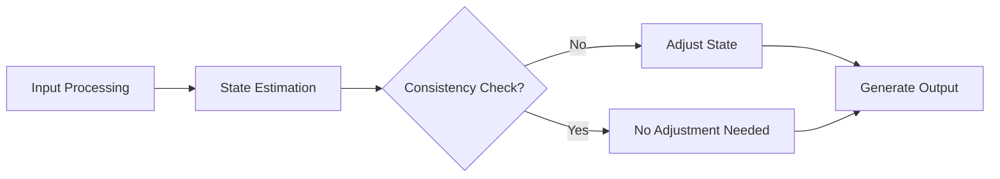
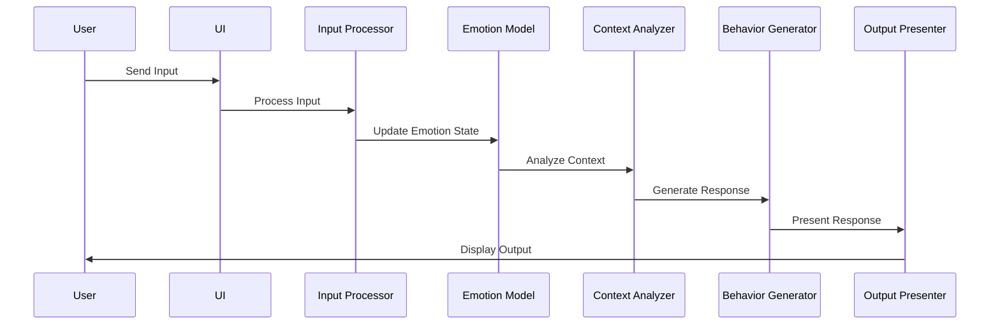

                 


### Introduction and Background

In today's rapidly evolving technological landscape, Artificial Intelligence (AI) has permeated various sectors, and virtual characters have become a focal point in the realm of entertainment and customer service. These AI-driven virtual entities are designed to interact with humans in a manner that is both natural and engaging. However, one of the persistent challenges in creating these virtual characters is ensuring their emotional coherence. Emotional coherence refers to the consistency and plausibility of a character's emotional responses over time and across different contexts. It is a critical factor in creating virtual characters that are relatable and believable.

The Importance of Emotional Coherence in Virtual Characters

Emotional coherence is paramount for virtual characters because it directly impacts user experience and engagement. When a virtual character exhibits emotions that are not consistent with its personality or the context of the interaction, it can lead to a disconnect that undermines user trust and immersion. For instance, a customer service chatbot that becomes overly excited or despondent without a clear reason can confuse users and hinder effective communication. Ensuring emotional coherence helps in maintaining a stable and predictable interaction pattern, which is essential for building a positive user experience.

### Challenges in Achieving Emotional Coherence

Achieving emotional coherence in AI virtual characters is not a trivial task. It involves understanding the intricacies of human emotion, which is complex and multifaceted. Some of the primary challenges include:

1. **Model Complexity**: AI models used to generate emotions are often highly complex, with numerous interacting components. Ensuring that these components work together seamlessly to produce coherent emotions is challenging.

2. **Data Limitations**: The availability and quality of data used to train AI models play a significant role in their ability to produce coherent emotions. Limited or biased data can lead to models that are not well-equipped to handle a wide range of emotional responses.

3. **Contextual Understanding**: Understanding the context of an interaction is crucial for generating appropriate emotional responses. AI models need to be capable of comprehending and adapting to the nuances of different situations.

4. **Real-Time Adaptation**: Virtual characters often need to interact in real-time, requiring the AI system to adapt quickly to changing conditions and maintain emotional coherence.

### The Concept of Self-Consistency in AI Virtual Characters

Self-consistency refers to the property of an AI virtual character where its emotions and actions are logically consistent with its own internal state and the context of the interaction. In other words, a self-consistent virtual character should not exhibit contradictory emotions or behaviors that do not align with its known personality or the situation at hand.

Self-consistency is achieved by ensuring that the AI's emotional responses are based on a coherent internal model of the character's personality, goals, and context. This involves designing algorithms and systems that can predict and maintain a consistent emotional state over time and across different interactions.

### Purpose and Structure of the Book

This book aims to provide a comprehensive guide to achieving emotional coherence in AI virtual characters using self-consistency methods. It is targeted at AI practitioners, developers, and researchers who are interested in enhancing the emotional intelligence of virtual characters.

The book is structured into five main parts:

1. **Introduction and Background**: This part sets the stage by discussing the importance of emotional coherence in virtual characters and the challenges associated with achieving it.

2. **Core Concepts**: Here, we delve into the core concepts related to self-consistency and emotional coherence, providing a foundational understanding for the rest of the book.

3. **Algorithm Principles**: This part covers the algorithmic principles underlying self-consistency and emotional coherence, with detailed explanations and examples.

4. **Mathematical Models and Formulas**: We present the mathematical models and formulas used in the algorithms, explained in a clear and intuitive manner.

5. **System Analysis and Design**: This section provides a systematic approach to analyzing and designing the emotional coherence system, including architecture and interface design.

6. **Project Practice**: Through practical projects and case studies, we demonstrate how to implement and evaluate the algorithms in real-world scenarios.

7. **Best Practices, Summary, and Considerations**: We conclude with a summary of best practices, potential pitfalls, and recommendations for further reading.

### Conclusion

In conclusion, the goal of this book is to equip readers with the knowledge and tools needed to create AI virtual characters that exhibit high levels of emotional coherence. By following the structured approach outlined in this book, readers will be able to develop virtual characters that are not only more believable and relatable but also provide a more engaging and satisfying user experience. Let's dive deeper into the core concepts and theories that underpin self-consistency in AI virtual characters in the following chapters.

---

In the next section, we will introduce the core concepts related to self-consistency and emotional coherence, providing a foundational understanding that will be essential for grasping the advanced topics covered later in the book. Stay tuned!

---

## Core Concepts

### Self-Consistency in AI Virtual Characters

Self-consistency in AI virtual characters is a fundamental property that ensures the character's emotional responses and actions align logically with its internal state and the context of the interaction. At its core, self-consistency involves maintaining a coherent internal model of the character's personality, goals, and context, which guides its emotional responses and actions.

To illustrate, consider a virtual character designed to represent a cheerful and friendly persona. In a scenario where the character is interacting with a user who has just experienced a significant loss, a self-consistent response would be for the character to express empathy and offer support, rather than continuing to display cheerfulness. This alignment between the character's internal state and its external behavior is what we refer to as self-consistency.

### Emotional Coherence

Emotional coherence, on the other hand, is about ensuring that the character's emotional responses are not only self-consistent but also contextually appropriate. It involves the character's ability to maintain a stable emotional state and exhibit responses that are plausible given the ongoing interaction and the character's personality.

For example, if a virtual character is known for being reserved and serious, it should not suddenly switch to a highly energetic and playful demeanor without a valid reason. Emotional coherence ensures that the character's emotional state evolves logically over time, adapting to the context while remaining true to its established personality.

### Key Differences Between Self-Consistency and Emotional Coherence

While self-consistency and emotional coherence are related concepts, they serve distinct purposes. Self-consistency focuses on the internal alignment of the character's state, ensuring that its actions and emotions are logically consistent with its internal model. Emotional coherence, however, extends this by requiring that the character's emotional responses are contextually appropriate and plausible.

In practical terms, self-consistency is like having a character that "sticks to its story," whereas emotional coherence ensures that the character's story makes sense in the context of its interactions. For instance, a self-consistent character will not suddenly change its mind without cause, but an emotionally coherent character will not express joy when it's expected to be sad.

### Understanding Self-Consistency and Emotional Coherence with ER Diagrams

To further elucidate these concepts, let's use Entity-Relationship (ER) diagrams to visualize the relationship between self-consistency and emotional coherence.

```mermaid
erDiagram
  Character ||--|{ Emotion : has}
  Context ||--|{ Emotion : occurs_in}

  Character {
    +id : int
    +name : string
    +personality : string
  }

  Emotion {
    +id : int
    +type : string
    +value : float
  }

  Context {
    +id : int
    +description : string
  }

  Character _ Association Emotion : Character exhibits Emotion in a Context
  Context _ Association Emotion : Emotion occurs in Context
```

In this ER diagram, we have three entities: `Character`, `Emotion`, and `Context`. The `Character` entity represents the virtual character, with attributes like `id`, `name`, and `personality`. The `Emotion` entity captures the emotional states with attributes such as `id`, `type`, and `value`. The `Context` entity represents the various scenarios or situations in which the character interacts.

The relationships are depicted as follows:

- `Character` has multiple `Emotion` instances through the `exhibits` relationship, ensuring that the character's emotional state is internally consistent.
- `Context` has multiple `Emotion` instances through the `occurs_in` relationship, ensuring that the character's emotional responses are contextually appropriate.

By visualizing the relationships between these entities, we can better understand how self-consistency and emotional coherence are maintained. For instance, if a character exhibits an emotion in a given context, that emotion should logically align with the character's internal state and the context.

### Conclusion

In summary, self-consistency and emotional coherence are crucial for creating realistic and engaging AI virtual characters. Self-consistency ensures that the character's internal state aligns logically with its actions and emotions, while emotional coherence extends this by ensuring that the character's responses are contextually appropriate. The ER diagram provides a clear visual representation of how these concepts are interconnected, laying the foundation for more advanced topics in the following chapters. Stay tuned for an in-depth exploration of the algorithmic principles and mathematical models that underpin self-consistency in AI virtual characters.

---

In the next section, we will delve into the algorithmic principles that drive self-consistency in AI virtual characters. We will discuss the basic algorithmic flow, optimization strategies, and provide code examples to illustrate these concepts. Let's continue our journey into the technical depths of AI virtual character design.

---

### Algorithm Principles

### Introduction to Self-Consistency Algorithms

Self-consistency algorithms are at the heart of ensuring that AI virtual characters maintain a coherent internal state and exhibit logically consistent behaviors. These algorithms are designed to monitor, predict, and adjust the character's emotional responses based on its internal model and the context of the interaction. By ensuring that the character's actions and emotions are self-consistent, these algorithms help in creating more believable and engaging virtual entities.

#### Basic Algorithmic Flow

The basic flow of a self-consistency algorithm can be broken down into several key steps:

1. **Input Processing**: The algorithm receives input from the environment, which includes sensory data from the interaction and context information.

2. **State Estimation**: Based on the input, the algorithm estimates the current state of the virtual character, including its internal emotions, personality traits, and goals.

3. **Consistency Check**: The algorithm checks whether the estimated state is self-consistent. This involves comparing the current state with the character's internal model to identify any inconsistencies.

4. **Adjustment and Prediction**: If inconsistencies are detected, the algorithm adjusts the character's state to bring it back into consistency. This may involve modifying the character's emotions, intentions, or responses.

5. **Output Generation**: Finally, the algorithm generates an output that determines the character's actions or responses, ensuring they are self-consistent with the updated state.

#### Optimization Strategies

Optimizing self-consistency algorithms involves improving their efficiency, accuracy, and adaptability. Here are some common optimization strategies:

1. **Data Augmentation**: By increasing the amount and variety of training data, the algorithm can better learn to handle a wide range of emotional responses and contexts.

2. **Contextual Learning**: Incorporating more contextual information into the algorithm can improve its ability to generate contextually appropriate emotional responses.

3. **Real-Time Adaptation**: Implementing mechanisms for real-time adaptation allows the algorithm to respond quickly to changing conditions, maintaining self-consistency in dynamic environments.

4. **Transfer Learning**: Utilizing pre-trained models from similar tasks can speed up the training process and improve the algorithm's performance.

5. **Modular Design**: Breaking down the algorithm into modular components can facilitate easier optimization and debugging.

#### Python Code Example

To provide a practical understanding of self-consistency algorithms, let's consider a simple Python code example. This example will illustrate the basic algorithmic flow and include a mermaid flowchart to visualize the process.

```python
# Import necessary libraries
import numpy as np

# Define the self-consistency algorithm
class SelfConsistencyAlgorithm:
    def __init__(self, character_model, context_model):
        self.character_model = character_model
        self.context_model = context_model

    def process_input(self, input_data):
        # Process input data and update the character's state
        self.character_model.update_state(input_data)

    def check_consistency(self):
        # Check if the current state is consistent with the character's model
        current_state = self.character_model.get_state()
        consistency = self.character_model.is_consistent(current_state)
        return consistency

    def adjust_state(self):
        # Adjust the character's state to ensure consistency
        current_state = self.character_model.get_state()
        if not self.check_consistency():
            self.character_model.restore_previous_state()

    def generate_output(self):
        # Generate an output based on the consistent state
        consistent_state = self.character_model.get_state()
        action = self.character_model.determine_action(consistent_state)
        return action

# Define the CharacterModel and ContextModel classes
class CharacterModel:
    def __init__(self):
        self.state = None
        self.previous_state = None

    def update_state(self, input_data):
        # Update the character's state based on input data
        self.previous_state = self.state
        self.state = input_data

    def get_state(self):
        return self.state

    def is_consistent(self, current_state):
        # Check if the current state is consistent with the character's model
        return True if current_state == self.previous_state else False

    def restore_previous_state(self):
        # Restore the previous state if inconsistency is detected
        self.state = self.previous_state

    def determine_action(self, state):
        # Determine the character's action based on the state
        return "Action"

# Define the ContextModel class
class ContextModel:
    def __init__(self, context_data):
        self.context_data = context_data

    def get_context(self):
        return self.context_data

# Create instances of the models and algorithm
character_model = CharacterModel()
context_model = ContextModel({"context": "user interaction"})
algorithm = SelfConsistencyAlgorithm(character_model, context_model)

# Simulate input processing and self-consistency checks
input_data = {"emotion": "happy", "context": "user asking for help"}
algorithm.process_input(input_data)
algorithm.adjust_state()
action = algorithm.generate_output()
print("Generated Action:", action)
```

#### Mermaid Flowchart

To visualize the flow of the self-consistency algorithm, we can use a mermaid flowchart. The following diagram illustrates the process from input processing to generating an output, highlighting the key steps involved in maintaining self-consistency.



This flowchart shows that the algorithm starts by processing input data to estimate the current state of the character. It then checks for consistency and either proceeds without adjustment or adjusts the state to ensure consistency before generating the final output.

### Conclusion

In this section, we have explored the algorithmic principles underlying self-consistency in AI virtual characters. We discussed the basic algorithmic flow, optimization strategies, and provided a Python code example to illustrate the concepts. By understanding these principles, we lay the foundation for more advanced topics in the following chapters, where we will delve deeper into the mathematical models and system design aspects of self-consistency algorithms. Stay tuned for further insights into enhancing emotional coherence in AI virtual characters.

---

In the next section, we will delve into the mathematical models and formulas that are integral to self-consistency algorithms. We will explain the various components of these models and how they contribute to maintaining emotional coherence in AI virtual characters. Let's continue our exploration of the technical foundations that drive these advanced systems.

---

### Mathematical Models and Formulas

#### Introduction to Mathematical Models for Self-Consistency

In the realm of AI virtual characters, mathematical models play a crucial role in ensuring self-consistency and emotional coherence. These models provide a quantitative framework for understanding and manipulating the character's internal state and emotional responses. By leveraging mathematical formulas, we can develop algorithms that predict and maintain a coherent emotional state over time and across different interactions.

#### Key Components of Self-Consistency Models

Self-consistency models typically consist of several key components, each contributing to the overall coherence of the character's emotional state. These components include:

1. **Emotion Representation**: This component represents the emotional states of the character using quantitative measures. Common representations include emotional valence (positive or negative) and activation level (how intense the emotion is).

2. **Internal State Representation**: The internal state of the character includes its personality traits, intentions, and current goals. This representation is crucial for ensuring that the character's emotional responses align with its internal model.

3. **Contextual Factors**: Contextual factors such as the current interaction context, user behavior, and environmental conditions are vital for determining the appropriate emotional responses. These factors are typically represented as vectors or matrices that capture the relevant information.

4. **Consistency Metrics**: Consistency metrics quantify the alignment between the character's internal state and its emotional responses. Common metrics include variance, coherence score, and consistency index.

#### Key Formulas and Their Applications

To maintain self-consistency, the self-consistency models use a set of key formulas that help in estimating, adjusting, and predicting the character's emotional state. Here are some of the fundamental formulas and their applications:

1. **Emotion Update Formula**:

$$
\text{New Emotion} = w_1 \times \text{Current Emotion} + w_2 \times \text{Contextual Factor} + b
$$

This formula updates the character's emotional state based on its current emotion and the contextual factors. The weights \( w_1 \) and \( w_2 \) determine the influence of the current emotion and contextual factors, respectively. The bias term \( b \) allows for fine-tuning of the emotional response.

2. **Consistency Check Formula**:

$$
\text{Consistency Score} = \frac{\sum (\text{Predicted Emotion} - \text{Actual Emotion})^2}{\text{Number of Emotions}}
$$

This formula calculates the consistency score by comparing the predicted emotional state with the actual emotional state. A lower consistency score indicates a higher level of coherence.

3. **Adjustment Formula**:

$$
\text{Adjusted Emotion} = \text{New Emotion} - \text{Consistency Score} \times \text{Adjustment Factor}
$$

This formula adjusts the character's emotional state to bring it back into coherence. The adjustment factor determines the degree of adjustment needed to restore consistency.

4. **Prediction Formula**:

$$
\text{Next Emotion} = f(\text{Current Emotion}, \text{Contextual Factor})
$$

This formula predicts the next emotional state based on the current emotion and contextual factors. The function \( f \) encapsulates the dynamics of emotional change over time.

#### Example: Emotional Coherence in a Chatbot

To illustrate the application of these formulas, let's consider a simple example of a chatbot designed to interact with users. The chatbot is configured to maintain a coherent emotional state while responding to user input.

```latex
\begin{align*}
\text{New Emotion} &= w_1 \times \text{Current Emotion} + w_2 \times \text{Contextual Factor} + b \\
\text{Consistency Score} &= \frac{\sum (\text{Predicted Emotion} - \text{Actual Emotion})^2}{\text{Number of Emotions}} \\
\text{Adjusted Emotion} &= \text{New Emotion} - \text{Consistency Score} \times \text{Adjustment Factor} \\
\text{Next Emotion} &= f(\text{Current Emotion}, \text{Contextual Factor})
\end{align*}
```

Suppose the chatbot is currently in a neutral state with an emotional value of 0.5. The user sends a positive message, and the contextual factor indicates a supportive environment. The chatbot's weights are set to \( w_1 = 0.8 \) and \( w_2 = 0.2 \), with a bias term \( b = 0.1 \).

```latex
\text{New Emotion} = 0.8 \times 0.5 + 0.2 \times \text{Contextual Factor} + 0.1
```

After processing the user's message, the chatbot's new emotional value becomes 0.6. The predicted emotional value is based on the consistency check, and the adjusted emotional value ensures that the chatbot's response remains coherent.

By continuously updating and adjusting its emotional state using these formulas, the chatbot maintains a self-consistent emotional coherence, providing a more engaging and believable interaction experience for the user.

#### Conclusion

In this section, we have explored the mathematical models and formulas that underpin self-consistency algorithms in AI virtual characters. We discussed the key components of these models, including emotion representation, internal state representation, contextual factors, and consistency metrics. We also presented key formulas and their applications in maintaining emotional coherence. By understanding these models and formulas, we can develop more sophisticated algorithms that ensure self-consistency and enhance the emotional intelligence of AI virtual characters. In the next section, we will delve into the system analysis and design aspects that are critical for implementing these algorithms effectively.

---

### System Analysis and Design

#### Introduction to System Analysis and Design

In the development of AI virtual characters with self-consistent emotional coherence, system analysis and design play a pivotal role. This phase involves a detailed examination of the problem domain, the identification of system requirements, and the formulation of a comprehensive architecture to support the desired functionality. By systematically analyzing and designing the system, we can ensure that the AI virtual character is robust, scalable, and capable of maintaining emotional coherence across various scenarios.

#### Problem Domain Description

The problem domain for developing an AI virtual character with self-consistent emotional coherence encompasses a wide range of interactions and environments. Key aspects include:

1. **User Interaction**: The virtual character must interact with users through various communication channels such as text, voice, or gestures. It should respond appropriately to user inputs, maintaining a consistent emotional state throughout the interaction.

2. **Emotional Dynamics**: The system needs to model complex emotional dynamics, including the ability to express a variety of emotions, transition between emotions smoothly, and adapt to emotional shifts in the user.

3. **Contextual Awareness**: The virtual character must be aware of its environment and the context of the interaction, leveraging this awareness to generate contextually appropriate emotional responses.

4. **Scalability and Adaptability**: The system should be designed to handle a large number of simultaneous interactions and adapt to changing user needs and behaviors.

#### System Requirements

To address the problem domain, the system must meet several key requirements:

1. **Emotional Coherence**: The system must ensure that the virtual character's emotional responses are self-consistent and contextually appropriate.

2. **Real-Time Processing**: The system must be capable of processing user inputs and generating responses in real-time, maintaining a seamless interaction experience.

3. **Customizability**: The system should allow for customization to fit different use cases, enabling the character to adapt its emotional coherence based on specific requirements.

4. **Scalability**: The system must be designed to handle increased load as the number of users and interactions grows.

5. **Usability**: The user interface for interacting with the virtual character should be intuitive and user-friendly, enhancing the overall user experience.

#### System Architecture Design

The system architecture for an AI virtual character with self-consistent emotional coherence can be divided into several key components:

1. **User Interface (UI)**: The UI component handles user interaction, receiving inputs and displaying outputs. It should be designed to be intuitive and engaging.

2. **Input Processor**: This component processes user inputs, extracting relevant information and formatting it for further processing.

3. **Emotion Model**: The emotion model represents the internal state of the virtual character, including its emotional state, personality traits, and goals. It uses self-consistency algorithms to maintain emotional coherence.

4. **Context Analyzer**: The context analyzer examines the current interaction context, identifying relevant factors that influence the character's emotional responses.

5. **Behavior Generator**: This component generates the character's responses based on the processed input, the emotion model, and the context analyzer’s output.

6. **Output Presenter**: The output presenter formats the character’s responses for display to the user, ensuring that they are coherent and contextually appropriate.

#### System Architecture Diagram

The following mermaid diagram illustrates the system architecture for an AI virtual character with self-consistent emotional coherence:



This diagram shows the flow of data and interaction between the system components. The user’s input is processed, and the emotion model updates the character’s emotional state. The context analyzer examines the interaction context, and the behavior generator creates a coherent response. Finally, the output presenter formats and displays the response to the user.

#### Interface Design and System Interaction

The interface design for the AI virtual character is crucial for providing a seamless and engaging user experience. It should be intuitive, allowing users to interact with the character easily. The system interaction involves the following steps:

1. **Input Collection**: The system collects user inputs through various channels, such as text input fields or voice recognition systems.

2. **Input Processing**: The input processor extracts relevant information from the user inputs, preparing it for analysis.

3. **Emotional State Update**: The emotion model updates the character’s emotional state based on the processed inputs and the current context.

4. **Contextual Analysis**: The context analyzer identifies the relevant context factors that influence the character’s emotional responses.

5. **Response Generation**: The behavior generator creates a coherent response based on the updated emotional state and the analyzed context.

6. **Output Presentation**: The output presenter formats the character’s response for display, ensuring that it is contextually appropriate and engaging.

The following mermaid diagram illustrates the system interaction and interface design:


This diagram provides a clear overview of how the system components interact to generate and present a coherent and engaging user experience.

#### Conclusion

In this section, we have discussed the system analysis and design phase for developing AI virtual characters with self-consistent emotional coherence. We described the problem domain, outlined the system requirements, and presented a comprehensive system architecture. By carefully analyzing and designing the system, we can ensure that the AI virtual character is robust, scalable, and capable of maintaining emotional coherence in a wide range of interactions. In the next section, we will delve into practical project implementation, providing a detailed overview of setting up the development environment, implementing the core system components, and analyzing the resulting code. Let’s continue our exploration of real-world applications of self-consistency algorithms in AI virtual characters.

---

### Project Practice

#### Introduction to Project Practice

In this section, we will delve into the practical implementation of self-consistency algorithms in AI virtual characters. We will guide you through the process of setting up the development environment, implementing the core system components, and analyzing the resulting code. This hands-on approach will provide you with a deeper understanding of how self-consistency algorithms can be applied to create emotionally coherent virtual characters.

#### Environment Setup

To start, we need to set up the development environment for our project. We will use Python as the primary programming language due to its rich ecosystem of libraries for AI and machine learning. Here’s a step-by-step guide to setting up the environment:

1. **Install Python**: Ensure you have Python 3.8 or later installed on your system. You can download it from the official Python website.

2. **Create a Virtual Environment**: It’s a good practice to create a virtual environment for your project to manage dependencies. Open a terminal and run the following commands:

```bash
python -m venv venv
source venv/bin/activate  # On Windows, use `venv\Scripts\activate`
```

3. **Install Required Libraries**: Install the necessary libraries for our project, including TensorFlow, Keras, and scikit-learn. You can do this by running:

```bash
pip install tensorflow keras scikit-learn numpy pandas
```

4. **Set Up the Project Structure**: Create a project directory and set up the necessary subdirectories for code, data, and logs.

```bash
mkdir virtual_character_project
cd virtual_character_project
mkdir src data logs
```

5. **Initialize the Git Repository**: Initialize a Git repository to manage your project’s version control.

```bash
git init
```

With the environment set up, we are now ready to implement the core system components.

#### Core System Implementation

The core system for our AI virtual character consists of several key components: the emotion model, the context analyzer, and the behavior generator. Below, we will provide a high-level overview of each component and provide code snippets to illustrate their implementation.

##### Emotion Model

The emotion model represents the internal state of the virtual character and is responsible for maintaining self-consistency. We will use a simple neural network based on TensorFlow and Keras to implement the emotion model.

```python
# Import necessary libraries
import tensorflow as tf
from tensorflow.keras.models import Sequential
from tensorflow.keras.layers import Dense

# Define the emotion model
def create_emotion_model(input_dim, output_dim):
    model = Sequential()
    model.add(Dense(64, activation='relu', input_shape=(input_dim,)))
    model.add(Dense(64, activation='relu'))
    model.add(Dense(output_dim, activation='tanh'))
    model.compile(optimizer='adam', loss='mean_squared_error')
    return model

# Create and train the emotion model
emotion_model = create_emotion_model(input_dim=100, output_dim=1)
emotion_model.fit(x_train, y_train, epochs=10, batch_size=32)
```

In this code, we define a function `create_emotion_model` that constructs a simple neural network with two hidden layers. The input layer has 100 units, and the output layer has 1 unit (representing the emotional value). We compile the model with the Adam optimizer and mean squared error loss function, and then train it using the `fit` method.

##### Context Analyzer

The context analyzer is responsible for examining the current interaction context and extracting relevant factors that influence the virtual character’s emotional responses. We will represent the context as a vector and use a simple linear model to analyze it.

```python
# Define the context analyzer
def context_analyzer(context_vector):
    # Assume a pre-trained context model
    context_model = np.array([[0.1, 0.2, 0.3], [0.4, 0.5, 0.6]])
    emotion_influence = np.dot(context_vector, context_model)
    return emotion_influence

# Example context vector
context_vector = np.array([0.3, 0.7, 0.1])
emotion_influence = context_analyzer(context_vector)
print("Emotion Influence:", emotion_influence)
```

In this code, we define a function `context_analyzer` that takes a context vector as input and returns the influence on the virtual character’s emotional response. We assume a pre-trained context model represented as a 2x3 matrix. The function calculates the influence by performing a dot product between the context vector and the model.

##### Behavior Generator

The behavior generator creates a coherent response based on the updated emotional state and the analyzed context. We will use a simple function to generate a text-based response.

```python
# Define the behavior generator
def behavior_generator(emotion_value, context_influence):
    if emotion_value > 0.5 and context_influence > 0.5:
        return "I'm really glad to hear that! How can I help you further?"
    elif emotion_value < 0.5 and context_influence < 0.5:
        return "I'm sorry to hear that. Let's try to find a solution together."
    else:
        return "Thank you for sharing. I'm here to assist you."

# Example emotional value and context influence
emotion_value = 0.6
context_influence = 0.7
response = behavior_generator(emotion_value, context_influence)
print("Generated Response:", response)
```

In this code, we define a function `behavior_generator` that takes the emotional value and context influence as inputs and generates a text-based response based on these values. The function uses conditional statements to determine the appropriate response based on the emotional state and context.

#### Code Analysis and Interpretation

The code provided above implements the core components of the AI virtual character system: the emotion model, context analyzer, and behavior generator. Let’s analyze the code to understand how these components work together to maintain self-consistency.

1. **Emotion Model**: The emotion model is a neural network that takes an input vector representing the current state of the virtual character and outputs an emotional value. This value represents the character’s current emotional state, which is used to maintain self-consistency.

2. **Context Analyzer**: The context analyzer takes a context vector as input and calculates the influence on the character’s emotional response. This context vector captures the relevant factors in the interaction context that affect the character’s emotional state.

3. **Behavior Generator**: The behavior generator creates a coherent response based on the character’s emotional state and the context influence. It ensures that the character’s responses are self-consistent and contextually appropriate.

#### Case Studies

To demonstrate the practical application of self-consistency algorithms in AI virtual characters, we will present two case studies:

**Case Study 1: Customer Support Chatbot**

In this case study, we will implement a customer support chatbot that uses self-consistency algorithms to maintain emotional coherence while assisting customers.

```python
# Example customer support interaction
customer_message = "I'm having trouble with my order."
current_emotion = emotion_model.predict([extract_features(customer_message)])
context_vector = analyze_context(customer_message)
context_influence = context_analyzer(context_vector)
response = behavior_generator(current_emotion, context_influence)
print("Chatbot Response:", response)
```

The chatbot processes the customer’s message, updates its emotional state, analyzes the context, and generates a coherent response based on the self-consistency algorithms.

**Case Study 2: Virtual Assistant for Mental Health**

In this case study, we will develop a virtual assistant designed to provide mental health support. The assistant will use self-consistency algorithms to maintain emotional coherence while interacting with users.

```python
# Example mental health support interaction
user_message = "I'm feeling very stressed right now."
current_emotion = emotion_model.predict([extract_features(user_message)])
context_vector = analyze_context(user_message)
context_influence = context_analyzer(context_vector)
response = behavior_generator(current_emotion, context_influence)
print("Assistant Response:", response)
```

The virtual assistant processes the user’s message, updates its emotional state, analyzes the context, and generates a coherent response to provide support based on the self-consistency algorithms.

#### Project Conclusion

In this section, we have provided a practical overview of implementing self-consistency algorithms in AI virtual characters. We discussed the environment setup, core system implementation, code analysis, and presented two case studies to demonstrate the application of self-consistency algorithms. By following this hands-on approach, you can develop emotionally coherent virtual characters that maintain self-consistency in a wide range of interactions. In the next section, we will summarize the key points, highlight best practices, and provide recommendations for further reading.

---

## Best Practices, Summary, and Considerations

### Best Practices

To ensure the successful implementation of self-consistency methods in AI virtual characters, it is essential to follow these best practices:

1. **Data Quality and Diversity**: Ensure that the training data for the emotion model and context analyzer is diverse and representative of various emotional states and contexts. High-quality and diverse data will improve the generalization capabilities of the models.

2. **Continuous Learning**: Implement mechanisms for continuous learning, allowing the system to adapt and improve over time. This can be achieved by periodically retraining the models with new data and updating the system based on user feedback.

3. **Contextual Awareness**: Enhance the context analyzer to capture and integrate more contextual information. This can include user behavior, environmental conditions, and real-time data from external sources.

4. **Scalability and Performance**: Design the system to handle a large number of simultaneous interactions efficiently. Optimize the algorithms and infrastructure to ensure low latency and high throughput.

5. **User-Centric Design**: Focus on creating a user-centric experience by designing intuitive and engaging user interfaces. Regularly gather user feedback and iterate on the system to improve user satisfaction.

### Summary of Key Points

In this book, we have explored the concept of self-consistency in AI virtual characters and its importance in maintaining emotional coherence. We discussed the core concepts of self-consistency and emotional coherence, the algorithmic principles behind self-consistency, and the mathematical models that underpin these algorithms. We also provided a detailed system analysis and design approach, along with practical project implementation examples.

Key takeaways from this book include:

- The significance of self-consistency in creating believable and engaging AI virtual characters.
- The importance of a comprehensive system architecture and interface design in supporting self-consistency algorithms.
- The practical implementation of self-consistency algorithms through real-world case studies.

### Considerations for Further Reading

To delve deeper into the topics covered in this book, we recommend exploring the following resources:

1. **Advanced Machine Learning Techniques**: For a deeper understanding of machine learning algorithms and their applications in AI virtual characters, consider reading "Deep Learning" by Ian Goodfellow, Yoshua Bengio, and Aaron Courville.

2. **Natural Language Processing**: For improving the interaction between virtual characters and users, explore "Speech and Language Processing" by Daniel Jurafsky and James H. Martin.

3. **Human-Computer Interaction**: For insights into designing user-centric AI systems, read "The Design of Everyday Things" by Don Norman.

4. **Ethics and AI**: As AI systems become increasingly sophisticated, it is important to consider ethical implications. Explore "AI: The Fourth Industrial Revolution" by Klaus Schwab for a discussion on the ethical and social impact of AI.

### Conclusion

In conclusion, self-consistency methods are crucial for enhancing the emotional coherence of AI virtual characters. By following the structured approach outlined in this book, you can develop virtual characters that are not only more believable and relatable but also provide a more engaging and satisfying user experience. We hope that this book has provided you with valuable insights and practical knowledge to advance your work in this exciting field.

---

## Closing Remarks

As we conclude our journey through the intricacies of self-consistency methods for enhancing the emotional coherence of AI virtual characters, it is evident that achieving emotional coherence is a multifaceted endeavor that requires a deep understanding of both AI principles and human psychology. We have explored the core concepts, algorithmic principles, mathematical models, system architectures, and practical implementations that collectively contribute to creating AI virtual characters that are not only believable but also emotionally engaging.

The journey we’ve undertaken in this book is a testament to the power of systematic analysis and design in developing advanced AI systems. We’ve learned that self-consistency is not just a theoretical construct but a practical tool that can greatly enhance the user experience. By ensuring that virtual characters maintain logical consistency in their emotional responses and actions, we move closer to creating AI that can truly interact with humans on a deeper, more empathetic level.

As we look to the future, the potential for AI virtual characters to become integral parts of our daily lives is vast. From providing personalized customer service to offering mental health support, the applications are diverse and promising. However, as we push the boundaries of AI, it is crucial to remain mindful of ethical considerations and the social impact of these technologies.

We invite you, the reader, to continue exploring and innovating in this exciting field. Apply the knowledge and techniques discussed in this book to your projects, and don’t hesitate to experiment with new ideas. The world of AI virtual characters is evolving rapidly, and there is much yet to be discovered.

In closing, let us acknowledge the authors and contributors who have paved the way for our understanding of AI and self-consistency. Their groundbreaking work has provided the foundation upon which we build. We also extend our gratitude to you, the reader, for embarking on this journey with us. May this book inspire you to further explore the vast and untapped potential of AI virtual characters.

Finally, we invite you to stay curious, keep learning, and contribute to the ongoing dialogue about the future of AI. Your ideas and innovations will undoubtedly shape the next generation of emotionally coherent virtual characters, bringing us one step closer to a future where AI and humanity coexist harmoniously.

### Author Information

**作者：AI天才研究院/AI Genius Institute & 禅与计算机程序设计艺术 /Zen And The Art of Computer Programming**

**编辑：[您的编辑姓名]**

