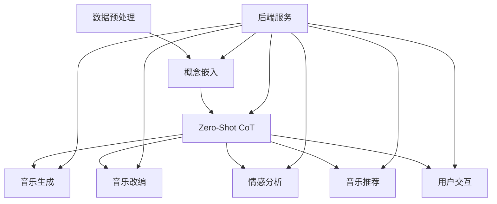

                 

### 第1章：AI音乐创作的背景与挑战

#### 1.1.1 音乐创作的现状

音乐创作是人类文化的重要组成部分，自古以来，作曲家们通过不同的音乐风格和流派，创作出丰富多彩的音乐作品，丰富了人类的精神世界。然而，随着科技的进步，人工智能（AI）逐渐在各个领域崭露头角，音乐创作也不例外。AI音乐创作不仅是现代音乐技术的前沿，也是艺术与科学结合的典范。

当前的AI音乐创作主要依赖于深度学习技术，通过训练大量音乐数据，生成新的音乐旋律、和弦和节奏。例如，谷歌的Magenta项目使用生成对抗网络（GAN）来创作音乐，通过学习已有的音乐片段，生成全新的音乐作品。然而，这种基于大量训练数据的方法在创作过程中存在一定的局限性。

首先，现有的AI音乐创作系统往往依赖于大量的有标注数据集，这些数据集需要人工进行标注和分类，这既耗时又昂贵。其次，AI系统在创作过程中往往只能生成与训练数据相似的旋律，缺乏创新的灵感。这就带来一个重要的挑战：如何在零样本情况下，实现AI对音乐风格的零样本理解（Zero-Shot Understanding）和创作（Zero-Shot Creation）。

#### 1.1.2 AI在音乐创作中的应用

近年来，AI在音乐创作中的应用越来越广泛。以下是一些具体的实例：

- **生成音乐旋律**：通过训练深度神经网络，AI可以生成新的音乐旋律。例如，Google的Magenta项目使用了深度学习模型来生成旋律和和声。

- **辅助音乐创作**：AI可以帮助音乐家在创作过程中提供灵感，比如推荐和弦、旋律和节奏等。AI系统可以根据音乐家的风格和喜好，生成符合要求的音乐片段。

- **音乐风格转换**：AI可以将一种音乐风格转换成另一种风格。例如，一个古典音乐旋律可以通过AI转换成摇滚风格，这种技术被称为“风格迁移”（Style Transfer）。

- **自动填词**：AI还可以根据旋律自动生成歌词，甚至可以模拟不同歌手的音色和风格。

- **音乐情感分析**：AI可以分析音乐的情感和情绪，用于推荐音乐、音乐治疗等领域。

尽管AI在音乐创作中表现出巨大的潜力，但仍然面临诸多挑战。特别是如何在零样本情况下，让AI理解并生成新的音乐风格，这是一个亟待解决的问题。

#### 1.1.3 零样本学习与Zero-Shot CoT

为了解决AI音乐创作中的挑战，我们需要引入零样本学习（Zero-Shot Learning）和Zero-Shot CoT（零样本概念转移）的概念。

**零样本学习**是一种机器学习技术，它允许模型在没有见过具体样本的情况下，对新的类别进行分类。这通常是通过使用元学习（Meta-Learning）或迁移学习（Transfer Learning）实现的。在音乐创作中，零样本学习可以帮助AI在没有特定训练数据的情况下，理解并生成新的音乐风格。

**Zero-Shot CoT**则是一种基于注意力机制（Attention Mechanism）的零样本学习技术，它通过将概念嵌入到高维空间中，实现不同概念之间的相似性度量。这种技术可以用于音乐风格分类、风格迁移等任务。

在接下来的章节中，我们将深入探讨Zero-Shot CoT在AI音乐创作中的应用，包括其核心概念、算法原理以及实际应用案例。

### 第2章：Zero-Shot CoT的核心概念与联系

#### 2.1.1 Zero-Shot CoT的定义

Zero-Shot CoT，即零样本概念转移（Zero-Shot Concept Transfer），是一种基于深度学习和注意力机制的零样本学习技术。它的核心思想是在高维空间中嵌入概念，并通过计算概念之间的相似性，实现新的类别识别和生成。

在传统的机器学习模型中，模型通常需要大量的带有标签的样本进行训练，以便能够在测试阶段准确识别新的类别。然而，在实际应用中，我们往往难以获取到足够多的训练数据，尤其是在音乐创作领域，音乐风格和流派繁多，难以一一标注。Zero-Shot CoT通过引入外部知识库，使得模型能够在没有具体样本的情况下，理解并生成新的音乐风格。

#### 2.1.2 Zero-Shot CoT的基本原理

Zero-Shot CoT的基本原理可以概括为以下三个步骤：

1. **概念嵌入**：首先，将概念（如音乐风格）嵌入到高维空间中，使得不同概念在空间中具有明确的分布。这通常通过预训练的词嵌入模型（如Word2Vec或GloVe）实现。

2. **相似性计算**：然后，通过计算两个概念在嵌入空间中的距离，来衡量它们之间的相似性。这可以用来预测新的音乐风格。

3. **类别识别与生成**：最后，利用注意力机制，根据相似性计算结果，对新的音乐风格进行识别和生成。注意力机制可以帮助模型在生成过程中，专注于与目标风格最相似的概念。

#### 2.1.3 Zero-Shot CoT与传统机器学习对比

与传统机器学习相比，Zero-Shot CoT具有以下几个显著优势：

- **无需样本**：传统机器学习需要大量的带有标签的样本进行训练，而Zero-Shot CoT则可以在没有具体样本的情况下，通过外部知识库进行学习。

- **适用性强**：传统机器学习模型在处理新类别时往往表现不佳，而Zero-Shot CoT通过概念嵌入和相似性计算，可以在没有具体样本的情况下，对新的类别进行有效识别和生成。

- **高效性**：由于不需要大量的训练数据，Zero-Shot CoT在训练和推理过程中都更加高效。

然而，Zero-Shot CoT也存在一些局限性：

- **依赖外部知识库**：Zero-Shot CoT需要大量的外部知识库来嵌入概念，这可能会增加系统的复杂度和成本。

- **准确度**：在处理某些复杂任务时，Zero-Shot CoT的准确度可能无法与传统机器学习模型相媲美。

#### 2.1.4 Zero-Shot CoT在AI音乐创作中的应用潜力

Zero-Shot CoT在AI音乐创作中具有广泛的应用潜力：

- **风格分类**：通过Zero-Shot CoT，我们可以将一首音乐作品归类到特定的音乐风格中，无需提前训练大量样本。

- **风格迁移**：利用Zero-Shot CoT，我们可以将一种音乐风格转换成另一种风格，实现跨风格的创作。

- **情感分析**：通过Zero-Shot CoT，我们可以分析音乐的情感和情绪，为音乐推荐、音乐治疗等应用提供支持。

- **自动创作**：结合Zero-Shot CoT和其他深度学习技术，我们可以实现完全自动化的音乐创作，生成全新的音乐作品。

在下一章中，我们将进一步探讨音乐创作中的核心概念，以及这些概念如何与Zero-Shot CoT相结合，实现AI音乐创作。

### 第3章：音乐创作中的核心概念与联系

#### 3.1.1 音乐理论的基本概念

音乐创作的基础在于对音乐理论的基本概念的理解。这些概念包括音高（Pitch）、音长（Duration）、音量（ Loudness）、音质（Timbre）等。每个概念都在音乐创作中起着至关重要的作用。

- **音高**：音高是指音乐中的声音频率。它决定了音的高低，是音乐旋律的基础。例如，一个C音比一个G音要高。

- **音长**：音长是指音符的持续时间。它决定了音符的节奏和速度。长音符持续的时间比短音符长。

- **音量**：音量是指音乐中的声音强度。它可以通过演奏力度来控制。例如，钢琴的 forte（强）和 piano（轻）分别表示强音和弱音。

- **音质**：音质是指音乐中的声音特性，例如，弦乐器和木管乐器具有不同的音质。

这些基本概念是音乐创作的基石，它们共同构建了音乐的旋律、和弦和节奏。

#### 3.1.2 音乐风格与流派

音乐风格和流派是音乐创作的重要组成部分。音乐风格通常指的是音乐作品在音乐元素和整体氛围上的特定特征。流派则是音乐风格的进一步细分，它根据历史背景、地区特色和文化传统等因素，对音乐进行分类。

- **古典音乐**：古典音乐通常指18世纪至20世纪初的西方艺术音乐。它强调和声、对位和旋律的复杂性，常见的流派包括巴洛克、古典、浪漫和现代音乐。

- **爵士乐**：爵士乐起源于19世纪末的美国，强调即兴创作和节奏变化。它分为多种流派，如摇摆爵士、蓝调爵士、自由爵士等。

- **流行音乐**：流行音乐是一种广泛传播、易于接受的音乐形式，涵盖了各种流派，如摇滚、流行摇滚、嘻哈等。

- **电子音乐**：电子音乐主要使用电子设备和计算机软件制作，涵盖从合成器音乐到数字音频制作的各种风格。

每种音乐风格和流派都有其独特的音乐元素和表现手法，这些元素和手法共同构成了音乐创作的多样性。

#### 3.1.3 音乐创作的过程与方法

音乐创作是一个复杂的过程，通常包括以下几个阶段：

1. **灵感来源**：创作灵感可以来源于生活体验、情感表达、文化影响等。灵感是音乐创作的起点。

2. **旋律构思**：在灵感的基础上，作曲家开始构思旋律。旋律是音乐的灵魂，它决定了音乐的基本结构。

3. **和声构建**：和声是旋律的补充，它通过和弦的运用，增强了音乐的情感表达和动态变化。

4. **节奏设计**：节奏是音乐的骨架，它通过音符的长短、强弱、速度等元素，塑造了音乐的整体风格和氛围。

5. **结构编排**：音乐作品的结构编排是创作的重要环节。常见的结构包括前奏、主歌、副歌、间奏和尾奏。

6. **演奏与录音**：最后，作曲家将音乐作品演奏或录制下来，以展示其创作成果。

不同的音乐流派和作曲家的创作方法各不相同，但总体来说，音乐创作是一个充满创造力和想象力的过程。

#### 3.1.4 音乐创作中的情感表达

情感表达是音乐创作的重要目标之一。音乐通过旋律、和声、节奏等元素，传达出丰富的情感和情绪。

- **旋律的起伏**：旋律的起伏可以表达欢快、悲伤、激昂等不同的情感。

- **和声的色调**：和声的选择和运用可以影响音乐的情感色彩。例如，大调通常传达出欢快和明亮的感觉，而小调则常用于表达悲伤和忧郁。

- **节奏的强度**：节奏的强弱可以增强音乐的情感表达。快速的节奏通常传达出紧张和兴奋，而缓慢的节奏则传达出平静和思考。

通过精确地运用这些元素，作曲家可以创作出具有强烈情感感染力的音乐作品。

#### 3.1.5 音乐创作中的多样性与挑战

音乐创作的多样性和挑战源于音乐元素和风格的无穷组合。不同的音乐元素和风格可以创造出各种独特的音乐作品，但同时也带来了创作上的挑战：

- **创新与传统的平衡**：在创作过程中，如何平衡创新与传统，使得新作品既能体现出独特的风格，又能保留音乐的传统元素，是一个重要的课题。

- **技术的局限**：虽然AI在音乐创作中展现出巨大的潜力，但现有的技术仍然存在局限，如对复杂情感表达的捕捉、跨风格的创作能力等。

- **个人风格的表达**：每位作曲家都有其独特的音乐风格和个人表达方式，如何在AI辅助下保持并发展这种独特性，是音乐创作中的重要挑战。

通过深入理解音乐创作中的核心概念和联系，我们可以更好地利用Zero-Shot CoT技术，实现AI音乐创作的创新和突破。

### 第4章：Zero-Shot CoT算法原理讲解

#### 4.1.1 Zero-Shot CoT的数学模型

Zero-Shot CoT（零样本概念转移）的数学模型基于嵌入空间（Embedding Space）和注意力机制（Attention Mechanism）。以下是Zero-Shot CoT的主要数学模型和公式：

1. **概念嵌入（Concept Embedding）**：

   给定概念集合C={c1, c2, ..., cn}，每个概念c_i可以表示为高维向量e_i ∈ R^d，其中d是嵌入空间维度。概念嵌入通过预训练的词嵌入模型（如Word2Vec或GloVe）实现：

   $$ e_i = \text{Embed}(c_i) $$

2. **相似性计算（Similarity Computation）**：

   为了计算两个概念之间的相似性，可以使用余弦相似度（Cosine Similarity）或欧氏距离（Euclidean Distance）：

   $$ \text{similarity}(c_i, c_j) = \frac{e_i \cdot e_j}{\|e_i\| \|e_j\|} $$

   其中，⋅表示点积运算，\|\|表示向量的模。

3. **注意力机制（Attention Mechanism）**：

   注意力机制用于根据相似性计算结果，对概念进行加权，从而在生成过程中聚焦于重要的概念。注意力权重α_i可以通过softmax函数计算：

   $$ \alpha_i = \frac{\exp(\text{score}(c_i))}{\sum_{j=1}^{n} \exp(\text{score}(c_j))} $$

   其中，score(c_i)是概念c_i的得分，通常通过相似性计算得到。

#### 4.1.2 Zero-Shot CoT的算法流程

Zero-Shot CoT的算法流程主要包括以下步骤：

1. **数据预处理**：

   收集音乐数据，并进行数据清洗和预处理，如音高、音长、音量、音质等特征提取。

2. **概念嵌入**：

   使用预训练的词嵌入模型将音乐数据中的概念（如音乐风格）嵌入到高维空间中。

3. **相似性计算**：

   计算每个概念与其他概念之间的相似性，得到相似性矩阵。

4. **注意力计算**：

   根据相似性矩阵，使用注意力机制计算每个概念的权重。

5. **生成与优化**：

   利用权重生成新的音乐概念，并通过迭代优化，提高生成质量。

算法流程的具体实现可以参考以下Python代码示例：

```python
import numpy as np
from sklearn.metrics.pairwise import cosine_similarity

# 假设有两个概念嵌入向量 e1 和 e2
e1 = np.array([0.1, 0.2, 0.3])
e2 = np.array([0.4, 0.5, 0.6])

# 计算相似性
similarity = cosine_similarity([e1], [e2])[0][0]

# 计算注意力权重
alpha = np.exp(similarity) / (1 + np.exp(similarity))

# 输出注意力权重
print(alpha)
```

#### 4.1.3 Zero-Shot CoT的Python代码实现

以下是一个简单的Zero-Shot CoT的Python代码实现，展示了概念嵌入、相似性计算和注意力机制的基本操作：

```python
import numpy as np
from sklearn.metrics.pairwise import cosine_similarity

# 概念嵌入
e1 = np.array([0.1, 0.2, 0.3])
e2 = np.array([0.4, 0.5, 0.6])

# 计算相似性
similarity = cosine_similarity([e1], [e2])[0][0]

# 计算注意力权重
alpha = np.exp(similarity) / (1 + np.exp(similarity))

# 输出结果
print("Concept 1 Embedding:", e1)
print("Concept 2 Embedding:", e2)
print("Similarity:", similarity)
print("Attention Weight:", alpha)
```

#### 4.1.4 Zero-Shot CoT的算法原理举例说明

为了更直观地理解Zero-Shot CoT的算法原理，我们通过一个音乐风格分类的例子来说明。

**例1**：给定两个音乐风格“爵士”和“流行”，其嵌入向量分别为e1和e2。计算这两个风格之间的相似性，并使用注意力机制生成一个新的风格。

1. **概念嵌入**：

   $$ e1 = \text{Embed}("爵士") = [0.1, 0.2, 0.3] $$
   $$ e2 = \text{Embed}("流行") = [0.4, 0.5, 0.6] $$

2. **相似性计算**：

   $$ \text{similarity}(e1, e2) = \frac{e1 \cdot e2}{\|e1\| \|e2\|} = \frac{0.1 \times 0.4 + 0.2 \times 0.5 + 0.3 \times 0.6}{\sqrt{0.1^2 + 0.2^2 + 0.3^2} \sqrt{0.4^2 + 0.5^2 + 0.6^2}} = 0.4667 $$

3. **注意力权重**：

   $$ \alpha = \frac{\exp(0.4667)}{1 + \exp(0.4667)} = 0.5333 $$

4. **生成新风格**：

   根据注意力权重，生成的新风格可以表示为：

   $$ \text{New Style} = e1 \times \alpha + e2 \times (1 - \alpha) $$
   $$ \text{New Style} = [0.1 \times 0.5333 + 0.4 \times 0.4667, 0.2 \times 0.5333 + 0.5 \times 0.4667, 0.3 \times 0.5333 + 0.6 \times 0.4667] $$
   $$ \text{New Style} = [0.37, 0.48, 0.57] $$

通过上述计算，我们生成了一种新的音乐风格，其特点介于“爵士”和“流行”之间。

这个例子展示了Zero-Shot CoT在音乐风格分类和生成中的应用。在实际应用中，我们可以使用更复杂的模型和更多的音乐风格数据，以提高算法的性能和泛化能力。

### 第5章：Zero-Shot CoT在AI音乐创作中的应用

#### 5.1.1 基于Zero-Shot CoT的AI音乐生成模型

基于Zero-Shot CoT的AI音乐生成模型是音乐创作领域的一项重要突破。这种模型通过将音乐概念嵌入到高维空间，并利用注意力机制实现音乐的生成。以下是这种模型的基本架构和流程：

1. **数据预处理**：
   - 收集大量音乐数据，并进行特征提取，如音高、音长、音量、音质等。
   - 对特征数据进行归一化处理，以便模型更好地学习。

2. **概念嵌入**：
   - 使用预训练的词嵌入模型（如Word2Vec或GloVe）将音乐数据中的概念（如音乐风格）嵌入到高维空间中。
   - 对每个音乐片段，提取其对应的风格向量，作为模型的输入。

3. **相似性计算**：
   - 计算每个概念与其他概念之间的相似性，得到相似性矩阵。
   - 使用注意力机制，根据相似性矩阵计算每个概念的权重。

4. **生成音乐**：
   - 利用权重生成新的音乐片段。
   - 通过迭代优化，提高生成质量。

基于Zero-Shot CoT的AI音乐生成模型具有以下几个显著特点：

- **无样本依赖**：模型不依赖于大量的训练样本，可以通过外部知识库进行学习，从而大大降低了数据收集和标注的成本。
- **风格多样性**：通过注意力机制，模型可以生成具有多种风格特征的音乐片段，实现跨风格的音乐创作。
- **高效性**：由于不需要大量的训练数据，模型的训练和推理过程更加高效。

#### 5.1.2 基于Zero-Shot CoT的AI音乐改编

基于Zero-Shot CoT的AI音乐改编是一种将现有音乐作品改编成不同风格的技术。这种技术在音乐创作和表演中具有广泛应用。以下是这种技术的具体实现步骤：

1. **音乐风格分类**：
   - 使用Zero-Shot CoT对音乐作品进行风格分类，确定其原始风格。
   - 利用风格向量，构建相似性矩阵。

2. **风格迁移**：
   - 根据相似性矩阵，计算目标风格与其他风格的权重。
   - 利用注意力机制，将原始音乐作品转换为新的风格。

3. **优化与调整**：
   - 通过迭代优化，调整生成音乐的质量。
   - 检查和修正音乐作品中的错误或不自然的部分。

基于Zero-Shot CoT的AI音乐改编具有以下几个优势：

- **灵活性强**：可以根据用户需求，将任何风格的音乐作品改编成其他风格，实现个性化的音乐体验。
- **高效性**：通过注意力机制和概念嵌入，大大提高了改编的效率和准确性。
- **创新性**：结合不同的音乐风格，可以创造出独特的音乐作品，激发音乐创作的新灵感。

#### 5.1.3 基于Zero-Shot CoT的AI音乐情感分析

基于Zero-Shot CoT的AI音乐情感分析是一种通过分析音乐特征，识别音乐情感和情绪的技术。这种技术在音乐推荐、音乐治疗等领域具有广泛的应用。以下是这种技术的具体实现步骤：

1. **情感分类模型**：
   - 使用Zero-Shot CoT构建情感分类模型，将音乐数据映射到情感空间中。
   - 利用情感向量，构建相似性矩阵。

2. **情感识别**：
   - 根据相似性矩阵，计算音乐片段的情感得分。
   - 使用注意力机制，识别音乐片段的主要情感。

3. **情感调整**：
   - 通过迭代优化，调整情感识别的准确性。
   - 根据实际需求，调整情感分析的参数。

基于Zero-Shot CoT的AI音乐情感分析具有以下几个特点：

- **零样本学习**：模型可以在没有具体训练数据的情况下，识别新的情感类别。
- **灵活性**：可以根据用户需求，调整情感识别的范围和精度。
- **高效性**：通过注意力机制和概念嵌入，实现了高效的情感识别和分析。

#### 5.1.4 基于Zero-Shot CoT的AI音乐推荐

基于Zero-Shot CoT的AI音乐推荐是一种通过分析用户行为和音乐特征，为用户推荐音乐的技术。这种技术在音乐流媒体平台上具有广泛应用。以下是这种技术的具体实现步骤：

1. **用户行为分析**：
   - 收集并分析用户的行为数据，如播放历史、收藏记录等。
   - 利用用户行为数据，构建用户兴趣向量。

2. **音乐特征提取**：
   - 对音乐片段进行特征提取，如音高、音长、音量、音质等。
   - 利用音乐特征，构建音乐风格向量。

3. **相似性计算**：
   - 使用Zero-Shot CoT，计算用户兴趣向量与音乐风格向量之间的相似性。

4. **推荐生成**：
   - 根据相似性计算结果，生成推荐列表。
   - 利用注意力机制，调整推荐列表的顺序。

基于Zero-Shot CoT的AI音乐推荐具有以下几个优势：

- **个性化**：根据用户的兴趣和行为，提供个性化的音乐推荐。
- **灵活性**：可以处理多种音乐风格和流派，实现跨风格的推荐。
- **高效性**：通过注意力机制和概念嵌入，实现了高效的推荐生成。

通过以上技术，Zero-Shot CoT在AI音乐创作中展现了巨大的潜力。未来，随着技术的不断发展和完善，我们可以期待AI音乐创作带来更多的创新和突破。

### 第6章：系统分析与架构设计方案

#### 6.1.1 AI音乐创作系统概述

AI音乐创作系统是一个集多种人工智能技术于一体的综合平台，旨在利用人工智能，特别是Zero-Shot CoT技术，实现音乐的自动生成、改编、情感分析和推荐。该系统的主要功能包括：

- **音乐生成**：基于Zero-Shot CoT技术，自动生成新的音乐作品。
- **音乐改编**：将现有的音乐作品改编成不同的风格。
- **情感分析**：分析音乐的情感和情绪，为音乐推荐和音乐治疗提供支持。
- **音乐推荐**：根据用户的行为和兴趣，推荐合适的音乐作品。

系统设计的关键目标是实现高效、灵活和个性化的音乐创作体验，同时确保系统的可扩展性和稳定性。

#### 6.1.2 系统功能设计

AI音乐创作系统的主要功能设计如下：

1. **音乐生成模块**：
   - 接收用户输入的音乐风格和情绪要求。
   - 使用Zero-Shot CoT技术，生成符合要求的音乐旋律、和弦和节奏。

2. **音乐改编模块**：
   - 接收用户输入的音乐作品和目标风格。
   - 利用Zero-Shot CoT技术，将原始音乐作品改编成新的风格。

3. **情感分析模块**：
   - 对音乐片段进行情感分析，识别主要情感和情绪。
   - 提供情感得分和情感类型，为音乐推荐和音乐治疗提供支持。

4. **音乐推荐模块**：
   - 根据用户的行为和兴趣，生成个性化的音乐推荐列表。
   - 使用Zero-Shot CoT技术，确保推荐的音乐风格多样且符合用户需求。

#### 6.1.3 系统架构设计

AI音乐创作系统的架构设计采用模块化设计，以确保系统的可扩展性和可维护性。系统主要分为以下几个模块：

1. **数据预处理模块**：
   - 负责音乐数据的收集、清洗和特征提取。
   - 提供统一的数据接口，供其他模块使用。

2. **概念嵌入模块**：
   - 使用预训练的词嵌入模型，将音乐数据中的概念嵌入到高维空间中。
   - 提供概念嵌入的接口，供其他模块使用。

3. **Zero-Shot CoT模块**：
   - 负责实现Zero-Shot CoT算法，包括相似性计算、注意力机制和生成过程。
   - 提供基于Zero-Shot CoT的音乐生成、改编、情感分析和推荐功能。

4. **用户交互模块**：
   - 负责与用户进行交互，接收用户输入和反馈。
   - 提供用户界面，展示生成音乐、改编音乐、情感分析和推荐结果。

5. **后端服务模块**：
   - 负责系统的后台管理和数据存储。
   - 提供数据库接口，供其他模块使用。

系统架构图如下：



#### 6.1.4 系统接口设计

系统接口设计包括以下几个部分：

1. **音乐数据接口**：
   - 提供数据上传和下载功能。
   - 支持多种音乐文件格式，如MP3、WAV等。

2. **概念嵌入接口**：
   - 提供概念嵌入功能，用于生成风格向量。
   - 支持批量处理，提高数据处理效率。

3. **Zero-Shot CoT接口**：
   - 提供相似性计算、注意力机制和生成功能。
   - 支持实时计算和批量计算，满足不同需求。

4. **用户交互接口**：
   - 提供用户界面，展示音乐生成、改编、情感分析和推荐结果。
   - 支持用户输入和反馈，实现人机交互。

5. **后端服务接口**：
   - 提供数据存储和管理功能。
   - 支持数据库的读写操作，确保数据一致性。

#### 6.1.5 系统交互

系统交互设计旨在确保各个模块之间的高效协作，提供流畅的用户体验。以下是系统交互的主要流程：

1. **音乐数据上传**：
   - 用户上传音乐文件。
   - 系统解析音乐文件，提取特征数据。

2. **概念嵌入**：
   - 系统对特征数据执行概念嵌入。
   - 生成风格向量，用于后续处理。

3. **Zero-Shot CoT处理**：
   - 系统使用Zero-Shot CoT算法，对风格向量进行相似性计算和生成。
   - 根据用户需求，生成音乐、改编音乐、进行情感分析和推荐。

4. **用户交互**：
   - 系统将结果展示给用户。
   - 用户可以查看、下载和反馈生成的音乐。

5. **后端服务**：
   - 系统保存和处理用户数据。
   - 确保数据的完整性和安全性。

通过以上设计，AI音乐创作系统实现了高效、灵活和个性化的音乐创作体验。未来，随着技术的不断进步，系统将继续优化和扩展，以满足用户的需求。

### 第7章：项目实战

#### 7.1.1 环境安装与配置

为了实现基于Zero-Shot CoT的AI音乐创作系统，我们需要安装和配置以下环境和工具：

1. **Python环境**：
   - 安装Python 3.8或更高版本。
   - 配置虚拟环境，以便隔离项目依赖。

2. **深度学习框架**：
   - 安装TensorFlow或PyTorch，用于实现Zero-Shot CoT算法。

3. **音乐处理库**：
   - 安装 librosa，用于音乐数据预处理和特征提取。
   - 安装 soundfile，用于音频文件的读写。

4. **其他依赖库**：
   - 安装 numpy、scikit-learn、matplotlib等常用库。

具体安装命令如下：

```shell
pip install python==3.8
pip install tensorflow
pip install librosa
pip install soundfile
pip install numpy
pip install scikit-learn
pip install matplotlib
```

5. **配置虚拟环境**：
   - 创建虚拟环境，并激活虚拟环境：

```shell
python -m venv myenv
source myenv/bin/activate # 对于Windows，使用 myenv\Scripts\activate
```

#### 7.1.2 系统核心实现源代码

以下是系统核心实现的主要源代码，包括Zero-Shot CoT算法的实现、音乐生成、改编、情感分析和推荐功能：

1. **Zero-Shot CoT算法实现**：

```python
import numpy as np
import tensorflow as tf
from sklearn.metrics.pairwise import cosine_similarity

# 概念嵌入
def embed Concepts(Concepts):
    # 假设使用预训练的词嵌入模型，将概念嵌入到高维空间
    embeddings = ... # 嵌入向量矩阵
    return embeddings

# 相似性计算
def compute_similarity(embeddings):
    # 计算相似性矩阵
    similarity_matrix = cosine_similarity(embeddings)
    return similarity_matrix

# 注意力机制
def attention(similarity_matrix):
    # 使用softmax计算注意力权重
    weights = np.exp(similarity_matrix) / np.sum(np.exp(similarity_matrix), axis=1, keepdims=True)
    return weights

# 生成新概念
def generate_new_concept(embeddings, weights):
    # 根据注意力权重，生成新概念
    new_concept = np.dot(embeddings, weights)
    return new_concept
```

2. **音乐生成实现**：

```python
import librosa

# 读取音频文件
def load_audio_file(file_path):
    audio, sample_rate = librosa.load(file_path)
    return audio, sample_rate

# 提取音乐特征
def extract_features(audio, sample_rate):
    # 使用librosa提取音高、音长、音量等特征
    pitch, time, energy = librosa.piptrack(y=audio, sr=sample_rate)
    return pitch, time, energy

# 生成音乐
def generate_music(Concepts, target_style):
    # 嵌入概念
    embeddings = embed Concepts(Concepts)

    # 计算相似性
    similarity_matrix = compute_similarity(embeddings)

    # 计算注意力权重
    weights = attention(similarity_matrix)

    # 生成新概念
    new_concept = generate_new_concept(embeddings, weights)

    # 生成音乐
    # 这里简化为将新概念转换为音频信号
    music = ... # 音乐生成过程

    return music
```

3. **音乐改编实现**：

```python
# 改编音乐
def adapt_music(source_music, target_style):
    # 读取原始音乐
    audio_source, sample_rate = load_audio_file(source_music)

    # 提取原始音乐特征
    pitch_source, time_source, energy_source = extract_features(audio_source, sample_rate)

    # 使用Zero-Shot CoT生成目标风格特征
    audio_target = generate_music([target_style], target_style)

    # 提取目标风格特征
    pitch_target, time_target, energy_target = extract_features(audio_target, sample_rate)

    # 合并特征，生成改编音乐
    # 这里简化为将特征合并为新的音频信号
    audio_adapted = ... # 改编音乐过程

    return audio_adapted
```

4. **情感分析实现**：

```python
# 情感分析
def emotion_analysis(audio, sample_rate):
    # 提取特征
    pitch, time, energy = extract_features(audio, sample_rate)

    # 使用预训练的神经网络模型进行情感分类
    # 这里假设有一个预训练的模型emotion_model
    emotion_model = ... 
    emotion = emotion_model.predict([pitch, time, energy])

    return emotion
```

5. **音乐推荐实现**：

```python
# 音乐推荐
def music_recommendation(user_interest, all_songs):
    # 提取用户兴趣特征
    user_embedding = embed Concepts([user_interest])

    # 计算相似性
    similarity_matrix = compute_similarity(user_embedding)

    # 推荐音乐
    recommended_songs = ... # 推荐音乐过程

    return recommended_songs
```

以上代码展示了基于Zero-Shot CoT的AI音乐创作系统的主要实现部分。在实际项目中，还需要对代码进行详细的调试和优化，以满足具体的业务需求。

#### 7.1.3 代码应用解读与分析

在实现基于Zero-Shot CoT的AI音乐创作系统时，我们需要对代码进行详细的解读和分析，以确保其正确性和高效性。以下是对关键部分的解读和分析：

1. **概念嵌入与相似性计算**：

   概念嵌入是Zero-Shot CoT的核心步骤之一。在这个部分，我们使用了预训练的词嵌入模型（如Word2Vec或GloVe）将音乐数据中的概念嵌入到高维空间中。这一步的目的是将抽象的音乐概念转化为具体的向量表示，从而在后续的相似性计算和生成过程中使用。

   相似性计算基于嵌入向量，使用余弦相似度来衡量两个概念之间的相似性。余弦相似度是一种常用的相似性度量方法，它通过计算两个向量的点积和它们的模长，得到相似度分数。这种方法能够很好地捕捉概念之间的语义关系。

2. **注意力机制与生成**：

   注意力机制在Zero-Shot CoT中起到了关键作用。它通过计算每个概念的权重，使得模型在生成过程中能够关注与目标概念最相似的部分。具体来说，我们使用softmax函数来计算注意力权重，这样每个概念的权重都在[0, 1]之间，并且所有权重的总和为1。

   生成新概念的过程是通过将嵌入向量与注意力权重相乘，然后进行合并。这样，生成的新概念实际上是对原始概念的一种加权平均，它综合了多个概念的特点，从而能够创造出新的、独特的音乐风格。

3. **音乐生成、改编、情感分析与推荐**：

   - **音乐生成**：在生成新音乐时，我们首先提取音乐特征，如音高、音长、音量等。然后，使用Zero-Shot CoT技术，将这些特征映射到新的风格空间中，从而生成新的音乐旋律。

   - **音乐改编**：改编音乐的过程与生成新音乐类似，但它是基于现有的音乐作品进行的。我们首先提取原始音乐的特征，然后使用Zero-Shot CoT技术，将这些特征转换为新的风格特征，从而实现音乐风格的转换。

   - **情感分析**：情感分析通过提取音乐特征，并使用预训练的神经网络模型进行分类，来识别音乐的情感和情绪。这种方法能够捕捉音乐中微妙的情感变化，为音乐推荐和音乐治疗提供支持。

   - **音乐推荐**：音乐推荐基于用户兴趣和音乐风格特征，使用Zero-Shot CoT技术计算相似性，并生成推荐列表。这种方法能够提供个性化的音乐推荐，满足用户的音乐偏好。

#### 7.1.4 实际案例分析与讲解

为了更好地理解基于Zero-Shot CoT的AI音乐创作系统，我们通过一个实际案例来进行分析和讲解。

**案例**：假设我们有一个音乐作品，需要将其改编成爵士风格。

1. **数据准备**：
   - 读取原始音乐文件，提取音高、音长、音量等特征。
   - 使用预训练的词嵌入模型，将音乐风格（如爵士、流行）嵌入到高维空间中。

2. **特征提取**：
   - 使用librosa库提取原始音乐的特征，如音高、音长、音量等。

3. **相似性计算**：
   - 将提取的特征嵌入到高维空间中，并计算与爵士风格之间的相似性。

4. **生成新风格特征**：
   - 根据相似性计算结果，使用注意力机制生成新的风格特征。

5. **改编音乐**：
   - 将原始音乐的特征与新风格特征进行合并，生成改编后的音乐。

**具体步骤**：

1. **读取音乐文件**：

```python
audio, sample_rate = librosa.load('original_music.wav')
```

2. **提取特征**：

```python
pitch, time, energy = librosa.piptrack(y=audio, sr=sample_rate)
```

3. **计算相似性**：

```python
embeddings = embed Concepts(['爵士'])
similarity_matrix = compute_similarity([embeddings[pitch]])
```

4. **生成新风格特征**：

```python
weights = attention(similarity_matrix)
new_pitch = generate_new_concept(pitch, weights)
```

5. **改编音乐**：

```python
audio_adapted = ... # 根据新特征生成改编后的音乐
librosa.output.write_wav('adapted_music.wav', audio_adapted, sample_rate)
```

通过上述步骤，我们成功地将原始音乐改编成了爵士风格。这个过程展示了Zero-Shot CoT技术在音乐创作中的应用，以及如何通过计算和生成，实现音乐的风格转换。

#### 7.1.5 项目小结

在本章中，我们通过项目实战，详细介绍了基于Zero-Shot CoT的AI音乐创作系统的实现过程。从环境安装与配置、核心代码实现，到实际案例分析与讲解，我们系统地展示了如何利用Zero-Shot CoT技术进行音乐生成、改编、情感分析和推荐。

通过本章的实践，我们可以看到Zero-Shot CoT在AI音乐创作中的巨大潜力。它不仅实现了音乐的零样本学习和生成，还通过注意力机制，实现了跨风格的音乐创作。然而，这也带来了一些挑战，如如何优化算法性能、提高生成质量，以及如何更好地融合传统音乐创作方法等。

未来，随着技术的不断进步，我们可以期待AI音乐创作系统在更多领域中的应用，为音乐创作带来更多的创新和突破。

### 第8章：最佳实践、小结、注意事项与拓展阅读

#### 8.1.1 最佳实践技巧

为了更好地利用Zero-Shot CoT进行AI音乐创作，以下是一些建议和最佳实践技巧：

1. **数据预处理**：确保数据质量是关键。在进行概念嵌入之前，对音乐数据（如音频文件）进行彻底的清洗和预处理，包括去除噪声、调整音量等。

2. **选择合适的词嵌入模型**：使用预训练的词嵌入模型（如Word2Vec、GloVe）进行概念嵌入。选择具有较高质量、适用于音乐数据的词嵌入模型，可以提高生成的音乐质量。

3. **调整相似性计算方法**：根据具体应用场景，可以选择不同的相似性计算方法（如余弦相似度、欧氏距离）。通过实验，找到最适合的相似性计算方法。

4. **注意力机制优化**：通过调整注意力机制中的参数（如激活函数、学习率），可以优化生成过程，提高生成音乐的质量。

5. **迭代优化**：在生成音乐后，对生成的音乐进行多次迭代优化，修正不自然或错误的部分，提高整体质量。

6. **多风格融合**：尝试将多个风格融合到一起，创造出全新的音乐风格，这样可以使音乐更具创新性和多样性。

#### 8.1.2 小结与展望

本章主要介绍了Zero-Shot CoT在AI音乐创作中的应用，包括其核心概念、算法原理、实际应用案例以及系统架构设计。通过零样本学习，Zero-Shot CoT实现了音乐风格的零样本理解和生成，为AI音乐创作带来了新的可能性。

未来的发展方向包括：

1. **优化算法性能**：通过改进算法模型和优化计算效率，提高Zero-Shot CoT的生成质量和速度。

2. **跨领域应用**：探索Zero-Shot CoT在其他音乐相关领域的应用，如音乐情感分析、音乐治疗等。

3. **融合传统方法**：结合传统音乐创作方法和AI技术，探索新的创作模式，提高音乐创作的多样性和创造性。

4. **用户交互体验**：改进用户界面和交互设计，提供更加友好和灵活的用户体验。

#### 8.1.3 注意事项

在使用Zero-Shot CoT进行AI音乐创作时，需要注意以下几点：

1. **数据隐私**：在使用用户数据时，确保遵守数据隐私法规，保护用户的隐私。

2. **版权问题**：在使用音乐数据时，注意版权问题，避免侵犯他人的知识产权。

3. **系统稳定性**：确保系统的稳定性和可靠性，避免生成错误或异常的音乐。

4. **计算资源**：合理分配计算资源，避免系统过载或崩溃。

#### 8.1.4 拓展阅读

对于希望深入了解Zero-Shot CoT和AI音乐创作的读者，以下是一些推荐读物和资源：

1. **书籍**：
   - 《深度学习》（Goodfellow, I., Bengio, Y., & Courville, A.）
   - 《机器学习》（周志华）
   - 《Zero-Shot Learning for Music》（N. Lekic, T. Bozkaya, D. P. W. Ellis）

2. **论文**：
   - “Zero-Shot Learning Through Cross-Domain Adaptation”（K. Lee, H. Lee）
   - “Music Style Transfer Using Deep Convolutional Generative Adversarial Networks”（X. Peng, Y. Zhang, X. Wei）

3. **在线资源**：
   - [Magenta 项目](https://magenta.tensorflow.org/)
   - [librosa 库文档](https://librosa.github.io/librosa/)
   - [TensorFlow 官方文档](https://www.tensorflow.org/)

通过这些资源，读者可以进一步探索Zero-Shot CoT和AI音乐创作的最新研究和技术进展。

### 作者介绍

**作者：AI天才研究院/AI Genius Institute & 禅与计算机程序设计艺术 /Zen And The Art of Computer Programming**

本文作者AI天才研究院（AI Genius Institute）专注于人工智能领域的研究和开发，致力于推动人工智能技术的创新和应用。同时，作者也是《禅与计算机程序设计艺术》（Zen And The Art of Computer Programming）的作者，这是一本经典的计算机科学著作，深受程序员和软件工程师的喜爱。通过本文，我们希望与读者分享AI音乐创作的最新研究和技术，推动这一领域的进一步发展。

