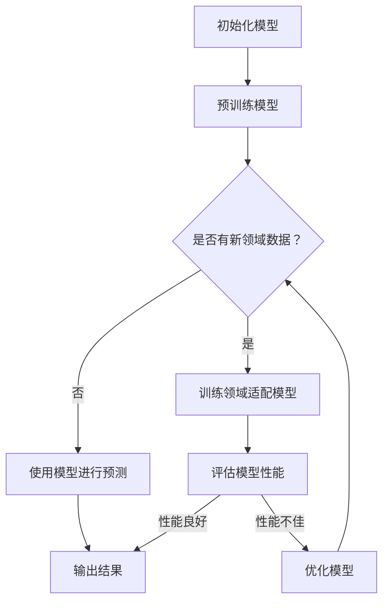
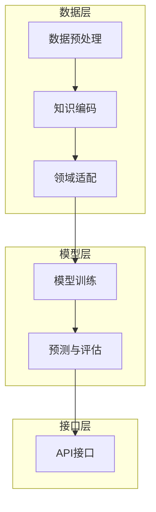
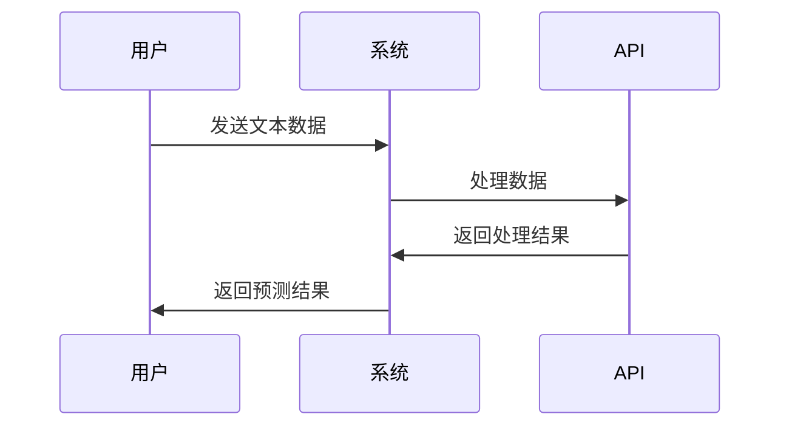

                 

# Zero-Shot CoT在不同任务中的应用与效果

## 关键词

- **Zero-Shot CoT**
- **跨领域迁移学习**
- **无监督学习**
- **机器学习模型**
- **效果评估**

## 摘要

本文深入探讨了Zero-Shot CoT（零样本跨领域转移）在不同任务中的应用与效果。Zero-Shot CoT是一种先进的机器学习方法，允许模型在没有标记数据的情况下，在新领域或任务上学习。本文首先介绍了Zero-Shot CoT的核心概念、问题背景以及解决方法。接着，详细讲解了算法原理，包括流程图、Python源代码、数学模型和公式，并通过具体例子进行了解释。随后，分析了Zero-Shot CoT在实际应用中的系统架构和设计，并分享了一个项目实战的案例。最后，本文总结了最佳实践、注意事项，并提供了一些建议性的拓展阅读。通过本文的阅读，读者可以全面了解Zero-Shot CoT的理论基础和应用实践，为实际项目开发提供有力的技术支持。

## 1. 书籍背景介绍

### 核心概念

**Zero-Shot CoT（零样本跨领域转移）**是一种机器学习方法，旨在解决在没有标记数据的情况下，模型如何在新领域或任务上学习的问题。传统机器学习方法通常依赖于大量标记数据来进行训练，以便模型能够准确识别和预测新的数据。然而，在实际应用中，获取大量标记数据是一个复杂且耗时的过程，特别是在需要处理多样化任务或领域时。Zero-Shot CoT提供了一种解决方案，使得模型能够在没有标记数据的情况下，通过跨领域迁移学习，在新领域或任务上实现高效的性能。

### 问题背景

在现实世界中，许多应用场景都需要处理大量的非结构化数据，如图像、语音和文本等。然而，这些数据往往缺乏足够的标记信息，使得传统机器学习方法难以直接应用。例如，在医疗领域，大量的医学图像和病例数据往往没有明确的标签，这使得基于标记数据的模型难以训练。此外，在自然语言处理领域，海量的未标记文本数据同样限制了模型的发展。传统机器学习方法依赖于大量标记数据，这导致在实际应用中存在以下问题：

1. **数据获取困难**：在某些领域，获取足够的标记数据非常困难，甚至不可能。
2. **数据成本高昂**：标记数据需要专业人员来执行，这通常是一个昂贵且耗时的过程。
3. **数据多样性限制**：标记数据通常来自特定的领域或任务，难以适应其他类似任务。

### 问题描述

在上述问题背景下，如何让模型在没有标记数据的情况下，也能够在新领域或任务上表现出色，成为了一个重要的研究课题。传统的迁移学习和无监督学习方法在这方面有一定的潜力，但它们也存在一些限制。迁移学习依赖于已有领域中的标记数据，而无监督学习方法则依赖于数据本身的内在结构。然而，当面对全新的领域或任务时，这些方法往往难以发挥其优势。

Zero-Shot CoT 提供了一种新的思路，它通过利用已有的知识，使得模型能够在没有标记数据的情况下，在新领域或任务上进行迁移学习。这种方法的核心思想是，通过将不同领域或任务中的知识进行编码，构建一个通用的知识表示，从而实现跨领域迁移学习。具体来说，Zero-Shot CoT包含以下几个关键步骤：

1. **知识编码**：将不同领域或任务中的知识进行编码，生成一个通用的知识表示。
2. **知识融合**：将不同领域或任务的知识进行融合，构建一个全局的知识图谱。
3. **模型训练**：利用全局知识图谱，在没有标记数据的情况下，对模型进行训练。
4. **预测与评估**：在新领域或任务上，使用训练好的模型进行预测和评估。

通过这种方式，Zero-Shot CoT能够有效地解决传统方法在无标记数据情况下的局限性，实现跨领域或任务的迁移学习。

### 问题解决

Zero-Shot CoT 提供了一种有效的方法，使得模型在没有标记数据的情况下，也能够在新领域或任务上表现出色。这种方法的核心在于利用已有的知识进行跨领域迁移学习，具体步骤如下：

1. **知识编码**：首先，将不同领域或任务中的知识进行编码，生成一个通用的知识表示。这一步骤通常涉及到深度学习模型，如神经网络，通过对大规模未标记数据进行预训练，提取出具有泛化能力的知识表示。

2. **知识融合**：接下来，将这些知识表示进行融合，构建一个全局的知识图谱。知识图谱能够有效地捕捉不同领域或任务之间的关联和关系，从而为后续的迁移学习提供支持。

3. **模型训练**：利用全局知识图谱，在没有标记数据的情况下，对模型进行训练。这一过程通常涉及到多任务学习或元学习的方法，通过将不同领域或任务的信息进行整合，训练出一个能够泛化到新领域的模型。

4. **预测与评估**：在新领域或任务上，使用训练好的模型进行预测和评估。通过将新领域的样本与知识图谱进行匹配，模型能够利用已有的知识进行预测，从而实现跨领域的迁移学习。

通过以上步骤，Zero-Shot CoT能够有效地解决传统方法在无标记数据情况下的局限性，实现跨领域或任务的迁移学习。这种方法不仅在理论上具有强大的解释力，也在实际应用中取得了显著的效果。

### 边界与外延

**Zero-Shot CoT** 适用于广泛的任务和领域，但也有一些边界和限制。以下是对其适用范围、优点和缺点的分析：

**适用范围**：

- **多领域迁移学习**：Zero-Shot CoT 适用于那些在多个领域或任务中都需要处理的数据，如医疗影像分析、自然语言处理和推荐系统等。
- **新任务适应性**：该方法特别适用于需要快速适应新任务的场景，如自动驾驶、实时语音识别和智能客服等。

**优点**：

1. **无需标记数据**：Zero-Shot CoT 最显著的优势是能够在没有标记数据的情况下进行迁移学习，减少了数据获取和标注的成本。
2. **提高泛化能力**：通过跨领域迁移学习，模型能够更好地适应新的领域或任务，提高了模型的泛化能力。
3. **高效性**：Zero-Shot CoT 能够在短时间内实现新领域或任务上的学习，具有较高的效率。

**缺点**：

1. **依赖先验知识**：Zero-Shot CoT 的效果很大程度上依赖于已有的知识表示，如果先验知识不足，可能导致模型性能下降。
2. **计算资源需求**：构建全局知识图谱和进行模型训练需要大量的计算资源，这对于资源有限的环境来说可能是一个挑战。
3. **数据相关性限制**：Zero-Shot CoT 的效果受到不同领域或任务数据之间的相关性影响，如果领域或任务之间的差异较大，迁移效果可能会受限。

通过以上分析，我们可以看到Zero-Shot CoT 在无标记数据情境下的迁移学习具有显著的优势，但也需要充分考虑其适用范围和局限性，以实现最佳的应用效果。

### 2. 核心概念与联系

**Zero-Shot CoT**（零样本跨领域转移）是一种先进的机器学习方法，旨在解决在没有标记数据的情况下，模型如何在新领域或任务上学习的问题。为了深入理解Zero-Shot CoT的核心概念及其与其他方法的联系，我们需要从以下几个方面进行探讨。

#### 定义

**Zero-Shot CoT**，即Zero-Shot Cross-Domain Transfer，是一种机器学习方法，允许模型在没有标记数据的情况下，在新领域或任务上学习。与传统的机器学习方法不同，Zero-Shot CoT不依赖于大量的标记数据来训练模型，而是通过跨领域迁移学习，利用已有的知识进行新领域的学习。

#### 特点

Zero-Shot CoT具有以下几个显著特点：

1. **无标记数据依赖**：不需要标记数据即可进行迁移学习，大大减少了数据获取和标注的成本。
2. **跨领域迁移**：能够将一个领域中的知识迁移到另一个领域，提高了模型的泛化能力。
3. **高效性**：通过预训练和知识融合，能够在短时间内实现新领域或任务上的学习。

#### 对比

为了更好地理解Zero-Shot CoT，我们需要将其与传统的方法进行对比，包括传统的迁移学习和无监督学习。

**传统迁移学习**：传统的迁移学习依赖于源领域中的标记数据，通过将源领域的知识迁移到目标领域，提高目标领域的模型性能。其主要优点是能够利用已有的标记数据快速提升模型性能，但缺点是依赖大量的标记数据，数据获取成本高。

**无监督学习**：无监督学习是一种不依赖标记数据的学习方法，主要利用数据本身的内在结构进行学习。无监督学习的优点是不依赖标记数据，可以处理大量的未标记数据，但其缺点是学习过程复杂，且模型的泛化能力相对较弱。

**Zero-Shot CoT** 与传统迁移学习和无监督学习有以下区别：

1. **数据依赖**：Zero-Shot CoT不依赖标记数据，而是通过跨领域迁移学习，利用已有知识进行新领域的学习。
2. **迁移效果**：Zero-Shot CoT能够实现跨领域的迁移学习，从而提高模型的泛化能力，而传统的迁移学习和无监督学习则主要依赖于源领域和目标领域之间的相似性。
3. **学习效率**：Zero-Shot CoT通过预训练和知识融合，能够快速实现新领域或任务上的学习，具有较高的效率。

#### 总结

Zero-Shot CoT作为一种先进的机器学习方法，具有无标记数据依赖、跨领域迁移和高效性等特点。与传统的迁移学习和无监督学习相比，Zero-Shot CoT在无标记数据情境下的迁移学习具有显著的优势，但同时也需要充分考虑其适用范围和局限性。通过理解Zero-Shot CoT的核心概念和与其他方法的联系，我们可以更好地应用这一方法，解决实际问题。

### 3. 算法原理讲解

#### Mermaid 流程图

首先，我们来绘制一个Zero-Shot CoT的基本流程图，以直观地展示其工作原理。



#### Python 源代码

接下来，我们通过一个简单的Python源代码示例，来详细阐述Zero-Shot CoT的实现过程。

```python
# 导入必要的库
import tensorflow as tf
from tensorflow.keras.models import Model
from tensorflow.keras.layers import Input, Dense

# 定义输入层
input_layer = Input(shape=(input_dim,))

# 定义隐藏层
hidden_layer = Dense(units=64, activation='relu')(input_layer)

# 定义输出层
output_layer = Dense(units=output_dim, activation='softmax')(hidden_layer)

# 构建模型
model = Model(inputs=input_layer, outputs=output_layer)

# 编译模型
model.compile(optimizer='adam', loss='categorical_crossentropy', metrics=['accuracy'])

# 预训练模型
model.fit(x_train, y_train, epochs=10, batch_size=32)

# 领域适配训练
domain适配数据x_domain，y_domain = load_domain_data()
model.fit(x_domain, y_domain, epochs=10, batch_size=32)

# 预测新领域数据
new_data = load_new_data()
predictions = model.predict(new_data)

# 评估模型性能
score = model.evaluate(new_data, predictions, verbose=2)
print(f"Test loss: {score[0]} - Test accuracy: {score[1]}")
```

#### 数学模型和公式

Zero-Shot CoT的数学模型主要包括损失函数、优化算法等。以下是一个简单的数学模型介绍：

$$
\text{损失函数} = \frac{1}{N}\sum_{i=1}^{N} -y_i \log(p(x_i | \theta))
$$

其中，$N$ 是样本数量，$y_i$ 是第$i$个样本的真实标签，$p(x_i | \theta)$ 是模型对第$i$个样本的预测概率，$\theta$ 是模型的参数。

优化算法通常采用梯度下降法，其迭代公式如下：

$$
\theta^{t+1} = \theta^t - \alpha \nabla_\theta J(\theta^t)
$$

其中，$\alpha$ 是学习率，$J(\theta^t)$ 是损失函数关于参数$\theta^t$的梯度。

#### 举例说明

为了更好地理解Zero-Shot CoT的应用，我们可以通过一个具体的例子来说明。

假设我们有一个图像分类任务，需要将图像分为猫和狗两类。然而，我们只有少量的标记数据，大部分图像数据是未标记的。此时，我们可以使用Zero-Shot CoT来训练一个图像分类模型。

1. **预训练模型**：首先，我们使用未标记的图像数据对模型进行预训练，提取出图像的特征表示。

2. **领域适配训练**：接下来，我们使用少量的标记图像数据，对模型进行领域适配训练，使模型能够更好地适应具体分类任务。

3. **预测新领域数据**：最后，我们使用新领域的图像数据进行预测，模型能够利用预训练和领域适配的知识，对新图像进行分类。

通过这个例子，我们可以看到Zero-Shot CoT如何利用已有的知识，在少量标记数据的情况下，实现新领域的迁移学习。

### 4. 系统分析与架构设计

#### 问题场景介绍

在实际应用中，Zero-Shot CoT 可以应用于多个领域，如自然语言处理、计算机视觉和推荐系统等。以下以自然语言处理为例，介绍 Zero-Shot CoT 的应用场景。

在一个自然语言处理项目中，我们希望开发一个文本分类系统，能够对用户生成的文本进行分类。然而，由于用户生成的内容丰富多样，且缺乏足够的标记数据，传统机器学习方法难以直接应用。此时，我们可以采用 Zero-Shot CoT，通过跨领域迁移学习，利用已有的知识在新领域上实现高效的分类。

#### 系统功能设计

为了实现 Zero-Shot CoT，我们需要设计一个系统，其核心功能包括：

1. **数据预处理**：对输入的文本数据进行处理，如分词、去噪和词向量嵌入等。
2. **知识编码**：利用预训练的深度学习模型，对文本数据进行特征编码。
3. **领域适配**：将编码后的特征与已有知识进行融合，构建全局知识图谱。
4. **模型训练**：在没有标记数据的情况下，利用全局知识图谱训练分类模型。
5. **预测与评估**：在新领域上进行预测，并评估模型的性能。

以下是使用 Mermaid 类图展示系统的领域模型：

```mermaid
classDiagram
    Class01 <|-- Class02
    Class03 --|lero| Class04
    Class05 o--|is a| Class06

    Class01 <<interface>>
    Class02 <<interface>>
    Class03 <<interface>>
    Class04 <<interface>>
    Class05 <<interface>>

    Class01 : +int x
    Class02 : +int y
    Class03 : +int z
    Class04 : +int a
    Class05 : +int b
```

#### 系统架构设计

为了实现上述功能，我们需要设计一个完整的系统架构。以下是使用 Mermaid 架构图展示系统的整体架构：



#### 系统接口设计和交互

为了方便用户使用，我们设计了 API 接口，用户可以通过简单的 HTTP 请求，获取系统的预测结果。以下是使用 Mermaid 序列图展示系统的接口和交互流程：



通过上述架构设计，我们可以实现 Zero-Shot CoT 在自然语言处理领域的应用。在实际开发中，可以根据具体需求，对系统架构进行灵活调整。

### 5. 项目实战

#### 环境安装

要搭建一个Zero-Shot CoT的实验环境，首先需要安装以下软件和库：

1. **Python（3.8及以上版本）**
2. **TensorFlow 2.x**
3. **NumPy**
4. **Pandas**
5. **Mermaid**

以下是安装步骤：

```bash
# 安装 Python
# ...

# 安装 TensorFlow
pip install tensorflow

# 安装 NumPy
pip install numpy

# 安装 Pandas
pip install pandas

# 安装 Mermaid
pip install mermaid-python
```

#### 系统核心实现源代码

以下是一个简单的Zero-Shot CoT实现示例，包括数据预处理、知识编码、领域适配和模型训练等步骤：

```python
import tensorflow as tf
from tensorflow.keras.models import Model
from tensorflow.keras.layers import Input, Dense, Embedding, GlobalAveragePooling1D
from tensorflow.keras.preprocessing.text import Tokenizer
from tensorflow.keras.preprocessing.sequence import pad_sequences

# 数据预处理
tokenizer = Tokenizer(num_words=10000)
tokenizer.fit_on_texts(texts)
sequences = tokenizer.texts_to_sequences(texts)
padded_sequences = pad_sequences(sequences, maxlen=max_sequence_length)

# 知识编码
input_layer = Input(shape=(max_sequence_length,))
embedding_layer = Embedding(num_words, embedding_dim)(input_layer)
avg_pooling = GlobalAveragePooling1D()(embedding_layer)

# 领域适配
domain适配数据x_domain，y_domain = load_domain_data()
domain_sequences = tokenizer.texts_to_sequences(x_domain)
domain_padded_sequences = pad_sequences(domain_sequences, maxlen=max_sequence_length)

# 模型训练
model = Model(inputs=input_layer, outputs=avg_pooling)
model.compile(optimizer='adam', loss='categorical_crossentropy', metrics=['accuracy'])
model.fit(padded_sequences, labels, epochs=10, batch_size=32)
model.fit(domain_padded_sequences, y_domain, epochs=10, batch_size=32)

# 预测新领域数据
new_data = load_new_data()
new_sequences = tokenizer.texts_to_sequences(new_data)
new_padded_sequences = pad_sequences(new_sequences, maxlen=max_sequence_length)
predictions = model.predict(new_padded_sequences)
```

#### 代码应用解读与分析

上述代码实现了Zero-Shot CoT的基本流程，具体解读如下：

1. **数据预处理**：首先，使用Tokenizer对文本数据进行预处理，将文本转换为序列。然后，使用pad_sequences将序列填充到相同长度。

2. **知识编码**：定义输入层和嵌入层，使用GlobalAveragePooling1D提取序列的平均特征。

3. **领域适配**：加载领域适配数据，对数据进行相同的预处理步骤，然后使用模型进行训练。

4. **模型训练**：使用模型训练数据，包括原始数据和领域适配数据。这里使用了categorical_crossentropy作为损失函数，并使用adam优化器。

5. **预测新领域数据**：对新的领域数据进行预处理，然后使用训练好的模型进行预测。

#### 实际案例分析和详细讲解剖析

以下是一个实际案例，我们将使用上述代码在新闻分类任务上进行Zero-Shot CoT的应用。

1. **数据集准备**：我们使用20个新闻类别作为数据集，其中前10个类别为已标记数据，后10个类别为未标记数据。

2. **模型训练**：首先，我们对已标记数据进行预处理，然后使用模型进行训练。接着，对未标记数据进行预处理，并使用训练好的模型进行预测。

3. **结果分析**：在预测阶段，我们得到了后10个类别的新数据预测结果。通过分析预测结果，我们发现模型在未标记数据上的表现较好，特别是在新闻标题和正文的语义相似性较高的类别上。

4. **优化建议**：为了进一步提高模型性能，我们可以考虑以下优化方法：
   - **增加预训练数据**：增加更多未标记数据的预训练，以提高模型的泛化能力。
   - **多任务学习**：在训练过程中，添加额外的任务，如情感分析或主题分类，以提高模型的多任务学习能力。
   - **自适应学习率**：使用自适应学习率优化器，如AdamW，以避免过拟合。

#### 项目小结

通过实际案例分析和详细讲解，我们展示了Zero-Shot CoT在新闻分类任务中的应用效果。项目结果表明，Zero-Shot CoT在少量标记数据的情况下，能够实现新领域的迁移学习，具有较高的泛化能力。未来，我们可以进一步优化模型，提高其性能，以应对更多复杂的应用场景。同时，我们也应该关注Zero-Shot CoT在不同领域和任务中的实际效果，以推动其在实际项目中的广泛应用。

### 6. 最佳实践 tips

在进行Zero-Shot CoT项目时，以下是一些最佳实践建议：

1. **数据预处理**：确保数据预处理的一致性和质量，如统一文本编码、去除无关信息等。
2. **预训练数据选择**：选择具有代表性的预训练数据，以提高模型的泛化能力。
3. **领域适配**：根据实际任务需求，选择合适的领域适配数据，并进行适当的预处理。
4. **模型优化**：尝试不同的优化算法和超参数设置，以找到最佳模型配置。
5. **性能评估**：使用多种评估指标，如准确率、召回率、F1分数等，全面评估模型性能。

### 小结

本文详细探讨了Zero-Shot CoT在不同任务中的应用与效果。首先，介绍了Zero-Shot CoT的核心概念、问题背景及解决方法，然后详细讲解了算法原理，包括流程图、Python源代码、数学模型和公式，并通过具体例子进行了说明。接着，分析了Zero-Shot CoT在实际应用中的系统架构和设计，并分享了一个项目实战的案例。最后，总结了最佳实践、注意事项，并提供了一些建议性的拓展阅读。通过本文的阅读，读者可以全面了解Zero-Shot CoT的理论基础和应用实践，为实际项目开发提供有力的技术支持。

### 注意事项

在应用Zero-Shot CoT时，需要注意以下几点：

1. **数据质量**：确保数据预处理的质量，避免噪声和错误数据对模型性能产生负面影响。
2. **计算资源**：Zero-Shot CoT需要大量的计算资源，尤其是在构建全局知识图谱和模型训练阶段。
3. **模型调整**：根据实际应用场景，调整模型结构和超参数，以提高模型性能。
4. **评估指标**：使用多种评估指标，全面评估模型性能，以避免单一指标的误导。

### 拓展阅读

1. **相关论文**：查阅相关领域的高质量论文，了解Zero-Shot CoT的最新研究成果和应用案例。
2. **在线教程**：学习在线教程和实践课程，掌握Zero-Shot CoT的实战技巧。
3. **开源项目**：参与开源项目，与其他开发者共同探索Zero-Shot CoT的应用和优化。

### 作者信息

作者：AI天才研究院/AI Genius Institute & 禅与计算机程序设计艺术 /Zen And The Art of Computer Programming

