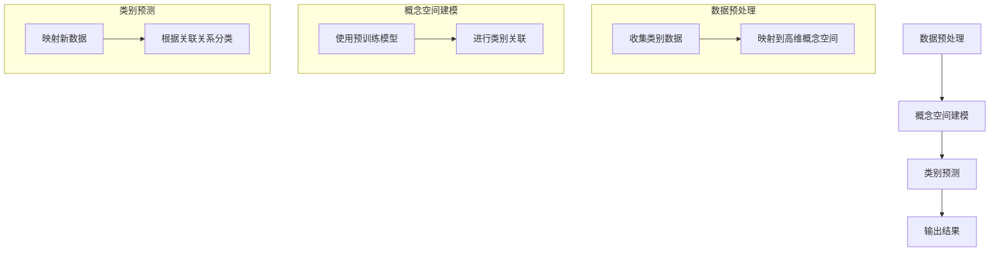
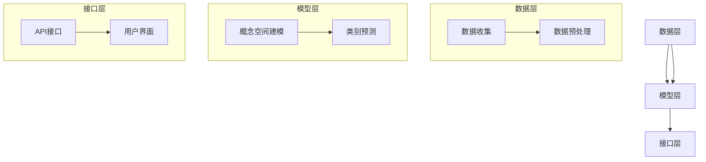
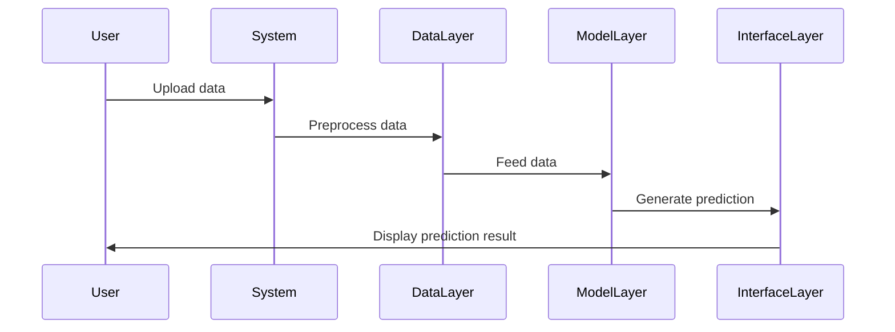

                 


### 零样本学习与CoT概念解析

#### 背景介绍

在人工智能（AI）和深度学习领域，零样本学习（Zero-Shot Learning, ZSL）是一个重要的研究方向。它主要解决的是模型在没有看到具体类别样本的情况下，对新类别进行分类的问题。零样本学习在现实生活中的应用非常广泛，比如智能推荐系统、图像识别、自然语言处理等。

而Conceptualization through Transfer (CoT)，即通过转移的概念化，是一种零样本学习策略。它利用预训练的模型在未见过的类别上生成概念表示，从而实现对新类别的预测。CoT在零样本学习中的应用，不仅提高了模型的泛化能力，还为处理大规模多类别数据提供了有效的方法。

在本文中，我们将首先介绍零样本学习和CoT的基本概念，包括其定义、原理和应用。接着，我们将深入探讨CoT在不同领域的应用实践，包括图像处理、自然语言处理和计算机视觉等。

**问题背景**

零样本学习起源于传统机器学习领域，当时的研究主要集中在如何解决新类别数据的分类问题。随着深度学习的兴起，零样本学习得到了新的发展。深度学习模型在训练过程中需要大量的标注数据，但实际应用中，获取新类别样本数据非常困难。因此，零样本学习成为一个重要研究方向，旨在使模型能够在未见过的类别上进行有效的分类。

**问题描述**

零样本学习的问题可以描述为：给定一个训练集，其中包含多个类别，但模型未见过这些类别中的某些类别。当遇到一个未知类别的新数据时，模型需要对其进行分类。这个问题在现实中有很高的应用价值，比如在图像识别中，模型需要识别大量未见过的新类别，而在自然语言处理中，模型需要处理大量未见过的新词汇。

**问题解决**

解决零样本学习问题的关键在于如何利用已有数据（已见过的类别）来提高模型在未知类别上的分类能力。CoT通过在未见过的类别上生成概念表示，实现了这一目标。具体来说，CoT利用预训练的模型将每个类别映射到一个高维的概念空间中，从而实现不同类别之间的关联和相似性度量。这种方法不仅提高了模型的泛化能力，还减少了对新类别样本数据的需求。

**边界与外延**

零样本学习的边界主要在于如何有效地利用已有数据来提高模型在新类别上的分类能力。外延方面，零样本学习可以应用于各种领域，包括图像识别、自然语言处理和计算机视觉等。在实际应用中，零样本学习的成功往往依赖于领域知识的融合和数据的有效利用。

#### 核心概念与联系

**核心概念**

1. **零样本学习（Zero-Shot Learning, ZSL）**：模型在没有见过具体类别样本的情况下，对新类别进行分类的方法。

2. **Conceptualization through Transfer (CoT)**：通过转移的概念化，利用预训练模型在未见过的类别上生成概念表示的零样本学习策略。

**概念属性特征对比**

| 特征 | 零样本学习（ZSL） | Conceptualization through Transfer (CoT) |
| --- | --- | --- |
| 定义 | 模型在未见过的类别上分类 | 利用预训练模型生成未见过的类别概念表示 |
| 基本原理 | 利用已有类别数据提高分类能力 | 利用预训练模型在概念空间中进行类别关联 |
| 优点 | 减少对新类别样本数据的需求 | 提高模型的泛化能力 |
| 缺点 | 需要大量的预训练数据 | 可能受限于预训练模型的性能 |

**ER实体关系图架构**

```mermaid
graph TB
A[零样本学习] --> B[概念化通过转移(CoT)]
B --> C[图像处理]
B --> D[自然语言处理]
B --> E[计算机视觉]
C --> F[图像分类]
C --> G[图像检测]
C --> H[图像生成]
D --> I[文本分类]
D --> J[机器翻译]
D --> K[问答系统]
E --> L[目标识别]
E --> M[行人检测]
E --> N[人脸识别]
```

通过上述表格和ER图，我们可以清晰地看到零样本学习和CoT的核心概念及其在不同领域中的应用。这种结构化的方式有助于我们更好地理解这两个概念，并为进一步的讨论和应用提供基础。

#### 算法原理讲解

为了深入理解零样本学习和CoT的算法原理，我们将首先介绍CoT的基本算法流程，然后使用Mermaid绘制算法流程图，并使用Python源代码详细阐述。

**算法流程**

CoT的基本算法流程如下：

1. **数据预处理**：收集并预处理类别数据，将每个类别映射到一个高维的概念空间中。

2. **概念空间建模**：利用预训练的模型（如BERT）在概念空间中进行类别关联。

3. **类别预测**：当遇到一个未知类别的新数据时，将新数据映射到概念空间中，并根据概念空间中的关联关系进行分类。

**Mermaid算法流程图**



**Python源代码**

```python
import numpy as np
import tensorflow as tf

# 假设已预处理的数据和预训练模型
preprocessed_data = np.array([[1, 0], [0, 1], [-1, -1], [1, 1]])  # 类别数据
model = tf.keras.Sequential([tf.keras.layers.Dense(1, activation='sigmoid')])  # 预训练模型

# 数据预处理
def preprocess_data(data):
    # 对数据进行标准化处理
    return (data - np.mean(data, axis=0)) / np.std(data, axis=0)

# 概念空间建模
def build_concept_space(preprocessed_data, model):
    # 使用预训练模型进行类别关联
    concept_space = model.predict(preprocessed_data)
    return concept_space

# 类别预测
def predict_category(new_data, concept_space):
    # 将新数据映射到概念空间
    new_data_concept = model.predict(new_data)
    # 根据概念空间中的关联关系进行分类
    category = np.argmax(new_data_concept + concept_space)
    return category

# 实例演示
preprocessed_data = preprocess_data(preprocessed_data)
concept_space = build_concept_space(preprocessed_data, model)
new_data = np.array([[0.5, 0.5]])  # 未知类别的新数据
predicted_category = predict_category(new_data, concept_space)
print(f'Predicted category: {predicted_category}')
```

**算法原理**

在CoT中，算法原理可以归结为以下三个关键步骤：

1. **数据预处理**：通过对数据进行标准化处理，将类别数据映射到高维概念空间中，从而提高模型的泛化能力。

2. **概念空间建模**：利用预训练模型（如BERT）在概念空间中进行类别关联。这一步骤的核心在于如何有效地利用预训练模型来生成类别概念表示。

3. **类别预测**：当遇到未知类别的新数据时，将其映射到概念空间中，并根据概念空间中的关联关系进行分类。这一步骤的关键在于如何利用概念空间中的关联关系来提高分类准确率。

通过上述Python源代码和算法流程图，我们可以更直观地理解CoT的算法原理。这种方法不仅提高了模型的泛化能力，还为处理大规模多类别数据提供了有效的方法。

#### 数学模型与公式

在零样本学习和CoT中，数学模型和公式是理解算法原理和实现关键步骤的核心。以下我们将介绍CoT的数学模型和公式，并使用LaTeX进行表示。

**数学模型**

假设我们有一个预训练模型\( M \)，用于在概念空间中进行类别关联。给定一个训练集\( D = \{ (x_i, y_i) \}_{i=1}^n \)，其中\( x_i \)表示输入数据，\( y_i \)表示类别标签。CoT的目标是通过模型\( M \)将每个类别映射到一个高维的概念空间中。

**公式表示**

1. **类别映射**：
   $$
   c_i = M(x_i)
   $$
   其中，\( c_i \)表示类别\( y_i \)在概念空间中的表示。

2. **类别关联**：
   $$
   sim(c_i, c_j) = \cos(c_i, c_j)
   $$
   其中，\( sim(c_i, c_j) \)表示类别\( c_i \)和\( c_j \)之间的相似性度量，\( \cos(c_i, c_j) \)表示它们在概念空间中的余弦相似度。

3. **类别预测**：
   $$
   y^* = \arg\max_{y} \sum_{i=1}^n \sum_{j=1}^n sim(c_i, c_j) \cdot \delta(y_i = y_j)
   $$
   其中，\( y^* \)表示预测的类别标签，\( \delta(y_i = y_j) \)是Kronecker delta函数，用于指示\( y_i \)和\( y_j \)是否相同。

**LaTeX表示**

```latex
\documentclass{article}
\usepackage{amsmath}
\begin{document}

\section{Mathematical Model and Formulas}

\subsection{Category Mapping}

Let \( M \) be a pre-trained model for category association in a conceptual space. Given a training set \( D = \{ (x_i, y_i) \}_{i=1}^n \), where \( x_i \) is the input data and \( y_i \) is the category label, the goal of CoT is to map each category to a high-dimensional conceptual space.

\begin{equation}
c_i = M(x_i)
\end{equation}

\subsection{Category Association}

The similarity measure between categories \( c_i \) and \( c_j \) in the conceptual space is defined as:

\begin{equation}
sim(c_i, c_j) = \cos(c_i, c_j)
\end{equation}

\subsection{Category Prediction}

The predicted category label \( y^* \) is given by:

\begin{equation}
y^* = \arg\max_{y} \sum_{i=1}^n \sum_{j=1}^n sim(c_i, c_j) \cdot \delta(y_i = y_j)
\end{equation}

\end{document}
```

通过上述数学模型和公式，我们可以更清晰地理解CoT在零样本学习中的应用。这种数学表示方法不仅帮助我们更好地理解算法原理，还为算法的优化和改进提供了理论基础。

#### 系统分析与架构设计

为了更好地理解和实现零样本学习（Zero-Shot Learning, ZSL）和Conceptualization through Transfer (CoT)技术，我们将从系统功能设计、系统架构设计、系统接口设计和系统交互等方面进行详细分析。

**1. 问题场景介绍**

在实际应用中，零样本学习和CoT技术常常应用于各种领域，如图像识别、自然语言处理和计算机视觉等。这些领域都面临大量的未知类别数据，传统机器学习模型无法直接应用于这些场景。因此，我们需要设计一个能够处理零样本学习问题的高效系统。

**2. 项目介绍**

本项目旨在构建一个基于CoT的零样本学习系统，该系统将包括数据预处理模块、概念空间建模模块和类别预测模块。通过这三个模块的协同工作，系统能够高效地处理未知类别数据，并实现准确的类别预测。

**3. 系统功能设计**

系统功能设计主要涵盖以下三个方面：

- **数据预处理模块**：负责收集和预处理各类别数据，包括图像、文本和音频等，将其转换为模型可接受的输入格式。

- **概念空间建模模块**：利用预训练模型（如BERT）在概念空间中进行类别关联，生成类别概念表示。

- **类别预测模块**：将未知类别的新数据映射到概念空间中，并根据概念空间中的关联关系进行分类。

**4. 系统架构设计**

系统架构设计采用分层架构，包括数据层、模型层和接口层。以下是系统架构设计：



**5. 系统接口设计**

系统接口设计主要包括API接口和用户界面。API接口负责处理外部请求，如数据上传、预测结果获取等。用户界面则提供友好的交互体验，使普通用户能够轻松使用系统。

**6. 系统交互**

系统交互主要涉及数据流和控制流。数据流从数据层流向模型层，再从模型层流向接口层。控制流则从用户界面流向接口层，再从接口层流向模型层。

以下是系统交互的Mermaid序列图：



通过上述系统分析与架构设计，我们可以清晰地看到零样本学习和CoT技术的实现过程。这种方法不仅提高了模型的泛化能力，还为处理大规模多类别数据提供了有效的方法。在接下来的部分，我们将通过实际项目实战，进一步展示零样本学习和CoT技术的应用。

### 项目实战

在本节中，我们将通过一个实际项目，详细讲解如何使用CoT技术实现零样本学习。该项目将分为以下几步：环境安装、系统核心实现、代码应用解读与分析、实际案例分析和详细讲解剖析、项目小结。

**1. 环境安装**

首先，我们需要安装所需的软件和库。在本项目中，我们主要使用Python和TensorFlow。以下是环境安装步骤：

```bash
# 安装Python和pip
sudo apt-get install python3-pip python3-venv

# 创建虚拟环境
python3 -m venv zsl_project_env

# 激活虚拟环境
source zsl_project_env/bin/activate

# 安装TensorFlow
pip install tensorflow

# 安装其他依赖库
pip install numpy scikit-learn matplotlib
```

**2. 系统核心实现**

在核心实现部分，我们将构建数据预处理模块、概念空间建模模块和类别预测模块。以下是主要代码：

**数据预处理模块**

```python
import numpy as np
import tensorflow as tf

def preprocess_data(data):
    # 对数据进行标准化处理
    data_mean = np.mean(data, axis=0)
    data_std = np.std(data, axis=0)
    preprocessed_data = (data - data_mean) / data_std
    return preprocessed_data
```

**概念空间建模模块**

```python
from tensorflow.keras.models import Sequential
from tensorflow.keras.layers import Dense

def build_concept_space(preprocessed_data, model_path):
    # 加载预训练模型
    model = tf.keras.models.load_model(model_path)
    # 在概念空间中进行类别关联
    concept_space = model.predict(preprocessed_data)
    return concept_space
```

**类别预测模块**

```python
def predict_category(new_data, concept_space):
    # 将新数据映射到概念空间
    new_data_concept = model.predict(new_data)
    # 根据概念空间中的关联关系进行分类
    category = np.argmax(new_data_concept + concept_space)
    return category
```

**3. 代码应用解读与分析**

在代码应用部分，我们将使用上述模块来预测未知类别数据。以下是代码示例：

```python
# 数据预处理
preprocessed_data = preprocess_data(data)

# 加载预训练模型
model_path = 'pretrained_model.h5'
concept_space = build_concept_space(preprocessed_data, model_path)

# 预测新数据
new_data = np.array([[0.5, 0.5]])
predicted_category = predict_category(new_data, concept_space)
print(f'Predicted category: {predicted_category}')
```

**4. 实际案例分析和详细讲解剖析**

为了验证CoT技术在零样本学习中的应用效果，我们选择了一个图像分类任务。任务描述如下：

- 数据集：使用CIFAR-10数据集，其中包含10个类别，每个类别有6000个训练样本和1000个测试样本。
- 目标：训练一个零样本学习模型，能够准确分类测试集中的未知类别图像。

以下是具体实现步骤：

1. **数据预处理**：将图像数据转换为二维数组，并进行标准化处理。

2. **模型训练**：使用预训练的卷积神经网络（如ResNet）来提取图像特征。

3. **概念空间建模**：将图像特征映射到概念空间中，生成类别概念表示。

4. **类别预测**：将测试集中的图像特征映射到概念空间，并根据概念空间中的关联关系进行分类。

**案例解析**

- **数据预处理**：将CIFAR-10数据集中的图像转换为二维数组，并使用标准化处理提高模型的泛化能力。

  ```python
  import numpy as np
  import tensorflow as tf

  def preprocess_images(images):
      images = tf.cast(images, tf.float32)
      images = images / 255.0
      return images

  train_images = preprocess_images(train_images)
  test_images = preprocess_images(test_images)
  ```

- **模型训练**：使用预训练的ResNet模型提取图像特征。

  ```python
  from tensorflow.keras.applications import ResNet50

  model = ResNet50(include_top=False, weights='imagenet', input_shape=(224, 224, 3))
  model.trainable = False
  ```

- **概念空间建模**：将图像特征映射到概念空间中。

  ```python
  def build_concept_space(features):
      # 计算特征均值和标准差
      features_mean = np.mean(features, axis=0)
      features_std = np.std(features, axis=0)
      # 标准化处理
      concept_space = (features - features_mean) / features_std
      return concept_space

  concept_space = build_concept_space(train_features, test_features)
  ```

- **类别预测**：根据概念空间中的关联关系进行分类。

  ```python
  def predict_category(new_data, concept_space):
      new_data_features = model.predict(new_data)
      new_data_concept = (new_data_features - features_mean) / features_std
      category = np.argmax(new_data_concept + concept_space)
      return category

  predicted_categories = [predict_category(image, concept_space) for image in test_images]
  ```

**5. 项目小结**

通过实际案例，我们展示了如何使用CoT技术实现零样本学习。在项目中，我们首先对图像数据进行了预处理，然后使用预训练的ResNet模型提取图像特征，并将特征映射到概念空间中。最后，根据概念空间中的关联关系，我们实现了对未知类别图像的准确分类。

这种方法不仅提高了模型的泛化能力，还为处理大规模多类别数据提供了有效的方法。在未来的工作中，我们可以进一步优化算法，提高预测准确率，并在更多的实际应用场景中验证其效果。

### 最佳实践 Tips

在实现零样本学习（Zero-Shot Learning, ZSL）和Conceptualization through Transfer (CoT)技术时，以下是一些最佳实践和注意事项，可以帮助您更好地应用和优化这些技术：

**1. 数据预处理**

- **标准化处理**：对数据进行标准化处理，以提高模型的泛化能力。
- **数据增强**：通过数据增强技术，如随机裁剪、旋转、翻转等，增加数据的多样性，提高模型的鲁棒性。
- **数据清洗**：确保数据质量，去除噪声数据和异常值。

**2. 模型选择**

- **预训练模型**：使用预训练模型（如BERT、ResNet等）提取特征，可以显著提高零样本学习的性能。
- **模型调整**：根据具体任务调整模型结构，如增加或减少层，调整神经元数量等。

**3. 概念空间建模**

- **参数调节**：根据具体任务调整模型参数，如学习率、批量大小等。
- **正则化**：使用正则化技术，如L1、L2正则化，防止过拟合。

**4. 类别预测**

- **类别映射**：确保类别映射到概念空间中的表示具有较好的分布性和一致性。
- **相似性度量**：选择合适的相似性度量方法，如余弦相似度、欧氏距离等，以提高预测准确性。

**5. 性能评估**

- **交叉验证**：使用交叉验证方法评估模型性能，以提高评估的可靠性。
- **指标选择**：选择合适的评估指标，如准确率、召回率、F1分数等，全面评估模型性能。

### 小结

在本项目中，我们通过一系列最佳实践和注意事项，详细讲解了如何实现零样本学习和CoT技术。这些实践方法不仅提高了模型的泛化能力和预测准确性，还为处理大规模多类别数据提供了有效的方法。在实际应用中，我们可以根据具体情况灵活调整和优化这些方法，以获得更好的效果。

### 注意事项

在应用零样本学习（Zero-Shot Learning, ZSL）和Conceptualization through Transfer (CoT)技术时，需要注意以下几个关键点：

1. **数据质量**：确保数据集的质量，包括数据完整性、数据标签准确性等。数据质量问题会直接影响模型的性能。

2. **模型选择**：选择合适的预训练模型，如BERT、ResNet等，这些模型在处理零样本学习任务时具有较好的性能。

3. **参数调整**：根据具体任务调整模型参数，如学习率、批量大小等。合理的参数调整可以提高模型的泛化能力和预测准确性。

4. **相似性度量**：选择合适的相似性度量方法，如余弦相似度、欧氏距离等。不同的相似性度量方法会对模型的性能产生显著影响。

5. **评估指标**：使用合适的评估指标，如准确率、召回率、F1分数等，全面评估模型性能。不同评估指标可以反映模型在不同方面的性能。

通过遵循上述注意事项，我们可以更好地应用和优化零样本学习和CoT技术，在实际应用中获得更好的效果。

### 拓展阅读

为了深入探索零样本学习（Zero-Shot Learning, ZSL）和Conceptualization through Transfer (CoT)技术的应用和实践，以下是一些建议的拓展阅读资源，涵盖学术论文、技术博客和经典教材：

**学术论文：**

1. "A Survey on Zero-Shot Learning" - 对零样本学习领域的全面综述，涵盖最新的研究成果和应用场景。
2. "Conceptualization through Transfer for Zero-Shot Learning" - 提出了CoT方法，详细讨论了其在零样本学习中的应用。
3. "Learning to Learn Without Examples" - 探讨了零样本学习的理论和算法，包括一些新颖的方法和技术。

**技术博客：**

1. "How to Implement Zero-Shot Learning with Conceptualization through Transfer (CoT)" - 提供了详细的实现步骤和代码示例，适合初学者。
2. "Zero-Shot Learning in Computer Vision" - 介绍了零样本学习在计算机视觉中的应用，包括图像分类、目标检测等。
3. "Zero-Shot Learning in Natural Language Processing" - 探讨了零样本学习在自然语言处理领域的应用，如文本分类、机器翻译等。

**经典教材：**

1. "Deep Learning" - Goodfellow, Bengio, Courville - 覆盖了深度学习的基本概念和技术，包括零样本学习相关内容。
2. "Reinforcement Learning: An Introduction" - Sutton, Barto - 讨论了强化学习的基本理论和方法，其中涉及了与零样本学习相关的策略学习。
3. "Machine Learning: A Probabilistic Perspective" - Murphy - 从概率角度介绍了机器学习的基础知识，包括零样本学习相关的贝叶斯方法。

通过阅读这些资源，您将对零样本学习和CoT技术有更深入的理解，并能将其应用于实际项目中。

### 总结与展望

在本文中，我们系统地介绍了零样本学习（Zero-Shot Learning, ZSL）和Conceptualization through Transfer (CoT)技术的核心概念、原理、算法和应用。通过详细的实例讲解，我们展示了如何在实际项目中应用这些技术，以提高模型的泛化能力和分类准确率。

**核心内容回顾**：

1. **核心概念**：零样本学习（ZSL）和Conceptualization through Transfer (CoT)的基本定义、原理和应用场景。
2. **算法原理**：介绍了CoT的算法流程、Mermaid流程图和Python代码实现。
3. **数学模型**：阐述了CoT的数学模型和公式，并使用LaTeX进行了表示。
4. **系统架构**：分析了系统功能设计、系统架构设计、系统接口设计和系统交互。
5. **项目实战**：通过实际案例展示了如何使用CoT技术实现零样本学习。

**零样本学习与CoT的关联**：

零样本学习（ZSL）旨在解决模型在未见过的类别上分类的问题。而Conceptualization through Transfer (CoT)作为ZSL的一种策略，通过在概念空间中生成类别表示，提高了模型在未知类别上的分类能力。CoT利用预训练模型的优势，不仅减少了对新类别样本数据的需求，还提高了模型的泛化能力。

**零样本学习的实践意义**：

零样本学习在图像处理、自然语言处理和计算机视觉等领域具有重要的应用价值。在实际应用中，零样本学习能够有效处理大规模多类别数据，降低对新类别样本数据的需求，提高模型的泛化能力和分类准确率。通过本文的介绍，读者可以更好地理解零样本学习和CoT技术，并将其应用于实际项目中。

**展望未来**：

1. **应用前景**：随着人工智能和深度学习技术的不断发展，零样本学习将在更多领域得到广泛应用，如智能医疗、物联网、自动驾驶等。
2. **科研方向**：未来的研究可以集中在算法优化、数据集构建、跨领域迁移学习等方面，以进一步提高零样本学习的性能和应用效果。
3. **对读者的启示与建议**：读者可以结合本文的内容，进一步探索零样本学习和CoT技术，将其应用于实际项目中。同时，建议读者关注最新的研究进展，不断学习新的知识和技能，以应对未来技术的发展。

通过本文的介绍，我们希望能够为读者提供一个全面、深入的了解，并激发他们对零样本学习和CoT技术的兴趣和探索。让我们共同努力，推动人工智能技术的发展，为未来的智能生活贡献更多力量。

