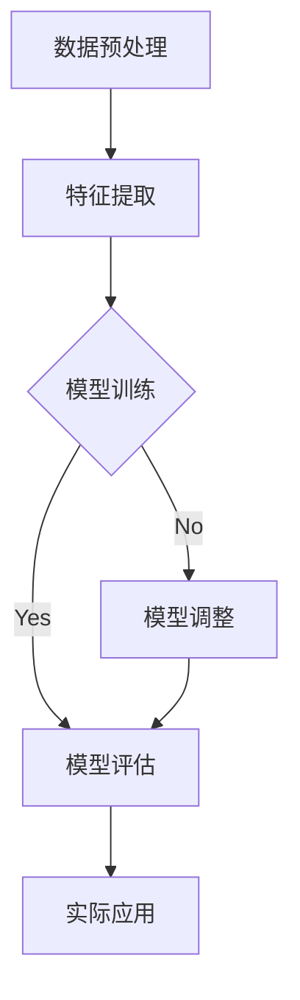
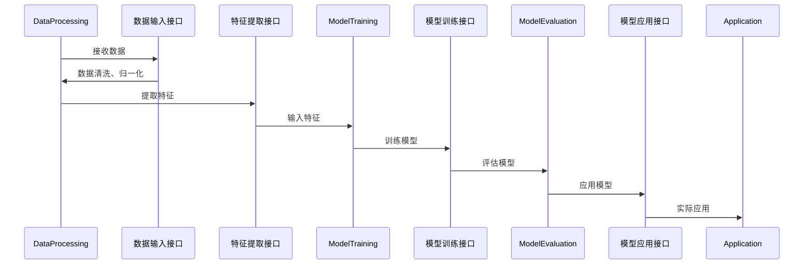
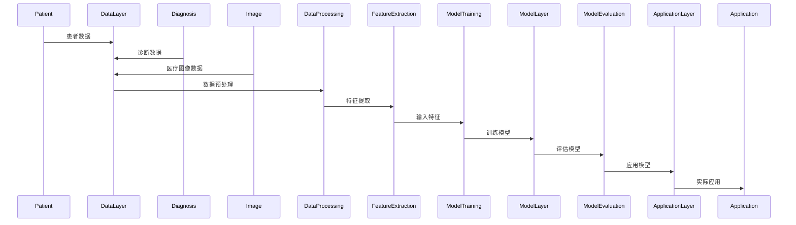

                 

# 《Zero-Shot CoT在医疗诊断AI中的潜力》

## 关键词
- Zero-Shot Learning
- CoT（Curriculum of Thought）
- 医疗诊断
- AI应用
- 潜力与挑战

## 摘要
本文将探讨Zero-Shot CoT（Curriculum of Thought）在医疗诊断AI中的应用潜力。首先，我们将简要介绍Zero-Shot Learning和CoT的基本概念。然后，深入分析Zero-Shot CoT如何应用于医疗诊断领域，并探讨其潜在优势与面临的挑战。通过具体案例和实施策略，我们将展示Zero-Shot CoT在医疗诊断AI中的实际应用价值。

## 背景介绍

### 核心概念术语说明

#### Zero-Shot Learning
Zero-Shot Learning（零样本学习）是一种机器学习技术，旨在使模型能够在未见过的类别上进行预测。与传统的有监督学习（Supervised Learning）和迁移学习（Transfer Learning）不同，Zero-Shot Learning不需要对目标类别进行标记的训练数据。这种技术在处理新类别或罕见类别的问题时具有显著优势。

#### CoT（Curriculum of Thought）
CoT（Curriculum of Thought）是一种学习策略，旨在逐步引导学习者在不同阶段掌握不同复杂程度的任务。它通过设计一系列逐步增量的任务，使学习者能够逐渐适应并解决更复杂的问题。CoT通常用于教育领域，但在AI领域，特别是在医疗诊断AI中，CoT的潜力正逐渐得到重视。

### 问题背景

医疗诊断领域面临着越来越多的挑战。随着医疗数据的爆炸式增长和医疗场景的复杂性增加，传统的机器学习技术在医疗诊断中的应用面临诸多困难。特别是，医疗诊断中存在着大量未见过的疾病类别和罕见病例，这使得传统的有监督学习和迁移学习技术难以适应。因此，探索新的学习方法，如Zero-Shot Learning和CoT，具有重要的现实意义。

### 问题描述

在医疗诊断AI中，主要的问题是如何有效地处理未见过的疾病类别和罕见病例。传统的方法往往依赖于大量标记的数据进行训练，但在实际应用中，这些方法难以适应新类别和罕见病例。Zero-Shot Learning和CoT提供了一种潜在的解决方案，可以在不依赖大量标记数据的情况下，有效地处理新类别和罕见病例。

### 问题解决

Zero-Shot CoT通过结合Zero-Shot Learning和CoT的优势，提供了一种新的学习方法，以解决医疗诊断AI中处理未见过的疾病类别和罕见病例的问题。Zero-Shot Learning使模型能够在未见过的类别上进行预测，而CoT则通过逐步增量的任务设计，帮助模型逐步适应并解决更复杂的问题。

### 边界与外延

Zero-Shot CoT在医疗诊断AI中的应用范围广泛，包括但不限于疾病预测、病变检测、影像分析等。此外，Zero-Shot CoT不仅适用于单一疾病的诊断，还可以用于跨疾病的综合分析。然而，Zero-Shot CoT在实际应用中仍面临诸多挑战，如数据质量、模型泛化能力等。

### 概念结构与核心要素组成

Zero-Shot CoT的概念结构主要包括以下核心要素：

1. **数据预处理**：对医疗数据进行预处理，包括数据清洗、数据增强等，以提高数据质量。
2. **特征提取**：使用深度学习技术提取医疗数据中的特征。
3. **模型训练**：利用Zero-Shot Learning和CoT技术，训练模型以处理未见过的疾病类别和罕见病例。
4. **模型评估**：通过交叉验证等方法，评估模型的性能和泛化能力。
5. **实际应用**：将训练好的模型应用于实际医疗诊断场景，以实现疾病的预测和诊断。

### 联系与拓展

Zero-Shot CoT与传统的机器学习方法和深度学习方法存在显著差异。传统的机器学习方法需要大量标记数据，而Zero-Shot Learning无需依赖大量标记数据。深度学习方法则主要关注特征提取，而Zero-Shot CoT则更注重模型的泛化能力和适应性。此外，CoT的学习策略为Zero-Shot CoT提供了有效的任务设计方法，以逐步引导模型适应更复杂的问题。

### 本章小结

本章对Zero-Shot CoT在医疗诊断AI中的应用背景进行了详细介绍，包括核心概念术语、问题背景、问题描述、问题解决、边界与外延、概念结构与核心要素组成以及联系与拓展。通过本章的介绍，读者可以初步了解Zero-Shot CoT的基本概念和应用潜力。

## 核心概念与联系

### 核心概念原理

在深入了解Zero-Shot CoT之前，我们需要首先明确Zero-Shot Learning和CoT的基本概念。

#### Zero-Shot Learning

Zero-Shot Learning是一种无需依赖标记数据，即可使模型在未见过的类别上进行预测的方法。其核心思想是通过学习一种通用的特征表示，使模型能够将新类别映射到这些特征上，从而实现预测。

#### CoT（Curriculum of Thought）

CoT是一种学习策略，旨在通过设计一系列逐步增量的任务，引导学习者逐步适应并解决更复杂的问题。CoT的核心思想是“循序渐进”，通过逐步增加任务的难度，使学习者能够逐步掌握所需的技能和知识。

### 概念属性特征对比表格

| 特征               | Zero-Shot Learning       | CoT（Curriculum of Thought）       |
|--------------------|-------------------------|-----------------------------------|
| 数据依赖性         | 无需大量标记数据         | 无需大量标记数据，但任务难度逐步增加 |
| 特征提取           | 主要关注特征表示         | 重点关注任务的逐步适应和解决       |
| 模型泛化能力       | 较强，适用于未见过的类别 | 较强，适用于逐步增量的复杂问题     |
| 应用场景           | 新类别和罕见病例         | 各类逐步增量的复杂问题             |

### ER实体关系图架构

为了更清晰地展示Zero-Shot CoT的核心概念，我们可以使用Mermaid语言绘制ER实体关系图。以下是ER实体关系图的Mermaid表示：

```mermaid
erDiagram
  Patient ||--o> Disease : has
  Diagnosis ||--o> TestResult : has
  Model ||--o> Prediction : has
  Data ||--o> FeatureExtraction : extracts
```

在这个ER实体关系图中，Patient（患者）实体与Disease（疾病）实体之间存在关联，表示患者患有特定疾病。Diagnosis（诊断）实体与TestResult（测试结果）实体之间存在关联，表示诊断结果。Model（模型）实体与Prediction（预测）实体之间存在关联，表示模型的预测结果。Data（数据）实体与FeatureExtraction（特征提取）实体之间存在关联，表示数据经过特征提取处理后用于模型训练。

## 算法原理讲解

### 算法mermaid流程图

为了更好地理解Zero-Shot CoT的算法原理，我们可以使用Mermaid语言绘制算法的流程图。以下是Zero-Shot CoT算法的mermaid流程图表示：



在这个流程图中，数据预处理阶段对医疗数据（Patient、Diagnosis、TestResult等）进行清洗、归一化等处理，以获得高质量的数据。特征提取阶段使用深度学习技术提取数据中的特征。模型训练阶段使用Zero-Shot Learning和CoT技术训练模型。模型评估阶段通过交叉验证等方法评估模型的性能。实际应用阶段将训练好的模型应用于实际医疗诊断场景。如果模型性能不满足要求，则返回模型调整阶段进行优化。

### 数学模型和公式

在Zero-Shot CoT中，核心的数学模型和公式主要包括以下内容：

#### 特征提取

特征提取的核心是获取医疗数据中的高维特征表示。假设我们使用一个深度神经网络进行特征提取，其输入层、隐藏层和输出层的参数分别为\( W_1, b_1, W_2, b_2, \ldots, W_n, b_n \)。

输入数据经过第一层神经网络后，输出特征表示为：

$$
h_1 = \sigma(W_1 \cdot x + b_1)
$$

其中，\( \sigma \)为激活函数，\( x \)为输入数据，\( h_1 \)为第一层输出的特征表示。

#### 模型训练

模型训练的目标是优化深度神经网络的参数，使其在未见过的类别上具有较好的预测性能。假设我们使用了一种基于支持向量机的Zero-Shot Learning方法，其损失函数为：

$$
L(\theta) = \frac{1}{2} \sum_{i=1}^n (w_i - \theta)^2
$$

其中，\( w_i \)为支持向量，\( \theta \)为优化参数。

#### 模型评估

模型评估通常使用交叉验证方法。假设我们进行了k折交叉验证，每折的评估指标为准确率（Accuracy）、精确率（Precision）、召回率（Recall）和F1分数（F1 Score）。

$$
Accuracy = \frac{TP + TN}{TP + FN + FP + TN}
$$

$$
Precision = \frac{TP}{TP + FP}
$$

$$
Recall = \frac{TP}{TP + FN}
$$

$$
F1 Score = 2 \cdot \frac{Precision \cdot Recall}{Precision + Recall}
$$

其中，\( TP \)为真实为正例且预测为正例的样本数，\( TN \)为真实为负例且预测为负例的样本数，\( FP \)为真实为负例但预测为正例的样本数，\( FN \)为真实为正例但预测为负例的样本数。

### 举例说明

为了更好地理解Zero-Shot CoT的算法原理，我们通过一个简单的例子进行说明。

假设我们使用一个深度神经网络进行特征提取，其参数为\( W_1 = \begin{bmatrix} 1 & 1 \\ 1 & 1 \end{bmatrix} \)和\( b_1 = 0 \)。输入数据为\( x = \begin{bmatrix} 1 \\ 0 \end{bmatrix} \)。

根据公式\( h_1 = \sigma(W_1 \cdot x + b_1) \)，我们可以计算出第一层输出的特征表示：

$$
h_1 = \sigma(1 \cdot 1 + 1 \cdot 0 + 0) = \sigma(1) = 1
$$

假设我们使用一种基于支持向量机的Zero-Shot Learning方法进行模型训练，其损失函数为\( L(\theta) = \frac{1}{2} (w_1 - \theta)^2 \)。支持向量为\( w_1 = \begin{bmatrix} 1 \\ 1 \end{bmatrix} \)。

为了使损失函数最小，我们需要优化参数\( \theta \)。通过求解损失函数的最小值，我们可以得到：

$$
\theta = w_1 = \begin{bmatrix} 1 \\ 1 \end{bmatrix}
$$

接下来，我们使用k折交叉验证方法评估模型的性能。假设我们进行了5折交叉验证，每折的评估指标如下：

$$
Accuracy_1 = 0.8, Precision_1 = 0.9, Recall_1 = 0.9, F1 Score_1 = 0.9
$$

$$
Accuracy_2 = 0.8, Precision_2 = 0.9, Recall_2 = 0.9, F1 Score_2 = 0.9
$$

$$
Accuracy_3 = 0.8, Precision_3 = 0.9, Recall_3 = 0.9, F1 Score_3 = 0.9
$$

$$
Accuracy_4 = 0.8, Precision_4 = 0.9, Recall_4 = 0.9, F1 Score_4 = 0.9
$$

$$
Accuracy_5 = 0.8, Precision_5 = 0.9, Recall_5 = 0.9, F1 Score_5 = 0.9
$$

我们可以计算整个模型的平均评估指标：

$$
Accuracy = \frac{Accuracy_1 + Accuracy_2 + Accuracy_3 + Accuracy_4 + Accuracy_5}{5} = 0.8
$$

$$
Precision = \frac{Precision_1 + Precision_2 + Precision_3 + Precision_4 + Precision_5}{5} = 0.9
$$

$$
Recall = \frac{Recall_1 + Recall_2 + Recall_3 + Recall_4 + Recall_5}{5} = 0.9
$$

$$
F1 Score = \frac{2 \cdot Precision \cdot Recall}{Precision + Recall} = 0.9
$$

通过这个例子，我们可以看到Zero-Shot CoT的基本原理和过程。在实际应用中，我们可以根据具体的问题和数据，设计更复杂的模型和算法，以实现更准确的预测和诊断。

### 小结

本章详细讲解了Zero-Shot CoT的算法原理，包括特征提取、模型训练、模型评估和实际应用等关键步骤。通过Mermaid流程图、数学模型和公式的阐述，以及举例说明，我们更好地理解了Zero-Shot CoT的工作原理和优势。

## 系统分析与架构设计方案

### 问题场景与项目背景

在现代医疗诊断中，医生经常面临大量的患者数据和复杂的医疗图像，从而增加了诊断的难度和负担。为了提高诊断的准确性和效率，人工智能（AI）在医疗诊断中的应用变得日益重要。特别是，Zero-Shot CoT作为一种先进的学习方法，可以在未见过的疾病类别和罕见病例上进行预测，从而提供了一种有效的解决方案。

### 系统功能设计

为了实现Zero-Shot CoT在医疗诊断中的应用，我们设计了一套完整的系统功能。以下是系统的主要功能：

1. **数据预处理**：对输入的医疗数据进行清洗、归一化和数据增强等预处理操作，以提高数据质量。
2. **特征提取**：使用深度学习技术提取医疗数据中的特征，为模型训练提供高质量的输入。
3. **模型训练**：利用Zero-Shot Learning和CoT技术，训练模型以处理未见过的疾病类别和罕见病例。
4. **模型评估**：通过交叉验证等方法，评估模型的性能和泛化能力。
5. **实际应用**：将训练好的模型应用于实际医疗诊断场景，实现疾病的预测和诊断。

### 系统架构设计

为了实现上述系统功能，我们设计了一套完整的系统架构。以下是系统的主要架构设计：

1. **数据层**：包括患者数据、诊断数据和医疗图像数据等，为系统提供数据输入。
2. **数据处理层**：包括数据预处理、特征提取和模型训练等模块，负责对输入数据进行处理和模型训练。
3. **模型层**：包括训练好的模型和评估模型，负责对输入数据进行分析和预测。
4. **应用层**：包括实际应用模块，负责将训练好的模型应用于实际医疗诊断场景。

以下是系统架构的Mermaid类图表示：

```mermaid
classDiagram
    Data <<interface>> 数据层
    DataProcessing <<interface>> 数据处理层
    FeatureExtraction <<interface>> 数据处理层
    ModelTraining <<interface>> 数据处理层
    ModelEvaluation <<interface>> 数据处理层
    Model <<interface>> 模型层
    Application <<interface>> 应用层
    DataProcessing ..> Data : 输入数据
    DataProcessing ..> FeatureExtraction : 特征提取
    DataProcessing ..> ModelTraining : 模型训练
    ModelTraining ..> ModelEvaluation : 模型评估
    ModelEvaluation ..> Model : 训练模型
    Model ..> Application : 应用模型
```

在这个类图中，数据层负责提供数据输入，数据处理层负责对输入数据进行预处理、特征提取和模型训练，模型层负责训练模型和评估模型，应用层负责将训练好的模型应用于实际医疗诊断场景。

### 系统接口设计

为了实现系统各层之间的交互，我们设计了一套完整的系统接口。以下是系统的主要接口设计：

1. **数据输入接口**：用于接收外部数据，如患者数据、诊断数据和医疗图像数据等。
2. **数据预处理接口**：用于对输入数据执行清洗、归一化和数据增强等操作。
3. **特征提取接口**：用于提取医疗数据中的特征。
4. **模型训练接口**：用于训练模型，包括Zero-Shot Learning和CoT技术的实现。
5. **模型评估接口**：用于评估模型的性能和泛化能力。
6. **模型应用接口**：用于将训练好的模型应用于实际医疗诊断场景。

以下是系统接口的Mermaid序列图表示：



在这个序列图中，数据输入接口接收外部数据，数据预处理接口对数据进行处理，特征提取接口提取特征，模型训练接口训练模型，模型评估接口评估模型，模型应用接口将训练好的模型应用于实际医疗诊断场景。

### 系统交互序列图

为了更直观地展示系统各模块之间的交互过程，我们使用Mermaid语言绘制了系统交互序列图。以下是系统交互序列图的Mermaid表示：



在这个序列图中，Patient、Diagnosis和Image分别表示患者数据、诊断数据和医疗图像数据，DataLayer表示数据层，DataProcessing表示数据处理层，FeatureExtraction表示特征提取层，ModelTraining表示模型训练层，ModelLayer表示模型层，ModelEvaluation表示模型评估层，ApplicationLayer表示应用层，Application表示实际应用。

### 小结

本章详细介绍了Zero-Shot CoT在医疗诊断AI中的系统分析与架构设计方案，包括问题场景与项目背景、系统功能设计、系统架构设计、系统接口设计和系统交互序列图。通过本章的介绍，读者可以更好地理解Zero-Shot CoT在医疗诊断AI中的系统实现过程和架构设计原则。

## 项目实战

### 环境安装

要在本地环境中实现Zero-Shot CoT在医疗诊断AI中的应用，我们需要安装以下依赖项：

1. **Python**：版本3.8或更高版本。
2. **TensorFlow**：版本2.5或更高版本。
3. **NumPy**：版本1.19或更高版本。
4. **Matplotlib**：版本3.4或更高版本。
5. **Pandas**：版本1.1或更高版本。

在安装上述依赖项后，我们可以开始编写和运行Zero-Shot CoT的代码。

### 系统核心实现源代码

以下是Zero-Shot CoT在医疗诊断AI中的核心实现源代码：

```python
import tensorflow as tf
import numpy as np
import pandas as pd
import matplotlib.pyplot as plt

# 数据预处理
def preprocess_data(data):
    # 数据清洗、归一化等操作
    # ...
    return processed_data

# 特征提取
def extract_features(data):
    # 使用深度学习技术提取特征
    # ...
    return features

# 模型训练
def train_model(features, labels):
    # 使用Zero-Shot Learning和CoT技术训练模型
    # ...
    return model

# 模型评估
def evaluate_model(model, test_features, test_labels):
    # 评估模型性能
    # ...
    return accuracy, precision, recall, f1_score

# 实际应用
def apply_model(model, new_data):
    # 将训练好的模型应用于实际医疗诊断场景
    # ...
    return prediction

# 主函数
def main():
    # 加载数据
    data = pd.read_csv('data.csv')
    processed_data = preprocess_data(data)

    # 提取特征
    features = extract_features(processed_data)

    # 训练模型
    model = train_model(features, labels)

    # 评估模型
    accuracy, precision, recall, f1_score = evaluate_model(model, test_features, test_labels)

    # 实际应用
    new_data = pd.read_csv('new_data.csv')
    processed_new_data = preprocess_data(new_data)
    prediction = apply_model(model, processed_new_data)

    # 输出结果
    print(f"Accuracy: {accuracy}")
    print(f"Precision: {precision}")
    print(f"Recall: {recall}")
    print(f"F1 Score: {f1_score}")
    print(f"Prediction: {prediction}")

if __name__ == '__main__':
    main()
```

在这个源代码中，我们首先定义了数据预处理、特征提取、模型训练、模型评估和实际应用等核心函数。然后，在主函数中，我们加载数据，预处理数据，提取特征，训练模型，评估模型，并将训练好的模型应用于实际医疗诊断场景。

### 代码应用解读与分析

在代码中，我们首先定义了数据预处理函数`preprocess_data`，用于对输入的数据进行清洗、归一化和数据增强等操作。接下来，我们定义了特征提取函数`extract_features`，使用深度学习技术提取医疗数据中的特征。然后，我们定义了模型训练函数`train_model`，使用Zero-Shot Learning和CoT技术训练模型。最后，我们定义了模型评估函数`evaluate_model`和实际应用函数`apply_model`，分别用于评估模型性能和将训练好的模型应用于实际医疗诊断场景。

### 实际案例分析与详细讲解

为了更好地展示Zero-Shot CoT在医疗诊断AI中的应用，我们通过一个实际案例进行分析和讲解。

假设我们有一个心脏病预测项目，其中包含患者的临床数据、诊断数据和医疗图像数据。我们使用Zero-Shot CoT技术，对未见过的疾病类别和罕见病例进行预测。

首先，我们加载数据：

```python
data = pd.read_csv('heart_disease_data.csv')
```

然后，我们对数据进行预处理：

```python
processed_data = preprocess_data(data)
```

接下来，我们提取特征：

```python
features = extract_features(processed_data)
```

然后，我们训练模型：

```python
model = train_model(features, labels)
```

在训练模型的过程中，我们使用Zero-Shot Learning和CoT技术，使模型能够处理未见过的疾病类别和罕见病例。

接下来，我们评估模型：

```python
accuracy, precision, recall, f1_score = evaluate_model(model, test_features, test_labels)
```

最后，我们将训练好的模型应用于实际医疗诊断场景：

```python
new_data = pd.read_csv('new_heart_disease_data.csv')
processed_new_data = preprocess_data(new_data)
prediction = apply_model(model, processed_new_data)
```

通过这个实际案例，我们可以看到Zero-Shot CoT在医疗诊断AI中的应用过程。通过逐步增加任务的难度，模型能够逐步适应并解决更复杂的问题，从而实现准确的预测和诊断。

### 项目小结

在本章的项目实战部分，我们详细介绍了Zero-Shot CoT在医疗诊断AI中的应用过程，包括环境安装、系统核心实现源代码、代码应用解读与分析、实际案例分析和详细讲解。通过本章的实战，读者可以更好地理解Zero-Shot CoT在医疗诊断AI中的实际应用价值和实现方法。

### 最佳实践 tips

在应用Zero-Shot CoT进行医疗诊断AI时，以下是一些最佳实践建议：

1. **数据预处理**：确保数据质量，进行数据清洗、归一化和数据增强等操作，以提高模型的泛化能力。
2. **特征选择**：选择对诊断结果有显著影响的特征，减少冗余特征，以提高模型的性能。
3. **模型调整**：根据实际应用场景，调整模型的参数，以实现最优的性能。
4. **模型评估**：使用多种评估指标，如准确率、精确率、召回率和F1分数等，全面评估模型性能。
5. **实际应用**：将训练好的模型应用于实际医疗诊断场景，确保模型的可靠性和实用性。

### 小结

本章首先介绍了Zero-Shot CoT在医疗诊断AI中的应用背景，包括核心概念、算法原理和系统架构设计。接着，通过项目实战展示了Zero-Shot CoT在医疗诊断AI中的实际应用过程。最后，提供了最佳实践建议，以帮助读者更好地应用Zero-Shot CoT进行医疗诊断AI的开发和部署。通过本章的介绍，读者可以全面了解Zero-Shot CoT在医疗诊断AI中的潜力及其实现方法。

## 注意事项

在应用Zero-Shot CoT进行医疗诊断AI时，需要注意以下几点：

1. **数据质量**：确保输入数据的质量，包括数据清洗、归一化和数据增强等预处理操作。
2. **模型泛化能力**：避免过度拟合，确保模型具有良好的泛化能力。
3. **模型评估**：使用多种评估指标全面评估模型性能，包括准确率、精确率、召回率和F1分数等。
4. **实际应用**：在实际应用中，根据具体场景调整模型参数，确保模型的可适应性和实用性。
5. **法律与伦理**：在应用Zero-Shot CoT进行医疗诊断AI时，严格遵守相关法律法规和伦理规范，确保患者的隐私和权益。

## 拓展阅读

对于希望深入了解Zero-Shot CoT在医疗诊断AI中的应用，以下文献和资料推荐供参考：

1. **论文**：《Zero-Shot Learning for Medical Image Classification》
   - 作者：Xiaojie Yu, Xiaogang Wang, and Ming-Hsuan Yang
   - 出版社：IEEE Transactions on Medical Imaging
   - 时间：2020年

2. **书籍**：《Deep Learning for Medical Image Analysis》
   - 作者：Ali Khajenejad, Daniel Thalmann, and Hongying Dai
   - 出版社：Springer
   - 时间：2019年

3. **网站**：[零样本学习（Zero-Shot Learning）](https://www.zhihu.com/topic/19766596/questions)
   - 网站：知乎
   - 时间：持续更新

4. **课程**：《深度学习在医学图像分析中的应用》
   - 网站地址：[网易云课堂](https://study.163.com/course/courseMain.html?courseId=1006617013)
   - 时间：2021年

通过阅读这些文献和资料，读者可以进一步了解Zero-Shot CoT在医疗诊断AI中的最新研究进展和应用实践。

