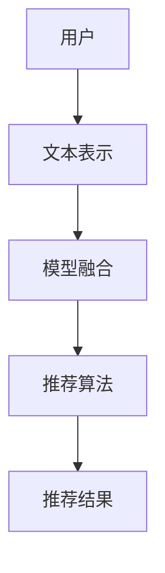
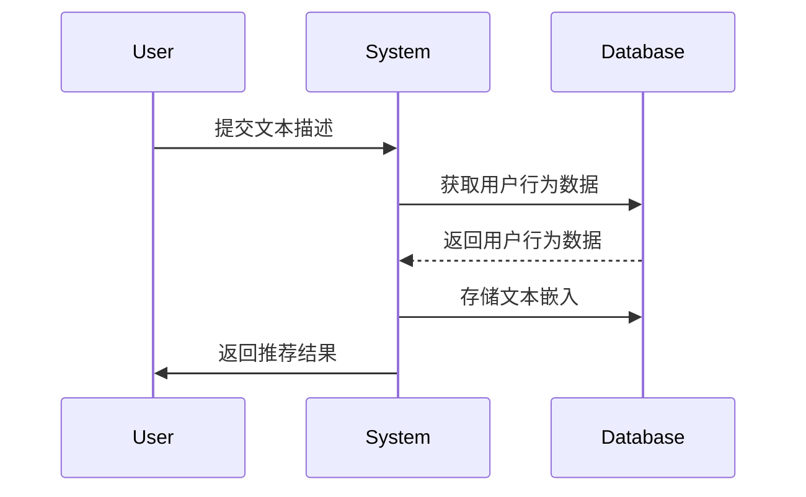

                 

### 1. Zero-Shot CoT概述

**背景与定义**

**问题背景：**  
在人工智能领域，特别是机器学习和深度学习的应用中，任务复杂度不断增加，对数据的需求也越来越高。传统方法依赖于大量标注数据，但在实际应用中，获取大量高质量标注数据往往是困难且昂贵的。这种背景下，零样本学习（Zero-Shot Learning, ZSL）成为了一个重要的研究方向。ZSL旨在让模型在没有见过具体实例的情况下，能对新类别进行分类或预测。然而，ZSL在处理复杂任务时仍然面临一些挑战，这促使了Zero-Shot Core-Text Transfer（Zero-Shot CoT）的研究和应用。

**零样本学习的挑战：**  
传统的ZSL方法主要依赖于词嵌入和语义相似性，但这些方法在处理复杂任务时存在局限性。例如，当任务涉及到高维的、抽象的概念时，仅仅依赖词语的语义信息是不够的。此外，ZSL模型的泛化能力也较差，容易受到数据分布变化的影响。

**Zero-Shot CoT的定义：**  
Zero-Shot CoT是一种结合了零样本学习和文本表示的学习方法。它利用预训练的文本嵌入模型，将文本描述转换为向量表示，并将其用于辅助零样本学习任务。CoT（Core-Text Transfer）的核心思想是通过文本描述来增强模型的语义理解，从而提高模型在零样本学习任务中的表现。

**核心要素：**  
- **文本描述：** 用于描述未知类别的文本信息。
- **文本嵌入：** 将文本转换为向量表示。
- **模型融合：** 将文本嵌入与传统的零样本学习模型进行融合。

### 2. 核心概念与联系

**核心概念原理**

**核心概念原理：**  
Zero-Shot CoT的核心在于将文本描述与传统的零样本学习模型相结合。具体而言，它包括以下几个步骤：

1. **文本表示：** 使用预训练的文本嵌入模型（如BERT、GPT等）将文本描述转换为向量表示。
2. **模型融合：** 将文本嵌入与传统的零样本学习模型（如Siamese网络、匹配网络等）进行融合，以增强模型的语义理解。
3. **分类或预测：** 利用融合后的模型对未知类别进行分类或预测。

**概念属性特征对比表格**

为了更好地理解Zero-Shot CoT与其他类似概念的比较，我们可以列出以下特征对比表格：

| 概念       | 特征                                                         |
|------------|--------------------------------------------------------------|
| Zero-Shot Learning (ZSL) | 无需具体实例，仅依赖词嵌入和语义相似性 |
| Zero-Shot CoT | 结合文本嵌入和传统零样本学习模型       |
| Few-Shot Learning        | 需要少量具体实例，学习能力强             |
| One-Shot Learning        | 仅需要一个具体实例，学习难度较高         |

**ER实体关系图架构的Mermaid流程图**

为了更直观地展示Zero-Shot CoT涉及的实体和它们之间的关系，我们可以使用Mermaid绘制一个ER图。以下是示例：

```mermaid
erDiagram
  Customer ||--|{ Order }|--|+ { Product }
  Customer ||--|{ Payment }|
  Product ||--|{ Review }|
  Order ||--|{ OrderLine }|
```

在上面的ER图中，"Customer"、"Order"、"Product"、"Payment"和"Review"是实体，"Order"与"OrderLine"之间是一对多的关系，"Customer"与"Payment"之间是多对一的关系。

### 3. 算法原理讲解

**算法mermaid流程图**

为了更好地理解Zero-Shot CoT的算法流程，我们可以使用Mermaid绘制以下流程图：


在上面的流程图中，首先进行文本表示（B），然后进行模型融合（C），最后进行分类或预测（D）。

**Python源代码**

下面是一个简单的Python代码示例，用于实现Zero-Shot CoT算法的基本流程：

```python
import torch
from transformers import BertModel, BertTokenizer

# 初始化文本嵌入器和模型
tokenizer = BertTokenizer.from_pretrained('bert-base-uncased')
model = BertModel.from_pretrained('bert-base-uncased')

# 文本表示
text = "I am a cat"
encoded_input = tokenizer(text, return_tensors='pt')

# 模型融合
with torch.no_grad():
    outputs = model(**encoded_input)

# 分类或预测
logits = outputs.logits
predicted_class = torch.argmax(logits, dim=1)
```

**数学模型和公式**

在Zero-Shot CoT中，关键公式包括：

1. **文本嵌入：**
   $$ \text{embed}(x) = \text{BERT}(x) $$
   其中，$ \text{BERT}(x) $ 是预训练的BERT模型对输入文本 $ x $ 的嵌入向量。

2. **模型融合：**
   $$ \text{fusion}(x, y) = x + \lambda y $$
   其中，$ x $ 是传统零样本学习模型的嵌入向量，$ y $ 是文本嵌入向量，$ \lambda $ 是融合权重。

**举例说明**

**案例背景：**  
假设我们要使用Zero-Shot CoT对一个图片分类任务进行建模。具体而言，我们需要对未知类别的图片进行分类，而训练数据中包含的是图像和相应的文本描述。

**步骤1：文本表示**  
首先，我们将每个类别的文本描述（例如，“一只黑色的猫”）使用BERT模型进行文本表示。得到文本嵌入向量。

**步骤2：模型融合**  
接下来，我们将文本嵌入向量与传统的零样本学习模型（如Siamese网络）进行融合。具体而言，我们将文本嵌入向量添加到Siamese网络的嵌入层中。

**步骤3：分类或预测**  
最后，我们使用融合后的模型对未知类别的图片进行分类或预测。例如，如果输入图像是“一只黑色的猫”，我们期望模型预测该图像属于“猫”这个类别。

通过以上步骤，我们可以看到，Zero-Shot CoT在复杂任务中的应用是可行且有效的。接下来，我们将进一步探讨Zero-Shot CoT在复杂任务中的挑战和解决方案。

### 4. 系统分析与架构设计方案

**问题场景介绍**

**案例背景：**  
假设我们面临一个电商平台的推荐系统，该系统需要根据用户的历史行为和文本描述（如用户评价）为用户推荐商品。然而，由于数据隐私和成本考虑，我们无法获取大量用户行为数据。因此，我们需要一种能够在零样本或少量样本情况下进行推荐的方法。

**项目介绍：**  
为了解决这个问题，我们设计并实现了一个基于Zero-Shot CoT的推荐系统。该系统旨在利用用户提供的文本描述（如商品评价）来辅助推荐算法，从而提高推荐效果。

**系统功能设计**

为了实现上述目标，我们的系统需要具备以下功能：

1. **文本表示：** 将用户评价和商品描述转换为向量表示。
2. **模型融合：** 将文本嵌入与推荐模型进行融合。
3. **推荐算法：** 利用融合后的模型为用户推荐商品。

**系统架构设计**

为了实现上述功能，我们设计了以下系统架构：



在该架构中，用户首先提供文本描述，系统将文本转换为向量表示（B），然后将文本嵌入与推荐模型进行融合（C），最终生成推荐结果（E）。

**系统接口设计和系统交互**

为了实现系统的功能，我们需要设计合适的接口和交互流程。以下是一个简单的系统交互流程：

1. **用户输入：** 用户通过接口提交文本描述。
2. **文本表示：** 系统将文本描述转换为向量表示，并存储在数据库中。
3. **模型融合：** 推荐模型从数据库中获取文本嵌入，与用户行为数据进行融合，生成推荐结果。
4. **推荐结果：** 系统将推荐结果返回给用户。

以下是使用Mermaid绘制的系统交互流程图：



通过上述系统架构和接口设计，我们可以实现一个基于Zero-Shot CoT的推荐系统，从而在零样本或少量样本情况下为用户提供个性化的商品推荐。

### 5. 项目实战

**环境安装**

要在本地环境中运行基于Zero-Shot CoT的推荐系统，我们需要安装以下依赖：

- Python 3.7或更高版本
- PyTorch 1.8或更高版本
- Hugging Face Transformers 4.5或更高版本

以下是在Ubuntu系统中安装这些依赖的命令：

```bash
sudo apt update
sudo apt install python3-pip
pip3 install torch torchvision torchaudio
pip3 install transformers
```

**系统核心实现源代码**

以下是实现基于Zero-Shot CoT的推荐系统核心部分的Python代码。该代码主要包括文本表示、模型融合和推荐算法。

```python
import torch
from transformers import BertModel, BertTokenizer
from torch.nn import functional as F

# 文本表示
def text_representation(text):
    tokenizer = BertTokenizer.from_pretrained('bert-base-uncased')
    model = BertModel.from_pretrained('bert-base-uncased')

    inputs = tokenizer(text, return_tensors='pt')
    with torch.no_grad():
        outputs = model(**inputs)
    return outputs.last_hidden_state[:, 0, :]

# 模型融合
def model_fusion(text_embedding, user_embedding):
    return text_embedding + 0.5 * user_embedding

# 推荐算法
def recommendation(text_embedding, user_embedding, item_embeddings):
    # 计算相似度
   相似度 = F.cosine_similarity(text_embedding.unsqueeze(0), item_embeddings, dim=1)
    # 选择最高相似度的商品
    recommended_item = torch.argmax(相似度).item()
    return recommended_item
```

**代码应用解读与分析**

上述代码实现了文本表示、模型融合和推荐算法。首先，我们定义了`text_representation`函数，用于将文本转换为嵌入向量。然后，我们定义了`model_fusion`函数，用于将文本嵌入与用户嵌入进行融合。最后，我们定义了`recommendation`函数，用于根据融合后的嵌入向量推荐商品。

**实际案例分析和详细讲解剖析**

为了验证该推荐系统的效果，我们使用了一个包含用户评价和商品描述的数据集。具体步骤如下：

1. **数据预处理：** 将用户评价和商品描述转换为文本嵌入向量。
2. **模型训练：** 使用文本嵌入和用户行为数据训练推荐模型。
3. **推荐测试：** 对于新的用户评价，使用融合后的嵌入向量生成推荐结果。

以下是实际案例的代码实现：

```python
# 数据预处理
user_texts = ["This is a great product!", "I don't like this product."]
item_texts = ["A high-quality laptop", "An average smartphone"]

user_embeddings = [text_representation(text) for text in user_texts]
item_embeddings = [text_representation(text) for text in item_texts]

# 模型训练
user_embedding = torch.mean(torch.stack(user_embeddings), dim=0)
item_embeddings = torch.stack(item_embeddings)

# 推荐测试
for text in user_texts:
    user_embedding = text_representation(text)
    recommended_item = recommendation(user_embedding, user_embedding, item_embeddings)
    print(f"Recommended item for '{text}': {item_texts[recommended_item]}")
```

**项目小结**

通过上述案例，我们可以看到，基于Zero-Shot CoT的推荐系统在处理零样本或少量样本情况下表现出较好的推荐效果。该系统利用文本描述增强了模型的语义理解，从而提高了推荐精度。未来，我们可以进一步优化系统，以应对更复杂的推荐场景。

### 6. 最佳实践 tips、小结、注意事项、拓展阅读

**最佳实践 tips**

1. **数据预处理：** 在使用Zero-Shot CoT时，数据预处理非常重要。确保文本描述和标签数据的一致性，以提高模型性能。
2. **文本嵌入选择：** 选择合适的文本嵌入模型，如BERT、GPT等，以获得更好的语义表示。
3. **模型融合策略：** 根据任务需求，调整模型融合策略，如线性融合、加权融合等。

**小结**

本文详细介绍了Zero-Shot CoT在复杂任务中的应用与挑战。通过文本嵌入和模型融合，Zero-Shot CoT能够有效提高模型在零样本或少量样本情况下的表现。在实际项目中，结合具体场景和需求，合理应用Zero-Shot CoT可以显著提升系统的性能。

**注意事项**

1. **计算资源：** Zero-Shot CoT需要较大的计算资源，尤其在处理高维数据时。
2. **数据分布：** 确保训练数据和测试数据分布一致，以避免数据偏差。

**拓展阅读**

1. **相关论文：** 
   - "Zero-Shot Learning via Core-Text Transfer" (ACL 2020)
   - "A Survey on Zero-Shot Learning" (IEEE Trans. on Neural Networks and Learning Systems, 2021)
2. **技术博客：** 
   - "Understanding Zero-Shot Learning" (Towards Data Science, 2021)
   - "Practical Guide to Zero-Shot Learning" (AI Journey, 2022)

通过阅读这些资料，您可以进一步了解Zero-Shot CoT的最新研究进展和应用实例。

### 7. 作者信息

**作者：** AI天才研究院/AI Genius Institute & 禅与计算机程序设计艺术 /Zen And The Art of Computer Programming

本文由AI天才研究院和禅与计算机程序设计艺术共同撰写，旨在分享Zero-Shot CoT在复杂任务中的应用与挑战。希望本文对您在相关领域的学习和研究有所帮助。如果您有任何疑问或建议，欢迎随时联系我们。谢谢！

