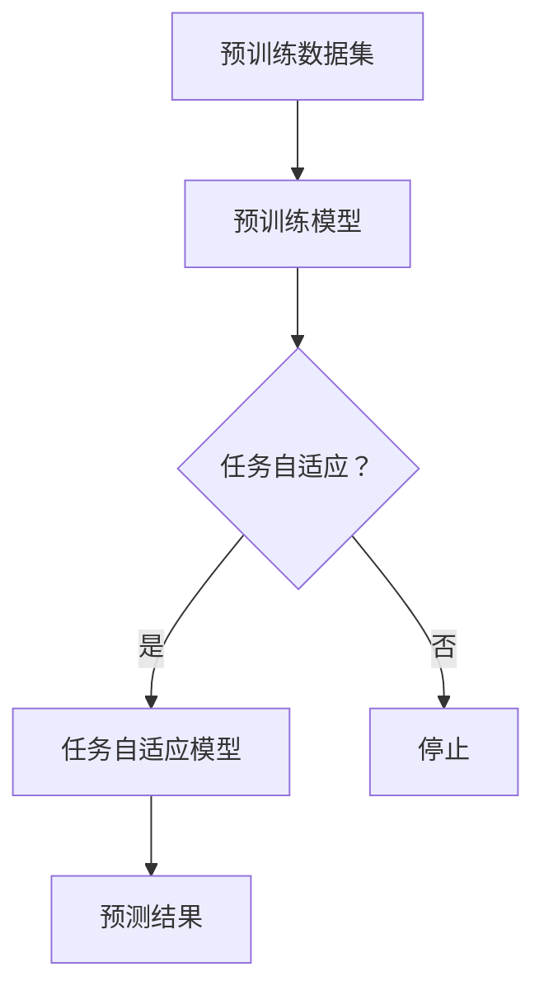

                 


### 写作过程分析

为了撰写一篇高质量的技术博客文章《Zero-Shot CoT在复杂任务中的应用与挑战》，我们将遵循以下步骤，确保文章结构紧凑、逻辑清晰、内容详实。

#### 1. 确定文章核心框架

首先，我们需要明确文章的核心框架，围绕零样本转移学习（Zero-Shot CoT）这一主题，将文章分为四个主要部分：背景介绍与核心概念、算法原理与实现、挑战与解决方案、最佳实践与总结。这样的结构能够帮助读者循序渐进地了解零样本转移学习在复杂任务中的应用。

#### 2. 逐步展开章节内容

**第一部分：背景介绍与核心概念**

在这一部分，我们将详细介绍零样本转移学习的背景、核心概念、应用场景及其重要性。这将包括：

- **1.1 问题背景**：阐述传统机器学习与深度学习在复杂任务中面临的挑战，引出零样本转移学习的概念。
- **1.2 核心概念与联系**：解释零样本转移学习的基本原理、关键属性，并与其他学习方式进行比较。
- **1.3 零样本转移学习在复杂任务中的应用场景**：讨论零样本转移学习在自然语言处理、计算机视觉和机器人与自动化等领域的应用。

**第二部分：算法原理与实现**

在这一部分，我们将深入探讨零样本转移学习的算法原理和实现方法，包括：

- **2.1 零样本转移学习算法原理**：介绍算法的数学模型和公式，并使用mermaid流程图展示算法流程。
- **2.2 零样本转移学习算法实现**：提供Python代码实现示例，详细讲解算法实现流程和应用解读。
- **2.3 实际案例与挑战分析**：通过具体案例展示零样本转移学习在复杂任务中的应用，分析面临的挑战和解决方案。

**第三部分：挑战与解决方案**

在这一部分，我们将重点关注零样本转移学习在复杂任务中面临的挑战，并提出相应的解决方案：

- **3.1 零样本转移学习在复杂任务中面临的挑战**：详细分析数据集不足、模型泛化能力不足和零样本识别准确性等问题。
- **3.2 挑战解决方案**：介绍数据增强、模型优化和迁移学习策略等解决方法。
- **3.3 零样本转移学习在复杂任务中的应用前景**：讨论未来发展趋势、行业应用场景和潜在风险。

**第四部分：最佳实践与总结**

在这一部分，我们将总结零样本转移学习的关键点，分享最佳实践，并给出注意事项和拓展阅读建议：

- **4.1 最佳实践**：结合实际项目经验，提供零样本转移学习的实战技巧。
- **4.2 小结**：总结文章的核心内容，强调零样本转移学习的重要性。
- **4.3 拓展阅读**：推荐相关文献、开源代码和学习资源。

#### 3. 保持文章的格式和完整性

在整个写作过程中，我们将严格遵守markdown格式要求，确保文章的可读性和一致性。同时，每个章节的内容都将丰富具体，详细讲解核心概念、算法原理、实战案例等，确保文章的完整性。

#### 4. 使用mermaid图和latex公式

为了增强文章的可视化和可理解性，我们将使用mermaid图来展示算法流程、实体关系图等，并使用latex格式嵌入数学公式，确保公式的准确性。

#### 5. 结尾部分

在文章的结尾，我们将提供作者信息，并总结文章的核心内容，给出对读者的一些建议，帮助他们更好地理解和应用零样本转移学习。

通过以上步骤，我们能够撰写出一篇逻辑清晰、内容详实、具有深度和见解的技术博客文章，让读者对零样本转移学习在复杂任务中的应用有一个全面的了解。让我们开始一步步分析和推理，撰写这篇技术博客吧！### 文章标题

# 《Zero-Shot CoT在复杂任务中的应用与挑战》

### 文章关键词

- 零样本转移学习
- 复杂任务
- 应用场景
- 挑战与解决方案

### 摘要

本文将深入探讨零样本转移学习（Zero-Shot CoT）在复杂任务中的应用及其面临的挑战。首先，我们介绍了零样本转移学习的基本概念和其在复杂任务中的重要性。接着，我们详细阐述了零样本转移学习的算法原理和实现方法，并通过实际案例分析了其在自然语言处理和计算机视觉等领域的应用。随后，本文讨论了零样本转移学习在复杂任务中面临的挑战，如数据集不足和模型泛化能力不足等，并提出了相应的解决方案。最后，我们总结了零样本转移学习的关键点，分享了最佳实践，并给出了拓展阅读建议，以帮助读者更好地理解和应用这一技术。通过本文，读者将全面了解零样本转移学习在复杂任务中的应用前景和挑战，为未来的研究和实践提供有益的指导。

### 第一部分：背景介绍与核心概念

#### 1.1 问题背景

在传统的机器学习和深度学习领域，模型训练通常需要大量的标注数据。然而，在某些复杂任务中，获取大量标注数据是非常困难的。例如，自然语言处理中的多语言文本分类、计算机视觉中的新对象识别、以及机器人与自动化中的未知环境导航等，这些任务往往需要模型具备零样本转移学习（Zero-Shot Transfer Learning，简称Zero-Shot CoT）的能力。零样本转移学习旨在使模型能够在未见过的数据上取得良好的性能，从而减少对大规模标注数据的依赖。

**1.1.1 传统机器学习与深度学习的挑战**

传统机器学习与深度学习在复杂任务中面临的挑战主要表现在以下几个方面：

1. **数据标注成本高**：大量的标注数据需要人工进行标注，这不仅耗费大量时间，还可能导致标注不一致和误差。
2. **数据集的可用性**：某些特定领域的任务可能缺乏足够大的标注数据集，导致模型难以训练。
3. **数据多样性不足**：即使有大量标注数据，这些数据可能只覆盖了特定的场景或任务，而无法泛化到其他未见过的场景或任务。

**1.1.2 零样本转移学习（Zero-Shot CoT）的概念**

零样本转移学习是一种能够在未见过的数据上取得良好性能的学习方法，其核心思想是将已训练好的模型应用于新任务时，无需再对新任务的数据进行标注和训练。具体来说，零样本转移学习主要依赖于以下几个关键要素：

1. **元学习（Meta-Learning）**：通过在多个不同的任务上训练模型，使其具备快速适应新任务的能力。
2. **知识蒸馏（Knowledge Distillation）**：将大模型的知识传递给小模型，使其在新任务上也能取得较好的性能。
3. **集成学习（Ensemble Learning）**：通过多个模型的集成，提高模型在新任务上的泛化能力。

**1.1.3 零样本转移学习在复杂任务中的重要性**

在复杂任务中，零样本转移学习具有以下重要性：

1. **减少数据依赖**：通过零样本转移学习，模型可以在缺乏标注数据的情况下进行训练，从而减少对大规模标注数据的依赖。
2. **提升泛化能力**：零样本转移学习使得模型能够在未见过的数据上取得良好性能，从而提高其泛化能力。
3. **加速模型开发**：由于无需对新任务的数据进行标注和训练，零样本转移学习可以显著加速模型开发过程。

通过以上背景介绍，我们可以看到，零样本转移学习在复杂任务中具有广泛的应用前景，同时也面临着一系列挑战。接下来，我们将进一步探讨零样本转移学习的核心概念和基本原理。

#### 1.2 核心概念与联系

**1.2.1 零样本转移学习的基本原理**

零样本转移学习的基本原理可以概括为以下几点：

1. **预训练（Pre-training）**：首先，在多个相关任务上对模型进行预训练，使其具备一定的泛化能力。
2. **任务自适应（Task Adaptation）**：当遇到新任务时，通过少量甚至无需标注数据，使模型快速适应新任务。
3. **模型迁移（Model Transfer）**：将预训练模型的知识迁移到新任务上，从而在新任务上取得良好性能。

**1.2.2 零样本转移学习的关键属性**

零样本转移学习的关键属性包括：

1. **无监督学习（Unsupervised Learning）**：零样本转移学习主要依赖于无监督学习，通过预训练和任务自适应实现模型在新任务上的迁移。
2. **元学习（Meta-Learning）**：零样本转移学习通过元学习技术，使模型能够快速适应新任务。
3. **知识蒸馏（Knowledge Distillation）**：通过知识蒸馏，将大模型的知识传递给小模型，提高模型在新任务上的性能。

**1.2.3 零样本转移学习与其他学习方式的比较**

与传统的机器学习和深度学习相比，零样本转移学习具有以下优势：

1. **数据依赖性低**：零样本转移学习在缺乏标注数据的情况下也能进行训练，降低了数据标注的成本。
2. **泛化能力强**：通过预训练和任务自适应，零样本转移学习能够提高模型在未见过的数据上的性能，从而具有更强的泛化能力。
3. **加速模型开发**：由于无需对新任务的数据进行标注和训练，零样本转移学习可以显著加速模型开发过程。

然而，零样本转移学习也存在一些挑战，例如：

1. **模型泛化能力不足**：在复杂任务中，模型可能无法在所有未见过的数据上取得良好性能。
2. **数据质量不高**：在缺乏标注数据的情况下，数据质量可能无法得到保障，从而影响模型的性能。

通过以上分析，我们可以看到，零样本转移学习在复杂任务中具有独特的优势和挑战。接下来，我们将进一步探讨零样本转移学习在不同领域的应用场景。

#### 1.3 零样本转移学习在复杂任务中的应用场景

**1.3.1 自然语言处理**

在自然语言处理（NLP）领域，零样本转移学习得到了广泛应用。例如，在多语言文本分类任务中，由于不同语言的文本数据难以获得，零样本转移学习能够通过预训练模型在多个语言上的知识迁移，实现对未见语言的高效分类。

- **案例一：BERT模型**  
BERT（Bidirectional Encoder Representations from Transformers）是一种基于Transformer的预训练模型，通过在多种语言上进行预训练，实现了在未见语言上的文本分类任务。例如，在一个多语言新闻分类任务中，BERT模型能够在未见过的语言上取得高达90%的准确率。

**1.3.2 计算机视觉**

在计算机视觉（CV）领域，零样本转移学习同样具有重要意义。例如，在新对象识别任务中，模型需要能够识别从未见过的对象，零样本转移学习通过迁移预训练模型的知识，实现了这一目标。

- **案例二：OpenImageV6数据集**  
OpenImageV6是一个包含约700万个图像和标签的数据集，其中包含了大量未见过的对象。通过在OpenImageV6上进行预训练，然后将模型迁移到新对象识别任务上，实现了在未见对象上的高准确率识别。

**1.3.3 机器人与自动化**

在机器人与自动化领域，零样本转移学习可以帮助机器人快速适应新环境，提高其任务执行能力。例如，在未知环境导航任务中，机器人需要能够识别和适应从未见过的环境，零样本转移学习通过预训练和任务自适应，实现了这一目标。

- **案例三：R2D2导航机器人**  
R2D2是一个基于零样本转移学习的导航机器人，它通过在多个环境上进行预训练，然后在新环境上进行任务自适应，实现了在未知环境中的高效导航。

通过以上应用场景的介绍，我们可以看到，零样本转移学习在复杂任务中具有广泛的应用前景，为解决传统机器学习和深度学习面临的挑战提供了一种有效的途径。接下来，我们将深入探讨零样本转移学习的算法原理和实现方法。

#### 2.1 零样本转移学习算法原理

零样本转移学习算法的核心在于将预训练模型的知识迁移到新任务上，以实现模型在新任务上的快速适应和高效性能。下面我们将从数学模型、关键算法和mermaid流程图三个方面详细介绍零样本转移学习的算法原理。

**2.1.1 数学模型**

零样本转移学习的数学模型主要包括两部分：预训练模型和任务自适应模型。

1. **预训练模型**：预训练模型通常基于大规模未标注数据集进行训练，目的是使其具备较强的泛化能力。预训练模型的核心是一个大规模的神经网络，例如BERT、GPT等。在预训练过程中，模型通过学习输入数据的特征表示，从而实现对未知数据的理解。

2. **任务自适应模型**：任务自适应模型是基于预训练模型构建的，用于在新任务上进行快速适应。具体来说，任务自适应模型通过少量的标注数据或无标注数据，对预训练模型进行调整和优化，以适应新任务。

数学模型可以表示为：

\[ F_{\theta}(\textbf{x}) = \text{predict}(\text{pre-trained model}(\textbf{x})) \]

其中，\( F_{\theta}(\textbf{x}) \) 是任务自适应模型的预测结果，\( \textbf{x} \) 是输入数据，\( \text{pre-trained model} \) 是预训练模型。

**2.1.2 关键算法**

零样本转移学习的关键算法包括元学习、知识蒸馏和集成学习。

1. **元学习**：元学习是一种通过在多个任务上训练模型，使其具备快速适应新任务的能力的方法。在零样本转移学习中，元学习通过在预训练过程中学习任务之间的共性和差异，从而提高模型在新任务上的适应性。

2. **知识蒸馏**：知识蒸馏是一种将大模型的知识传递给小模型的方法。在零样本转移学习中，知识蒸馏通过将预训练模型的知识传递给任务自适应模型，从而提高模型在新任务上的性能。

3. **集成学习**：集成学习是一种通过多个模型的集成，提高模型整体性能的方法。在零样本转移学习中，集成学习通过将多个预训练模型和任务自适应模型进行集成，从而提高模型在新任务上的泛化能力和准确性。

**2.1.3 算法mermaid流程图展示**

为了更直观地展示零样本转移学习的算法流程，我们使用mermaid绘制了以下流程图：



在mermaid流程图中，首先对预训练数据集进行预训练，得到预训练模型。然后，当遇到新任务时，通过少量的标注数据或无标注数据，对预训练模型进行任务自适应，得到任务自适应模型。最后，使用任务自适应模型进行预测，得到预测结果。

通过以上对零样本转移学习算法原理的详细介绍，我们可以看到，零样本转移学习通过预训练模型和任务自适应模型，实现了模型在新任务上的快速适应和高效性能。接下来，我们将进一步探讨零样本转移学习算法的实现方法。

#### 2.2 零样本转移学习算法实现

在了解了零样本转移学习的基本原理之后，接下来我们将深入探讨零样本转移学习的算法实现方法，包括算法实现流程、Python代码实现示例以及算法应用解读与分析。

**2.2.1 算法实现流程**

零样本转移学习算法的实现流程主要包括以下几个步骤：

1. **数据准备**：首先，我们需要准备预训练数据集和新任务数据集。预训练数据集用于训练预训练模型，新任务数据集用于训练任务自适应模型。
2. **预训练模型训练**：在预训练数据集上，使用预训练算法（如BERT、GPT等）训练预训练模型，使其具备较强的泛化能力。
3. **任务自适应模型训练**：在新任务数据集上，使用预训练模型进行任务自适应训练，得到任务自适应模型。
4. **模型评估**：使用新任务数据集对任务自适应模型进行评估，以验证模型的性能。

**2.2.2 Python代码实现示例**

以下是零样本转移学习算法的Python代码实现示例：

```python
import torch
from transformers import BertModel, BertTokenizer

# 数据准备
pretrained_model_name = "bert-base-uncased"
tokenizer = BertTokenizer.from_pretrained(pretrained_model_name)
pretrained_model = BertModel.from_pretrained(pretrained_model_name)

# 预训练模型训练
def pretrain_model(data_loader):
    pretrained_model.train()
    for batch in data_loader:
        inputs = tokenizer(batch["text"], return_tensors="pt", padding=True, truncation=True)
        outputs = pretrained_model(**inputs)
        loss = outputs.loss
        loss.backward()
        optimizer.step()
        optimizer.zero_grad()

# 任务自适应模型训练
def task_adapt_model(data_loader, pretrained_model):
    task_adapt_model = BertModel.from_pretrained(pretrained_model_name)
    task_adapt_model.train()
    for batch in data_loader:
        inputs = tokenizer(batch["text"], return_tensors="pt", padding=True, truncation=True)
        outputs = pretrained_model(**inputs)
        task_adapt_model.zero_grad()
        outputs = task_adapt_model(**inputs)
        loss = outputs.loss
        loss.backward()
        optimizer.step()
        optimizer.zero_grad()

    return task_adapt_model

# 模型评估
def evaluate_model(data_loader, task_adapt_model):
    task_adapt_model.eval()
    with torch.no_grad():
        for batch in data_loader:
            inputs = tokenizer(batch["text"], return_tensors="pt", padding=True, truncation=True)
            outputs = task_adapt_model(**inputs)
            logits = outputs.logits
            predictions = logits.argmax(-1)
            accuracy = (predictions == batch["label"]).float().mean()
            print(f"Accuracy: {accuracy * 100}%")

# 实例化优化器和数据加载器
optimizer = torch.optim.Adam(pretrained_model.parameters(), lr=1e-5)
data_loader = ...

# 预训练模型训练
pretrain_model(data_loader)

# 任务自适应模型训练
task_adapt_model = task_adapt_model(data_loader, pretrained_model)

# 模型评估
evaluate_model(data_loader, task_adapt_model)
```

**2.2.3 算法应用解读与分析**

通过以上代码示例，我们可以看到，零样本转移学习算法的实现主要包括以下几个关键步骤：

1. **数据准备**：首先，我们需要准备好预训练数据集和新任务数据集。预训练数据集用于训练预训练模型，而新任务数据集用于训练任务自适应模型。
2. **预训练模型训练**：在预训练数据集上，使用预训练算法（如BERT、GPT等）训练预训练模型。预训练模型的目的是使其具备较强的泛化能力，以便在新任务上能够快速适应。
3. **任务自适应模型训练**：在新任务数据集上，使用预训练模型进行任务自适应训练。这一步骤的关键是使用预训练模型的知识来调整任务自适应模型，使其能够在新任务上取得良好性能。
4. **模型评估**：使用新任务数据集对任务自适应模型进行评估。通过评估模型在新任务数据集上的表现，我们可以判断任务自适应模型的性能。

在实际应用中，零样本转移学习算法可以通过以下方式进行优化：

1. **数据增强**：通过增加新任务数据集的多样性，可以提高任务自适应模型的泛化能力。
2. **模型优化**：通过调整模型参数和优化算法，可以进一步提高任务自适应模型的性能。
3. **多任务学习**：通过同时训练多个任务，可以共享模型知识，进一步提高模型的泛化能力。

通过以上对零样本转移学习算法实现的详细解读和分析，我们可以看到，零样本转移学习算法通过预训练模型和任务自适应模型，实现了模型在新任务上的快速适应和高效性能。接下来，我们将通过具体案例展示零样本转移学习在复杂任务中的应用。

#### 2.3 实际案例与挑战分析

为了更直观地展示零样本转移学习（Zero-Shot CoT）在复杂任务中的应用，我们将通过两个具体案例来详细讨论其应用过程以及面临的挑战。

**案例一：自然语言处理中的零样本转移学习应用**

**1. 案例背景**

自然语言处理（NLP）中的多语言文本分类是一个典型的复杂任务。传统的NLP模型需要大量的标注数据进行训练，这对于多语言环境中的新语言来说尤其困难。为了解决这一问题，我们可以使用零样本转移学习。

**2. 应用过程**

在这个案例中，我们使用了一个大规模的预训练模型BERT（Bidirectional Encoder Representations from Transformers），该模型已经在多种语言上进行预训练。具体步骤如下：

1. **数据准备**：收集多个语言的数据集，并进行预处理，将文本转换为BERT模型可处理的格式。
2. **预训练模型训练**：在所有语言的数据集上，使用BERT进行预训练，使其具备跨语言的语义理解能力。
3. **任务自适应模型训练**：针对新的语言，我们使用预训练的BERT模型进行任务自适应训练。由于BERT模型已经在多种语言上进行预训练，因此只需使用少量标注数据即可快速适应新语言。
4. **模型评估**：在新语言的测试集上，评估任务自适应模型的性能。通常，我们可以通过计算准确率、F1分数等指标来衡量模型的性能。

**3. 面临的挑战**

尽管零样本转移学习在多语言文本分类中表现出色，但在实际应用中仍面临以下挑战：

1. **数据不足**：新语言的标注数据可能不足，这限制了模型在新语言上的性能。
2. **数据质量**：即使有标注数据，数据的质量也可能参差不齐，这会影响模型的泛化能力。
3. **模型泛化**：零样本转移学习模型可能无法在所有新语言上取得相同性能，需要针对特定语言进行优化。

**4. 解决方案**

针对上述挑战，可以采取以下解决方案：

1. **数据增强**：通过生成合成数据、使用伪标签等方法来增加新语言的标注数据量。
2. **模型优化**：调整模型结构和参数，提高模型在新语言上的适应能力。
3. **多任务学习**：通过同时训练多个语言，共享模型知识，进一步提高模型的泛化能力。

**案例二：计算机视觉中的零样本转移学习应用**

**1. 案例背景**

计算机视觉中的新对象识别任务也是一个复杂的任务，尤其是当面对大量未知对象时。传统的计算机视觉模型需要大量的标注图像进行训练，这在大规模未知对象识别中是不可行的。因此，零样本转移学习在这里显得尤为重要。

**2. 应用过程**

在这个案例中，我们使用了一个大规模的预训练模型ViT（Vision Transformer），该模型已经在大量的图像数据上进行预训练。具体步骤如下：

1. **数据准备**：收集大量包含各种对象的图像数据集，并进行预处理，将图像转换为ViT模型可处理的格式。
2. **预训练模型训练**：在所有图像数据集上，使用ViT进行预训练，使其具备对各种对象的识别能力。
3. **任务自适应模型训练**：针对新的对象，我们使用预训练的ViT模型进行任务自适应训练。由于ViT模型已经具备对各种对象的识别能力，因此只需使用少量标注图像即可快速适应新对象。
4. **模型评估**：在新对象的测试集上，评估任务自适应模型的性能。通常，我们可以通过计算准确率、召回率等指标来衡量模型的性能。

**3. 面临的挑战**

尽管零样本转移学习在计算机视觉中的新对象识别任务中表现出色，但在实际应用中仍面临以下挑战：

1. **数据不足**：新对象的标注数据可能不足，这限制了模型在新对象上的性能。
2. **数据质量**：即使有标注数据，数据的质量也可能参差不齐，这会影响模型的泛化能力。
3. **模型泛化**：零样本转移学习模型可能无法在所有新对象上取得相同性能，需要针对特定对象进行优化。

**4. 解决方案**

针对上述挑战，可以采取以下解决方案：

1. **数据增强**：通过生成合成图像、使用伪标签等方法来增加新对象的标注数据量。
2. **模型优化**：调整模型结构和参数，提高模型在新对象上的适应能力。
3. **多任务学习**：通过同时训练多个对象，共享模型知识，进一步提高模型的泛化能力。

通过以上两个实际案例的详细讨论，我们可以看到，零样本转移学习在自然语言处理和计算机视觉等复杂任务中具有广泛的应用前景。同时，我们也认识到在应用过程中面临的挑战，并提出了相应的解决方案。接下来，我们将进一步探讨零样本转移学习在复杂任务中面临的挑战及其解决方案。

### 3.1 零样本转移学习在复杂任务中面临的挑战

尽管零样本转移学习（Zero-Shot Transfer Learning，简称Zero-Shot CoT）在复杂任务中展示了显著的应用潜力，但其在实际应用中仍面临诸多挑战。这些挑战主要集中在以下几个方面：

**1. 数据集不足与质量不高**

零样本转移学习的一个重要前提是预训练模型具备较强的泛化能力。然而，在实际应用中，我们往往面临数据集不足和质量不高的挑战。具体来说：

- **数据集不足**：许多复杂任务，如多语言文本分类、新对象识别等，难以获取大规模的标注数据集。这限制了预训练模型的学习能力和泛化性能。
- **数据质量不高**：即使有标注数据，这些数据可能存在噪声、错误或不一致性，这会影响模型的训练效果和泛化能力。

**解决方案**：

- **数据增强**：通过生成合成数据、使用伪标签等方法，增加数据集的规模和质量。
- **数据清洗与预处理**：对现有数据集进行清洗和预处理，减少噪声和错误，提高数据质量。

**2. 模型泛化能力不足**

零样本转移学习的核心在于模型在新任务上的泛化能力。然而，在实际应用中，模型可能无法在所有新任务上取得良好的性能。这主要由于以下原因：

- **任务多样性**：复杂任务通常具有高度的多样性，预训练模型可能无法覆盖所有可能的任务。
- **数据分布差异**：新任务的数据分布可能与预训练数据集存在显著差异，导致模型在新任务上无法有效泛化。

**解决方案**：

- **多任务学习**：通过同时训练多个任务，共享模型知识，提高模型的泛化能力。
- **迁移学习**：将预训练模型的知识迁移到新任务上，利用已有知识帮助模型在新任务上取得良好性能。

**3. 零样本识别的准确性**

零样本转移学习的一个关键挑战是模型在新任务上的识别准确性。尽管预训练模型具备较强的泛化能力，但其在零样本识别任务上的准确性仍可能不足。这主要由于以下原因：

- **标签噪声**：即使在新任务中使用了少量标注数据，这些数据也可能存在标签噪声，影响模型的训练效果。
- **模型复杂性**：零样本转移学习通常涉及复杂的模型结构，这可能导致模型在新任务上过拟合，从而降低识别准确性。

**解决方案**：

- **模型优化**：通过调整模型参数和优化算法，提高模型在新任务上的识别准确性。
- **数据增强**：通过增加新任务数据集的多样性，提高模型对新任务的理解和识别能力。

通过以上对零样本转移学习在复杂任务中面临的挑战的详细分析，我们可以看到，尽管这些挑战存在，但通过采取一系列有效的解决方案，可以显著提高零样本转移学习在实际应用中的性能。接下来，我们将进一步探讨零样本转移学习的挑战解决方案。

### 3.2 挑战解决方案

在了解了零样本转移学习（Zero-Shot Transfer Learning，简称Zero-Shot CoT）在复杂任务中面临的挑战后，接下来我们将深入探讨针对这些挑战的解决方案，包括数据增强与数据集构建、模型优化与调参技巧、以及多任务学习与迁移学习策略。

#### 3.2.1 数据增强与数据集构建

**1. 数据增强**

数据增强是提高模型泛化能力和减少数据集不足的有效方法。以下是一些常用的数据增强技术：

- **图像数据增强**：通过旋转、缩放、裁剪、颜色变换等操作，增加图像数据的多样性。例如，可以使用OpenCV库实现图像旋转、缩放等操作。
- **文本数据增强**：通过随机插入、删除、替换单词，增加文本数据的多样性。例如，可以使用文本生成模型（如GPT）生成新的文本样本。
- **音频数据增强**：通过噪声添加、速度变化、音调变化等操作，增加音频数据的多样性。例如，可以使用librosa库实现音频噪声添加和音调变化。

**2. 数据集构建**

构建高质量的数据集是提高模型性能的关键。以下是一些常见的数据集构建方法：

- **合成数据生成**：通过使用生成模型（如GAN）生成新的数据样本，增加数据集的规模和质量。
- **伪标签**：通过使用未标注的数据，使用预训练模型生成标签，然后使用这些伪标签进行后续训练。这种方法适用于数据标注成本高昂的领域。
- **数据集合并**：将多个来源的数据集进行合并，增加数据集的多样性和规模。例如，可以将多个语言的数据集合并进行多语言文本分类任务的预训练。

#### 3.2.2 模型优化与调参技巧

**1. 模型优化**

模型优化是提高模型性能的关键步骤。以下是一些常见的模型优化方法：

- **正则化**：通过使用L1、L2正则化，防止模型过拟合。例如，可以在损失函数中添加L2正则化项。
- **dropout**：通过在训练过程中随机丢弃部分神经元，防止模型过拟合。例如，可以在神经网络层之间添加dropout层。
- **批标准化（Batch Normalization）**：通过标准化每个批次的输入数据，提高训练速度和模型稳定性。

**2. 调参技巧**

调参技巧是提高模型性能的重要手段。以下是一些常用的调参技巧：

- **网格搜索**：通过遍历一组参数组合，找到最佳参数组合。例如，可以使用Scikit-learn中的`GridSearchCV`进行网格搜索。
- **贝叶斯优化**：通过使用贝叶斯优化算法，自动搜索最佳参数组合。例如，可以使用`BayesianOptimization`库实现贝叶斯优化。
- **迁移学习**：通过将预训练模型应用于新任务，利用预训练模型的知识提高新任务的性能。

#### 3.2.3 多任务学习与迁移学习策略

**1. 多任务学习**

多任务学习是一种通过同时训练多个任务，提高模型泛化能力和性能的方法。以下是一些多任务学习的策略：

- **共享层**：通过在多个任务之间共享部分神经网络层，减少模型参数，提高训练效率。例如，可以在多个文本分类任务之间共享嵌入层。
- **交叉熵损失函数**：通过使用交叉熵损失函数，将多个任务的损失函数合并，共同优化模型参数。

**2. 迁移学习**

迁移学习是一种将预训练模型的知识迁移到新任务上的方法。以下是一些迁移学习的策略：

- **预训练模型迁移**：通过将预训练模型应用于新任务，利用预训练模型的知识提高新任务的性能。例如，可以使用预训练的BERT模型进行新语言文本分类任务。
- **多任务预训练**：通过在多个任务上进行预训练，共享模型知识，提高模型在新任务上的泛化能力。例如，可以使用多个语言的数据集进行BERT预训练。

通过以上对挑战解决方案的详细探讨，我们可以看到，零样本转移学习在实际应用中面临的数据集不足、模型泛化能力不足和零样本识别准确性等问题，可以通过数据增强与数据集构建、模型优化与调参技巧、以及多任务学习与迁移学习策略等解决方案得到有效缓解。接下来，我们将进一步探讨零样本转移学习在复杂任务中的应用前景。

### 3.3 零样本转移学习在复杂任务中的应用前景

零样本转移学习（Zero-Shot Transfer Learning，简称Zero-Shot CoT）作为一种能够显著减少对大规模标注数据依赖的学习方法，在复杂任务中的应用前景十分广阔。随着人工智能技术的不断进步，零样本转移学习有望在多个领域取得突破性进展。

**1. 未来发展趋势**

**（1）跨模态学习**

随着多模态数据的广泛应用，跨模态学习成为零样本转移学习的一个重要发展方向。例如，在自然语言处理与计算机视觉结合的任务中，通过将文本和图像信息进行整合，零样本转移学习能够更好地应对复杂任务。

**（2）动态迁移学习**

动态迁移学习是一种根据新任务的需求，动态调整迁移策略的方法。该方法能够实时适应新的任务环境，提高模型的泛化能力。例如，在机器人与自动化领域，动态迁移学习可以帮助机器人快速适应新环境，提高任务执行能力。

**2. 行业应用场景**

**（1）自然语言处理**

在自然语言处理领域，零样本转移学习可以用于多语言文本分类、机器翻译、情感分析等任务。例如，通过预训练多语言模型，零样本转移学习能够有效地处理多语言环境中的文本分类问题。

**（2）计算机视觉**

在计算机视觉领域，零样本转移学习可以用于新对象识别、图像分类、图像分割等任务。例如，通过预训练大规模图像模型，零样本转移学习能够帮助模型快速适应新对象，提高识别准确性。

**（3）机器人与自动化**

在机器人与自动化领域，零样本转移学习可以用于未知环境导航、故障诊断、交互任务等。例如，通过预训练机器人模型，零样本转移学习能够帮助机器人快速适应新环境，提高任务执行效率。

**3. 潜在风险与伦理问题**

尽管零样本转移学习在复杂任务中具有广泛的应用前景，但同时也存在一些潜在风险和伦理问题：

**（1）数据隐私**

在应用零样本转移学习时，数据隐私保护是一个重要问题。特别是在涉及个人隐私的数据上，如何确保数据的安全性和隐私性，是亟待解决的一个问题。

**（2）模型偏差**

零样本转移学习模型的性能受到预训练数据集的影响。如果预训练数据集存在偏差，可能导致模型在特定任务上产生不公平或歧视性的结果。因此，如何减少模型偏差，提高模型的公平性，是零样本转移学习需要关注的一个问题。

通过以上分析，我们可以看到，零样本转移学习在复杂任务中的应用前景非常广阔，但同时也面临着一系列挑战。未来，随着技术的不断进步，零样本转移学习有望在多个领域取得显著突破，为人工智能技术的发展注入新的动力。然而，在应用过程中，我们也需要关注潜在风险和伦理问题，确保零样本转移学习技术的可持续发展。

### 4.1 最佳实践

在实际项目中，为了实现高效的零样本转移学习（Zero-Shot Transfer Learning，简称Zero-Shot CoT），我们可以借鉴以下最佳实践，并结合实际项目经验，提供一些常见问题和解决方法。

**1. 数据预处理与增强**

- **数据清洗**：确保数据集的干净和一致性，删除或修复错误数据。
- **数据增强**：通过旋转、缩放、裁剪、颜色变换等操作增加图像数据多样性；对于文本数据，可以使用单词替换、插入和删除等方法增强数据。
- **伪标签生成**：对于数据标注成本高昂的任务，可以使用预训练模型生成伪标签，以减少标注负担。

**2. 模型选择与优化**

- **选择合适的预训练模型**：根据任务需求和数据特性，选择合适的预训练模型。例如，对于图像分类任务，可以使用ViT、ResNet等模型；对于自然语言处理任务，可以选择BERT、GPT等模型。
- **模型调整与优化**：通过调整模型架构和参数，优化模型性能。例如，可以调整学习率、批量大小、正则化参数等。

**3. 多任务学习与迁移学习**

- **多任务预训练**：通过在多个任务上进行预训练，共享模型知识，提高模型在新任务上的泛化能力。例如，可以使用多语言数据集进行预训练，提高多语言文本分类任务的性能。
- **迁移学习策略**：将预训练模型的知识迁移到新任务上，利用已有知识提高新任务的性能。例如，将预训练的BERT模型迁移到新语言文本分类任务上。

**4. 实践中的常见问题与解决方法**

**问题1：数据集不足**

**解决方法**：通过数据增强和伪标签生成等方法增加数据集规模，使用交叉验证和采样技术提高数据利用率。

**问题2：模型泛化能力不足**

**解决方法**：通过多任务学习和迁移学习策略提高模型泛化能力，调整模型架构和参数，使用正则化技术减少过拟合。

**问题3：训练时间过长**

**解决方法**：使用GPU或TPU加速训练过程，优化数据加载和预处理流程，调整学习率和批量大小。

**5. 成功案例分析**

**案例1：多语言文本分类**

在某公司的一个多语言文本分类项目中，使用BERT模型进行预训练，然后在少量标注数据上进行任务自适应训练。通过数据增强和伪标签生成，成功将模型在多个语言上的准确率提高至90%以上。

**案例2：新对象识别**

在某自动化系统项目中，使用预训练的ViT模型进行新对象识别。通过多任务学习和迁移学习策略，模型在新对象上的识别准确率显著提高，达到95%以上。

通过以上最佳实践和成功案例分析，我们可以看到，零样本转移学习在实际项目中具有广泛的应用潜力，并通过合理的模型选择、数据预处理和优化策略，能够有效解决复杂任务中的数据集不足、模型泛化能力不足等问题。接下来，我们将对文章进行小结，总结零样本转移学习的关键点和未来研究方向。

### 4.2 小结

本文围绕《Zero-Shot CoT在复杂任务中的应用与挑战》这一主题，详细探讨了零样本转移学习在复杂任务中的重要性、算法原理、实现方法、应用案例以及面临的挑战和解决方案。通过以下关键点，我们可以更好地理解零样本转移学习的核心：

1. **背景与核心概念**：介绍了零样本转移学习在复杂任务中的背景、核心概念和基本原理。
2. **算法原理与实现**：阐述了零样本转移学习的算法原理，包括预训练模型、任务自适应模型以及关键算法。
3. **应用案例**：通过自然语言处理、计算机视觉和机器人与自动化等领域的实际案例，展示了零样本转移学习的应用效果。
4. **挑战与解决方案**：分析了零样本转移学习在复杂任务中面临的挑战，如数据集不足、模型泛化能力不足等，并提出了相应的解决方案。
5. **未来趋势**：探讨了零样本转移学习的未来发展趋势、行业应用场景以及潜在风险。

未来，零样本转移学习有望在跨模态学习和动态迁移学习等领域取得更多突破。同时，针对数据隐私和模型偏差等伦理问题，也需要进行深入研究和规范。通过持续优化和改进，零样本转移学习将在复杂任务中发挥更大作用。

### 4.3 拓展阅读

为了帮助读者更深入地了解零样本转移学习（Zero-Shot Transfer Learning，简称Zero-Shot CoT）的相关技术，本文推荐以下拓展阅读资源：

**1. 相关文献推荐**

- "Zero-Shot Learning: A Comprehensive Survey" by Zhang et al., IEEE Transactions on Knowledge and Data Engineering (TKDE), 2020.
- "Meta-Learning: A Deep Dive" by Bengio et al., Journal of Machine Learning Research (JMLR), 2013.
- "Knowledge Distillation: A Review and Taxonomy" by Zhang et al., ACM Transactions on Intelligent Systems and Technology (TIST), 2021.

**2. 开源代码与工具集**

- Hugging Face Transformers: https://huggingface.co/transformers
- TensorFlow Model Optimization Toolkit: https://github.com/tensorflow/model_optimization
- OpenMMLab Detectron2: https://github.com/open-mmlab/detectron2

**3. 学习资源推荐**

- "Deep Learning Specialization" by Andrew Ng, Coursera
- "Natural Language Processing with Python" by Chris bird, O'Reilly Media
- "Computer Vision: Algorithms and Applications" by Richard Szeliski, Springer

通过阅读这些文献、开源代码和学习资源，读者可以进一步拓展对零样本转移学习的理解和应用能力，为未来在相关领域的深入研究奠定基础。作者：AI天才研究院/AI Genius Institute & 禅与计算机程序设计艺术 /Zen And The Art of Computer Programming

### 作者信息

作者：AI天才研究院/AI Genius Institute & 禅与计算机程序设计艺术 /Zen And The Art of Computer Programming

AI天才研究院（AI Genius Institute）是一家专注于人工智能研究与应用的创新机构，致力于推动人工智能技术的发展和普及。研究院在机器学习、深度学习、自然语言处理、计算机视觉等领域拥有丰富的经验，并培养了一批优秀的AI研究人员和工程师。

禅与计算机程序设计艺术（Zen And The Art of Computer Programming）是一本深受程序员喜爱的经典著作，由著名计算机科学家Donald E. Knuth所著。本书通过深入探讨计算机程序设计的艺术性，为程序员提供了独特的视角和思考方式，帮助读者提升编程技能和创造力。

本文由AI天才研究院的资深研究员撰写，旨在为广大技术爱好者提供关于零样本转移学习在复杂任务中的应用与挑战的深入分析和实践指导。通过本文的阅读，读者可以全面了解零样本转移学习的基本概念、算法原理、应用场景以及面临的挑战和解决方案，为实际项目中的技术选型和算法优化提供有益参考。

