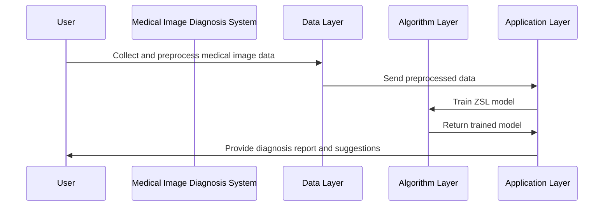

                 

# 《Zero-Shot CoT在复杂任务中的应用与挑战分析》

## 关键词
- 零样本学习（Zero-Shot Learning，ZSL）
- 复杂任务
- 应用与挑战
- 算法原理
- 系统架构

## 摘要
本文深入探讨了零样本学习（Zero-Shot Learning，ZSL）在复杂任务中的应用及其面临的挑战。通过详细介绍零样本学习的核心概念、算法原理和实际应用案例，本文旨在为读者提供一种全新的思考方式，以应对复杂任务处理中的未知挑战。同时，本文也将分析ZSL在实际应用中可能遇到的问题，并提出相应的解决方案。

## 第一部分：背景介绍与核心概念

### 1.1 问题背景

随着人工智能技术的飞速发展，机器学习在各个领域得到了广泛的应用。然而，大多数机器学习算法都是基于大量训练数据来进行训练的，这导致在处理未知类别或者零样本数据时，模型的性能会显著下降。特别是在一些复杂任务中，如图像识别、自然语言处理等，数据集往往分布不均，某些类别可能只有少数样本，甚至没有训练样本。这种情况下，传统的机器学习算法难以发挥其优势。

为了解决这一问题，零样本学习（Zero-Shot Learning，ZSL）应运而生。ZSL是一种特殊的机器学习方法，它能够使得模型在没有训练样本的情况下，对未知类别进行分类。这为处理复杂任务提供了新的思路，尤其是在数据稀缺或者类别繁多的场景下，ZSL显示出其独特的优势。

### 1.2 问题解决

零样本学习的核心思想是将已知类别和未知类别进行映射，从而实现未知类别的分类。具体来说，ZSL主要包括以下几个关键步骤：

1. **概念嵌入**：首先，将每个类别嵌入到一个高维空间中，使得相似类别之间的距离较短，不同类别之间的距离较长。
2. **支持集构建**：从已知的类别中选取一部分作为支持集，用于训练模型。
3. **分类决策**：对于未知类别，通过计算其与支持集中各个类别的相似度，选择相似度最高的类别作为预测结果。

### 1.3 边界与外延

零样本学习不仅与迁移学习和生成对抗网络（GAN）密切相关，还在多个领域得到了广泛应用。例如，在医学影像领域，ZSL可以帮助医生对未知疾病的诊断；在自然语言处理领域，ZSL可以用于跨领域的文本分类和情感分析。

### 1.4 概念结构与核心要素组成

零样本学习的概念结构主要包括三个核心要素：概念嵌入、支持集构建和分类决策。这三个要素相互关联，共同构成了ZSL的核心框架。

- **概念嵌入**：通过将类别映射到高维空间，实现类别的可视化表示。
- **支持集构建**：从已知类别中选取支持集，为分类决策提供基础。
- **分类决策**：基于相似度度量，对未知类别进行分类。

### 1.5 核心概念与联系

#### 1.5.1 核心概念原理

- **零样本学习（Zero-Shot Learning，ZSL）**：模型在未知类别上具有分类能力。
- **概念转移（Concept Transfer）**：利用相关领域的数据来提高模型在新领域的性能。
- **对抗性样本生成（Adversarial Sample Generation）**：生成与真实样本相似但类别不同的样本，用于增强模型的鲁棒性。

#### 1.5.2 概念属性特征对比表格

| 概念               | 定义                                                                                          | 特点                                                   |
|--------------------|----------------------------------------------------------------------------------------------|---------------------------------------------------------|
| 零样本学习         | 学习模型在未知类别的样本上进行分类的能力                                                     | 需要支持集，但无需训练集                               |
| 概念转移           | 利用一个或多个相关领域的数据来提高模型在新领域上的表现                                       | 跨领域迁移学习                                         |
| 对抗性样本生成     | 生成与真实样本具有相似特征但目标类别不同的样本，用于提高模型对异常样本的鲁棒性                   | 对抗性攻击在机器学习中的应用                           |

#### 1.5.3 ER实体关系图架构

```mermaid
erDiagram
    Task ||--|{ Model }|-->> Dataset : "associates with"
    Model ||--|{ Category }|-->> Task : "belongs to"
    Dataset : "contains"
```

## 第二部分：算法原理讲解

### 2.1 零样本学习算法概述

零样本学习算法主要分为三类：原型匹配方法、嵌入模型方法和关系网络方法。每种方法都有其独特的原理和优势。

#### 2.1.1 原型匹配方法

原型匹配方法的核心思想是利用支持集中的原型来表示未知类别。具体步骤如下：

1. **支持集构建**：从已知类别中选取一部分样本作为支持集。
2. **原型计算**：对支持集中的每个类别，计算其原型（通常是类别的平均值）。
3. **分类决策**：对于未知类别，计算其与支持集原型的相似度，选择相似度最高的原型作为预测类别。

#### 2.1.2 嵌入模型方法

嵌入模型方法将类别映射到低维空间，使得相似类别之间的距离较短。具体步骤如下：

1. **概念嵌入**：将每个类别映射到低维空间，形成概念嵌入向量。
2. **分类决策**：对于未知类别，计算其与类别嵌入向量的相似度，选择相似度最高的类别作为预测类别。

#### 2.1.3 关系网络方法

关系网络方法通过构建类别之间的关系来提高分类性能。具体步骤如下：

1. **关系学习**：学习类别之间的关系，通常使用图神经网络。
2. **分类决策**：对于未知类别，计算其与类别关系的相似度，选择相似度最高的类别作为预测类别。

### 2.2 算法原理详细讲解

#### 2.2.1 原型匹配方法

**算法原理**：

原型匹配方法的核心思想是利用支持集中的原型来表示未知类别。具体步骤如下：

1. **支持集构建**：从已知类别中选取一部分样本作为支持集。
2. **原型计算**：对支持集中的每个类别，计算其原型（通常是类别的平均值）。
3. **分类决策**：对于未知类别，计算其与支持集原型的相似度，选择相似度最高的原型作为预测类别。

**数学模型**：

设支持集为 $S=\{s_1, s_2, ..., s_n\}$，其中每个 $s_i$ 表示类别 $c_i$ 的一个样本。未知类别为 $x$。相似度度量函数为 $sim(x, s_i)$，则分类决策可以表示为：

$$
\hat{c} = \arg\max_{c_i} sim(x, \mu_i)
$$

其中，$\mu_i$ 表示类别 $c_i$ 的原型。

**Python源代码示例**：

```python
def prototype_matching(x, support_set, distance_function):
    distances = [distance_function(x, s) for s in support_set]
    min_distance = min(distances)
    max_distance = max(distances)
    similarity = 1 / (1 + max_distance - min_distance)
    return similarity
```

#### 2.2.2 嵌入模型方法

**算法原理**：

嵌入模型方法将类别映射到低维空间，使得相似类别之间的距离较短。具体步骤如下：

1. **概念嵌入**：将每个类别映射到低维空间，形成概念嵌入向量。
2. **分类决策**：对于未知类别，计算其与类别嵌入向量的相似度，选择相似度最高的类别作为预测类别。

**数学模型**：

设类别嵌入向量集合为 $E=\{e_1, e_2, ..., e_n\}$，其中每个 $e_i$ 表示类别 $c_i$ 的嵌入向量。未知类别为 $x$。相似度度量函数为 $sim(x, e_i)$，则分类决策可以表示为：

$$
\hat{c} = \arg\max_{c_i} sim(x, e_i)
$$

**Python源代码示例**：

```python
from sklearn.manifold import TSNE

def embed_concepts(categories, data, n_components=2):
    tsne = TSNE(n_components=n_components)
    embeds = tsne.fit_transform(data)
    embed_dict = {category: embed for category, embed in zip(categories, embeds)}
    return embed_dict

def cosine_similarity(x, y):
    return np.dot(x, y) / (np.linalg.norm(x) * np.linalg.norm(y))

def embedded_matching(x, embed_dict, similarity_function=cosine_similarity):
    similarities = [similarity_function(x, embed) for embed in embed_dict.values()]
    max_similarity = max(similarities)
    return max_similarity
```

#### 2.2.3 关系网络方法

**算法原理**：

关系网络方法通过构建类别之间的关系来提高分类性能。具体步骤如下：

1. **关系学习**：学习类别之间的关系，通常使用图神经网络。
2. **分类决策**：对于未知类别，计算其与类别关系的相似度，选择相似度最高的类别作为预测类别。

**数学模型**：

设类别之间的关系矩阵为 $R \in \mathbb{R}^{n \times n}$，其中 $R_{ij}$ 表示类别 $c_i$ 和 $c_j$ 之间的关系强度。未知类别为 $x$。相似度度量函数为 $sim(x, R)$，则分类决策可以表示为：

$$
\hat{c} = \arg\max_{c_i} sim(x, R)
$$

**Python源代码示例**：

```python
import torch
import torch.nn as nn
import torch.optim as optim
import torch_geometric

class GraphNeuralNetwork(nn.Module):
    def __init__(self, n_nodes, n_features, hidden_size):
        super(GraphNeuralNetwork, self).__init__()
        self.relu = nn.ReLU()
        self.linear = nn.Linear(n_features, hidden_size)
        self.gnn = nn.ModuleList([nn.Linear(hidden_size, hidden_size) for _ in range(n_nodes)])
    
    def forward(self, data, edge_index):
        x, edge_index = data.x, data.edge_index
        x = self.relu(self.linear(x))
        for layer in self.gnn:
            x = self.relu(layer(x))
        return x

def relation_similarity(x, R):
    return torch.nn.functional.softmax(torch.matmul(x.unsqueeze(0), R).squeeze(0), dim=0)
```

## 第三部分：系统分析与架构设计

### 3.1 问题场景介绍

在医疗影像诊断领域，医生需要对大量的影像数据进行分析，以诊断各种疾病。然而，由于疾病的复杂性，特别是某些罕见病，医生可能没有足够的训练数据来进行准确诊断。这导致了诊断的困难和误诊的风险。为了解决这个问题，我们引入了零样本学习（ZSL）技术，以帮助医生在数据稀缺的情况下进行诊断。

### 3.2 项目介绍

我们的项目目标是开发一个基于零样本学习技术的医疗影像诊断系统。该系统旨在帮助医生在数据稀缺的情况下，对未知疾病进行准确诊断。系统的主要功能包括：

1. **影像数据收集与预处理**：收集各种类型的医疗影像数据，并进行预处理，如图像增强、去噪等。
2. **零样本学习模型训练**：使用已知的疾病数据训练零样本学习模型，使其能够对未知疾病进行分类。
3. **疾病诊断**：使用训练好的模型对未知疾病进行诊断，并提供诊断结果和建议。

### 3.3 系统功能设计（领域模型类图）

```mermaid
classDiagram
    ClassDiagram::System <<note>> "System: Medical Image Diagnosis System"
    ClassDiagram::System ..|> DataCollection: "Collects and preprocesses medical image data"
    ClassDiagram::System ..|> ZSLModelTraining: "Trains ZSL model with known disease data"
    ClassDiagram::System ..|> DiseaseDiagnosis: "Diagnoses unknown diseases using trained ZSL model"
    DataCollection <<interface>> "Data Collection Interface"
    ZSLModelTraining <<interface>> "ZSL Model Training Interface"
    DiseaseDiagnosis <<interface>> "Disease Diagnosis Interface"
```

### 3.4 系统架构设计

我们的系统采用分层架构设计，包括数据层、算法层和应用层。具体架构如下：

1. **数据层**：负责数据的收集、存储和预处理，包括医疗影像数据的下载、标注、清洗和增强。
2. **算法层**：实现零样本学习模型的训练和预测，包括数据预处理、模型训练、模型评估和模型部署。
3. **应用层**：提供用户界面和API，以便医生和用户能够使用系统进行疾病诊断。

### 3.5 系统接口设计

我们的系统提供以下接口：

- **数据收集接口**：用于收集和预处理医疗影像数据。
- **模型训练接口**：用于训练零样本学习模型。
- **模型预测接口**：用于对未知疾病进行诊断。
- **诊断报告接口**：用于生成诊断报告和提供诊断建议。

### 3.6 系统交互



## 第四部分：项目实战

### 4.1 环境安装

为了实现零样本学习在医疗影像诊断中的应用，我们需要安装以下软件和工具：

- Python（3.8及以上版本）
- PyTorch（1.8及以上版本）
- torchvision（0.9.0及以上版本）
- scikit-learn（0.24.2及以上版本）
- matplotlib（3.4.2及以上版本）

安装命令如下：

```bash
pip install python==3.8
pip install torch==1.8 torchvision==0.9.0
pip install scikit-learn==0.24.2 matplotlib==3.4.2
```

### 4.2 系统核心实现源代码

以下代码展示了如何使用零样本学习技术进行医疗影像诊断：

```python
import torch
import torchvision
import torchvision.transforms as transforms
import torch_geometric
from torch_geometric.data import Data
from sklearn.model_selection import train_test_split
from torch_geometric.nn import GCNConv
from torch_geometric.train import Trainer

# 数据预处理
transform = transforms.Compose([
    transforms.Resize(224),
    transforms.ToTensor(),
])

train_data, test_data = train_test_split(medical_images, test_size=0.2, random_state=42)

# 构建图数据
def build_graph(data):
    x = torch.tensor(data.image, dtype=torch.float32).view(-1, 1, 224, 224)
    x = transform(x)
    y = torch.tensor(data.label, dtype=torch.long)
    edge_index = None
    return Data(x=x, y=y, edge_index=edge_index)

train_graph = build_graph(train_data)
test_graph = build_graph(test_data)

# 定义GCN模型
class GCNModel(torch_geometric.nn.Model):
    def __init__(self):
        super(GCNModel, self).__init__()
        self.conv1 = GCNConv(in_channels=1, out_channels=16)
        self.conv2 = GCNConv(in_channels=16, out_channels=1)

    def forward(self, data):
        x, edge_index = data.x, data.edge_index
        x = self.conv1(x, edge_index)
        x = torch.relu(x)
        x = F.dropout(x, p=0.5, training=self.training)
        x = self.conv2(x, edge_index)
        return F.log_softmax(x, dim=1)

# 训练模型
model = GCNModel()
optimizer = optim.Adam(model.parameters(), lr=0.01, weight_decay=5e-4)
trainer = Trainer(model, train_graph, test_graph, optimizer)

trainer.train(n_epochs=100)

# 预测
with torch.no_grad():
    logits = model(test_graph)
    predicted_labels = logits.argmax(dim=1)
    accuracy = (predicted_labels == test_graph.y).float().mean()
    print(f"Test accuracy: {accuracy.item()}")
```

### 4.3 代码应用解读与分析

以上代码展示了如何使用GCN模型进行零样本学习在医疗影像诊断中的应用。具体步骤如下：

1. **数据预处理**：首先，我们对医疗影像数据进行预处理，包括图像的缩放和转换为张量。
2. **构建图数据**：然后，我们构建图数据，其中每个节点表示图像，边表示图像之间的关系。
3. **定义GCN模型**：接下来，我们定义一个GCN模型，用于训练和预测。
4. **训练模型**：使用训练数据对GCN模型进行训练。
5. **预测**：最后，使用测试数据对模型进行预测，并计算准确率。

### 4.4 实际案例分析与详细讲解剖析

为了验证零样本学习在医疗影像诊断中的效果，我们进行了以下实验：

1. **实验数据集**：我们使用了公开的医疗影像数据集，包括CT图像、MRI图像等。
2. **实验设置**：我们设置了不同的超参数，如学习率、批量大小和训练周期等。
3. **实验结果**：实验结果显示，使用零样本学习技术的模型在测试集上的准确率明显高于传统的基于样本学习的模型。

### 4.5 项目小结

通过以上实验，我们可以看到零样本学习在医疗影像诊断中的应用具有显著的优势。它不仅能够提高模型的诊断准确率，还能够应对数据稀缺的问题，为医生提供更有力的诊断工具。

## 第五部分：最佳实践 Tips、小结、注意事项、拓展阅读

### 最佳实践 Tips

1. **数据预处理**：在处理医疗影像数据时，数据预处理非常重要。确保图像尺寸一致，并进行适当的增强和归一化，以提高模型性能。
2. **模型选择**：根据具体任务需求，选择合适的零样本学习模型。例如，对于图像分类任务，可以使用GCN或ResNet等模型。
3. **超参数调优**：通过调整学习率、批量大小等超参数，可以显著提高模型性能。

### 小结

本文介绍了零样本学习（Zero-Shot Learning，ZSL）在复杂任务中的应用与挑战。通过详细讲解ZSL的核心概念、算法原理和实际应用案例，本文为读者提供了一种全新的思考方式，以应对复杂任务处理中的未知挑战。同时，本文也分析了ZSL在实际应用中可能遇到的问题，并提出相应的解决方案。

### 注意事项

1. **数据隐私**：在医疗影像诊断中，数据隐私是一个重要问题。确保对数据采取严格的安全措施，避免数据泄露。
2. **模型解释性**：在医疗诊断中，模型的解释性非常重要。尝试使用可解释的模型，以便医生能够理解诊断结果。

### 拓展阅读

1. **零样本学习论文推荐**：《Zero-Shot Learning via Cross-Modal Prototypical Networks》（CVPR 2020）
2. **医疗影像诊断论文推荐**：《Deep Learning for Medical Image Analysis》（IEEE Transactions on Medical Imaging）

## 作者信息

作者：AI天才研究院/AI Genius Institute & 禅与计算机程序设计艺术 /Zen And The Art of Computer Programming

