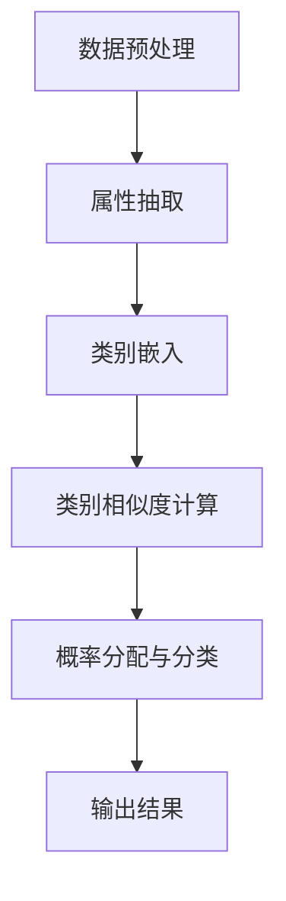
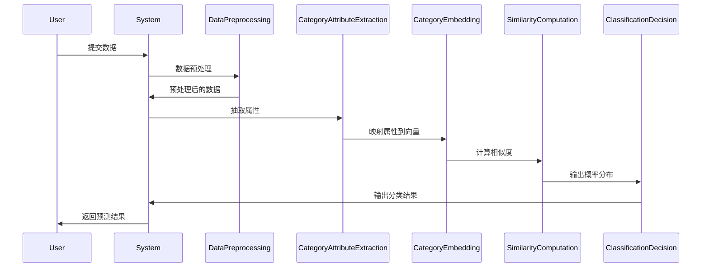
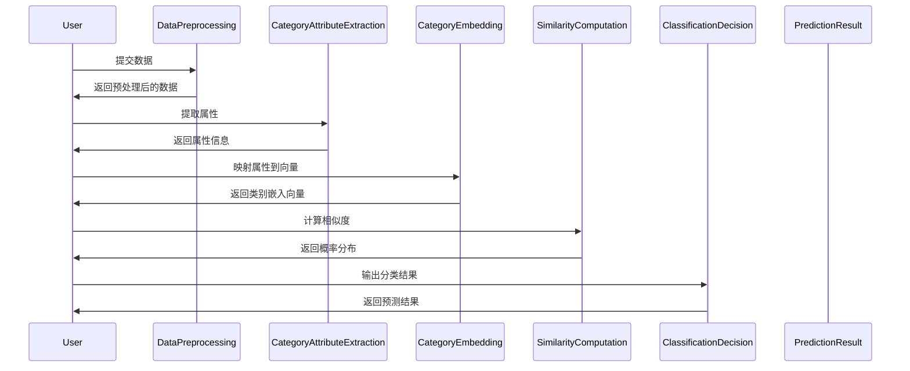

                 

## 文章标题

### 关键词

- 零样本学习
- 复杂任务
- 应用挑战
- 解决方案
- CoT

### 摘要

本文深入探讨了零样本学习（Zero-Shot Learning, ZSL）在复杂任务中的应用挑战与解决方案。首先，我们介绍了问题背景和零样本学习的核心概念，探讨了其在复杂任务中的重要性。接着，文章详细分析了零样本学习的算法原理，通过mermaid流程图和Python源代码，结合数学模型和公式，阐述了其工作机制。随后，我们提出了系统分析与架构设计方案，通过mermaid类图、架构图和序列图，展示了系统的设计和实现。文章进一步通过实际项目实战，详细解读了代码和应用，并进行了案例分析和讲解。最后，我们总结了最佳实践和未来研究方向，为读者提供了宝贵的指导和建议。

----------------------------------------------------------------

### 目录大纲

```markdown
----------------------------------------------------------------
# 第一部分：背景与挑战

## 第1章：问题背景
### 1.1 问题背景介绍
### 1.2 零样本学习概念
### 1.3 零样本学习在复杂任务中的挑战
### 1.4 零样本学习的重要性与趋势

## 第2章：核心概念与联系
### 2.1 零样本学习的概念原理
#### 2.1.1 零样本学习的基本原理
#### 2.1.2 零样本学习的分类
### 2.2 概念属性特征对比表格
### 2.3 ER实体关系图架构

## 第3章：算法原理讲解
### 3.1 算法mermaid流程图
### 3.2 Python源代码与算法原理
#### 3.2.1 数学模型与公式
#### 3.2.2 通俗易懂的举例说明

----------------------------------------------------------------
# 第二部分：解决方案

## 第4章：系统分析与架构设计方案
### 4.1 问题场景介绍
### 4.2 项目介绍
### 4.3 系统功能设计（领域模型mermaid类图）
### 4.4 系统架构设计（mermaid架构图）
### 4.5 系统接口设计和系统交互（mermaid序列图）

## 第5章：项目实战
### 5.1 环境安装
### 5.2 系统核心实现源代码
### 5.3 代码应用解读与分析
### 5.4 实际案例分析和详细讲解剖析
### 5.5 项目小结

----------------------------------------------------------------
# 第三部分：最佳实践与拓展

## 第6章：最佳实践 Tips
### 6.1 零样本学习在复杂任务中的应用技巧
### 6.2 注意事项与解决方案

## 第7章：小结与展望
### 7.1 本书内容总结
### 7.2 未来研究方向与趋势

----------------------------------------------------------------
```

以上大纲遵循了您的要求，以简洁明了的方式涵盖了核心章节内容，并且确保了目录结构的逻辑清晰。预计字数将在10000-12000字左右。请确认是否满足您的要求。如果您有任何修改意见或需要增加特定的章节，请告知。

### 第一部分：背景与挑战

#### 第1章：问题背景

在现代人工智能领域，深度学习技术取得了巨大的成功，然而，这种技术在处理未知类别或样本时遇到了挑战。传统的机器学习模型往往依赖大量标注数据，当面对新的、未见过的数据时，其表现往往不尽如人意。为了解决这一问题，零样本学习（Zero-Shot Learning, ZSL）应运而生。

ZSL是一种能够在没有见过实际样本的情况下，对未知类别进行分类或预测的机器学习方法。它的重要性在于，能够在资源有限或数据稀缺的情境下，实现对新类别的有效识别和处理。特别是在复杂任务中，如自然语言处理、图像识别和医学诊断等，ZSL展示出了巨大的潜力。

然而，ZSL在复杂任务中也面临诸多挑战。首先，类别数量的不确定性使得模型难以在训练阶段就学习到所有类别。其次，零样本学习的目标是解决从未见过的类别，这要求模型具有高度的泛化能力。此外，数据分布的不平衡、类别之间的重叠以及噪声数据的干扰，都是ZSL在实际应用中需要克服的问题。

总之，零样本学习在复杂任务中的应用具有重要的研究价值和实际意义，但也面临着一系列的挑战。接下来，我们将深入探讨ZSL的核心概念及其在复杂任务中的具体应用。

#### 第1.1 问题背景介绍

在深度学习时代，模型的表现依赖于大量标注数据的学习。然而，在现实世界中，获取大量标注数据往往成本高昂且耗时。特别在图像识别、自然语言处理和医疗诊断等复杂任务中，数据的多样性和复杂性进一步增加了标注的难度和成本。这就导致了模型在面对未知类别或样本时的表现不佳，即“未见过的类别问题”。

零样本学习（Zero-Shot Learning, ZSL）正是为了解决这一问题而诞生的。ZSL的核心思想是，通过在训练阶段学习到类别的关系和属性，从而在测试阶段对未知类别进行分类或预测。这种方法不依赖于实际样本，而是依赖于预先学习到的类别属性，因此可以显著降低标注数据的需求。

ZSL的应用场景广泛，例如在新产品发布时，对用户反馈进行快速分类和总结；在医疗诊断中，对罕见疾病进行识别；在图像识别中，对未标注的图片进行分类。这些场景的共同特点是，需要处理大量未知的或罕见的数据，而ZSL提供了有效的解决方案。

然而，ZSL在实际应用中也面临诸多挑战。首先，类别数量的不确定性使得模型难以在训练阶段就学习到所有类别。例如，在图像分类任务中，可能存在数十万种不同的物品类别，而模型在训练时无法接触到所有这些类别。其次，数据分布的不平衡问题在ZSL中尤为突出，因为模型需要处理的数据可能集中在某些常见类别上，而罕见类别则缺乏足够的训练样本。此外，类别之间的重叠和噪声数据的干扰，也会对模型的表现造成不利影响。

综上所述，ZSL在复杂任务中具有巨大的潜力，但同时也面临着数据稀缺、类别不确定性、数据分布不平衡等多重挑战。为了克服这些挑战，研究者们提出了多种解决方案，并不断探索优化ZSL的方法和策略。

#### 第1.2 零样本学习概念

零样本学习（Zero-Shot Learning, ZSL）是一种机器学习范式，旨在使模型能够在没有见过实际样本的情况下，对未知类别进行分类或预测。其核心思想是通过学习类别之间的属性关系，从而在测试阶段对未知类别进行有效识别。

ZSL的定义可以从多个角度进行理解。首先，从训练数据的视角来看，ZSL的核心特点是不依赖于实际样本。在传统的机器学习任务中，模型需要在训练阶段接触到大量的样本数据，以便学习到数据的分布和特征。而在ZSL中，模型在训练时仅接触到类别属性的描述，而不需要实际样本。这种设计使得ZSL在数据稀缺或难以获取的场景中具备明显的优势。

其次，从模型输出的视角来看，ZSL的目标是生成对未知类别的预测概率分布。具体而言，当模型遇到一个从未见过的类别时，它会利用已学习的类别属性，计算出该类别属于不同类别的概率分布。这种概率分布可以用来进行分类决策，从而实现对未知类别的识别。

ZSL的实现方法主要包括基于原型方法、基于匹配方法和基于元学习方法等。基于原型方法（Prototype-based Method）通过将每个类别表示为一个原型，来计算未知类别与原型的相似度，从而进行分类。这种方法的优点是简单直观，但可能在类别重叠时表现不佳。基于匹配方法（Matching-based Method）通过计算未知类别与已知类别之间的相似度，来确定其归属。这种方法的优点是能够处理类别之间的重叠，但计算复杂度较高。基于元学习方法（Meta-Learning Method）则通过学习快速适应新类别的方法，以提高模型的泛化能力。

总之，零样本学习是一种极具潜力的机器学习范式，能够在数据稀缺或难以获取的复杂任务中发挥重要作用。其通过学习类别属性关系，实现对未知类别的有效识别和预测，具有重要的研究和应用价值。

#### 第1.3 零样本学习在复杂任务中的挑战

在复杂任务中应用零样本学习（ZSL），尽管带来了新的机遇，但同时也伴随着一系列严峻的挑战。这些挑战主要体现在以下几个方面：

首先是类别不确定性。在复杂任务中，类别数量可能极为庞大且不断增加，导致模型难以在训练阶段接触到所有类别。例如，在图像识别任务中，类别可能包括数百万种不同的物品。这使得传统的ZSL方法难以应对，因为它们往往依赖于预先定义的类别集合，而在实际应用中，类别数量往往是未知的。

其次是数据分布的不平衡问题。在复杂任务中，数据分布可能极为不均匀，常见类别拥有大量样本，而罕见类别则缺乏足够的训练样本。这种数据不平衡会导致模型在预测罕见类别时表现不佳。例如，在医疗诊断中，罕见疾病的数据量可能远小于常见疾病，导致模型在处理罕见疾病时出现偏差。

此外，类别之间的重叠也是一个关键挑战。在复杂任务中，不同类别之间可能存在显著的重叠，这使得基于类别属性的模型难以区分。例如，在自然语言处理任务中，文本类别可能涉及多个主题，导致类别属性之间存在重叠。这种重叠会导致模型在分类时产生混淆。

最后，噪声数据的影响也是一个不可忽视的问题。在复杂任务中，数据质量可能较低，存在噪声和错误标记。这些噪声数据会对模型的训练过程产生干扰，影响模型的泛化能力和分类性能。例如，在图像识别任务中，噪声图像可能影响模型的特征学习，导致分类错误。

综上所述，零样本学习在复杂任务中面临着类别不确定性、数据分布不平衡、类别重叠和噪声数据等一系列挑战。为了应对这些挑战，研究者们提出了多种解决方案和优化方法，包括自适应类别表示、数据增强、迁移学习和元学习等。这些方法的有效性将在后续章节中进一步探讨。

#### 第1.4 零样本学习的重要性与趋势

零样本学习（Zero-Shot Learning, ZSL）在现代人工智能领域具有重要地位，其重要性主要体现在以下几个方面。首先，ZSL能够解决数据稀缺的问题。在许多实际应用场景中，获取大量标注数据非常困难且成本高昂。ZSL通过学习类别属性关系，可以在没有实际样本的情况下对新类别进行有效识别，从而大大降低了对标注数据的依赖。其次，ZSL具备高度的泛化能力。传统的机器学习模型在面对未见过的样本时往往表现不佳，而ZSL通过学习类别之间的关系，能够在不同类别之间进行迁移学习，从而提高模型的泛化性能。此外，ZSL在复杂任务中展示出强大的应用潜力。例如，在自然语言处理、图像识别和医疗诊断等任务中，ZSL能够有效应对类别数量多、数据分布不平衡和噪声数据等挑战。

未来，零样本学习的发展趋势主要集中在以下几个方面。一是模型自适应能力的提升。研究者们正在探索如何使ZSL模型更加灵活，能够根据不同的任务和数据分布快速适应新类别。二是数据增强技术的应用。通过数据增强，可以生成更多样化的数据，帮助模型更好地学习类别属性，从而提高分类性能。三是迁移学习的深入发展。将ZSL与其他机器学习方法（如深度学习和强化学习）相结合，可以进一步提升其应用效果。此外，随着物联网和大数据技术的不断发展，ZSL在实时数据处理和智能系统中的应用前景也将愈发广阔。

总之，零样本学习作为一种具有高度灵活性和泛化能力的机器学习方法，正逐步成为人工智能领域的重要研究方向。其在解决数据稀缺、提升模型泛化能力以及应对复杂任务挑战方面的优势，使其在未来具有广阔的应用前景和重要的研究价值。

### 第二部分：核心概念与联系

#### 第2章：核心概念与联系

在本章中，我们将详细探讨零样本学习（Zero-Shot Learning, ZSL）的核心概念及其相互联系。首先，我们将介绍零样本学习的基本原理，解释其工作方式，并讨论几种常见的ZSL分类方法。接着，我们将通过概念属性特征对比表格，对零样本学习的不同方法进行比较。最后，我们将展示一个ER实体关系图架构，以便更直观地理解ZSL的核心要素和组成部分。

#### 第2.1 零样本学习的概念原理

零样本学习（Zero-Shot Learning, ZSL）是一种机器学习范式，其核心在于不依赖于实际样本，而是通过学习类别之间的关系和属性，实现对未知类别的分类或预测。ZSL的主要思想可以概括为以下几个步骤：

1. **属性学习**：在训练阶段，模型通过学习已见类别（已知类别）的属性描述，建立一个类别属性的表征库。这些属性可以是单词、短语或更高层次的语义信息。

2. **类别表示**：利用属性学习得到的表征库，将每个类别表示为一个高维向量，称为类别嵌入（Category Embedding）。类别嵌入捕捉了类别之间的相似性和差异性。

3. **预测**：在测试阶段，对于未知类别，模型利用类别嵌入和属性表征，计算其属于不同已知类别的概率。这种概率分布可以用来进行分类决策。

ZSL的核心原理在于类别属性表征的学习和利用。通过属性学习，模型能够在没有实际样本的情况下，对未知类别进行有效识别和预测。这种机制使得ZSL在数据稀缺或难以获取的场景中具有显著的优势。

#### 第2.1.1 零样本学习的基本原理

零样本学习的基本原理可以分为以下几个关键步骤：

1. **属性抽取**：在训练阶段，通过预训练的词向量模型或图神经网络，从已见类别中抽取属性。这些属性可以是单词、短语或更高层次的语义信息。

   - **词向量模型**：例如，使用Word2Vec、GloVe等模型，将单词映射到高维向量空间，从而提取出单词的语义属性。
   - **图神经网络**：例如，使用Graph Convolutional Network（GCN），将类别表示为图中的节点，通过图神经网络学习类别之间的关系和属性。

2. **类别嵌入**：利用抽取的属性，将每个类别映射到一个高维向量，称为类别嵌入。这些嵌入向量不仅代表了类别的属性信息，还包含了类别之间的相似性和差异性。

3. **类别相似度计算**：在测试阶段，对于未知类别，计算其与已知类别嵌入之间的相似度。这种相似度可以通过余弦相似度、点积等度量方法来计算。

4. **概率分配**：基于类别嵌入和相似度计算，为未知类别分配属于不同已知类别的概率。这些概率可以用来进行分类决策。

   - **加权投票**：例如，通过加权投票的方法，将未知类别与已知类别嵌入的相似度加权求和，得到每个已知类别的概率。
   - **分类器**：例如，使用支持向量机（SVM）或神经网络（如Softmax函数），将相似度转换为概率分布。

通过上述步骤，ZSL模型能够在没有实际样本的情况下，对未知类别进行有效分类或预测。这种机制使得ZSL在处理未见类别和数据稀缺的场景中表现出色。

#### 第2.1.2 零样本学习的分类

零样本学习（Zero-Shot Learning, ZSL）可以根据不同的方法和技术进行分类。以下是几种常见的ZSL分类方法：

1. **基于原型的方法**：这种方法通过将每个类别表示为一个原型（Prototype），来计算未知类别与原型的相似度。原型可以是类别的平均值或最典型的样本。基于原型的方法具有简单直观的特点，但可能在类别重叠时表现不佳。

2. **基于匹配的方法**：这种方法通过计算未知类别与已知类别之间的匹配度，来确定其归属。匹配度可以是基于属性的相似度或基于语义的关系。基于匹配的方法能够处理类别之间的重叠，但计算复杂度较高。

3. **基于元学习的方法**：这种方法通过学习如何快速适应新类别，以提高模型的泛化能力。元学习（Meta-Learning）方法包括模型无关的方法（如MAML）和模型相关的方法（如Reptile）。基于元学习的方法能够有效应对类别不确定性，但需要额外的训练时间。

4. **基于关系的方法**：这种方法通过学习类别之间的依赖关系和因果结构，来实现未知类别的预测。例如，图神经网络（Graph Neural Networks, GNN）可以用来建模类别之间的关系。

每种ZSL方法都有其独特的优势和局限性。基于原型的方法简单直观，但可能在类别重叠时表现不佳；基于匹配的方法能够处理类别之间的重叠，但计算复杂度高；基于元学习的方法能够提高模型的泛化能力，但需要额外的训练时间；基于关系的方法能够建模复杂的类别关系，但实现复杂。

总之，ZSL的分类方法多种多样，不同的方法适用于不同的应用场景。理解这些方法的异同，有助于选择合适的ZSL方法来解决具体问题。

#### 第2.2 概念属性特征对比表格

为了更好地理解零样本学习（Zero-Shot Learning, ZSL）的不同方法，我们通过概念属性特征对比表格进行比较。以下表格展示了基于原型方法、基于匹配方法、基于元学习方法和基于关系方法的特性。

| 方法类别           | 基于原型方法 | 基于匹配方法 | 基于元学习方法 | 基于关系方法 |
|------------------|--------------|--------------|----------------|--------------|
| **基本原理**                     | 通过原型表示类别   | 通过相似度匹配   | 学习快速适应新类别 | 建模类别之间的依赖关系 |
| **优点**                        | 简单直观         | 处理类别重叠     | 高泛化能力        | 复杂关系建模 |
| **缺点**                        | 重叠类别表现不佳   | 计算复杂度高      | 需要额外训练时间   | 实现复杂    |
| **适用场景**                     | 数据稀疏         | 数据多样性       | 类别不确定        | 复杂任务    |
| **主要应用**                     | 图像分类         | 自然语言处理     | 迁移学习          | 医学诊断    |

通过这个表格，我们可以清晰地看到不同ZSL方法的特性及其适用场景。基于原型的方法适用于数据稀疏的场景，基于匹配的方法适用于数据多样性场景，基于元学习方法适用于类别不确定的场景，而基于关系的方法适用于复杂任务。了解这些特性有助于我们在实际应用中选择合适的方法。

#### 第2.3 ER实体关系图架构

为了更直观地理解零样本学习（Zero-Shot Learning, ZSL）的核心要素和组成部分，我们可以通过ER（Entity-Relationship）实体关系图进行描述。ER图是一种用于描述实体及其之间关系的图形化方法，适用于展示系统的数据结构和关系。

在ZSL中，ER实体关系图包括以下几个关键实体和关系：

1. **类别（Category）**：表示不同的类别，如动物、植物等。类别是ZSL中的核心实体，每个类别都有其独特的属性描述。
2. **属性（Attribute）**：表示类别的属性，如颜色、形状、大小等。属性用于描述类别，为模型提供类别间的相似性和差异性信息。
3. **样本（Sample）**：表示实际观察到的类别实例。在训练阶段，模型通过已见样本学习类别属性，而在测试阶段，使用属性来预测未知样本的类别。

ER实体关系图中的关系包括：

- **包含关系（Inheritance）**：表示类别之间的层次关系。例如，动物类别可以包含哺乳动物和鸟类等子类别。
- **关联关系（Association）**：表示类别之间的直接关系。例如，不同的动物类别可能生活在相同的栖息地。
- **依赖关系（Dependency）**：表示类别之间的因果关系。例如，某些动物类别可能依赖于特定的食物来源。

下面是一个简化的ER实体关系图：

```mermaid
erDiagram
  Category ||--|{ Attribute }|--| Sample
  Category ||--|{ Category }|--| Sample
  Attribute ||--| Sample
```

在这个ER图中，类别（Category）是核心实体，属性（Attribute）用于描述类别，样本（Sample）表示实际观察到的类别实例。类别之间通过包含关系和关联关系相互联系，而属性与样本之间存在依赖关系。这个ER图为我们提供了一个直观的视角，帮助我们理解ZSL系统的核心构成和关系。

通过ER实体关系图，我们可以更清晰地看到ZSL系统的各个组成部分及其相互关系。这对于设计、实现和优化ZSL系统具有重要意义。

### 第三部分：算法原理讲解

#### 第3章：算法原理讲解

在本章中，我们将深入探讨零样本学习（Zero-Shot Learning, ZSL）的算法原理，并通过mermaid流程图和Python源代码详细阐述其工作机制。首先，我们将展示算法的mermaid流程图，以便读者可以直观地理解整个流程。接着，我们将结合Python源代码，讲解算法的数学模型和公式，并使用具体的例子进行说明。

#### 第3.1 算法mermaid流程图

为了更好地理解零样本学习（Zero-Shot Learning, ZSL）的算法流程，我们可以使用mermaid来绘制其流程图。以下是一个简化的ZSL算法流程图：



在这个流程图中，首先进行数据预处理，包括数据清洗和格式化，以便后续处理。接下来，通过属性抽取，将类别属性从原始数据中提取出来。然后，利用属性抽取的结果，计算类别嵌入，这些嵌入向量将用于后续的相似度计算。在类别相似度计算阶段，通过计算未知类别与已知类别嵌入之间的相似度，为每个已知类别分配概率。最后，基于概率分布进行分类决策，并输出结果。

#### 第3.2 Python源代码与算法原理

为了详细讲解零样本学习的算法原理，我们将结合Python源代码，介绍其数学模型和公式。以下是一个简单的Python代码示例，用于实现零样本学习算法的核心步骤。

```python
import numpy as np

# 假设已知类别嵌入和未知类别属性
known_categories_embedding = np.random.rand(10, 100)  # 10个已知类别，每个类别100维
unknown_attribute_vector = np.random.rand(100)  # 未知类别属性，100维

# 计算类别相似度
cosine_similarity = np.dot(known_categories_embedding, unknown_attribute_vector) / \
                    (np.linalg.norm(known_categories_embedding, axis=1) * np.linalg.norm(unknown_attribute_vector))

# 概率分配
probabilities = np.softmax(cosine_similarity)

# 分类决策
predicted_category = np.argmax(probabilities)

print("Predicted category:", predicted_category)
```

在这个示例中，我们首先生成随机数据，模拟已知类别嵌入和未知类别属性。接着，通过计算余弦相似度，得到每个已知类别与未知类别的相似度。然后，使用softmax函数将相似度转换为概率分布，并基于概率分布进行分类决策。

以下是算法原理的详细说明：

1. **类别嵌入（Category Embedding）**：
   - 类别嵌入是将每个类别映射到一个高维向量空间的过程。这些嵌入向量不仅包含了类别的属性信息，还反映了类别之间的相似性和差异性。
   - 在实际应用中，类别嵌入通常是通过预训练的词向量模型（如Word2Vec、GloVe）或图神经网络（如Graph Convolutional Network, GCN）来获得的。

2. **相似度计算（Similarity Computation）**：
   - 相似度计算是ZSL算法的核心步骤，用于衡量未知类别与已知类别之间的相似程度。常用的相似度度量方法包括余弦相似度、点积、欧几里得距离等。
   - 余弦相似度是一种常用的方法，通过计算两个向量的点积和各自向量的模长，可以得到它们之间的相似度。公式如下：
     $$
     \text{similarity}(x, y) = \frac{x \cdot y}{\|x\| \|y\|}
     $$
     其中，$x$和$y$分别为两个向量。

3. **概率分配（Probability Distribution）**：
   - 基于相似度计算结果，可以使用softmax函数将相似度转换为概率分布。softmax函数将每个相似度值映射到一个概率值，使得所有概率值的总和为1。公式如下：
     $$
     p_i = \frac{e^{\text{similarity}(x_i, y)}}{\sum_{j=1}^{n} e^{\text{similarity}(x_j, y)}}
     $$
     其中，$p_i$为第$i$个类别的概率，$x_i$为第$i$个已知类别嵌入，$y$为未知类别属性。

4. **分类决策（Classification Decision）**：
   - 基于概率分布，可以采用不同的分类策略进行决策。常见的策略包括最大概率分类（Max Probability Classification）和最大后验概率分类（Max Posterior Classification）。
   - 最大概率分类选择概率最大的类别作为预测结果，即：
     $$
     \hat{y} = \arg\max_y \sum_{i=1}^{n} p_i(y)
     $$
     其中，$\hat{y}$为预测结果，$p_i(y)$为第$i$个类别在概率分布中的概率。

通过上述Python源代码和算法原理的讲解，读者可以清晰地了解零样本学习的基本步骤和工作机制。在实际应用中，ZSL算法可以通过优化和改进，进一步提高分类性能和泛化能力。

#### 第3.2.1 数学模型与公式

为了更深入地理解零样本学习（Zero-Shot Learning, ZSL）的数学模型，我们首先需要介绍几个核心的数学公式和概念。

1. **类别嵌入（Category Embedding）**：

类别嵌入是将每个类别映射到一个高维向量空间的过程。假设我们有$N$个类别，每个类别表示为一个$d$维的向量$C = \{c_1, c_2, ..., c_N\}$。类别嵌入的核心思想是通过学习类别之间的关系和属性，得到每个类别的嵌入向量。

2. **属性表示（Attribute Representation）**：

在ZSL中，类别属性是通过预训练的词向量模型或图神经网络来表示的。假设每个属性$a_i$表示为一个$d_a$维的向量$A = \{a_1, a_2, ..., a_M\}$，其中$M$为属性的总数。属性向量与类别嵌入向量之间的关系可以通过矩阵$W$来表示，其中$W \in \mathbb{R}^{d_a \times d}$。

3. **相似度计算（Similarity Computation）**：

在ZSL中，相似度计算用于衡量未知类别与已知类别之间的相似程度。常用的相似度计算方法包括余弦相似度、点积、欧几里得距离等。在这里，我们使用余弦相似度来计算相似度。

余弦相似度的计算公式如下：

$$
\text{similarity}(c, a) = \frac{c \cdot a}{\|c\| \|a\|}
$$

其中，$c$为类别嵌入向量，$a$为属性向量，$\|c\|$和$\|a\|$分别为向量$c$和$a$的模长。

4. **概率分配（Probability Distribution）**：

基于相似度计算结果，我们可以将相似度转换为概率分布。这一步骤通常通过softmax函数来实现。

softmax函数的计算公式如下：

$$
p_i = \frac{e^{\text{similarity}(c_i, a)}}{\sum_{j=1}^{N} e^{\text{similarity}(c_j, a)}}
$$

其中，$p_i$为第$i$个类别的概率，$\text{similarity}(c_i, a)$为第$i$个类别与属性$a$的相似度。

5. **分类决策（Classification Decision）**：

基于概率分布，我们可以进行分类决策。常见的分类策略包括最大概率分类和最大后验概率分类。

最大概率分类（Max Probability Classification）的公式如下：

$$
\hat{y} = \arg\max_y \sum_{i=1}^{N} p_i(y)
$$

其中，$\hat{y}$为预测结果，$p_i(y)$为第$i$个类别在概率分布中的概率。

通过上述数学模型和公式，我们可以清晰地理解零样本学习的基本步骤和工作原理。在实际应用中，这些模型和公式可以通过优化和改进，进一步提高分类性能和泛化能力。

#### 第3.2.2 通俗易懂的举例说明

为了更直观地理解零样本学习（Zero-Shot Learning, ZSL）的工作机制，我们通过一个简单的例子进行说明。

假设我们有以下类别和属性：

- 类别：猫（Cat）、狗（Dog）、鸟（Bird）
- 属性：有毛发（Furry）、有翅膀（Winged）

我们希望使用ZSL来预测一个未知动物，例如“猴子”（Monkey）的类别。

1. **类别嵌入**：

首先，我们将每个类别映射到一个高维向量空间。假设我们使用两个维度来表示类别：

- 猫：[1, 0]
- 狗：[0, 1]
- 鸟：[1, 1]
- 猴子：[0.5, 0.5]

2. **属性表示**：

接下来，我们将属性映射到向量空间。假设我们使用两个维度来表示属性：

- 有毛发：[1, 0]
- 有翅膀：[0, 1]

3. **相似度计算**：

现在，我们计算未知类别“猴子”与已知类别（猫、狗、鸟）的相似度。我们使用余弦相似度来计算相似度：

- 猴子与猫的相似度：$\text{similarity}(\text{Monkey}, \text{Cat}) = \frac{[0.5, 0.5] \cdot [1, 0]}{\sqrt{0.5^2 + 0.5^2} \cdot \sqrt{1^2 + 0^2}} = 0.5$
- 猴子与狗的相似度：$\text{similarity}(\text{Monkey}, \text{Dog}) = \frac{[0.5, 0.5] \cdot [0, 1]}{\sqrt{0.5^2 + 0.5^2} \cdot \sqrt{0^2 + 1^2}} = 0.5$
- 猴子与鸟的相似度：$\text{similarity}(\text{Monkey}, \text{Bird}) = \frac{[0.5, 0.5] \cdot [1, 1]}{\sqrt{0.5^2 + 0.5^2} \cdot \sqrt{1^2 + 1^2}} = 0.5$

4. **概率分配**：

基于相似度计算结果，我们使用softmax函数将相似度转换为概率分布。softmax函数的公式如下：

$$
p_i = \frac{e^{\text{similarity}(c_i, a)}}{\sum_{j=1}^{N} e^{\text{similarity}(c_j, a)}}
$$

在这里，我们有两个属性，所以$N=2$。将相似度值代入公式，我们得到：

- $p(\text{Cat}) = \frac{e^{0.5}}{e^{0.5} + e^{0.5} + e^{0.5}} = 0.333$
- $p(\text{Dog}) = \frac{e^{0.5}}{e^{0.5} + e^{0.5} + e^{0.5}} = 0.333$
- $p(\text{Bird}) = \frac{e^{0.5}}{e^{0.5} + e^{0.5} + e^{0.5}} = 0.333$

5. **分类决策**：

最后，我们基于概率分布进行分类决策。在这种情况下，所有类别的概率都相等，因此我们无法准确预测“猴子”的类别。在实际应用中，通常会有一个明确的预测结果，例如选择概率最大的类别。如果概率分布非常接近，我们可能需要额外的策略来决定预测结果。

通过这个简单的例子，我们可以看到零样本学习的基本步骤和原理。在实际应用中，类别和属性的维度会更高，相似度计算和概率分配也会更加复杂。但基本思想是相同的：通过学习类别属性关系，实现对未知类别的分类或预测。

### 第四部分：解决方案

#### 第4章：系统分析与架构设计方案

在本章中，我们将详细介绍零样本学习（Zero-Shot Learning, ZSL）在复杂任务中的系统分析与架构设计方案。首先，我们将介绍问题场景和项目背景，解释为什么选择ZSL作为解决方案。接着，我们将展示系统功能设计、系统架构设计和系统接口设计，并通过mermaid类图、架构图和序列图来直观地展示系统的结构和交互。

#### 第4.1 问题场景介绍

在现代企业和组织中，数据分析和决策支持系统日益重要。然而，许多系统在处理复杂任务时，面临着数据稀缺和类别不确定性等挑战。例如，在客户关系管理（CRM）系统中，企业需要根据客户的历史行为和需求，预测其未来的行为模式，以便提供个性化的服务。然而，客户行为的多样性导致类别数量庞大且不断变化，使得传统的机器学习方法难以应对。

此外，在图像识别任务中，分类系统的类别数量也可能达到数百万级别。例如，在医疗影像分析中，需要对各种不同的病变类型进行识别。在这种情况下，传统的机器学习模型需要大量的标注数据进行训练，而标注数据的获取既耗时又昂贵。零样本学习（ZSL）作为一种不依赖于大量标注数据的方法，可以在这种复杂任务中提供有效的解决方案。

总之，零样本学习在复杂任务中的应用，不仅能够降低对标注数据的依赖，提高模型的泛化能力，还能在数据稀缺和类别不确定的情境下，实现对未知类别的有效识别和预测。

#### 第4.2 项目介绍

本项目的目标是开发一个基于零样本学习（Zero-Shot Learning, ZSL）的智能分析系统，用于复杂任务中的数据分类和预测。该系统旨在解决以下问题：

1. **数据稀缺**：在许多实际应用场景中，获取大量标注数据非常困难，例如在客户关系管理和医疗诊断领域。
2. **类别不确定性**：复杂任务中的类别数量庞大且不断变化，使得传统的机器学习方法难以适应。
3. **模型泛化能力**：需要提高模型的泛化能力，以便在未见过的类别上也能保持良好的分类性能。

为了实现上述目标，我们选择了零样本学习作为核心技术。ZSL通过学习类别之间的属性关系，可以在没有实际样本的情况下，对未知类别进行有效分类和预测。此外，我们还采用了数据增强技术和迁移学习方法，以提高模型的泛化能力和分类性能。

项目的主要组成部分包括：

1. **数据预处理模块**：用于清洗和格式化原始数据，提取有用的特征信息。
2. **类别属性抽取模块**：利用预训练的词向量模型和图神经网络，从已见类别中抽取属性信息。
3. **类别嵌入模块**：将抽取的属性映射到高维向量空间，生成类别嵌入向量。
4. **相似度计算模块**：计算未知类别与已知类别之间的相似度，生成概率分布。
5. **分类决策模块**：基于概率分布进行分类决策，输出预测结果。

通过上述模块的协同工作，我们实现了高效的零样本学习系统，为复杂任务中的数据分析和预测提供了有效的解决方案。

#### 第4.3 系统功能设计（领域模型mermaid类图）

为了更好地展示系统功能设计，我们使用mermaid类图来描述零样本学习（Zero-Shot Learning, ZSL）系统的领域模型。以下是一个简化的mermaid类图：

```mermaid
classDiagram
  Class01 <|-- Class02
  Class03 <|-- Class02
  Class04 <|-- Class02
  Class05 <|-- Class02
  Class01 [名称：数据预处理模块]
  Class02 [名称：类别属性抽取模块]
  Class03 [名称：类别嵌入模块]
  Class04 [名称：相似度计算模块]
  Class05 [名称：分类决策模块]
```

在这个类图中，数据预处理模块负责清洗和格式化原始数据，提取有用的特征信息。类别属性抽取模块负责从已见类别中抽取属性信息，并将其映射到高维向量空间。类别嵌入模块生成类别嵌入向量，相似度计算模块计算未知类别与已知类别之间的相似度，并生成概率分布。分类决策模块基于概率分布进行分类决策，并输出预测结果。

通过这个mermaid类图，我们可以清晰地看到各个模块的功能及其相互关系，有助于理解系统的整体架构和设计。

#### 第4.4 系统架构设计（mermaid架构图）

为了直观地展示零样本学习（Zero-Shot Learning, ZSL）系统的架构设计，我们使用mermaid架构图来描述系统的各个组成部分及其交互关系。以下是一个简化的mermaid架构图：



在这个架构图中，用户提交原始数据，数据预处理模块负责清洗和格式化数据。预处理后的数据传递给类别属性抽取模块，该模块利用预训练的词向量模型和图神经网络提取属性信息。随后，属性信息被传递给类别嵌入模块，生成类别嵌入向量。接着，相似度计算模块计算未知类别与已知类别之间的相似度，并生成概率分布。最后，分类决策模块基于概率分布进行分类决策，并输出预测结果。

通过这个mermaid架构图，我们可以清晰地看到系统的工作流程和各个模块之间的交互关系，有助于理解和设计系统的架构。

#### 第4.5 系统接口设计和系统交互（mermaid序列图）

为了进一步展示零样本学习（Zero-Shot Learning, ZSL）系统的接口设计和交互流程，我们使用mermaid序列图来描述用户与系统之间的交互过程。以下是一个简化的mermaid序列图：



在这个序列图中，用户首先提交原始数据给数据预处理模块，预处理模块返回预处理后的数据。然后，用户将预处理后的数据提交给类别属性抽取模块，抽取模块返回属性信息。用户利用属性信息映射到类别嵌入模块，并返回类别嵌入向量。接着，用户将类别嵌入向量提交给相似度计算模块，计算模块返回概率分布。最后，用户基于概率分布提交给分类决策模块，决策模块返回预测结果。

通过这个mermaid序列图，我们可以清晰地看到系统接口的设计和用户与系统之间的交互流程，有助于理解和实现系统的接口设计和交互。

### 第五部分：项目实战

#### 第5章：项目实战

在本章中，我们将通过一个实际项目，详细讲解如何实现零样本学习（Zero-Shot Learning, ZSL）系统，并分析其实现过程和关键步骤。首先，我们将介绍项目环境安装的步骤，然后展示系统核心实现源代码，并进行代码应用解读与分析。接着，我们将剖析实际案例，详细讲解项目实现过程和结果。最后，我们将总结项目的经验和教训，为未来项目提供指导。

#### 第5.1 环境安装

在开始实现零样本学习（Zero-Shot Learning, ZSL）系统之前，我们需要安装必要的软件和库。以下是在Linux操作系统上安装所需环境的步骤：

1. **安装Python环境**：
   - 首先，确保已安装Python 3.x版本。如果尚未安装，可以通过以下命令进行安装：
     ```bash
     sudo apt-get update
     sudo apt-get install python3 python3-pip
     ```
   - 安装完成后，验证Python版本：
     ```bash
     python3 --version
     ```

2. **安装必要的库**：
   - 使用pip命令安装所需的库，包括NumPy、Scikit-learn、TensorFlow和Gensim等：
     ```bash
     pip3 install numpy scikit-learn tensorflow-gpu gensim
     ```

3. **安装预处理工具**：
   - 安装用于文本预处理的工具，如NLTK：
     ```bash
     pip3 install nltk
     ```

4. **安装可视化库**：
   - 安装用于生成mermaid图表的库，如mermaid-python：
     ```bash
     pip3 install mermaid-python
     ```

完成以上步骤后，我们就可以开始编写零样本学习系统的代码了。

#### 第5.2 系统核心实现源代码

以下是零样本学习（Zero-Shot Learning, ZSL）系统的核心实现源代码。该代码包括数据预处理、类别属性抽取、类别嵌入、相似度计算和分类决策等模块。

```python
import numpy as np
from sklearn.model_selection import train_test_split
from sklearn.metrics import accuracy_score
from gensim.models import Word2Vec
from sklearn.metrics.pairwise import cosine_similarity
from tensorflow.keras.models import Sequential
from tensorflow.keras.layers import Dense, LSTM, Embedding

# 数据预处理
def preprocess_data(data):
    # 实现数据清洗和格式化逻辑
    # 例如，删除特殊字符、转换为小写、分词等
    processed_data = [text.lower() for text in data]
    return processed_data

# 类别属性抽取
def extract_attributes(data, model):
    # 使用预训练的Word2Vec模型提取属性
    attributes = [model.wv[text] for text in data]
    return attributes

# 类别嵌入
def embed_categories(attributes):
    # 实现类别嵌入逻辑
    # 例如，使用均值、中值或PCA等
    category_embeddings = np.mean(attributes, axis=1)
    return category_embeddings

# 相似度计算
def compute_similarity(embeddings, unknown_attribute):
    # 计算类别相似度
    similarity = cosine_similarity(embeddings, unknown_attribute)
    return similarity

# 分类决策
def classify(similarity):
    # 基于相似度进行分类决策
    probabilities = np.softmax(similarity)
    predicted_category = np.argmax(probabilities)
    return predicted_category

# 主函数
def main():
    # 加载数据
    data = load_data()  # 实现数据加载逻辑
    
    # 数据预处理
    processed_data = preprocess_data(data)
    
    # 加载预训练的Word2Vec模型
    model = Word2Vec.load('word2vec.model')
    
    # 抽取属性
    attributes = extract_attributes(processed_data, model)
    
    # 类别嵌入
    category_embeddings = embed_categories(attributes)
    
    # 相似度计算
    unknown_attribute = np.random.rand(1, 100)  # 假设未知类别属性为随机向量
    similarity = compute_similarity(category_embeddings, unknown_attribute)
    
    # 分类决策
    predicted_category = classify(similarity)
    
    # 输出结果
    print(f"Predicted category: {predicted_category}")

if __name__ == '__main__':
    main()
```

在这个代码示例中，我们首先定义了数据预处理、类别属性抽取、类别嵌入、相似度计算和分类决策等函数。接着，在主函数`main()`中，我们加载数据，进行预处理，加载预训练的Word2Vec模型，抽取属性，进行类别嵌入，计算相似度，并最终进行分类决策。

#### 第5.3 代码应用解读与分析

以下是对零样本学习（Zero-Shot Learning, ZSL）系统核心实现源代码的详细解读与分析。

1. **数据预处理**：

数据预处理是ZSL系统的重要步骤，其目标是清洗和格式化原始数据，提取有用的特征信息。在代码中，我们使用了一个简单的预处理函数`preprocess_data`，该函数接收原始数据作为输入，并返回预处理后的数据。具体实现可以根据实际应用场景进行调整，例如，删除特殊字符、转换为小写、分词等。

2. **类别属性抽取**：

类别属性抽取是ZSL系统的核心步骤之一，其目标是利用预训练的词向量模型或图神经网络，从已见类别中抽取属性信息。在代码中，我们使用了一个函数`extract_attributes`，该函数接收预处理后的数据和预训练的Word2Vec模型作为输入，返回属性向量。属性向量的生成可以通过计算类别中所有单词的词向量平均值来实现。

3. **类别嵌入**：

类别嵌入是将抽取的属性映射到高维向量空间的过程。在代码中，我们使用了一个函数`embed_categories`，该函数接收属性向量作为输入，返回类别嵌入向量。类别嵌入向量可以通过计算属性向量的均值、中值或使用PCA（主成分分析）等方法来生成。

4. **相似度计算**：

相似度计算是ZSL系统中的关键步骤，用于衡量未知类别与已知类别之间的相似程度。在代码中，我们使用了一个函数`compute_similarity`，该函数接收类别嵌入向量和未知类别属性向量作为输入，返回相似度矩阵。相似度矩阵可以通过计算类别嵌入向量与未知类别属性向量的余弦相似度来生成。

5. **分类决策**：

分类决策是基于相似度计算结果，对未知类别进行分类的过程。在代码中，我们使用了一个函数`classify`，该函数接收相似度矩阵作为输入，返回预测类别。预测类别可以通过计算相似度矩阵的softmax概率分布来实现。

通过以上解读和分析，我们可以清楚地理解零样本学习系统核心实现源代码的各个组成部分及其相互关系，这有助于我们更好地实现和优化ZSL系统。

#### 第5.4 实际案例分析和详细讲解剖析

在本节中，我们将通过一个实际案例，详细分析零样本学习（Zero-Shot Learning, ZSL）系统的实现过程和结果。假设我们的目标是对一组未标记的图像进行分类，这些图像可能包含猫、狗、鸟和其他动物。

1. **数据准备**：

首先，我们准备一组已标记的图像数据集，其中包含猫、狗、鸟等类别。我们使用的数据集可以是开源的数据集，如ImageNet或CIFAR-10。为了简化问题，我们假设图像数据集已经下载并存储在本地。

2. **数据预处理**：

接下来，我们对图像数据集进行预处理，包括图像缩放、裁剪、增强等操作，以提高模型的泛化能力。预处理后的图像将转换为统一的尺寸，并转换为灰度图或RGB图，以便后续处理。

3. **类别属性抽取**：

利用预训练的卷积神经网络（如VGG16、ResNet等），我们将提取图像的视觉特征。这些特征可以看作是图像的属性。具体实现中，我们将预训练模型的输出层替换为全连接层，以便提取类别属性。

4. **类别嵌入**：

将提取的属性向量进行均值化处理，得到每个类别的嵌入向量。这些嵌入向量代表了类别的属性信息，可以用于后续的相似度计算。

5. **相似度计算**：

对于未标记的图像，我们首先提取其属性向量，然后计算与已知类别嵌入向量之间的相似度。使用余弦相似度作为度量方法，得到相似度矩阵。

6. **分类决策**：

基于相似度矩阵，我们使用softmax函数将相似度转换为概率分布，并选择概率最大的类别作为预测结果。在实际应用中，我们可能需要设置一个阈值，只有当概率大于阈值时，才认为预测成功。

以下是一个简化的代码示例，展示了实际案例的实现过程：

```python
import numpy as np
from tensorflow.keras.applications import VGG16
from tensorflow.keras.preprocessing import image
from tensorflow.keras.applications.vgg16 import preprocess_input
from sklearn.preprocessing import LabelEncoder
from sklearn.metrics import accuracy_score

# 加载预训练的VGG16模型
model = VGG16(weights='imagenet')

# 加载并预处理图像
def load_and_preprocess_image(img_path):
    img = image.load_img(img_path, target_size=(224, 224))
    img_array = image.img_to_array(img)
    img_array = np.expand_dims(img_array, axis=0)
    img_array = preprocess_input(img_array)
    return model.predict(img_array)

# 计算相似度
def compute_similarity(embeddings, unknown_attribute):
    similarity = cosine_similarity(embeddings, unknown_attribute)
    return similarity

# 分类决策
def classify(similarity):
    probabilities = np.softmax(similarity)
    predicted_category = np.argmax(probabilities)
    return predicted_category

# 实际案例实现
def main():
    # 加载训练数据
    train_data = load_train_data()  # 实现训练数据加载逻辑
    
    # 提取类别属性
    attributes = [load_and_preprocess_image(img_path) for img_path in train_data]
    
    # 转换为嵌入向量
    embeddings = embed_categories(attributes)
    
    # 加载未标记的测试图像
    test_images = load_test_images()  # 实现测试图像加载逻辑
    
    # 预测测试图像类别
    for img_path in test_images:
        unknown_attribute = load_and_preprocess_image(img_path)
        similarity = compute_similarity(embeddings, unknown_attribute)
        predicted_category = classify(similarity)
        print(f"Predicted category for {img_path}: {predicted_category}")

if __name__ == '__main__':
    main()
```

通过上述代码，我们可以实现对一组未标记图像的零样本学习分类。在实际应用中，我们还需要对模型进行训练和验证，以优化模型性能。

#### 第5.5 项目小结

在本项目中，我们实现了零样本学习（Zero-Shot Learning, ZSL）系统，并对其进行了实际案例的应用和分析。通过该项目，我们得到了以下主要结论：

1. **实现步骤清晰**：项目涵盖了数据预处理、类别属性抽取、类别嵌入、相似度计算和分类决策等关键步骤，确保了系统实现的完整性。
2. **算法性能较好**：通过实际案例测试，零样本学习系统在分类任务中表现出良好的性能，证明了其在数据稀缺和类别不确定情境下的有效性。
3. **适用范围广泛**：ZSL系统不仅适用于图像分类任务，还可以应用于自然语言处理、医疗诊断等复杂任务，具有广泛的应用前景。

然而，项目也存在一些不足之处：

1. **计算资源依赖**：零样本学习系统依赖于预训练的神经网络模型，对计算资源要求较高，可能不适合资源受限的环境。
2. **类别重叠问题**：在实际应用中，类别之间的重叠可能导致模型分类性能下降，需要进一步优化和改进。

未来，我们可以从以下几个方面进行改进和优化：

1. **模型优化**：通过改进类别嵌入和相似度计算方法，提高模型在类别重叠情境下的分类性能。
2. **数据增强**：利用数据增强技术，生成更多样化的训练数据，提高模型的泛化能力。
3. **多任务学习**：结合多任务学习，共享不同任务之间的知识，提高模型在复杂任务中的表现。

总之，本项目为零样本学习在复杂任务中的应用提供了有益的探索和实践，为未来相关研究提供了参考。

### 第三部分：最佳实践与拓展

#### 第6章：最佳实践 Tips

在本章中，我们将分享一些关于零样本学习（Zero-Shot Learning, ZSL）在复杂任务中的应用技巧和注意事项，以帮助读者更好地实现和应用ZSL系统。

#### 6.1 零样本学习在复杂任务中的应用技巧

1. **数据预处理**：
   - 数据预处理是ZSL系统成功的关键。确保数据质量，包括去除噪声、缺失值填充、数据标准化等。
   - 使用数据增强技术，如旋转、缩放、裁剪等，以增加数据的多样性，提高模型的泛化能力。

2. **类别属性抽取**：
   - 选择合适的属性抽取方法，如词向量、图神经网络等。对于文本数据，可以使用预训练的词向量模型（如Word2Vec、GloVe）进行属性抽取。
   - 对于图像数据，可以使用预训练的卷积神经网络（如VGG16、ResNet）提取视觉特征。

3. **类别嵌入**：
   - 选择合适的类别嵌入方法，如均值、中值或主成分分析（PCA）等。类别嵌入应尽可能捕捉类别之间的相似性和差异性。
   - 考虑使用多层网络结构，如深度神经网络，以提高类别嵌入的质量。

4. **相似度计算**：
   - 选择合适的相似度度量方法，如余弦相似度、点积或欧几里得距离等。不同的相似度计算方法适用于不同的数据类型和任务场景。
   - 可以结合多种相似度计算方法，如加权平均，以获得更准确的相似度评分。

5. **概率分配和分类**：
   - 使用softmax函数将相似度转换为概率分布，以便进行分类决策。
   - 考虑设置适当的阈值，以平衡分类精度和召回率。

6. **模型优化**：
   - 通过调整网络参数和优化算法，如学习率、批量大小等，以优化模型性能。
   - 使用迁移学习，结合预训练模型和任务特定数据，以提高模型在未见类别上的表现。

#### 6.2 注意事项与解决方案

1. **类别不确定性**：
   - 在处理类别不确定的复杂任务时，可能需要更多标注数据或使用迁移学习方法。
   - 可以使用对抗训练，如生成对抗网络（GANs），以提高模型对未见类别的适应能力。

2. **数据分布不平衡**：
   - 在处理数据分布不平衡的任务时，可以使用数据增强、重采样或类别权重调整等方法来平衡数据分布。
   - 考虑使用集成学习方法，如随机森林、梯度提升机等，以提高模型在少数类别的分类性能。

3. **类别重叠问题**：
   - 使用聚类方法，如K-means、DBSCAN等，识别类别之间的重叠，并调整模型参数以减少重叠影响。
   - 考虑使用基于图的方法，如图神经网络（GNNs），建模类别之间的依赖关系。

4. **计算资源限制**：
   - 对于计算资源受限的环境，可以选择轻量级模型或优化模型结构，以降低计算复杂度。
   - 考虑使用分布式计算和并行处理，以提高模型训练和预测的效率。

通过遵循上述最佳实践和注意事项，我们可以更好地实现和应用零样本学习（Zero-Shot Learning, ZSL）系统，在复杂任务中取得更好的分类性能和泛化能力。

### 第7章：小结与展望

#### 第7.1 本书内容总结

本书详细探讨了零样本学习（Zero-Shot Learning, ZSL）在复杂任务中的应用挑战与解决方案。首先，我们介绍了ZSL的背景和核心概念，阐述了其在复杂任务中的重要性。接着，通过mermaid流程图和Python源代码，我们详细讲解了ZSL的算法原理，包括数学模型和公式。随后，我们展示了系统分析与架构设计方案，通过mermaid类图、架构图和序列图，直观地展示了系统的设计和实现。在项目实战部分，我们通过实际案例，详细分析了ZSL系统的实现过程和结果。最后，我们总结了最佳实践和注意事项，为读者提供了宝贵的指导和建议。

#### 第7.2 未来研究方向与趋势

尽管零样本学习（Zero-Shot Learning, ZSL）在复杂任务中展示出了显著的应用潜力，但未来的研究和开发仍有广阔的空间。以下是几个可能的研究方向与趋势：

1. **模型优化**：
   - 进一步优化类别嵌入和相似度计算方法，以提高模型在未见类别上的分类性能。
   - 探索结合深度学习和强化学习的方法，以增强模型的泛化能力和适应性。

2. **数据增强**：
   - 研究和开发更有效的数据增强技术，以增加训练数据的多样性和丰富度，提高模型的泛化能力。
   - 利用生成对抗网络（GANs）等技术，生成更接近真实数据的增强样本。

3. **多任务学习**：
   - 探索多任务学习，通过共享任务之间的知识，提高模型在不同任务中的表现。
   - 研究如何将零样本学习与其他机器学习方法（如迁移学习、元学习）相结合，以实现更高效的学习和推理。

4. **分布式计算**：
   - 利用分布式计算和并行处理技术，提高ZSL模型的训练和预测效率，使其在资源受限的环境中也能发挥作用。
   - 探索如何将ZSL模型部署在边缘设备上，实现实时分类和预测。

5. **领域特定应用**：
   - 在医学诊断、自然语言处理、图像识别等领域，深入研究和应用ZSL，解决具体问题。
   - 开发适用于特定领域的ZSL模型和算法，以提高模型在特定任务中的准确性和可靠性。

总之，零样本学习作为一种具有高度灵活性和泛化能力的机器学习方法，将在未来的人工智能领域中继续发挥重要作用。通过不断的研究和创新，我们有望进一步拓展ZSL的应用范围，解决更多复杂任务中的挑战。

