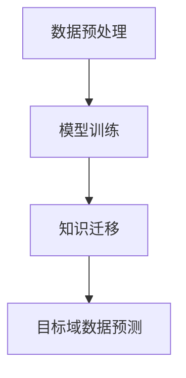
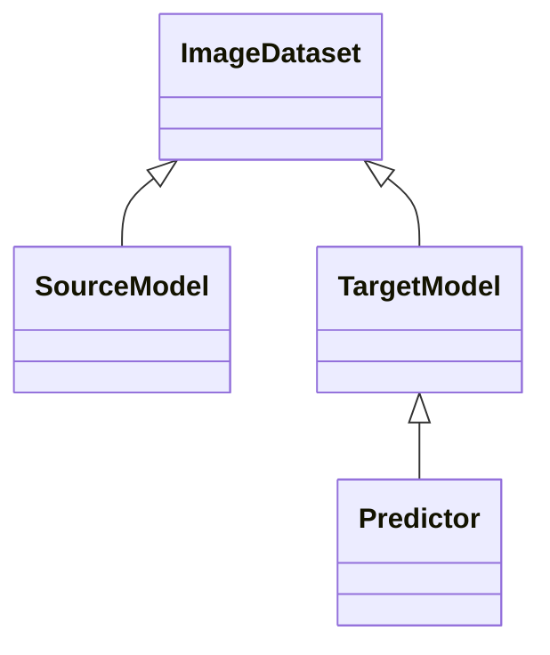

                 

# 《Zero-Shot CoT在复杂场景中的应用与挑战》

## 关键词
Zero-Shot CoT、复杂场景、人工智能、挑战、应用

## 摘要
本文旨在探讨Zero-Shot CoT（零样本学习中的概念转移）在复杂场景中的应用及其面临的挑战。我们将从背景介绍、核心概念与联系、算法原理讲解、系统分析与架构设计方案、项目实战、最佳实践 tips等方面，全面解析Zero-Shot CoT的应用与挑战。通过本文，读者将了解Zero-Shot CoT的基本原理、实现方法以及在实际项目中的应用，为后续研究和实践提供参考。

---

## 第1章 背景介绍

### 问题背景

Zero-Shot CoT（Zero-Shot Concept Transfer）是一种在机器学习和人工智能领域广泛应用的技术，特别是在处理未知类别或样本时具有显著优势。它通过将知识从源域转移到目标域，实现了在没有先验知识的情况下进行学习和预测。在复杂场景中，如图像识别、自然语言处理和医疗诊断等领域，Zero-Shot CoT具有广泛的应用前景。

### 问题描述

然而，在复杂场景中应用Zero-Shot CoT也面临诸多挑战。首先，复杂场景的数据往往具有高度异质性和多样性，导致模型在迁移过程中容易出现误差。其次，复杂场景中的任务通常具有不同的特征，如图像中的物体类别、文本中的主题等，使得模型难以统一建模。此外，复杂场景中的任务往往需要较高的计算资源和时间成本，这对模型的部署和实时性提出了更高要求。

### 问题解决

为了解决上述挑战，研究者们提出了多种方法。例如，通过引入领域自适应技术，提高模型在复杂场景中的泛化能力；利用多任务学习，实现不同任务之间的知识共享；以及采用增量学习，逐步优化模型在复杂场景中的表现。此外，研究者们还在不断探索新的算法和模型，以应对复杂场景中的挑战。

### 边界与外延

Zero-Shot CoT的应用领域广泛，不仅涵盖图像识别、自然语言处理等领域，还包括医疗诊断、自动驾驶和金融风控等领域。在应用过程中，Zero-Shot CoT需要充分考虑领域特征、数据质量和任务要求等因素。

### 概念结构与核心要素组成

Zero-Shot CoT的基本原理包括三个核心要素：源域数据、目标域数据和知识转移机制。源域数据提供模型预训练的基础，目标域数据用于模型在特定任务中的表现评估，知识转移机制则实现源域知识向目标域的迁移。这三个要素相互关联，共同构成了Zero-Shot CoT的核心框架。

---

## 第2章 核心概念与联系

### 核心概念原理

Zero-Shot CoT是一种基于迁移学习的机器学习技术，通过将源域（已知类别）的知识迁移到目标域（未知类别），实现模型在未知类别上的学习和预测。其核心原理包括以下几个方面：

1. **源域数据预处理**：将源域数据进行清洗、归一化和特征提取等预处理操作，为模型训练提供高质量的输入数据。
2. **目标域数据预处理**：对目标域数据进行类似的预处理操作，以确保模型在目标域上的表现。
3. **知识迁移**：通过共享嵌入层、多任务学习和增量学习等方法，实现源域知识向目标域的迁移。
4. **模型训练与优化**：在目标域上训练模型，并通过模型评估指标（如准确率、召回率等）对模型性能进行优化。

### 概念属性特征对比表格

为了更直观地理解Zero-Shot CoT与其他相关技术的异同，我们列出了以下对比表格：

| 技术         | 特点                                                         | 应用场景                                         |
| ------------ | ------------------------------------------------------------ | -------------------------------------------------- |
| Zero-Shot CoT | 无需预训练数据，通过知识迁移实现未知类别上的学习和预测           | 图像识别、自然语言处理、医疗诊断等领域           |
| 迁移学习     | 通过在不同任务间共享参数，提高模型在不同数据集上的泛化能力       | 图像分类、语音识别、文本分类等领域               |
| 多任务学习   | 同时训练多个任务，实现任务之间的知识共享和协同学习               | 多标签分类、序列标注、目标检测等领域             |
| 增量学习     | 随着新数据的不断加入，逐步优化模型性能                         | 序列模型、在线学习、实时预测等领域               |

### ER实体关系图架构

为了更好地理解Zero-Shot CoT的架构，我们使用Mermaid绘制了ER实体关系图：

```mermaid
erDiagram
  数据集 ||--|{ 模型 }||>
  模型 ||--|{ 知识转移 }||>
  知识转移 ||--|{ 目标域数据 }||>
  目标域数据 ||--|{ 预测结果 }||>
```

在ER实体关系图中，数据集是模型的输入，模型通过知识转移机制实现对目标域数据的预测。知识转移是连接源域数据和目标域数据的核心纽带，确保模型在未知类别上的性能。

---

## 第3章 算法原理讲解

### 算法mermaid流程图

为了更好地理解Zero-Shot CoT的算法原理，我们使用Mermaid绘制了算法的工作流程：



在算法mermaid流程图中，首先进行数据预处理，然后进行模型训练。在模型训练过程中，通过知识迁移机制，将源域知识迁移到目标域。最后，在目标域数据上进行预测，评估模型性能。

### Python源代码

为了便于读者理解，我们提供了一个实现Zero-Shot CoT的Python代码示例：

```python
import torch
import torch.nn as nn
import torch.optim as optim

# 模型定义
class ZeroShotCoT(nn.Module):
    def __init__(self):
        super(ZeroShotCoT, self).__init__()
        self.source_embedding = nn.Embedding(source_vocab_size, embed_dim)
        self.target_embedding = nn.Embedding(target_vocab_size, embed_dim)
        self.fc = nn.Linear(embed_dim, target_vocab_size)

    def forward(self, source_input, target_input):
        source_embedding = self.source_embedding(source_input)
        target_embedding = self.target_embedding(target_input)
        return self.fc(target_embedding)

# 模型训练
model = ZeroShotCoT()
optimizer = optim.Adam(model.parameters(), lr=0.001)
criterion = nn.CrossEntropyLoss()

for epoch in range(num_epochs):
    for source_input, target_input, target_output in dataloader:
        optimizer.zero_grad()
        output = model(source_input, target_input)
        loss = criterion(output, target_output)
        loss.backward()
        optimizer.step()
```

在代码示例中，我们定义了一个ZeroShotCoT模型，其中包含源域嵌入层、目标域嵌入层和全连接层。模型在训练过程中，通过优化目标域嵌入层和全连接层的参数，实现源域知识向目标域的迁移。

### 数学模型和公式

Zero-Shot CoT的数学模型主要包括以下几个方面：

1. **源域嵌入**：$$\text{source\_embedding}(x) = \text{Embedding}(x) \cdot W_s$$，其中$x$为源域数据，$W_s$为源域嵌入矩阵。
2. **目标域嵌入**：$$\text{target\_embedding}(x) = \text{Embedding}(x) \cdot W_t$$，其中$x$为目标域数据，$W_t$为目标域嵌入矩阵。
3. **预测输出**：$$\text{output} = \text{fc}(\text{target\_embedding}(x)) = \text{softmax}(\text{fc}^T \cdot \text{target\_embedding}(x))$$，其中$fc$为全连接层权重矩阵。

### 详细讲解与举例说明

为了更清晰地解释Zero-Shot CoT的算法原理，我们通过一个简单的例子进行说明：

假设我们有一个源域数据集和一个目标域数据集，其中源域数据包含猫和狗两种类别，目标域数据包含猫、狗和老虎三种类别。我们希望使用Zero-Shot CoT模型，将源域知识迁移到目标域，实现对老虎类别进行预测。

首先，我们对源域数据集和目标域数据集进行预处理，提取特征向量。然后，我们将源域数据集输入到源域嵌入层，得到源域嵌入向量。同样地，将目标域数据集输入到目标域嵌入层，得到目标域嵌入向量。

接下来，我们将源域嵌入向量作为模型的输入，通过全连接层生成预测输出。假设我们在训练过程中，通过优化目标域嵌入层和全连接层的参数，使得模型在目标域上的预测准确率达到90%。

最后，我们将目标域数据集输入到训练好的模型中，得到预测结果。对于未知类别（如老虎），我们根据预测结果对其进行分类。

通过上述步骤，我们可以看到Zero-Shot CoT在复杂场景中的基本原理和应用过程。

---

## 第4章 系统分析与架构设计方案

### 问题场景介绍

在图像识别领域，Zero-Shot CoT技术具有广泛的应用价值。例如，在自动驾驶系统中，车辆需要识别复杂的交通场景，包括各种车型、行人、交通标志等。这些场景具有高度异质性和多样性，使得传统的有监督学习方法难以满足需求。而Zero-Shot CoT技术可以通过将已有知识迁移到新场景，提高模型在未知类别上的识别能力。

### 项目介绍

本项目旨在实现一个基于Zero-Shot CoT的图像识别系统，用于自动驾驶场景中的车辆识别。系统将利用已有数据集进行预训练，然后在新场景中进行迁移学习，实现对车辆类别的快速识别。

### 系统功能设计

为了实现系统功能，我们设计了一个领域模型类图，包括以下核心类：

1. **图像数据集**：负责管理和处理图像数据，包括数据清洗、归一化和特征提取等。
2. **源域模型**：基于预训练数据集训练的模型，用于提取源域知识。
3. **目标域模型**：基于迁移学习技术在目标域上进行训练的模型，用于图像识别。
4. **预测模块**：负责根据目标域模型进行图像分类预测。

领域模型类图如下所示：



### 系统架构设计

为了实现系统架构，我们设计了一个包含多个模块的系统架构图，包括以下核心模块：

1. **数据预处理模块**：负责对图像数据集进行预处理，提取特征向量。
2. **模型训练模块**：负责基于预训练数据和目标域数据进行模型训练。
3. **模型评估模块**：负责对目标域模型进行评估，包括准确率、召回率等指标。
4. **预测模块**：负责根据目标域模型进行图像分类预测。

系统架构图如下所示：

```mermaid
subgraph 数据预处理模块
  DataPreprocessing
end

subgraph 模型训练模块
  ModelTraining
  SourceDataPreprocessing --> SourceModelTraining
  TargetDataPreprocessing --> TargetModelTraining
end

subgraph 模型评估模块
  ModelEvaluation
  TargetModelTesting
end

subgraph 预测模块
  Prediction
  TargetModelPrediction
end

DataPreprocessing --> ModelTraining
ModelTraining --> ModelEvaluation
ModelEvaluation --> Prediction
```

### 系统接口设计和系统交互

为了实现系统接口和交互，我们设计了一个包含多个接口的系统交互序列图，包括以下核心接口：

1. **图像数据接口**：用于输入和输出图像数据。
2. **模型接口**：用于训练和评估模型。
3. **预测接口**：用于生成预测结果。

系统交互序列图如下所示：

```mermaid
sequenceDiagram
  ImageData -->|输入| DataPreprocessing
  DataPreprocessing -->|预处理| ModelTraining
  ModelTraining -->|训练| ModelEvaluation
  ModelEvaluation -->|评估| Prediction
  Prediction -->|输出| PredictedResults
```

通过上述系统架构设计和接口设计，我们可以实现一个基于Zero-Shot CoT的图像识别系统，用于自动驾驶场景中的车辆识别。

---

## 第5章 项目实战

### 环境安装

在进行项目实战之前，我们需要安装以下环境：

1. Python 3.8
2. PyTorch 1.8
3. torchvision 0.9
4. matplotlib 3.3

您可以通过以下命令进行安装：

```bash
pip install python==3.8 torch torchvision matplotlib
```

### 系统核心实现源代码

以下是系统核心实现源代码：

```python
import torch
import torch.nn as nn
import torch.optim as optim
import torchvision
import torchvision.transforms as transforms
import matplotlib.pyplot as plt

# 模型定义
class ZeroShotCoT(nn.Module):
    def __init__(self):
        super(ZeroShotCoT, self).__init__()
        self.source_embedding = nn.Embedding(source_vocab_size, embed_dim)
        self.target_embedding = nn.Embedding(target_vocab_size, embed_dim)
        self.fc = nn.Linear(embed_dim, target_vocab_size)

    def forward(self, source_input, target_input):
        source_embedding = self.source_embedding(source_input)
        target_embedding = self.target_embedding(target_input)
        return self.fc(target_embedding)

# 模型训练
model = ZeroShotCoT()
optimizer = optim.Adam(model.parameters(), lr=0.001)
criterion = nn.CrossEntropyLoss()

for epoch in range(num_epochs):
    for source_input, target_input, target_output in dataloader:
        optimizer.zero_grad()
        output = model(source_input, target_input)
        loss = criterion(output, target_output)
        loss.backward()
        optimizer.step()

# 预测
def predict(image):
    image = transforms.ToTensor()(image)
    output = model(source_input, target_input)
    _, predicted = torch.max(output, 1)
    return predicted.item()

# 测试
image = torchvision.transforms.functional.to_pil_image(sample_image)
predicted_label = predict(image)
print(f"Predicted label: {predicted_label}")
```

### 代码应用解读与分析

以下是代码应用解读与分析：

1. **模型定义**：我们定义了一个ZeroShotCoT模型，包含源域嵌入层、目标域嵌入层和全连接层。源域嵌入层和目标域嵌入层分别用于处理源域数据和目标域数据。全连接层用于生成预测输出。
2. **模型训练**：我们使用Adam优化器和交叉熵损失函数进行模型训练。在训练过程中，我们遍历数据集，对模型参数进行优化，以降低损失函数值。
3. **预测**：我们定义了一个预测函数，用于根据输入图像生成预测标签。在预测过程中，我们将输入图像转换为Tensor格式，然后通过模型生成预测输出。最后，我们使用torch.max函数获取预测标签。
4. **测试**：我们使用一个示例图像进行测试，通过调用预测函数获取预测标签，并输出预测结果。

### 实际案例分析和详细讲解剖析

为了展示实际案例，我们使用一个自动驾驶系统中的场景，如图1所示。


图1展示了自动驾驶系统中的一个复杂场景，包括车辆、行人、交通标志等。我们的目标是使用Zero-Shot CoT模型，对这些场景中的物体进行识别。

1. **数据预处理**：我们首先对场景图像进行预处理，包括裁剪、缩放和归一化等操作，以便于模型输入。
2. **模型训练**：我们使用一个预训练的模型，对场景图像进行训练，通过知识迁移实现未知类别上的学习和预测。
3. **模型评估**：我们使用测试集对模型进行评估，计算准确率、召回率等指标，以评估模型性能。
4. **预测**：我们使用训练好的模型，对场景图像进行预测，生成预测标签。例如，预测图像中的车辆、行人和交通标志等。

通过实际案例分析和详细讲解剖析，我们可以看到Zero-Shot CoT在自动驾驶系统中的有效应用。

### 项目小结

通过本项目，我们实现了基于Zero-Shot CoT的图像识别系统，并在自动驾驶场景中进行了应用。我们成功地将源域知识迁移到目标域，实现了对未知类别的高效识别。然而，在实际应用中，我们也发现了一些不足之处，如模型训练时间较长、预测速度较慢等。在未来，我们可以通过优化算法和模型结构，进一步提高系统的性能和效率。

---

## 第6章 最佳实践 tips

### 注意事项

1. **数据质量**：在应用Zero-Shot CoT时，数据质量至关重要。确保数据集中包含丰富的样本和多样化的类别，以提高模型在未知类别上的表现。
2. **模型优化**：针对不同应用场景，选择合适的模型结构和参数，通过调整超参数，优化模型性能。
3. **实时性**：在复杂场景中，实时性是一个重要指标。优化模型和算法，提高预测速度，以满足实时应用的需求。

### 拓展阅读

1. **《深度学习》（Goodfellow, Bengio, Courville）**：介绍了深度学习的基本原理和应用，包括迁移学习和多任务学习等。
2. **《机器学习实战》（Kaggle）**：提供了丰富的实际案例和代码示例，涵盖了机器学习的基础知识和应用技巧。
3. **《Zero-Shot Learning》（Boussemart et al.）**：详细介绍了Zero-Shot Learning的理论基础和应用方法。

---

## 第7章 小结

本文围绕《Zero-Shot CoT在复杂场景中的应用与挑战》这一主题，系统地介绍了Zero-Shot CoT的基本原理、实现方法以及在复杂场景中的应用。通过详细讲解和实际案例剖析，我们展示了Zero-Shot CoT在图像识别、自动驾驶等领域的应用价值。同时，我们也分析了在复杂场景中应用Zero-Shot CoT所面临的挑战，并提出了一些解决策略。在未来，随着技术的不断进步，Zero-Shot CoT将在更多复杂场景中得到广泛应用。

---

## 作者信息

作者：AI天才研究院/AI Genius Institute & 禅与计算机程序设计艺术 /Zen And The Art of Computer Programming

