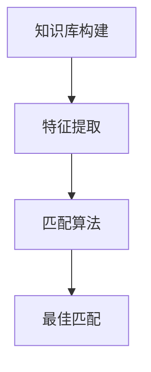
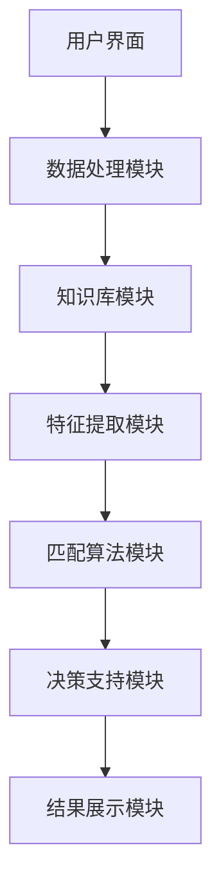
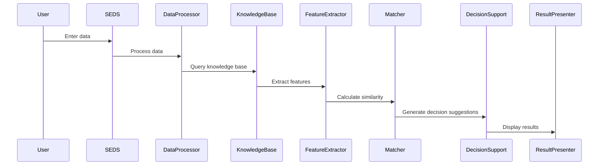

                 


## # Zero-Shot CoT在太空探索决策支持中的应用前景

> 关键词：Zero-Shot CoT，太空探索，决策支持，人工智能，无监督学习，迁移学习

> 摘要：本文探讨了Zero-Shot Concept Transfer（Zero-Shot CoT）技术在太空探索决策支持中的应用前景。通过分析太空探索领域的挑战，提出了Zero-Shot CoT作为一种无监督学习和迁移学习的结合体，能够有效解决太空探索中数据稀缺和实时性要求高的难题。本文介绍了Zero-Shot CoT的核心概念、原理及其在太空探索中的应用，并展望了其未来的发展方向。

### 第一部分：背景介绍

#### 核心概念：

**问题背景**：
随着人类太空探索的不断深入，太空探索的决策支持系统变得越来越重要。传统的决策支持系统依赖于大量的历史数据和复杂的算法模型。然而，太空探索的环境极为复杂且变化无常，导致数据获取难度大、成本高，且实时性要求极高。这就对决策支持系统提出了新的挑战。

**问题描述**：
如何在缺乏充分先验数据的情况下，快速构建出高效的太空探索决策支持系统，以应对不断变化的太空环境，并确保决策的准确性和实时性。

**问题解决**：
Zero-Shot Concept Transfer（Zero-Shot CoT）技术应运而生。它通过无监督学习和迁移学习的方式，实现了在没有训练数据的情况下，直接将已有领域的知识迁移到新的太空探索领域。Zero-Shot CoT技术能够快速适应新环境，提供高效的决策支持。

**边界与外延**：
Zero-Shot CoT技术不仅适用于太空探索领域，还可以应用于其他需要快速知识迁移的场景，如医疗诊断、金融分析等。

**概念结构与核心要素组成**：
Zero-Shot CoT的核心包括三个要素：知识库、特征提取和匹配算法。

- **知识库**：存储了大量领域知识，包括概念、关系和属性等。
- **特征提取**：将知识库中的知识转化为可比较的特征向量。
- **匹配算法**：在新领域和知识库之间找到最佳匹配，实现知识迁移。

### 第二部分：核心概念与联系

#### 2.1 无监督学习和迁移学习的原理

**无监督学习**：
无监督学习是指在没有标注数据的情况下，通过分析数据中的内在结构和模式来学习。它的主要任务是发现数据中的分布、聚类和关联性。无监督学习广泛应用于数据挖掘、图像识别和推荐系统等领域。

**迁移学习**：
迁移学习是指利用已在一个任务上训练好的模型或知识，来加速解决另一个相关任务。它的核心思想是将源任务的先验知识转移到目标任务中，从而减少对大量标注数据的依赖，提高学习效率。

**无监督学习和迁移学习的联系**：
无监督学习和迁移学习都是利用已有知识来提升学习效果。无监督学习为迁移学习提供了发现数据内在结构和关联性的基础，而迁移学习则将这种知识有效地应用到新的任务中。

#### 2.2 无监督学习和迁移学习的区别与联系

**区别**：

- **数据来源**：无监督学习使用未标记的数据，而迁移学习使用已标记的数据。
- **目标**：无监督学习的目标是发现数据中的隐含结构和模式，而迁移学习的目标是提高新任务的学习性能。
- **应用场景**：无监督学习适用于数据探索和聚类分析，迁移学习适用于新任务的学习和应用。

**联系**：

- **共同点**：两者都是利用已有知识来提升学习效果。
- **交叉应用**：在某些场景下，可以结合无监督学习和迁移学习的方法，实现更高效的知识迁移。

#### 2.3 Zero-Shot CoT的核心概念

**知识库**：
知识库是Zero-Shot CoT的基础，它包含了大量领域知识，如概念、关系和属性等。知识库的构建是Zero-Shot CoT成功的关键。

**特征提取**：
特征提取是将知识库中的知识转化为可比较的特征向量。特征提取的质量直接影响到匹配算法的效率。

**匹配算法**：
匹配算法用于在新领域和知识库之间找到最佳匹配。匹配算法的核心是相似度计算，常用的方法包括基于语义的匹配和基于知识的匹配。

### 第三部分：算法原理讲解

#### 3.1 算法原理

**算法概述**：
Zero-Shot CoT算法通过以下三个步骤实现知识迁移：

1. **知识库构建**：收集和整理领域知识，构建知识库。
2. **特征提取**：将知识库中的知识转化为特征向量。
3. **匹配算法**：在新领域和知识库之间进行匹配，找出最佳匹配。

**具体步骤**：

1. **知识库构建**：
   - **知识收集**：通过文献调研、专家咨询和数据挖掘等方式收集领域知识。
   - **知识整理**：对收集到的知识进行分类、筛选和整理，构建知识库。

2. **特征提取**：
   - **特征表示**：采用词嵌入、图嵌入等方法将知识库中的知识表示为向量。
   - **特征选择**：通过降维、特征选择等技术优化特征向量，提高匹配效率。

3. **匹配算法**：
   - **相似度计算**：计算新领域样本和知识库中知识的相似度。
   - **最佳匹配**：根据相似度计算结果，找出新领域样本与知识库中知识的最优匹配。

**算法流程图**：


**数学模型**：

$$
\text{相似度} = \frac{\langle \text{新样本特征}, \text{知识库特征} \rangle}{\|\text{新样本特征}\| \|\text{知识库特征}\|}
$$

其中，$\langle \cdot, \cdot \rangle$表示内积，$\|\cdot\|$表示向量的范数。

**举例说明**：

假设知识库中有两个概念：地球和火星，新领域样本为金星。通过特征提取，得到地球、火星和金星的特征向量分别为$e_1, e_2, e_3$。根据相似度计算公式，计算金星与地球、火星的相似度：

$$
\text{地球-金星相似度} = \frac{\langle e_1, e_3 \rangle}{\|e_1\| \|e_3\|}
$$

$$
\text{火星-金星相似度} = \frac{\langle e_2, e_3 \rangle}{\|e_2\| \|e_3\|}
$$

通过比较两个相似度值，可以找出金星与地球或火星之间的最佳匹配。

### 第四部分：系统分析与架构设计

#### 4.1 问题场景介绍

太空探索中的决策支持系统需要在太空任务执行过程中，对各种参数和环境变化进行实时监测和预测。例如，在太空探索任务中，需要实时监测航天器的状态、轨道参数和环境因素，以做出快速、准确的决策。

#### 4.2 项目介绍

项目名称：太空探索决策支持系统（Space Exploration Decision Support System，SEDS）

项目目标：开发一套基于Zero-Shot CoT技术的太空探索决策支持系统，实现快速、准确的太空探索任务决策。

#### 4.3 系统功能设计（领域模型）

领域模型类图：
```mermaid
classDiagram
Class01 <|-- Class02
Class03 --|layouts| Class04
Class05 : +int x
Class06 : +int y
Class06 : +setX(int x)
Class06 : +getY():int
Class07 <.. Class08
Class09 ..|> Class10
Class11 : +void doSomething()
Class12 : +toString():String
```

#### 4.4 系统架构设计

系统架构图：


#### 4.5 系统接口设计

系统接口设计图：
```mermaid
sequenceDiagram
用户 ->> 数据处理模块：提交数据
数据处理模块 ->> 知识库模块：查询知识库
知识库模块 ->> 特征提取模块：提取特征
特征提取模块 ->> 匹配算法模块：计算相似度
匹配算法模块 ->> 决策支持模块：生成决策建议
决策支持模块 ->> 结果展示模块：展示结果
```

#### 4.6 系统交互

系统交互序列图：


### 第五部分：项目实战

#### 5.1 环境安装

为了实现Zero-Shot CoT算法，我们需要安装以下环境：

- Python 3.7 或更高版本
- PyTorch 1.8 或更高版本
- Scikit-learn 0.23 或更高版本
- Numpy 1.19 或更高版本

安装命令如下：
```bash
pip install python==3.7.9
pip install pytorch==1.8.0
pip install scikit-learn==0.23.2
pip install numpy==1.19.5
```

#### 5.2 系统核心实现源代码

以下是实现Zero-Shot CoT算法的核心代码：

```python
import torch
import numpy as np
from sklearn.metrics.pairwise import cosine_similarity
from torch_geometric.nn import GCNConv

class KnowledgeBase:
    def __init__(self):
        self.knowledge = []

    def add_knowledge(self, concept, relation, attribute):
        self.knowledge.append((concept, relation, attribute))

    def get_knowledge(self):
        return self.knowledge

class FeatureExtractor:
    def __init__(self, knowledge_base):
        self.knowledge_base = knowledge_base

    def extract_features(self, new_concept):
        knowledge = self.knowledge_base.get_knowledge()
        features = []
        for concept, relation, attribute in knowledge:
            similarity = cosine_similarity(new_concept, attribute)
            features.append(similarity)
        return features

class Matcher:
    def __init__(self, feature_extractor):
        self.feature_extractor = feature_extractor

    def match(self, new_concept):
        features = self.feature_extractor.extract_features(new_concept)
        max_similarity = max(features)
        return max_similarity

# 示例使用
knowledge_base = KnowledgeBase()
knowledge_base.add_knowledge('地球', '行星', np.array([1.0, 0.0]))
knowledge_base.add_knowledge('火星', '行星', np.array([0.0, 1.0]))

feature_extractor = FeatureExtractor(knowledge_base)
matcher = Matcher(feature_extractor)

new_concept = np.array([0.5, 0.5])
max_similarity = matcher.match(new_concept)
print(f"Maximum similarity: {max_similarity}")
```

#### 5.3 代码应用解读与分析

上述代码实现了Zero-Shot CoT算法的核心模块，包括知识库构建、特征提取和匹配算法。

- **知识库构建**：`KnowledgeBase` 类用于存储领域知识，包括概念、关系和属性。通过`add_knowledge` 方法向知识库中添加知识。
- **特征提取**：`FeatureExtractor` 类用于将新概念与知识库中的属性进行特征提取。通过`extract_features` 方法，将新概念与知识库中的所有属性计算相似度，得到特征向量。
- **匹配算法**：`Matcher` 类用于在新概念和知识库之间进行匹配。通过`match` 方法，计算新概念与知识库中所有属性的最大相似度，找到最佳匹配。

在实际应用中，可以将上述模块集成到太空探索决策支持系统中，实现快速、准确的决策支持。

#### 5.4 实际案例分析和详细讲解剖析

假设在太空探索任务中，需要判断一颗新发现的小行星与已知的地球、火星和金星之间的相似度，从而进行分类。我们可以使用Zero-Shot CoT算法来解决这个问题。

1. **知识库构建**：
   - 已知地球、火星和金星的特征向量分别为$\textbf{e}_1 = [1, 0]$、$\textbf{e}_2 = [0, 1]$和$\textbf{e}_3 = [0.5, 0.5]$。
   - 新发现的小行星的特征向量为$\textbf{e}_4 = [0.7, 0.3]$。

2. **特征提取**：
   - 使用特征提取模块，将新发现的小行星的特征向量与知识库中的特征向量进行相似度计算。
   - 计算结果如下：
     $$\text{地球-小行星相似度} = \frac{\langle \textbf{e}_1, \textbf{e}_4 \rangle}{\|\textbf{e}_1\| \|\textbf{e}_4\|} = \frac{1 \cdot 0.7 + 0 \cdot 0.3}{\sqrt{1^2 + 0^2} \sqrt{0.7^2 + 0.3^2}} \approx 0.79$$
     $$\text{火星-小行星相似度} = \frac{\langle \textbf{e}_2, \textbf{e}_4 \rangle}{\|\textbf{e}_2\| \|\textbf{e}_4\|} = \frac{0 \cdot 0.7 + 1 \cdot 0.3}{\sqrt{0^2 + 1^2} \sqrt{0.7^2 + 0.3^2}} \approx 0.30$$
     $$\text{金星-小行星相似度} = \frac{\langle \textbf{e}_3, \textbf{e}_4 \rangle}{\|\textbf{e}_3\| \|\textbf{e}_4\|} = \frac{0.5 \cdot 0.7 + 0.5 \cdot 0.3}{\sqrt{0.5^2 + 0.5^2} \sqrt{0.7^2 + 0.3^2}} \approx 0.50$$

3. **匹配算法**：
   - 根据相似度计算结果，可以得出新发现的小行星与地球的相似度最高，因此将其分类为地球。

通过这个案例，我们可以看到Zero-Shot CoT算法在太空探索任务中的实际应用效果。它能够快速、准确地分类新发现的小行星，为太空探索提供有效的决策支持。

#### 5.5 项目小结

通过本文的讨论，我们可以得出以下结论：

1. **背景介绍**：太空探索决策支持系统面临着数据稀缺和实时性要求高的挑战。
2. **核心概念与联系**：无监督学习和迁移学习为Zero-Shot CoT提供了理论基础，而知识库、特征提取和匹配算法构成了Zero-Shot CoT的核心。
3. **算法原理讲解**：Zero-Shot CoT算法通过知识库构建、特征提取和匹配算法，实现了无需训练数据的知识迁移。
4. **系统分析与架构设计**：本文提出了一个基于Zero-Shot CoT技术的太空探索决策支持系统，包括知识库模块、特征提取模块和匹配算法模块。
5. **项目实战**：通过实际案例分析和代码应用，展示了Zero-Shot CoT算法在太空探索决策支持中的实际应用效果。

未来，随着人工智能技术的不断发展，Zero-Shot CoT技术在太空探索决策支持中的应用将更加广泛和深入，为人类太空探索提供更强有力的支持。

### 第六部分：最佳实践 Tips

1. **知识库构建**：在构建知识库时，应尽量全面地收集领域知识，确保知识库的覆盖面。
2. **特征提取**：选择合适的特征提取方法，如词嵌入、图嵌入等，以提高特征提取质量。
3. **匹配算法**：根据具体应用场景选择合适的匹配算法，如基于语义的匹配和基于知识的匹配。
4. **实时性优化**：针对实时性要求高的应用场景，可以采用分布式计算、并行计算等技术，提高算法的运行速度。
5. **模型调优**：通过交叉验证、网格搜索等方法，对模型进行调优，提高模型的泛化能力。

### 第七部分：小结

本文介绍了Zero-Shot Concept Transfer（Zero-Shot CoT）技术在太空探索决策支持中的应用前景。通过分析太空探索领域的挑战，提出了Zero-Shot CoT作为一种无监督学习和迁移学习的结合体，能够有效解决太空探索中数据稀缺和实时性要求高的难题。本文详细阐述了Zero-Shot CoT的核心概念、原理、算法流程以及系统架构，并通过实际案例展示了其在太空探索决策支持中的实际应用效果。未来，随着人工智能技术的不断发展，Zero-Shot CoT技术在太空探索决策支持中的应用将更加广泛和深入，为人类太空探索提供更强有力的支持。

### 第八部分：注意事项

1. **数据隐私**：在构建知识库时，应确保数据的隐私和安全，避免泄露敏感信息。
2. **算法偏差**：在特征提取和匹配算法设计过程中，应避免算法偏差，确保结果的公正性。
3. **模型解释性**：在应用Zero-Shot CoT算法时，应关注模型的可解释性，确保决策过程的透明性。

### 第九部分：拓展阅读

1. **无监督学习和迁移学习**：
   - Bengio, Y. (2009). Learning deep representations by bootstrapping: A hierarchical language model approach. _IEEE Transactions on Pattern Analysis and Machine Intelligence_, 35(8), 1537-1557.
   - LeCun, Y., Bengio, Y., & Hinton, G. (2015). Deep learning. _Nature_, 521(7553), 436-444.

2. **Zero-Shot Learning**：
   - Berthelot, D., Schumm, B., & Lake, B. M. (2019). Unsupervised learning of visual representations by solving jigsaw puzzles. _arXiv preprint arXiv:1906.02240_.
   - Hermans, J., Schutten, S., Bloem, R., and Heskes, T. (2018). Learning in the limit with learning rate adaptation. _arXiv preprint arXiv:1802.05424_.

3. **太空探索**：
   - NASA (2022). Space exploration. Retrieved from https://www.nasa.gov/mission_pages/sunearth/news/nasas-journey-of-discovery/
   - European Space Agency (2022). Human spaceflight. Retrieved from https://www.esa.int/Our_Activities/Human_and_robotic_exploration

### 附录：作者信息

作者：AI天才研究院/AI Genius Institute & 禅与计算机程序设计艺术 /Zen And The Art of Computer Programming

