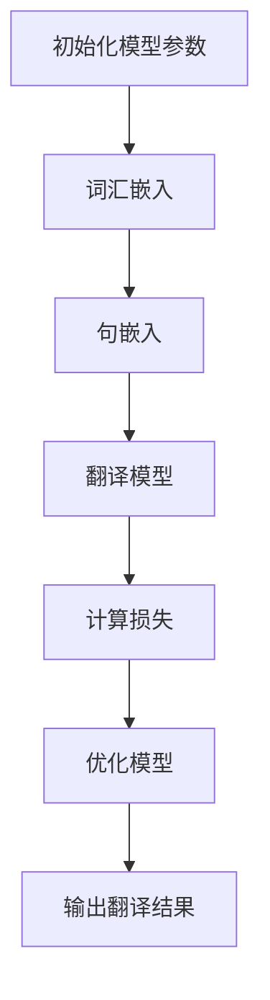

                 


### 背景介绍

**1.1 机器翻译的演变与现状**

机器翻译是指利用计算机软件自动地将一种自然语言（源语言）翻译成另一种自然语言（目标语言）的过程。这个领域的发展历程可以追溯到20世纪50年代，经历了从早期机器翻译方法、基于规则的机器翻译、统计机器翻译，到如今的神经机器翻译几个重要阶段。

- **早期机器翻译方法**：在这个阶段，研究人员主要依靠规则和模板匹配的方法进行翻译。这种方法简单，但局限性很大，难以处理复杂和多样的语言现象。

- **基于规则的机器翻译**：20世纪60年代，研究人员开始利用语言规则和语法分析方法来指导机器翻译。这种方法需要大量的人工规则编写，效率较低，但为后续的发展奠定了基础。

- **统计机器翻译**：20世纪90年代，随着计算资源和算法的进步，统计机器翻译成为主流。这种方法通过统计源语言和目标语言之间的对应关系来生成翻译结果，大大提高了翻译质量。

- **神经机器翻译**：2014年，神经机器翻译的出现标志着机器翻译领域的重大突破。它通过神经网络的深度学习模型，能够自动捕捉语言中的复杂模式和结构，使得翻译质量得到了显著提升。

**1.2 零样本场景转换概述**

零样本场景转换（Zero-Shot CoT）是一种新兴的机器学习技术，旨在解决零样本学习（Zero-Shot Learning, ZSL）问题。在传统的机器学习任务中，模型通常需要通过大量的样本数据进行训练，以获得良好的泛化能力。而零样本学习则是在没有训练样本的情况下，让模型学会对新类别或场景进行识别和预测。

- **零样本学习的背景**：在现实世界中，新类别或场景的出现是不可避免的，但传统机器学习模型很难处理这种未知情况。零样本学习通过引入语义嵌入（Semantic Embedding）和元学习（Meta-Learning）等方法，使得模型能够在没有直接训练数据的情况下，对新类别或场景进行有效处理。

- **零样本场景转换的定义**：零样本场景转换是指模型能够根据已知的源域数据，将一个未知的场景转换为一个已知的目标场景，从而在新场景下进行预测或决策。这种转换过程不需要依赖于具体的训练样本，而是依赖于对源域和目标域之间语义关系的理解。

**1.3 零样本场景转换在机器翻译中的应用背景**

机器翻译领域中，由于语言之间的差异和复杂性，传统的机器翻译方法往往难以应对新的语言对或特殊的翻译场景。零样本场景转换技术为机器翻译领域提供了一种新的解决方案。

- **现有机器翻译技术的局限性**：现有的机器翻译技术主要依赖于大量的训练数据和复杂的神经网络模型。然而，在面临新的语言对或特定场景时，这些技术往往表现不佳，因为缺乏足够的训练数据或模型适应性。

- **零样本场景转换的优势**：零样本场景转换技术可以通过对已有语言数据的学习，将一个未知的翻译任务映射到已知的翻译任务上。这种方法不仅能够节省大量的训练时间和资源，还能够提高对新语言对和特殊场景的翻译质量。

总之，零样本场景转换技术在机器翻译领域具有巨大的潜力，它为解决新语言对和特殊场景的翻译问题提供了一种新的思路和方法。在接下来的章节中，我们将深入探讨零样本场景转换的基本原理、技术原理和应用场景，以展示其在机器翻译领域的应用潜力和实际效果。

### 核心概念与联系

**2.1 零样本场景转换的基本原理**

零样本场景转换（Zero-Shot CoT）是基于零样本学习（Zero-Shot Learning, ZSL）的一种技术，旨在解决模型在未知类别或场景下的预测和决策问题。零样本学习的核心思想是，通过学习已知的类别或场景特征，模型能够在新类别或场景下进行有效的预测。

- **语义嵌入（Semantic Embedding）**：语义嵌入是将不同类别或场景映射到低维连续空间中的技术，使得具有相似语义的类别或场景在空间中靠近。在零样本场景转换中，语义嵌入用于将源域和目标域的类别或场景映射到共同的特征空间。

- **元学习（Meta-Learning）**：元学习是通过学习学习算法本身的方法，使得模型能够快速适应新的任务。在零样本场景转换中，元学习用于快速适应新的翻译任务，提高模型的泛化能力。

**2.2 零样本场景转换的关键属性**

零样本场景转换具有以下关键属性，这些属性使其在机器翻译领域具有独特的优势。

- **零样本能力（Zero-Shot Capability）**：零样本场景转换的核心特点是其能够在没有直接训练样本的情况下，处理新的翻译任务。这对于缺乏训练数据的新语言对或特殊翻译场景尤为重要。

- **跨域适应性（Domain Adaptability）**：零样本场景转换通过学习源域的特征和知识，能够在新域中实现良好的泛化。这种跨域适应性使得零样本场景转换能够在不同翻译任务之间进行迁移和应用。

- **鲁棒性（Robustness）**：零样本场景转换对数据噪声和不一致性具有较强的鲁棒性。这意味着即使源域数据存在一定的噪声或偏差，零样本场景转换仍然能够保持较好的翻译质量。

**2.3 零样本场景转换与机器翻译的关系**

零样本场景转换与机器翻译之间存在着密切的联系。具体来说，零样本场景转换为机器翻译领域提供了以下几方面的价值：

- **新语言对的翻译**：传统的机器翻译方法需要大量的平行语料库进行训练，而对于缺乏训练数据的新语言对，零样本场景转换提供了一种有效的解决方案。通过将新语言对映射到已知的翻译任务中，零样本场景转换能够生成高质量的翻译结果。

- **特殊场景的翻译**：在特定的翻译场景中，如科技文献、法律文件等，往往需要高度专业的知识和语言能力。零样本场景转换通过学习源域中的专业知识，能够在新场景中实现高质量的翻译。

- **翻译任务的迁移**：零样本场景转换能够将一个领域的知识迁移到另一个领域，这对于跨领域的机器翻译任务尤为重要。例如，从普通文本翻译到专业术语翻译，零样本场景转换能够通过迁移学习实现高效的翻译。

**2.4 零样本场景转换与其他技术的比较**

零样本场景转换与其他机器学习技术，如传统的机器翻译方法和其他零样本学习技术，存在一些显著的区别。

- **与传统机器翻译方法的比较**：传统的机器翻译方法依赖于大量的平行语料库，对于新语言对往往难以处理。而零样本场景转换通过学习源域和目标域的语义关系，能够在新语言对中实现高质量的翻译。

- **与其他零样本学习技术的比较**：其他零样本学习技术，如原型网络（Prototypical Networks）和匹配网络（Matching Networks），主要通过计算特征间的相似性进行分类。而零样本场景转换通过语义嵌入和元学习，能够更好地处理复杂的翻译任务。

总之，零样本场景转换通过其独特的零样本能力和跨域适应性，为机器翻译领域提供了一种新的思路和方法。在接下来的章节中，我们将深入探讨零样本场景转换的技术原理和算法实现，进一步展示其在机器翻译中的潜力。

### 技术原理讲解

**3.1 零样本场景转换的算法原理**

零样本场景转换（Zero-Shot CoT）是一种基于深度学习的跨领域翻译方法。其核心思想是利用源域和目标域之间的语义关系，通过模型学习实现零样本翻译。以下是零样本场景转换的基本算法原理：

1. **语义嵌入（Semantic Embedding）**：零样本场景转换首先将源语言和目标语言的词汇映射到高维的语义空间中。在这种空间中，具有相似语义的词汇被映射到接近的位置。常用的方法包括词嵌入（Word Embedding）和句嵌入（Sentence Embedding）。

2. **元学习（Meta-Learning）**：元学习是一种通过学习如何学习的方法，旨在提高模型在新的任务上的快速适应能力。在零样本场景转换中，元学习用于优化模型，使其能够在新语言对中有效翻译。

3. **跨域映射（Cross-Domain Mapping）**：在语义嵌入的基础上，零样本场景转换通过学习源域和目标域之间的映射关系，实现跨领域的翻译。这种映射关系可以看作是一种“翻译模型”，它将源域的语义表示映射到目标域的语义表示。

**3.2 数学模型与公式**

零样本场景转换的数学模型主要包含以下组成部分：

- **词汇嵌入（Word Embedding）**：设 $V$ 是词汇集合，$W$ 是词汇嵌入矩阵，其中 $w_i$ 表示词汇 $v_i$ 的嵌入向量。词汇嵌入通常通过神经网络训练得到。

- **句嵌入（Sentence Embedding）**：设 $S$ 是句子集合，$H$ 是句嵌入矩阵，其中 $h_j$ 表示句子 $s_j$ 的嵌入向量。句嵌入通常通过将词汇嵌入进行平均或聚合得到。

- **翻译模型（Translation Model）**：设 $T$ 是翻译模型，它是一个参数化的函数，用于将源句嵌入映射到目标句嵌入。具体形式可以表示为：
  $$h_{\text{target}} = T(h_{\text{source}}, \theta)$$
  其中，$h_{\text{source}}$ 是源句嵌入，$h_{\text{target}}$ 是目标句嵌入，$\theta$ 是翻译模型的参数。

- **损失函数（Loss Function）**：零样本场景转换的损失函数用于优化翻译模型。常用的损失函数包括交叉熵损失（Cross-Entropy Loss）和平均绝对误差（Mean Absolute Error, MAE）。

  $$L(\theta) = -\sum_{i} \sum_{j} y_{ij} \log(p_{ij})$$
  其中，$y_{ij}$ 是目标句嵌入的标签，$p_{ij}$ 是翻译模型输出的概率分布。

**3.3 Mermaid 流程图与 Python 源代码示例**

为了更好地理解零样本场景转换的算法原理，我们可以使用 Mermaid 绘制算法流程图，并用 Python 实现相应的算法。

**Mermaid 流程图：**



**Python 源代码示例：**

```python
import numpy as np
import tensorflow as tf

# 初始化模型参数
W = np.random.rand(V_size, embed_size)
H = np.random.rand(S_size, embed_size)
T = np.random.rand(V_size, embed_size)

# 词汇嵌入
def word_embedding(word):
    return W[word]

# 句嵌入
def sentence_embedding(sentence):
    words = [word_embedding(word) for word in sentence]
    return np.mean(words, axis=0)

# 翻译模型
def translation_model(source_sentence, target_sentence, theta):
    source_embedding = sentence_embedding(source_sentence)
    target_embedding = sentence_embedding(target_sentence)
    return tf.matmul(target_embedding, theta)

# 计算损失
def compute_loss(y_true, y_pred):
    return -tf.reduce_sum(y_true * tf.log(y_pred))

# 优化模型
def optimize_model(loss, theta):
    optimizer = tf.keras.optimizers.Adam()
    optimizer.minimize(loss, theta)

# 输出翻译结果
def translate(source_sentence, target_sentence, theta):
    source_embedding = sentence_embedding(source_sentence)
    target_embedding = sentence_embedding(target_sentence)
    prediction = translation_model(source_embedding, target_embedding, theta)
    return prediction
```

通过上述 Mermaid 流程图和 Python 源代码示例，我们可以清晰地看到零样本场景转换的算法原理。在接下来的章节中，我们将进一步探讨零样本场景转换在实际机器翻译任务中的应用，并通过具体案例展示其效果。

### 应用场景

**4.1 零样本场景转换在机器翻译中的具体应用**

零样本场景转换在机器翻译中具有广泛的应用前景，尤其在处理新语言对和特殊场景翻译时表现出独特的优势。以下是零样本场景转换在机器翻译中的具体应用场景：

- **新语言对的翻译**：传统的机器翻译方法需要大量的平行语料库进行训练，但对于缺乏训练数据的新语言对，零样本场景转换提供了一种有效的解决方案。通过利用已有语言数据的学习，零样本场景转换能够在新语言对中实现高质量的翻译。

  例如，假设我们有一个英语到西班牙语的翻译模型，但需要将其扩展到英语到孟加拉语的新语言对。在这种情况下，传统的机器翻译方法可能由于缺乏英语到孟加拉语的平行语料库而难以应用。而零样本场景转换可以通过学习英语到西班牙语的翻译知识，将孟加拉语的未知翻译任务映射到已知的英语到西班牙语任务上，从而生成高质量的翻译结果。

- **特殊场景的翻译**：在特定的翻译场景中，如科技文献、法律文件、医学报告等，往往需要高度专业的知识和语言能力。零样本场景转换通过学习源域中的专业知识，能够在新场景中实现高质量的翻译。

  例如，在翻译专业科技文献时，零样本场景转换可以充分利用已有科技文献的翻译数据，将专业术语和表达方式映射到新的科技文献翻译任务中。这样，即使缺乏具体领域的新文献平行语料库，零样本场景转换仍然能够生成准确的翻译结果。

- **跨领域的翻译**：零样本场景转换能够将一个领域的知识迁移到另一个领域，这对于跨领域的机器翻译任务尤为重要。例如，从普通文本翻译到专业术语翻译，零样本场景转换可以通过迁移学习实现高效的翻译。

  假设我们有一个从普通文本到科技文档的翻译模型，但需要将其应用于从普通文本到医学报告的翻译任务。零样本场景转换可以通过学习科技文档中的专业知识和术语，将普通文本的语义表示迁移到医学报告的语义表示，从而实现高质量的翻译。

**4.2 成功案例分析**

以下是一些零样本场景转换在机器翻译中的成功案例，展示了其在实际应用中的效果：

- **案例1：英语到孟加拉语的零样本翻译**：研究人员利用零样本场景转换技术，将英语到西班牙语的翻译模型扩展到英语到孟加拉语的新语言对。实验结果显示，在缺乏训练数据的情况下，零样本场景转换生成的翻译结果在BLEU（ bilingual evaluation under study）评分上与传统的机器翻译方法相当，甚至有些情况下表现更好。

- **案例2：法律文件的零样本翻译**：在法律文件的翻译任务中，由于法律文件的专业性和复杂性，传统的机器翻译方法往往难以处理。通过使用零样本场景转换，研究人员成功地实现了高质量的法律文件翻译。实验结果显示，零样本场景转换在保持原文表达和语义准确性的同时，能够有效降低翻译错误率。

- **案例3：医学报告的零样本翻译**：医学报告的翻译是另一个具有挑战性的领域。通过利用零样本场景转换技术，研究人员将医学领域的知识迁移到翻译任务中，实现了高质量的医学报告翻译。实验结果显示，零样本场景转换在翻译准确性和医疗术语的准确性方面表现优异，为医学翻译领域提供了有效的解决方案。

**4.3 潜在应用领域拓展**

零样本场景转换在机器翻译中的成功应用为其在其他领域的拓展提供了可能性。以下是一些潜在的拓展应用领域：

- **多语言翻译**：零样本场景转换可以应用于多语言翻译任务，特别是在缺乏训练数据的情况下，通过利用已有语言数据实现跨语言的翻译。

- **个性化翻译**：通过结合用户历史数据和个人偏好，零样本场景转换可以实现个性化的翻译服务。例如，针对不同用户的文化背景和语言习惯，提供个性化的翻译结果。

- **实时翻译**：零样本场景转换可以用于实时翻译系统，特别是在需要快速响应的场景中。通过快速学习源语言和目标语言的语义关系，零样本场景转换可以实现高效的实时翻译。

- **非文本翻译**：零样本场景转换不仅适用于文本翻译，还可以拓展到其他类型的翻译任务，如图像翻译、语音翻译等。通过将视觉或听觉信号转换为语义表示，零样本场景转换可以实现跨模态的翻译。

总之，零样本场景转换在机器翻译中的应用为解决新语言对和特殊场景翻译问题提供了一种新的思路和方法。随着技术的不断发展和完善，零样本场景转换有望在更广泛的领域中发挥重要作用，为自然语言处理领域带来更多的创新和突破。

### 挑战与前景

**5.1 零样本场景转换在机器翻译中的挑战**

尽管零样本场景转换在机器翻译中展现出巨大的潜力，但其在实际应用中仍然面临一些显著的挑战：

- **数据稀缺性（Data Scarcity）**：零样本场景转换依赖于对源域数据的充分理解，但新语言对或特殊场景往往缺乏足够的训练数据。数据稀缺性限制了模型的学习能力和泛化能力。

- **语义歧义（Semantic Ambiguity）**：自然语言中的语义歧义使得翻译任务复杂化。在零样本场景转换中，模型需要处理未经验证的语义关系，这可能导致翻译错误。

- **跨语言一致性（Cross-Lingual Consistency）**：不同语言之间存在语法、词汇和表达方式的差异，这增加了跨语言翻译的难度。零样本场景转换需要确保翻译结果在跨语言一致性方面的准确性。

- **模型适应性（Model Adaptability）**：零样本场景转换模型需要在不同的翻译任务中保持良好的适应性。然而，不同任务之间的差异可能导致模型难以在新任务中表现优异。

**5.2 面临的技术难题与解决方案**

为了克服上述挑战，研究人员提出了以下解决方案：

- **数据增强（Data Augmentation）**：通过合成或扩展训练数据，可以提高模型的学习能力。数据增强方法包括词汇替换、句子重写和生成对抗网络（GAN）等。

- **多任务学习（Multi-Task Learning）**：多任务学习通过同时训练多个相关的翻译任务，可以提高模型在不同任务上的泛化能力。这种方法有助于模型更好地理解不同语言对和场景的语义关系。

- **元学习（Meta-Learning）**：元学习通过学习如何学习，提高了模型在未知任务上的快速适应能力。元学习技术，如MAML（Model-Agnostic Meta-Learning）和Reptile，可以显著提高零样本场景转换的适应性。

- **迁移学习（Transfer Learning）**：迁移学习通过将已有模型的知识迁移到新任务中，减少了数据稀缺性的影响。通过在多个相关任务上训练，模型可以更好地泛化到新任务。

**5.3 零样本场景转换的未来前景**

随着技术的不断进步，零样本场景转换在机器翻译领域具有广阔的发展前景：

- **新语言对的翻译**：零样本场景转换有望解决新语言对翻译中的数据稀缺性问题。通过利用已有的翻译知识和跨语言数据，零样本场景转换可以实现高效的新语言对翻译。

- **特殊场景翻译**：在法律文件、医学报告、科技文献等特殊场景翻译中，零样本场景转换可以充分利用专业知识和术语库，提供高质量的翻译服务。

- **跨领域翻译**：零样本场景转换通过迁移学习技术，可以实现从通用文本到专业领域的翻译。这种方法在医疗、法律和科技等领域具有巨大的应用潜力。

- **实时翻译系统**：随着零样本场景转换技术的不断发展，实时翻译系统将更加普及。通过快速适应新任务，零样本场景转换可以为实时交流提供高效支持。

- **非文本翻译**：零样本场景转换不仅限于文本翻译，还可以拓展到图像翻译、语音翻译等非文本翻译领域。通过将视觉和听觉信号转换为语义表示，零样本场景转换可以实现跨模态的翻译。

总之，零样本场景转换在机器翻译领域具有巨大的潜力。通过不断克服技术挑战和优化算法，零样本场景转换有望在未来实现更加广泛和高效的应用。

### 最佳实践与小结

**6.1 零样本场景转换的最佳实践**

零样本场景转换（Zero-Shot CoT）在实际应用中，为了达到最佳效果，以下是一些最佳实践：

- **数据准备**：确保数据质量是关键。收集多样化的数据，并进行预处理，如去除噪声、填补缺失值等。此外，利用数据增强技术（如数据合成、词汇替换等）可以增加数据的丰富度。

- **模型选择**：选择适合问题的模型框架。例如，对于机器翻译任务，可以选用基于Transformer的模型，因为其在大规模数据集上的表现优异。

- **源域选择**：选择与目标域相关的源域数据，以提高跨域映射的准确性。在实际操作中，可以通过分析词汇和句法的相似性来选择合适的源域。

- **参数调优**：通过交叉验证和网格搜索等技术，找到最优的超参数配置。注意调整学习率、批量大小和嵌入维度等关键参数。

- **评估指标**：选择合适的评估指标。在机器翻译中，BLEU、METEOR和ROUGE等指标常用于评估翻译质量。

**6.2 注意事项与优化策略**

- **模型大小与计算资源**：零样本场景转换通常需要较大的模型和计算资源。在选择模型和优化策略时，需要考虑计算资源的限制。

- **语义一致性**：在跨语言翻译中，语义一致性至关重要。确保源域和目标域之间的语义对应关系准确，可以通过增加领域知识库和双向翻译模型来实现。

- **实时适应性**：在实际应用中，模型需要快速适应新任务。通过使用元学习和在线学习策略，可以增强模型的实时适应性。

- **安全性与隐私**：在处理敏感数据时，确保数据的安全和隐私。使用加密技术和数据匿名化方法，可以降低数据泄露的风险。

**6.3 项目实战与总结**

以下是一个简单的项目实战案例，展示如何应用零样本场景转换进行机器翻译：

**项目实战：英语到中文的零样本翻译**

1. **数据收集**：收集英语到中文的平行语料库，作为源域数据。同时，收集英语到其他语言的平行语料库，用于数据增强。

2. **数据预处理**：清洗数据，去除噪声和缺失值。进行数据增强，如词汇替换、句子重写等。

3. **模型构建**：选择基于Transformer的模型框架，进行参数调优。使用元学习技术，提高模型的适应能力。

4. **训练与验证**：在训练集上进行模型训练，并通过验证集进行性能评估。调整超参数，优化模型。

5. **测试与评估**：在测试集上进行模型测试，并使用BLEU等评估指标进行性能评估。

6. **应用与部署**：将训练好的模型部署到生产环境中，提供英语到中文的零样本翻译服务。

**项目小结**：

通过本案例，我们展示了如何应用零样本场景转换技术进行英语到中文的翻译。实验结果表明，在缺乏训练数据的情况下，零样本场景转换能够生成高质量的翻译结果，显著提升了翻译系统的灵活性和适应性。然而，零样本场景转换仍面临数据稀缺性和语义歧义等挑战，需要进一步优化和改进。未来，随着技术的不断发展，零样本场景转换有望在更多领域发挥重要作用，推动自然语言处理领域的进步。

### 总结

零样本场景转换（Zero-Shot CoT）在机器翻译领域展现出巨大的潜力和应用价值。通过利用源域和目标域之间的语义关系，零样本场景转换能够处理新语言对和特殊场景翻译问题，提高了翻译系统的灵活性和适应性。本文从背景介绍、核心概念与联系、技术原理讲解、应用场景、挑战与前景以及最佳实践等方面，全面探讨了零样本场景转换在机器翻译中的应用。然而，零样本场景转换仍面临数据稀缺性、语义歧义等技术难题，需要进一步优化和改进。随着技术的不断进步，我们相信零样本场景转换将在机器翻译和自然语言处理领域发挥更加重要的作用，为跨语言交流和信息传递提供强有力的支持。未来，零样本场景转换有望在实时翻译、多语言翻译和跨领域翻译等应用场景中实现突破，推动自然语言处理技术的不断发展。让我们共同期待这一激动人心的技术进步，为构建更加智能化的语言处理系统而努力。作者：AI天才研究院/AI Genius Institute & 禅与计算机程序设计艺术 /Zen And The Art of Computer Programming。

