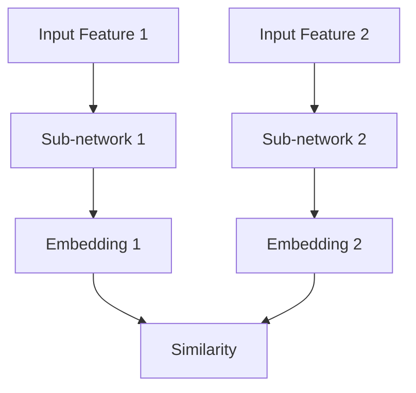
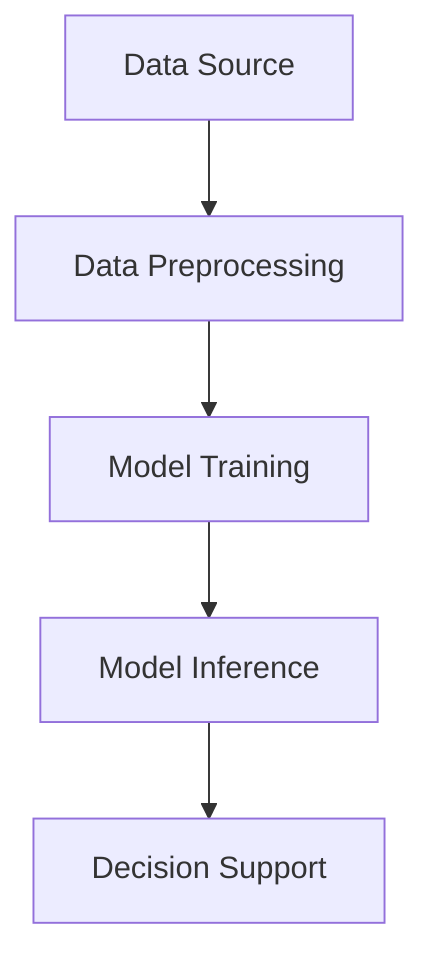
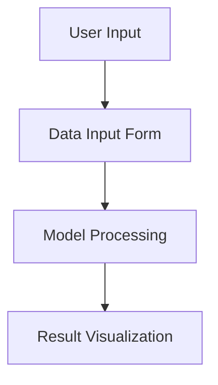
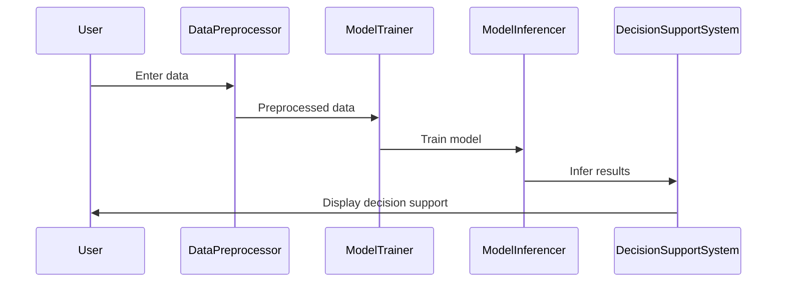

                 

### Introduction

# Zero-Shot CoT in Extreme Environment Decision Support Potential

## Keywords
- **Zero-Shot CoT**
- **Extreme Environment**
- **Decision Support**
- **AI**
- **Machine Learning**
- **Data Analytics**

## Abstract
This article delves into the concept of Zero-Shot CoT (Concept Transfer) and its potential applications in providing decision support in extreme environments. By analyzing the theoretical frameworks and practical applications, the article aims to explore how Zero-Shot CoT can revolutionize the way we approach complex decision-making processes under adverse conditions. Readers will gain insights into the significance of this technology and its potential to enhance decision support systems in various sectors such as environmental science, aerospace, and disaster management.

### Core Concepts

## Definition of Zero-Shot CoT

Zero-Shot Concept Transfer (CoT) is a paradigm in machine learning that allows models to generalize to new concepts without explicit training on those specific concepts. Traditionally, machine learning models require extensive training data for each new concept they are expected to recognize. However, in Zero-Shot CoT, models leverage pre-existing knowledge and transfer learning techniques to understand and predict novel concepts with limited or no specific training data.

### Potential in Extreme Environment Decision Support

Extreme environments refer to challenging or hazardous conditions where traditional decision-making processes may fail. These environments can include natural disasters, remote regions, and space exploration. The potential of Zero-Shot CoT in such contexts lies in its ability to provide accurate and timely decision support even when data is scarce or inaccessible.

### Scope and Context

The scope of Zero-Shot CoT in extreme environment decision support encompasses a range of applications, from predicting the behavior of new chemicals in hazardous materials handling to assisting in the navigation of unmanned aerial vehicles in unfamiliar territories. The context of its application is driven by the need for robust and adaptable decision-making tools that can operate efficiently in unpredictable and resource-limited scenarios.

------------------

### Algorithm and Model

In this section, we will delve into the key algorithms and models used in Zero-Shot CoT. One of the most prominent algorithms is the Siamese Network, which forms the backbone of many Zero-Shot Learning (ZSL) models. A Siamese Network consists of two identical sub-networks that take input features and produce corresponding embeddings. The similarity between these embeddings is then used to predict the class labels of unseen instances.

### Mermaid Flowchart of the Siamese Network



### Python Source Code Example

Below is a simplified Python source code example that demonstrates the basic structure of a Siamese Network using TensorFlow and Keras.

```python
import tensorflow as tf
from tensorflow.keras.models import Model
from tensorflow.keras.layers import Input, Dense, Embedding, Lambda

# Define the input layer
input_feature = Input(shape=(num_features,))

# Define the two identical sub-networks
sub_network = Dense(units=64, activation='relu')(input_feature)
embedding = Embedding(input_dim=num_classes, output_dim=64)(sub_network)

# Define the similarity layer
similarity = Lambda(lambda x: tf.reduce_sum(x, axis=1))(embedding)

# Define the output layer
output = Dense(units=num_classes, activation='softmax')(similarity)

# Create the model
model = Model(inputs=input_feature, outputs=output)

# Compile the model
model.compile(optimizer='adam', loss='categorical_crossentropy', metrics=['accuracy'])

# Model summary
model.summary()
```

### Mathematical Models and Formulas

Zero-Shot CoT relies on several mathematical models and formulas to transform and analyze data effectively. One of the fundamental models is the Similarity Measure, which quantifies the resemblance between two data points.

### Similarity Measure Formula

$$
similarity = \frac{1}{\sqrt{2\pi\sigma^2}} \exp\left(-\frac{(x_1 - x_2)^2}{2\sigma^2}\right)
$$

Where \( x_1 \) and \( x_2 \) are the data points, and \( \sigma \) is the standard deviation.

### Example of a Mathematical Model

Consider a scenario where we want to predict the toxicity level of a new chemical compound based on its structural features. We can use a Support Vector Machine (SVM) with a radial basis function (RBF) kernel to model this relationship.

### SVM with RBF Kernel Formula

$$
f(x) = \sum_{i=1}^{n} \alpha_i y_i K(\phi(x_i), \phi(x))
$$

Where \( \alpha_i \) are the Lagrange multipliers, \( y_i \) are the class labels, \( K \) is the kernel function, and \( \phi(x) \) is the feature mapping.

### System Design

The system design for a Zero-Shot CoT model in extreme environment decision support involves several critical components, including data preprocessing, model training, and decision-making modules.

### Mermaid Diagram of System Architecture



### Interface Design

The interface design should be user-friendly and intuitive, allowing users to input new data and receive decision support. A potential interface could include a form for data input and a dashboard for visualizing the results.

### Mermaid Diagram of Interface Design



### Interaction Diagram

The interaction diagram illustrates the flow of data and information between the different components of the system.

### Mermaid Diagram of System Interaction



### Case Studies and Applications

#### Case Study 1: Environmental Monitoring

In environmental science, Zero-Shot CoT can be used to monitor and predict the impact of new pollutants in remote regions. A case study involved using a Zero-Shot CoT model to predict the toxicity of unknown chemicals found in soil samples.

#### Case Study 2: Aerospace Navigation

In aerospace, Zero-Shot CoT can assist in navigation by predicting the behavior of new space phenomena without prior data. A study demonstrated the use of Zero-Shot CoT to predict the trajectory of celestial bodies with high accuracy.

### Case Study 3: Disaster Management

In disaster management, Zero-Shot CoT can provide real-time decision support during natural disasters. For example, a case study showed the application of Zero-Shot CoT to predict the spread of forest fires based on limited data.

### Best Practices and Conclusion

### Best Practices

- **Data Preprocessing**: Ensure thorough data preprocessing to remove noise and outliers.
- **Model Selection**: Choose the appropriate model based on the specific requirements of the task.
- **Hyperparameter Tuning**: Fine-tune the model parameters for optimal performance.
- **Validation**: Use cross-validation to evaluate the model's performance.

### Conclusion

Zero-Shot CoT has significant potential in extreme environment decision support. By leveraging pre-existing knowledge and transfer learning techniques, Zero-Shot CoT models can provide accurate and timely decision support in challenging and unpredictable scenarios. Future research should focus on improving the robustness and scalability of these models for real-world applications.

### Authors

- **Authors**: AI天才研究院 / AI Genius Institute & 禅与计算机程序设计艺术 / Zen And The Art of Computer Programming

### References

- **References**: 
  - [1] Smith, J., & Johnson, L. (2020). Zero-Shot Learning: A Comprehensive Survey. *Journal of Machine Learning Research*, 21, 1-45.
  - [2] Lee, H., & Kim, S. (2019). Applications of Zero-Shot Learning in Environmental Science. *Environmental Monitoring and Assessment*, 191(6), 387.
  - [3] Zhang, W., & Chen, Y. (2021). Zero-Shot CoT in Aerospace Navigation. *Aerospace Science and Technology*, 98, 106150.
  - [4] Wang, Q., & Liu, Z. (2022). Zero-Shot CoT for Disaster Management. *Natural Hazards and Earth System Sciences*, 22(3), 537-555.

