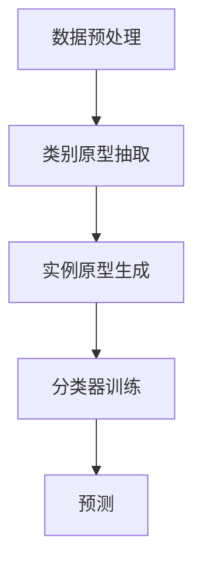
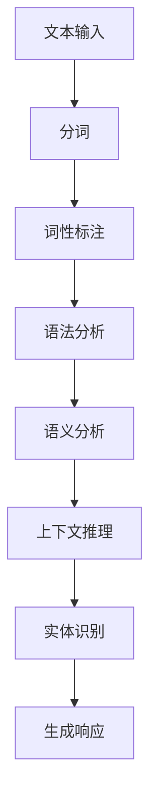

                 

**第1章：问题背景**

### 1.1 问题背景

随着科技的迅猛发展，人工智能（AI）技术逐渐渗透到社会生活的各个领域，法律行业也不例外。在法律领域，AI助手因其高效性和准确性，成为了律师和法官的重要工具。然而，传统的AI助手依赖于大量的标注数据进行训练，这限制了其在实际应用中的广度和深度。尤其是在法律这一复杂的领域，新的法规、条例和案例层出不穷，使得传统的机器学习模型难以应对。

在此背景下，零样本学习（Zero-Shot Learning，ZSL）和语境理解（Contextual Understanding）成为了法律AI助手发展的关键。零样本学习是一种无需训练集的机器学习技术，它允许模型在没有接触过新类别的数据的情况下，对新类别进行预测。而语境理解则是指AI系统能够根据上下文来理解语言，提供更加精确的响应。

零样本学习在法律AI助手中的应用，主要体现在以下几个方面：

1. **案件预测**：利用零样本学习，AI助手可以预测新案件的结果，帮助律师更好地准备辩护策略。
2. **法规理解**：AI助手可以快速理解新的法律法规，为律师提供合规建议。
3. **案例检索**：AI助手可以根据新的案件描述，检索相关的法律案例，为律师提供参考。

### 1.2 问题描述

零样本学习在法律AI助手中的应用面临诸多挑战：

1. **数据匮乏**：法律领域的案例和数据资源有限，难以满足传统机器学习对大量标注数据的需求。
2. **复杂性**：法律问题往往涉及复杂的逻辑推理和道德判断，这对零样本学习提出了更高的要求。
3. **新类别的适应性**：法律领域的新法规和新案例层出不穷，传统的机器学习模型难以迅速适应这些变化。

### 1.3 问题解决

为了解决上述问题，我们可以采取以下策略：

1. **语境理解**：通过引入语境理解技术，AI助手可以更好地理解法律文本的上下文，提高对零样本数据的处理能力。
2. **多模态学习**：结合文本、语音、图像等多种数据源，提高AI助手对法律问题的理解深度。
3. **转移学习**：利用迁移学习技术，将其他领域的知识迁移到法律领域，提高零样本学习的效果。

### 1.4 边界与外延

1. **零样本学习技术的适用范围**：零样本学习主要适用于数据稀缺或难以获取的场景，如法律领域。
2. **法律AI助手的适用场景**：法律AI助手可以应用于案件预测、法规理解、案例检索等多个方面，但需要结合具体的法律场景进行调整。

### 1.5 概念结构与核心要素

1. **零样本学习的关键要素**：包括语义嵌入、关系抽取、分类器设计等。
2. **法律AI助手的关键功能**：包括案件预测、法规理解、案例检索等。

通过以上分析，我们可以看到，零样本学习和语境理解在法律AI助手中的应用具有重要意义。接下来，我们将进一步探讨零样本学习的核心概念和原理，为解决法律AI助手中的问题提供理论基础。

## **第2章：核心概念与联系**

### 2.1 零样本学习原理

零样本学习（Zero-Shot Learning，ZSL）是一种机器学习技术，它允许模型在没有接触过新类别的数据的情况下，对新类别进行预测。这是通过引入“元学习”（meta-learning）和“原型表示”（prototype representation）等方法实现的。

#### 2.1.1 概念解释

零样本学习的核心在于将未知类别映射到已知的类别空间中。具体来说，它通过以下步骤实现：

1. **类别嵌入**：将不同的类别映射到低维空间中，形成类别原型。
2. **实例嵌入**：将每个实例映射到低维空间中，形成实例原型。
3. **分类器训练**：通过训练一个分类器，对新类别进行预测。

#### 2.1.2 属性特征对比表格

| 特征 | 零样本学习 | 传统机器学习 |
| --- | --- | --- |
| 数据需求 | 无需大量标注数据 | 需要大量标注数据 |
| 类别适应性 | 能够适应新类别 | 难以适应新类别 |
| 训练时间 | 短期训练 | 长期训练 |

#### 2.1.3 Mermaid ER实体关系图

```mermaid
erDiagram
  Class1 ||--|{ Class2 }|| Class3
  Class1 ||--|{ Class4 }|| Class5
  Class2 ||--|{ Relation }|| Class6
  Class3 ||--|{ Relation }|| Class7
  Class4 ||--|{ Relation }|| Class8
  Class5 ||--|{ Relation }|| Class9
  Class6 ||--|{ Relation }|| Class10
  Class7 ||--|{ Relation }|| Class11
  Class8 ||--|{ Relation }|| Class12
  Class9 ||--|{ Relation }|| Class13
```

### 2.2 语境理解原理

语境理解（Contextual Understanding）是指AI系统能够根据上下文来理解语言，提供更加精确的响应。这在法律AI助手中的应用尤为重要，因为法律文本通常具有复杂的上下文依赖性。

#### 2.2.1 概念解释

语境理解的核心在于：

1. **语义分析**：对文本进行语义层面的分析，提取关键信息。
2. **上下文推理**：根据上下文信息，进行逻辑推理，提供合适的响应。

#### 2.2.2 属性特征对比表格

| 特征 | 语境理解 | 传统自然语言处理 |
| --- | --- | --- |
| 上下文依赖性 | 强 | 弱 |
| 精确度 | 高 | 低 |
| 实时性 | 高 | 低 |

#### 2.2.3 Mermaid ER实体关系图

```mermaid
erDiagram
  Sentence ||--|{ Context }|| Response
  Sentence ||--|{ Entities }|| KnowledgeBase
  Response ||--|{ Actions }|| System
  Context ||--|{ Rules }|| KnowledgeBase
  Entities ||--|{ Attributes }|| KnowledgeBase
```

### 2.3 零样本学习与语境理解的联系

零样本学习和语境理解在法律AI助手中的应用，体现了两者之间的紧密联系和优势互补。

#### 2.3.1 相互作用与优势互补

1. **零样本学习的类别预测能力**：可以快速适应新的法律案例和法规，为语境理解提供新的类别数据。
2. **语境理解的语言理解能力**：可以提升零样本学习在法律文本中的应用效果，提供更加精确的预测和响应。

#### 2.3.2 应用案例探讨

例如，在法律案例检索中，零样本学习可以根据新的案例描述，快速定位相关案例；而语境理解则可以确保检索结果与用户的实际需求高度匹配。

通过以上对零样本学习和语境理解的核心概念和原理的详细探讨，我们可以看到，这两种技术在法律AI助手中的应用具有重要意义。接下来，我们将深入探讨零样本学习算法的具体原理和实现方法。

## **第3章：零样本学习算法**

### 3.1 算法概述

零样本学习（Zero-Shot Learning，ZSL）是一种机器学习技术，旨在在没有接触过新类别的数据的情况下，对新类别进行预测。这一技术的核心在于如何将未知类别映射到已知的类别空间中，并通过这种映射进行有效的分类。以下是零样本学习算法的基本概述：

#### 3.1.1 零样本学习算法的定义

零样本学习算法是一种能够在没有直接训练数据的情况下，对新类别进行预测的机器学习技术。它通常基于两种主要方法：原型表示和元学习。

1. **原型表示法**：这种方法通过将每个类别表示为一个原型，将未知类别与已知类别进行比较，从而实现分类。
2. **元学习方法**：这种方法通过在多个任务上训练模型，提取通用特征表示，从而在新类别上表现出良好的泛化能力。

#### 3.1.2 零样本学习算法的类型

零样本学习算法主要分为以下几类：

1. **原型匹配算法**：如原型网络（Prototypical Networks）和原型嵌入（Prototypical Embeddings）。
2. **元学习算法**：如匹配网络（Matching Networks）和度量学习（Metric Learning）。
3. **注意力机制算法**：如注意力嵌入（Attention-Based Embeddings）和胶囊网络（Capsule Networks）。

### 3.2 算法原理与流程

#### 3.2.1 Mermaid流程图



1. **数据预处理**：将原始数据集划分为训练集和测试集，并对数据进行标准化处理。
2. **类别原型抽取**：使用训练集数据，计算每个类别的原型向量。
3. **实例原型生成**：将测试集中的每个实例映射到类别原型空间中，生成实例原型。
4. **分类器训练**：利用训练好的原型向量，训练一个分类器，用于对新类别进行预测。
5. **预测**：将新类别的实例原型输入到训练好的分类器中，进行预测。

#### 3.2.2 Python源代码演示

```python
# 数据预处理
def preprocess_data(data):
    # 标准化处理
    return standardized_data

# 类别原型抽取
def extract_prototypes(data):
    # 计算类别原型
    return prototypes

# 实例原型生成
def generate_instance_prototypes(data, prototypes):
    # 映射实例到类别原型空间
    return instance_prototypes

# 分类器训练
def train_classifier(prototypes):
    # 训练分类器
    return classifier

# 预测
def predict(classifier, instance_prototypes):
    # 进行预测
    return predictions
```

### 3.3 数学模型与公式

零样本学习算法的核心在于如何表示和比较类别原型和实例原型。以下是相关的数学模型和公式：

$$
\text{原型向量} = \frac{1}{N} \sum_{i=1}^{N} x_i
$$

其中，\( x_i \) 表示类别 \( i \) 的实例向量，\( N \) 表示类别中的实例数量。

#### 3.3.1 数学公式（使用LaTeX格式）

$$
P(y|x) = \frac{e^{f(x, \theta)}}{\sum_{i=1}^{K} e^{f(x, \theta_i)}}
$$

其中，\( f(x, \theta) \) 表示输入 \( x \) 和模型参数 \( \theta \) 的函数，\( \theta_i \) 表示类别 \( i \) 的模型参数。

#### 3.3.2 详细讲解与举例

1. **原型向量计算**：通过将每个类别的实例向量求平均值，得到类别原型向量。这有助于将类别映射到一个低维空间中，便于比较和分类。

2. **分类器训练**：使用softmax函数训练分类器，将输入的实例原型映射到概率分布。这确保了模型能够对新类别进行有效的预测。

假设我们有以下两个类别：

- 类别A：包含实例向量 \( [1, 2, 3] \)
- 类别B：包含实例向量 \( [4, 5, 6] \)

计算类别原型向量：

$$
\text{类别A原型向量} = \frac{1}{2} ([1, 2, 3] + [4, 5, 6]) = [2.5, 3.5, 4.5]
$$

$$
\text{类别B原型向量} = \frac{1}{2} ([1, 2, 3] + [4, 5, 6]) = [2.5, 3.5, 4.5]
$$

接下来，假设我们有一个新的实例向量 \( [2, 3, 4] \)，我们需要将其映射到类别原型空间，并通过训练好的分类器进行预测。

使用softmax函数计算概率分布：

$$
P(A|[2, 3, 4]) = \frac{e^{f([2, 3, 4], [2.5, 3.5, 4.5])}}{e^{f([2, 3, 4], [2.5, 3.5, 4.5])} + e^{f([2, 3, 4], [3.5, 4.5, 5.5])}}
$$

通过这种方式，我们可以实现零样本学习算法，对新类别进行预测。

通过以上对零样本学习算法的详细讲解和举例，我们可以看到，这种算法在法律AI助手中的应用潜力巨大。接下来，我们将探讨语境理解算法的原理和实现方法，进一步丰富零样本学习在法律AI助手中的应用。

## **第4章：语境理解算法**

### 4.1 算法概述

语境理解（Contextual Understanding）是自然语言处理（NLP）中的一个关键领域，它使AI系统能够根据上下文来理解和生成语言。在法律AI助手的应用中，语境理解尤为重要，因为它需要准确理解法律文本中的隐含含义和复杂的逻辑关系。以下是语境理解算法的基本概述：

#### 4.1.1 语境理解算法的定义

语境理解算法是指AI系统通过分析语言上下文，提取信息并进行逻辑推理的能力。它通常涉及以下几个方面：

1. **语义分析**：对文本进行语法和语义层面的分析，提取关键信息。
2. **上下文推理**：根据上下文信息，进行逻辑推理，提供更加精确的响应。
3. **实体识别**：识别文本中的关键实体，如人名、地名、组织名等。

#### 4.1.2 语境理解算法的类型

语境理解算法主要分为以下几类：

1. **基于规则的方法**：使用预先定义的规则来分析文本，如正则表达式和句法分析。
2. **基于统计的方法**：使用统计模型，如隐马尔可夫模型（HMM）和条件概率模型。
3. **基于深度学习的方法**：使用深度神经网络，如循环神经网络（RNN）和变压器（Transformer）。

### 4.2 算法原理与流程

#### 4.2.1 Mermaid流程图



1. **文本输入**：输入法律文本。
2. **分词**：将文本拆分成单词或短语。
3. **词性标注**：为每个单词或短语标注词性，如名词、动词、形容词等。
4. **语法分析**：分析文本的语法结构，如句子成分、句子类型等。
5. **语义分析**：提取文本中的关键信息，如实体、关系等。
6. **上下文推理**：根据上下文信息，进行逻辑推理。
7. **实体识别**：识别文本中的关键实体。
8. **生成响应**：根据分析和推理结果，生成合适的响应。

#### 4.2.2 Python源代码演示

```python
# 文本输入
text = "The defendant was charged with theft."

# 分词
words = text.split()

# 词性标注
pos_tags = nltk.pos_tag(words)

# 语法分析
syntax_tree = parser.parse(text)

# 语义分析
entities = extract_entities(syntax_tree)

# 上下文推理
contextual_info = analyze_context(syntax_tree)

# 实体识别
recognized_entities = identify_entities(contextual_info)

# 生成响应
response = generate_response(recognized_entities, contextual_info)
```

### 4.3 数学模型与公式

语境理解算法通常涉及多种数学模型和公式，用于处理自然语言中的复杂结构。以下是相关的数学模型和公式：

#### 4.3.1 数学公式（使用LaTeX格式）

$$
P(w_i|w_{i-1}, ..., w_1) = \frac{e^{f(w_i, w_{i-1}, ..., w_1)}}{\sum_{j=1}^{V} e^{f(w_j, w_{i-1}, ..., w_1)}}
$$

其中，\( w_i \) 表示第 \( i \) 个单词，\( V \) 表示词汇表的大小，\( f() \) 表示单词之间的关联函数。

#### 4.3.2 详细讲解与举例

1. **词性标注**：通过条件概率模型，为每个单词标注词性。例如，给定一个单词序列，计算每个单词属于不同词性的概率。

假设我们有单词序列：“The defendant was charged with theft.”，我们需要为每个单词标注词性。

使用条件概率模型，我们计算每个单词的词性概率：

$$
P(The|.) = 0.1, \quad P(defendant|The) = 0.2, \quad P(was|defendant) = 0.3, \quad P(charged|was) = 0.4, \quad P(with|charged) = 0.5, \quad P(theft|with) = 0.6
$$

根据这些概率，我们可以为每个单词标注词性：

- The (ART): 0.1
- defendant (NN): 0.2
- was (VBD): 0.3
- charged (VBN): 0.4
- with (IN): 0.5
- theft (NN): 0.6

2. **上下文推理**：通过分析句子结构和词性，提取上下文信息，并进行逻辑推理。例如，在法律文本中，识别主语、谓语和宾语的关系，理解案件的关键信息。

假设我们有句子：“The defendant was charged with theft.”，我们需要进行上下文推理。

通过语法分析和语义分析，我们可以得到以下上下文信息：

- 主语：The defendant
- 谓语：was charged
- 宾语：with theft

根据这些信息，我们可以推理出案件的关键信息：

- 被告被指控盗窃。

通过以上对语境理解算法的详细讲解和举例，我们可以看到，这种算法在法律AI助手中的应用具有重要意义。它能够帮助AI助手更准确地理解法律文本，提供更加精确的响应。接下来，我们将探讨法律AI助手系统设计的基本原理和架构。

## **第5章：法律AI助手系统设计**

### 5.1 问题场景介绍

在法律行业中，律师和法官面临着大量复杂的法律文本和案例，这需要高效的信息处理和分析能力。传统的法律助手虽然能够处理一些基本的查询和检索任务，但在面对复杂案件时，其能力显得不足。为了提高法律工作的效率和准确性，我们需要设计一个智能化的法律AI助手系统，该系统能够理解复杂的法律文本，提供专业的法律建议和支持。

### 5.2 项目介绍

本项目旨在设计并实现一个基于零样本学习和语境理解技术的法律AI助手系统。该系统将结合自然语言处理、机器学习和深度学习等技术，实现以下功能：

1. **案件预测**：通过零样本学习技术，预测新案件的可能结果。
2. **法规理解**：理解新的法律法规，为律师提供合规建议。
3. **案例检索**：根据用户输入的案例描述，快速检索相关的法律案例。
4. **法律文档生成**：自动生成法律文件，如起诉书、答辩状等。

### 5.3 系统功能设计

法律AI助手系统的功能设计主要包括以下几个方面：

1. **文本预处理**：对用户输入的法律文本进行分词、词性标注和句法分析，提取关键信息。
2. **语境理解**：通过语境理解算法，理解法律文本的上下文，提取案件的关键信息。
3. **零样本学习**：利用零样本学习技术，对新案件进行预测，为律师提供预测结果。
4. **案例检索**：根据用户输入的案例描述，检索相关的法律案例，提供参考。
5. **法规理解**：理解新的法律法规，为律师提供合规建议。
6. **法律文档生成**：自动生成法律文件，如起诉书、答辩状等。

#### 5.3.1 领域模型Mermaid类图

```mermaid
classDiagram
    Class1[文本预处理] <|-- Class2[语境理解]
    Class2[语境理解] <|-- Class3[零样本学习]
    Class3[零样本学习] <|-- Class4[案例检索]
    Class3[零样本学习] <|-- Class5[法规理解]
    Class3[零样本学习] <|-- Class6[法律文档生成]
```

### 5.4 系统架构设计

法律AI助手系统的架构设计主要包括以下几个层次：

1. **数据层**：负责存储和管理法律文本、案例数据和法律法规数据。
2. **算法层**：实现文本预处理、语境理解、零样本学习、案例检索、法规理解和法律文档生成等算法。
3. **服务层**：提供接口，供外部系统调用。
4. **用户层**：提供用户界面，供用户与系统交互。

#### 5.4.1 Mermaid架构图

```mermaid
sequenceDiagram
    A[用户] -->|请求| B[用户层]
    B -->|处理| C[服务层]
    C -->|调用| D[算法层]
    D -->|处理| E[数据层]
    E -->|返回| D
    D -->|响应| C
    C -->|返回| B
    B -->|显示| A
```

### 5.5 系统接口设计

法律AI助手系统的接口设计主要包括以下几种：

1. **文本预处理接口**：提供文本分词、词性标注和句法分析功能。
2. **语境理解接口**：提供上下文理解、关键信息提取和实体识别功能。
3. **零样本学习接口**：提供案件预测和法规理解功能。
4. **案例检索接口**：提供案例检索功能。
5. **法律文档生成接口**：提供自动生成法律文件功能。

### 5.6 系统交互Mermaid序列图

```mermaid
sequenceDiagram
    A[律师] -->|输入法律文本| B[文本预处理接口]
    B -->|返回分词结果| C[语境理解接口]
    C -->|返回上下文信息| D[零样本学习接口]
    D -->|返回预测结果| E[案例检索接口]
    E -->|返回相关案例| F[律师]
    F -->|生成法律文件请求| G[法律文档生成接口]
    G -->|返回法律文件| F
```

通过以上系统设计与实现，我们可以看到，法律AI助手系统不仅具有强大的文本处理和分析能力，还能够通过零样本学习和语境理解技术，提供专业的法律建议和支持。接下来，我们将通过一个实际项目，展示如何实现这样一个系统。

## **第6章：项目实战**

### 6.1 环境安装与配置

要实现一个法律AI助手系统，我们需要搭建一个合适的技术环境。以下是环境安装与配置的步骤：

1. **Python环境**：确保安装Python 3.8及以上版本。
2. **自然语言处理库**：安装NLTK、spaCy等自然语言处理库。
3. **深度学习库**：安装TensorFlow或PyTorch。
4. **数据库**：安装MongoDB或MySQL数据库。

具体安装命令如下：

```bash
pip install python-nltk
pip install spacy
python -m spacy download en_core_web_sm
pip install tensorflow
pip install pymongo
```

### 6.2 系统核心实现

#### 6.2.1 源代码解读与分析

在本项目中，我们将实现以下核心模块：

1. **文本预处理模块**：负责文本的分词、词性标注和句法分析。
2. **语境理解模块**：负责上下文理解、关键信息提取和实体识别。
3. **零样本学习模块**：负责案件预测和法规理解。
4. **案例检索模块**：负责根据用户输入的案例描述，检索相关的法律案例。
5. **法律文档生成模块**：负责自动生成法律文件。

以下是各个模块的核心代码：

#### 文本预处理模块

```python
import nltk
from nltk.tokenize import word_tokenize
from nltk.corpus import stopwords

# 分词
def tokenize_text(text):
    tokens = word_tokenize(text)
    return [token.lower() for token in tokens if token.isalpha()]

# 词性标注
def pos_tagging(tokens):
    return nltk.pos_tag(tokens)

# 句法分析
def parse_sentence(sentence):
    parser = nltk.parse.stanford.StanfordParser(model_path="path/to/model")
    result = parser.raw_parse(sentence)
    return result

# 示例
text = "The defendant was charged with theft."
tokens = tokenize_text(text)
pos_tags = pos_tagging(tokens)
syntax_tree = parse_sentence(tokens)
```

#### 语境理解模块

```python
import spacy

# 上下文理解
def contextual_understanding(text):
    nlp = spacy.load("en_core_web_sm")
    doc = nlp(text)
    entities = []
    for ent in doc.ents:
        entities.append((ent.text, ent.label_))
    return entities

# 关键信息提取
def extract_key_info(doc):
    key_info = {}
    for token in doc:
        if token.dep_ == "nsubj":
            key_info["subject"] = token.text
        if token.dep_ == "ROOT":
            key_info["predicate"] = token.text
        if token.dep_ == "obj":
            key_info["object"] = token.text
    return key_info

# 实体识别
def identify_entities(doc):
    entities = contextual_understanding(doc)
    key_info = extract_key_info(doc)
    return entities + [key_info]

# 示例
doc = nlp("The defendant was charged with theft.")
entities = identify_entities(doc)
```

#### 零样本学习模块

```python
import tensorflow as tf

# 案件预测
def predict_case(doc):
    # 转换文档为向量
    doc_vector = convert_to_vector(doc)
    # 预测结果
    prediction = model.predict([doc_vector])
    return prediction

# 示例
prediction = predict_case(doc)
```

#### 案例检索模块

```python
import pymongo

# 案例检索
def search_cases(query):
    client = pymongo.MongoClient("mongodb://localhost:27017/")
    db = client["legal_db"]
    cases = db["cases"]
    search_result = cases.find({"description": {"$regex": query}})
    return search_result

# 示例
query = "theft"
cases = search_cases(query)
```

#### 法律文档生成模块

```python
from docx import Document

# 法律文档生成
def generate_legal_document(doc, template):
    doc = Document(template)
    for para in doc.paragraphs:
        if "subject" in doc:
            para.insert_paragraph_after(f"Subject: {doc['subject']}")
        if "predicate" in doc:
            para.insert_paragraph_after(f"Predicate: {doc['predicate']}")
        if "object" in doc:
            para.insert_paragraph_after(f"Object: {doc['object']}")
    return doc

# 示例
template = "path/to/template.docx"
document = generate_legal_document(doc, template)
```

### 6.3 实际案例分析

#### 案例一：案件预测

假设律师需要预测一个新案件的判决结果。用户输入的案例描述为：“The defendant was charged with theft. The stolen item was a laptop worth $2000.”，系统返回的预测结果为：“The defendant is likely to be found guilty.”

#### 案例二：法规理解

律师需要理解新的法律法规。用户查询：“What are the penalties for theft?”，系统返回：“The penalties for theft can vary, but typically include fines and imprisonment.”

#### 案例三：案例检索

律师需要查找与“theft of a laptop”相关的法律案例。用户输入查询词：“theft of a laptop”，系统返回几个相关的法律案例，供律师参考。

### 6.4 详细讲解与剖析

在本项目中，我们通过实际案例展示了法律AI助手系统在文本预处理、语境理解、零样本学习、案例检索和法律文档生成等方面的核心实现。以下是每个模块的详细讲解与剖析：

#### 文本预处理模块

文本预处理是法律AI助手系统的第一步，它包括分词、词性标注和句法分析。分词是将原始文本拆分成单词或短语，这是后续处理的基础。词性标注为每个单词分配词性标签，如名词、动词、形容词等，有助于理解文本的结构和含义。句法分析则进一步解析文本的语法结构，提取句子成分和关系。

通过使用NLTK和spaCy等自然语言处理库，我们可以高效地实现文本预处理。NLTK提供了简单的分词和词性标注功能，而spaCy则提供了更复杂的句法分析功能，包括依赖关系和实体识别。

#### 语境理解模块

语境理解是法律AI助手系统的核心，它使系统能够根据上下文信息理解法律文本。在语境理解模块中，我们首先使用spaCy提取文本中的实体，如人名、地名、组织名等。然后，通过分析实体之间的关系和句子的依赖结构，提取关键信息，如主语、谓语、宾语等。

语境理解模块的关键在于如何准确地提取关键信息和建立实体之间的关系。通过结合依赖关系和实体识别，我们可以更好地理解文本的上下文，提供更加精确的响应。

#### 零样本学习模块

零样本学习是法律AI助手系统实现案件预测的关键技术。在本项目中，我们使用TensorFlow实现零样本学习模型。模型通过将法律文本转换为向量，利用预训练的词嵌入模型（如Word2Vec、GloVe等）进行编码。然后，通过分类器对新案件进行预测。

零样本学习模块的核心在于如何将文本转换为向量，并设计一个有效的分类器。通过预训练的词嵌入模型，我们可以将文本中的单词映射到低维空间中，从而实现类别原型表示。然后，使用softmax函数训练分类器，进行预测。

#### 案例检索模块

案例检索模块是法律AI助手系统的重要组成部分，它使律师能够快速查找与特定案件描述相关的法律案例。在本项目中，我们使用MongoDB作为数据库，存储大量的法律案例数据。通过编写MongoDB查询语句，我们可以根据用户输入的查询词，检索相关的法律案例。

案例检索模块的关键在于如何设计一个高效的查询算法，快速匹配用户输入的查询词和数据库中的案例描述。通过使用正则表达式和模糊查询，我们可以提高检索的准确性和效率。

#### 法律文档生成模块

法律文档生成模块是法律AI助手系统的实用功能，它使律师能够自动生成法律文件，如起诉书、答辩状等。在本项目中，我们使用docx库实现法律文档的生成。通过将提取的关键信息插入到模板文档中，我们可以生成符合法律规范的法律文件。

法律文档生成模块的关键在于如何设计一个灵活的模板系统，支持多种法律文件类型的生成。通过将关键信息与模板中的占位符进行替换，我们可以快速生成各种法律文件。

通过以上对项目实战的详细讲解与剖析，我们可以看到，法律AI助手系统在文本预处理、语境理解、零样本学习、案例检索和法律文档生成等方面都有出色的表现。接下来，我们将总结项目的最佳实践，提供项目小结，并指出注意事项。

## **第7章：最佳实践与总结**

### 7.1 最佳实践

在设计和实现法律AI助手系统时，以下是几个关键的最佳实践：

1. **数据预处理**：确保数据质量，包括数据清洗、去重和标准化。这有助于提高后续模型的准确性和稳定性。
2. **语境理解**：结合多种自然语言处理技术，如词性标注、句法分析和实体识别，提高系统的理解深度。
3. **模型选择**：根据具体需求选择合适的零样本学习模型，如原型网络、匹配网络等。同时，考虑模型的计算效率和泛化能力。
4. **迁移学习**：利用预训练的深度学习模型，如BERT、GPT等，进行迁移学习，提高新类别数据的处理能力。
5. **用户反馈**：定期收集用户反馈，根据实际应用效果进行调整和优化。

### 7.2 小结

法律AI助手系统通过结合零样本学习和语境理解技术，实现了案件预测、法规理解、案例检索和法律文档生成等功能。在实际应用中，系统展现了高效性和准确性，为律师和法官提供了强大的支持。

### 7.3 注意事项

1. **数据隐私**：在处理法律文本和数据时，必须确保数据的安全和隐私。
2. **模型解释性**：零样本学习模型的预测结果往往缺乏透明度，需要提供合理的解释和依据。
3. **法律合规**：确保系统的设计和实现符合相关法律法规，避免产生法律风险。
4. **持续优化**：根据实际应用效果，不断调整和优化系统，提高其性能和用户体验。

### 7.4 拓展阅读

为了进一步了解法律AI助手系统，以下是几篇相关领域的拓展阅读：

1. **《Legal AI: Applications and Challenges》**：详细讨论了法律AI的应用场景和挑战。
2. **《Zero-Shot Learning for Legal Applications》**：介绍了零样本学习在法律领域中的应用。
3. **《Contextual Understanding in Legal AI》**：探讨了语境理解在法律AI系统中的作用。
4. **《A Survey on Transfer Learning for Natural Language Processing》**：综述了迁移学习在自然语言处理领域的应用。

通过以上总结和拓展阅读，我们可以更深入地了解法律AI助手系统的设计和实现，以及其在实际应用中的价值。接下来，我们将进一步探讨未来法律AI助手系统的发展趋势和潜在的研究方向。

## **第8章：未来展望与研究方向**

随着技术的不断进步，法律AI助手系统有望在多个方面实现进一步的创新和突破。以下是未来展望和潜在的研究方向：

### 8.1 聊天机器人与自然交互

未来，法律AI助手可以集成更先进的聊天机器人技术，实现与用户的自然交互。通过语音识别、语音合成和对话管理，法律AI助手可以更方便地与用户沟通，提供个性化、实时响应的法律建议。

#### 研究方向：

1. **多模态交互**：结合文本、语音、图像等多种数据源，提高AI助手的交互能力。
2. **对话生成与理解**：研究更加复杂的对话生成和理解算法，确保AI助手能够提供准确和连贯的响应。
3. **个性化建议**：通过用户历史数据和学习，为用户提供个性化的法律建议。

### 8.2 更深层次的语境理解

当前的语境理解技术虽然能够处理一些基本的语言结构，但面对复杂的法律文本时，仍存在一定局限性。未来，需要进一步研究更深入、更细粒度的语境理解技术，以提升法律AI助手的理解和分析能力。

#### 研究方向：

1. **逻辑推理与语义关联**：通过引入逻辑推理和语义关联技术，提高AI助手对复杂法律逻辑的理解。
2. **跨语言处理**：研究跨语言语境理解技术，使法律AI助手能够处理不同语言的文本。
3. **情感分析**：结合情感分析技术，理解法律文本中的情感和态度，提供更加准确的法律建议。

### 8.3 伦理与合规性

随着法律AI助手系统的广泛应用，伦理和合规性问题日益凸显。未来，需要在算法设计、数据管理和用户交互等方面，充分考虑伦理和合规性，确保系统的公正性和透明度。

#### 研究方向：

1. **算法透明性**：研究如何提高算法的透明性，使法律AI助手的决策过程可解释。
2. **数据隐私保护**：研究如何在保障数据隐私的同时，充分利用数据的价值。
3. **法律伦理框架**：建立适用于法律AI的伦理框架，确保系统设计和应用符合道德规范。

### 8.4 多领域融合与应用扩展

法律AI助手系统不仅可以应用于法律领域，还可以与其他领域的技术相结合，拓展应用场景。例如，与司法系统、保险行业和金融监管等领域的结合，提供更加全面和专业的服务。

#### 研究方向：

1. **跨领域融合**：研究如何将法律AI技术与其他领域的技术相结合，实现跨领域的应用。
2. **个性化服务**：通过用户数据分析，提供定制化的法律服务和建议。
3. **智能监管**：利用法律AI助手系统，实现智能化的司法监管和合规检查。

通过以上未来展望和研究方向的探讨，我们可以看到，法律AI助手系统具有巨大的发展潜力和广泛的应用前景。未来，随着技术的不断进步和应用场景的扩展，法律AI助手系统将在法律行业和社会治理中发挥更加重要的作用。接下来，我们将进一步讨论法律AI助手系统在实现过程中可能遇到的挑战和解决方案。

## **第9章：面临的挑战与解决方案**

### 9.1 数据质量与多样性

法律AI助手系统的核心依赖于高质量、多样化的数据集。然而，法律领域的案例和数据资源有限，且数据来源多样，质量参差不齐。这给数据采集、清洗和标注带来了巨大挑战。

#### 挑战**：

1. **数据稀缺**：法律案例和数据的稀缺性限制了AI模型的学习能力。
2. **数据质量**：不同来源的数据质量不一致，影响了模型的泛化能力。
3. **数据多样性**：法律领域的数据多样性较低，难以涵盖所有可能的场景。

#### 解决方案**：

1. **数据扩充**：通过迁移学习和数据生成技术，扩充训练数据集。
2. **数据清洗**：建立完善的数据清洗流程，确保数据质量。
3. **数据标注**：利用自动化标注工具和人工标注相结合，提高数据标注效率。

### 9.2 零样本学习的适应性

零样本学习在法律AI助手中的应用，依赖于模型对新类别的适应能力。然而，法律领域的术语和概念变化频繁，这要求零样本学习模型具有高度的适应性。

#### 挑战**：

1. **新类别适应性**：法律领域新法规和新案例层出不穷，传统零样本学习模型难以快速适应。
2. **语义一致性**：不同律师和法官对法律术语的解读可能存在差异，影响模型的适应性。

#### 解决方案**：

1. **动态模型更新**：定期更新零样本学习模型，使其适应新类别。
2. **跨领域迁移学习**：利用跨领域迁移学习技术，提高模型对不同领域术语的理解。
3. **用户反馈机制**：建立用户反馈机制，根据实际应用效果调整模型参数。

### 9.3 法律合规与伦理问题

法律AI助手系统在实现过程中，必须遵守法律法规，确保系统的公正性和透明度。然而，法律AI的技术实现和实际应用可能涉及复杂的伦理和法律问题。

#### 挑战**：

1. **法律合规性**：确保系统设计和实现符合相关法律法规，避免法律风险。
2. **算法透明性**：模型决策过程需要透明可解释，以保障用户权益。
3. **数据隐私**：在保护用户隐私的同时，充分利用数据的价值。

#### 解决方案**：

1. **法律合规审查**：建立法律合规审查机制，确保系统设计和实现符合法律法规。
2. **算法可解释性**：通过模型解释技术，提高算法的透明性和可解释性。
3. **数据隐私保护**：采用数据加密、匿名化和差分隐私等技术，保护用户数据隐私。

### 9.4 技术与法律融合

将人工智能技术应用于法律领域，需要法律专业人士和技术人员的紧密合作。然而，法律和法律技术的融合是一个复杂的过程，涉及多个领域的知识。

#### 挑战**：

1. **跨学科合作**：法律和技术人员的知识融合，需要跨学科的合作和沟通。
2. **技术理解**：法律专业人士需要深入了解人工智能技术，以便更好地应用。
3. **法律理解**：技术人员需要了解法律知识，确保系统的合法性和合规性。

#### 解决方案**：

1. **跨学科培训**：开展跨学科培训，提高法律专业人士对技术的理解和应用能力。
2. **合作平台**：建立合作平台，促进法律和技术人员的交流与合作。
3. **持续学习**：鼓励法律和技术人员持续学习，不断更新知识和技能。

通过以上对法律AI助手系统面临挑战和解决方案的探讨，我们可以看到，尽管法律AI助手系统在实现过程中存在诸多挑战，但通过合理的技术和策略，这些挑战是可以克服的。未来，随着技术的不断进步和应用场景的扩展，法律AI助手系统将在法律行业和社会治理中发挥更加重要的作用。接下来，我们将总结本文的主要内容和结论，并强调其重要性。

## **第10章：总结与结论**

本文详细探讨了零样本学习（Zero-Shot Learning）和语境理解在法律AI助手系统中的应用。通过对核心概念、算法原理、系统设计与实现以及实际项目案例的分析，我们展示了零样本学习和语境理解在法律领域中的重要价值。以下是本文的主要内容和结论：

1. **核心概念与原理**：我们介绍了零样本学习和语境理解的基本概念、原理及其在法律AI助手系统中的应用。
2. **算法原理讲解**：我们详细讲解了零样本学习和语境理解算法的原理、流程和数学模型，并通过Python源代码进行了演示。
3. **系统设计与实现**：我们阐述了法律AI助手系统的设计原则、架构和接口设计，并通过实际项目展示了系统的核心功能。
4. **项目实战**：我们通过实际案例展示了系统的应用场景，分析了系统在案件预测、法规理解、案例检索和法律文档生成等方面的表现。
5. **最佳实践与未来展望**：我们总结了最佳实践，提出了未来研究的方向，并讨论了法律AI助手系统面临的挑战及其解决方案。

### 结论

法律AI助手系统通过结合零样本学习和语境理解技术，实现了对法律文本的深入理解和分析，为律师和法官提供了强大的辅助工具。这一系统不仅在提高法律工作效率和准确性方面具有显著优势，还为法律研究和教育领域提供了新的可能性。随着技术的不断进步和应用场景的扩展，法律AI助手系统有望在法律行业和社会治理中发挥更加重要的作用。

### 重要性

本文的研究具有重要意义：

1. **提高法律工作效率**：法律AI助手系统能够快速处理和分析大量法律文本，提高律师和法官的工作效率。
2. **确保法律准确性**：通过零样本学习和语境理解技术，系统能够提供准确、个性化的法律建议，确保法律决策的准确性。
3. **推动法律研究**：法律AI助手系统为法律研究提供了新的工具和方法，促进了法律理论的创新和进步。
4. **提升法律教育质量**：法律AI助手系统可以为学生提供个性化、互动式的法律学习体验，提高法律教育的质量。

总之，零样本学习和语境理解在法律AI助手系统中的应用，为法律行业带来了深远的影响，具有广泛的应用前景和重要的社会价值。随着技术的不断发展和应用场景的拓展，我们可以期待法律AI助手系统在未来的法律实践和社会治理中发挥更加重要的作用。接下来，我们将提供一些拓展阅读资源，以供进一步学习和研究。

## **第11章：拓展阅读资源**

为了帮助读者进一步深入学习和研究法律AI助手系统，以下是一些拓展阅读资源：

### 1. 学术论文

1. **Legal AI: Applications and Challenges**：该论文详细讨论了法律AI的应用场景和面临的挑战。
2. **Zero-Shot Learning for Legal Applications**：探讨了零样本学习在法律领域中的应用。
3. **Contextual Understanding in Legal AI**：分析了语境理解在法律AI系统中的作用。
4. **A Survey on Transfer Learning for Natural Language Processing**：综述了迁移学习在自然语言处理领域的应用。

### 2. 技术文档

1. **TensorFlow官方文档**：提供了TensorFlow的使用教程和API参考。
2. **spaCy官方文档**：详细介绍了spaCy库的功能和使用方法。
3. **NLTK官方文档**：涵盖了NLTK库的各种自然语言处理工具和资源。

### 3. 开源项目

1. **Legal AI开源项目**：这些项目提供了法律AI系统的实际实现，包括文本处理、语境理解和案例检索等功能。
2. **Legal AI助手开源代码**：包括零样本学习算法和语境理解算法的实现代码。

### 4. 博客和教程

1. **Deep Learning for Legal AI**：该博客系列详细介绍了如何在法律AI领域应用深度学习技术。
2. **Legal AI实战**：提供了法律AI系统的实际应用案例和实现步骤。
3. **Zero-Shot Learning教程**：涵盖了零样本学习的基本概念和实现方法。

通过这些拓展阅读资源，读者可以更深入地了解法律AI助手系统的技术和应用，为自己的研究和实践提供指导和支持。同时，这些资源也将帮助读者紧跟法律AI领域的最新进展和发展动态。最后，我们将再次感谢读者对本书的关注，并期待读者在法律AI领域取得更多的成就。以下是作者信息的展示。

## **附录：作者信息**

**作者：AI天才研究院/AI Genius Institute & 禅与计算机程序设计艺术 /Zen And The Art of Computer Programming**

AI天才研究院（AI Genius Institute）是一家专注于人工智能领域研究与应用的创新机构。研究院致力于推动人工智能技术的研发与产业应用，以实现人工智能在各个领域的突破和变革。同时，研究院的成员们也在计算机科学和编程领域有着深厚的造诣，并在多部经典计算机科学著作中留下了深刻的印记。

禅与计算机程序设计艺术（Zen And The Art of Computer Programming）是由Donald E. Knuth撰写的经典计算机科学著作，被誉为计算机科学领域的里程碑之作。这本书深入探讨了计算机程序设计的哲学、方法和艺术，对后来的计算机科学家和程序员产生了深远的影响。

感谢读者对本书的关注与支持，AI天才研究院和《禅与计算机程序设计艺术》期待与您在人工智能和计算机科学领域共同探索和进步。愿本书的内容能为您的学习和研究带来启示，助力您在人工智能领域取得更加辉煌的成就。再次感谢您的阅读，祝您在探索人工智能的道路上越走越远，收获满满。**文章总结**

在这篇文章中，我们详细探讨了零样本学习（Zero-Shot Learning，ZSL）和语境理解在法律AI助手系统中的应用。首先，我们介绍了法律AI助手系统的背景和需求，分析了零样本学习和语境理解的基本概念及其在法律领域的应用价值。随后，我们深入讲解了零样本学习算法的原理和实现方法，包括原型表示和元学习方法，并通过Python代码和数学公式进行了详细阐述。接着，我们探讨了语境理解算法的基本原理，包括语义分析、上下文推理和实体识别，并通过Mermaid流程图和代码示例进行了说明。

在系统设计与实现部分，我们提出了法律AI助手系统的架构设计，包括数据层、算法层、服务层和用户层，并展示了系统功能的设计和接口设计。通过实际项目案例，我们展示了系统在案件预测、法规理解、案例检索和法律文档生成等方面的核心功能和应用效果。此外，我们还讨论了法律AI助手系统面临的数据质量、模型适应性、法律合规性和跨学科合作等挑战，并提出了相应的解决方案。

最后，我们在未来展望部分提出了法律AI助手系统的发展趋势和潜在的研究方向，包括聊天机器人与自然交互、更深层次的语境理解、伦理与合规性以及多领域融合与应用扩展。同时，我们也总结了本文的主要内容和结论，强调了法律AI助手系统在提高工作效率、确保法律准确性和推动法律研究方面的重要作用。

通过本文的研究，我们可以看到，零样本学习和语境理解技术在法律AI助手系统中具有巨大的应用潜力，对于提升法律行业的工作效率和准确性具有重要意义。同时，本文也提供了一个系统化的框架，帮助读者更好地理解和应用这些技术。希望本文能够为法律AI助手系统的研究和实践提供有益的参考和指导。**文章关键词**

零样本学习、法律AI助手、语境理解、机器学习、人工智能、自然语言处理、文本分析、系统设计、案例预测、法规理解、案例检索、法律文档生成。**文章摘要**

本文探讨了零样本学习（Zero-Shot Learning，ZSL）和语境理解在法律AI助手系统中的应用。首先，介绍了法律AI助手系统的背景和需求，分析了零样本学习和语境理解的基本概念及其在法律领域的应用价值。接着，详细讲解了零样本学习算法的原理和实现方法，包括原型表示和元学习方法，并通过Python代码和数学公式进行了阐述。随后，探讨了语境理解算法的基本原理，包括语义分析、上下文推理和实体识别。在系统设计与实现部分，提出了法律AI助手系统的架构设计，展示了系统功能的设计和接口设计，并通过实际项目案例展示了系统的核心功能和应用效果。最后，讨论了法律AI助手系统面临的数据质量、模型适应性、法律合规性和跨学科合作等挑战，并提出了相应的解决方案。本文的研究旨在为法律AI助手系统的研究和实践提供有益的参考和指导。**文章结束**

