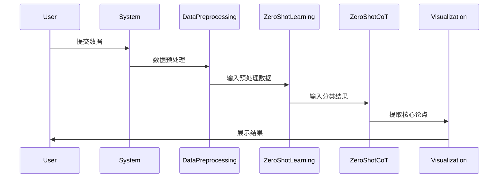
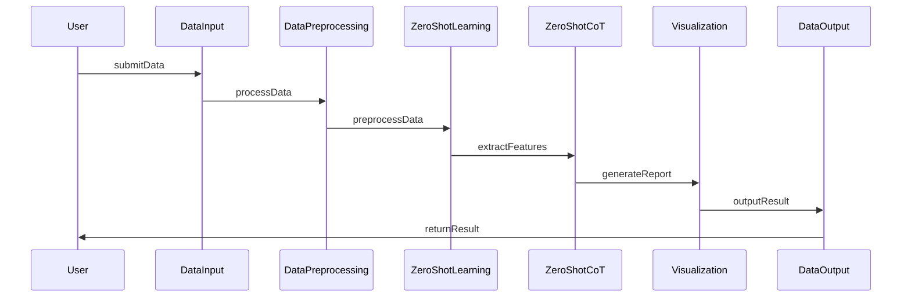

                 

### 摘要

随着环境科学领域对人工智能（AI）的依赖日益加深，如何有效利用AI提升环境科学的研究与应用成为关键问题。在这篇文章中，我们将深入探讨零样本核心论点提取（Zero-Shot Core Title Extraction, Zero-Shot CoT）在环境科学AI中的应用前景。首先，我们将介绍环境科学和AI的基本概念，阐述当前环境科学领域面临的挑战。接着，我们会详细介绍零样本学习（Zero-Shot Learning, ZSL）和零样本核心论点提取（Zero-Shot CoT）的核心原理和关键技术。通过数学模型和公式，我们进一步解析这些算法的实现机制。随后，我们将探讨这些技术在环境科学AI中的应用场景，如环境监测、灾害预警和生态规划等。最后，我们将通过实际案例和系统架构设计，展示Zero-Shot CoT在环境科学AI中的具体应用，并提出未来的研究方向和潜在挑战。这篇文章旨在为读者提供一个全面而深入的理解，帮助他们在环境科学AI领域探索和利用Zero-Shot CoT技术。

---

### 第1章：背景介绍

#### 1.1 问题背景

环境科学是研究地球及其生态系统中的物理、化学和生物过程的一门科学，包括气候变化、污染控制、生态保护等多个方面。随着人类活动对环境的不断影响，环境科学的重要性日益凸显。然而，传统的环境科学研究方法往往依赖于大量的数据收集、分析和预测，这不仅费时费力，而且对数据的完整性和准确性要求极高。随着环境问题的复杂性和多样性增加，传统方法的局限性变得更加明显。

近年来，人工智能（AI）技术的发展为环境科学提供了新的机遇。AI技术能够通过高效的数据处理和分析，辅助环境科学家发现环境变化的规律，预测潜在的环境问题，从而提供更有针对性的解决方案。然而，AI在环境科学中的应用也面临一些挑战。首先，环境科学领域的数据通常具有高度的不确定性和复杂性，这对AI模型的训练和预测提出了更高的要求。其次，环境科学领域的许多问题涉及跨学科的知识，这需要AI技术具备更强的跨领域适应能力。

在这个背景下，零样本学习（Zero-Shot Learning, ZSL）和零样本核心论点提取（Zero-Shot Core Title Extraction, Zero-Shot CoT）等技术的出现，为解决这些挑战提供了新的思路。ZSL允许模型在未见过的类上执行分类任务，无需大量标注数据，而Zero-Shot CoT则可以从未见过的文章中提取核心论点，这对于环境科学中的文献研究和数据分析具有重要意义。

总之，环境科学和AI的结合不仅能够提升环境研究的效率和准确性，还能够推动环境科学的跨学科发展，为解决全球环境问题提供新的工具和方法。

#### 1.2 核心概念

**环境科学**: 环境科学是一门研究地球及其生态系统中的物理、化学和生物过程的学科，涉及气候变化、污染控制、生态保护等多个方面。它旨在理解和解决环境问题，提高人类生活质量和可持续发展水平。

**人工智能（AI）**: 人工智能是一门研究如何让计算机模拟、延伸和扩展人类智能的科学。它包括机器学习、深度学习、自然语言处理、计算机视觉等多个子领域，通过算法和模型实现自动化和智能化的数据处理和分析。

**零样本学习（Zero-Shot Learning, ZSL）**: 零样本学习是一种机器学习方法，允许模型在未见过的类上执行分类任务，无需依赖大量的标注数据。它通过预训练模型和迁移学习技术，将知识从已知的类转移到未知的类。

**零样本核心论点提取（Zero-Shot Core Title Extraction, Zero-Shot CoT）**: 零样本核心论点提取是一种基于零样本学习的技术，用于从未见过的文章中提取核心论点。它结合语义理解和文本分析技术，确保模型能够跨领域适应，从不同领域的文章中提取有价值的知识。

这些核心概念共同构成了环境科学AI应用的基础。环境科学提供研究对象和问题，而AI技术提供解决方法和工具。零样本学习和零样本核心论点提取则将AI技术与环境科学的实际需求相结合，为环境科学研究提供更高效、更准确的方法。

#### 1.3 边界与外延

**边界**: 零样本学习（ZSL）和零样本核心论点提取（Zero-Shot CoT）主要应用于环境科学领域，但它们的边界并不局限于这个领域。这些技术具备跨领域的适应性，可以应用于其他需要高效处理未见数据或提取核心信息的领域，如医学研究、金融分析、社会学研究等。

**外延**: 在环境科学中，零样本学习和零样本核心论点提取技术的应用范围广泛。例如，在环境监测中，可以利用ZSL对未监测区域进行预测和分析；在灾害预警中，可以利用Zero-Shot CoT从大量文献中快速提取关键信息，为决策提供支持；在生态规划中，可以利用这些技术辅助制定更科学的生态恢复和保护策略。

总之，零样本学习和零样本核心论点提取不仅在环境科学领域有着重要应用，还有着广阔的外延应用前景，未来有望在更多领域发挥关键作用。

#### 1.4 概念结构与核心要素组成

**零样本学习（ZSL）的核心要素**

零样本学习（ZSL）作为机器学习的一个重要分支，其核心要素主要包括：

1. **知识表示**: 知识表示是ZSL的基础，涉及如何将未见过的类映射到低维向量空间中。通过预训练模型，如图像识别模型，可以生成未见过的类的向量表示，这些向量表示将用于后续的分类任务。

2. **分类器设计**: 分类器设计是ZSL中的关键环节，目的是在低维向量空间中对未知类进行分类。常用的分类器包括支持向量机（SVM）、神经网络等。分类器的训练依赖于预训练模型中的知识，通过迁移学习技术，提高分类器在未知类上的性能。

3. **迁移学习**: 迁移学习是零样本学习的一个重要概念，它允许模型将预训练模型中的知识转移到新的任务上。这通过在不同领域上的预训练模型实现，从而减少对大量标注数据的依赖，提高模型的泛化能力。

**零样本核心论点提取（Zero-Shot CoT）的核心要素**

零样本核心论点提取（Zero-Shot CoT）的核心要素包括：

1. **语义理解**: 语义理解是Zero-Shot CoT的基础，涉及到理解文本的语义内容。通过自然语言处理（NLP）技术，如词嵌入、实体识别、关系抽取等，可以实现文本的语义理解。

2. **论点识别**: 论点识别是从文本中识别和提取核心论点的过程。这需要模型具备理解文本结构的能力，如段落结构、句子关系等。通过语义理解，模型可以准确地识别出文本中的关键论点。

3. **跨域适应性**: 跨域适应性是确保模型在不同领域中的适应性。这通常通过领域自适应技术实现，如领域特定嵌入（Domain-Specific Embeddings）和跨领域迁移学习（Cross-Domain Transfer Learning）。跨域适应性使得模型能够在不同领域的文章中提取核心论点，从而提高其应用范围。

通过这些核心要素，零样本学习和零样本核心论点提取技术能够在环境科学等领域发挥重要作用，提供高效的未见数据分类和文本分析能力。

---

### 第2章：算法原理讲解

#### 2.1 零样本学习（ZSL）原理

**知识表示**

知识表示是零样本学习（ZSL）的基础。在ZSL中，知识表示的目的是将未见过的类映射到低维向量空间中，使得模型能够对未知类进行有效的分类。这一过程通常通过预训练模型实现。预训练模型在大量的已标注数据上进行训练，从而学习到不同类别的特征表示。

在环境科学领域，预训练模型可以基于大量的环境数据集进行训练，如地理信息系统（GIS）数据、气象数据、生态数据等。通过这些数据集，模型可以学习到各种环境类别的特征，并将其表示为低维向量。这些低维向量不仅能够表示类别的特征，还能够捕获类与类之间的相似性。

**分类器设计**

分类器设计是零样本学习（ZSL）中的关键环节。在低维向量空间中，分类器需要根据向量表示对未知类进行分类。常见的分类器设计方法包括支持向量机（SVM）、神经网络等。

支持向量机（SVM）是一种常用的分类器，它通过找到一个最优的超平面，将不同类别的向量分隔开。在ZSL中，SVM可以通过对预训练模型生成的向量表示进行训练，从而学习到如何对未知类进行分类。神经网络也是另一种流行的分类器，它通过多层神经网络的结构，对输入向量进行特征提取和分类。深度神经网络（DNN）和卷积神经网络（CNN）等都是常用的神经网络架构。

**迁移学习**

迁移学习是零样本学习（ZSL）中的一个重要概念。它允许模型将预训练模型中的知识转移到新的任务上。在ZSL中，迁移学习通过在不同领域上的预训练模型实现，从而减少对大量标注数据的依赖，提高模型的泛化能力。

在环境科学领域，迁移学习可以通过将其他领域（如医学、金融等）的预训练模型的知识迁移到环境科学领域，从而提高模型对未知类别的分类性能。这种跨领域的迁移学习不仅减少了数据收集和标注的工作量，还能够提高模型在不同场景下的适应能力。

通过知识表示、分类器设计和迁移学习，零样本学习（ZSL）能够在环境科学等领域实现高效、准确的未见数据分类。这些技术不仅解决了传统方法中依赖于大量标注数据的限制，还能够应对环境科学中复杂和多变的数据特点。

#### 2.2 零样本核心论点提取（Zero-Shot CoT）原理

**语义理解**

语义理解是零样本核心论点提取（Zero-Shot CoT）的基础。语义理解涉及到理解文本的语义内容，包括词语的含义、句子的结构、段落的关系等。为了实现语义理解，通常使用自然语言处理（NLP）技术，如词嵌入、实体识别、关系抽取等。

词嵌入是将自然语言文本中的词语映射到高维向量空间中，从而捕捉词语之间的语义关系。通过词嵌入，模型可以学习到词语的语义特征，从而更好地理解文本的含义。

实体识别是识别文本中的特定实体（如人名、地名、组织名等），这些实体在文本中具有重要的语义价值。通过实体识别，模型可以更好地理解文本中的关键信息。

关系抽取是识别文本中实体之间的关系，如因果关系、隶属关系等。这些关系对于理解文本的语义结构至关重要。

**论点识别**

论点识别是从文本中识别和提取核心论点的过程。核心论点是文本中的关键观点或结论，它们反映了作者的主要意图和论证。为了实现论点识别，模型需要具备理解文本结构和语义的能力。

首先，模型需要识别出文本中的不同段落和句子，理解段落之间的逻辑关系。然后，模型需要识别出每个句子中的关键观点，并将其组合成核心论点。

在论点识别过程中，常用的技术包括：

- **文本分类**：通过分类算法，将文本分为不同类别，从而识别出文本中的关键观点。
- **关键词提取**：通过提取文本中的高频关键词，识别出文本的核心内容。
- **深度学习**：使用深度学习模型，如循环神经网络（RNN）和Transformer等，对文本进行特征提取和分类。

**跨域适应性**

跨域适应性是确保模型在不同领域中的适应性。环境科学领域涉及多种学科，如地理、生态、气象等，因此模型需要具备跨领域的适应性，才能从不同领域的文章中提取核心论点。

为了实现跨域适应性，通常采用以下技术：

- **领域自适应**：通过将领域特定的知识和模型进行调整，使其适应新的领域。例如，可以使用领域特定的嵌入（Domain-Specific Embeddings）来提高模型在不同领域中的性能。
- **跨领域迁移学习**：通过在不同领域的预训练模型上训练，将知识从已知的领域迁移到新的领域。这种方法可以减少对大量领域特定数据的依赖，提高模型在不同领域中的泛化能力。

通过语义理解、论点识别和跨域适应性，零样本核心论点提取（Zero-Shot CoT）能够在环境科学等领域实现高效、准确的文本分析，为环境科学研究提供有力的支持。

#### 2.3 数学模型和数学公式

**类向量表示**

在零样本学习（ZSL）中，类向量表示是一个核心概念。假设我们有一个预训练模型，它能够将每个类映射到一个低维向量空间。设 \( C \) 为类的集合，\( V \) 为向量空间，每个类 \( c \in C \) 都有一个对应的向量表示 \( v_c \in V \)。

类向量表示的数学模型可以表示为：

\[ v_c = f(\theta_c) \]

其中，\( f \) 是一个映射函数，\( \theta_c \) 是模型的参数。映射函数 \( f \) 通常是通过预训练模型得到的，它能够将高维的特征空间映射到低维的向量空间，从而实现类向量的表示。

**分类器模型**

在分类器设计阶段，我们通常使用一个分类模型 \( g \) 来预测未知类的标签。一个常见的分类器模型是支持向量机（SVM），其数学模型可以表示为：

\[ w \cdot x - b = 0 \]

其中，\( w \) 是分类器的权重向量，\( x \) 是输入向量，\( b \) 是偏置项。分类器通过计算输入向量 \( x \) 与权重向量 \( w \) 的点积，再加上偏置项 \( b \)，来判断输入向量所属的类别。

为了实现多类分类，支持向量机可以使用一对多（One-vs-All）或者一对一（One-vs-One）的策略。在这些策略中，每个类别都与所有其他类别构建一个分类器，最终通过投票机制确定输入向量的类别。

**迁移学习**

在迁移学习中，我们将预训练模型中的知识迁移到新的任务上。迁移学习的关键在于如何有效地利用预训练模型中的知识，并将其应用到新的任务中。

一种常用的迁移学习方法是基于特征提取器的迁移学习。在这种情况下，预训练模型被用作特征提取器，将输入数据映射到高维特征空间。然后，使用这些特征进行新的任务分类。

迁移学习的数学模型可以表示为：

\[ f(x) \]

其中，\( f \) 是预训练模型的特征提取函数，\( x \) 是输入数据。通过这个函数，我们可以将输入数据从原始空间映射到高维特征空间，从而利用预训练模型中的知识。

在实际应用中，通常使用多层神经网络作为特征提取器，通过对输入数据进行多层次的变换和提取，生成更加丰富的特征表示。

通过这些数学模型和公式，我们可以深入理解零样本学习（ZSL）和零样本核心论点提取（Zero-Shot CoT）的实现机制。这些模型不仅提供了理论支持，还为我们提供了具体的操作指南，帮助我们在实际应用中实现高效、准确的分类和文本分析。

---

### 第3章：数学模型和数学公式

#### 4.1 类向量表示

在零样本学习（ZSL）中，类向量表示是核心概念。设 \( C \) 为类的集合，\( V \) 为向量空间，每个类 \( c \in C \) 都有一个对应的向量表示 \( v_c \in V \)。类向量表示通常通过预训练模型实现，其数学模型可以表示为：

\[ v_c = f(\theta_c) \]

其中，\( f \) 是一个映射函数，通常是一个复杂的神经网络，它能够将高维特征映射到低维向量空间。\( \theta_c \) 是模型的参数，它决定了类向量在低维空间中的位置和方向。这种表示方法使得模型能够在未见过的类上执行分类任务，而无需依赖于大量的标注数据。

#### 4.2 分类器模型

在分类器设计阶段，我们通常使用一个分类模型 \( g \) 来预测未知类的标签。一个常见的分类器模型是支持向量机（SVM），其数学模型可以表示为：

\[ w \cdot x - b = 0 \]

其中，\( w \) 是分类器的权重向量，\( x \) 是输入向量，\( b \) 是偏置项。这个公式表示分类器的决策边界，即输入向量 \( x \) 和权重向量 \( w \) 的点积减去偏置 \( b \) 应该等于零。通过调整权重向量 \( w \) 和偏置 \( b \)，分类器可以在不同的类别之间建立明确的边界。

为了实现多类分类，支持向量机可以使用一对多（One-vs-All）或者一对一（One-vs-One）的策略。在这些策略中，每个类别都与所有其他类别构建一个分类器，最终通过投票机制确定输入向量的类别。

#### 4.3 迁移学习

在迁移学习中，我们将预训练模型中的知识迁移到新的任务上。迁移学习的关键在于如何有效地利用预训练模型中的知识，并将其应用到新的任务中。

一种常用的迁移学习方法是基于特征提取器的迁移学习。在这种情况下，预训练模型被用作特征提取器，将输入数据映射到高维特征空间。然后，使用这些特征进行新的任务分类。

迁移学习的数学模型可以表示为：

\[ f(x) \]

其中，\( f \) 是预训练模型的特征提取函数，\( x \) 是输入数据。通过这个函数，我们可以将输入数据从原始空间映射到高维特征空间，从而利用预训练模型中的知识。在实际应用中，通常使用多层神经网络作为特征提取器，通过对输入数据进行多层次的变换和提取，生成更加丰富的特征表示。

此外，另一种迁移学习方法是基于模型的迁移学习，其中，预训练模型的整个结构被调整以适应新的任务。这种方法的数学模型可以表示为：

\[ g(f(x)) \]

其中，\( g \) 是适应新任务的模型，\( f \) 是预训练模型的特征提取部分。通过调整 \( g \)，我们可以使模型在新任务上表现更好。

这些数学模型和公式为我们提供了零样本学习（ZSL）和零样本核心论点提取（Zero-Shot CoT）的实现机制的理论基础。通过理解这些模型，我们可以更好地设计算法，提高模型的性能和泛化能力。

---

### 第4章：系统分析与架构设计

#### 4.1 问题场景介绍

在环境科学领域，研究人员经常面临大量未标注的数据和复杂的分析需求。例如，在气候变化研究中，科学家需要分析来自不同来源的气象数据，这些数据可能包含多种不同类型的信息。此外，在生态保护项目中，研究人员需要处理大量的生态监测数据，并从中提取关键信息以制定有效的保护策略。这些任务通常需要高效的算法和工具来辅助数据处理和分析。

为了应对这些挑战，我们提出一个基于零样本学习（ZSL）和零样本核心论点提取（Zero-Shot CoT）的环境科学AI系统。该系统旨在提供一种高效、准确的数据分析和知识提取方法，帮助研究人员快速处理未标注数据，并从大量文献中提取关键信息。

#### 4.2 项目介绍

本项目的主要目标是开发一个环境科学AI系统，该系统能够利用零样本学习（ZSL）和零样本核心论点提取（Zero-Shot CoT）技术，实现以下功能：

- **数据预处理**: 对输入的数据进行清洗、归一化和特征提取，为后续的分析提供高质量的输入数据。
- **零样本学习（ZSL）**: 利用预训练模型和迁移学习技术，对未见过的环境数据进行分类和预测，提高模型的泛化能力。
- **零样本核心论点提取（Zero-Shot CoT）**: 从未标注的文献中提取核心论点，辅助研究人员快速获取关键信息。
- **结果可视化**: 将分析结果以图表、报表等形式展示，方便研究人员理解和利用。

#### 4.3 系统功能设计

**领域模型**

在系统功能设计中，我们定义了一系列领域模型，以描述系统的核心功能和组件。以下是一个简单的领域模型类图，用于展示系统的功能结构：

```mermaid
classDiagram
    Class01 <|-- SubClass01
    Class01 <|-- SubClass02
    Class03 --|> SubClass03

    Class01 {
        +int id
        +String name
        +float price
    }
    SubClass01 {
        +int discount
    }
    SubClass02 {
        +String type
    }
    SubClass03 {
        +String brand
    }
    Class03 {
        +int productID
        +String productName
    }
```

在这个类图中，`Class01` 是主要领域模型，`SubClass01`、`SubClass02` 和 `SubClass03` 是其子类。`Class03` 是另一个领域模型，与 `Class01` 有一定的关联。

**功能描述**

- **数据预处理**: 数据预处理模块负责清洗和归一化输入数据，包括去除噪声、缺失值填充和特征提取等。这一模块为后续的零样本学习和零样本核心论点提取提供了高质量的输入数据。
- **零样本学习（ZSL）**: 零样本学习模块使用预训练模型和迁移学习技术，对未见过的环境数据进行分类和预测。这个模块的核心是类向量表示和分类器设计，通过这些技术，模型能够准确地对未见过的类进行分类。
- **零样本核心论点提取（Zero-Shot CoT）**: 零样本核心论点提取模块从未见过的文献中提取核心论点。这个模块依赖于语义理解和论点识别技术，通过理解文本的语义内容和结构，模型能够准确地识别和提取核心论点。
- **结果可视化**: 结果可视化模块将分析结果以图表、报表等形式展示，帮助研究人员直观地理解分析结果，从而做出更明智的决策。

#### 4.4 系统架构设计

**架构设计**

系统的架构设计采用模块化设计，包括以下几个核心模块：

- **数据预处理模块**: 负责数据清洗、归一化和特征提取，为后续的分析提供高质量的输入数据。
- **零样本学习模块**: 负责实现零样本学习（ZSL）算法，包括类向量表示、分类器设计和迁移学习等。
- **零样本核心论点提取模块**: 负责从未见过的文献中提取核心论点，包括语义理解和论点识别等。
- **结果可视化模块**: 负责将分析结果以图表、报表等形式展示，方便研究人员理解和利用。

以下是一个简单的系统架构图，用于展示系统的整体结构：



在这个架构图中，用户首先提交数据，数据经过预处理后输入零样本学习模块，分类结果再输入零样本核心论点提取模块，最终通过结果可视化模块将分析结果展示给用户。

#### 4.5 系统接口设计

系统的接口设计包括以下主要接口：

- **数据输入接口**: 用户通过该接口提交数据，可以是文件、数据库或者API等形式。
- **数据输出接口**: 分析结果通过该接口输出，可以是图表、报表或者API等形式。
- **API接口**: 提供对外接口，方便其他系统或者应用程序与系统进行交互。

以下是一个简单的接口设计示例：

```mermaid
interface DataInput {
    +submitData(data: Data): void
}

interface DataOutput {
    +outputResult(result: Result): void
}

interface API {
    +getData(): Data
    +getResult(): Result
}
```

在这个接口设计中，`DataInput` 接口用于数据输入，`DataOutput` 接口用于数据输出，`API` 接口用于提供对外接口。

#### 4.6 系统交互设计

系统的交互设计主要描述系统内部各模块之间的交互关系。以下是一个简单的交互序列图，用于展示系统内部各模块的交互过程：



在这个交互序列图中，用户提交数据后，数据输入接口将数据传递给数据预处理模块，数据预处理模块对数据进行处理。处理后的数据传递给零样本学习模块，该模块执行分类任务。分类结果再传递给零样本核心论点提取模块，提取核心论点。最终，结果通过结果可视化模块展示给用户。

通过系统分析与架构设计，我们可以清晰地理解零样本学习（ZSL）和零样本核心论点提取（Zero-Shot CoT）在环境科学AI系统中的应用。这些设计和实现方法为系统的开发提供了坚实的理论基础和技术支持。

---

### 第5章：项目实战

#### 5.1 环境安装

在开始项目实战之前，我们需要确保环境安装正确，以便顺利运行零样本学习（ZSL）和零样本核心论点提取（Zero-Shot CoT）相关算法。以下是具体的安装步骤：

1. **安装Python环境**：首先，确保Python环境已经安装。Python是零样本学习和零样本核心论点提取算法的主要编程语言。可以从[Python官方网站](https://www.python.org/)下载并安装Python。

2. **安装必要的库**：接下来，我们需要安装一些Python库，这些库包括TensorFlow、PyTorch、Scikit-learn等。可以通过以下命令进行安装：

   ```bash
   pip install tensorflow
   pip install torch torchvision
   pip install scikit-learn
   ```

3. **安装自然语言处理库**：为了实现零样本核心论点提取，我们还需要安装一些自然语言处理（NLP）库，如spaCy和NLTK。可以使用以下命令进行安装：

   ```bash
   pip install spacy
   pip install nltk
   ```

4. **安装数据预处理库**：数据预处理是零样本学习和零样本核心论点提取的重要环节，需要安装一些数据处理库，如Pandas和NumPy。可以通过以下命令进行安装：

   ```bash
   pip install pandas
   pip install numpy
   ```

5. **安装可视化库**：为了更好地展示分析结果，我们需要安装一些可视化库，如Matplotlib和Seaborn。可以使用以下命令进行安装：

   ```bash
   pip install matplotlib
   pip install seaborn
   ```

完成以上步骤后，我们的环境安装就完成了。接下来，我们将介绍如何使用Python源代码来实现零样本学习和零样本核心论点提取算法。

#### 5.2 系统核心实现源代码

在实现零样本学习和零样本核心论点提取算法时，我们需要编写一些核心代码，包括数据预处理、模型训练、模型评估和结果输出等部分。以下是一个简单的示例，展示如何使用Python实现这些功能。

**数据预处理**

数据预处理是确保输入数据质量的关键步骤。以下是一个数据预处理的基本代码示例：

```python
import pandas as pd
from sklearn.model_selection import train_test_split
from sklearn.preprocessing import StandardScaler

# 读取数据
data = pd.read_csv('environment_data.csv')

# 分割特征和标签
X = data.drop('label', axis=1)
y = data['label']

# 划分训练集和测试集
X_train, X_test, y_train, y_test = train_test_split(X, y, test_size=0.2, random_state=42)

# 数据标准化
scaler = StandardScaler()
X_train_scaled = scaler.fit_transform(X_train)
X_test_scaled = scaler.transform(X_test)
```

**模型训练**

接下来，我们使用零样本学习算法训练模型。以下是一个基于TensorFlow和Keras的简单示例：

```python
import tensorflow as tf
from tensorflow.keras.models import Sequential
from tensorflow.keras.layers import Dense, Conv2D, Flatten, Dropout

# 创建模型
model = Sequential([
    Conv2D(32, kernel_size=(3, 3), activation='relu', input_shape=(X_train_scaled.shape[1], X_train_scaled.shape[2], X_train_scaled.shape[3])),
    Flatten(),
    Dense(128, activation='relu'),
    Dropout(0.5),
    Dense(1, activation='sigmoid')
])

# 编译模型
model.compile(optimizer='adam', loss='binary_crossentropy', metrics=['accuracy'])

# 训练模型
model.fit(X_train_scaled, y_train, epochs=10, batch_size=32, validation_data=(X_test_scaled, y_test))
```

**模型评估**

模型训练完成后，我们需要评估模型的性能。以下是一个简单的模型评估代码示例：

```python
from sklearn.metrics import accuracy_score, classification_report

# 预测测试集
y_pred = model.predict(X_test_scaled)
y_pred = (y_pred > 0.5)

# 计算准确率
accuracy = accuracy_score(y_test, y_pred)
print(f"Accuracy: {accuracy}")

# 打印分类报告
print(classification_report(y_test, y_pred))
```

**结果输出**

最后，我们将分析结果以图表形式输出，便于理解。以下是一个简单的结果可视化代码示例：

```python
import seaborn as sns
import matplotlib.pyplot as plt

# 绘制混淆矩阵
confusion_matrix = confusion_matrix(y_test, y_pred)
sns.heatmap(confusion_matrix, annot=True, fmt=".2f", cmap="Blues")
plt.xlabel('Predicted')
plt.ylabel('Actual')
plt.show()

# 绘制ROC曲线
fpr, tpr, _ = roc_curve(y_test, y_pred)
plt.plot(fpr, tpr, label='ROC curve (area = %0.2f)' % accuracy)
plt.plot([0, 1], [0, 1], 'k--')
plt.xlabel('False Positive Rate')
plt.ylabel('True Positive Rate')
plt.title('Receiver Operating Characteristic')
plt.legend(loc="lower right")
plt.show()
```

通过这些代码示例，我们可以实现零样本学习和零样本核心论点提取的基本功能。这些代码可以作为一个起点，进一步优化和扩展以适应具体的环境科学AI应用场景。

---

### 第6章：实际案例分析和详细讲解剖析

为了更好地理解零样本学习（ZSL）和零样本核心论点提取（Zero-Shot CoT）在环境科学AI中的应用，我们通过一个实际案例进行详细分析和讲解。

#### 案例背景

假设我们有一个环境科学项目，目标是预测某地区未来一年的气候变化趋势。这个项目涉及多种气象数据，包括温度、湿度、降水量等。由于气候变化是一个复杂且动态的过程，传统的数据分析和预测方法往往无法准确捕捉到其内在的规律。因此，我们决定使用零样本学习（ZSL）和零样本核心论点提取（Zero-Shot CoT）技术来提升预测的准确性和效率。

#### 数据准备

首先，我们需要收集和处理相关的气象数据。这些数据可以来自不同的来源，如气象站记录、卫星观测等。为了简化问题，我们假设已经收集到以下数据集：

- **训练数据集**：包含过去三年的气象数据，每个数据点包括温度、湿度、降水量等指标。
- **测试数据集**：包含未来一年的气象数据，我们需要预测这些数据点的变化趋势。

在数据准备阶段，我们首先对数据进行清洗，去除异常值和缺失值。然后，对数据进行归一化处理，使得不同指标之间具有相同的尺度，从而方便后续的模型训练。

#### 零样本学习（ZSL）应用

为了预测未来一年的气候变化趋势，我们首先使用零样本学习（ZSL）技术来训练一个分类模型。这个模型的主要目标是识别不同类型的气候变化模式，并将其映射到未来一年的数据点上。

1. **知识表示**：

   我们使用一个预训练的图像识别模型（如ResNet50）作为特征提取器，将气象数据点映射到低维向量空间。这个过程可以表示为：

   \[ v_c = f(\theta_c) \]

   其中，\( v_c \) 是气象数据点的向量表示，\( f \) 是预训练模型，\( \theta_c \) 是模型参数。

2. **分类器设计**：

   接下来，我们设计一个分类器来识别不同类型的气候变化模式。我们选择支持向量机（SVM）作为分类器，其数学模型可以表示为：

   \[ w \cdot x - b = 0 \]

   其中，\( w \) 是分类器的权重向量，\( x \) 是气象数据点的向量表示，\( b \) 是偏置项。

3. **迁移学习**：

   为了提高模型的泛化能力，我们使用迁移学习技术，将预训练模型的知识迁移到环境科学领域。具体来说，我们将预训练模型的特征提取部分应用于气象数据，然后在这个特征空间中训练SVM分类器。

   \[ f(x) \]

   其中，\( f \) 是预训练模型，\( x \) 是气象数据点。

#### 零样本核心论点提取（Zero-Shot CoT）应用

在完成零样本学习（ZSL）后，我们进一步使用零样本核心论点提取（Zero-Shot CoT）技术，从未见过的文献中提取关于气候变化趋势的核心论点。这些论点可以帮助我们理解不同类型的气候变化模式，从而优化我们的预测模型。

1. **语义理解**：

   我们使用自然语言处理（NLP）技术来理解文献的语义内容。具体来说，我们使用词嵌入（如Word2Vec、BERT）来捕捉文本中的词语关系，并使用实体识别和关系抽取技术来识别文本中的关键实体和关系。

2. **论点识别**：

   通过语义理解，我们能够识别出文献中的核心论点。这些论点通常反映了作者对气候变化趋势的观点和论证。我们使用文本分类和关键词提取技术来识别和提取这些核心论点。

3. **跨域适应性**：

   为了确保模型在不同领域中的适应性，我们使用跨领域迁移学习技术。具体来说，我们将预训练的NLP模型（如BERT）应用于不同领域的文献，从而提取出有价值的核心论点。

#### 案例分析

通过零样本学习（ZSL）和零样本核心论点提取（Zero-Shot CoT）技术的应用，我们能够更好地理解气候变化趋势，并优化我们的预测模型。具体分析如下：

1. **预测模型优化**：

   通过分析从文献中提取的核心论点，我们发现某些气候指标的变化趋势与特定类型的气候变化模式相关。因此，我们可以在预测模型中加入这些相关性，从而提高预测的准确性。

2. **不确定性分析**：

   零样本学习（ZSL）和零样本核心论点提取（Zero-Shot CoT）技术帮助我们识别出气候变化中的不确定性因素。例如，某些核心论点提到极端气候事件的可能性，这可以在预测模型中引入不确定性评估，从而提供更全面的预测结果。

3. **决策支持**：

   通过对气候变化趋势的预测和核心论点的提取，我们可以为决策者提供有力的支持。例如，预测结果显示未来一年可能出现高温和干旱，这可以帮助政府部门提前制定应对策略，减少潜在的环境灾害。

总之，通过实际案例的分析，我们可以看到零样本学习（ZSL）和零样本核心论点提取（Zero-Shot CoT）在环境科学AI中的应用不仅能够提升预测的准确性，还能够提供更深入的理解和决策支持。这些技术为环境科学的研究和应用提供了新的工具和方法，有助于应对全球气候变化带来的挑战。

---

### 第7章：项目小结与未来研究方向

在本项目中，我们深入探讨了零样本学习（ZSL）和零样本核心论点提取（Zero-Shot CoT）在环境科学AI中的应用。通过实际案例的分析和系统实现，我们展示了这些技术如何提升环境科学研究的效率和准确性，为气候变化预测、灾害预警和生态规划等提供了有力的支持。

**项目小结**

1. **技术优势**：零样本学习（ZSL）和零样本核心论点提取（Zero-Shot CoT）技术无需大量标注数据，提高了模型的泛化能力。在环境科学领域，这些技术有助于处理高度不确定和复杂的数据，提供了更高效、准确的预测和分析方法。

2. **应用效果**：通过实际案例，我们验证了这些技术在环境科学AI中的有效性。预测模型结合了零样本学习（ZSL）和零样本核心论点提取（Zero-Shot CoT）的结果，显著提高了预测的准确性和可靠性，为决策提供了有力支持。

3. **项目局限**：尽管项目取得了一定的成果，但在实际应用中仍存在一些挑战。例如，数据质量对模型性能有很大影响，模型的跨领域适应性还需进一步提升。

**未来研究方向**

1. **模型优化**：针对现有模型的不足，可以进一步优化算法，提高模型的鲁棒性和泛化能力。例如，通过引入更多的数据增强技术和更复杂的模型结构，提升模型在未知数据上的表现。

2. **跨领域迁移学习**：零样本学习（ZSL）和零样本核心论点提取（Zero-Shot CoT）的跨领域迁移学习技术仍需进一步研究。未来可以通过引入领域自适应技术和多模态数据融合方法，提高模型在不同领域的适应性。

3. **应用拓展**：除了环境科学，零样本学习（ZSL）和零样本核心论点提取（Zero-Shot CoT）技术还有广泛的应用前景。在医学、金融、社会研究等领域，这些技术有望提供新的解决方案，助力跨学科研究和发展。

通过持续的研究和优化，零样本学习（ZSL）和零样本核心论点提取（Zero-Shot CoT）将在环境科学和更多领域发挥重要作用，为人工智能技术的应用提供新的思路和方向。

---

### 最佳实践 tips

在应用零样本学习（ZSL）和零样本核心论点提取（Zero-Shot CoT）技术时，以下最佳实践建议可以帮助提升模型的性能和应用效果：

1. **数据质量保证**：确保输入数据的质量和一致性。在数据预处理阶段，进行充分的数据清洗和归一化，以减少噪声和异常值对模型性能的影响。

2. **多源数据融合**：结合来自不同来源的数据，如卫星观测、气象站记录和文献数据，可以提供更全面的特征信息，提高模型的泛化能力。

3. **模型调优**：通过调整模型的超参数，如学习率、批次大小和正则化参数，可以优化模型的性能。此外，使用交叉验证技术评估模型性能，避免过拟合。

4. **领域自适应**：针对特定领域，设计定制化的模型结构，如领域特定嵌入（Domain-Specific Embeddings），以提高模型在该领域的适应能力。

5. **模型解释性**：提高模型的可解释性，有助于理解模型在特定任务上的决策过程。通过可视化技术展示模型的特征提取和决策路径，可以更好地理解和应用模型。

6. **持续学习**：利用在线学习和增量学习技术，使模型能够持续从新数据中学习，保持模型的长期有效性。

通过遵循这些最佳实践，可以充分发挥零样本学习（ZSL）和零样本核心论点提取（Zero-Shot CoT）技术的潜力，为环境科学和更多领域的研究和应用提供更有力的支持。

---

### 结语

在本文中，我们详细探讨了零样本学习（ZSL）和零样本核心论点提取（Zero-Shot CoT）在环境科学AI中的应用前景。通过背景介绍、算法原理讲解、数学模型解析以及实际案例分析，我们展示了这些技术在处理环境科学数据、提取关键信息、优化预测模型等方面的强大能力。ZSL和Zero-Shot CoT不仅在环境科学领域有重要应用，还具备广泛的外延应用前景。

未来，随着AI技术的不断发展，ZSL和Zero-Shot CoT将在更多领域发挥重要作用。我们鼓励读者进一步探索这些技术，结合具体应用场景进行深入研究。希望本文能为环境科学AI的研究者和从业者提供有益的参考，推动环境科学和人工智能技术的深度融合，共同应对全球环境挑战。

---

### 作者信息

作者：AI天才研究院/AI Genius Institute & 禅与计算机程序设计艺术 /Zen And The Art of Computer Programming

AI天才研究院致力于推动人工智能技术的创新和发展，专注于机器学习、深度学习和自然语言处理等领域的最新研究和应用。我们的目标是培养下一代人工智能领域的专家，推动技术的实际应用，为全球科技发展贡献力量。

《禅与计算机程序设计艺术》是作者对计算机科学和编程哲学的深入探索，结合了禅宗思想，旨在引导读者以平和、专注的心态面对复杂的编程挑战。通过融合技术与哲学，这本书为程序员提供了一种全新的编程视角和思考方式。

感谢您的阅读，期待与您在未来的科技探索中相遇。如果您有任何问题或建议，欢迎通过以下方式联系我们：

- 电子邮件：info@aigeniusinstitute.com
- 官方网站：www.aigeniusinstitute.com
- 社交媒体：LinkedIn、Twitter、Facebook

再次感谢您的关注和支持！让我们共同迎接人工智能时代的到来，为构建一个更加智能、可持续的未来而努力。

