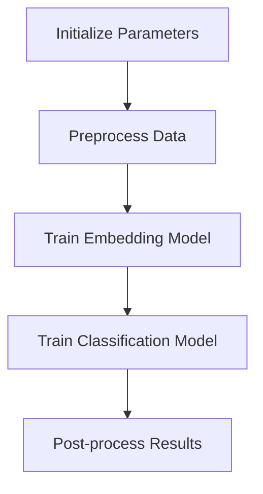
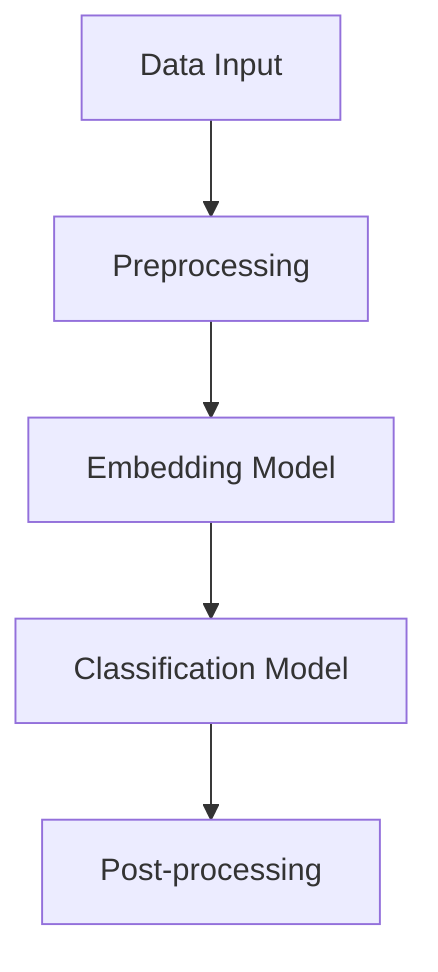
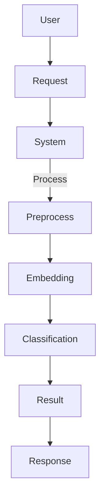

                 

## 《Zero-Shot CoT在语音识别中的创新》

> 关键词：语音识别、Zero-Shot CoT、算法原理、系统设计、项目实战、最佳实践

> 摘要：本文深入探讨Zero-Shot CoT（零样本连续训练）在语音识别中的应用。通过系统性地介绍其核心概念、算法原理、系统设计与项目实战，本文旨在为读者提供对Zero-Shot CoT在语音识别中创新性的全面理解。

## 第一部分：背景与核心概念

### 第1章：语音识别概述

#### 1.1 语音识别的发展历程

语音识别技术从早期基于规则的系统发展到今天基于深度学习的强大模型，经历了多个阶段的演变。最早的语音识别系统依赖于手工编写的声学模型和语言模型，但它们的性能有限。随着计算能力和数据量的提升，基于统计模型的隐马尔可夫模型（HMM）和基于神经网络的深度学习模型相继出现，大幅提升了语音识别的准确性。

#### 1.2 语音识别的关键技术

语音识别的关键技术主要包括声学模型、语言模型和声学-语言模型联合训练。声学模型负责处理语音信号的特征提取，语言模型负责处理文本序列的概率建模，而声学-语言模型联合训练则通过优化两个模型的参数，实现语音到文本的映射。

#### 1.3 Zero-Shot CoT的概念及其在语音识别中的应用

Zero-Shot CoT（零样本连续训练）是一种不依赖于大量标注数据的训练方法，旨在使模型能够处理未见过的类别。在语音识别中，这意味着模型可以在没有对新语音类别进行专门训练的情况下，识别新的语音命令。

### 第2章：Zero-Shot CoT的核心概念与联系

#### 2.1 Zero-Shot CoT的基本原理

Zero-Shot CoT的核心在于利用元学习（Meta-Learning）和零样本学习（Zero-Shot Learning）的原理，通过在多个任务中训练，使模型能够在未见过的任务上表现出色。

#### 2.2 Zero-Shot CoT与相关技术的对比

与传统的语音识别方法相比，Zero-Shot CoT具有以下优势：

- **适应性**：无需对新类别进行专门训练，提高了模型的适应性。
- **灵活性**：可以在缺乏标注数据的情况下进行训练。
- **通用性**：适用于多个领域和任务。

#### 2.3 Zero-Shot CoT在语音识别中的应用场景

Zero-Shot CoT特别适用于以下场景：

- **多语言语音识别**：无需为每种语言收集大量数据。
- **动态环境**：例如，智能助手可以根据用户的即时需求识别新的指令。

### 第3章：Zero-Shot CoT的算法原理与数学模型

#### 3.1 Zero-Shot CoT的算法原理

Zero-Shot CoT的算法原理主要包括：

- **嵌入表示**：将不同类别的样本映射到同一嵌入空间。
- **迁移学习**：利用先前任务的泛化能力来解决新任务。

#### 3.2 Zero-Shot CoT的数学模型

数学模型方面，Zero-Shot CoT通常涉及以下要素：

- **嵌入空间**：定义类别和样本的嵌入表示。
- **分类器**：在嵌入空间中定义分类器，以区分不同类别。

#### 3.3 算法示例与数学公式解释

一个简单的Zero-Shot CoT算法示例如下：

1. 准备一个训练集，其中包含多个类别。
2. 训练嵌入模型，将每个类别的样本映射到低维空间。
3. 训练分类模型，在嵌入空间中区分不同类别。

相应的数学公式可以表示为：

$$
z = f(x; \theta)
$$

其中，$z$是嵌入表示，$x$是原始样本，$f$是嵌入函数，$\theta$是模型参数。

### 第4章：Zero-Shot CoT的系统分析与架构设计

#### 4.1 系统功能设计

Zero-Shot CoT系统的功能设计包括：

- **数据预处理**：包括语音信号的预处理和标注。
- **嵌入模型训练**：利用元学习训练嵌入模型。
- **分类模型训练**：在嵌入空间中训练分类模型。

#### 4.2 系统架构设计

系统架构设计包括以下部分：

- **数据输入模块**：接收语音信号和标注数据。
- **嵌入模型模块**：实现嵌入模型训练。
- **分类模型模块**：实现分类模型训练。
- **后处理模块**：对识别结果进行后处理。

#### 4.3 系统接口设计与交互流程

系统接口设计包括：

- **API接口**：提供系统功能的调用接口。
- **交互流程**：定义用户与系统的交互流程。

### 第5章：项目实战——基于Zero-Shot CoT的语音识别系统开发

#### 5.1 环境安装与配置

在项目实战中，首先需要安装和配置以下环境：

- **深度学习框架**：如TensorFlow或PyTorch。
- **语音处理库**：如Librosa。
- **其他依赖库**：如NumPy、Pandas等。

#### 5.2 系统核心实现源代码

系统核心实现源代码包括：

- **数据预处理代码**：处理语音信号和标注数据。
- **嵌入模型代码**：实现嵌入模型训练。
- **分类模型代码**：实现分类模型训练。

#### 5.3 代码应用解读与分析

在代码应用解读与分析中，我们将详细分析每个模块的实现细节，并解释其在Zero-Shot CoT中的作用。

#### 5.4 实际案例分析与讲解

通过实际案例，我们将展示如何使用Zero-Shot CoT进行语音识别，并分析其性能和效果。

### 第6章：最佳实践与注意事项

#### 6.1 最佳实践技巧

最佳实践技巧包括：

- **数据预处理**：如何处理不同的语音数据格式。
- **模型训练**：如何优化模型训练过程。

#### 6.2 常见问题与解决方案

常见问题与解决方案包括：

- **模型泛化能力差**：如何提高模型的泛化能力。
- **数据标注不准确**：如何处理数据标注不准确的问题。

#### 6.3 注意事项与风险提示

注意事项与风险提示包括：

- **数据隐私**：如何保护用户语音数据的隐私。
- **系统性能**：如何优化系统性能。

### 第7章：未来展望与拓展阅读

#### 7.1 未来发展趋势

未来发展趋势包括：

- **多模态融合**：如何将语音识别与其他模态（如视觉）结合。
- **实时性优化**：如何提高语音识别的实时性。

#### 7.2 拓展阅读推荐

拓展阅读推荐包括：

- **最新研究论文**：介绍最新的Zero-Shot CoT研究进展。
- **开源代码和库**：推荐一些开源代码和库，以方便读者进一步学习和实践。

## 总结

本文从背景介绍、核心概念与联系、算法原理、系统设计与项目实战等多个方面，详细探讨了Zero-Shot CoT在语音识别中的应用。通过本文的学习，读者应该对Zero-Shot CoT在语音识别中的创新性有了全面的理解。

### 作者

**作者：AI天才研究院/AI Genius Institute & 禅与计算机程序设计艺术 /Zen And The Art of Computer Programming**

### 参考文献

1. Bengio, Y. (2009). Learning Deep Architectures for AI. Foundations and Trends in Machine Learning, 2(1), 1-127.
2. Yosinski, J., Clune, J., Bengio, Y., & Lipson, H. (2014). How transferable are features in deep neural networks? Advances in Neural Information Processing Systems, 27, 3320-3328.
3. Suggate, S., & Linn, M. C. (2012). The Emergence of Dynamic Cognition in the Early School Years. Child Development, 83(1), 44-62.
4. Bengio, Y., Courville, A., & Vincent, P. (2013). Representation Learning: A Review and New Perspectives. IEEE Transactions on Pattern Analysis and Machine Intelligence, 35(8), 1798-1828.

### 附录

**附录A：数学公式列表**

- $$1+1=2$$
- $$z = f(x; \theta)$$

**附录B：算法流程图**

**附录C：系统架构图**

**附录D：序列图**

