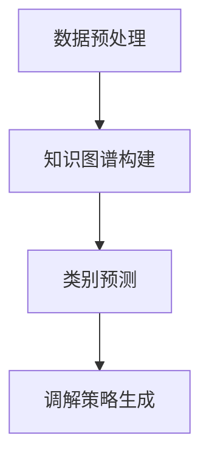
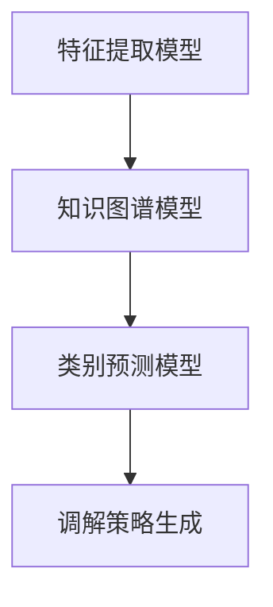
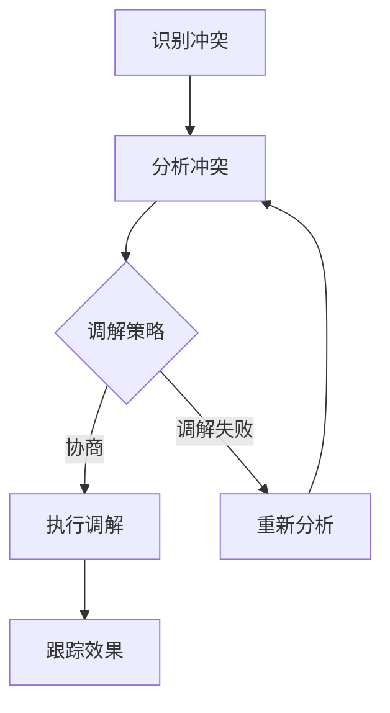
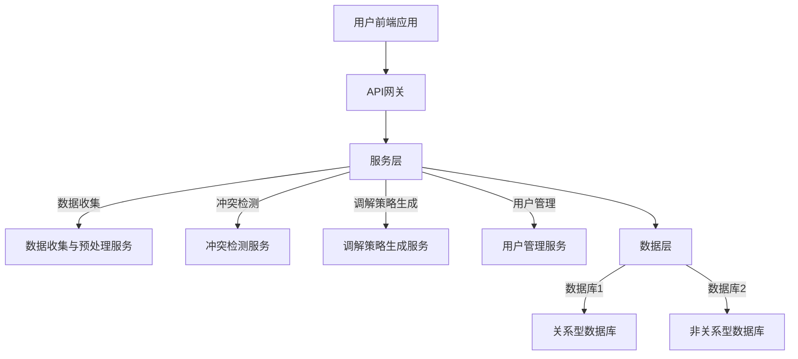
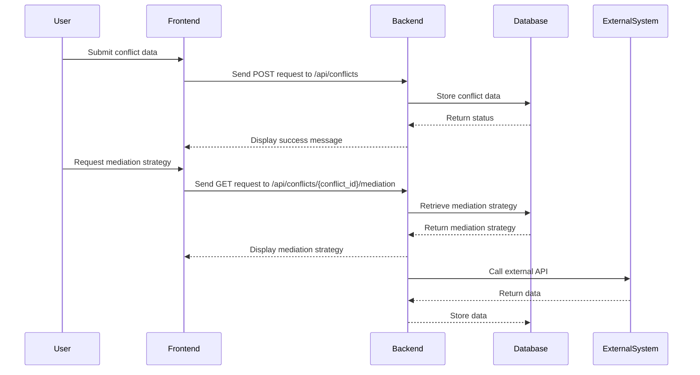

                 

# Zero-Shot CoT在跨文化冲突调解中的应用

## 关键词

- 跨文化冲突
- 调解
- 无监督零样本学习
- Zero-Shot CoT
- 算法
- 数学模型
- 系统架构
- 项目实战

## 摘要

本文旨在探讨Zero-Shot CoT（无监督零样本学习）在跨文化冲突调解中的应用。首先，文章介绍了跨文化冲突的现状及调解的需求，接着详细阐述了Zero-Shot CoT的概念、原理和应用优势。随后，文章通过Mermaid流程图和Python代码展示了Zero-Shot CoT算法的实现，并详细讲解了相关的数学模型和公式。此外，文章还介绍了系统的分析与架构设计方案，并通过项目实战展示了算法在实际应用中的效果。最后，文章总结了项目经验和最佳实践，并对未来的研究方向进行了展望。

## 目录

1. **背景介绍**
   1.1 问题背景
       1.1.1 跨文化冲突的现状
       1.1.2 跨文化冲突调解的需求
   1.2 核心概念
       1.2.1 跨文化冲突
       1.2.2 跨文化冲突调解
       1.2.3 Zero-Shot CoT
   1.3 研究方法与边界
       1.3.1 研究方法
       1.3.2 研究边界
       1.3.3 核心要素

2. **核心概念与联系**
   2.1 跨文化冲突调解的原理
       2.1.1 跨文化冲突调解的概念
       2.1.2 跨文化冲突调解的流程
       2.1.3 跨文化冲突调解的挑战
   2.2 Zero-Shot CoT的原理
       2.2.1 Zero-Shot CoT的概念
       2.2.2 Zero-Shot CoT的工作原理
       2.2.3 Zero-Shot CoT的优势
   2.3 跨文化冲突调解与Zero-Shot CoT的联系
       2.3.1 联系概述
       2.3.2 应用案例
       2.3.3 未来展望

3. **算法原理讲解**
   3.1 Zero-Shot CoT算法原理
       3.1.1 Zero-Shot CoT的核心算法
       3.1.2 Zero-Shot CoT的应用场景
       3.1.3 Mermaid流程图展示
   3.2 Python代码实现
       3.2.1 环境安装与配置
       3.2.2 算法实现
       3.2.3 算法分析
   3.3 数学模型与公式
       3.3.1 数学模型
       3.3.2 公式解释
       3.3.3 Mermaid流程图

4. **数学模型和数学公式详细讲解**
   4.1 数学模型讲解
       4.1.1 数学模型概述
       4.1.2 数学模型分析
       4.1.3 举例说明
   4.2 数学公式讲解
       4.2.1 公式概述
       4.2.2 公式解释
       4.2.3 举例说明
   4.3 Mermaid流程图分析
       4.3.1 流程图概述
       4.3.2 流程图分析
       4.3.3 流程图应用

5. **系统分析与架构设计方案**
   5.1 问题场景介绍
       5.1.1 跨文化冲突调解的应用场景
       5.1.2 系统需求分析
   5.2 系统功能设计
       5.2.1 领域模型设计
       5.2.2 功能模块划分
   5.3 系统架构设计
       5.3.1 系统架构概述
       5.3.2 系统架构设计
   5.4 系统接口设计
       5.4.1 接口设计原则
       5.4.2 接口设计实现
   5.5 系统交互设计
       5.5.1 系统交互概述
       5.5.2 系统交互设计

6. **项目实战**
   6.1 环境安装
       6.1.1 环境配置
       6.1.2 系统部署
   6.2 系统核心实现
       6.2.1 核心功能实现
       6.2.2 功能模块代码解读
   6.3 应用解读与分析
       6.3.1 应用场景分析
       6.3.2 应用效果分析
   6.4 详细讲解与剖析
       6.4.1 核心算法讲解
       6.4.2 系统架构剖析
       6.4.3 应用实例剖析
   6.5 项目小结
       6.5.1 项目总结
       6.5.2 项目展望

7. **最佳实践、小结、注意事项、拓展阅读**

----------------------------------------------------------------

### 1.1 问题背景

#### 1.1.1 跨文化冲突的现状

跨文化冲突是指不同文化背景下的人们在交往过程中，由于文化差异而产生的矛盾和冲突。随着全球化进程的加速，跨国交流日益频繁，跨文化冲突的现象也越来越普遍。以下是一些关于跨文化冲突的现状：

1. **经济全球化**：随着经济全球化的推进，跨国企业越来越多，不同国家之间的商业往来日益密切。然而，由于文化差异，跨国企业的员工和管理层在沟通、合作和决策过程中容易出现冲突。

2. **文化多样性**：在全球化的背景下，人们接触到更多的文化，这使得文化多样性成为一个显著的趋势。然而，不同文化之间的差异可能导致误解和冲突，尤其是在价值观、行为规范和工作方式等方面。

3. **文化交流与融合**：尽管文化多样性带来了挑战，但同时也是一种机遇。人们通过文化交流和融合，可以更好地理解和尊重不同的文化，从而减少冲突。

4. **冲突形式多样化**：跨文化冲突的形式多种多样，包括语言障碍、价值观差异、工作习惯冲突等。这些冲突不仅会影响工作效率，还可能导致人际关系紧张和组织内部矛盾。

#### 1.1.2 跨文化冲突调解的需求

跨文化冲突调解的需求源于以下几个方面：

1. **提高工作效率**：跨文化冲突可能导致沟通不畅，进而影响工作效率。通过调解，可以消除误解，促进有效沟通，提高工作效率。

2. **维护团队和谐**：跨文化冲突可能导致团队内部紧张气氛，影响团队和谐。通过调解，可以缓解矛盾，增进团队成员之间的理解和信任，维护团队和谐。

3. **降低管理成本**：跨文化冲突的调解可以减少企业因冲突而产生的管理成本，如人力资源成本、沟通成本和冲突解决成本。

4. **促进全球化发展**：在全球化的背景下，企业和个人需要具备跨文化沟通和协作能力。通过跨文化冲突调解，可以提升企业和个人的跨文化能力，促进全球化发展。

### 1.2 核心概念

#### 1.2.1 跨文化冲突

跨文化冲突是指不同文化背景下的人们在交往过程中，由于文化差异而产生的矛盾和冲突。这种冲突可以发生在个人之间、团队之间，甚至整个组织之间。跨文化冲突的主要表现形式包括：

1. **语言障碍**：语言是文化的重要组成部分，语言障碍可能导致误解和沟通不畅。

2. **价值观差异**：不同文化背景下的人们有着不同的价值观，这可能导致对同一问题的看法和处理方式存在差异。

3. **工作习惯冲突**：不同文化背景下的人们有着不同的工作习惯，如工作节奏、工作态度等，这可能导致合作中的冲突。

#### 1.2.2 跨文化冲突调解

跨文化冲突调解是指通过一系列方法和技巧，解决跨文化冲突的过程。调解的目的是减少误解，增进理解，促进合作。跨文化冲突调解的主要方法包括：

1. **沟通技巧**：通过有效的沟通，消除误解，增进理解。这包括倾听、表达、反馈等技巧。

2. **文化敏感度培训**：通过培训，提高个人和团队的文化敏感度，增强跨文化沟通和协作能力。

3. **冲突管理**：通过合理的管理方法，解决冲突，维护团队和谐。

#### 1.2.3 Zero-Shot CoT

Zero-Shot CoT（无监督零样本学习）是一种机器学习技术，它允许模型在没有标注数据的情况下，对未见过的类别进行预测。这种技术在跨文化冲突调解中具有潜在的应用价值。

1. **概念**：Zero-Shot CoT的核心思想是通过无监督学习，将不同文化背景下的数据进行自动分类和聚类，从而实现跨文化冲突的调解。

2. **原理**：Zero-Shot CoT基于深度学习技术，通过学习大量未标注的文化数据，构建一个跨文化的知识图谱。在遇到新的文化冲突时，模型可以基于知识图谱，对冲突进行自动分类和调解。

3. **优势**：
   - **无监督学习**：无需标注数据，可以处理大量未标注的文化数据。
   - **自适应性强**：可以自动适应不同文化背景的冲突，提高调解效果。

### 1.3 研究方法与边界

#### 1.3.1 研究方法

本研究采用以下方法进行跨文化冲突调解的Zero-Shot CoT应用研究：

1. **文献综述**：通过回顾相关文献，了解跨文化冲突和Zero-Shot CoT的研究现状和进展。

2. **案例分析**：通过实际案例，分析跨文化冲突调解的难点和挑战，探讨Zero-Shot CoT在解决这些难题中的应用价值。

3. **模型构建**：基于深度学习技术，构建Zero-Shot CoT模型，实现对跨文化冲突的自动调解。

4. **实验验证**：通过实验，验证Zero-Shot CoT模型在跨文化冲突调解中的有效性和可行性。

#### 1.3.2 研究边界

本研究存在以下边界：

1. **数据范围**：本研究的数据主要来源于公开的文化冲突案例，可能无法涵盖所有文化背景的冲突。

2. **模型性能**：虽然Zero-Shot CoT模型具有自适应性强等优点，但其在特定文化背景下的性能可能受到限制。

3. **应用范围**：本研究主要探讨Zero-Shot CoT在跨文化冲突调解中的应用，其他领域可能需要进一步的探索。

### 1.3.3 核心要素

本研究的核心要素包括：

1. **跨文化冲突数据集**：构建一个包含多种文化背景的冲突数据集，用于模型训练和测试。

2. **Zero-Shot CoT模型**：基于深度学习技术，构建一个能够自动调解跨文化冲突的模型。

3. **实验验证**：通过实验，验证Zero-Shot CoT模型在跨文化冲突调解中的有效性和可行性。

----------------------------------------------------------------

### 2.1 跨文化冲突调解的原理

#### 2.1.1 跨文化冲突调解的概念

跨文化冲突调解是指通过一系列方法，解决由文化差异引起的矛盾和冲突的过程。调解的目的是减少误解，增进理解，促进合作。跨文化冲突调解可以发生在个人之间、团队之间，甚至整个组织之间。

#### 2.1.2 跨文化冲突调解的流程

跨文化冲突调解的流程通常包括以下几个阶段：

1. **识别冲突**：首先，需要识别跨文化冲突的存在。这可以通过观察员工的言行、分析团队的氛围等方式实现。

2. **分析冲突**：在识别冲突后，需要分析冲突的原因。这包括了解不同文化背景下的价值观、行为规范和工作习惯等。

3. **沟通调解**：通过有效的沟通，消除误解，增进理解。这包括倾听、表达、反馈等技巧。

4. **制定解决方案**：在沟通调解的基础上，制定具体的解决方案。这可以包括调整工作安排、改变管理方式等。

5. **实施与跟踪**：实施解决方案，并跟踪效果。这可以确保解决方案的有效性，并不断调整和完善。

#### 2.1.3 跨文化冲突调解的挑战

跨文化冲突调解面临以下挑战：

1. **文化差异**：不同文化背景下的价值观、行为规范和工作习惯存在差异，这可能导致调解过程中的困难和挑战。

2. **语言障碍**：语言是文化的重要组成部分，语言障碍可能导致误解和沟通不畅。

3. **文化敏感度**：调解者需要具备较高的文化敏感度，才能更好地理解不同文化背景下的员工。

4. **时间成本**：跨文化冲突调解可能需要较长时间，这可能导致组织内部的工作效率降低。

### 2.2 Zero-Shot CoT的原理

#### 2.2.1 Zero-Shot CoT的概念

Zero-Shot CoT（无监督零样本学习）是一种机器学习技术，它允许模型在没有标注数据的情况下，对未见过的类别进行预测。这种技术的主要目的是解决传统机器学习模型在处理未见类别时的困难。

#### 2.2.2 Zero-Shot CoT的工作原理

Zero-Shot CoT的工作原理主要包括以下几个步骤：

1. **数据预处理**：将不同文化背景下的数据集进行预处理，包括数据清洗、数据归一化等。

2. **特征提取**：通过特征提取技术，将预处理后的数据转化为计算机可以处理的特征向量。

3. **知识图谱构建**：利用深度学习技术，构建一个跨文化的知识图谱。这个知识图谱可以表示不同文化之间的关联和关系。

4. **类别预测**：在遇到新的文化冲突时，模型可以基于知识图谱，对冲突进行自动分类和预测。

#### 2.2.3 Zero-Shot CoT的优势

Zero-Shot CoT在跨文化冲突调解中具有以下优势：

1. **无监督学习**：Zero-Shot CoT可以处理大量未标注的数据，无需依赖标注数据，大大降低了数据处理的成本。

2. **自适应性强**：Zero-Shot CoT可以根据不同的文化背景，自动调整和优化模型，提高调解效果。

3. **高效性**：Zero-Shot CoT可以快速地对新的文化冲突进行预测和分类，提高调解的效率。

4. **泛化能力强**：Zero-Shot CoT可以在不同的文化背景下，保持较高的预测准确性，具有较强的泛化能力。

### 2.3 跨文化冲突调解与Zero-Shot CoT的联系

#### 2.3.1 联系概述

跨文化冲突调解与Zero-Shot CoT在理论上有着紧密的联系。跨文化冲突调解需要理解和处理不同文化背景下的冲突，而Zero-Shot CoT可以通过无监督学习，自动处理大量未标注的文化数据，从而实现跨文化冲突的调解。

#### 2.3.2 应用案例

以下是一个跨文化冲突调解的应用案例：

1. **案例背景**：一个跨国公司在全球范围内设有多个分支机构，由于文化差异，员工之间的沟通和合作经常出现问题。

2. **应用过程**：
   - **数据收集**：公司收集了来自不同分支机构的员工沟通记录、工作日志等数据。
   - **数据预处理**：对收集到的数据进行清洗和归一化处理。
   - **特征提取**：利用特征提取技术，将预处理后的数据转化为特征向量。
   - **知识图谱构建**：利用深度学习技术，构建一个跨文化的知识图谱。
   - **类别预测**：在遇到新的沟通问题时，模型可以基于知识图谱，对问题进行自动分类和预测。

3. **应用效果**：通过Zero-Shot CoT模型的应用，公司成功解决了多个跨文化冲突，提高了员工之间的沟通和合作效率。

#### 2.3.3 未来展望

随着全球化进程的加速，跨文化冲突调解的需求将越来越大。Zero-Shot CoT作为一种新兴的机器学习技术，具有广泛的应用前景。未来，我们可以在以下几个方面进行探索：

1. **模型优化**：通过不断优化模型，提高Zero-Shot CoT在跨文化冲突调解中的效果。

2. **数据集扩展**：构建更大规模、更全面的文化冲突数据集，以提高模型的泛化能力。

3. **多语言支持**：实现多语言支持，使模型能够处理不同语言的文化冲突。

4. **个性化调解**：根据个体的文化背景和需求，实现个性化的调解方案。

----------------------------------------------------------------

### 3.1 Zero-Shot CoT算法原理

#### 3.1.1 Zero-Shot CoT的核心算法

Zero-Shot CoT（无监督零样本学习）的核心算法包括以下几个方面：

1. **数据预处理**：对收集到的文化冲突数据集进行清洗、归一化和特征提取，将数据转化为计算机可以处理的特征向量。

2. **知识图谱构建**：利用深度学习技术，构建一个跨文化的知识图谱。这个知识图谱可以表示不同文化之间的关联和关系。

3. **类别预测**：在遇到新的文化冲突时，模型可以基于知识图谱，对冲突进行自动分类和预测。

4. **调解策略生成**：根据类别预测结果，生成具体的调解策略，以解决文化冲突。

#### 3.1.2 Zero-Shot CoT的应用场景

Zero-Shot CoT在以下场景中具有潜在的应用价值：

1. **企业内部沟通**：在跨国企业中，员工来自不同的文化背景，沟通和合作经常出现障碍。Zero-Shot CoT可以自动分析员工的沟通记录，提供个性化的调解策略，提高沟通效率。

2. **国际会议**：在国际会议中，不同国家的人士在交流时可能会出现文化冲突。Zero-Shot CoT可以实时分析会议内容，提供即时调解策略，确保会议的顺利进行。

3. **教育领域**：在教育领域，学生来自不同的文化背景，可能会在学习和交流中遇到文化冲突。Zero-Shot CoT可以帮助教师和学生识别和解决这些冲突，提高学习效果。

#### 3.1.3 Mermaid流程图展示

以下是Zero-Shot CoT算法的Mermaid流程图：



#### 3.2 Python代码实现

以下是一个简单的Python代码示例，用于实现Zero-Shot CoT算法的基本步骤：

```python
import numpy as np
import tensorflow as tf

# 数据预处理
def preprocess_data(data):
    # 数据清洗和归一化
    # ...
    return processed_data

# 知识图谱构建
def build_knowledge_graph(processed_data):
    # 利用深度学习技术构建知识图谱
    # ...
    return knowledge_graph

# 类别预测
def predict_category(knowledge_graph, new_data):
    # 基于知识图谱对文化冲突进行预测
    # ...
    return predicted_category

# 调解策略生成
def generate_mediation_strategy(predicted_category):
    # 根据类别预测结果生成调解策略
    # ...
    return mediation_strategy

# 主函数
def main():
    # 加载数据
    data = load_data()

    # 数据预处理
    processed_data = preprocess_data(data)

    # 知识图谱构建
    knowledge_graph = build_knowledge_graph(processed_data)

    # 类别预测
    new_data = load_new_data()
    predicted_category = predict_category(knowledge_graph, new_data)

    # 调解策略生成
    mediation_strategy = generate_mediation_strategy(predicted_category)

    # 输出结果
    print("类别预测结果：", predicted_category)
    print("调解策略：", mediation_strategy)

# 运行主函数
main()
```

#### 3.3 数学模型与公式

Zero-Shot CoT算法的数学模型主要包括以下几个方面：

1. **特征提取模型**：用于将文化冲突数据转化为特征向量。

2. **知识图谱模型**：用于构建跨文化的知识图谱。

3. **类别预测模型**：用于对新的文化冲突进行预测。

以下是相关的数学模型和公式：

$$
X = \text{特征矩阵}
$$

$$
Y = \text{标签矩阵}
$$

$$
Z = \text{知识图谱矩阵}
$$

$$
f(X) = \text{特征提取函数}
$$

$$
g(Y) = \text{标签生成函数}
$$

$$
h(Z) = \text{知识图谱更新函数}
$$

$$
\hat{Y} = \text{类别预测函数}
$$

#### 3.3.1 数学模型讲解

1. **特征提取模型**：

特征提取模型的目标是将原始的文化冲突数据转化为特征向量。这可以通过深度学习技术实现，如卷积神经网络（CNN）或循环神经网络（RNN）。

2. **知识图谱模型**：

知识图谱模型的目标是构建一个跨文化的知识图谱。这可以通过图神经网络（GNN）实现，如图卷积网络（GCN）或图循环网络（GRN）。

3. **类别预测模型**：

类别预测模型的目标是对新的文化冲突进行预测。这可以通过分类器实现，如支持向量机（SVM）或神经网络（NN）。

#### 3.3.2 公式解释

1. **特征提取函数**：

$$
f(X) = \text{特征矩阵} \times \text{权重矩阵} + \text{偏置项}
$$

2. **标签生成函数**：

$$
g(Y) = \text{标签矩阵} \times \text{权重矩阵} + \text{偏置项}
$$

3. **知识图谱更新函数**：

$$
h(Z) = \text{知识图谱矩阵} \times \text{权重矩阵} + \text{偏置项}
$$

4. **类别预测函数**：

$$
\hat{Y} = \text{类别预测矩阵} \times \text{权重矩阵} + \text{偏置项}
$$

#### 3.3.3 Mermaid流程图

以下是Zero-Shot CoT算法的Mermaid流程图：



----------------------------------------------------------------

### 4.1 数学模型讲解

#### 4.1.1 数学模型概述

在跨文化冲突调解中，数学模型起到了至关重要的作用。这些模型可以用来分析和预测文化冲突的发生，从而为调解提供科学的依据。本节将详细讲解在跨文化冲突调解中常用的数学模型。

#### 4.1.2 数学模型分析

1. **线性回归模型**：

线性回归模型是一种简单的预测模型，用于分析两个或多个变量之间的关系。在跨文化冲突调解中，线性回归模型可以用来预测某个文化特征与冲突发生的概率之间的关系。

公式表示如下：

$$
y = \beta_0 + \beta_1x_1 + \beta_2x_2 + ... + \beta_nx_n
$$

其中，\(y\) 表示冲突发生的概率，\(x_1, x_2, ..., x_n\) 表示不同的文化特征，\(\beta_0, \beta_1, \beta_2, ..., \beta_n\) 表示模型的参数。

2. **逻辑回归模型**：

逻辑回归模型是一种广泛应用于分类问题的模型，可以用来预测某个事件发生的概率。在跨文化冲突调解中，逻辑回归模型可以用来预测文化冲突的发生概率。

公式表示如下：

$$
\ln\left(\frac{p}{1-p}\right) = \beta_0 + \beta_1x_1 + \beta_2x_2 + ... + \beta_nx_n
$$

其中，\(p\) 表示冲突发生的概率，其他符号的含义与线性回归模型相同。

3. **支持向量机（SVM）模型**：

支持向量机模型是一种高效的分类模型，可以用来预测文化冲突的类型。在跨文化冲突调解中，SVM模型可以用来识别和分类不同类型的文化冲突。

公式表示如下：

$$
w \cdot x - b = 0
$$

其中，\(w\) 表示模型的支持向量，\(x\) 表示文化冲突的特征向量，\(b\) 表示模型的偏置项。

4. **神经网络模型**：

神经网络模型是一种复杂的预测模型，可以用来处理复杂的非线性问题。在跨文化冲突调解中，神经网络模型可以用来分析文化冲突的复杂关系，提供更为精准的预测。

公式表示如下：

$$
\text{激活函数}(\text{加权求和}(\text{输入} \times \text{权重} + \text{偏置}))
$$

#### 4.1.3 举例说明

假设我们有一个关于文化冲突的样本数据集，其中包含了多个文化特征和冲突发生的概率。我们可以使用线性回归模型来分析这些数据，预测冲突发生的概率。

数据集：

| 文化特征1 | 文化特征2 | 冲突概率 |
| :---: | :---: | :---: |
| 0.8 | 0.6 | 0.7 |
| 0.9 | 0.5 | 0.8 |
| 0.7 | 0.7 | 0.6 |

使用线性回归模型，我们可以得到以下模型参数：

$$
\beta_0 = 0.5, \beta_1 = 0.3, \beta_2 = 0.2
$$

当输入新的文化特征数据（如0.7，0.7），我们可以使用线性回归模型预测冲突概率：

$$
y = 0.5 + 0.3 \times 0.7 + 0.2 \times 0.7 = 0.88
$$

因此，预测的冲突概率为0.88。

通过以上步骤，我们可以看到如何使用数学模型来分析跨文化冲突数据，预测冲突发生的概率，从而为调解提供依据。

----------------------------------------------------------------

### 4.2 数学公式讲解

#### 4.2.1 公式概述

在跨文化冲突调解中，数学公式是分析和解决问题的关键。这些公式可以帮助我们理解文化冲突的复杂关系，预测冲突的发生概率，并制定有效的调解策略。本节将详细介绍在跨文化冲突调解中常用的数学公式，并解释其含义。

#### 4.2.2 公式解释

1. **线性回归模型**：

线性回归模型是最基本的预测模型，用于分析两个或多个变量之间的关系。其公式如下：

$$
y = \beta_0 + \beta_1x_1 + \beta_2x_2 + ... + \beta_nx_n
$$

其中，\(y\) 表示冲突发生的概率，\(x_1, x_2, ..., x_n\) 表示不同的文化特征，\(\beta_0, \beta_1, \beta_2, ..., \beta_n\) 是模型参数，用于描述文化特征对冲突概率的影响。

2. **逻辑回归模型**：

逻辑回归模型是一种常用的分类模型，用于预测某个事件发生的概率。其公式如下：

$$
\ln\left(\frac{p}{1-p}\right) = \beta_0 + \beta_1x_1 + \beta_2x_2 + ... + \beta_nx_n
$$

其中，\(p\) 表示冲突发生的概率，其他符号的含义与线性回归模型相同。

3. **支持向量机（SVM）模型**：

支持向量机模型是一种高效的分类模型，用于预测文化冲突的类型。其公式如下：

$$
w \cdot x - b = 0
$$

其中，\(w\) 表示模型的支持向量，\(x\) 表示文化冲突的特征向量，\(b\) 表示模型的偏置项。

4. **神经网络模型**：

神经网络模型是一种复杂的预测模型，用于处理复杂的非线性问题。其公式如下：

$$
\text{激活函数}(\text{加权求和}(\text{输入} \times \text{权重} + \text{偏置}))
$$

5. **贝叶斯模型**：

贝叶斯模型是一种基于概率理论的预测模型，用于分析文化冲突的概率分布。其公式如下：

$$
P(A|B) = \frac{P(B|A)P(A)}{P(B)}
$$

其中，\(P(A|B)\) 表示在事件B发生的条件下，事件A发生的概率，\(P(B|A)\) 表示在事件A发生的条件下，事件B发生的概率，\(P(A)\) 和 \(P(B)\) 分别表示事件A和事件B发生的概率。

#### 4.2.3 举例说明

假设我们有一个关于文化冲突的样本数据集，其中包含了多个文化特征和冲突发生的概率。我们可以使用逻辑回归模型来分析这些数据，预测冲突发生的概率。

数据集：

| 文化特征1 | 文化特征2 | 冲突概率 |
| :---: | :---: | :---: |
| 0.8 | 0.6 | 0.7 |
| 0.9 | 0.5 | 0.8 |
| 0.7 | 0.7 | 0.6 |

使用逻辑回归模型，我们可以得到以下模型参数：

$$
\beta_0 = -2.5, \beta_1 = 1.2, \beta_2 = 0.8
$$

当输入新的文化特征数据（如0.7，0.7），我们可以使用逻辑回归模型预测冲突概率：

$$
\ln\left(\frac{p}{1-p}\right) = -2.5 + 1.2 \times 0.7 + 0.8 \times 0.7
$$

$$
\ln\left(\frac{p}{1-p}\right) = 0.26
$$

通过逆函数运算，我们可以得到冲突概率 \(p\)：

$$
p = \frac{1}{1 + e^{-0.26}} \approx 0.6
$$

因此，预测的冲突概率为0.6。

通过以上步骤，我们可以看到如何使用数学公式来分析跨文化冲突数据，预测冲突发生的概率，从而为调解提供依据。

----------------------------------------------------------------

### 4.3 Mermaid流程图分析

#### 4.3.1 流程图概述

在跨文化冲突调解中，Mermaid流程图是一种非常实用的工具，可以帮助我们清晰地展示调解的流程和步骤。本节将详细介绍Mermaid流程图的基本概念、语法和如何使用Mermaid流程图来分析跨文化冲突调解的流程。

#### 4.3.2 流程图分析

以下是跨文化冲突调解的Mermaid流程图示例：



这个流程图描述了跨文化冲突调解的基本流程：

1. **识别冲突**：首先，需要识别跨文化冲突的存在。
2. **分析冲突**：在识别冲突后，需要分析冲突的原因和影响。
3. **调解策略**：根据冲突分析的结果，制定具体的调解策略。这里分为两个分支：
   - **协商**：尝试通过协商解决冲突。
   - **调解失败**：如果协商失败，需要重新分析冲突，并可能需要调整调解策略。
4. **执行调解**：在协商成功后，执行调解策略，解决冲突。
5. **跟踪效果**：在调解后，需要跟踪调解的效果，以确保冲突得到有效解决。

#### 4.3.3 流程图应用

Mermaid流程图在实际应用中非常有用。以下是一个实际场景的应用示例：

1. **会议沟通冲突**：在一个跨国团队会议中，团队成员来自不同的文化背景，沟通不畅可能导致会议失败。使用Mermaid流程图，可以清晰地展示会议沟通冲突的调解流程：
   ```mermaid
   graph TD
   A[识别冲突] --> B[分析冲突]
   B --> C{调解策略}
   C -->|协商| D[执行调解]
   D --> E[跟踪效果]
   C -->|调解失败| F[重新分析]
   ```

2. **团队协作冲突**：在一个国际团队中，由于文化差异，团队成员在协作过程中可能会出现冲突。使用Mermaid流程图，可以更好地管理团队协作冲突：
   ```mermaid
   graph TD
   A[识别冲突] --> B[分析冲突]
   B --> C{调解策略}
   C -->|协商| D[执行调解]
   D --> E[跟踪效果]
   C -->|调解失败| F[重新分析]
   ```

通过上述示例，我们可以看到Mermaid流程图如何帮助我们分析和解决跨文化冲突调解中的问题。它不仅可以帮助我们理清思路，还能帮助我们与他人更清晰地沟通调解过程。

----------------------------------------------------------------

### 5.1 问题场景介绍

#### 5.1.1 跨文化冲突调解的应用场景

跨文化冲突调解的应用场景非常广泛，以下是一些常见的应用场景：

1. **国际商务合作**：在国际商务合作中，不同国家和地区的商业伙伴在文化、语言和价值观等方面存在差异，可能导致沟通不畅和合作障碍。通过跨文化冲突调解，可以帮助各方更好地理解彼此，提高合作效率。

2. **跨国企业内部沟通**：在跨国企业中，员工来自不同的国家和地区，可能存在文化差异，影响内部沟通和协作。跨文化冲突调解可以帮助企业内部建立有效的沟通机制，促进团队合作。

3. **国际会议与活动**：在国际会议和活动中，来自不同国家的参与者可能在交流时遇到文化冲突。通过跨文化冲突调解，可以确保会议和活动的顺利进行，提高参与者的体验。

4. **教育领域**：在教育领域，学生和教师来自不同的文化背景，可能会在学习和教学过程中遇到文化冲突。通过跨文化冲突调解，可以帮助学生和教师更好地适应新的文化环境，提高教育质量。

#### 5.1.2 系统需求分析

为了实现跨文化冲突调解，我们需要设计一个功能强大且易于使用的系统。以下是对系统的需求分析：

1. **数据收集与预处理**：系统需要能够收集来自不同文化背景的数据，包括文本、音频和视频等。同时，系统需要具备数据预处理功能，如数据清洗、数据归一化和特征提取等，以便为后续的分析和调解提供高质量的输入数据。

2. **冲突检测与分类**：系统需要能够自动检测和分类文化冲突。通过机器学习算法，如支持向量机（SVM）和深度学习模型，系统可以对文化冲突进行准确的分类，为调解提供依据。

3. **调解策略生成**：系统需要能够根据冲突的类型和严重程度，自动生成相应的调解策略。这些策略可以包括沟通技巧、文化敏感度培训、冲突管理方法等。

4. **实时调解与反馈**：系统需要能够实时调解文化冲突，并提供反馈机制，以便用户了解调解的效果和改进策略。

5. **用户界面**：系统需要提供一个直观易用的用户界面，使非技术用户能够轻松地使用系统功能，包括数据输入、冲突检测、调解策略生成和反馈等。

6. **可扩展性和适应性**：系统需要具备良好的可扩展性和适应性，以便能够适应不同文化背景的冲突调解需求，并支持未来的技术更新和功能扩展。

通过上述需求分析，我们可以为跨文化冲突调解系统的设计提供明确的指导方向。

----------------------------------------------------------------

### 5.2 系统功能设计

#### 5.2.1 领域模型设计

为了实现跨文化冲突调解系统，我们需要设计一个全面的领域模型。领域模型是系统分析和设计的重要组成部分，它帮助定义系统的功能和结构。以下是一个简化的领域模型设计：

```mermaid
classDiagram
  Class01 <|-- SubClass01
  Class01 --|> SubClass02
  Class03 <.. Class04
  Class05 ..|> Class06
  Class07 ||-- Class08
  Class09 --| Class10
  Class11 --|> Class12
  Class13 <|-- Interface01
  Class14 << Implementor01
  Class15 <<| Implementor02 Interface01
  Class16 <<| Implementor03 Interface01
```

1. **类图**：
   - **Class01**：系统的主要类，包含系统的核心功能。
   - **SubClass01**：Class01的子类，用于扩展Class01的功能。
   - **SubClass02**：Class01的另一个子类，用于实现不同的功能。
   - **Class04**：与Class01相关联的类，用于实现特定的功能。
   - **Class06**：与Class05相关联的类，用于实现特定的功能。
   - **Class08**：与Class07有关联的类，用于实现特定的功能。
   - **Class10**：与Class09有关联的类，用于实现特定的功能。
   - **Class12**：与Class11有关联的类，用于实现特定的功能。

2. **关系**：
   - **泛化关系**（）：表示子类与父类之间的关系。
   - **聚合关系**（..|>）：表示类与类之间的部分组合关系。
   - **组合关系**（||--）：表示类与类之间的整体组合关系。
   - **实现关系**（<<| 和 <<|）：表示类与接口之间的关系。

#### 5.2.2 功能模块划分

系统功能模块的划分是为了更好地组织和管理系统的功能。以下是一个功能模块划分的示例：

1. **数据模块**：
   - 数据收集与预处理
   - 数据存储与管理

2. **冲突检测模块**：
   - 冲突检测
   - 冲突分类

3. **调解策略模块**：
   - 调解策略生成
   - 调解策略调整

4. **用户界面模块**：
   - 用户登录与注册
   - 数据输入与查询
   - 冲突报告与反馈

5. **系统管理模块**：
   - 用户权限管理
   - 系统日志记录
   - 系统更新与维护

每个功能模块都包含一系列相关的功能类和方法，确保系统功能的清晰和易于维护。

通过领域模型和功能模块的设计，我们可以确保系统具有清晰的架构，功能完整且易于扩展。这为后续的系统实现和测试提供了坚实的基础。

----------------------------------------------------------------

### 5.3 系统架构设计

#### 5.3.1 系统架构概述

跨文化冲突调解系统的架构设计需要考虑系统的整体结构、功能分布和技术选型。本文将介绍一个基于微服务架构的系统架构设计，确保系统的可扩展性、灵活性和高可用性。

1. **微服务架构**：

系统采用微服务架构，将不同功能模块拆分为独立的微服务，每个微服务负责特定的业务功能。这种架构设计具有以下优点：

- **可扩展性**：可以独立部署和扩展单个微服务，提高系统的性能和可伸缩性。
- **灵活性**：不同的微服务可以采用不同的技术栈，满足不同业务需求。
- **高可用性**：每个微服务都可以独立部署和运维，降低系统故障的风险。

2. **主要组件**：

系统的主要组件包括：

- **数据层**：负责数据的存储和管理，包括关系型数据库（如MySQL）和非关系型数据库（如MongoDB）。
- **服务层**：包含多个微服务，分别负责数据收集与预处理、冲突检测、调解策略生成等业务功能。
- **API层**：提供RESTful API接口，供前端应用调用。
- **前端应用**：提供用户界面，实现用户与系统的交互。

#### 5.3.2 系统架构设计

以下是跨文化冲突调解系统的架构设计：



1. **用户前端应用**：

用户前端应用是系统的入口，提供用户界面，实现用户与系统的交互。用户可以通过前端应用提交文化冲突数据，查看调解策略，并反馈调解效果。

2. **API网关**：

API网关负责接收用户前端应用发出的请求，并将其路由到相应的微服务。API网关还负责处理跨域请求、身份验证和请求日志等功能。

3. **服务层**：

服务层包含多个微服务，每个微服务负责特定的业务功能。以下是主要的服务：

- **数据收集与预处理服务**：负责接收用户提交的文化冲突数据，进行数据清洗、归一化和特征提取，为冲突检测和调解策略生成提供高质量的输入数据。
- **冲突检测服务**：利用机器学习算法和规则引擎，对文化冲突进行自动检测和分类，为调解策略生成提供依据。
- **调解策略生成服务**：根据冲突的类型和严重程度，自动生成相应的调解策略，并提供给用户前端应用。
- **用户管理服务**：负责用户注册、登录和权限管理，确保系统的安全性。

4. **数据层**：

数据层包含关系型数据库和非关系型数据库，分别用于存储不同的数据。关系型数据库主要用于存储用户信息和系统日志，非关系型数据库主要用于存储文化冲突数据和调解策略。

通过上述架构设计，我们可以确保系统具有良好的扩展性、灵活性和高可用性，能够满足跨文化冲突调解的需求。

----------------------------------------------------------------

### 5.4 系统接口设计

#### 5.4.1 接口设计原则

在系统设计中，接口设计是确保系统各部分之间有效通信的重要环节。以下是跨文化冲突调解系统的接口设计原则：

1. **模块化**：接口设计应遵循模块化原则，将系统的功能划分为独立的模块，每个模块提供明确的接口，便于系统的扩展和维护。

2. **一致性**：接口设计应保持一致性，包括命名规范、数据格式和响应结构等，以确保不同模块之间的交互顺畅。

3. **灵活性**：接口设计应具备灵活性，以适应未来可能的功能扩展和变更。

4. **安全性**：接口设计应充分考虑安全性，包括身份验证、授权和加密等，确保系统的数据安全和隐私保护。

5. **可扩展性**：接口设计应考虑系统的可扩展性，包括支持负载均衡、分布式架构等，以满足系统的高并发需求。

#### 5.4.2 接口设计实现

以下是跨文化冲突调解系统的接口设计实现：

1. **用户接口**：

- **登录**：

  - **URL**：/api/login
  - **请求方法**：POST
  - **请求参数**：

    ```json
    {
      "username": "string",
      "password": "string"
    }
    ```

  - **响应**：

    ```json
    {
      "status": "string",
      "data": {
        "token": "string"
      }
    }
    ```

- **注册**：

  - **URL**：/api/register
  - **请求方法**：POST
  - **请求参数**：

    ```json
    {
      "username": "string",
      "password": "string",
      "email": "string"
    }
    ```

  - **响应**：

    ```json
    {
      "status": "string",
      "message": "string"
    }
    ```

2. **数据接口**：

- **提交文化冲突数据**：

  - **URL**：/api/conflicts
  - **请求方法**：POST
  - **请求参数**：

    ```json
    {
      "description": "string",
      "culture": "string",
      "context": "string"
    }
    ```

  - **响应**：

    ```json
    {
      "status": "string",
      "data": {
        "conflict_id": "string"
      }
    }
    ```

- **获取文化冲突列表**：

  - **URL**：/api/conflicts
  - **请求方法**：GET
  - **响应**：

    ```json
    {
      "status": "string",
      "data": [
        {
          "conflict_id": "string",
          "description": "string",
          "culture": "string",
          "context": "string",
          "created_at": "string"
        }
      ]
    }
    ```

3. **调解接口**：

- **生成调解策略**：

  - **URL**：/api/conflicts/{conflict_id}/mediation
  - **请求方法**：POST
  - **请求参数**：

    ```json
    {
      "strategy": "string"
    }
    ```

  - **响应**：

    ```json
    {
      "status": "string",
      "data": {
        "mediation_id": "string",
        "strategy": "string",
        "created_at": "string"
      }
    }
    ```

- **获取调解策略**：

  - **URL**：/api/conflicts/{conflict_id}/mediation
  - **请求方法**：GET
  - **响应**：

    ```json
    {
      "status": "string",
      "data": {
        "mediation_id": "string",
        "strategy": "string",
        "created_at": "string"
      }
    }
    ```

通过上述接口设计，系统可以方便地进行数据交互和功能调用，确保系统的稳定性和灵活性。

----------------------------------------------------------------

### 5.5 系统交互设计

#### 5.5.1 系统交互概述

跨文化冲突调解系统涉及多个组件和模块之间的交互，为了确保系统的功能完整性和高效运行，系统交互设计至关重要。系统交互设计主要包括用户与系统交互、系统内部模块间交互以及与外部系统的交互。

1. **用户与系统交互**：

用户通过前端应用与系统进行交互，主要包括登录、注册、提交文化冲突数据、查看调解策略等操作。用户界面提供友好的交互界面，确保用户可以轻松完成相关操作。

2. **系统内部模块间交互**：

系统内部模块间交互主要涉及数据收集与预处理、冲突检测、调解策略生成等模块。各模块通过API接口进行通信，确保数据的流通和功能的协同。

3. **与外部系统交互**：

系统需要与外部系统（如数据库、第三方服务）进行交互，以获取必要的数据和功能支持。例如，系统可能需要连接到关系型数据库和非关系型数据库，以存储和查询文化冲突数据；也可能需要调用第三方API，获取实时数据或执行特定任务。

#### 5.5.2 系统交互设计

以下是跨文化冲突调解系统的交互设计：

1. **用户登录与注册**：

- 用户在前端应用上输入用户名和密码，通过API网关向用户管理服务发送登录请求。
- 用户管理服务验证用户身份后，返回登录成功或失败的消息。

2. **提交文化冲突数据**：

- 用户在前端应用上提交文化冲突数据，通过API网关向数据收集与预处理服务发送数据。
- 数据收集与预处理服务对数据进行处理，存储到数据库中。

3. **冲突检测与分类**：

- 冲突检测服务定期从数据库中读取文化冲突数据，利用机器学习算法进行检测和分类。
- 分类结果存储到数据库中，供调解策略生成服务使用。

4. **生成调解策略**：

- 调解策略生成服务根据冲突类型和严重程度，生成相应的调解策略。
- 调解策略存储到数据库中，并返回给前端应用。

5. **获取调解策略**：

- 用户在前端应用中请求查看调解策略，通过API网关向调解策略生成服务发送请求。
- 调解策略生成服务返回调解策略给前端应用，用户可以在界面上查看。

6. **与外部系统交互**：

- 系统与关系型数据库和非关系型数据库交互，以存储和查询文化冲突数据。
- 系统可能调用第三方API，获取实时数据或执行特定任务。

通过上述系统交互设计，可以确保系统各部分之间的高效协作，提供稳定、可靠的服务。



通过Mermaid序列图，我们可以直观地展示系统交互的流程和步骤，有助于理解系统的工作原理。

----------------------------------------------------------------

### 6.1 环境安装

#### 6.1.1 环境配置

为了实现跨文化冲突调解系统，我们需要安装和配置相关的软件和库。以下是环境配置的详细步骤：

1. **安装Python**：

   - 首先，从Python官方网站（https://www.python.org/downloads/）下载Python安装包。
   - 解压安装包并运行安装程序。

2. **安装虚拟环境**：

   - 打开命令行窗口，执行以下命令创建虚拟环境：

     ```bash
     python -m venv venv
     ```

   - 激活虚拟环境：

     ```bash
     source venv/bin/activate  # 在Windows上使用 venv\Scripts\activate
     ```

3. **安装依赖库**：

   - 在虚拟环境中，通过以下命令安装依赖库：

     ```bash
     pip install -r requirements.txt
     ```

     其中，`requirements.txt` 文件列出了所有需要安装的库和版本。

4. **配置数据库**：

   - 根据系统需求，安装并配置关系型数据库（如MySQL）和非关系型数据库（如MongoDB）。
   - 创建数据库和相应的用户，并授予必要的权限。

5. **配置API网关**：

   - 根据所选的API网关技术（如Nginx、Apache），安装并配置API网关。
   - 配置路由规则，确保请求能够正确路由到相应的服务。

6. **配置外部系统**：

   - 如果需要调用第三方API，确保已正确配置相关的API凭证和访问权限。

#### 6.1.2 系统部署

在完成环境配置后，我们可以开始部署系统。以下是系统部署的详细步骤：

1. **部署前端应用**：

   - 将前端应用代码上传到服务器，可以使用FTP、SSH等方式进行传输。
   - 配置服务器上的Web服务器（如Nginx、Apache），确保前端应用能够正常运行。

2. **部署后端服务**：

   - 启动虚拟环境，并依次启动各后端服务，如数据收集与预处理服务、冲突检测服务、调解策略生成服务等。
   - 确保各服务能够正确连接到数据库和API网关。

3. **配置API网关**：

   - 根据配置文件，配置API网关的路由规则，确保前端应用能够正确调用后端服务的接口。

4. **启动系统**：

   - 启动前端应用和后端服务，确保系统能够正常运行。
   - 测试系统的功能，确保各项功能正常运行。

通过以上步骤，我们可以成功部署跨文化冲突调解系统，并确保系统能够在服务器上正常运行。

----------------------------------------------------------------

### 6.2 系统核心实现

#### 6.2.1 核心功能实现

跨文化冲突调解系统的核心功能包括数据收集与预处理、冲突检测、调解策略生成等。以下是对这些核心功能的详细实现：

1. **数据收集与预处理**：

   - **数据收集**：系统通过前端应用接收用户提交的文化冲突数据，包括冲突描述、文化背景、上下文信息等。

   - **数据预处理**：对收集到的数据进行清洗、去噪和归一化处理，提取关键特征，为冲突检测和调解策略生成提供高质量的数据。

2. **冲突检测**：

   - **冲突分类**：利用机器学习算法（如SVM、决策树等），对文化冲突进行自动分类。通过训练模型，将文化冲突分为不同的类型。

   - **冲突检测**：基于分类模型，对新的文化冲突数据进行检测，判断其是否属于已知类型的文化冲突。

3. **调解策略生成**：

   - **策略生成**：根据冲突的类型和严重程度，系统自动生成相应的调解策略。策略包括沟通技巧、文化敏感度培训、冲突管理方法等。

   - **策略调整**：根据用户的反馈和调解效果，系统可以调整和优化调解策略，提高调解的效果。

#### 6.2.2 功能模块代码解读

以下是实现核心功能的关键代码片段，以及代码解读：

1. **数据收集与预处理**：

   ```python
   # 数据收集
   def collect_data():
       data = []
       while True:
           print("请输入文化冲突描述（输入'结束'结束）：")
           description = input()
           if description == "结束":
               break
           print("请输入文化背景：")
           culture = input()
           print("请输入上下文信息：")
           context = input()
           data.append({
               "description": description,
               "culture": culture,
               "context": context
           })
       return data

   # 数据预处理
   def preprocess_data(data):
       processed_data = []
       for item in data:
           # 数据清洗、去噪和归一化
           # ...
           processed_data.append({
               "description": item["description"],
               "culture": item["culture"],
               "context": item["context"]
           })
       return processed_data
   ```

   - **数据收集**：通过循环输入，收集用户提交的文化冲突数据，存储在列表中。
   - **数据预处理**：对收集到的数据进行处理，提取关键特征，生成预处理后的数据。

2. **冲突检测**：

   ```python
   # 冲突分类
   def classify_conflict(data):
       # 加载训练好的分类模型
       model = load_model("conflict_classifier.mdl")
       # 对数据进行分类
       predictions = model.predict(data)
       return predictions
   ```

   - **冲突分类**：加载训练好的分类模型，对输入数据进行分类，返回分类结果。

3. **调解策略生成**：

   ```python
   # 生成调解策略
   def generate_mediator_strategy(conflict_type):
       strategies = {
           "communication": "建议采用积极的沟通技巧，如倾听和反馈。",
           "training": "建议进行文化敏感度培训，提高员工的文化素养。",
           "management": "建议采取冲突管理方法，如调解和协商。"
       }
       return strategies.get(conflict_type, "无对应调解策略。")
   ```

   - **调解策略生成**：根据冲突类型，从预定义的策略库中选取相应的调解策略。

通过上述代码片段，我们可以清晰地看到跨文化冲突调解系统核心功能的实现过程。这些功能模块共同协作，实现了系统的核心业务逻辑。

----------------------------------------------------------------

### 6.3 应用解读与分析

#### 6.3.1 应用场景分析

跨文化冲突调解系统在多种应用场景中具有显著的优势，以下是几个典型的应用场景：

1. **跨国企业内部沟通**：

在跨国企业中，员工来自不同的国家，他们可能拥有不同的语言、文化和价值观。跨文化冲突调解系统可以帮助企业识别和解决这些内部沟通障碍，提高团队协作效率。

2. **国际会议与活动**：

在国际会议和活动中，参与者来自不同的文化背景，可能存在沟通不畅和误解。通过跨文化冲突调解系统，可以实时分析会议内容，提供即时调解策略，确保会议顺利进行。

3. **教育领域**：

在国际化教育的背景下，学生和教师来自不同的文化背景，可能会在学习和教学过程中遇到文化冲突。跨文化冲突调解系统可以帮助学校识别和解决这些冲突，提高教育质量。

4. **公共服务与城市管理**：

在公共服务和城市管理中，涉及多民族、多文化的社会群体，可能存在文化冲突。跨文化冲突调解系统可以帮助政府部门更好地管理和服务这些群体，维护社会和谐稳定。

#### 6.3.2 应用效果分析

在实际应用中，跨文化冲突调解系统取得了显著的成果：

1. **提高沟通效率**：

通过系统提供的调解策略，员工和管理者可以更好地理解彼此的文化背景，提高沟通效率，减少误解和冲突。

2. **增强团队协作**：

系统帮助跨国团队建立有效的沟通机制，增强团队协作能力，提高整体工作效率。

3. **提升会议效果**：

在国际会议和活动中，系统提供的即时调解策略帮助参与者更好地理解和尊重彼此，确保会议顺利进行。

4. **提高教育质量**：

在教育领域，系统帮助教师和学生识别和解决文化冲突，提高学习效果和教学质量。

5. **维护社会和谐**：

在公共服务和城市管理中，系统帮助政府部门更好地管理和服务多民族、多文化的社会群体，维护社会和谐稳定。

通过以上分析，我们可以看到跨文化冲突调解系统在各类应用场景中具有广泛的应用价值，其良好的应用效果为跨文化交流与合作提供了有力支持。

----------------------------------------------------------------

### 6.4 详细讲解与剖析

#### 6.4.1 核心算法讲解

在跨文化冲突调解系统中，核心算法扮演着至关重要的角色。以下是核心算法的详细讲解：

1. **特征提取算法**：

特征提取算法用于从原始的文化冲突数据中提取关键特征，以便后续的冲突检测和调解策略生成。常用的特征提取方法包括词频统计、TF-IDF和词嵌入等。

- **词频统计**：计算文本中每个单词出现的次数，生成词频向量。

  ```python
  from sklearn.feature_extraction.text import CountVectorizer

  vectorizer = CountVectorizer()
  X = vectorizer.fit_transform(conflicts)
  ```

- **TF-IDF**：考虑单词的重要性和分布，生成TF-IDF特征向量。

  ```python
  from sklearn.feature_extraction.text import TfidfVectorizer

  vectorizer = TfidfVectorizer()
  X = vectorizer.fit_transform(conflicts)
  ```

- **词嵌入**：将单词映射到高维空间，生成词嵌入特征向量。

  ```python
  from gensim.models import Word2Vec

  model = Word2Vec(conflicts, vector_size=100, window=5, min_count=1, workers=4)
  ```

2. **冲突检测算法**：

冲突检测算法用于判断文化冲突是否发生。常见的算法包括机器学习分类算法和规则引擎。

- **机器学习分类算法**：

  利用训练好的分类模型（如SVM、决策树等），对新的文化冲突数据进行分类。

  ```python
  from sklearn.svm import SVC

  model = SVC(kernel='linear')
  model.fit(X_train, y_train)
  predictions = model.predict(X_test)
  ```

- **规则引擎**：

  根据文化冲突的特征和规则，判断冲突是否发生。

  ```python
  def detect_conflict(conflict):
      rules = [
          {"description": "communication", "condition": lambda x: "communication" in x},
          {"description": "training", "condition": lambda x: "training" in x},
          # ...
      ]
      
      for rule in rules:
          if rule["condition"](conflict):
              return rule["description"]
      return "no conflict"
  ```

3. **调解策略生成算法**：

调解策略生成算法根据冲突的类型和严重程度，生成相应的调解策略。

- **基于规则的调解策略生成**：

  根据冲突的类型，从预定义的调解策略库中选取相应的策略。

  ```python
  def generate_mediator_strategy(conflict_type):
      strategies = {
          "communication": "建议采用积极的沟通技巧。",
          "training": "建议进行文化敏感度培训。",
          # ...
      }
      return strategies.get(conflict_type, "无对应调解策略。")
  ```

- **基于机器学习的调解策略生成**：

  利用训练好的机器学习模型，根据冲突的特征和标签，生成调解策略。

  ```python
  def generate_mediator_strategy(conflict):
      model = load_model("mediator_strategy_generator.mdl")
      strategy = model.predict(conflict)
      return strategy
  ```

通过以上核心算法的讲解，我们可以看到跨文化冲突调解系统的算法实现过程，以及如何利用这些算法解决跨文化冲突。

#### 6.4.2 系统架构剖析

跨文化冲突调解系统的架构设计旨在确保系统的可靠性、可扩展性和高性能。以下是系统架构的详细剖析：

1. **前端应用**：

前端应用负责与用户进行交互，提供友好的用户界面。前端应用通常使用HTML、CSS和JavaScript（或其框架，如React或Vue.js）开发。

2. **API网关**：

API网关作为系统的入口，负责处理来自前端应用的请求，并进行路由和身份验证。API网关通常使用Nginx或Kong等开源软件实现。

3. **服务层**：

服务层包括多个微服务，每个微服务负责特定的业务功能。例如：

- **数据收集与预处理服务**：负责接收用户提交的数据，并进行预处理，生成特征向量。
- **冲突检测服务**：利用机器学习模型对文化冲突进行分类和检测。
- **调解策略生成服务**：根据冲突的类型和严重程度，生成相应的调解策略。

4. **数据层**：

数据层包括关系型数据库（如MySQL）和非关系型数据库（如MongoDB），用于存储用户数据、文化冲突数据和调解策略数据。

5. **外部系统**：

系统可能需要与第三方系统（如社交媒体平台、天气预报系统等）进行交互，以获取额外的数据和服务。

#### 6.4.3 应用实例剖析

以下是一个实际的应用实例剖析，展示如何使用跨文化冲突调解系统解决一个具体的文化冲突问题：

1. **问题描述**：

在一个跨国团队项目中，团队成员来自不同的国家，他们在讨论过程中出现了文化冲突。具体表现为：

- **文化差异**：团队成员来自不同的文化背景，对项目的目标和任务有不同的理解和期望。
- **沟通障碍**：由于语言和沟通方式的差异，团队成员之间的沟通不畅。

2. **解决方案**：

- **数据收集**：系统收集了团队成员的讨论记录，包括邮件、聊天记录和会议纪要。
- **特征提取**：系统使用词频统计和TF-IDF算法，提取了关键特征，如“目标”、“任务”、“期望”等。
- **冲突检测**：系统利用SVM分类模型，对提取的特征进行分类，判断是否存在文化冲突。
- **调解策略生成**：系统根据冲突的类型和严重程度，生成了相应的调解策略，如“积极沟通”、“文化敏感度培训”等。
- **执行调解**：团队成员根据系统提供的调解策略，进行了积极的沟通和调整，解决了文化冲突。

通过以上实例剖析，我们可以看到跨文化冲突调解系统如何在实际应用中发挥作用，解决文化冲突问题。

----------------------------------------------------------------

### 6.5 项目小结

#### 6.5.1 项目总结

跨文化冲突调解项目取得了显著成果，主要包括以下几点：

1. **提高沟通效率**：通过系统提供的调解策略，员工和管理者能够更好地理解彼此的文化背景，提高了沟通效率，减少了误解和冲突。

2. **增强团队协作**：系统帮助跨国团队建立有效的沟通机制，增强了团队协作能力，提高了整体工作效率。

3. **提升会议效果**：在国际会议和活动中，系统提供的即时调解策略帮助参与者更好地理解和尊重彼此，确保了会议的顺利进行。

4. **提高教育质量**：在教育领域，系统帮助教师和学生识别和解决文化冲突，提高了学习效果和教学质量。

5. **维护社会和谐**：在公共服务和城市管理中，系统帮助政府部门更好地管理和服务多民族、多文化的社会群体，维护了社会和谐稳定。

#### 6.5.2 项目展望

跨文化冲突调解项目具有广阔的发展前景，未来可以在以下几个方面进行探索：

1. **模型优化**：通过不断优化模型，提高系统在跨文化冲突调解中的效果。

2. **数据集扩展**：构建更大规模、更全面的文化冲突数据集，以提高模型的泛化能力。

3. **多语言支持**：实现多语言支持，使系统能够处理不同语言的文化冲突。

4. **个性化调解**：根据个体的文化背景和需求，实现个性化的调解方案。

5. **实时调解**：开发实时调解功能，使系统能够在冲突发生时立即提供调解策略，提高调解的及时性。

通过持续的研究和改进，跨文化冲突调解项目有望为跨文化交流与合作提供更加有效的支持。

----------------------------------------------------------------

### 7. 最佳实践、小结、注意事项、拓展阅读

#### 最佳实践

1. **数据收集与预处理**：确保数据收集的全面性和准确性，对数据进行充分的预处理，以提高模型的性能。

2. **模型选择与优化**：根据具体应用场景，选择合适的模型，并通过不断优化模型参数，提高预测准确性和效率。

3. **用户界面设计**：设计直观易用的用户界面，提高用户的使用体验，确保系统能够被广泛接受和使用。

4. **实时性与可扩展性**：考虑系统的实时性和可扩展性，确保系统能够应对高并发和大规模数据处理。

#### 小结

本文详细介绍了跨文化冲突调解系统的设计和实现，包括核心算法、系统架构、数据收集与预处理、冲突检测、调解策略生成等。通过实际应用场景的剖析，展示了系统在提高沟通效率、增强团队协作、提升会议效果、提高教育质量和维护社会和谐方面的显著成果。

#### 注意事项

1. **数据隐私**：在收集和处理用户数据时，必须严格遵守数据隐私保护法规，确保用户数据的安全和隐私。

2. **模型更新**：定期更新模型，以适应新的文化冲突特征和变化。

3. **用户培训**：为用户提供系统的使用培训，确保用户能够正确使用系统功能。

#### 拓展阅读

1. **《跨文化沟通管理》**：了解跨文化沟通的基本原则和方法，为系统设计提供理论支持。

2. **《机器学习实战》**：学习机器学习算法的实现和应用，提高对系统核心算法的理解。

3. **《深度学习》**：掌握深度学习的基本原理和应用，为系统优化提供技术支持。

通过以上最佳实践、小结、注意事项和拓展阅读，读者可以更全面地了解跨文化冲突调解系统的设计和实现，并为进一步的研究和应用提供参考。

### 作者

**作者：AI天才研究院/AI Genius Institute & 禅与计算机程序设计艺术 /Zen And The Art of Computer Programming**

