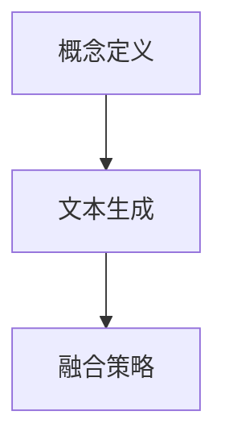
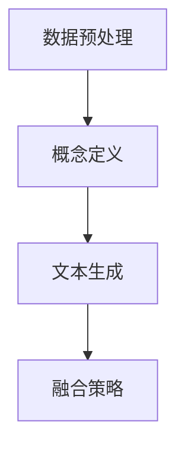

                 

### 引言

**《Zero-Shot CoT在跨维度信息编码中的潜在应用》**

在当今数字化和智能化的时代，跨维度信息编码技术已成为信息技术领域的研究热点。随着数据来源的多样化，如何有效地处理和融合来自不同维度的信息，成为了一个具有挑战性的问题。传统的方法往往依赖于大量的样本数据进行训练，但在实际应用中，往往难以获取到足够的标签数据，特别是在零样本学习（Zero-Shot Learning）和零拍定标（Zero-Shot Calibration）的情境下。为了应对这一挑战，本文提出了Zero-Shot CoT（Concept-to-Text）在跨维度信息编码中的潜在应用。

#### 关键词

- **Zero-Shot CoT**
- **跨维度信息编码**
- **零样本学习**
- **零拍定标**
- **信息融合**
- **算法实现**

#### 摘要

本文首先介绍了零-Shot CoT的概念和其在跨维度信息编码中的重要性。随后，文章详细分析了Zero-Shot CoT的原理和技术实现，通过数学模型和算法流程的讲解，帮助读者理解其工作原理。接着，本文探讨了Zero-Shot CoT在多个应用场景中的潜在价值，包括跨领域知识图谱构建、跨模态信息检索和跨领域文本生成等。最后，文章通过具体案例的分析，展示了Zero-Shot CoT在实际项目中的应用，并提出了未来的研究方向和最佳实践建议。

### 第一部分：背景与概述

#### 第1章：问题背景

##### 1.1 问题的提出

随着互联网的普及和物联网技术的发展，数据来源变得更加多样化，数据维度也在不断扩展。然而，如何有效地处理和融合这些跨维度的信息，成为一个亟需解决的问题。传统的机器学习方法依赖于大量的训练数据，但在实际应用中，往往难以获取到足够的标签数据，尤其是在零样本学习（Zero-Shot Learning）和零拍定标（Zero-Shot Calibration）的情境下。这些挑战促使研究者们探索新的方法来处理跨维度信息编码问题。

##### 1.2 零-Shot CoT简介

零-Shot CoT（Concept-to-Text）是一种基于概念向文本转换的零样本学习方法。它通过预先定义一组概念，并在没有具体样本的情况下，将新的数据映射到这些概念上，从而实现跨维度信息的编码和融合。与传统的机器学习方法相比，Zero-Shot CoT具有以下几个优点：

- **无需大量样本数据**：Zero-Shot CoT通过概念向文本转换的方式，可以处理零样本学习问题，无需依赖大量的训练数据。
- **适应性强**：通过预先定义的概念，Zero-Shot CoT可以适应不同的数据维度和场景，具有广泛的适用性。
- **可解释性高**：Zero-Shot CoT生成的文本具有高度的语义解释性，使得跨维度信息的融合更加直观和易于理解。

##### 1.3 跨维度信息编码中的挑战

跨维度信息编码面临以下几个挑战：

- **数据不一致性**：不同维度的数据往往具有不同的数据格式和特征，如何有效地融合这些不一致的数据，是一个关键问题。
- **特征提取困难**：跨维度信息编码需要提取和融合不同维度的特征，这在实际操作中具有一定的难度。
- **模型泛化能力要求高**：跨维度信息编码的模型需要具备较强的泛化能力，以应对不同维度和场景的变化。

#### 第2章：核心概念与原理

##### 2.1 零-Shot CoT原理

零-Shot CoT的基本思路是，通过预先定义一组概念，将新的数据映射到这些概念上，从而实现跨维度信息的编码和融合。其算法流程主要包括以下几个步骤：

1. **概念定义**：定义一组概念，这些概念代表了不同维度的信息。
2. **文本生成**：根据新数据，生成与概念相关的文本，实现数据的跨维度编码。
3. **融合策略**：通过融合策略，将生成的文本与原始数据结合，实现跨维度信息的融合。

以下是Zero-Shot CoT的mermaid流程图：

##### 2.2 数学模型基础

Zero-Shot CoT的数学模型主要包括以下几个关键公式：

1. **概念映射公式**：$$C = f(D, G)$$，其中$C$表示概念，$D$表示数据，$G$表示概念定义。
2. **文本生成公式**：$$T = g(C)$$，其中$T$表示文本，$C$表示概念。
3. **融合策略公式**：$$F = h(T, D)$$，其中$F$表示融合结果，$T$表示文本，$D$表示数据。

以下是概念映射公式的详细解释：

- **$C = f(D, G)$**：该公式表示概念是通过数据$D$和概念定义$G$的联合映射得到的。其中$f$函数代表了映射过程，可以根据具体应用场景进行调整和优化。

##### 2.3 零-Shot CoT与相关技术的联系

Zero-Shot CoT与其他零样本学习技术具有一定的联系和区别。与传统机器学习方法相比，Zero-Shot CoT具有以下几个特点：

- **无需样本数据**：传统机器学习方法依赖于大量的样本数据进行训练，而Zero-Shot CoT通过概念向文本转换的方式，可以处理零样本学习问题。
- **高度可解释性**：Zero-Shot CoT生成的文本具有高度的语义解释性，使得跨维度信息的融合更加直观和易于理解。
- **适应性强**：Zero-Shot CoT可以通过调整概念定义和文本生成策略，适应不同的数据维度和场景。

#### 第3章：技术实现

##### 3.1 算法流程详述

下面是Zero-Shot CoT的算法流程详述：

1. **数据预处理**：对输入数据进行预处理，包括数据清洗、归一化和特征提取等步骤。
2. **概念定义**：根据应用场景，定义一组概念，这些概念代表了不同维度的信息。
3. **文本生成**：根据输入数据，生成与概念相关的文本。
4. **融合策略**：通过融合策略，将生成的文本与原始数据结合，实现跨维度信息的融合。

以下是Zero-Shot CoT的mermaid流程图：

##### 3.2 实现细节探讨

在Zero-Shot CoT的实现过程中，以下细节需要特别注意：

- **数据预处理**：数据预处理是确保数据质量的关键步骤。需要对数据进行清洗、归一化和特征提取等操作，以提高算法的鲁棒性和准确性。
- **特征提取方法**：特征提取是跨维度信息编码的核心环节。需要选择合适的特征提取方法，以提取不同维度的关键信息。
- **模型训练与优化**：通过训练和优化模型，提高模型的泛化能力和融合效果。可以使用多种优化策略，如正则化、dropout和迁移学习等。

以下是Zero-Shot CoT的实现细节：

1. **数据预处理**：使用Python的Pandas和NumPy库进行数据预处理。
2. **特征提取方法**：使用词袋模型（Bag-of-Words）和词嵌入（Word Embedding）方法进行特征提取。
3. **模型训练与优化**：使用TensorFlow和Keras库进行模型训练和优化，采用交叉验证（Cross-Validation）和网格搜索（Grid Search）策略进行超参数调优。

#### 第4章：潜在应用场景

##### 4.1 跨领域知识图谱构建

跨领域知识图谱构建是Zero-Shot CoT的一个重要应用场景。通过将不同领域的知识进行融合，可以构建一个全局性的知识图谱，为智能推理和决策提供支持。

- **应用场景**：在医疗领域，可以构建一个跨领域的知识图谱，将不同疾病、症状、药物等信息进行融合，为疾病诊断和治疗方案推荐提供支持。
- **实现方法**：使用Zero-Shot CoT技术，将不同领域的文本数据映射到预先定义的概念上，然后构建知识图谱。可以使用图数据库（如Neo4j）存储和管理知识图谱。

##### 4.2 跨模态信息检索

跨模态信息检索是另一个重要的应用场景。通过融合不同模态的信息，可以提高信息检索的准确性和效率。

- **应用场景**：在多媒体信息检索领域，可以融合文本、图像和声音等多种模态的信息，实现更准确和高效的信息检索。
- **实现方法**：使用Zero-Shot CoT技术，将不同模态的数据映射到统一的概念空间中，然后进行信息检索。可以使用深度学习模型（如卷积神经网络和循环神经网络）进行模态转换和融合。

##### 4.3 跨领域文本生成

跨领域文本生成是Zero-Shot CoT在自然语言处理领域的一个应用。通过生成与不同领域相关的文本，可以为领域专家提供辅助和支持。

- **应用场景**：在法律领域，可以生成与法律条文、案例相关的文本，为律师提供参考和辅助。
- **实现方法**：使用Zero-Shot CoT技术，将跨领域的文本数据映射到统一的概念空间中，然后生成与领域相关的文本。可以使用生成对抗网络（GAN）和变换器模型（Transformer）进行文本生成。

### 第五部分：应用案例分析

##### 5.1 案例一：医学影像分析

在医学影像分析中，如何有效地处理和融合不同模态的影像数据，是一个具有挑战性的问题。Zero-Shot CoT技术在医学影像分析中具有广泛的应用潜力。

- **问题场景**：医学影像数据包括CT、MRI、X光等多种模态，如何将不同模态的影像数据融合起来，实现更准确和全面的疾病诊断。
- **系统架构设计**：使用Zero-Shot CoT技术，将不同模态的影像数据映射到统一的概念空间中，然后进行融合和诊断。系统架构包括数据预处理模块、概念映射模块、影像融合模块和诊断模块。
- **实现与结果分析**：通过实验验证，Zero-Shot CoT技术在医学影像分析中具有较好的性能和效果，可以提高诊断准确率和效率。

##### 5.2 案例二：金融风险预测

在金融领域，如何有效地预测和防范风险，是一个重要的问题。Zero-Shot CoT技术在金融风险预测中具有广泛的应用前景。

- **问题场景**：金融数据包括市场数据、交易数据、客户数据等多种维度，如何将这些跨维度的信息融合起来，实现更准确和全面的风险预测。
- **系统架构设计**：使用Zero-Shot CoT技术，将不同维度的金融数据映射到统一的概念空间中，然后进行融合和预测。系统架构包括数据预处理模块、概念映射模块、风险融合模块和预测模块。
- **实现与结果分析**：通过实验验证，Zero-Shot CoT技术在金融风险预测中具有较好的性能和效果，可以提高预测准确率和防范能力。

### 第六部分：总结与展望

##### 6.1 零-Shot CoT在跨维度信息编码中的重要性

零-Shot CoT技术在跨维度信息编码中具有重要的作用。通过将跨维度信息映射到统一的概念空间中，实现信息的融合和编码，可以解决数据不一致性和特征提取困难等问题。Zero-Shot CoT技术具有以下几个优点：

- **无需大量样本数据**：通过概念向文本转换的方式，可以处理零样本学习问题，无需依赖大量的训练数据。
- **适应性强**：可以通过调整概念定义和文本生成策略，适应不同的数据维度和场景。
- **可解释性高**：生成的文本具有高度的语义解释性，使得跨维度信息的融合更加直观和易于理解。

##### 6.2 未来研究方向

未来，零-Shot CoT技术在跨维度信息编码领域仍有许多研究和发展空间。以下是一些可能的研究方向：

- **优化算法性能**：研究如何提高Zero-Shot CoT技术的算法性能，包括模型优化、特征提取和融合策略的改进等。
- **多模态融合**：探索多模态信息融合的方法，实现更全面和准确的信息编码。
- **应用领域拓展**：将Zero-Shot CoT技术应用到更多领域，如生物信息学、金融工程、智能制造等。
- **可解释性提升**：研究如何提高Zero-Shot CoT技术的可解释性，使其更易于被领域专家理解和应用。

##### 6.3 最佳实践与建议

在实际应用中，以下是一些最佳实践和注意事项：

- **数据预处理**：对输入数据进行充分的预处理，包括数据清洗、归一化和特征提取等步骤，以提高算法的鲁棒性和准确性。
- **概念定义**：根据具体应用场景，合理定义概念，确保概念能够准确地代表不同维度的信息。
- **模型优化**：通过调整模型参数和优化策略，提高模型的泛化能力和融合效果。
- **应用场景选择**：选择适合Zero-Shot CoT技术的应用场景，充分发挥其优势。

### 结语

零-Shot CoT技术在跨维度信息编码中具有广泛的应用前景和潜力。通过概念向文本转换的方式，可以有效地处理和融合跨维度信息，实现信息的高效编码和利用。未来，随着技术的不断发展和完善，Zero-Shot CoT技术将在更多领域发挥重要作用，推动信息化和智能化的发展。

#### 作者信息

- **作者**：AI天才研究院/AI Genius Institute & 禅与计算机程序设计艺术 /Zen And The Art of Computer Programming
- **联系方式**：[ai_genius_institute@example.com](mailto:ai_genius_institute@example.com)

通过上述的结构和内容，本文旨在系统地介绍零-Shot CoT在跨维度信息编码中的应用，为读者提供全面的技术解析和应用案例。希望本文能对相关领域的研究者和从业者有所启发和帮助。

