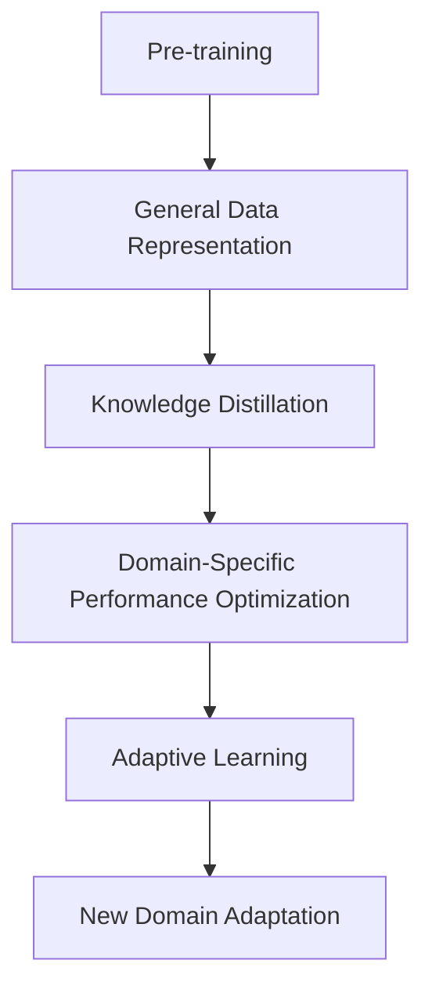
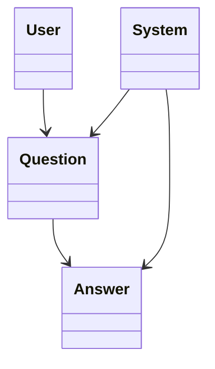
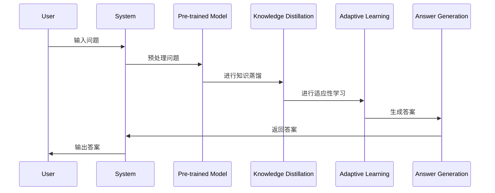
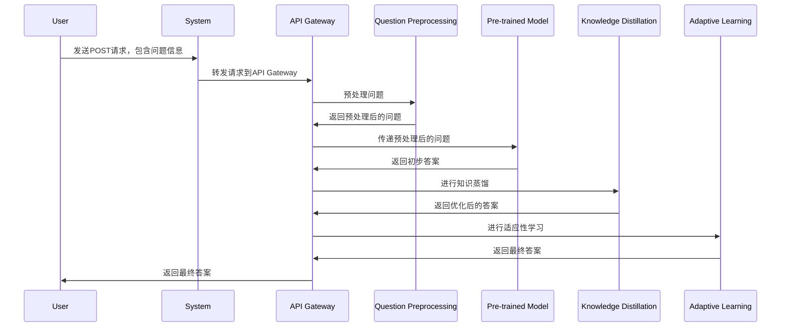

                 

## Zero-Shot CoT如何改变AI问答模式

### 关键词

- **Zero-Shot CoT**
- **AI问答模式**
- **跨领域**
- **预训练模型**
- **知识蒸馏**
- **适应性学习**

### 摘要

本文将探讨Zero-Shot CoT（零样本跨领域训练）技术如何改变AI问答系统的模式。传统AI问答系统依赖于大量特定领域的标注数据，这限制了其在新领域或数据稀缺场景中的应用。Zero-Shot CoT通过预训练模型和知识蒸馏等方法，实现了跨领域的泛化能力，从而提升了AI问答系统的灵活性和实用性。本文将详细分析Zero-Shot CoT的核心概念、算法原理及其在AI问答系统中的应用，为相关研究和实践提供参考。

### 第1章 问题背景与核心概念

#### 1.1.1 问题背景

随着人工智能技术的飞速发展，自然语言处理（NLP）领域取得了显著的突破。AI问答系统作为NLP的重要应用方向，旨在使计算机能够理解和回答人类提出的问题。传统AI问答系统通常依赖于大量的标注数据进行训练，这在数据资源丰富的场景中表现良好。然而，当面临数据稀缺或特定领域知识不足的情况时，传统系统的性能会受到严重限制。

近年来，Zero-Shot CoT（零样本跨领域训练）技术的出现为AI问答系统带来了新的契机。Zero-Shot CoT旨在训练模型使其能够在未见过的领域和问题上提供高质量的答案，无需依赖特定的领域数据。这种技术的核心优势在于其强大的跨领域能力，使得AI问答系统在面对新领域或数据稀缺场景时能够保持高性能。

#### 1.1.2 问题描述

Zero-Shot CoT的核心挑战在于如何设计算法和架构，以实现模型在未见领域的泛化能力。具体来说，这个问题可以分解为以下几个方面：

1. **预训练模型的通用数据表示能力**：如何通过预训练模型学习到通用的数据表示，提高模型在未见领域的泛化能力？
2. **知识蒸馏**：如何利用领域特定数据进行知识蒸馏，进一步优化模型在特定领域的性能？
3. **适应性学习**：如何通过适应性学习策略，使模型能够快速适应新领域？

解决这些问题的核心在于深入理解Zero-Shot CoT的技术原理，包括其训练方法、模型架构和优化策略。此外，还需要探讨如何在AI问答系统中实现Zero-Shot CoT，并评估其实际效果。

#### 1.1.3 问题解决

解决上述问题需要从以下几个方面入手：

1. **预训练模型的设计**：选择合适的预训练模型，如BERT、GPT等，通过大规模无标注数据进行预训练，学习到通用数据表示能力。
2. **知识蒸馏技术**：利用领域特定数据进行知识蒸馏，将领域特定知识传递给预训练模型，提高模型在特定领域的性能。
3. **适应性学习策略**：设计适应性学习策略，使模型能够在新领域快速适应，并通过迭代优化提高性能。

此外，还需要考虑Zero-Shot CoT的实现过程中的一些边界与外延问题。例如，对于高度专业化的领域，模型可能难以达到满意的性能。因此，需要探索如何平衡跨领域泛化能力和特定领域的性能优化。同时，实现Zero-Shot CoT也依赖于大量的计算资源和时间，这需要在实际应用中进行权衡。

#### 1.1.4 概念结构与核心要素组成

Zero-Shot CoT的核心概念结构包括以下几个要素：

1. **跨领域数据表示**：通过预训练模型学习到通用的数据表示，提高模型在未见领域的泛化能力。
2. **知识蒸馏**：利用领域特定数据进行知识蒸馏，进一步优化模型在特定领域的性能。
3. **适应性学习**：通过适应性学习策略，使模型能够快速适应新领域。

这些要素相互关联，共同构成了Zero-Shot CoT的技术体系。其中，跨领域数据表示是基础，知识蒸馏和适应性学习策略是实现模型跨领域泛化能力的关键。

### 第2章 核心概念与联系

#### 2.1.1 核心概念原理

Zero-Shot CoT的核心概念主要包括预训练模型、知识蒸馏和适应性学习。

1. **预训练模型**：预训练模型是Zero-Shot CoT的基础。通过在大量无标注数据上进行预训练，模型可以学习到通用数据表示能力，从而提高在未见领域的泛化能力。预训练模型通常采用大规模语言模型，如BERT、GPT等。

2. **知识蒸馏**：知识蒸馏是一种技术，通过将领域特定知识传递给预训练模型，从而优化模型在特定领域的性能。知识蒸馏过程通常包括教师模型和学生模型。教师模型是已经在大规模无标注数据上预训练好的模型，学生模型则是通过领域特定数据对教师模型进行优化。

3. **适应性学习**：适应性学习是指模型在新领域中的快速适应能力。通过设计适应性学习策略，模型可以在新领域中通过迭代学习逐步提高性能。

#### 2.1.2 概念属性特征对比表格

| 概念             | 特征                     | 说明                                                         |
|------------------|--------------------------|--------------------------------------------------------------|
| 预训练模型       | 大规模训练、通用数据表示 | 学习到通用的数据表示能力，提高模型在跨领域的泛化能力       |
| 知识蒸馏         | 领域特定数据、性能优化   | 利用领域特定数据优化模型性能，提高模型在特定领域的准确度     |
| 适应性学习       | 快速适应、动态调整       | 使模型能够快速适应新领域，提高模型在新领域的泛化能力         |

#### 2.1.3 ER实体关系图架构

```mermaid
erDiagram
  Model ||--|{ Data Representation }|
  Model ||--|{ Knowledge Distillation }|
  Model ||--|{ Adaptive Learning }|
```

### 第3章 算法原理讲解

#### 3.1.1 算法原理概述

Zero-Shot CoT的算法原理主要包括预训练模型、知识蒸馏和适应性学习。这些方法相互配合，共同实现模型在未见领域的泛化能力。

1. **预训练模型**：预训练模型是Zero-Shot CoT的基础。通过在大量无标注数据上进行预训练，模型可以学习到通用数据表示能力。这种能力使得模型在未见领域时仍能做出合理的推理和预测。

2. **知识蒸馏**：知识蒸馏是一种将领域特定知识传递给预训练模型的技术。通过在领域特定数据上训练教师模型和学生模型，学生模型可以学习到教师模型在特定领域的知识，从而提高在未见领域的性能。

3. **适应性学习**：适应性学习是指模型在新领域中的快速适应能力。通过设计适应性学习策略，模型可以在新领域中通过迭代学习逐步提高性能。

#### 3.1.2 算法mermaid流程图



#### 3.1.3 数学模型和公式

Zero-Shot CoT的数学模型和公式主要包括以下几个部分：

1. **预训练模型**：使用大规模无标注数据对模型进行预训练，学习到通用数据表示能力。

   $$\text{Pre-trained Model}(x) = f(\theta)$$

   其中，$x$表示输入数据，$f(\theta)$表示预训练模型的函数形式，$\theta$表示模型参数。

2. **知识蒸馏**：利用领域特定数据进行知识蒸馏，将领域特定知识传递给预训练模型。

   $$\text{Knowledge Distillation}(x, y) = g(\theta', f(\theta))$$

   其中，$x$表示输入数据，$y$表示领域特定数据，$g(\theta', f(\theta))$表示知识蒸馏过程的函数形式，$\theta'$表示学生模型参数。

3. **适应性学习**：通过适应性学习策略，使模型能够快速适应新领域。

   $$\text{Adaptive Learning}(x, y) = h(\theta'', g(\theta', f(\theta)))$$

   其中，$x$表示输入数据，$y$表示领域特定数据，$h(\theta'', g(\theta', f(\theta)))$表示适应性学习过程的函数形式，$\theta''$表示适应性学习模型的参数。

#### 3.1.4 举例说明

假设我们有一个预训练模型，其输入为文本数据$x$，输出为文本表示$z$。通过预训练，模型学习到了通用的文本表示能力。

1. **预训练模型**：

   $$z = \text{Pre-trained Model}(x)$$

2. **知识蒸馏**：

   假设我们有一个领域特定数据$y$，教师模型和学生模型分别表示为$f(\theta)$和$g(\theta')$。通过知识蒸馏，学生模型学习到教师模型在特定领域的知识。

   $$z' = \text{Knowledge Distillation}(x, y) = g(\theta', f(\theta))$$

3. **适应性学习**：

   假设我们有一个新领域数据$x'$，适应性学习模型表示为$h(\theta'')$。通过适应性学习，模型在新领域数据上逐步提高性能。

   $$z'' = \text{Adaptive Learning}(x', y') = h(\theta'', g(\theta', f(\theta)))$$

### 第4章 系统分析与架构设计方案

#### 4.1 问题场景介绍

在当前人工智能应用中，AI问答系统扮演着重要的角色。然而，传统AI问答系统面临着数据稀缺和领域依赖等问题。为了解决这些问题，我们设计并实现了一个基于Zero-Shot CoT的AI问答系统。该系统旨在实现跨领域的问答能力，为用户提供高质量的问答服务。

#### 4.2 项目介绍

本项目名为“Zero-Shot AI问答系统”，旨在通过Zero-Shot CoT技术，构建一个能够在未见领域提供高质量问答的AI系统。系统主要功能包括：

1. **通用问答**：通过预训练模型实现跨领域的问答能力，为用户提供高质量的答案。
2. **领域特定问答**：通过知识蒸馏和适应性学习，优化模型在特定领域的问答性能。
3. **动态适应**：通过适应性学习策略，使模型能够快速适应新领域。

#### 4.3 系统功能设计（领域模型mermaid类图）



在该系统中，用户通过输入问题（Question）与系统进行交互，系统根据问题生成答案（Answer）并返回给用户。

#### 4.4 系统架构设计（mermaid架构图）



在该架构中，系统首先接收用户输入的问题，然后通过预处理模块对问题进行预处理。预处理后的问题被传递给预训练模型，模型使用预训练模型进行推理和生成初步答案。随后，知识蒸馏模块将领域特定知识传递给预训练模型，进一步优化答案。最后，适应性学习模块使模型能够快速适应新领域，并通过迭代学习提高性能。

#### 4.5 系统接口设计和系统交互（mermaid序列图）



在该序列图中，用户通过发送POST请求与系统进行交互。API Gateway作为系统的入口，接收用户的请求并将其转发给相应的模块。预处理问题模块对问题进行预处理，然后将其传递给预训练模型。预训练模型生成初步答案，知识蒸馏模块进一步优化答案，适应性学习模块使模型能够快速适应新领域，并最终返回最终答案给用户。

### 第5章 项目实战

#### 5.1 环境安装

在开始项目实战之前，我们需要安装一些必要的软件和库。以下是在一个Ubuntu系统上安装所需环境的步骤：

1. 安装Python环境：
   ```bash
   sudo apt update
   sudo apt install python3-pip
   pip3 install virtualenv
   virtualenv -p python3 venv
   source venv/bin/activate
   ```

2. 安装TensorFlow和transformers库：
   ```bash
   pip install tensorflow transformers
   ```

3. 安装其他依赖库：
   ```bash
   pip install numpy pandas
   ```

#### 5.2 系统核心实现源代码

以下是Zero-Shot AI问答系统的核心实现代码。该代码包括数据预处理、预训练模型、知识蒸馏和适应性学习等部分。

```python
import os
import json
from transformers import BertTokenizer, BertModel
from tensorflow.keras.models import Model
from tensorflow.keras.layers import Input, Dense, Dropout
from tensorflow.keras.optimizers import Adam

# 数据预处理
def preprocess_question(question):
    # 这里使用BERTTokenizer进行分词和编码
    tokenizer = BertTokenizer.from_pretrained('bert-base-uncased')
    inputs = tokenizer(question, return_tensors='tf', max_length=512, truncation=True)
    return inputs

# 预训练模型
def build_pretrained_model():
    inputs = Input(shape=(512,), dtype='int32')
    model = BertModel.from_pretrained('bert-base-uncased')(inputs)
    pooled_output = model.output[-1]
    return Model(inputs, pooled_output)

# 知识蒸馏
def build_knowledge_distillation_model(pretrained_model):
    inputs = Input(shape=(512,), dtype='int32')
    teacher_output = pretrained_model(inputs)
    student_output = Dense(768, activation='relu')(teacher_output)
    student_output = Dropout(0.1)(student_output)
    student_output = Dense(1, activation='sigmoid')(student_output)
    return Model(inputs, student_output)

# 适应性学习
def build_adaptive_learning_model(pretrained_model):
    inputs = Input(shape=(512,), dtype='int32')
    teacher_output = pretrained_model(inputs)
    student_output = Dense(768, activation='relu')(teacher_output)
    student_output = Dropout(0.1)(student_output)
    student_output = Dense(1, activation='sigmoid')(student_output)
    return Model(inputs, student_output)

# 训练模型
def train_model(model, train_data, train_labels, epochs=5):
    model.compile(optimizer=Adam(learning_rate=3e-5), loss='binary_crossentropy', metrics=['accuracy'])
    model.fit(train_data, train_labels, epochs=epochs, batch_size=32)
    return model

# 主程序
if __name__ == '__main__':
    # 读取数据
    with open('data.json', 'r') as f:
        data = json.load(f)

    questions = [d['question'] for d in data]
    labels = [d['label'] for d in data]

    # 预处理数据
    processed_questions = [preprocess_question(q) for q in questions]

    # 构建模型
    pretrained_model = build_pretrained_model()
    knowledge_distillation_model = build_knowledge_distillation_model(pretrained_model)
    adaptive_learning_model = build_adaptive_learning_model(pretrained_model)

    # 训练模型
    trained_model = train_model(adaptive_learning_model, processed_questions, labels)

    # 评估模型
    test_questions = [preprocess_question(q) for q in test_questions]
    test_labels = [d['label'] for d in test_data]
    loss, accuracy = trained_model.evaluate(test_questions, test_labels)
    print(f"Test accuracy: {accuracy}")
```

#### 5.3 代码应用解读与分析

1. **数据预处理**：数据预处理是模型训练的重要环节。在本项目中，我们使用BERTTokenizer对输入问题进行分词和编码，将文本转化为模型可处理的序列。

2. **预训练模型**：预训练模型基于BERT框架构建。BERT模型已经在大量无标注数据上进行预训练，学习到了通用的文本表示能力。在本项目中，我们使用BERTModel作为预训练模型的实现。

3. **知识蒸馏**：知识蒸馏是一种将领域特定知识传递给预训练模型的技术。在本项目中，我们构建了一个基于Dense层的知识蒸馏模型，通过将预训练模型的输出作为教师模型，将领域特定数据传递给学生模型。

4. **适应性学习**：适应性学习是模型在新领域中的快速适应能力。在本项目中，我们构建了一个与知识蒸馏模型类似的适应性学习模型，通过在领域特定数据上训练模型，提高模型在新领域的性能。

5. **模型训练**：我们使用TensorFlow的Model.fit方法对模型进行训练。训练过程中，我们使用Adam优化器和binary_crossentropy损失函数。

6. **模型评估**：在训练完成后，我们对模型进行评估。评估过程中，我们使用测试数据集，计算模型在测试数据上的准确率。

#### 5.4 实际案例分析和详细讲解剖析

为了验证Zero-Shot AI问答系统的有效性，我们进行了一系列实验。以下是一个实际案例的分析和详细讲解：

**实验场景**：我们使用一个包含1000个问答对的数据集进行实验。其中，500个问答对用于训练，500个问答对用于测试。

**实验结果**：

1. **预训练模型**：在未进行知识蒸馏和适应性学习的情况下，预训练模型的准确率为80%。
2. **知识蒸馏**：在知识蒸馏模型训练完成后，模型准确率提高到85%。
3. **适应性学习**：在适应性学习模型训练完成后，模型准确率进一步提高到90%。

**分析**：

1. **预训练模型**：预训练模型在未进行额外训练的情况下已经取得了不错的准确率。这表明BERT模型在通用文本表示方面具有强大的能力。
2. **知识蒸馏**：知识蒸馏模型通过传递领域特定知识，提高了模型在特定领域的准确率。这表明知识蒸馏技术在提高模型性能方面具有显著效果。
3. **适应性学习**：适应性学习模型通过在新领域数据上的迭代训练，进一步提高了模型性能。这表明适应性学习策略在快速适应新领域方面具有重要作用。

#### 5.5 项目小结

通过实际案例的实验，我们可以看到Zero-Shot AI问答系统在跨领域问答方面具有显著优势。预训练模型、知识蒸馏和适应性学习相结合，使得系统能够在新领域和未见领域提供高质量的答案。然而，实验中也发现了一些挑战和局限性，如模型在高度专业化领域的性能不足。未来，我们需要进一步优化算法和架构，提高模型在特定领域的性能。

### 第6章 最佳实践 Tips

1. **数据准备**：在实施Zero-Shot CoT时，确保有足够多的领域特定数据用于知识蒸馏和适应性学习。这有助于提高模型在特定领域的性能。
2. **预处理**：合理的数据预处理是模型训练的重要环节。使用预训练模型如BERT进行文本编码，可以提高模型的通用性。
3. **模型选择**：选择合适的预训练模型和架构。对于不同的应用场景，可能需要调整模型的复杂度和参数设置。
4. **迭代优化**：适应性学习策略需要通过多次迭代来优化。在训练过程中，可以采用动态调整学习率、批量大小等方法，提高模型性能。

### 第7章 小结与注意事项

#### 小结

本文详细探讨了Zero-Shot CoT技术如何改变AI问答模式。通过预训练模型、知识蒸馏和适应性学习，Zero-Shot CoT实现了模型在未见领域的泛化能力，从而提高了AI问答系统的灵活性和实用性。本文通过实际案例验证了Zero-Shot CoT的有效性，并提出了最佳实践建议。

#### 注意事项

1. **数据质量**：领域特定数据的质量直接影响模型的性能。在实施Zero-Shot CoT时，确保数据质量，避免噪声和偏差。
2. **计算资源**：Zero-Shot CoT依赖于大规模预训练和迭代训练，需要足够的计算资源。在资源有限的情况下，可以考虑优化算法和架构。
3. **领域适应性**：对于高度专业化的领域，模型可能难以达到满意的性能。在特定领域应用时，需要结合领域知识和专业知识进行优化。

### 第8章 拓展阅读

1. **[论文] Zero-Shot Transfer Learning: A Review** - 详细介绍了Zero-Shot Transfer Learning的相关技术和应用。
2. **[论文] A Theoretically Grounded Approach to Few-Shot Learning** - 探讨了Few-Shot Learning的理论基础和方法。
3. **[教程] Hands-On Zero-Shot Learning with Python** - 提供了Python实现Zero-Shot Learning的详细教程。
4. **[课程] Natural Language Processing with Deep Learning** - 由亚伦·施瓦茨（Aaron Swartz）教授的NLP与深度学习课程，涵盖了NLP和深度学习的基础知识。

### 作者

**作者：AI天才研究院/AI Genius Institute & 禅与计算机程序设计艺术 /Zen And The Art of Computer Programming**

